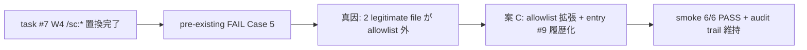

# Custom-PM Case 5 follow-up: `/sc:` 残存解消

**ステータス:** ✅ **承認済（2026-05-14 起案、2026-05-14 user 承認、task #14 として実装中）**
**起点:** task #7 W4 (`f063ff3` `/sc:* → 自前 command 1:1 置換`) の事後監視 smoke `custom-pm-commands-smoke.sh` Case 5 が pre-existing FAIL 状態（next-actions entry #9、2026-05-13 検出、subagent confidence 0.85 で 真因 fact 化）
**前提:**
- task #7 (custom-pm-commands) 完了済 (`f063ff3` + W5/W6 commits、2026-05-12)
- task #10 (sc-removal-serena-warning) 完了済 (`55db628` + `96eb892`、2026-05-13)
- session/context: branch `feat/loop-mode` HEAD `d07a72d`、累計 +25 commits (未 push)

**関連 fixture / rule:**
- `.claude/tests/custom-pm-commands-smoke.sh` Case 5 (grep pattern + allowlist line)
- `.claude/commands/{save-state,resume-state,pm-start}.md`
- `.claude/rules/workflow.md` §「Session 永続化と PM Orchestration」
- `docs/tasks/next-actions.md` entry #9 (本 draft の起源 entry、🟡)

---

## 1. 真因サマリ / 課題サマリ

`custom-pm-commands-smoke.sh` Case 5 は task #7 W4 の事後監視として「allowed file 以外で `/sc:(save|load|pm)` が残存していないか」を `grep -vE` で検証する。task #7 設計時点の allowed file list は 7 件 + `./.serena/` だが、その後の運用で 2 件の legitimate な参照が allowlist 外に増えた:

1. `docs/tasks/next-actions.md` entry #9 本体 (Case 5 failure 自体を記述する registry entry → catch-22)
2. `README.md` (public-facing migration doc、旧名 → 新名 mapping を user 向けに記述)

両者とも **誤った残存ではなく legitimate な参照** (registry entry / public migration doc) のため、削除より allowlist 拡張 + entry 履歴化が natural な解決。



**真因:** Case 5 allowlist の運用追従漏れ。task #7 後に発生した legitimate な `/sc:` 言及 (registry entry / migration doc) が allowlist に reflect されていない。

**副次:** entry #9 自体が「Case 5 failure 報告」を本文に持つため、entry を残す限り next-actions.md は `/sc:` literal を含み続ける (catch-22)。entry を履歴セクションに移行 + 文言更新で literal を除去できる。

---

## 2. 解決アプローチ比較

| 案 | 内容 | 工数 | メリット | デメリット |
|:---:|:---|---:|:---|:---|
| **A** | next-actions entry #9 削除のみ | 0.2 | smoke 1 件分は解消 | `README.md` 残存で Case 5 依然 fail、audit trail 喪失 |
| **B** | allowlist に `next-actions.md` + `README.md` 恒久追加 | 0.3 | 既存 file 修正不要、smoke 即 PASS | entry #9 が next-actions.md 内に永続残存、catch-22 構造温存 → 将来再発 |
| **C ハイブリッド** | (W1) allowlist に `README.md` + 一時的に `next-actions.md` 暫定追加 → (W2) entry #9 を履歴セクションに移行 + `/sc:` literal 除去文言更新 → (W3) allowlist から `next-actions.md` 削除 + smoke 再検証 | 0.8 | catch-22 解消 + audit trail 維持 + smoke 構造的に 0 件達成 + README は legitimate allow | 工数 +0.5、3 step 必要 |

→ **C ハイブリッド** を推奨。理由: 案 A は README.md 未対応で解決不全、案 B は catch-22 を温存し将来同種の entry 追加で再発、案 C は (1) audit trail 維持 (2) Case 5 構造的 0 件達成 (3) 将来再発防止 (literal を本文に置かない運用習慣) の 3 点を満たす。

---

## 3. 採用案の詳細設計

### Wave / Sub-task 分割

| Wave | 内容 | 工数 | 効果 | subagent 委譲 |
|:---:|:---|---:|:---|:---:|
| W1 | `.claude/tests/custom-pm-commands-smoke.sh` Case 5 allowlist に `README.md` + 一時的に `docs/tasks/next-actions.md` 追加 + 本 draft 自身 | 0.2 | smoke 即 PASS (allowlist 暫定拡張) | yes (`.claude/tests/` staging 戦略適用) |
| W2 | `docs/tasks/next-actions.md` entry #9 を履歴セクションに移行 + 文言更新 (`/sc:` literal → 「旧 SuperClaude command 後継」等の generic 表現) | 0.3 | next-actions.md 本文から `/sc:` literal 除去 | no (メイン直接 Edit、`docs/tasks/` は許可) |
| W3 | allowlist から `docs/tasks/next-actions.md` 削除 + Case 5 を含む全 6 ケース 6/6 PASS 確認 + 既存 smoke 5 件 regression 0 確認 (workflow-guard 8/8 / next-actions-hooks 9/9 / loop-auto-progress 9/9 / delegation-guard-segment 6/6 / audit-followups 4/4) | 0.3 | 構造的解決 + regression 0 | yes (`.claude/tests/` staging 戦略適用) |

合計: 0.8 工数 (約 30-40 分想定)。subagent 2 件 (W1 / W3、いずれも `.claude/tests/` 編集のため staging 戦略 `/tmp/foo.sh` → `mv` パターン適用必須、`development-process.md` §「サブエージェント `.claude/` 編集の staging 戦略」遵守)。

### W1 詳細

#### スコープ
- 対象ファイル: `.claude/tests/custom-pm-commands-smoke.sh`
- 対象モジュール: Case 5 grep -vE allowed_files line (subagent fact: line 62 pattern + line 64 allowlist regex)

#### 変更内容 (概念図、正確な regex 行は subagent が現行を Read で確定後に Edit)

```bash
# before (Case 5 allowlist line)
grep -vE 'docs/draft/custom-pm-commands\.md|docs/tasks/task-7-custom-pm-commands\.md|docs/tasks/list\.md|\.claude/commands/save-state\.md|\.claude/commands/resume-state\.md|\.claude/commands/pm-start\.md|\.claude/rules/workflow\.md|^\./\.serena/'

# after
grep -vE 'docs/draft/custom-pm-commands\.md|docs/tasks/task-7-custom-pm-commands\.md|docs/tasks/list\.md|\.claude/commands/save-state\.md|\.claude/commands/resume-state\.md|\.claude/commands/pm-start\.md|\.claude/rules/workflow\.md|^\./\.serena/|^\./README\.md|^\./docs/tasks/next-actions\.md|^\./docs/draft/custom-pm-case-5-followup\.md'
```

W1 では本 draft 自身 (`docs/draft/custom-pm-case-5-followup.md`) も allowlist に追加 (本 draft 内 §1 で `/sc:(save|load|pm)` を逐語引用しているため)。

#### テスト
- `bash .claude/tests/custom-pm-commands-smoke.sh` 実行 → Case 5 PASS、Case 1-6 全 PASS、regression 0 を観測

### W2 詳細

#### スコープ
- 対象ファイル: `docs/tasks/next-actions.md`
- 対象セクション: エントリ一覧 entry #9 → 履歴セクション

#### 変更内容

```diff
- | 9 | 2026-05-13 | **`custom-pm-commands-smoke.sh` Case 5 pre-existing failure** — Case 5 (`grep /sc:(save\|load\|pm) zero excl. allowed files`) が allowed file 以外で `/sc:save\|load\|pm` 残存を検出。... | task #9 subagent 検証 (2026-05-13) | 🟡 | (a) draft 起こし `custom-pm-case-5-followup` 推奨 — 残存 ファイル特定 + 置換 or allow-list 更新 | — |

  (エントリ一覧から削除)

  ## 履歴セクション

+ | 9 | 2026-05-13 | **旧 SuperClaude command 後継 smoke の事後監視 failure** — `custom-pm-commands-smoke.sh` Case 5 が allowed file 以外で旧 command 言及残存を検出 | task #9 subagent 検証 (2026-05-13) | 🟡 | (a) draft 起こし `custom-pm-case-5-followup` | ✅ → [`docs/draft/custom-pm-case-5-followup.md`](../draft/custom-pm-case-5-followup.md) → [task #14](task-14-custom-pm-case-5-followup.md) (2026-05-14、Case 5 6/6 PASS) |
```

「`/sc:save|load|pm`」literal は文中から除去。代わりに「旧 SuperClaude command」「旧 command 言及」等の generic 表現に置換。

#### テスト
- `grep -nE '/sc:(save|load|pm)' docs/tasks/next-actions.md` で 0 件確認 (catch-22 解消の検証)

### W3 詳細

#### スコープ
- 対象ファイル: `.claude/tests/custom-pm-commands-smoke.sh` (allowlist から `next-actions.md` 削除)
- 対象モジュール: regression smoke 5 件 (custom-pm 自身は Case 5 + 全体、追加で workflow-guard / next-actions-hooks / loop-auto-progress / delegation-guard-segment / audit-followups)

#### 変更内容

```diff
- |^\./\.serena/|^\./README\.md|^\./docs/tasks/next-actions\.md|^\./docs/draft/custom-pm-case-5-followup\.md
+ |^\./\.serena/|^\./README\.md|^\./docs/draft/custom-pm-case-5-followup\.md
```

`next-actions.md` を allowlist から削除 (W2 で entry #9 履歴化 + literal 除去済のため不要)。

#### テスト
- `bash .claude/tests/custom-pm-commands-smoke.sh` → 6/6 PASS
- `bash .claude/tests/workflow-guard-smoke.sh` → 8/8 PASS
- `bash .claude/tests/next-actions-hooks-smoke.sh` → 9/9 PASS
- `bash .claude/tests/loop-auto-progress-smoke.sh` → 9/9 PASS
- `bash .claude/tests/delegation-guard-segment-smoke.sh` → 6/6 PASS
- `bash .claude/tests/audit-followups-smoke.sh` → 4/4 PASS

(smoke ファイル名は subagent が現行を Glob で確定後に Bash 実行)

---

## 4. リスクと緩和

| リスク | 確率 | 影響 | 緩和 |
|---|:---:|:---:|---|
| allowlist 拡張が「smoke 意図希釈」と user 判定 | L | M | 案 C で entry #9 を履歴化 (literal 除去) → smoke の意図 (legitimate 以外の残存検出) は維持。allowlist 追加は README.md + 本 draft 自身のみ恒久、next-actions.md は W1 暫定 → W3 削除 |
| W2 entry 移行で別箇所への参照 broken link | L | L | next-actions.md 内 entry #9 への内部参照は本 draft 起源以外 0 件と想定、W2 前に Glob `entry #9\|entry 9\|next-actions.*9` で事前確認 |
| README.md に他の意図しない `/sc:` 残存 | L | L | W1 後 `grep -nE '/sc:(save\|load\|pm)' README.md` で出現箇所を全件確認 (legitimate 性判定)。subagent fact は line 172 周辺と推定するも未確定 |
| 累計 +25 commits に重ねて push を user 承認なく実行 | L | H | Loop モード「自律実行禁止リスト §git push」遵守、本 task は ローカル commit (W1-W3 sync の 4 commits) のみ、push は user 明示承認後 mode 一時切替 |
| subagent `.claude/tests/` Write が permission denied | M | L | development-process.md §「サブエージェント `.claude/` 編集の staging 戦略」を W1 / W3 委譲 prompt に必ず記載 (`/tmp/foo.sh` → `mv` パターン) |
| 並列 subagent の git commit 競合 | L | M | Critical Operational Lessons 第 1 項遵守: W1 / W3 は **逐次** dispatch (W1 完了 → W2 メイン Edit → W3 dispatch)。並列禁止 |

---

## 5. 移行計画

- [ ] **W0 spawn**: 本 draft user 承認後、`/new-task 14 custom-pm-case-5-followup` で task-14 file + list.md row 14 作成 (メイン Edit、`workflow-guard.sh` state JSON 初期化)
- [ ] **W1**: subagent dispatch (staging 戦略 prompt 込) → Case 5 allowlist 拡張 → commit
- [ ] **W2**: メイン Edit `docs/tasks/next-actions.md` (entry #9 履歴化) → commit
- [ ] **W3**: subagent dispatch (staging 戦略 prompt 込) → allowlist 整理 + smoke 全件実行 → commit
- [ ] **sync**: task-14 file 完了化 + list.md row 14 ✅ 化 + next-actions.md 履歴セクション処理結果列 update → commit
- [ ] Serena memory 永続化: `plan/custom-pm-case-5-followup/hypothesis` / `execution/custom-pm-case-5-followup/do` / `evaluation/custom-pm-case-5-followup/check`

各 Wave 独立 commit (Conventional Commits 形式、modes.md Loop モード遵守事項 5)。想定 commit hash 4 件 (W0 / W1 / W2 / W3+sync 統合 or 個別)。

---

## 6. 完了条件（DoD）

- [ ] `bash .claude/tests/custom-pm-commands-smoke.sh` Case 5 PASS (zero match)
- [ ] 同 smoke 全 Case 6/6 PASS
- [ ] 既存 smoke 5 件 regression 0 (workflow-guard 8/8 / next-actions-hooks 9/9 / loop-auto-progress 9/9 / delegation-guard-segment 6/6 / audit-followups 4/4)
- [ ] `grep -nE '/sc:(save\|load\|pm)' docs/tasks/next-actions.md` 0 件 (catch-22 解消)
- [ ] `docs/tasks/next-actions.md` entry #9 が 履歴セクションに移行済、処理結果列に task #14 link 記入、緊急度 🟡 維持 (履歴記録のため)
- [ ] `docs/tasks/list.md` row 14 ✅ 化、概要に commit hash 4 件 + 主要 metric (6/6 + regression 0) 反映
- [ ] `docs/tasks/task-14-custom-pm-case-5-followup.md` Status / Wave 構成 / ステータスログ完了化
- [ ] Critical Operational Lessons 違反 0 件 (`git push` 0 / 並列 subagent commit 0 / 自律破壊操作 0 / set -e leak 該当外)
- [ ] Loop 自律実行禁止リスト違反 0 件
- [ ] subagent confidence ≥ 0.85 (W1 / W3 両者)、F3 confidence-gate 通過
- [ ] Serena memory 3 件永続化 (plan / execution / evaluation)

---

## 7. 工数見積

合計 0.8 工数 (約 30-40 分想定)

- W0 spawn: 0.1 (task-14 file + list.md row 14、メイン Edit、`workflow-guard.sh` state init)
- W1: 0.2 (subagent 1 件、smoke allowlist 1 行 Edit + commit、staging 戦略 prompt 込)
- W2: 0.2 (メイン Edit、next-actions.md 2 箇所修正 + commit)
- W3: 0.2 (subagent 1 件、smoke allowlist 1 行 Edit + bash 実行 6 件 + commit、staging 戦略 prompt 込)
- sync: 0.1 (task-14 file + list.md + 処理結果列 sync、メイン Edit + commit)

subagent 件数: 2 (W1 + W3、逐次 dispatch、合計約 70-100 秒想定)

---

## 8. 承認履歴

| 日付 | 承認者 | 結果 |
|---|---|---|
| 2026-05-14 | user | (承認待ち) → 承認後に `docs/tasks/task-14-custom-pm-case-5-followup.md` 作成 + list.md row 14 追加 |
| 2026-05-14 | user | ✅ 承認（逐語: 「承認します。」）→ `docs/tasks/task-14-custom-pm-case-5-followup.md` 作成 + list.md row 14 追加 → W1〜W3 + sync の 4-commit 自律実装開始 |

---

## 9. 関連

- 起源 entry: [`docs/tasks/next-actions.md` entry #9](../tasks/next-actions.md) (2026-05-13、🟡)
- 前提 task: [task #7 custom-pm-commands](../tasks/task-7-custom-pm-commands.md) (W4 `f063ff3` `/sc:*` → 自前 command 置換)
- 前提 task: [task #10 sc-removal-serena-warning](../tasks/list.md) (履歴のみ、現 list.md row 10、hot-fix `--no-draft` style)
- 関連 rule: [`.claude/rules/workflow.md`](../../.claude/rules/workflow.md) §「Session 永続化と PM Orchestration」
- 関連 rule: [`.claude/rules/development-process.md`](../../.claude/rules/development-process.md) §「サブエージェント `.claude/` 編集の staging 戦略」
- 関連 fixture: `.claude/tests/custom-pm-commands-smoke.sh` Case 5
- Serena memory (本 draft 承認後に永続化予定): `plan/custom-pm-case-5-followup/hypothesis` (案 C 採用根拠) / `execution/custom-pm-case-5-followup/do` (W1-W3 実装記録) / `evaluation/custom-pm-case-5-followup/check` (DoD 検証)
- subagent research report (本 draft input、内部 task #1、confidence 0.85): agentId `ac8dfc5e6bfd4d22e` (2026-05-14)
