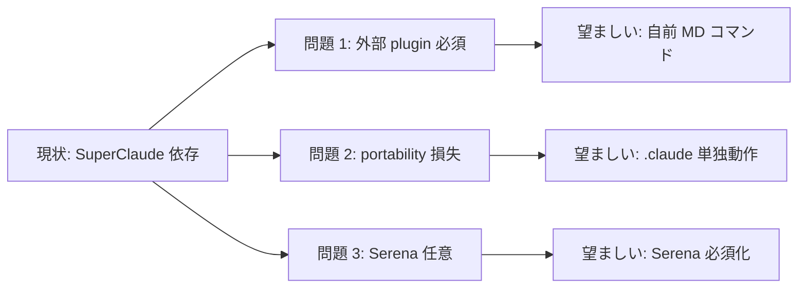

# Custom PM / Session Commands (SC 系コマンド自前実装 + Serena 必須化)

**ステータス:** 🔲 **draft (2026-05-12 起案、user 承認待ち)**
**起点:** user 依頼 (2026-05-12)「SC:save と SC:load, PM を自前実装してください。(コマンド名は別のものを利用) / MD のみらしいです。 / 既存の参照している箇所は全て置き換え / serenaの必須化 / セッション開始時に前回の作業を呼び出して続ける場合は 〇〇を実行してください。実行しますか?と表記してください。」

**前提:**
- task #6 (Loop Autonomous Discipline) 完了 + PR #3 で push 済
- Serena MCP が `.mcp.json` 登録済 (本セッション内で動作確認済)
- 既存 `/sc:save` `/sc:load` `/sc:pm` (SuperClaude 由来) の動作仕様を踏襲

**関連 fixture / rule:**
- `.claude/commands/save-state.md` (新規予定)
- `.claude/commands/resume-state.md` (新規予定)
- `.claude/commands/orchestrate.md` (新規予定)
- `.claude/hooks/mode-session-start.sh` (拡張対象)
- `.claude/hooks/context-budget.sh` (`/sc:save` 言及置換対象)
- `.claude/rules/modes.md` (context-budget 警告文の `/sc:save` 言及置換)
- `CLAUDE.md` (Autonomous Progression セクション + Commands テーブル)
- `.mcp.json` (Serena MCP required marker 検討)

---

## 1. 真因サマリ / 課題サマリ

HIRAI ハーネスは現在 SuperClaude の `/sc:save` `/sc:load` `/sc:pm` を session 永続化と PM orchestration に使用しているが、以下の構造的問題がある:



**真因 1 (依存)**: `/sc:save` `/sc:load` `/sc:pm` は SuperClaude plugin が前提。採用者が plugin 未導入だと `Skill` 呼出で fail、本来の中断耐性が機能しない。

**真因 2 (portability)**: SuperClaude は project-agnostic だが、本ハーネスの `.claude/` を単独移植したプロジェクトでは plugin 未注入の risk。`.claude/` portability の核心価値と衝突。

**真因 3 (永続化曖昧)**: `/sc:save` の動作は SuperClaude 内部実装に依存、Serena memory に書くか docs/temp/ に書くかが採用者から不透明。Serena 必須化で永続化 path を一元化すべき。

**副次 (UX)**: SessionStart 時に user が「前回の続きから作業する」かを毎回手動で `/sc:load` 入力する必要、prompt 化で UX 改善余地。

---

## 2. 解決アプローチ比較

| 案 | 内容 | 工数 | メリット | デメリット |
|:---:|:---|---:|:---|:---|
| **A 最小実装** | 3 markdown command 作成のみ、既存参照置換なし、Serena 任意 | 1.5 | 即着手可、影響小 | 既存 `/sc:*` 参照が混在、portability 改善不十分 |
| **B フル強制** | 3 command + Serena 必須化 + 既存参照全置換 + SessionStart resume prompt + `.mcp.json` required marker | 3.5 | portability 完成、UX 改善 | Serena 障害時の fallback 設計が必要 |
| **C ハイブリッド** | B の各 Wave 独立 deliver、Wave 失敗時に部分 rollback 可 | 3.5 | B と同等 + Wave 単位の検証分散 | Wave 順序整合性をメインが保証 |

→ **C ハイブリッド (B と同等の目標 + Wave 独立 deliver)** を推奨。理由:
- Wave W1 (3 command 作成) を最初に完了 → 単体動作確認できる
- W2-W4 (Serena 必須化 / SessionStart prompt / 既存参照置換) は W1 完了後に独立 deliver
- W5 smoke + W6 文書反映で総合検証
- task #1 #5 #6 で実証済の Wave-driven pattern と整合

---

## 3. 採用案の詳細設計

### Wave / Sub-task 分割

| Wave | 内容 | 工数 | 効果 |
|:---:|:---|---:|:---|
| **W1** | 3 markdown command 新設: `.claude/commands/save-state.md` / `resume-state.md` / `orchestrate.md` (Serena MCP 直接呼び出し含む) | 1.0 | 自前実装の core |
| **W2** | `.claude/hooks/mode-session-start.sh` 拡張: Serena `list_memories` で `session/context` 存在確認 + resume prompt 注入 | 0.5 | UX 改善 |
| **W3** | Serena 必須化: `.mcp.json` に required marker 追加 (Claude Code 仕様確認後、不可なら command 内 onboarding check で代用) + 全 command 内で `check_onboarding_performed` → `activate_project` 強制 | 0.5 | portability 完成 |
| **W4** | 既存参照置換: `CLAUDE.md` / `.claude/rules/modes.md` / `.claude/hooks/context-budget.sh` / docs/* / memory/* の `/sc:save` `/sc:load` `/sc:pm` を 1:1 置換 | 0.7 | 全 SSoT 同期 |
| **W5** | smoke test `.claude/tests/custom-pm-commands-smoke.sh`: 4-6 ケース (save → load round-trip / Serena 不在時 graceful / SessionStart prompt 注入 / 既存 grep 結果 0 件) | 0.5 | 機構検証 |
| **W6** | 文書反映: `CLAUDE.md` Commands テーブル更新 / `.claude/rules/workflow.md` に「Session 永続化」セクション追加 / next-actions entry #7 (`.claude/` 汎用化) 統合 | 0.3 | SSoT 整合 |

合計 **3.5h**

### W1 詳細

#### スコープ
- 対象ファイル (新規 3 件):
  - `.claude/commands/save-state.md`
  - `.claude/commands/resume-state.md`
  - `.claude/commands/orchestrate.md`

#### 各 command の役割 (markdown body 仕様)

**`/save-state` (`/sc:save` 後継)**:
- Serena `write_memory("session/context", <state>)` で完全状態 snapshot 保存
- `write_memory("session/last", <summary>)` で last session 要約
- `write_memory("session/checkpoint", <progress>)` で進捗 checkpoint
- `docs/temp/` への一時ファイル整理 (オプション)
- 完了報告: "Session saved to Serena memory. Resume with /resume-state"

**`/resume-state` (`/sc:load` 後継)**:
- Serena `check_onboarding_performed` → 未済なら error
- `activate_project` (project hash 自動検出)
- `list_memories` で `session/*` `plan/*` `learning/*` 存在確認
- 存在する key を逐次 `read_memory` で復元
- 復元レポート: 前回 / 進捗 / 次アクション / 課題 の 4 項目

**`/orchestrate` (`/sc:pm` 後継)**:
- Session Start Protocol (PM Agent と同等) を実行:
  1. `mcp__serena__check_onboarding_performed`
  2. `mcp__serena__list_memories` → `session/context` `session/last` 復元
  3. user request を分析、複雑度判定 (`brainstorm` / `direct` / `multi-agent` / `wave`)
  4. 適切な subagent に委譲
- PDCA cycle の Plan / Do / Check / Act 各段階で `write_memory` を実行

#### コマンド名衝突確認
- `/save-state` `/resume-state` `/orchestrate` は既存 commands 一覧と非衝突 (確認方法: `Glob .claude/commands/*.md`)

### W2 詳細

#### スコープ
- `.claude/hooks/mode-session-start.sh` 拡張 (既存 mode 表示処理は保持)

#### 変更内容
```bash
# 既存処理の後に append
# Serena memory に session/context が存在するか確認
if command -v jq >/dev/null 2>&1; then
  # Serena MCP は CLI 経由で list_memories 不可、stdin/Read 経由で確認
  # → 代替: ~/.claude/projects/<hash>/memory/ ディレクトリの存在を直接 stat
  PROJECT_HASH=$(git remote get-url origin 2>/dev/null | sha256sum | cut -c1-12)
  MEMORY_DIR="$HOME/.claude/projects/${PROJECT_HASH}/memory"
  if [ -f "$MEMORY_DIR/session_context.md" ]; then
    cat <<EOF
<system-reminder>
前回のセッション状態が見つかりました。続きから作業する場合は \`/resume-state\` を実行してください。

実行しますか?
- はい → \`/resume-state\` を入力
- いいえ → 新規 prompt で作業開始
</system-reminder>
EOF
  fi
fi
```

(注: Serena memory の物理 path は実装時に確認。`~/.claude/projects/<hash>/memory/` は推測、Serena 仕様で要 verify)

### W3 詳細

#### スコープ
- `.mcp.json` の `serena` entry に required marker (Claude Code 仕様で可能なら)
- 各 command 内で開始時に `mcp__serena__check_onboarding_performed` 必須実行

#### 不可時の代替
- `.mcp.json` の required marker が未サポートなら、各 command 冒頭で onboarding check + 未済時 error 出力で停止

### W4 詳細

#### 置換対象 (grep 想定)
- `CLAUDE.md`:
  - Autonomous Progression セクションの `/sc:save` 言及
  - Commands テーブルの SuperClaude 系 row
  - Implementation Status セクション
- `.claude/rules/modes.md`:
  - 遵守事項 6「Context 使用率の自動監視」内 `/sc:save` (3 箇所)
- `.claude/hooks/context-budget.sh`:
  - heredoc 内 `/sc:save` (4 箇所)
- `docs/draft/*.md` / `docs/tasks/*.md` / memory/*.md:
  - 言及多数、`/sc:save` → `/save-state`、`/sc:load` → `/resume-state`、`/sc:pm` → `/orchestrate` の 1:1 置換

#### 置換戦略
- subagent に `replace_all` 委譲 (主要ファイル毎)
- 検証 grep 後: 残存 0 件確認

### W5 詳細

#### テスト
- `.claude/tests/custom-pm-commands-smoke.sh`:
  - Case 1: `save-state` で Serena に書き込み → `list_memories` で key 確認
  - Case 2: `resume-state` で書き込んだ memory を read 復元
  - Case 3: Serena 不在環境で graceful error (exit 0 or 明示 message)
  - Case 4: SessionStart hook が Serena memory 存在時 prompt 注入、不在時 silent
  - Case 5: 既存参照 grep `/sc:(save|load|pm)` が 0 件 (置換完了確認)
  - Case 6: 新コマンド呼び出し時 onboarding 未済なら error

### W6 詳細

- `CLAUDE.md` Commands テーブル: `自前 PM / 永続化` row 新設、`/save-state` `/resume-state` `/orchestrate` 列挙
- `.claude/rules/workflow.md`: 「Session 永続化と PM Orchestration」セクション新設 (副産物 discharge / Loop モード自律規律 と同 pattern)
- `next-actions.md` entry #7 (`.claude/` 汎用化) の処理結果列に「→ task-7 で部分対応」追記

---

## 4. リスクと緩和

| リスク | 確率 | 影響 | 緩和 |
|---|:---:|:---:|---|
| Serena MCP 未注入環境で `/save-state` `/resume-state` fail | M | M | command 内 onboarding check + error message に Serena 導入手順を明示 |
| `.mcp.json` required marker が Claude Code 仕様で未サポート | M | L | command 内 check で代用 (実装複雑度 +0.1h) |
| 既存 `/sc:*` 参照置換漏れ → SuperClaude plugin 経由で動作するため stealth 化 | L | M | W5 smoke の grep 0 件 check で検出 |
| Serena memory key schema (`session/*` `plan/*` 等) と新コマンドの key 不整合 | L | M | PM Agent spec の key schema を継承、CLAUDE.md に明文化 |
| 新コマンド命名衝突 (`/orchestrate` 等) | L | L | `Glob .claude/commands/*.md` で事前確認 |
| SessionStart prompt の発火頻度過多 (毎セッション noise) | M | L | `session/context` 存在時のみ発火、user が「いいえ」選択時の state 記憶は実装複雑度大 → 初版は毎回表示 |

---

## 5. 移行計画

- [ ] W1: 3 markdown command 新設 → 単体動作確認 (Serena memory write/read)
- [ ] W2: SessionStart hook 拡張 → mock prompt 発火確認
- [ ] W3: Serena 必須化 → onboarding 未済時 error 動作確認
- [ ] W4: 既存参照置換 → grep `/sc:(save|load|pm)` が 0 件
- [ ] W5: smoke 6/6 PASS
- [ ] W6: 文書反映 → CLAUDE.md / workflow.md 整合確認
- [ ] PR #4 作成 (本 task の merge)
- [ ] 次セッション SessionStart で prompt 発火確認 (実環境テスト)
- [ ] 1 週間運用後の noise 評価 → tuning 判断

---

## 6. 完了条件 (DoD)

- [ ] `.claude/commands/save-state.md` / `resume-state.md` / `orchestrate.md` 3 ファイル新設
- [ ] 各 command が Serena MCP `check_onboarding_performed` を初手で実行
- [ ] `mode-session-start.sh` が前回 session memory 存在時に `<system-reminder>` で resume prompt 注入
- [ ] `grep -r '/sc:save\|/sc:load\|/sc:pm' .` が 0 件 (本 draft / 完了済 task 除く)
- [ ] `.claude/tests/custom-pm-commands-smoke.sh` 6/6 PASS
- [ ] CLAUDE.md Commands テーブルに 3 新コマンド追加、`/sc:*` 言及削除
- [ ] `.claude/rules/workflow.md` に「Session 永続化と PM Orchestration」セクション追加
- [ ] 既存 PR #3 を merge 後の連続セッションで `/orchestrate` 起動 → 前 session 復元成功

---

## 7. 工数見積

合計 **3.5h** (Wave 内訳: W1=1.0 / W2=0.5 / W3=0.5 / W4=0.7 / W5=0.5 / W6=0.3)。実装 90 分 + smoke + 文書 60 分。

---

## 8. 承認履歴

| 日付 | 承認者 | 結果 |
|---|---|---|
| 2026-05-12 | user | inline 提案 (4 要件 + 命名候補 + Wave 構成) を「問題ありません。A」で承認 → 本 draft 物化 |
| 2026-05-12 | user | 物化 draft §1-§9 全体を「承認します。」で最終承認 → `/new-task 7 custom-pm-commands` 起動 → W1-W6 実装着手 |

---

## 9. 関連

- 派生元: next-actions entry #7 (`.claude/` 汎用化リファクタ、本 task で部分対応)
- 既存実装: SuperClaude `/sc:save` `/sc:load` `/sc:pm` (本 task で置換対象)
- 関連 task: #6 (Loop Autonomous Discipline、本 task の前提)
- 関連 rule: [`development-process.md`](../../.claude/rules/development-process.md) 「設計→承認→タスク追加フロー」
- 関連 hook: [`mode-session-start.sh`](../../.claude/hooks/mode-session-start.sh) (W2 拡張対象)、[`context-budget.sh`](../../.claude/hooks/context-budget.sh) (W4 置換対象)
- 関連 MCP: Serena MCP (`.mcp.json` `serena` entry、必須化対象)
- 設計 reference: PM Agent Session Lifecycle (system prompt 内 `# auto memory` セクション + `/sc:pm` 仕様)
