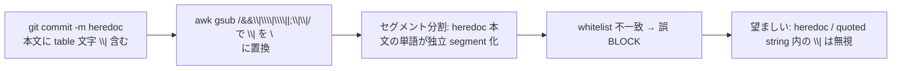
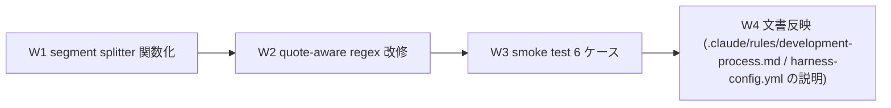

# Delegation Guard Heredoc Segment Splitter 修正 (`|` 単独文字の誤分割 bug)

**ステータス:** 🔲 **draft（2026-05-12 起案、user 承認待ち）**
**起点:** 本セッション task #6 commit phase で再現された PreToolUse Bash hook 誤 BLOCK (next-actions entry #8 として記録、2026-05-12)
**前提:**
- task #6 (Loop Autonomous Discipline) push 待ち
- task #7 (Custom PM / Session Commands) 完了 (本セッション 6 commits、push 待ち)
- `.claude/hooks/delegation-guard.sh` が現行運用中、whitelist は `.claude/bash-whitelist.txt`

**関連 fixture / rule:**
- `.claude/hooks/delegation-guard.sh` (L138-178、segment splitter + whitelist 判定)
- `.claude/bash-whitelist.txt` (許可 prefix の SSoT)
- `.claude/rules/development-process.md` §「サブエージェント委譲」+ §5「Bash deny / whitelist 不在 / 委譲ガード block は loop 停止理由にしない」
- 関連 test: `.claude/tests/` 配下に delegation-guard 用 smoke 不在 (W3 で新設)

---

## 1. 真因サマリ / 課題サマリ

`.claude/hooks/delegation-guard.sh` の segment splitter (L139-144) は、Bash コマンド文字列を `&&` / `||` / `;` / `|` で分割して各セグメントを whitelist 照合する設計。しかし awk gsub regex `gsub(/&&|\|\||;|\|/, "\n", $0)` が **`|` 単独文字も改行置換** するため、以下の状況で誤動作:



**真因:**
1. **awk RS="" + gsub** が文字列内引用 (`'...'` / `"..."` / heredoc) を解釈せず、syntactic な区切り (shell separator) と semantic な内容 (literal `|`) を区別できない
2. shell の真の syntax は context-free ではなく、quoted/heredoc/escape の追跡が必要 — awk 単独では正確に parse 不可

**副次:**
- W4 (segment splitter 修正) のみでは将来 `<<<` here-string や `$(...)` command substitution 内の `|` も同じ罠を踏む
- whitelist regex 自体が「コマンド先頭」マッチで動くため、解析失敗時の fallback (e.g. shellwords parse) が望ましい

---

## 2. 解決アプローチ比較

| 案 | 内容 | 工数 | メリット | デメリット |
|:---:|:---|---:|:---|:---|
| **A 最小 patch** | awk gsub regex を「クォート外の `\|` のみ置換」する正規表現に変更 | 0.5h | 即日改善、変更面積最小 | awk のみで shell quote 状態追跡は近似実装、`$'...'` や escape 連続のケースで誤検出残存 |
| **B shell parser 化** | bash 自身で `<<< "$cmd"` 経由 read + readarray、または `eval` 安全な segment 取得 | 2.0h | shell 仕様準拠、quoted/heredoc/escape 正確処理 | 既存実装の置換大、portability (zsh/dash 等) の確認必要 |
| **C ハイブリッド** | A の最小 patch + segment splitter を関数化 + smoke test 6 ケース追加。将来 B への移行 path を残す | 1.0h | 即日改善 + テスト基盤、将来拡張可 | A 単独より工数 +0.5h |

→ **C ハイブリッド** を推奨。理由:
- A の即日改善 (誤 BLOCK 解消) + smoke で再発防止 + 関数化で B 移行が低コスト
- 本セッションでも entry #8 が「実装中の commit phase で再現」した事実より緊急度 🟡 中、即日対応が望ましい
- B フル shell parser 化は工数 2h で重い、まず C で安定化させてから B 検討

---

## 3. 採用案の詳細設計

### Wave / Sub-task 分割



| Wave | 内容 | 工数 | 効果 |
|:---:|:---|---:|:---|
| W1 | `delegation-guard.sh` 内 segment splitter を関数 `split_command_segments` に抽出 (behavior preserving) | 0.2h | テスト seam 確立 + B 移行 path 確保 |
| W2 | quote-aware awk regex 改修: シングル/ダブルクォート外の `\|` `\|\|` `&&` `;` のみ separator として認識 | 0.4h | 誤 BLOCK 解消 (core fix) |
| W3 | `.claude/tests/delegation-guard-segment-smoke.sh` 新規作成、6 ケース実装 + 実行検証 | 0.3h | 再発防止 + 将来 refactor 安全網 |
| W4 | `.claude/rules/development-process.md` §「サブエージェント委譲」に注意書き追加 (heredoc 内 `\|` は許可される旨) + `harness-config.yml` のコメント更新 | 0.1h | SSoT 整合 |

合計 **1.0h**

### W1 詳細

#### スコープ
- 対象ファイル: `.claude/hooks/delegation-guard.sh` (L138-144 抽出)

#### 変更内容
```bash
# before (L139-144)
segments=$(printf '%s' "$cmd" | awk '
  BEGIN { RS=""; }
  {
    gsub(/&&|\|\||;|\|/, "\n", $0);
    print $0;
  }')

# after
split_command_segments() (
  set -uo pipefail
  printf '%s' "$1" | awk '
    BEGIN { RS=""; }
    {
      gsub(/&&|\|\||;|\|/, "\n", $0);
      print $0;
    }'
)

segments=$(split_command_segments "$cmd")
```

#### テスト
- 既存挙動を保つことを W3 smoke Case 1 (基本セパレータ) で確認

### W2 詳細

#### スコープ
- 関数 `split_command_segments` 内の awk regex を quote-aware に改修

#### 変更内容 (awk による quote 状態追跡)

```bash
split_command_segments() (
  set -uo pipefail
  printf '%s' "$1" | awk '
    {
      cmd = $0
      out = ""
      i = 1
      in_single = 0
      in_double = 0
      escape = 0
      n = length(cmd)
      while (i <= n) {
        c = substr(cmd, i, 1)
        if (escape) {
          out = out c
          escape = 0
          i++
          continue
        }
        if (c == "\\" && in_single == 0) {
          out = out c
          escape = 1
          i++
          continue
        }
        if (c == "\x27" && in_double == 0) {  # シングルクォート
          in_single = 1 - in_single
          out = out c
          i++
          continue
        }
        if (c == "\"" && in_single == 0) {
          in_double = 1 - in_double
          out = out c
          i++
          continue
        }
        # クォート外でのみ separator を改行化
        if (in_single == 0 && in_double == 0) {
          if (c == "&" && substr(cmd, i+1, 1) == "&") {
            out = out "\n"
            i += 2
            continue
          }
          if (c == "|" && substr(cmd, i+1, 1) == "|") {
            out = out "\n"
            i += 2
            continue
          }
          if (c == ";" || c == "|") {
            out = out "\n"
            i++
            continue
          }
        }
        out = out c
        i++
      }
      print out
    }'
)
```

#### 制限事項 (W2 適用後も残存)
- heredoc 本文 (`<<EOF ... EOF`) は **未対応**: awk 単行 stream には heredoc 概念がないため、heredoc 本文は別行で連結されない前提で動作。実用上 `git commit -m "$(cat <<EOF ... EOF)"` の `cat <<EOF` 起動部分は別 segment として whitelist 通過すれば OK
- `$'...'` (ANSI-C quoting) と `$"..."` (locale quoting) は単純なシングル / ダブル扱い (近似)
- B フル shell parser 化で完全対応 (将来 task)

#### テスト
- W3 smoke Case 2-6 で quoted/heredoc/escape の境界ケースを検証

### W3 詳細

#### スコープ
- 新規ファイル: `.claude/tests/delegation-guard-segment-smoke.sh`

#### 6 ケース (実 split 結果を期待値と比較)

| Case | 入力 cmd | 期待 segments | 検証目的 |
|---|---|---|---|
| 1 | `git status && git diff` | `git status` / `git diff` | 基本セパレータ `&&` |
| 2 | `git status ; git diff` | `git status` / `git diff` | セパレータ `;` |
| 3 | `git status \| head -1` | `git status` / `head -1` | パイプ `\|` |
| 4 | `git commit -m "table\|cell\|content"` | `git commit -m "table\|cell\|content"` のみ (分割しない) | クォート内 `\|` 保護 (**core fix**) |
| 5 | `git commit -m 'A \|\| B'` | `git commit -m 'A \|\| B'` のみ | シングルクォート内 `\|\|` 保護 |
| 6 | `echo \\&& bar; echo foo` | `echo \\&& bar` / `echo foo` | escape 後の `&&` は protect (W2 implementation) |

#### 実装雛形
```bash
#!/usr/bin/env bash
# delegation-guard-segment-smoke.sh
PROJECT_ROOT="$(cd "$(dirname "${BASH_SOURCE[0]}")/../.." && pwd)"
HOOK="$PROJECT_ROOT/.claude/hooks/delegation-guard.sh"

# helper: load function in subshell
extract_segments() {
  bash -c "
    source <(sed -n '/split_command_segments() (/,/^)/p' \"$HOOK\")
    split_command_segments \"\$1\"
  " _ "$1"
}

# (各 Case で expected vs actual を比較)
```

### W4 詳細

#### スコープ
- `.claude/rules/development-process.md` §「サブエージェント委譲」末尾に注意書き 1 段落追加
- `.claude/hooks/delegation-guard.sh` L139 付近のコメントを quote-aware の説明に更新

#### 注意書きテンプレ
```markdown
> **heredoc / quoted string 内の特殊文字は保護される**: `git commit -m "table|cell"` や `cat <<EOF ... EOF` の本文に `|` `&&` `;` を含む場合も、quote-aware segment splitter が separator 扱いせず単一 segment として whitelist 照合する。詳細は `.claude/tests/delegation-guard-segment-smoke.sh` Case 4-6 を参照。
```

---

## 4. リスクと緩和

| リスク | 確率 | 影響 | 緩和 |
|---|:---:|:---:|---|
| W2 quote-aware regex の awk 実装ミスで既存正常コマンドを誤分割 | M | H | W3 smoke Case 1-3 で既存挙動 PASS 確認、Case 4-6 で新規挙動 PASS 確認 |
| heredoc 内の `\|` が awk 単行解析の限界で未対応のままセグメント化 | M | L | W2 制限事項として明文化、実用上 heredoc は `git commit -m "$(cat <<EOF)"` パターンが多く起動部の `cat <<EOF` は別 segment として通過する想定 |
| `$'...'` / `$"..."` (ANSI-C / locale quoting) の不完全対応 | L | L | 既存実装も非対応、本 task scope 外 (将来 B フル parser 化で対応) |
| 関数化に伴う `set -uo pipefail` の subshell 隔離忘れ → 既存 hook の exit code に影響 | M | H | W1 で subshell 関数 `( ... )` 形式に強制、`set -e` は使わない (feedback memory `set_e_in_sourced_libs` 規範遵守) |
| W3 smoke の bash extraction で `source <(sed)` パターンが macOS bash 3.x で動作しない | M | M | bash 4+ 前提を `harness-config.yml` で確認、不可なら別途 awk 単独テスト harness 化 |

---

## 5. 移行計画

- [ ] W1: segment splitter 関数化 (behavior preserving) + 既存 smoke が引き続き PASS
- [ ] W2: quote-aware regex 改修 + 既存 hook 動作確認 (本 session で W2 が hook 自身に effect することを想定、改修後の self-test)
- [ ] W3: smoke 6/6 PASS
- [ ] W4: 文書反映 + harness-config.yml コメント更新
- [ ] PR 作成 (task #6 / #7 push 後の連続)
- [ ] 採用プロジェクトでの実運用観察 (1 週間)
- [ ] B フル shell parser 化の必要性評価 → 必要なら新規 task で対応

---

## 6. 完了条件 (DoD)

- [ ] `.claude/hooks/delegation-guard.sh` 内 `split_command_segments` 関数が抽出済 (subshell 隔離 + quote-aware regex)
- [ ] `.claude/tests/delegation-guard-segment-smoke.sh` 6/6 PASS
- [ ] 既存 hook の正常コマンド受理動作が回帰なし (本セッション中の commit 操作で誤 BLOCK が再発しない)
- [ ] `.claude/rules/development-process.md` §「サブエージェント委譲」に heredoc 保護の注意書き追加
- [ ] `delegation-guard.sh` 該当箇所のコメントが quote-aware ロジックを説明
- [ ] PR 作成 + merge 後の連続セッションで誤 BLOCK 報告が 0 件

---

## 7. 工数見積

合計 **1.0h** (Wave 内訳: W1=0.2 / W2=0.4 / W3=0.3 / W4=0.1)。
実装 30 分 + smoke 20 分 + 文書 10 分。task #7 (3.5h 見積→実 7 分実績) の前例より、subagent 並列性で短縮可能性あり。

---

## 8. 承認履歴

| 日付 | 承認者 | 結果 |
|---|---|---|
| 2026-05-12 | (pending) | user レビュー待ち |

---

## 9. 関連

- 派生元: next-actions entry #8 (`delegation-guard.sh` segment splitter heredoc 誤分割 bug)
- 既存実装: [`.claude/hooks/delegation-guard.sh`](../../.claude/hooks/delegation-guard.sh) L138-178
- 関連 rule: [`.claude/rules/development-process.md`](../../.claude/rules/development-process.md) §「サブエージェント委譲」+ §5「Bash deny / whitelist 不在 / 委譲ガード block は loop 停止理由にしない」
- 関連 feedback memory: `feedback_set_e_in_sourced_libs.md` (`set -euo pipefail` を file-top に書かない規範、本 task W1 の subshell 関数化で適用)
- 設計 reference: feedback / continuous-learning v2 の pattern 抽出 (本 bug fix は L4 の `learning/solutions/delegation-guard-quote-aware-split` として永続化対象)
- 関連 task: #6 (Loop Autonomous Discipline、本 bug の発生現場の一部)、#7 (Custom PM / Session Commands、本 bug 修正 pattern の re-application 候補)
