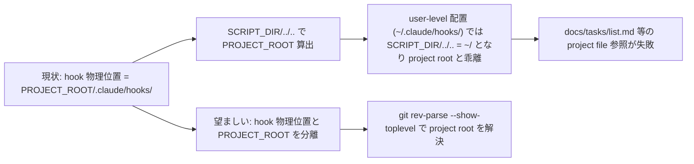
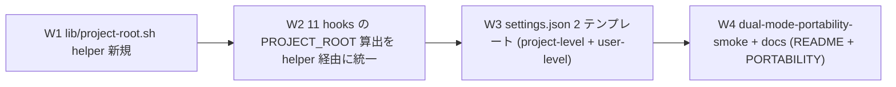

# Dual-mode Portability — user-level + project-level install 両対応

**ステータス:** ✅ **承認済 (2026-05-13 起案、2026-05-13 user 承認「問題ありません。実装してください」)**
**起点:** user ask (2026-05-13)「ハーネスをユーザ領域にインストールしても動きますか? パス確認 + プロジェクト固有情報はプロジェクトフォルダに置き参照可能に」+「ユーザ領域、プロジェクトどちらでも動くようにすることは可能ですか?」
**前提:**
- task #10/#11 で SessionStart 補助 hook 群 (check-serena-mcp + session-help-surface) 完成
- 現状の hooks は project-level install 専用 (`<project>/.claude/hooks/`)、user-level (`~/.claude/`) では動作しない

**関連 fixture / rule:**
- `.claude/hooks/lib/project-root.sh` (新規 helper)
- 11 hooks (`check-serena-mcp.sh` 等が `BASH_SOURCE/../..` で PROJECT_ROOT 算出)
- `.claude/settings.json` (project-level 用、cwd-relative path)
- `docs/PORTABILITY.md` / `README.md` (install 手順)

---

## 1. 真因サマリ / 課題サマリ

現状、ハーネス hooks は **`SCRIPT_DIR/../..` で PROJECT_ROOT を算出**する pattern (例: `check-serena-mcp.sh` L7) を採用。これは hook 自身が `<project>/.claude/hooks/` に置かれていることを前提にしている。



**真因 1 (path 算出の仮定)**: hook の物理位置から PROJECT_ROOT を逆算する設計は project-level install 限定。user-level では破綻

**真因 2 (settings.json path の cwd-relative)**: `bash .claude/hooks/X.sh` は cwd = project root 前提、user-level の `~/.claude/settings.json` で同じ書き方をすると cwd 依存で破綻

**副次 (cwd-relative path 参照の混在)**: 一部 hook は `docs/tasks/list.md` 等を cwd-relative で参照 (これは cwd = project root なら OK だが、PROJECT_ROOT 変数経由が安全)

---

## 2. 解決アプローチ比較

| 案 | 内容 | 工数 | メリット | デメリット |
|:---:|:---|---:|:---|:---|
| **A 最小 patch** | hook の `SCRIPT_DIR/../..` を `git rev-parse --show-toplevel` に直接置換、settings.json は project-level 専用維持 | 0.5h | 即日改善、user-level は別 task で対応 | dual-mode 未対応、user の本来 ask 未充足 |
| **B フル dual-mode** | lib/project-root.sh helper + 全 hook 更新 + settings.json 2 テンプレート + docs 完全 dual-mode | 1.8h | user-level + project-level 両対応 | 工数大 |
| **C ハイブリッド** | B の W1-W3 を最小実装 + W4 (smoke) は将来 task | 1.2h | 即日 dual-mode 動作、smoke は後追い | smoke なしで regression 検出弱 |

→ **B フル dual-mode** を推奨。理由:
- user 明示「どちらでも動く」 = 完全 dual-mode 必須
- smoke なしの C は将来 regression を見落とすリスク高
- 1.8h は task #7-#9 (3.8 分-7 分 subagent 完遂) と同等 scope、subagent 並列性で実時間 10-15 分見込み

---

## 3. 採用案の詳細設計

### Wave 構成



| Wave | 内容 | 工数 | 依存 |
|:---:|:---|---:|:---|
| W1 | `.claude/hooks/lib/project-root.sh` 新規: `resolve_project_root()` (env override → git rev-parse → pwd fallback の 3 段優先) | 0.3h | — |
| W2 | 11 hooks の `SCRIPT_DIR/../..` → `source lib/project-root.sh; PROJECT_ROOT=$(resolve_project_root)` 置換 | 0.5h | W1 |
| W3 | `.claude/settings.json` (project-level 維持) + `.claude/templates/settings.user-level.json.template` (新規、`bash ${HOME}/.claude/hooks/X.sh` 形式) | 0.4h | W1 |
| W4 | `.claude/tests/dual-mode-portability-smoke.sh` 新規 + `README.md` install 2 mode 分岐 + `docs/PORTABILITY.md` 完全更新 | 0.6h | W1-W3 |

合計 **1.8h**

### W1 詳細: lib/project-root.sh helper

```bash
#!/usr/bin/env bash
# project-root.sh — Unified project root resolver
#
# 役割: hook script が project root を確実に取得するための helper。
#       hook の物理位置 (project-level / user-level) に関わらず
#       同じ logic で project root を resolve できる。
#
# 使用例:
#   source "$(dirname "${BASH_SOURCE[0]}")/lib/project-root.sh"
#   PROJECT_ROOT=$(resolve_project_root)
#
# 優先順位:
#   1. ${HC_PROJECT_ROOT}      ... env override (CI / test 用)
#   2. git rev-parse --show-toplevel ... 標準的な project root 解決
#   3. pwd                     ... fallback (git 不在 / git 管理外)

# file-top に set -euo pipefail 書かない (feedback_set_e_in_sourced_libs 規範)

resolve_project_root() (
  set -uo pipefail

  # 1. env override
  if [ -n "${HC_PROJECT_ROOT:-}" ]; then
    printf '%s' "$HC_PROJECT_ROOT"
    return 0
  fi

  # 2. git rev-parse
  if command -v git >/dev/null 2>&1; then
    local root
    root=$(git rev-parse --show-toplevel 2>/dev/null)
    if [ -n "$root" ] && [ -d "$root" ]; then
      printf '%s' "$root"
      return 0
    fi
  fi

  # 3. pwd fallback
  pwd
)
```

### W2 詳細: 11 hooks の更新

対象 hooks (前ターン Grep で特定):
- `check-serena-mcp.sh` / `autonomous-action-guard.sh` / `context-budget.sh` / `mode-session-start.sh`
- `loop-auto-progress-reminder.sh` / `lib/mode-loader.sh` / `mode-asana-prompt.sh` / `mode-enforce.sh`
- `improvement-proposal.sh` / `check-required-env.sh` / `agent-router-suggest.sh`

#### 変更 pattern

```bash
# before
PROJECT_ROOT="$(cd "$(dirname "${BASH_SOURCE[0]}")/../.." && pwd)"

# after
SCRIPT_DIR="$(cd "$(dirname "${BASH_SOURCE[0]}")" && pwd)"
# shellcheck source=lib/project-root.sh
source "$SCRIPT_DIR/lib/project-root.sh"
PROJECT_ROOT=$(resolve_project_root)
```

注: `SCRIPT_DIR` は hook 自身の dir (lib source 用)、`PROJECT_ROOT` は実際の project root (project file 参照用) を **明確に分離**。

### W3 詳細: settings.json 2 テンプレート

#### 3a. project-level (現状維持、`<project>/.claude/settings.json`)

```json
{
  "hooks": {
    "PreToolUse": [
      { "command": "bash .claude/hooks/delegation-guard.sh Edit" }
    ]
  }
}
```

cwd = project root 前提、`bash .claude/hooks/X.sh` が project root の hook を実行。

#### 3b. user-level (新規 template、`.claude/templates/settings.user-level.json.template`)

```json
{
  "hooks": {
    "PreToolUse": [
      { "command": "bash ${HOME}/.claude/hooks/delegation-guard.sh Edit" }
    ]
  }
}
```

`${HOME}` 環境変数 expansion で user home 配下を参照、cwd ≠ project root でも hook が呼び出される。

採用者は install 方法に応じて適切な template を `~/.claude/settings.json` or `<project>/.claude/settings.json` に配置。

### W4 詳細: smoke + docs

#### smoke (`.claude/tests/dual-mode-portability-smoke.sh`)

4 cases:
- Case 1: `HC_PROJECT_ROOT=/tmp/fake-project` で `resolve_project_root` → `/tmp/fake-project`
- Case 2: env unset + git repo 内 → `git rev-parse --show-toplevel` の値
- Case 3: env unset + git 不在 dir → `pwd` の値
- Case 4: hook (例: check-serena-mcp.sh) を `~/.claude/hooks/` 風 path から実行 + `HC_PROJECT_ROOT=<temp project>` 設定 → 正しく PROJECT_ROOT 解決

#### docs

- `README.md` 「インストール」セクションに 2 mode 分岐追加 (project-level / user-level)
- `docs/PORTABILITY.md` 完全 rewrite (dual-mode 動作保証 + 移植手順)

---

## 4. リスクと緩和

| リスク | 確率 | 影響 | 緩和 |
|---|:---:|:---:|---|
| W2 で `SCRIPT_DIR/../..` を helper に置換時、既存 11 hooks の挙動 regression | M | H | 既存 smoke 全 PASS を W2 commit ごとに確認、各 hook 単独 sanity check |
| `git rev-parse` が git 管理外 dir で失敗 → pwd fallback への遷移 | L | L | helper 内で graceful fallback、cwd が project root に近い前提なら問題なし |
| `${HOME}` JSON expansion が Claude Code で不可 | M | M | `bash ~/.claude/hooks/X.sh` (tilde expansion) との両対応をテンプレに記載 |
| user-level install で project file (CLAUDE.md / docs/tasks/) 不在時の挙動 | L | L | hook 内で `[ -f "$PROJECT_ROOT/CLAUDE.md" ]` 等の存在 check + silent fallback |

---

## 5. 移行計画

- [ ] W1 lib/project-root.sh 新規 + 単独 smoke (env / git / pwd の 3 path 検証)
- [ ] W2 11 hooks 更新 + 既存 smoke 全 PASS (regression 0)
- [ ] W3 settings.json 2 テンプレート (project-level 維持 + user-level 新規)
- [ ] W4 dual-mode-portability-smoke 4/4 PASS + README / PORTABILITY 更新
- [ ] PR 作成 (user 承認後)
- [ ] 採用者からの dual-mode install 試行 feedback (1 週間運用観察)

---

## 6. 完了条件 (DoD)

- [ ] `.claude/hooks/lib/project-root.sh` 新規実装、`resolve_project_root()` が env override / git / pwd の 3 段優先で動作
- [ ] 11 hooks の `SCRIPT_DIR/../..` PROJECT_ROOT 算出を helper 経由に置換
- [ ] `.claude/templates/settings.user-level.json.template` 新規 (`${HOME}` or `~` 形式)
- [ ] `.claude/tests/dual-mode-portability-smoke.sh` 4/4 PASS
- [ ] 既存 smoke 全 PASS (workflow-guard / next-actions / loop-auto-progress / custom-pm / delegation-guard-segment / audit-followups / check-serena-mcp / session-help-surface = 7 件 + 新規 1 = 8 件 全 PASS)
- [ ] `README.md` 「インストール」セクションに project-level / user-level 2 mode 分岐記載
- [ ] `docs/PORTABILITY.md` dual-mode 動作保証 + 移植手順 update
- [ ] commit hashes が list.md に記録される

---

## 7. 工数見積

合計 **1.8h** (W1=0.3 / W2=0.5 / W3=0.4 / W4=0.6)。task #7-#11 の前例より subagent 並列性で実時間 10-15 分見込み。

---

## 8. 承認履歴

| 日付 | 承認者 | 結果 |
|---|---|---|
| 2026-05-13 | user (takuma.hirai1@gmail.com) | ✅ 承認「問題ありません。実装してください」 |

---

## 9. 関連

- 派生元: 本セッション末 user ask (2026-05-13)
- 関連 task: #7 (Custom PM / Session、Serena 必須化) / #10 (sc:* 排除 + Serena 警告、SessionStart hook 群) / #11 (help/hint hook、SessionStart 補助)
- 関連 hooks: `check-serena-mcp.sh` 等 11 hooks (PROJECT_ROOT 算出 pattern を持つ)
- 関連 docs: `README.md` 「インストール」 / `docs/PORTABILITY.md`
- 採用者影響: dual-mode install で user-level install (`~/.claude/`) が新規サポート、複数 project で hooks 共有可能化
