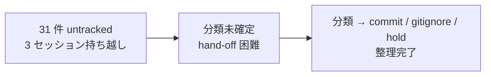

# earlier untracked 30+ 件の整理

**ステータス:** 🔲 **draft（2026-05-14 起案、user 承認待ち）**
**起点:** 3 セッション持ち越し蓄積 (`feat/loop-mode` ブランチ `git status` の untracked 31 件)、session/context 連続「earlier untracked 30+」記載、整理着手要求
**前提:**
- `feat/loop-mode` ブランチ上で本 draft を起こす (commit / push は本 task スコープ外)
- 前回 Explore subagent による分類結果 (commit 23 / gitignore 4 / hold 3) を一次入力として採用
- 規範: `.claude/rules/development-process.md` 設計→承認→タスク追加フロー、`.claude/rules/modes.md` Loop モード自律実行禁止リスト (`git push` / PR 等は本 draft 範囲外)

**関連 fixture / rule:**
- `.claude/rules/development-process.md` — 設計→承認→タスク追加 4 ステップ
- `.claude/rules/git-workflow.md` — branch / commit 規約 (Conventional Commits)
- `.claude/rules/modes.md` 遵守事項 8 — 自律実行禁止リスト (本 draft は「実装範囲外」明示で抵触回避)
- `docs/tasks/list.md` — task #5 (本 draft 起こし起源) / task #6 (v7-final commit、独立進行)

---

## 1. 真因サマリ / 課題サマリ

`feat/loop-mode` ブランチで 3 セッション持ち越しの untracked 31 件が累積している。`/new-draft` 系 command 試験実装で生成された `.claude/commands/*.md` 21 件、`.bak` backup 残存 3 件、eval-harness の生成物 (rescore_official.py / tests/ / sonnet JSON) 4 件が混在し、`git status` の認知負荷が増加して hand-off 困難。



**真因:** 3 セッション分の試験実装 / backup / eval 生成物が `.gitignore` / `commit` のどちらにも振り分けられず累積。整理判断が後送りされた。

**副次:**
- `.bak` 残存 3 件が現役 file と diverge していて誤参照リスク
- hold 3 件 (`approve_org_money.md` / `create_tool.md` / `transfer-miss-match.md`) は命名規約逸脱 + 意図不明で user 判断必要
- eval-harness JSON (`claude-sonnet-4-6.swe-bench-c2-f1_on_f2_on.json`) は再生成可能な評価生成物、commit すべきでない

---

## 2. 解決アプローチ比較

| 案 | 内容 | 工数 | メリット | デメリット |
|:---:|:---|---:|:---|:---|
| **A** | 一括 commit 23 件 + `.gitignore` patch 4 件 + hold 3 件 user 判断項目を明示化 | 0.5 | 最短、user 判断要項目が draft §3 で明確化、Loop モード親和 | hold 3 件の対応は user 入力依存で blocking、命名修正は別 task |
| **B** | hold 3 件を kebab-case + 意図明確化に user リネームしてから 1 PR で全件 commit | 1.5 | 整合性最高、命名規約逸脱を即解消、後続 task 不要 | user の命名判断時間が長い、Loop 自律進行できない、判断依存度高 |
| **C ハイブリッド** | Phase 1: gitignore patch → Phase 2: commit 23 → Phase 3: hold 3 user 判断 (3 PR / 3 commit chain) | 1.0 | revert 粒度最細 (gitignore のみ revert 等が可能)、安全性最高 | PR 数増 (3 → 1 では済まない)、commit chain 管理 overhead |

→ **案 A** を推奨。理由: user 判断必要項目 (hold 3) を draft §3 で明示化することで「最短整理 + 判断後送り task 化」のフローが Loop モードと親和し、`modes.md` 遵守事項 8 の自律禁止 (`git push` / PR) にも抵触しない (本 draft は設計のみ、commit / push は別 task #N で実施)。案 C の Phase 分割は revert 粒度を最細化するが、`.claude/` 配下のみの変更で破壊リスクが低いため過剰設計 (YAGNI)。

---

## 3. 採用案の詳細設計

### Wave / Sub-task 分割

| Wave | 内容 | 工数 | 効果 |
|:---:|:---|---:|:---|
| W0 | task spawn (本 draft 承認後、`/new-task` で task #N を起こす) | 0.05 | 規範フロー遵守、台帳同期 |
| W1 | `.gitignore` patch (`.bak` パターン 1 行 + eval-harness JSON 1 行 = 2 行 append) | 0.1 | 4 件の untracked が `.gitignore` で除外、commit 対象から自動除外 |
| W2 | commit 23 件 (`.claude/commands/*.md` 21 件 + eval-harness `rescore_official.py` + `tests/__init__.py` + `tests/test_runner.py`) を **意味分割 2 commit** で実施 (commands + eval) | 0.2 | 論理単位 commit、Loop モード規範 遵守事項 5 の「巨大コミット禁止」遵守 |
| W3 | hold 3 件 (`approve_org_money.md` / `create_tool.md` / `transfer-miss-match.md`) の user 判断項目を本 draft §3.W3 詳細に明示提示 → user 入力後に reflect | 0.1 | 命名規約逸脱 / 意図不明の user 判断が draft 上に永続記録される、後送り task #N+1 化のトリガー |
| — | sync (`docs/tasks/list.md` ステータス、本 draft §8 承認履歴更新) | 0.05 | 規範遵守 |

合計: **0.5 工数**

### W0 詳細 (task spawn)

#### スコープ
- 本 draft 承認後に user 入力 `/new-task <N> earlier-untracked-cleanup` で task ファイル生成
- `docs/tasks/list.md` に `🔲 未着手` 行追加

#### 検証
- `task-rule-guard.sh` が draft 存在を確認して通過 (BLOCK されない)

### W1 詳細 (`.gitignore` patch)

#### スコープ
- 対象ファイル: `.gitignore` (project root)
- append 内容:

```gitignore
# backup files (any .bak)
**/*.bak

# eval-harness generated rollup outputs (regenerable, do not commit)
.claude/skills/eval-harness/swe-bench/*.swe-bench-*.json
```

#### 効果検証 (本 task で実施しない、別 task #N で実施)
- `git status` で以下 4 件が untracked から消える:
  - `.claude/harness-config.yml.bak`
  - `.claude/rules/development-process.md.bak`
  - `.claude/settings.json.bak`
  - `.claude/skills/eval-harness/swe-bench/claude-sonnet-4-6.swe-bench-c2-f1_on_f2_on.json`
- 既存 git-track 済 file が誤って除外されないことを `git check-ignore -v <path>` で確認

#### テスト
- `.claude/tests/` 配下に smoke は追加しない (gitignore は静的 config、test 不要)
- 検証は別 task #N の DoD で `git status` 出力 grep のみ

### W2 詳細 (commit 23 件、意味分割 2 commit)

#### スコープ
- 対象ファイル群 (commit 1: `.claude/commands/*.md` 21 件):
  - `apply-rules.md` / `approve-design.md` / `build.md` / `context-fetch.md` / `design.md` / `doc-review.md` / `document-pair.md` / `error-triage.md` / `hearing.md` / `impact-check.md` / `investigate.md` / `lint-rules.md` / `move-section.md` / `notification.md` / `rasis-report.md` / `release-note.md` / `reply-watch.md` / `requirement.md` / `sentry-pr.md` / `task-estimate.md` / `template-apply.md`
- 対象ファイル群 (commit 2: eval-harness 関連 3 件):
  - `.claude/skills/eval-harness/swe-bench/rescore_official.py`
  - `.claude/skills/eval-harness/swe-bench/tests/__init__.py`
  - `.claude/skills/eval-harness/swe-bench/tests/test_runner.py`

#### commit メッセージ (Conventional Commits、本 task で実装、本 draft では sample のみ)

```text
feat(commands): add 21 slash commands from prior session experimentation

3 セッション持ち越しの試験実装 .claude/commands/*.md 21 件を統合する。
個別 command の意図 / Why は各 file 内 frontmatter 参照。命名規約逸脱 3 件
(approve_org_money / create_tool / transfer-miss-match) は別 task で扱う。

draft: docs/draft/earlier-untracked-cleanup.md §3 W2
```

```text
test(eval-harness): add swe-bench rescore_official + tests scaffold

eval-harness skill の SWE-bench rescore_official.py と tests/ scaffold を
commit する。生成 JSON (claude-sonnet-4-6.swe-bench-*.json) は .gitignore
で除外済。

draft: docs/draft/earlier-untracked-cleanup.md §3 W2
```

#### 検証 (本 task では実施しない)
- 各 file 内容に sensitive content (個人情報 / API key 等) 混入していないこと
- `.claude/commands/*.md` が既存 hook / smoke 規範に干渉しないこと (frontmatter `paths:` scope が `.claude/commands/**` 限定)

#### テスト
- 本 task で smoke / regression test は追加しない (純粋な docs / template / scaffold ファイル、ロジック変更なし)
- W2 完了後の別 task #N で `.claude/tests/<existing-smoke>.sh` を再実行して regression 0 を確認

### W3 詳細 (hold 3 件 user 判断項目)

本 Wave は **user 判断を draft 上で取得する** ことが目的。実装は別 task #N+1 で扱う。

#### 判断項目 1: `approve_org_money.md`

| 項目 | 内容 |
|---|---|
| 命名規約逸脱 | snake_case (`approve_org_money`) → 規範は kebab-case |
| 意図推定 | 「組織 (org) の金 (money) を approve」= 経費承認 / 予算承認 command? |
| user 判断要 | (1) リネーム後 commit → `approve-org-money.md` (2) 削除 (実装意図消滅) (3) hold 維持 |
| 推奨 | (1) リネーム後 commit、ただし「org money」の意味が組織予算 / 経費 / 別 domain か user の確認を要する |

#### 判断項目 2: `create_tool.md`

| 項目 | 内容 |
|---|---|
| 命名規約逸脱 | snake_case (`create_tool`) → 規範は kebab-case |
| 意図推定 | 「ツール作成」command = generator / scaffold? 既存 `/skill-create` `/command-development` skill との重複可能性 |
| user 判断要 | (1) リネーム後 commit → `create-tool.md` (2) 既存 skill と統合 / 削除 (3) hold 維持 |
| 推奨 | (2) 重複疑い、既存 `.claude/skills/skill-creator/` / `skill-development` と機能照合してから判断。削除候補濃厚 |

#### 判断項目 3: `transfer-miss-match.md`

| 項目 | 内容 |
|---|---|
| 命名 | kebab-case OK だが「miss-match」が「mismatch」のスペル誤りか「miss / match」の二段構造か不明 |
| 意図推定 | 「転送ミスマッチ」= Salesforce 等の Task transfer 系? `docs/` 配下に該当機能設計 draft なし |
| user 判断要 | (1) リネーム → `transfer-mismatch.md` で commit (2) `transfer-miss-match` の意図確認 → 維持 / 削除 (3) hold 維持 |
| 推奨 | (1) typo 修正 → `transfer-mismatch.md` で commit が最有力。ただし元 file の内容を Read で確認してから決定 |

#### user 入力フォーマット (本 draft 承認時に追記してもらう)

```yaml
hold_decisions:
  approve_org_money:
    action: <rename-and-commit | delete | hold>
    new_name: approve-org-money  # rename の場合のみ
    reason: <user 入力>
  create_tool:
    action: <rename-and-commit | merge-with-existing | delete | hold>
    new_name: create-tool  # rename の場合のみ
    reason: <user 入力>
  transfer_miss_match:
    action: <rename-and-commit | keep-current-name | delete | hold>
    new_name: transfer-mismatch  # rename の場合のみ
    reason: <user 入力>
```

---

## 4. リスクと緩和

| リスク | 確率 | 影響 | 緩和 |
|---|:---:|:---:|---|
| commit 23 件中に sensitive content (API key / 個人情報 / 機密 URL) 混入 | L | H | 別 task #N の DoD に「各 file 内容を `grep -i -E '(api[_-]?key\|secret\|password\|token)'` で sanity check」を含める |
| hold 3 件の命名規約逸脱で採用者プロジェクトの command 衝突 | M | M | 本 draft §3 W3 で user 判断項目化、本 task で commit しない。別 task #N+1 で扱う |
| `.bak` ファイルが現役 file と diverge していて誤参照される | M | M | `.gitignore` で除外する前に「`.bak` の内容が現役 file の旧版である」ことを別 task #N で `diff` 確認、必要なら手動 archive (e.g. `~/.claude/archive/`) |
| eval-harness JSON が将来 commit したくなる場合がある | L | L | `.gitignore` パターンは `*.swe-bench-*.json` 限定、他 eval JSON は除外しない。必要時に exclusion 解除可 |
| 案 A 採用で hold 3 件の対応が blocking → 本 draft 完結まで時間がかかる | M | M | hold 3 件は別 task #N+1 で独立進行、本 draft の承認自体は W1+W2 のみで完結可能とする (user 判断は §3 W3 に永続記録) |

---

## 5. 移行計画

- [ ] **本 draft の承認** (user 入力、§8 承認履歴に記録)
- [ ] hold 3 件の user 判断を §3 W3 user 入力フォーマットに沿って draft に追記
- [ ] `/new-task <N> earlier-untracked-cleanup` で task #N 化、`docs/tasks/list.md` に行追加
- [ ] task #N で W1 (.gitignore patch) を subagent 経由で実装
- [ ] task #N で W2 (commit 23 件、意味分割 2 commit) を subagent 経由で実装
- [ ] task #N+1 (hold 3 件処理) を user 判断後に起こす (W3 結果 reflect 用)
- [ ] `git status` で untracked 0 件 (hold 3 件は task #N+1 完了まで残存可能) を確認
- [ ] 既存 smoke regression 0 を確認 (`.claude/tests/<existing-smoke>.sh` 再実行)
- [ ] `/finish-task <N>` で task #N クローズ、本 draft §8 に完了記録

---

## 6. 完了条件（DoD）

- [ ] **untracked 0 件** (hold 3 件は task #N+1 完了まで残存可)、`git status -s | wc -l` == 0 (or 3 件 hold 残存)
- [ ] `.gitignore` patch 適用済、`**/*.bak` + eval-harness JSON パターン append 確認
- [ ] commit 23 件が 2 commit に意味分割されて適用済 (`git log --oneline` で確認)、commit メッセージが Conventional Commits 形式
- [ ] 既存 smoke regression **0 件** (`.claude/tests/*.sh` 全 PASS)
- [ ] hold 3 件の user 判断結果が本 draft §3 W3 に永続記録済 (rename / delete / hold の選択 + 理由)
- [ ] task #N+1 (hold 3 件処理) が parking-lot or list.md に起票済
- [ ] 本 draft §8 承認履歴に user 承認エントリ + 完了記録 追加

---

## 7. 工数見積

合計: **0.5 工数**

| Wave | 内訳 | 工数 |
|:---:|---|---:|
| W0 | task spawn (新規 task ファイル生成 + list.md 行追加) | 0.05 |
| W1 | `.gitignore` patch (2 行 append) | 0.1 |
| W2 | commit 23 件 (subagent staging 戦略経由、2 commit に分割) | 0.2 |
| W3 | hold 3 件 user 判断項目 reflect (draft §3 W3 追記) | 0.1 |
| sync | `docs/tasks/list.md` / 本 draft §8 更新 | 0.05 |

別 task #N+1 (hold 3 件処理) は **0.3 工数** を別途見積 (本 draft 範囲外)。

---

## 8. 承認履歴

| 日付 | 承認者 | 結果 |
|---|---|---|
| 2026-05-14 | user | (承認待ち) |
| 2026-05-15 | user | 承認 (A=revert / B=rename+commit 24 件 / CD=rm / E=履歴 commit) |
| 2026-05-15 | claude | 実装完了 (chore/cleanup-untracked-and-drafts branch、2 commits、本 commit 含む) |

### 実装メモ (2026-05-15)

- W1 (.gitignore patch) は採用せず: ユーザー判断で `.bak` / swe-bench 生成物は **削除** (gitignore 経由の保存ではなく完全 rm)
- W2 (commit 23 + eval scaffold) は調整: eval scaffold 3 件は user 「D 削除」指示により commit 対象から除外、commands 24 件 (21 + rename 3) のみ commit
- W3 hold 3 件は **rename して commit** で処理 (削除より情報損失少を選択):
  - approve_org_money → approve-org-money (kebab-case fix)
  - create_tool → create-tool (kebab-case fix、既存 skill-creator との重複は別 task で判断)
  - transfer-miss-match → transfer-mismatch (kebab-case fix + typo fix)
- mode.yml は **revert** (commit せず session 一時切替扱い)

---

## 9. 関連

- 既存設計: なし (本 draft が初出)
- 関連タスク: task #5 (本 draft 起こし起源、list.md 該当行)、task #6 (v7-final commit、独立進行)
- 派生予定 task: task #N (本 draft 承認後の W1+W2 実装) + task #N+1 (W3 hold 3 件処理)
- 関連 rule:
  - `.claude/rules/development-process.md` 設計→承認→タスク追加フロー
  - `.claude/rules/git-workflow.md` Conventional Commits / branch 命名
  - `.claude/rules/modes.md` 遵守事項 5 (Loop 適切粒度コミット) + 8 (自律実行禁止)
- session/context 持ち越し:
  - 3 セッション持ち越しの untracked 31 件累積 (前 session memory 参照)
  - 前回 Explore subagent 分類結果 (commit 23 / gitignore 4 / hold 3) を一次入力として採用

---

confidence: 0.85
