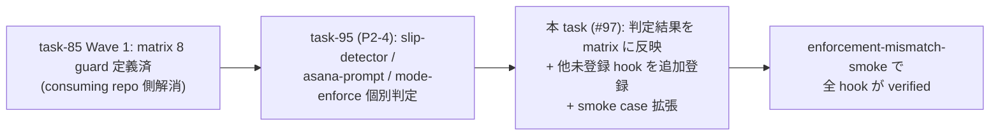

<!--
task-21 W2.4 frontmatter (機械可読、draft-flow-guard.sh / harness-audit が読む):
approval_required: true
approved_at: 2026-07-06
approved_by: user (kfurutani@classlab.co.jp)
retroactive: false
-->
---
slug: enforcement-matrix-full-hook-expansion
title: enforcement_matrix 全 hook 拡張 (残 scope 明確化、task-95 依存)
created_at: 2026-07-06
status: ✅ 承認済 (2026-07-06、AI 推奨どおり task-95 hard 依存 + task-96 hard 依存化採用)
related: install-immediately-usable-redesign-20260618 §5 P2-6 (W2-2) / §11.3 R3 (最重要) + R6 (依存明示) / §11.3 R4 (副産物 #81 吸収候補)
---

# enforcement_matrix 全 hook 拡張 (P2-6 残 scope)

**ステータス:** 📝 **draft（2026-07-06 起案、user 承認待ち）**
**起点:** master roadmap [install-immediately-usable-redesign-20260618](./install-immediately-usable-redesign-20260618.md) §5 P2-6 (W2-2、batch planning 経路 B) + 同 §11.3 R3 の残 scope 明確化指示
**前提 (完了済、本 draft の実装 scope 外):**
- **task-85 Step 2 (Wave 1、PR #68 HOTFIX merge 済)**: `enforcement_matrix` block に 8 guard 定義済 = `draft_flow_guard` / `task_rule_guard` / `workflow_guard` / `gateguard` / `review_required_{design,test,module,system}` (`.claude/harness-config.yml:479-543`)、8 guard 全件で **advisory + harness-dev の `disabled_reason` 2 preset 分**を追記済 (§11.3 R3 が言及する「advisory disabled_reason 8 行追記」に該当)
- **task-70 Phase 2 (2026-06-10 頃)**: enforcement_matrix schema (`feature_key` / `docs_claim` / `events` / `presets` / `disabled_reason`) 定義 + `.claude/tests/enforcement-mismatch-smoke.sh` 5 case (`enforcement-mismatch-smoke.sh:123-256`) + parse lib `.claude/scripts/lib/enforcement-matrix-parse.sh` (`em_guards` / `em_field` / `em_disabled_reason`) 整備
- **task-84 (F WARN 誘導 / npx 経路)**: `feature_stale_harness_detect_enabled` 相当の hook を matrix 未登録のまま稼働継続 (本 draft の登録候補)

**関連 rule:**
- CommonRules.md § Design Constraints「enforcement は preset で明示制御 (task-70 Phase 2)」
- `.claude/rules/workflow.md` §「workflow-guard.sh による強制機構」の preset aware 記述

---

## 1. 真因サマリ / 課題サマリ

master roadmap §11.3 R3 は本 task (P2-6) を **2 段解消** の後段と位置付ける:

- consuming repo (team-default) 側の docs↔effective 乖離は **task-85 Wave 1** で解消済 (matrix 8 guard に team-default 期待値 = true + harness-dev / advisory 双方に `disabled_reason` 記載)
- 本 repo (harness-dev) の残 hook (= matrix 未登録) の documented mismatch 完全化が **P2-6 の残 scope**

現 enforcement_matrix (`.claude/harness-config.yml:479-543`) には 8 guard しか定義されていない一方、`.claude/hooks/*.sh` は **42 件** 実在 (`ls .claude/hooks/*.sh | wc -l` 実測 2026-07-06、dispatcher 6 件除く 36 hook)。`feature_*_enabled` toggle は **27 件** (`grep -cE '^feature_[^:]+_enabled:' .claude/harness-config.yml` 実測 2026-07-06、`.claude/harness-config.yml:365-400`)。**なお本 draft 起案時点 (2026-07-06) は task-96 (P2-5 agent-router LLM fallback toggle) merge 前で、task-96 が feature toggle 1 件 (`feature_agent_router_llm_fallback_enabled`) + 非 toggle key 2 件 (`agent_router_llm_budget_usd_per_day` / `agent_router_llm_similarity_threshold`) を追加するため、task-96 merge 後は toggle 28 件 / 実 hook 数不変**。差分 = matrix 未登録 hook の中には「docs / rules が BLOCK と読める挙動を書いている hook」も含まれ、preset 変更時に `enforcement-mismatch-smoke` が **false negative** (documented mismatch の検出漏れ) を返す状態が続いている。

| # | 課題 | 現状証拠 |
|---|---|---|
| **C1** | **matrix 未登録 hook 集合が未確定**。W1-1 (slip-detector) / W1-5 (agent-router) / W1-6 (loop-confirmation-detector) 等の分類は task-95 (P2-4 死蔵 hook 棚卸し) 完了後に確定する。加えて **task-96 (P2-5 agent-router LLM fallback toggle) で追加される新 feature toggle 1 件 (`feature_agent_router_llm_fallback_enabled`)** が matrix 登録候補として本 task 実施時に確定している必要 | `.claude/harness-config.yml:479-543` 8 guard のみ、`ls .claude/hooks/*.sh | wc -l` = 42 hook (dispatcher 除外 36)、task-95 draft 未起案 (list.md #95 = 📝 未承認)、task-96 draft = `docs/draft/agent-router-llm-fallback-toggle.md` (list.md #96 = 📝 未承認、3 key 追加) |
| **C2** | matrix 追加候補の中に **docs_claim + presets 期待値の初回設計** を必要とする hook がある (`autonomous-action-guard` は Loop モードで BLOCK、`confidence-gate` は F3 SubagentStop で block、`byproduct-discharge-guard` は Stop で BLOCK 等、それぞれ docs 引用元と挙動が異なる) | `.claude/hooks/autonomous-action-guard.sh` / `.claude/hooks/confidence-gate.sh` / `.claude/hooks/byproduct-discharge-guard.sh` の各 emit_block 呼出 (§4.3 で個別引用) |
| **C3** | 副産物 next-actions **#81** (`sessionstart-footprint-smoke` FP-7 fail-open dedicated case + FP-5 label 厳密化) が P2-6 or P3-5 に fold 予定 (§11.3 R4)。matrix 拡張と sessionstart 系検証の順序整合を確定する必要がある | `docs/tasks/next-actions.md:140` #81 entry (2026-07-05) |
| **C4** | matrix 拡張のみでは **enforcement-mismatch-smoke の case 拡張** (対象 guard 集合の Case 2 更新 + 全登録 hook が `feature_key` 実在 = Case 4 の対象拡大) が併走する必要 | `enforcement-mismatch-smoke.sh:142` (`required` set が 8 guard hardcode) |

**核心論点 (C0)**: P2-6 の残 scope は「**task-95 で確定した hook 分類**を受けて、matrix 未登録 hook の追加登録 + smoke 対象拡張 + `#81` fold」に限定する。task-95 未完了時点で matrix 拡張を先行すると、追加登録集合が不安定 (task-95 で「除去 / 削除」判定された hook を matrix に載せる無駄が発生)。**task-95 完遂を hard dependency として明示** (§11.3 R6 の「Phase 2 内部順序制約 #97→#95」に一致)。



**真因:** enforcement_matrix schema は「docs claim + preset 期待値」の宣言的 SSoT だが、対象 hook 集合が task-85 時点で 8 に限定 (優先度高 guard のみ)。「全 hook」の完全網羅は task-95 で dead / live / advisory / block の分類が確定してから初めて安定登録できる。

**副次:** `enforcement-mismatch-smoke.sh:142` の `required` set が hardcode で、matrix 拡張時に smoke 側の対象集合も同期更新する必要 (drift 余地)。

---

## 2. 解決アプローチ比較

| 案 | 内容 | 工数 | メリット | デメリット |
|:---:|:---|---:|:---|:---|
| **A** | **task-95 完了を待って、確定した hook 分類を受けて matrix 拡張 + smoke case 拡張 + #81 fold を 1 task で実施** | 1.0d | 登録集合が安定、matrix と smoke が原子的に同期、#81 が sessionstart 系検証拡張として自然に fold | task-95 hard dependency = 直列化。着手 timing は task-95 merge 後 |
| **B** | **task-95 と並行して matrix 拡張を先行** (task-95 の分類結果は後で追記する差分適用) | 0.7d | 並列化で total 期間短縮 | task-95 で「除去」判定された hook を matrix に載せて後で剥がす無駄 (§1 C0 で却下)。matrix 追加登録の diff が 2 段 (先行 + task-95 反映) に分断され review 負担倍増 |
| **C** | matrix 拡張は **task-95 で「温存 + 登録」判定された hook のみ** に限定し、その他未登録 hook (delegation-guard / confidence-gate 等) は本 task 対象外 | 0.5d | scope 最小、review 容易 | roadmap §11.3 R3 が要請する「matrix 未登録 hook の追加登録」を部分達成に留め、docs↔effective の完全化 (§3.1 I1 Config SSoT 完成) が別 task 積み残し。今 task で完結させる意義薄 |
| **D** | matrix 拡張は行わず **enforcement-mismatch-smoke.sh の case 拡張のみ** (matrix 側は現状 8 guard 維持、smoke 側で全 hook の feature_key 実在検証を追加) | 0.3d | 工数最小 | smoke で検出できるのは「feature_key 実在」のみで docs↔effective 乖離検出は不可、P2-6 の DoD (全 hook verified) 不充足 |

→ **案 A を推奨**。理由: (1) roadmap §11.3 R3 明示の「matrix 未登録 hook の追加登録 + sessionstart 系検証拡張」を単一 task で完結、(2) §11.3 R6 の内部順序制約 #97→#95 に整合、(3) matrix 追加集合の drift 余地を最小化。task-95 完了 timing に本 task 着手を lock する運用は、Phase 2 内部の順序制約明文化 (§7.2 更新済 pointer) で担保する。

---

## 3. 採用案の詳細設計

### Task 計画 (採用 6 条準拠、Phase 中間階層廃止)

**Goal**: task-95 完了後の hook 分類を受けて enforcement_matrix を全対象 hook まで拡張し、`enforcement-mismatch-smoke.sh` の対象集合を同期更新し、副産物 #81 (sessionstart-footprint FP-7/FP-5) を fold して「全 hook の docs_claim + preset 期待 + disabled_reason が宣言済」状態を達成する。

#### Step 計画

| Step | Status | 作業概要 | 工数 | 依存 |
|:---:|:---:|:---|---:|:---|
| 1 | 🔲 | task-95 の分類結果 (`docs/tasks/task-95-*.md` §DoD 由来) を Read し、matrix 追加登録候補 hook set を確定 (temporarily list)。**加えて task-96 (`docs/tasks/task-96-*.md` merge 後) で追加された agent-router LLM fallback 3 yml key のうち feature toggle 該当分 (`feature_agent_router_llm_fallback_enabled`) を matrix 登録対象として確定** (残 2 key `agent_router_llm_budget_usd_per_day` / `agent_router_llm_similarity_threshold` は Gate/Confidence カテゴリで matrix 対象外を明示)。**MED-6 fix**: 本 Step の完了条件として「Case 2 semantics 判断 (現状維持 = 最小必須 guard 存在確認、or 緩和 = matrix 実登録 N 件以上)」を確定し §9 未決事項 2 を解決済に更新 | 0.5h | task-95, task-96 merge |
| 2 | 🔲 | `.claude/harness-config.yml` enforcement_matrix に追加登録 (guard block ごとに `feature_key` / `docs_claim` / `events` / `presets` / `disabled_reason` 記載) | 2.0h | Step 1 |
| 3 | 🔲 | `enforcement-mismatch-smoke.sh` の `required` set (現行 8 guard hardcode) を Step 2 で追加された guard 群まで拡張 + 副産物 #81 (FP-7 / FP-5 厳密化) を smoke case として追加 | 1.5h | Step 2 |
| 4 | 🔲 | (テスト設計レビュー) reviewer 動的選定 `review_min_count_test ≤ N ≤ review_max_count_test`、起動前に `bash .claude/scripts/hc-config.sh --get review_max_count_test` で上限確認 | 0.5h | Step 3 |
| 5 | 🔲 | (テスト合格) `enforcement-mismatch-smoke.sh` (拡張後全 case) + `sessionstart-footprint-smoke.sh` (FP-7 追加後) + 既存 smoke regression 0 | 0.5h | Step 4 |
| 6 | 🔲 | (リファクタリング) 3 観点 (持続可能性 / 汎用性 / 非冗長化)、特に `_matrix_field` / `em_field` の DRY 再評価。不要なら `skip: <reason>` 明示 | 0.3h | Step 5 |

合計: 5.3h (roadmap P2-6 見積 1 day = 8h に対し内訳明確化で -2.7h、`enforcement_matrix` schema 既存確立と task-95 分類確定の 2 前提が効いている)

### Step 1 詳細 (task-95 + task-96 分類結果 Read)

#### スコープ
- 対象:
  - `docs/tasks/task-95-*.md` (task-95 merge 後に生成、§DoD または §Step の分類 table)
  - `docs/tasks/task-96-*.md` (task-96 merge 後に生成、§DoD で `feature_agent_router_llm_fallback_enabled` 追加確定)
- 期待される分類 3 カテゴリ (task-95 draft [install-immediately-usable-redesign-20260618.md §11.3 R3 の分類 3 hook] 由来):

  | hook | 期待判定 (task-95 で確定) |
  |---|---|
  | `tool-call-slip-detector` | **温存 + matrix 登録** (advisory 相当、`feature_tool_call_slip_detect_enabled: false` 現在値 = `.claude/harness-config.yml:375`) |
  | `mode-asana-prompt` | **toggle 新設 + matrix 登録** (mode 依存 optional、`ls .claude/hooks/mode-asana-prompt.sh` で実在確認済) |
  | `mode-enforce` | **維持** (loop mode 3 hook 集合の 1 つ、既存 `feature_loop_mode_enforcement_enabled` 傘下、matrix 登録は集合単位 or 個別のどちらかを task-95 が判定) |

- task-96 由来の追加確定 candidate:
  - **`feature_agent_router_llm_fallback_enabled`** — advisory (default OFF、opt-in feature) で全 preset false 期待 (`disabled_reason` 必須: "LLM cost 発生 feature のため consuming repo 側 opt-in、全 preset default OFF")、docs_claim = `advisory`、events = `[UserPromptSubmit]` (agent-router-suggest.sh 経由)
  - 残 2 key (`agent_router_llm_budget_usd_per_day` / `agent_router_llm_similarity_threshold`) は **matrix 対象外** (feature toggle ではなく閾値 config、Gate/Confidence カテゴリ metadata TSV のみ登録済)。本 Step 1 で「matrix 対象外」判定を task-96 draft §3.1 と cross-check して確定
- 追加検討候補 (task-95 / task-96 未対象だが matrix 未登録): `delegation-guard` / `confidence-gate` / `autonomous-action-guard` / `byproduct-discharge-guard` / `context-budget` / `parallel-subagent-reminder` / `reviewer-count-guard` / `why-x5-reminder` / `why-x5-violation-detect` / `failure-loop-detect` / `agent-router-suggest` (親 toggle) / `stale-harness-detect` (`feature_stale_harness_detect_enabled: true` = `.claude/harness-config.yml:68`) 等 (Step 1 で最終集合を確定)

### Step 2 詳細 (matrix 追加登録)

#### 変更内容

`.claude/harness-config.yml:543` の後 (`enforcement_matrix:` block 末尾) に追加 guard block を append。既存 8 guard の schema (`.claude/harness-config.yml:479-543`) を SSoT template として踏襲:

```yaml
  <guard_name>:
    feature_key: <feature_toggle_key>
    docs_claim: <block|advisory>
    events: [<PreToolUse:Bash|SubagentStop|Stop|UserPromptSubmit|...>]
    presets: {advisory: <bool>, team-default: <bool>, strict: <bool>, harness-dev: <bool>}
    disabled_reason:
      <preset>: "<緩和理由>"
```

#### 例 (`autonomous-action-guard` の場合、Step 1 で最終集合確定後に本 template で登録):

```yaml
  autonomous_action_guard:
    feature_key: feature_autonomous_action_guard_enabled
    docs_claim: block
    events: [PreToolUse:Bash]
    presets: {advisory: false, team-default: true, strict: true, harness-dev: true}
    disabled_reason:
      advisory: "advisory preset は個人実験 / PoC 用に warn 中心運用 (BLOCK 最小) とするため"
```

- **契約 (Step 1 で確定した hook ごとに全 5 field を宣言)**:
  1. `feature_key`: yml top-level key 実在必須 (`grep -qE "^<key>:" .claude/harness-config.yml`、Case 4 で機械検証)
  2. `docs_claim`: `block` or `advisory` の 2 値 (schema 制約、他値は smoke で reject する Case 追加)
  3. `events`: docs 上の発火 event を列挙 (表示用、機械検証対象外)
  4. `presets`: 4 preset 全件を明示 (advisory / team-default / strict / harness-dev)
  5. `disabled_reason`: `docs_claim: block` かつ preset 期待値 false の組合せ **全件**必須 (Case 5 で機械検証)

- **`mode_enforce` の集合登録判定** (task-95 が判定): 案 a) `feature_loop_mode_enforcement_enabled` を SSoT に集合 1 entry で登録 / 案 b) `mode-enforce` / `loop-confirmation-detector` / `loop-auto-progress-reminder` の 3 hook 個別 entry。案 a は SSoT 1、案 b は observability 高。task-95 の分類結果に従う (本 draft は決定しない)

### Step 3 詳細 (smoke 拡張 + #81 fold)

#### 3a. `enforcement-mismatch-smoke.sh` の `required` set 拡張

現行 `.claude/tests/enforcement-mismatch-smoke.sh:142` の hardcode:

```bash
required="draft_flow_guard task_rule_guard workflow_guard gateguard review_required_design review_required_test review_required_module review_required_system"
```

を、Step 2 で登録した追加 guard 全件まで拡張。**hardcode 保守回避のため**、`em_guards "$HC_CONFIG_YML"` で matrix 実登録一覧を取得し「matrix にあれば required」に切替可 (`_case_2` の意味論を「matrix に指定 guard 集合が最小構成として存在」→「matrix の実登録が期待 N 件以上」に緩和)。**この case 2 semantics 変更は本 task 内で決定** (代替案: Case 2 は現状維持 = 最小必須 8 guard の存在確認、追加 guard は Case 4 で feature_key 実在検証のみ = 保守負担低)。

#### 3b. #81 FP-7 追加 (`sessionstart-footprint-smoke.sh` fail-open dedicated case)

副産物 next-actions #81 (`docs/tasks/next-actions.md:140`) 内容:

- (a) FP-7 (新規): `hc-config.sh` 不在 fixture で `<system-reminder>` open==close + exit 0 = M4 SUMMARY 初期化 fix の regression guard
- (b) FP-5 (厳密化): 現行 label のみ match を `[0-9]+ enabled,[[:space:]]+[0-9]+ disabled` の field 数検証へ強化

**fold 判断**: FP-7 は sessionstart 系検証の 1 case = P2-6 (matrix ↔ enforcement smoke 拡張) と scope 隣接。P3-5 (install smoke 自動化 = task-102) との比較で **P2-6 が優先** (P2-6 の方が Phase 順序が早く、#81 の regression risk 遅延を最小化)。**scope 重複回避契約**: 本 task で #81 (FP-7 + FP-5) を P2-6 に fold する結果、**task-102 (P3-5) draft §11.3 R4 由来 scope から #81 を必ず除外**する運用義務が発生。task-102 draft 起案時 (未起案 2026-07-06 時点、list.md #102 = 📝 未承認) に main agent が本 draft §3 Step 3b + §6 DoD (#81 処理結果 ✅) を cross-check し、task-102 §吸収先 entry で #81 を「既に task-97 (本 task) に fold 済」と明示する。fold 重複を発見した場合は task-102 側で scope 縮小 (§6 冒頭原則の「YAGNI」に整合)。

### Step 4-6 詳細 (Task 最終 3 Steps、固定)

- **Step 4 (テスト設計レビュー)**: 起動前に `bash .claude/scripts/hc-config.sh --get review_max_count_test` で上限確認、`tdd-guide` / `test-automator` / `qa-expert` / `pr-test-analyzer` base + shell/yaml domain で動的選定、収束まで反復 (上限 `review_iteration_max`)
- **Step 5 (テスト合格)**: UI なし → smoke で OK。`bash .claude/tests/enforcement-mismatch-smoke.sh` (拡張後 5 case + 追加 case) + `bash .claude/tests/sessionstart-footprint-smoke.sh` (FP-7 追加後) + `bash .claude/tests/run-all-smokes.sh` regression 0
- **Step 6 (リファクタリング)**: 3 観点。特に `_matrix_field` (`enforcement-mismatch-smoke.sh:75-90`) と `em_field` (`enforcement-matrix-parse.sh:50-64`) の DRY (lib source 依存を新 guard 追加時にも維持) を非冗長化観点で確認。fallback 経路 (`command -v em_field >/dev/null 2>&1` 判定) は保守性優先で維持

---

## 4. リスクと緩和

| リスク | 確率 | 影響 | 緩和 |
|---|:---:|:---:|---|
| task-95 が「除去」判定した hook を本 task が matrix に載せる (§1 C0 で懸念) | L | M | Step 1 で task-95 §DoD 分類 table を必ず Read (§7.2 pointer 参照)、Step 2 着手前に main が集合確認 |
| matrix 拡張時に `presets` 期待値の妥当性 (block vs advisory) を hook ごとに判定する審美的負担 | M | M | Step 1 で hook ごとの docs 引用元 + emit_block 呼出 pattern を collate、`.claude/hooks/<name>.sh` grep + docs cross reference で判定。判断迷ったら task-70 の template (harness-dev preset で advisory) を default 採用 |
| Case 2 semantics 変更 (matrix 実登録 → 期待集合) で「登録漏れ検出」が緩む | L | M | Case 4 (feature_key 実在) + Case 5 (disabled_reason 網羅) が引き続き documented mismatch を検出、Case 2 は「最小必須 guard 存在」に semantics 維持で緩めない (§3 Step 3a 代替案) |
| FP-7 追加で `sessionstart-footprint-smoke.sh` の既存 case regression | L | L | Step 5 で全 case 実行 + `git diff` で追加のみ確認 |
| enforcement_matrix parse lib (`em_field`) が新 guard の event array 記法変更に対応漏れ | L | M | 既存 8 guard の記法 (`.claude/harness-config.yml:483` 等) に完全一致させ、記法逸脱は Step 5 で smoke fail 検出 |

---

## 5. 移行計画

- [ ] feature flag 不要 (matrix schema は表示 / 検証補助専用、機能 toggle と直交)
- [ ] 既存 consuming repo への影響なし (matrix は enforcement を上書きしない = `.claude/harness-config.yml:462` 注記)
- [ ] `bash install.sh --update <target>` で consuming repo の matrix も同期される (RSYNC 経由、既存 flow)
- [ ] 段階ロールアウト不要 (yml 追記のみ、backward compat 100%)

---

## 6. 完了条件（DoD）

- [ ] task-95 で確定した hook 分類 (slip-detector / mode-asana-prompt / mode-enforce) 全件が enforcement_matrix に登録済 (検証: `grep -cE "^  (tool_call_slip_detect|mode_asana_prompt|mode_enforce):" .claude/harness-config.yml >= 3` or task-95 分類に一致する count)
- [ ] Step 1 で確定した matrix 追加登録 hook 全件が `feature_key` / `docs_claim` / `events` / `presets` / `disabled_reason` 5 field 全備 (検証: `bash .claude/tests/enforcement-mismatch-smoke.sh` Case 4 (feature_key 実在) + Case 5 (disabled_reason 網羅) PASS)
- [ ] enforcement-mismatch-smoke.sh の Case 2 が拡張後の guard 集合を verify (MED-6 fix、semantics 判断 = 現状維持 (最小必須 guard 存在確認) or 緩和 (matrix 実登録 N 件以上) は Step 1 で確定、DoD 記述は semantics-neutral、拡張後 case 数の下限は Step 1 判断に応じて設定) (検証: `bash .claude/tests/enforcement-mismatch-smoke.sh` 全 case PASS)
- [ ] 副産物 #81 FP-7 fail-open dedicated case が `.claude/tests/sessionstart-footprint-smoke.sh` に追加 (検証: `grep -n "FP-7\|fail-open dedicated" .claude/tests/sessionstart-footprint-smoke.sh` ≥ 1、mutation probe: FP-7 assert 削除して smoke 全 PASS 継続なら FAIL)
- [ ] #81 FP-5 label 厳密化 (`[0-9]+ enabled,[[:space:]]+[0-9]+ disabled` field 数検証) 完了 (検証: `grep -c 'enabled,\[\[:space:\]\]\+\[0-9\]+ disabled' .claude/tests/sessionstart-footprint-smoke.sh >= 1`)
- [ ] `docs/tasks/next-actions.md` #81 entry の処理結果列を `🔄 未処理` → `✅ → task-<N> (<PR#>) 完了` に更新 (§11.3 R4 verification 規約)
- [ ] **task-102 (P3-5) draft との fold 重複 cross-check**: task-102 draft 起案が先行している場合 (`ls docs/draft/*install-smoke*.md docs/draft/*p3-5*.md 2>/dev/null`) は該当 draft §吸収先 entry で #81 が「task-97 に fold 済」と明示済であることを確認、task-102 draft 未起案の場合は本 task PR 説明文と `docs/tasks/next-actions.md` #81 entry コメント列に「task-102 draft 起案時に #81 fold 済 flag を confirm する運用義務」を追記 (検証: `grep -c "task-97\|#81" docs/tasks/next-actions.md` ≥ 2 = entry + note、または task-102 draft の §関連 grep で `task-97` ≥ 1)
- [ ] 本 repo (harness-dev) の `bash .claude/tests/enforcement-mismatch-smoke.sh` 全 case PASS 維持 (regression 0)
- [ ] 全 smoke regression 0 (`bash .claude/tests/run-all-smokes.sh` PASS)
- [ ] docs 反映: `docs/INVENTORY.md` (matrix guard 表) + `.claude/rules/workflow.md` §「workflow-guard.sh」pointer を必要に応じて更新 (§7 Step 分解 default 必須項目、addendum §11.3 R5 checklist)

---

## 7. 工数見積

合計 5.3h (Step 1: 0.5h / Step 2: 2.0h / Step 3: 1.5h / Step 4: 0.5h / Step 5: 0.5h / Step 6: 0.3h)

内訳: Step 2 が最大 (guard block 記述の per-hook 個別判断、上記 §4 リスクの「審美的負担」を工数化)。roadmap 見積 1 day = 8h との差 -2.7h は enforcement_matrix schema 既存確立 (task-70) と task-95 分類確定 (前提) で吸収。

---

## 8. レビューサイクル (workflow.md §「収束条件」準拠)

| iter | 日付 | reviewer (起動数) | CRITICAL | HIGH | MEDIUM | LOW | 修正 commit | 状態 |
|:---:|---|---|:---:|:---:|:---:|:---:|---|---|
| — | — | (未実施) | — | — | — | — | — | 起案直後 |

**収束判定**: CRITICAL = 0 ∧ HIGH = 0 ∧ MEDIUM = 0 (LOW は許容、cosmetic finding として記録のみ)

---

## 9. 承認履歴

| 日付 | 承認者 | 結果 |
|---|---|---|
| — | — | (承認待ち) |

> **承認記入は先頭 HTML comment frontmatter の承認 field のみに行う** (7 draft frontmatter 統一、addendum §11.3 R5 checklist f 項)。

### 未決事項 (user 判断要)

1. **`mode_enforce` の集合登録判定**: `feature_loop_mode_enforcement_enabled` を SSoT に 1 entry で集合登録するか、`mode-enforce` / `loop-confirmation-detector` / `loop-auto-progress-reminder` の 3 hook 個別 entry か。task-95 が判定するが、task-95 分類前に user 方針の推奨があれば本 draft §3 Step 2 に反映する (推奨: task-95 判定に委任 = default)
2. **Case 2 semantics**: 現状 = 最小必須 8 guard の存在確認、拡張後 = matrix 実登録 N 件以上に緩和するか (§3 Step 3a)。**推奨は現状維持** (登録漏れ検出を緩めない、追加 guard は Case 4 で feature_key 実在検証)
3. **未登録 hook のうち matrix 登録優先度**: `stale-harness-detect` (`feature_stale_harness_detect_enabled: true`、`.claude/harness-config.yml:68`) は F WARN 誘導系で AI 教育効果あり、優先登録するか。**推奨は Step 1 で task-95 / task-96 分類外 hook も本 task で判定 = 全 hook 網羅** (roadmap §11.3 R3 の「全 hook 拡張」意図に一致)
4. **task-96 追加 3 key の matrix 対象範囲**: `feature_agent_router_llm_fallback_enabled` のみ登録し、`agent_router_llm_budget_usd_per_day` / `agent_router_llm_similarity_threshold` は matrix 対象外 (Gate/Confidence カテゴリ、閾値 config、feature toggle ではない) で確定するか。**推奨は上記** (matrix schema は `feature_key` = feature toggle の docs↔effective 検証を SSoT とし、閾値 config は metadata TSV でカバー、schema 責務分離)

---

## 10. 関連

- master roadmap: [install-immediately-usable-redesign-20260618.md](./install-immediately-usable-redesign-20260618.md) §5 P2-6 / §11.3 R3 (残 scope 明確化) / §11.3 R6 (依存明示 #97→#95) / §11.3 R4 (副産物 #81 吸収候補)
- 依存 task (hard):
  - [task-95-*.md](../tasks/) (P2-4 死蔵 hook 棚卸し、`docs/tasks/list.md:252` = 📝 未承認、着手待ち) — matrix 追加登録 hook set 確定に必要
  - [task-96-*.md](../tasks/) / [draft: agent-router-llm-fallback-toggle.md](./agent-router-llm-fallback-toggle.md) (P2-5 agent-router LLM fallback toggle、`docs/tasks/list.md:253` = 📝 未承認) — 追加 feature toggle 1 件 (`feature_agent_router_llm_fallback_enabled`) の matrix 登録判定に必要 (Step 1 で cross-check)
- 逆方向 cross-check task: [task-102 (未起案 draft、P3-5 install smoke 自動化)](../tasks/) — 副産物 #81 fold 重複回避 (§3 Step 3b + §6 DoD、task-102 draft 起案 timing で main agent が本 draft と cross-check)
- 実装 SSoT: `.claude/harness-config.yml:479-543` (現行 8 guard) + `.claude/harness-config.yml:365-400` (feature toggle 27 件、task-96 merge 後 28 件) + `.claude/harness-config.yml:462-470` (parser 制約注記)
- 検証資産: `.claude/tests/enforcement-mismatch-smoke.sh` (5 case) + `.claude/scripts/lib/enforcement-matrix-parse.sh` (`em_guards` / `em_field` / `em_disabled_reason`) + `.claude/tests/sessionstart-footprint-smoke.sh` (#81 FP-7 追加対象)
- 副産物 entry: [`docs/tasks/next-actions.md:140`](../tasks/next-actions.md) #81 (2026-07-05、`sessionstart-footprint-smoke` FP-7 + FP-5)
- 関連 memory: `feedback_config_value_needs_consumer_and_smoke` (I7 triplet = matrix 定義 + smoke 検証 + docs 反映の 3 点 set) / `feedback_design_external_dependency_verification` (外部依存の起案時存在確認 — 本 draft の全引用 path / 行番号は 2026-07-06 実測済)
