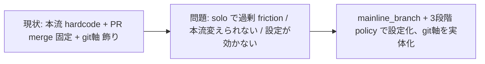

<!--
approval_required: true
approved_at: 2026-06-03
approved_by: user
retroactive: false
-->

# git 統合ポリシー設定 (mainline_branch + mainline_integration_policy 3 段階)

**ステータス:** 🔲 **draft（2026-06-03 起案、設計方針は user 承認済 / 4+ reviewer レビュー前）**
**起点:** user 要望 (resume-state loop session)。「push→merge で毎回止まるのを設定で変えたい。remote 保護ブランチ push は user、ローカル本流 merge は AI。本流ブランチも設定可能に。3 段階で制御」+ 整合性 audit で `git_workflow` axis が飾りと判明
**前提:**
- 現状: 本流 (main) は hardcode (`main|stg*` regex) で保護、push は `delegation-guard.sh` (check_protected_branch_push) + `autonomous-action-guard.sh` で block、merge は user 手動 (PR 経由)
- 整合性 audit (2026-06-03): web UI `git_workflow` axis (none/unrestricted/main_protected/main_stg_protected) は values/consumer 無しの「飾り」。本設計でその実体を与える

**関連 fixture / rule:**
- `.claude/hooks/delegation-guard.sh` + **`.claude/hooks/lib/delegation-guard/git-deny.sh`** (check_protected_branch_push、L65-135、refspec 省略 current-branch fallback L114-127。`lib/git-deny.sh` ではなく `lib/delegation-guard/` 配下が実体 — architect iter2 LOW-1)
- `.claude/hooks/autonomous-action-guard.sh` (mainline push pattern)
- `.claude/rules/modes.md` 遵守事項 8 (自律実行禁止 11 カテゴリ / main 操作)
- `.claude/harness-config.yml` (新 key 追加先) + `.claude/scripts/lib/hc-config-metadata.sh`

---

## 1. 課題サマリ

(1) **PR-merge friction**: 全 task が「feature push → 停止 → user が PR merge」で毎回止まる。solo 運用では過剰。
(2) **本流が hardcode**: 保護ブランチが `main|stg*` 固定で、`master`/`develop`/`trunk` を本流とする repo に追従できない。
(3) **git_workflow axis が飾り**: web UI の git 軸が実 yml key / consumer を持たず、選んでも挙動不変 (audit 確定)。



**真因:** git 統合フローが設定化されておらず、安全弁 (保護ブランチ) と利便性 (自動 merge) のバランスを repo ごとに選べない。

---

## 2. 解決アプローチ比較

| 案 | 内容 | 工数 | メリット | デメリット |
|:---:|:---|---:|:---|:---|
| **A** | 単一 toggle `feature_auto_local_merge_enabled` (on/off) | 1.0 | 最小 | 2 段階のみ (push 自動化を別途扱えない)、本流固定のまま |
| **B 採用** | `mainline_branch` (本流可変) + `mainline_integration_policy` (3 段階: pr-required / local-merge / local-merge-push) | 2.5 | user 要望に完全合致、3 段階で柔軟、本流可変、git軸 飾り解消 | guard 2 種 + norm + 完了フローの改修 |
| **C** | 既存 enforcement preset に統合 (preset が policy も決める) | 3.0 | preset 一元化 | preset と独立に policy を変えられず柔軟性低下、結合度増 |

→ **B** を採用 (user 承認済)。policy は独立 key とし preset は「既定値の提案」に留める (C の硬直を避ける)。

---

## 3. 採用案の詳細設計

### 3.1 新設定 key (2 件)

```yaml
# 本流ブランチ (AI が merge 先とする統合ブランチ)。master/develop/trunk 等に変更可。
mainline_branch: main

# 本流への統合ポリシー (3 段階)。
#   pr-required      : feature + commit + PR 作成まで。本流 merge / push は user (team/prod 既定)
#   local-merge      : ローカル本流に merge まで AI。remote push は user (solo、push 前確認)
#   local-merge-push : ローカル merge + remote push まで AI (solo/実験、最速)
mainline_integration_policy: pr-required
```

- 値解決: env (`HC_MAINLINE_BRANCH` / `HC_MAINLINE_INTEGRATION_POLICY`) > local.yml > yml > default。env 一時上書きは bypass.log 記録不要 (通常の値解決、破壊操作 bypass ではない、architect M1)。
- `mainline_integration_policy` は enum 3 値のみ。`hc-config.sh --set` 時に validation reject + **hook 実行時 (env 直接注入含む) は不正/未知値を fail-safe で `pr-required` 扱い** (§3.3)。
- `mainline_branch` の許容 charset は **`^[a-zA-Z0-9][a-zA-Z0-9._/-]{0,99}$`** (SSoT、git 実用上の最大公約数: 英数字始まり + 英数字/`.`/`_`/`/`/`-`、`release/1.0` も可、**空白不可**)。範囲外は hc-config 拒否 + hook fail-safe (code-arch M-2 / sec M-2、空白だと git-deny の token 分割が破綻)。**設定値は origin に存在することを前提**とし、merge/push 前に存在確認 (`git show-ref` / `git ls-remote`)、不在時は error 停止 (git-workflow H3 / security H-1)。
- metadata (`hc-config-metadata.sh`) に 2 key を追加。**category は `Gate/Confidence`** (enforcement 隣接、`harness_meta` は harness_version 専用特殊 category のため不採用、code-arch L-1)。新 category を作らないので `hc-config-tui-smoke` の category 数期待を壊さない。

### 3.2 policy 別の振る舞い (SSoT)

| policy | AI の git 操作 (DoD/smoke green 後) | remote push | 停止/報告 |
|---|---|---|---|
| `pr-required` | feature branch に commit → push → `gh pr create` | feature branch のみ (自律可) | PR URL 提示で停止、本流 merge は user |
| `local-merge` | feature commit → `git checkout <mainline> && git merge --no-ff <feature>` (ローカル) | **しない** | 「ローカル <mainline> に merge 済。`git push origin <mainline>` は user」案内で停止 |
| `local-merge-push` | 上記ローカル merge → `git push origin <mainline>` | **本流のみ自動** | 完了報告 (push 済) |

**全 policy 共通の前提条件**: 自動 merge (local-merge / local-merge-push) は **smoke / DoD green が必須**。テスト失敗・続行不可・security CRITICAL 時は policy に関わらず停止 (modes.md 停止条件)。

### 3.3 安全弁 (policy に関わらず維持、最重要) — review iter1 で精緻化

**`check_protected_branch_push` 内の push 判定は以下の順序付き 3 tier** (security C-2: ECC bypass で関数全体を無効化する実装は禁止、in-function の順序付き条件で):

| tier | 対象ブランチ | 判定 |
|---|---|---|
| **Tier 1 (常時 block、policy 非依存)** | `stg*` (部分一致) / `release/*` / **`main` (literal、`mainline_branch` でない限り)** | 全 policy で block。本番系・慣習保護名は policy で緩めない |
| **Tier 2 (policy 条件付き)** | `mainline_branch` (= 統合先) | `local-merge-push` 時のみ push 許可、`pr-required`/`local-merge`/不正値 は block |
| **Tier 3 (素通し)** | feature branch 等その他 | 許可 (task-39 緩和どおり) |

- **`main` は `mainline_branch` を別ブランチ (例 develop) に変えても常時 block 維持** (security M-2/C2: mainline 移動で `main` が無保護化する穴を塞ぐ)。`mainline_branch == main` (default) の時のみ main が Tier 2 (policy 条件付き) になる。
- **`release/*` は現 `git-deny.sh` に未実装** (security C-1: 現状 `main` + `*stg*` のみ)。Step 2 で Tier 1 に `release/*` arm を新規追加する (draft の安全主張をコードに合わせる)。
- **`ECC_ALLOW_PROTECTED_BRANCH_PUSH=1` は使わない** (関数全体を無効化し stg/release も漏れる)。緊急 bypass としては残すが、policy 経路とは独立。block message は「policy 設定で本流 push を許可」を一次案内に、bypass env は二次/緊急扱いに更新 (security M-1)。
- **不正 / 未知の policy 値 → fail-safe で `pr-required` 扱い** (Tier 2 を block 維持、security L-2 / architect M2 / qa M1)。env 直接注入 (`HC_MAINLINE_INTEGRATION_POLICY=typo`) でも guard は素通ししない。
- force push / `reset --hard` / `branch -D` / `clean -f` / secrets / 本番 deploy / `gh release` / `gh pr merge` は全 policy で block 継続。
- mainline merge は `--no-ff` 明示 merge commit、**conflict 時は `git merge --abort` して user に報告・停止** (自動解決禁止、git-workflow C2 / architect M3: modes.md 遵守事項 9「続行不可」停止条件に該当)。
- **`local-merge-push` の push 拒否 (non-fast-forward 等) 時は auto-retry / rebase せず hard stop + user 通知** (security M-3)。

### 3.4 consumer 改修 — review iter1 で精緻化

| consumer | 改修 |
|---|---|
| `config-loader.sh` `_HC_KNOWN_KEYS` | **`MAINLINE_BRANCH` + `MAINLINE_INTEGRATION_POLICY` を追加** (code-arch H-1: 無いと env override が効かない)。`git-deny.sh` source 前に config-loader が source 済であることを保証 |
| `git-deny.sh` `check_protected_branch_push` | **唯一の push gate**。§3.3 の 3 tier 判定に書換。`mainline_branch`/policy は `${HC_MAINLINE_BRANCH:-main}` / `${HC_MAINLINE_INTEGRATION_POLICY:-pr-required}` で参照。hardcode `main` は default fallback に吸収。**明示 refspec 経路と refspec 省略 (current-branch fallback、L115-127) の両方を policy 連動**させる (architect H4) |
| `autonomous-action-guard.sh` | **改修不要** (code-arch H-2: task-39 で git push 系 pattern は既に撤去済、push gate は git-deny.sh が担当)。gh pr merge / release / tag / deploy pattern は不変。← 旧 draft の Step 3 を本 no-op に是正 |
| `modes.md` 遵守事項 8 | 「main 操作: main への merge」を policy 条件化。**local merge 自体は hook 非 gate (push のみ hook gate)** ため、`pr-required` 時に AI が local merge しないのは **norm/honor-system 統治** (現 "main 操作" honor-system と整合、security H-3)。`local-merge`/`local-merge-push` 時はローカル本流 merge を自律可と明記。**conflict→`merge --abort`+停止、push 拒否→hard stop も明記**。policy 3 状態を明示列挙 (旧 `main\|stg*` regex 参照を撤去、security cross-check) |
| 完了フロー (`finish-task.md` Phase 5 / `resume-state.md` Phase 6 Step 3d) | **現状 policy 分岐なし** (code-arch M-3) → 追記。**auto-merge は機械的順序で gate** (security H-2): ①smoke 実行 ②exit 0 確認 ③`local-merge`/`local-merge-push` 時のみ merge 実施 ④policy=local-merge-push なら push。smoke 非 0 / conflict / security CRIT で停止。honor-system でなく手順として明記 |
| `hc-config.sh` | `_validate_mainline_integration_policy` を `_validate_default_preset` と同 `case` パターンで追加、`_validate_value` の string case に分岐 (code-arch M-1、bash 3.2 互換) |
| web UI (副次) | 右ペインに `mainline_branch` / `mainline_integration_policy` を実 key として表示・編集可に (§3.6) |

### 3.5 preset 既定値 — review iter1 で 2 体系を分離明記

> **重要 (architect H3)**: 本 harness には preset が **2 体系**ある。混同しないこと。
> - **(a) enforcement preset** (`default_preset`、4 値 advisory/team-default/strict/harness-dev): guard の BLOCK 強度を制御、`enforcement_matrix` で宣言・mismatch-smoke で照合。
> - **(b) named preset** (web UI、10 件 poc-no-git/inner-typescript/.../harness-development): `values:` を yml に batch set する UI 機構。
>
> **`mainline_integration_policy` の既定値は (b) 10 named preset の `values:` に入れる** (web UI で named preset を選ぶと policy も設定される)。yml の素の default は `pr-required` (安全側)。

| named preset (b) | 対応 enforcement preset (a) | mainline_integration_policy 既定 | 根拠 |
|---|---|---|---|
| poc-no-git / poc-with-git | advisory | `local-merge-push` | 実験・最速 |
| inner-typescript / inner-python | team-default | `pr-required` | review gate |
| production-* (ts/py/rust/go) | strict | `pr-required` | 本番・監査 |
| harness-development | harness-dev | `local-merge` | AI ローカル統合、push は owner 確認 |

> **architect H1 (enforcement_matrix 非接続の扱い、判断確定)**: `mainline_integration_policy` は **enforcement guard ではなく behavior policy**。よって `enforcement_matrix` には **含めない** (docs_claim/preset 期待値の宣言対象外、`enforcement-mismatch-smoke.sh` の網からは外れて正常)。代わりに **専用の behavior smoke** (§Step 7) で「policy 値 → 実 push/merge 挙動」を直接検証する (memory feedback_config_value_needs_consumer_and_smoke の 3 点セットを policy 値の挙動 smoke で満たす)。この判断を §3.5 に SSoT 化。

### 3.6 git_workflow 軸との関係 — review iter1 で確定 (飾り温存を回避)

> **architect H2 / security L-1 (判断確定)**: web UI の `PRESET_AXES` **6 軸 (quality_level/language_framework/git_workflow/tdd_policy/review_intensity/autonomy_level) は全て「preset の分類表示専用ラベル」であり yml key ではない**ことを設計意図として **明示 SSoT 化** (web-server.js のコメント + README に記載)。本 task では:
> - **実制御は `mainline_integration_policy` (右ペイン実 key) が担う** (git の実 enforcement を初めて実体化)。
> - `git_workflow` axis label は「分類表示専用」と UI 上で視覚的に明示 (`unrestricted` 等を見て「保護なし」と誤認させない、security L-1)。axis 値は behavior に一切影響しない。
> - **6 軸全体の去就 (撤去 or 恒久ラベル化) は別 task で判断** (本 task scope は policy 実 key 追加 + 6 軸の display-only 性の SSoT 化まで)。「中途半端な二重表現」を残さないため、axis が飾りであること自体を明文化するのが本 task の責務。

### Step 計画 (採用 6 条準拠)

| Step | Status | 作業概要 | 工数 | 依存 |
|:---:|:---:|:---|---:|:---|
| 1 | 🔲 | yml に 2 key 追加 + metadata (category `Gate/Confidence`) + **`config-loader.sh` `_HC_KNOWN_KEYS` に 2 key 追加** + hc-config.sh `_validate_mainline_integration_policy` (case、bash3.2) + `mainline_branch` charset 制限 | 0.5h | — |
| 2 | 🔲 | `git-deny.sh` check_protected_branch_push を **§3.3 順序付き 3 tier** に改修: Tier1 (stg*/**release/* 新規追加**/main 常時) / Tier2 (mainline_branch、local-merge-push のみ許可・不正値は pr-required fail-safe) / Tier3 素通し。**明示+refspec 省略の両経路 policy 連動**。ECC bypass は使わない | 0.8h | Step 1 |
| 3 | 🔲 | `autonomous-action-guard.sh` は **改修不要を確認** (task-39 で git push pattern 撤去済)。push gate は git-deny.sh のみと確認 + コメント明記 (no-op step) | 0.1h | Step 1 |
| 4 | 🔲 | (規範変更) modes.md 遵守事項 8 を policy 3 状態で明示書換 (local merge は honor-system、push は hook gate) + conflict/push 拒否時停止 + `finish-task.md` Phase5 / `resume-state.md` Phase6 に **smoke→exit0 確認→merge→(push) の機械的順序** gate を追記 | 0.6h | Step 1 |
| 5 | 🔲 | 10 named preset の `values` に mainline_integration_policy 追加 + web UI 右ペイン実 key 化 + **6 axes を display-only と明示 SSoT 化** (web-server.js コメント + axis label 視覚明示) | 0.5h | Step 1 |
| 6 | 🔲 | (テスト設計レビュー) reviewer 動的選定 (min≤N≤max) | 0.5h | Step 5 |
| 7 | 🔲 | (テスト合格) §下記 smoke matrix 全 cell + 回帰 + behavior smoke (policy→挙動)。regression 0 | 0.8h | Step 6 |
| 8 | 🔲 | (リファクタリング) 3 観点判定 | 0.3h | Step 7 |

合計: 約 4.1h

#### Step 7 smoke matrix (review iter1 で網羅化)

| # | ケース | 期待 |
|---|---|---|
| 回帰1 | mainline_branch 未設定 (fallback) + pr-required → `git push origin main` | **block** (hardcode 撤去で main 無保護化しない、qa C1/sec M-2) |
| 回帰2 | mainline_branch=main + pr-required → `git push origin main` | block |
| P1 | pr-required → 完了フロー実行 | mainline に **merge commit が増えない** (`git log <mainline>` 不変) ∧ mainline push block ∧ PR 停止 (qa C2 / sec M-1 behavioral) |
| P2 | local-merge → 完了フロー実行 | mainline push block ∧ **mainline ローカルに merge commit が存在** (`git log --oneline <mainline> \| head -1` が merge commit、sec L-2 positive assertion) |
| P3 | local-merge-push → mainline push | **allow** (明示 refspec + refspec 省略 current=mainline の両方、architect H4) |
| stg×3 | 3 policy 各々で `git push origin stg-x` | 全 block (特に local-merge-push、qa H2) |
| rel×3 | 3 policy 各々で `git push origin release/v1.0` | 全 block (release/* 新規 arm、sec C-1/L1) |
| 追従 | mainline_branch=develop → `develop` push は policy 連動 / `main` push は **常時 block** (mainline 移動で main 無保護化しない、sec M-2/C2) | 期待どおり |
| 不正値 | mainline_integration_policy=yolo (yml 直書き/env) → mainline push | **block (fail-safe pr-required)、hc-config --set は reject** (sec L-2) |
| 存在 | mainline_branch=nonexistent → local-merge-push | merge/push 前に存在確認 error 停止 (git-wf H3/sec H-1) |
| 2-guard | git-deny が mainline push を policy 連動で block/allow ∧ **autonomous-action-guard は git push 系 pattern を持たない**ことを個別 unit 確認 (片側通過の偽陽性防止、qa H1 / sec L-1) | git-deny 単独が push gate |

> **norm-smoke 境界 (qa M2)**: smoke は hook 実行パス (push 判定・block) を検証。modes.md テキスト変更が AI 行動に反映されるかは smoke 対象外 = honor-system と明記し、Step 6 reviewer の収束 scope から外す。
> **regression 0 確認コマンド (qa M3)**: `bash .claude/tests/run-all-smokes.sh` (task-74 統合 runner) で既存全 smoke を実行し regression 0 を確認。

---

## 4. リスクと緩和

| リスク | 確率 | 影響 | 緩和 |
|---|:---:|:---:|---|
| policy 緩和で誤って本流へ push | M | H | default `pr-required`、`local-merge-push` は明示 opt-in、stg/release/main は Tier1 常時 block |
| **mainline_branch 誤設定で任意 branch に push 権限付与** (sec H-1、L→M/H 上方修正) | M | H | charset 制限 + **origin 存在確認** + merge/push 前 branch report、不在は error 停止 |
| **release/* が現状未 block** (sec C-1) | — | H | Step 2 で Tier1 に release/* arm 新規追加 + rel×3 smoke 回帰防止 |
| guard hardcode `main` 撤去で既存保護が緩む regression | M | H | 回帰1/回帰2 smoke (fallback + pr-required で main block)、main は Tier1 常時 block |
| ECC bypass で stg/release も同時に漏れる (sec C-2) | M | H | local-merge-push は **in-function 順序条件で実装、ECC bypass 不使用** |
| 自動 merge が壊れた状態を本流に入れる | M | H | finish-task/resume-state に **smoke→exit0→merge の機械的順序** gate、conflict は merge --abort 停止 |
| push 拒否時 auto-retry で remote 汚染 (sec M-3) | L | M | 拒否時 hard stop + 通知、rebase/retry 禁止 |

---

## 5. 移行計画
- default `pr-required` = 現行挙動維持 (既存 repo は何も変わらない)
- 本 repo (harness-dev) は実装後 `local-merge` に設定して dogfood
- guard の hardcode `main` → config 化は後方互換 (mainline_branch 未設定時 `main` fallback)

---

## 6. 完了条件 (DoD)
- [ ] `mainline_branch` + `mainline_integration_policy` (3 値) が yml/metadata/`_HC_KNOWN_KEYS` に追加、`hc-config --set` で不正値 reject、**hook 実行時の不正/未知値は fail-safe で pr-required 扱い**
- [ ] `pr-required` (default): 本流 merge/push を AI が行わず PR 作成で停止 (**回帰1/回帰2 smoke** で main block 維持確認)
- [ ] `local-merge`: AI がローカル本流 merge まで実施 (merge 実施・push しない smoke)、remote push せず案内停止
- [ ] `local-merge-push`: AI がローカル merge + 本流 push (明示+refspec 省略の両経路 smoke)
- [ ] **`stg*` push が全 3 policy で block / `release/*` push が全 3 policy で block** (release arm 新規実装 + 回帰)
- [ ] `mainline_branch=develop` 時: develop は policy 連動、**main は Tier1 常時 block 維持** (mainline 移動で main 無保護化しない)
- [ ] **auto-merge は smoke green を機械的前提**にする (smoke 非0/conflict/security CRIT で停止)、conflict は merge --abort、push 拒否は hard stop
- [ ] `autonomous-action-guard` は改修不要を確認 (push gate は git-deny.sh のみ)
- [ ] web UI 右ペインで mainline_integration_policy / mainline_branch が実 key として編集可 + **6 axes は display-only と明示**
- [ ] `mainline_integration_policy` は enforcement_matrix 非対象 (behavior policy)、専用 behavior smoke で挙動検証
- [ ] smoke matrix 全 cell PASS + `run-all-smokes.sh` で既存 harness smoke regression 0
- [ ] modes.md (policy 3 状態明示) / README / docs 反映
- [ ] reviewer approve (テスト設計レビュー Step)

---

## 7. 工数見積
約 4.1h (yml+config-loader+validation 0.5 / git-deny 3tier 0.8 / autonomous-guard 確認 0.1 / norm+flow smoke-gate 0.6 / preset+UI+axis SSoT 0.5 / review 0.5 / smoke matrix 0.8 / refactor 0.3)

---

## 8. レビューサイクル

| iter | 日付 | reviewer (起動数) | CRITICAL | HIGH | MEDIUM | LOW | 修正 | 状態 |
|:---:|---|---|:---:|:---:|:---:|:---:|---|---|
| 1 | 2026-06-03 | architect / security-reviewer / code-architect / git-workflow-manager / qa-expert (5) | 8 | 12 | 多数 | 多数 | draft §3.1/3.3/3.4/3.5/3.6 + Step + §4 + §6 全面改訂 | 全 CRIT/HIGH を draft に反映済、iter2 確認待ち |
| 2 | 2026-06-03 | security-reviewer + architect (2) | 0 | 0 | 2→0 | 数件 | path 修正 + charset regex SSoT + smoke P1/P2/2-guard 補強 | **収束** (iter1 全 CRIT8/HIGH12 解消確認・新規 CRIT/HIGH 0、残 MED は本追記で解消) |

**収束判定**: CRITICAL = 0 ∧ HIGH = 0 ∧ MEDIUM = 0 (LOW 許容)。user 指示により設計レビュー後に実装着手。iter1 主要解決: 保護 3 tier 順序化 / release/* 追加 / ECC bypass 不使用 / autonomous-guard 改修不要是正 / policy=behavior policy (enforcement_matrix 非対象) / fail-safe pr-required / config-loader keys / 2 preset 体系分離 / 6 axes display-only SSoT。

---

## 9. 承認履歴

| 日付 | 承認者 | 結果 |
|---|---|---|
| 2026-06-03 | user | **設計方針承認** (mainline_branch + 3 段階 policy + 安全弁 stg/release 常時保護 + preset 既定 + web UI 実 key 化)。「4 体以上で設計レビューしてから実装」指示 |

---

## 10. 関連
- 整合性 audit (2026-06-03、git_workflow 飾り判定): 本 session 会話 + 関連 memory
- 既存: `delegation-guard.sh` / `autonomous-action-guard.sh` / `modes.md` 遵守事項 8
- 関連 memory: feedback_config_value_needs_consumer_and_smoke (飾り回避: 定義+consumer+smoke 3 点セット)
