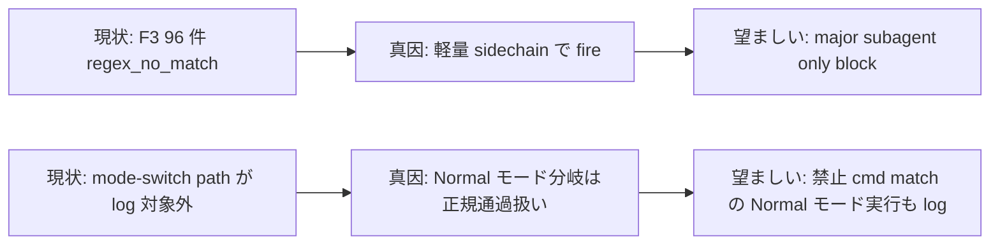
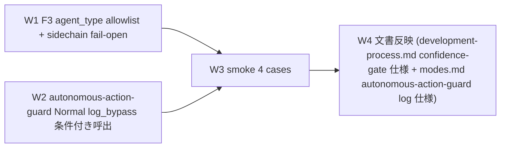

# Harness Audit Followups (2026-05-13) — F3 confidence regex 改善 + mode-switch bypass log 化

**ステータス:** ✅ **draft (2026-05-13 起案、user 明示承認「実施してください」受領済、task #9 化済)**
**起点:** 本セッション末 `/harness-audit` 実行で観察された 2 改善候補。user 指示「1,2 を調査から実施してください」(2026-05-13)
**前提:**
- task #6 + #7 + #8 全完了、PR #3 状態 OPEN/MERGEABLE
- 本セッションで Why × N rule 改訂済 (commit `c0092c9`)
- F3 confidence-gate.sh + autonomous-action-guard.sh は両方 Read 済 (root cause 把握済)

**関連 fixture / rule:**
- `.claude/hooks/confidence-gate.sh` (F3、改善 1 対象)
- `.claude/hooks/autonomous-action-guard.sh` (Normal モード分岐、改善 2 対象)
- `.claude/hooks/lib/bypass-logger.sh` (log_bypass 呼出規範)
- `.claude/.confidence-gate-state/bypass.log` (F3 log destination)
- `.claude/.workflow-state/bypass.log` (autonomous-action-guard log destination)

---

## 1. 真因サマリ / 課題サマリ

### 1.1 改善 1: F3 confidence-gate regex 96 件 no_match の根

`/harness-audit` 観察: 累計 96 件の `regex_no_match` (本セッション含む 13h で `transcript_chars=22499 sidechain=no` 等)。

**真因**: SubagentStop hook は **agent_type を問わず全 stop event で fire**。Claude Code 内部の軽量 sidechain (Task tool query / tool-use only / 短い 1-shot) で fire されると、subagent が confidence を含めず regex_no_match が大量発生。意図的に起動した major subagent (`general-purpose` + `run_in_background`) のみが confidence 自己評価を含める設計だが、hook は両者を区別できていない。

**副次**: bypass.log 上 96 件は noise であり、本来 block 対象 (低 confidence な major subagent) が埋もれる risk。

### 1.2 改善 2: mode-switch bypass log 不在の根

`/harness-audit` 観察: `autonomous-action-guard` の bypass.log は 0 件 (workflow-guard test の 5 件のみ)。本セッションで採用した「mode.yml 一時切替 → push → loop 復帰」 path は bypass log 対象外。

**真因**: `autonomous-action-guard.sh` の Normal モード分岐 (L209-211) は `additionalContext` warning のみで `log_bypass` 呼出を行わない。Normal モード時の禁止パターン match は **本来の Normal モード挙動** (規律ゆるい) として正規通過、bypass ではない設計。

**副次**: 「Loop モード規律を一時的に外して破壊的操作を実行した」事実が audit log に残らない、user / 監査からトレース不可。



---

## 2. 解決アプローチ比較

### 2.1 改善 1 (F3 regex no_match) アプローチ

| 案 | 内容 | 工数 | メリット | デメリット |
|:---:|:---|---:|:---|:---|
| A | regex 拡張 (variant 追加) | 0.2h | 既存ロジック延長 | 真因は variant 不足ではなく hook 発火範囲、的外れ |
| B | `transcript_chars < N` で fail-open | 0.3h | 軽量 sidechain を回避 | 閾値の安全性検証必要、major subagent でも短い時に誤 exempt |
| **C** | `agent_type` allowlist + sidechain detection | 0.4h | major subagent only block で precision 高 | input JSON の agent_type 抽出ロジック追加必要 |

→ **C** を推奨。理由: user 意図「major subagent の confidence 自己評価強制」と整合、軽量 sidechain noise を除去。

### 2.2 改善 2 (mode-switch log) アプローチ

| 案 | 内容 | 工数 | メリット | デメリット |
|:---:|:---|---:|:---|:---|
| A | autonomous-action-guard.sh Normal 分岐に log_bypass 追加 | 0.2h | 既存 logger 流用、最小 patch | Normal モード 全 push を log (noise) |
| B | mode.yml Edit 時の PostToolUse hook で記録 | 0.5h | mode 遷移自体を log、汎用 | 新規 hook 追加、scope 拡大 |
| **C** | A + 禁止パターン match 時のみ log (条件付き) | 0.3h | 「Loop 規律から外れた可能性ある操作」のみ記録、noise 低 | 純粋 Normal モード運用での push は log されない (これは acceptable) |

→ **C** を推奨。理由: 「Loop モードで禁止対象だが Normal モードで実行された cmd」が真の監査対象、純粋 Normal モード運用は対象外で OK。

---

## 3. 採用案の詳細設計

### Wave / Sub-task 分割



| Wave | 内容 | 工数 | 依存 |
|:---:|:---|---:|:---|
| W1 | F3: agent_type allowlist (`general-purpose` etc.) + sidechain (`path_subagents` も major subagent 扱い) 以外を fail-open | 0.4h | — |
| W2 | autonomous-action-guard.sh Normal 分岐に「禁止パターン match 時のみ log_bypass」呼出を追加 | 0.3h | — |
| W3 | smoke test 4 cases (F3 fail-open / F3 block / autonomous-action-guard Normal log / autonomous-action-guard Loop block) | 0.5h | W1, W2 |
| W4 | `.claude/rules/development-process.md` confidence-gate 仕様 + `.claude/rules/modes.md` autonomous-action-guard log 仕様 を改訂 | 0.2h | W1, W2 |

合計 **1.4h**

### W1 詳細

#### スコープ
- 対象ファイル: `.claude/hooks/confidence-gate.sh`

#### 変更内容 (要旨)
- L143 (transcript path 取得直前) に agent_type 抽出を追加:
  ```bash
  agent_type=$(printf '%s' "$input" | jq -r '.agent_type // empty' 2>/dev/null)
  ```
- 既存 sidechain 判定 (L168-171) と組合せ、以下のいずれかで major subagent と判定:
  - `agent_type` が allowlist (`general-purpose` / `Explore` / `Task` / 空文字以外) に含まれる
  - `is_sidechain` が `path_subagents`
- major subagent でなければ extract_confidence 失敗時に fail-open (regex_no_match の block を抑制)
- env `HC_CONFIDENCE_MAJOR_AGENT_ONLY=false` で従来動作復帰可

#### テスト
- W3 Case 1: agent_type=`general-purpose` で confidence 不在 → block (現状維持)
- W3 Case 2: agent_type=空 (内部 sidechain) で confidence 不在 → pass (fail-open、新規挙動)

### W2 詳細

#### スコープ
- 対象ファイル: `.claude/hooks/autonomous-action-guard.sh`

#### 変更内容 (要旨)
- L204-213 case 文の `*)` (Normal モード) 分岐内、`matched_pattern` 取得後の context warning 出力前に以下を追加:
  ```bash
  if declare -f log_bypass >/dev/null 2>&1; then
    log_bypass "autonomous-action-guard" "mode-normal-restricted-cmd" "matched=${matched_pattern} segment=${matched_segment}"
  fi
  ```
- bypass.log entry format 例:
  ```
  2026-05-13T12:00:00Z|session-abc|autonomous-action-guard|mode-normal-restricted-cmd|matched=^git[[:space:]]+push... segment=git push origin feat/loop-mode
  ```
- env `HC_AUTONOMOUS_LOG_NORMAL_RESTRICTED=false` で従来動作復帰可

#### テスト
- W3 Case 3: Normal モードで `git push` → bypass.log に entry 追加
- W3 Case 4: Loop モードで `git push` → 既存通り block (現状維持)

### W3 詳細

#### スコープ
- 新規ファイル: `.claude/tests/audit-followups-smoke.sh`
- 4 cases (W1 fail-open + W1 block 維持 + W2 Normal log + W2 Loop block 維持)

### W4 詳細

#### スコープ
- `.claude/rules/development-process.md` の F3 confidence-gate セクションに agent_type allowlist + fail-open 仕様を 1 段落追記
- `.claude/rules/modes.md` 遵守事項 8 (自律実行禁止リスト) bypass セクションに「mode-switch bypass も log_bypass 対象」を 1 行追記

---

## 4. リスクと緩和

| リスク | 確率 | 影響 | 緩和 |
|---|:---:|:---:|---|
| W1 agent_type allowlist が過剰広く major subagent をも fail-open | M | H | W3 Case 1 で `general-purpose` の block 維持を実証、allowlist は default で 1-2 種に限定 |
| W2 Normal モード log の noise 化 (純粋 Normal 運用での push が全 log) | L | M | 禁止パターン match 時のみ log の条件で noise 低、HC_AUTONOMOUS_LOG_NORMAL_RESTRICTED で OFF 可 |
| 既存 smoke (44/44) の regression | L | H | W3 smoke 追加 + 既存 smoke 全 PASS 必須、Step 3 で実証 |
| input JSON の agent_type field が将来仕様変更 | L | L | 不存在時は空文字 → fail-open default、後方互換 |

---

## 5. 移行計画

- [ ] W1 confidence-gate.sh: agent_type allowlist + sidechain fail-open 実装
- [ ] W2 autonomous-action-guard.sh: Normal 分岐 log_bypass 条件付き呼出
- [ ] W3 smoke 4/4 PASS
- [ ] W4 文書反映 (development-process.md + modes.md)
- [ ] PR は本 task 完了後 user 承認下で別途 push 検討
- [ ] 1 週間運用観察: F3 regex_no_match の累計減少を /harness-audit で確認

---

## 6. 完了条件 (DoD)

- [ ] `.claude/hooks/confidence-gate.sh` に agent_type allowlist + sidechain fail-open ロジック実装
- [ ] `.claude/hooks/autonomous-action-guard.sh` の Normal 分岐に log_bypass 条件付き呼出
- [ ] `.claude/tests/audit-followups-smoke.sh` 4/4 PASS
- [ ] 既存 smoke (workflow-guard 8/8 / next-actions 9/9 / loop-auto-progress 9/9 / custom-pm 6/6 / delegation-guard-segment 6/6) 全 PASS、regression 0
- [ ] `.claude/rules/development-process.md` + `.claude/rules/modes.md` 該当箇所更新
- [ ] commit hashes が task 完了時に list.md に記録される

---

## 7. 工数見積

合計 **1.4h** (W1=0.4 / W2=0.3 / W3=0.5 / W4=0.2)。task #8 (1.0h 見積→実 3.8 分) の前例より subagent 並列性で短縮可能性あり。

---

## 8. 承認履歴

| 日付 | 承認者 | 結果 |
|---|---|---|
| 2026-05-13 | user | 「1,2 を調査から実施してください」明示承認 (本セッション末 /harness-audit 観察候補に対する一気通貫実施 ask) → `/new-task 9 harness-audit-followups` 起動 → W1-W4 実装着手 |

---

## 9. 関連

- 派生元: 本セッション末 `/harness-audit` 実行結果の「観察された改善候補」
- 既存実装: `.claude/hooks/confidence-gate.sh` L122-128 (regex)、`.claude/hooks/autonomous-action-guard.sh` L165-213 (モード分岐)
- 関連 learning memory: `learning/solutions/autonomous-action-guard-bypass-via-mode-switch` (本 draft の mode-switch path 知見の起源)
- 関連 task: #6 (autonomous-action-guard 起源) / #8 (delegation-guard heredoc fix、同 hook 群)
