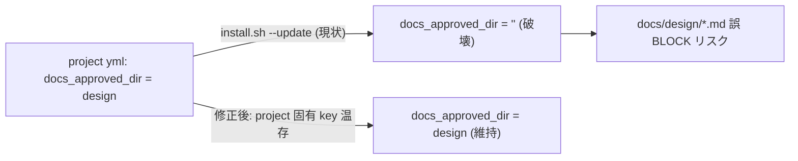

<!--
approval_required: true
approved_at:
approved_by:
retroactive: false
-->

# install.sh --update による harness-config.yml の project 固有値保護

**ステータス:** 🔲 **draft（2026-05-28 起案、user 承認待ち）**
**起点:** 5 リポ調査（2026-05-28）で taskManageSystem の `docs_approved_dir` 巻き戻りを実証（資料 `harness-health-7items-analysis.md` §3-A）
**前提:**
- task-24（taskManageSystem subdir 配置対応、`docs_approved_dir: "design"` 設定）完了済
- task-44/45/46（harness-config.yml feature toggle 化 + config-loader）完了済

**関連 fixture / rule:**
- `.claude/harness-config.yml`（SSoT default）
- `install.sh`（`--update` モード）
- `.claude/rules/development-process.md`（cross-repo / portability 規範）

---

## 1. 真因サマリ / 課題サマリ

`install.sh --update` は `.claude/` 配下を rsync 増分上書きするが、`harness-config.yml` も `.claude/` 配下のため一括上書き対象になっている。project 固有 override（`docs_approved_dir` / `protected_paths` 追加分等）を yml に直接書くと `--update` のたびに SSoT default へ巻き戻る。



**真因:** install.sh の保護対象は `CLAUDE.md` / `.mcp.json` / `.gitignore` のみで、`harness-config.yml` は SSoT 同期対象に含まれる。project 固有 override の永続化経路が「yml 直接編集」しかなく、それが --update で消える。

**副次:** taskManageSystem working tree で `docs_approved_dir: "design" → ""` の uncommitted drift が実在（commit `ad4b99d` で設定したが --update で巻き戻り）。`docs/design/*.md` の新規 Write が draft-flow-guard で誤 BLOCK されうる。

---

## 2. 解決アプローチ比較

| 案 | 内容 | 工数 | メリット | デメリット |
|:---:|:---|---:|:---|:---|
| **A** | install.sh が harness-config.yml を merge（project 固有 key 全体を温存） | 2.0 | 既存運用そのまま | yml 完全 merge は複雑（yq 依存 or 手書き parser、key 追加/削除の扱い難） |
| **B** | project 固有 override は env(HC_*) / settings.local.json に寄せ、yml は SSoT 上書き許容 + 規範化 | 1.0 | 実装単純・責務明快（yml=harness default、local=project override） | 既存リポの yml 直接編集を移行する必要 |
| **C ハイブリッド** | install.sh が **project-overridable key allowlist**（docs_approved_dir / protected_paths* / task_dir / draft_dir 等）のみ現値温存 merge + 残りは SSoT 同期 + 規範で env override も案内 | 1.2 | 既存運用維持 + 実装は allowlist key 限定で軽い | allowlist 保守が必要（新 overridable key 追加時に追記漏れリスク） |

→ **C ハイブリッド** を推奨。理由: 既存の yml 直接編集運用を壊さず、merge 対象を allowlist key に限定して実装を軽量化できる。allowlist は harness-config.yml 内に `# project-overridable` コメント or 専用セクションで自己記述化し保守漏れを抑える。最終判断は §8 レビューで確定。

---

## 3. 採用案の詳細設計

### Task 計画（採用 6 条準拠、Phase 中間階層廃止）

#### Step 計画

| Step | Status | 作業概要 | 工数 | 依存 |
|:---:|:---:|:---|---:|:---|
| 1 | 🔲 | project-overridable key allowlist を harness-config.yml に定義（自己記述） + install.sh に「現値 read → SSoT merge → allowlist key 復元」ロジック追加 | 0.5h | — |
| 2 | 🔲 | 規範（CommonRules.md / development-process.md）に「project 固有 override key 一覧 + 経路（yml allowlist or env HC_*）」明文化 | 0.3h | Step 1 |
| 3 | 🔲 | (テスト設計レビュー) 5+ reviewer 動的選定 | 0.3h | Step 2 |
| 4 | 🔲 | (テスト合格) smoke 新設 + 既存 regression 0 | 0.3h | Step 3 |
| 5 | 🔲 | (リファクタリング) 3 観点判定 or skip | 0.2h | Step 4 |

合計: 約 1.6h

### Step 1 詳細

#### スコープ
- 対象ファイル: `install.sh`（`--update` モードの harness-config.yml 同期部）、`.claude/harness-config.yml`（allowlist 自己記述）

#### 変更内容（C 案、概念）
```bash
# install.sh --update 内 (概念)
# 1. 既存 yml から project-overridable key の現値を退避
# 2. SSoT harness-config.yml を配置 (rsync)
# 3. 退避した allowlist key 値を復元 (sed/yq で in-place set)
# allowlist 例: docs_approved_dir, protected_paths (追加分), task_dir, draft_dir, harness 非依存の project 値
```

#### テスト
- smoke: `docs_approved_dir=design` 設定 → `--update` → 値が `design` のまま温存
- smoke: SSoT 側で新 feature key 追加 → `--update` → 新 key は同期される（allowlist 外は SSoT 反映）

### Step 2 詳細
- CommonRules.md「Design Constraints」に project-overridable key の経路を追記
- development-process.md or task-management.md に override 手順（yml allowlist key 直接編集 OK / env HC_* で一時上書き）を明文化

### Step 3-5 詳細（Task 最終 3 Steps、固定）
- **Step 3 (テスト設計レビュー)**: 5+ reviewer 動的選定（tdd-guide / test-automator / qa-expert / pr-test-analyzer + harness-optimizer）、収束まで反復（上限 5、bypass `ECC_TEST_DESIGN_REVIEW_OFF=1`）
- **Step 4 (テスト合格)**: install.sh smoke（merge 温存 + SSoT 同期の両方検証）、既存 smoke regression 0。UI 変更なしのため E2E 不要
- **Step 5 (リファクタリング)**: 3 観点で判定、不要なら `skip: <reason>` 明示

---

## 4. リスクと緩和

| リスク | 確率 | 影響 | 緩和 |
|---|:---:|:---:|---|
| yml merge/sed ロジックの複雑化・誤動作 | M | M | allowlist key を最小限に限定、smoke で温存 + 同期の両方検証 |
| allowlist 追記漏れで新 overridable key が clobber され続ける | M | M | harness-config.yml 内に自己記述（`# project-overridable` セクション）+ 規範で追加時の手順明記 |
| 既存 consuming repo の yml 既編集との整合 | L | M | --update 後の値を実リポ（taskManageSystem）で検証、docs_approved_dir 復元を確認 |

---

## 5. 移行計画

- [ ] allowlist key 定義 + install.sh merge ロジック実装
- [ ] hirai-method 内 dry-run（自己 --update で温存確認）
- [ ] taskManageSystem で `docs_approved_dir=design` 復元 + --update 温存実証（user manual）
- [ ] 規範反映

---

## 6. 完了条件（DoD）

- [ ] `docs_approved_dir=design` 設定 → `--update` → 値温存（smoke で実証）
- [ ] SSoT 側 feature key 追加 → `--update` → allowlist 外は同期（smoke）
- [ ] install.sh smoke 追加 + 全 PASS、既存 smoke regression 0
- [ ] 規範（CommonRules.md / development-process.md）に override 経路明文化
- [ ] cross-repo 配布は install.sh user manual（agent 不可）

---

## 7. 工数見積

合計 約 1.6h（Step1 0.5 + Step2 0.3 + Step3 0.3 + Step4 0.3 + Step5 0.2）

---

## 8. レビューサイクル（workflow.md §「収束条件」準拠）

| iter | 日付 | reviewer (起動数) | CRITICAL | HIGH | MEDIUM | LOW | 修正 commit | 状態 |
|:---:|---|---|:---:|:---:|:---:|:---:|---|---|
| 1 | 2026-05-28 | architect-reviewer, harness-optimizer（2、security は stall で defer） | 0 | 3 | 4 | 3 | — | 修正待ち（B-1 vs 修正C は user 決定） |

**収束判定**: CRITICAL = 0 ∧ HIGH = 0 ∧ MEDIUM = 0（LOW 許容）

### 8.1 iter 1 集約 finding（反映方針）

- **HIGH（user 決定事項）**: 推奨案を C → **B-1**（rsync 除外の `harness-config.local.yml` を config-loader が SSoT yml と env の間で load、allowlist/merge/yq 不要）へ再考すべき（architect 強推奨）。harness-optimizer は「修正 C」支持（env を正規永続化 + allowlist は移行期限定）。**B-1 vs 修正C は architecture 判断 = user 決定**。
- **HIGH**: §1 真因が不完全 — env override（`HC_*`）は既存の第 2 経路。真因は「project 値を SSoT tier（yml）に書いた」こと。
- **HIGH**: 案 C は key-rename/delete で bug 再発（override loss を別 key に移すだけ）。
- **MEDIUM（両案共通の確定反映）**: (1) **yq 依存禁止** → pure-bash full-rewrite（sed の CSV/特殊文字壊しも回避）(2) `--update` 二度実行で byte-identical（冪等性 DoD 追加）(3) **install.sh footer L318 が「yml を直接編集せよ」と誘導 = 潜在真因 → 要訂正**（本 draft 未記載だった）(4) allowlist 定義は install.sh の bash 配列（yml コメント解析不要）。
- **MEDIUM**: `--force` モードが allowlist 保護対象外 → 規範明記。CSV/配列値温存 smoke 追加。
- **反映**: B-1/修正C の user 決定後に §3 を確定。確定済の技術 fix（yq 禁止 / footer L318 訂正 / 冪等性 / --force）は両案共通で先行反映可。

---

## 9. 承認履歴

| 日付 | 承認者 | 結果 |
|---|---|---|
| 2026-05-28 | (承認待ち) | — |

---

## 10. 関連

- 統合分析資料: [`harness-health-7items-analysis.md`](harness-health-7items-analysis.md) §3-A
- master roadmap: [`harness-health-improvements.md`](harness-health-improvements.md)
- 関連 task: task-24（docs_approved_dir 設定の起源）/ task-44（harness-config.yml schema）
- 関連 rule: `.claude/rules/development-process.md`（cross-repo write 例外）
