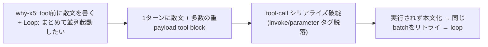

<!--
approval_required: true
approved_at: 2026-06-01
approved_by: takuma.hirai1@gmail.com
retroactive: false
-->

# ハーネス設計の本質的見直し — tool-call 信頼性と「enforcement=hook / reminder=最小」への再設計

**ステータス:** 🔲 **draft（2026-06-01 起案、user 承認待ち）**
**起点:** user 報告「前回のセッションがバグっている」。実 transcript で **tool-call markup 崩れによる subagent 起動失敗の連発 + 同一 batch 起動の無限リトライ (loop)** を確認。user 指示「harness 全体を見直す」。
**前提:**
- 観測セッション: `2f790cb2` (6/1 10:41) / `2590c1ec` (6/1 13:38)。49th save-state (5/30) 以降、複数セッションが Serena 未保存のまま task-65 を実装。
- 関連: task-66 (`context-injection-inventory-reduction`、前セッションが本バグ調査から起案 — 本 draft で scope 再定義を提案)。

**関連 rule:**
- `.claude/rules/why-x5-output.md` (tool 前散文 1 行強制)
- `.claude/rules/modes.md` (Loop モード並列起動圧力)
- `.claude/CommonRules.md` (「rule に書いて守らせる」ではなく「hook で BLOCK」default 規範)
- `.claude/hooks/delegation-guard.sh` (Bash command splitter — 本 review で friction 源として言及)

---

## 1. 真因サマリ / 課題サマリ

### 1.1 観測されたバグ (smoking gun)

前セッションは research subagent を **1 メッセージで 4〜6 件同時に** 起動しようとし、各 prompt が 10 行超 + 引用符 + markup 風断片を含んでいた。結果、**tool-call の構造タグ (`invoke` / `parameter` の囲み) が脱落**し、tool として実行されず本文テキストとして描画された。AI は「markup slip」を自己診断しつつ **同じ batch 起動を毎ターン繰り返し** (loop)、毎回同じく失敗。user には「何も動いていない」状態が続いた。**1 件だけ・短い prompt** で起動した時は成功している。



**真因:** **1 アシスタントターンに「散文 + 多数 (4-6) の複雑な (長文・引用符・markup 風) tool_use ブロック」を詰め込むと tool-call シリアライズが破綻する。** arity (同時件数) × payload 複雑度 が閾値を超えると発火。

**副次 (寄与要因):**
- **context 肥大**: 長い context は format 遵守 / tool-call fidelity を低下させる (task-66 の焦点。主犯ではないが増幅要因)。
- **why-x5 の「tool 前に散文 1 行」強制**: prose→tool 往復を毎ステップ強制し、prose+多数 tool の混在パターンを誘発しやすい。
- **Loop モードの並列起動圧力**: 「まとめて並列起動して wall-clock 短縮」を促し、1 ターン多数 tool block を後押し (parallel-subagent-reminder hook が batch を能動推奨)。
- **delegation-guard の command splitter**: main の Bash を改行 / pipe で分割し「未承認コマンド」BLOCK する。本見直しセッション中だけで multi-line commit message と `head` pipe で 2 回発火。これも「tool-call が通らない」体験の一部。

### 1.2 この事象が露呈させた harness 設計上の本質課題

観測バグは「点」だが、その背後に harness 設計の構造的な「面」の課題がある:

| # | 構造課題 | 現状 | 既知ベストプラクティスとの乖離 |
|---|---|---|---|
| C1 | **指示過多 (instruction overload)** | 30+ hook + 多層 rule (Layer A/B) + 毎ターン reminder (why-x5 / Loop 遵守事項) + 起動時 advisory ~1600 tok | システムプロンプトの実用指示数には上限があり (research 確認予定、~150-200 説)、超過分は遵守率が落ちる。thinking モデルは instruction-following がさらに低下する報告あり |
| C2 | **prose-before-tool 強制** | why-x5 で毎ステップ tool 前に散文 1 行を必須化 | prose↔tool 往復が tool-call format の一貫性を乱す可能性。CoT と tool calling の干渉 (research 確認予定) |
| C3 | **enforcement と advisory の混在** | 「hook で BLOCK」を default 規範としつつ、大量の advisory reminder も併存 | hook (deterministic) は ~100% 遵守、prompt reminder は 70-90% (research 確認予定)。advisory の多くは salience を食うだけで効いていない可能性 |
| C4 | **harness 自身が tool-call friction を生む** | delegation-guard の command splitter が改行/pipe で誤 BLOCK、subagent 起動の重 payload 化 | guardrail は「正しい操作を妨げない」べき。誤検知は retry/loop を誘発し本バグと同質 |
| C5 | **多数 subagent の手起動** | N 個の Agent block を手書きで emit (Workflow ツール未活用) | 決定論的 orchestration (Workflow) に寄せれば serialization 脆弱性を構造回避できる |
| C6 | **rule 文書の粒度設計 (Layer A 過大 + Layer B monolithic)** | Layer A (rules/*.md) は**常時 load** なのに workflow 349 / dev-process 323 / task-mgmt 250 行と過大。Layer B (*.details.md) は 1 rule = 1 巨大ファイル (90-388 行) で「14-stage 詳細 1 個欲しいだけで 388 行全部 Read」=「必要な時に必要なルールだけ読む」になっていない | many-small-files 原則 (CLAUDE.md coding-style) + skills-on-demand (§11 F4-2 / F3-6) と乖離。Layer A=summary+pointer、Layer B=topic 別断片であるべき (user 指摘 2026-06-01) |

> **live 実証 (2026-06-01 本見直しセッション中)**: `parallel-subagent-reminder` hook が subagent 起動のたびに「複数 subagent を**同一 message 内で並列起動**すると wall-clock 短縮」と注入してくる。これは観測バグの主犯 (1 ターン多数 tool block → serialization 破綻) を **harness 自身が能動推奨**している証拠。advisory reminder が「速度最適化」を促す一方で「tool-call 信頼性」とトレードオフになっており、reminder の目的が現実の失敗モードと逆行している。C4 (harness friction) + C5 (手起動) の交点であり、案 B での見直し対象。

---

## 2. 解決アプローチ比較

| 案 | 内容 | 工数 | メリット | デメリット |
|:---:|:---|---:|:---|:---|
| **A (運用作法のみ)** | 規範追記のみ: 「多数 subagent は 1 ターン 1 起動 or Workflow」「長 prompt は file 経由」「prose+多数 tool を 1 ターンに混ぜない」を modes.md / development-process.md に明記 | 0.5h | 即効・低リスク・コード不変 | prompt 遵守頼み (C3 の指摘通り 70-90%)。本バグ自体が「指示を守れない」事象なので効果限定 |
| **B (構造削減 + deterministic 化)** | C1-C6 を構造対処: **(0、中心的支柱) rule architecture 再構造 (全 6 rule の Layer A 軽量化 + Layer B 断片化)** (1) advisory reminder を pointer 化/opt-in (task-66 の中核を吸収) (2) why-x5 を「tool 前散文」から「ターン冒頭 1 回」へ緩和 (3) delegation-guard splitter の改行/pipe 誤検知を修正 (4) 多数 fan-out を Workflow 標準化 + 規範化 | 8h+ | 主犯 (arity×payload) と寄与要因 (context 肥大/format 圧/harness friction) を両方削減。deterministic 寄せで遵守率に依存しない。常時 load token を構造削減 | 規範変更 + hook 変更で影響範囲広。段階適用と smoke 必須。tasking は 2 task 分割可 (rule 再構造 / 挙動修正) |
| **C (全面再設計)** | harness の hook/rule/reminder を白紙評価し「最小 scaffolding」へ再構築 (Anthropic "Building effective agents" simple-is-robust 思想) | 10h+ | 最も本質的、保守性最大化 | 大規模・高リスク・既存資産 (task-1〜65 の蓄積) の毀損リスク。別 phase 推奨 |

→ **案 B を推奨** (A を内包)。理由: 観測バグの主犯 (1 ターン arity×payload) と寄与要因 (context 肥大 / format 圧 / harness friction) を構造的に同時対処でき、かつ既存資産を壊さない段階適用が可能。案 C (全面再設計) は B の効果測定後に別 draft で判断。task-66 は本 draft の §3 案 B (1) に吸収・再定義する。

---

## 3. 採用案 B の詳細設計 (research 折込済)

> 外部 research 2 件 (設計哲学 conf 0.82 / hook 注入 conf 0.88) を §11 に折込済。本 §の対策は §11 finding が裏付け。

### 3.0 rule architecture 再構造 — 中心的支柱 (C1/C6 対処、全 6 rule、user 承認: 全 6 一括 + Layer A 軽量化含む)

**現状の問題**: Layer A (rules/*.md) は**常時 load** なのに過大 (workflow 349 / dev-process 323 / task-mgmt 250 行)。Layer B (*.details.md) は 1 rule = 1 巨大ファイル (90-388 行) のため、`workflow-guard` 詳細 1 個を読むだけで 388 行全部を context に載せる = 「必要な時に必要なルールだけ読む」になっていない。

**目標構造** (全 6 rule = workflow / development-process / modes / task-management / self-improvement / why-x5-output):

```
.claude/rules/<rule>.md          # Layer A: 概要 + command/key 表 + pointer のみ (目標 <120 行)
.claude/rules-details/<rule>/    # Layer B: topic 別断片 (1 断片 = 1 pointer 先 = 1 cohesive topic、目標 <100 行)
    <topic-1>.md
    <topic-2>.md ...
```

例 (workflow): `rules-details/workflow/{14-stage, 10-stage, workflow-guard, draft-flow-guard, refactoring, mece-20, fan-out, reviewer-prompt, byproduct-discharge, session-persistence}.md`

**pointer 規約**: Layer A は断片ファイル直リンク `> 詳細: [rules-details/workflow/workflow-guard.md](../rules-details/workflow/workflow-guard.md)` (旧 `workflow.details.md §workflow-guard 詳細` の anchor 方式を廃止)。これで Read が断片単位 surgical になる。

**Layer A 軽量化** (user 承認「含める」): full table / 機構詳細 (14-stage 表 / workflow-guard 判定 5 step + state JSON schema / MECE 20 各論 等) を Layer B 断片へ移送。Layer A は (a) 1-3 行要約 (b) 即参照頻度が高い command/key 表 (c) pointer に限定。
- **例: 「workflow-guard.sh による強制機構」(user 質問)** → Layer A は「PreToolUse(Bash) で `/finish-task` 直前発火、stage 未完 or pending CRITICAL/HIGH 残存で BLOCK。詳細: `rules-details/workflow/workflow-guard.md`」の 3 行のみ。判定 5 step + state JSON schema は断片へ (= **Layer A に書く必要なし**)。

**auto-load 安全性 (CRITICAL)**: Claude Code は `.claude/rules/*.md` のみ startup 再帰 discover + load (memory `feedback_paths_frontmatter_does_not_exclude`)。`.claude/rules-details/` は rules/ の外なので **subdir を作っても auto-load されない**。これを smoke で保証 (rules-details/ 配下は常時 context 非搭載)。

**enforcement / SSoT 不変**: rule 文書の再配置のみ。hook BLOCK ロジックは無関係、SSoT 内容は無損失移送 (memory `feedback_ssot_priority_over_size_target`: size 削減より SSoT 無損失優先)。

### 3.1 多数 subagent fan-out の Workflow 標準化 (主犯対処)

- **規範**: 3 件以上の独立 subagent fan-out は **Workflow ツール** (決定論 orchestration) を default とする。手書き N block は禁止寄り (2 件までは許容)。
- **手起動時の上限**: 1 アシスタントターンに emit する tool_use は、長 prompt (>5 行) を含む場合 **最大 1〜2 件**。長 prompt は file 経由 (subagent に Read させる) で payload を軽くする。
- Workflow はユーザ明示 opt-in が要件 → 「多数 fan-out 時は Workflow を提案」という運用とセットで規範化。

### 3.2 advisory reminder の pointer 化 / opt-in (task-66 吸収、C1/C3 対処)

- task-66 `context-injection-inventory-reduction` の案 A (why-x5/mode-enforce を pointer 短縮、session-help opt-in、task-rule-guard note 抑制) を本 §に統合。
- **enforcement (BLOCK) は完全凍結**、advisory のみ削減。優先度「① ルール保持 > ② 削減」を継承。

### 3.3 why-x5 の緩和 (C2 対処) — research 根拠 §11 F2-4 / F3-3 / F1-5

- 現状「tool 前に毎回散文 1 行」→ 「**ターン冒頭に 1 回**、思考ロジックは内部で踏む」へ緩和を検討。
- memory `feedback_why_x5_once_per_turn` が既に「ターン冒頭 1 回」を許容 → 規範本体と整合を取る。
- 透明性 (why の可視化) は維持しつつ、prose↔tool 往復の頻度を下げる。

### 3.4 delegation-guard splitter の誤検知修正 (C4 対処)

- main の Bash を改行 / pipe (`| head`, `| tail`, `| wc`) で分割 → 各 segment を whitelist 照合する現実装が、正当な複合コマンドを誤 BLOCK する。
- quote-aware / heredoc-aware split は既に一部実装 (memory `learning/solutions/delegation-guard-quote-aware-split`) だが、pipe 先の `head`/`tail` 等 read-only フィルタは whitelist 拡張 or splitter 改善で通すべき。
- **enforcement の意図 (危険コマンド BLOCK) は維持**、誤検知のみ削減。

### 3.5 Step 計画 (採用 6 条準拠、tasking は 2 task 分割推奨)

> 規模が大きいため tasking 時は **Task-X (rule 再構造、Step 1-3)** と **Task-Y (挙動修正、Step 4)** の 2 task 分割を推奨 (master roadmap 経路 B)。両 task で Step 5-8 (レビュー/合格/refactor) を各々持つ。下表は統合 view。

| Step | Status | 作業概要 | 工数 | 依存 |
|:---:|:---:|:---|---:|:---|
| 1 | 🔲 | 断片化の命名 / ディレクトリ / pointer 規約確定 + `rules-details/README.md` に index 設計 + auto-load 非対象の検証方法確定 | 0.5h | — |
| 2 | 🔲 | 全 6 rule の Layer B 断片化 (各 *.details.md → `rules-details/<rule>/<topic>.md`) + Layer A pointer 直リンク書換 | 2.0h | Step 1 |
| 3 | 🔲 | 全 6 rule の Layer A 軽量化 (full table / 機構詳細を断片へ移送、要約 + pointer 化、目標 <120 行/file) | 1.5h | Step 2 |
| 4 | 🔲 | 挙動修正: Workflow 標準化 + 1ターン tool block 上限 + why-x5 緩和 (ターン冒頭1回) + advisory pointer 化/事実文化 (task-66 吸収) + delegation-guard splitter 誤検知修正 | 2.0h | Step 1 |
| 5 | 🔲 | smoke: 全 Layer A pointer の断片存在検証 (dangling 0) + `rules-details/**` auto-load 非対象 + enforcement BLOCK 不変 + 起動時 token before/after 実測 | 1.0h | Step 2-4 |
| 6 | 🔲 | (テスト設計レビュー) 5+ reviewer 動的選定、enforcement 不変 + SSoT 無損失 cross-check 重点 | 0.5h | Step 5 |
| 7 | 🔲 | (テスト合格) 全 hook / script smoke regression 0 + 1ターン多数tool 起動の信頼性 dogfood (markup 崩れ再現有無) | 0.5h | Step 6 |
| 8 | 🔲 | (リファクタリング) 3 観点 + 4 リポ install user manual 案内 | 0.3h | Step 7 |

合計: **~8.3h** (2 task 分割時は各 ~4h)

---

## 4. リスクと緩和

| リスク | 確率 | 影響 | 緩和 |
|---|:---:|:---:|---|
| reminder 削減で salience 低下 (Loop 逸脱 / why-x5 忘れ) | M | M | 最重要 1-2 行 + rules pointer を残す。dogfood 1-2 session 観察 |
| why-x5 緩和で透明性低下 | M | L | ターン冒頭 1 回は維持、思考ロジックは内部で必須 |
| delegation-guard 修正で危険コマンドを通す | L | **H** | enforcement (危険 pattern BLOCK) は凍結、read-only filter のみ通す。smoke で危険コマンド BLOCK を gate |
| 案 B が観測バグを実際には防げない | M | M | Step 6 で「1ターン多数tool」を意図的に dogfood し再現有無を実測 |

---

## 5. 移行計画

- [ ] research 結果折込で §3 確定
- [ ] task-66 との統合 or 並走を決定
- [ ] 段階適用 (Step 2 規範 → Step 3 advisory → Step 4 hook)、各 Step で smoke
- [ ] dogfood 観察 (1-2 session)
- [ ] 4 リポ install (user manual)

---

## 6. 完了条件（DoD）

- [ ] 多数 subagent fan-out が Workflow / 1ターン上限で規範化され、観測バグ (markup 崩れ) が dogfood で再現しない
- [ ] advisory reminder pointer 化で起動時 token 実測削減、enforcement BLOCK smoke 全 PASS (不変)
- [ ] why-x5 緩和 + delegation-guard 誤検知修正、両 hook smoke regression 0
- [ ] task-66 の統合 or 関係が明示
- [ ] docs 反映 + 4 リポ install 案内

---

## 7. 工数見積

合計 **4.3h** (research 折込で変動)。案 A 相当 (規範) 1h + 案 B 追加 (構造) 3.3h。

---

## 8. レビューサイクル (workflow.md §「収束条件」準拠)

| iter | 日付 | reviewer (起動数) | CRITICAL | HIGH | MEDIUM | LOW | 修正 commit | 状態 |
|:---:|---|---|:---:|:---:|:---:|:---:|---|---|
| 1 | — | (未実施) | — | — | — | — | — | 起案直後 |

---

## 9. 承認履歴

| 日付 | 承認者 | 結果 |
|---|---|---|
| 2026-06-01 | (起案) | user「harness 全体を見直す」指示で起案。observed bug の root cause 確定 + 案 A/B/C 比較、案 B 推奨 |
| 2026-06-01 | takuma.hirai1@gmail.com | **承認** (案 B、2 task 分割: Task-X rule 再構造 = task-67 / Task-Y 挙動修正 = task-68)。research 2 件折込済。task-66 (advisory 削減) は task-68 に吸収・supersede |

---

## 10. 関連

- 寄与要因 draft: [context-injection-inventory-reduction.md](context-injection-inventory-reduction.md) (task-66、本 draft 案 B(1) に吸収予定)
- 親施策: [context-bloat-reduction.md](context-bloat-reduction.md) (task-51、静的層削減)
- 関連 rule: `why-x5-output.md` / `modes.md` / `development-process.md` / `CommonRules.md`
- 観測 transcript: `2f790cb2` (6/1 10:41) / `2590c1ec` (6/1 13:38)

---

## 11. 外部 research 根拠 (2026-06-01 調査、research 2 件: 設計哲学 conf 0.82 / hook 注入 conf 0.88)

> Anthropic 公式 + arXiv 一次資料 + Claude Code 公式 hooks doc + community 中心。本 §が §1.2 の課題分類と §3 の対策案の裏付け。領域1-3 = 設計哲学 research、領域4 + 過剰性判定 = hook 注入 research。

### 領域1: tool-call 信頼性

- **F1-1**: tool 定義の token 肥大 = 信頼性低下。Anthropic 社内で tool 定義 134K tok → Tool Search で 72K→8.7K (85% 減) + 精度向上 → 大量 tool 一括ロードは構造リスク ([Advanced Tool Use](https://www.anthropic.com/engineering/advanced-tool-use))
- **F1-2**: long-context で tool calling 性能が系統劣化 ([LongFuncEval arXiv:2505.10570](https://arxiv.org/pdf/2505.10570))
- **F1-3**: `strict: true` + `tool_choice` 固定が malformed call を**構造的に排除** (format をプロンプトでなくスキーマ制約で保証) ([Tool Use Implement](https://platform.claude.com/docs/en/agents-and-tools/tool-use/implement-tool-use))
- **F1-4 (主犯対処の直接根拠)**: Programmatic Tool Calling (コードで複数 tool 一括 orchestrate) が逐次散発 call 比で token 43.6K→27.3K (37% 減) + 精度 25.6%→28.5% 向上 → **散発的多数 tool call より code orchestration (= Workflow) が優位** ([Advanced Tool Use](https://www.anthropic.com/engineering/advanced-tool-use))
- **F1-5**: 相対→絶対パスに変えただけでエラー消滅 (poka-yoke)。**interface 設計 > prompt 補正** ([Building Effective Agents](https://www.anthropic.com/research/building-effective-agents))

### 領域2: deterministic guardrail vs prompt reminder

- **F2-1**: Anthropic 公式は guardrail を「同一 LLM 呼出に詰める」より「別モデルで screen」を推奨 → prompt 内 reminder 詰め込みへの否定 ([Building Effective Agents](https://www.anthropic.com/research/building-effective-agents))
- **F2-2**: prompt ベース guardrail は adversarial 下で fragile (guard 自体が jailbreak)。コード hook は LLM 推論を介さず回避不能 ([Redis](https://redis.io/blog/agentic-ai-guardrails/))
- **F2-3**: guardrail 失敗の stakes 上昇 (2026 はデータ削除・送金等の不可逆アクション) → deterministic inline enforcement の優先度上昇 ([General Analysis](https://generalanalysis.com/guides/best-ai-guardrails))
- **F2-4 (why-x5/reminder 過多の根拠)**: instruction 密度↑で SOTA モデルも系統劣化 + **ordering effect (先頭 instruction 優先、後半ほど無視)** ([IFScale arXiv:2507.11538](https://arxiv.org/html/2507.11538v1))
- **F2-5**: distractor instruction 混入に完全 robust なモデルは存在しない ([arXiv:2502.04362](https://arxiv.org/pdf/2502.04362))
- **F2-6**: minimal scaffolding = simple is robust。complexity は debug 性を下げる ([Building Effective Agents](https://www.anthropic.com/research/building-effective-agents))
- **F2-7**: guardrail 追加は必ず utility を犠牲 (No Free Lunch)。prompt reminder の「ゼロコスト追加」は幻想 ([arXiv:2504.00441](https://arxiv.org/pdf/2504.00441))

### 領域3: context engineering

- **F3-1**: context rot は全 18 frontier モデルで発生、200K 窓でも ~50K tok 付近で有意劣化 ([Morph](https://www.morphllm.com/context-rot))
- **F3-2**: lost-in-the-middle、中間情報は 30%+ 精度低下 (U 字) ([Towards AI](https://pub.towardsai.net/why-language-models-are-lost-in-the-middle-629b20d86152))
- **F3-3**: prompt bloat は ~3000 tok から推論劣化、最適 prompt 150-300 語 ([MLOps Community](https://mlops.community/blog/the-impact-of-prompt-bloat-on-llm-output-quality/))
- **F3-4**: cache hierarchy は `tools→system→messages`、tool 定義変更で全 cache 無効化 ([Prompt Caching](https://platform.claude.com/docs/en/build-with-claude/prompt-caching))
- **F3-5**: 動的コンテンツ (timestamp 等) を cache breakpoint 前に置くと hit 率ゼロ (同上)
- **F3-6**: 根本対策は「後から圧縮」より「汚染の事前排除 + subagent context 分離」。multi-agent 独立 context 窓で single 比 **90.2% 改善** ([Morph](https://www.morphllm.com/context-rot))
- **F3-7**: agentic instruction は実態で平均 1,723 語・平均 11.9 制約 ([AgentIF arXiv:2505.16944](https://arxiv.org/html/2505.16944v1))

### 領域4: hook による context 注入の正しい使い方 (Claude Code 公式 + community、conf 0.88)

> MDV doc (`https://mdv.sandboxes.jp/docs/context-injection-inventory-reduction` = task-66 draft) 分析 + 網羅 WebSearch の結果。

- **F4-1 (公式)**: hook の primary 用途は deterministic control (LLM 判断に依存せず確実実行)。`additionalContext` の意図は「session/run ごとに変わる情報 (git branch / env flag / open issues)」。**静的規約 → CLAUDE.md、命令調指示 → NG (prompt 注入防御をトリガーし context 扱いされず外部表示される)** ([hooks-guide](https://code.claude.com/docs/en/hooks-guide), [hooks reference](https://code.claude.com/docs/en/hooks))
- **F4-2**: SessionStart 注入は 200-500 tok に留めるべき、3000 tok ダンプは「CLAUDE.md 問題の焼き直し」([MindStudio](https://www.mindstudio.ai/blog/session-start-hooks-claude-code-force-context))
- **F4-3**: context injection は「persuasion」で Claude が無視できる。safety-critical は必ず exit 2 BLOCK に限定、自己修正 feedback は PostToolUse ([Dotzlaw](https://www.dotzlaw.com/insights/claude-hooks/))
- **F4-4**: UserPromptSubmit の additionalContext は **会話履歴に蓄積** (ephemeral でない) = context 膨張の直接原因 ([GitHub #40216](https://github.com/anthropics/claude-code/issues/40216))
- **F4-5**: "Start with 3 hooks, not 25" — 過度なフック化は overhead + 重複。reactive (実障害発生時のみ追加) を推奨 ([Blake Crosley 95 hooks](https://blakecrosley.com/blog/claude-code-hooks))
- **F4-6**: subagent / MCP 呼出内では hook 拒否判定が効かない経路あり ([Boucle](https://blog.boucle.sh/posts/what-claude-code-hooks-can-and-cannot-enforce/))

### hook 注入は過剰か / 使い方は正しいか — 判定 (user 質問への回答)

**判定: 大枠は公式推奨と整合 (使い方は正しい)、ただし advisory 注入の 3 点が過剰。**

| | 内容 |
|---|---|
| **正しい点** | enforcement 系 hook が全て「違反時のみ exit 2 BLOCK」(公式の deterministic enforcement と一致、F4-1/F4-3) / UserPromptSubmit を閾値監視 (context-budget) + 記録 (observe) のみに限定 (F4-4 の蓄積回避) / enforcement vs advisory の 2 分類 + 優先度付け |
| **過剰 ①** | SessionStart advisory full 再掲 **~1600 tok** (公式 200-500 tok 上限の 3-8 倍、F4-2)。why-x5 / mode-enforce / session-help |
| **過剰 ②** | task-rule-guard の docs/tasks 編集毎 note **~250 tok/Edit** (同一 advisory が多数 Edit で反復注入、F4-4) |
| **過剰 ③** | mode-enforce の「遵守事項」**命令調** (F4-1 が警告する prompt 注入防御トリガーに近い) |

**改善 (§3.2 / §3.0 に統合済)**:
1. SessionStart advisory を pointer 短縮 (-800〜1000 tok)
2. task-rule-guard note を session 1 回 marker 抑制 (task.md 作成 BLOCK は不変)
3. mode-enforce を**事実文調**に書換 (「Loop モードです: 自律継続が有効、確認質問は出力しない設定」)
4. UserPromptSubmit を閾値/イベント駆動のみに限定する現行を rules に**明文化** (将来の毎ターン reminder 追加への guardrail)
5. enforcement hook の「発動しない経路」(subagent/MCP、F4-6) を smoke でカバー

### research の 5 提言 (hirai-method 向け)

1. 毎ターン末尾 reminder 注入は ordering effect (末尾ほど無視) + U 字と正面衝突 → reactive (違反検出後注入) or token 最小化へ
2. hook の deterministic BLOCK は prompt reminder の上位互換で**既存方向は正しい**。ただし hook 注入の token コスト + cache 破壊を未計測 → 検証要
3. why-x5 の tool 前散文強制は prose↔構造出力の往復を増やし malformed リスク微増。`strict`/`tool_choice` 実施有無の確認 + 違反実測を推奨
4. rule 文書総 token を定期監査。Layer A/B 二層化は正しい方向、lazy load 徹底 (`paths:` で除外不可のため内容最小化が唯一の経路)
5. Loop 並列 subagent は context 分離で構造的に有利。ただし subagent 結果は**要約のみ返す** (生出力を積まない) を標準化

> **caveat**: 「3000 tok 劣化」「50K 劣化」は実験条件依存で変動 (one-hop 出典含む)。原著直確認で精度向上余地あり。
