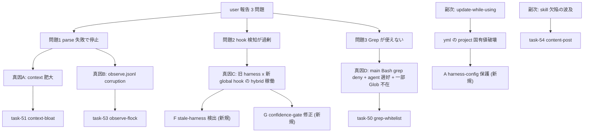
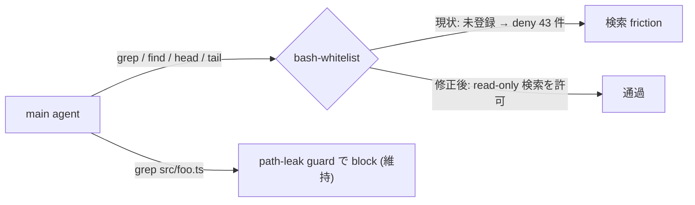
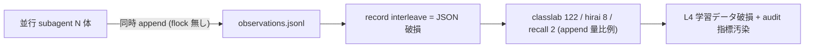
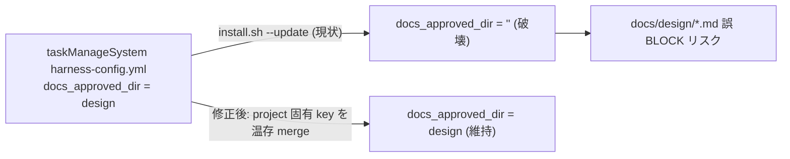
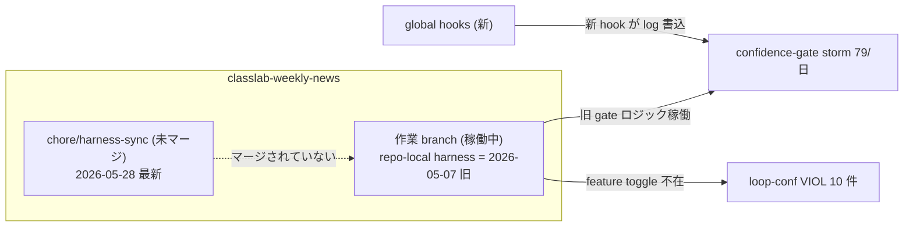
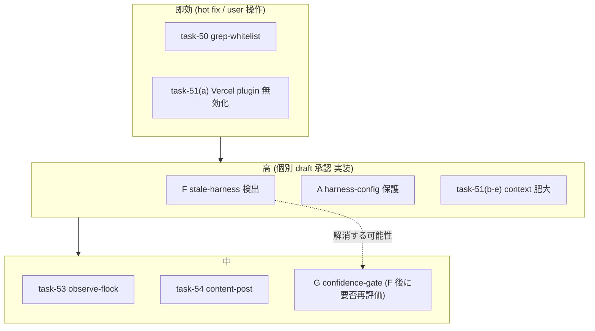

<!--
approval_required: false
approved_at:
approved_by:
retroactive: false
note: 分析資料 (task draft ではない)。7 項目 (task-50/51/53/54 + 新規 A/F/G) の調査実測 + 修正案を集約。個別 draft (A/F/G) はこの資料の承認後に起こす。
-->

# ハーネス健全性 7 項目 — 分析結果と修正案（統合資料）

**作成日:** 2026-05-28
**起点:** user 報告 3 問題（① tool call parse 失敗で停止 / ② hook 検知が過剰 / ③ Grep が使えない）
**調査方法:** 5 リポ（hirai-method + recall_poc + taskManageSystem + classlab-weekly-news + 雑務）× 2 系統（git 履歴 + 直近 3 日 runtime ログ）を 10 並列 subagent で read-only 調査
**対象 7 項目:** 既存 roadmap 4 件（task-50/51/53/54）+ 本調査で浮上した新規 3 件（A/F/G）

---

## 0. エグゼクティブサマリ

| 項目 | 種別 | 何のため | 優先度 | 調査による裏付け |
|---|---|---|:---:|---|
| **50** grep-whitelist-add | 既存 | main の検索 friction 解消 | 高(即効) | ✅ 的中（実害 43 件/3日）。ただし「Grep 不在」は誤認、効果を正確化 |
| **51** context-bloat-reduction | 既存 | parse 失敗の根本対策 | 高 | ✅ 妥当（本 session でも parse 失敗実発生） |
| **53** observe-sh-flock | 既存 | 観察ログ corruption 防止 | 中→**上方修正** | ✅ 的中（corruption は append 量比例、classlab 122 件） |
| **54** content-post-portable-idempotent | 既存 | skill 欠陥の全 PJ 波及防止 | 中 | ⚠️ 行番号要訂正 + version 増殖実在 |
| **A** harness-config 保護 | **新規** | yml の project 固有値破壊防止 | 高 | 🔴 実証（docs_approved_dir 巻き戻り）→ **B-1 確定**（reviewer 3-1、§8） |
| **F** stale-harness 検出 | **新規** | 旧 harness 稼働継続の防止 | **高(最大リスク)** | 🔴 実証（classlab が旧 harness 稼働） |
| **G** confidence-gate 修正 | **新規** | regex_no_match storm 解消 | 中 | 🟡 実証（classlab 79/日）、現 harness 未再現（F 後再評価） |
| **G1** 未 commit drift 対応 | **新規（追加承認済）** | sync 適用済の未 commit drift 解消 | 中 | 🔴 実証（recall_poc / taskManageSystem） |
| **G2** sync-workflow proactive | **新規（追加承認済）** | stale 再発防止（事前取込手順 / CI diff 通知） | 高 | 🔴 実証（classlab 旧 harness 稼働） |

**最重要結論:** 報告された 3 問題のうち **②hook 過剰の「痛み」は現 harness の欠陥ではなく、「update-while-using による旧 harness + 新 global hook の hybrid 稼働」（新規 F）が根本**。③Grep 不在は **誤認**（tool は利用可、実害は main の Bash grep deny = task-50 が的中）。①parse 失敗は context 肥大（task-51）+ observe corruption（task-53）の 2 真因。

---

## 1. 調査の全体マップ（報告問題 → 真因 → 対応項目）

---

## 2. データ可用性（「3 日分」の実態）

3 日窓（2026-05-26〜28）で**実稼働は 3 リポのみ**。observe ログは大半が 05-27 で終端＝実効 2 日分。

| リポ | observe records (窓内) | harness 状態 | 判定 |
|---|---:|---|---|
| hirai-method | 12,493 | 現 harness（SSoT） | ✅ 十分 |
| recall_poc | 16,195 | 最新 sync 済（未 commit） | ✅ 十分 |
| classlab-weekly-news | 8,991 | **旧 harness + global hook hybrid** | ✅ 十分（最重要） |
| taskManageSystem | 0 | 最新（未 commit + yml drift） | ⛔ 05-22 以降未稼働 |
| 雑務 (zatsumu) | 0（observe stale 05-07） | **harness 非導入** | ⛔ transcript も無し |

---

## 3. 各項目の分析結果と修正案

### task-50 — grep-whitelist-add（既存・優先度 高/即効）

**概要:** main agent の検索系 Bash（grep/find 等）が whitelist 外で deny され、検索 friction が発生。

**分析結果（実測）:**
- hirai-method 3 日で **Bash deny 43 件**（内訳: head 31 / grep 18 / tail 12 / wc 4 / cat 2 / bash 8）。本 session 中も `tail` `grep` が複数回 deny された（実体験）。
- **「Grep 不在」は誤認**: Grep/Glob tool は利用可・**100% 完走**（hirai-method Grep 81/81、recall_poc 05-26 Grep 175）。
- 真の現象は 3 層:
  1. **main の Bash grep を whitelist が deny**（本項目の対象、実害 43 件）
  2. **agent の Bash grep 選好**: hirai-method で Bash grep:Grep tool = **21:1**（1,727 vs 81）、recall_poc 05-27 は native Grep 175→1、Bash grep 215→706 へ全面移行
  3. **一部 subagent context で Glob 不在**: classlab で `No such tool available: Glob` 4 件（FleetView の action-space 制約、**harness 外で修正不可**。本 session の main でも Glob tool 不在を実体験）

**修正案（概要）:** `.claude/bash-whitelist.txt` の PATH-RESTRICTED セクションに read-only 検索コマンドを追加。path-leak guard は維持。

**修正案（具体）:**
- 追加: `^grep( |$)` `^find( |$)` `^rg( |$)`（+ 検討: `^head( |$)` `^tail( |$)` `^wc( |$)`）
- 維持: `grep src/foo.ts` のような src/tests/scripts 直接 inspect は path-leak guard で block
- smoke: `grep pattern` 通過 / `grep src/foo.ts` → path-leak block
- 規範: development-process.md「user レビュー → 追記」フローに従う hot fix

---

### task-51 — context-bloat-reduction（既存・優先度 高）

**概要:** context 肥大による tool call 生成不安定化（= 問題1 parse 失敗）の根本対策。

**分析結果（実測）:**
- 本 session 自体が実例: 冒頭で tool call が 2 回「malformed and could not be parsed」。
- classlab 転写に「context window」**13 件**。
- 肥大源（実測 + 静的解析）: `autoCompactEnabled: false`（global）+ paths-scoped rule 全文注入（docs/tasks/ Read 1 回で workflow.md 等数千行）+ UserPromptSubmit raw max 41KB + SessionStart の巨大注入（skills list / CommonRules.md auto-expand）。
- **Vercel plugin の無駄注入を本調査中に実観測**: git 履歴・ログ調査と無関係な workflow/verification/vercel-cli/vercel-sandbox skill が **5 回以上**誤検知注入された（"workflow"/"status"/"ppr"/"sandbox" のキーワード誤マッチ）。

**修正案（概要）:** (a) 即効: Vercel plugin 無効化 (b) paths-scoped rule の要約+リンク化 (c) SessionStart 重複 reminder 集約 (d) UPS 注入簡潔化 + (e) 追加 forensics。

**修正案（具体）:**
- (a) **即効・user 操作**: global `~/.claude/settings.json` の `enabledPlugins` から `vercel-plugin@vercel` / `vercel@claude-plugins-official` を除外
- (b) workflow.md 等の巨大 rule を「常時注入する要約 + 全文は必要時のみ参照」構造へ再編（規範変更、要 user 承認）
- (c)(d) SessionStart / UPS の hook 注入文を簡潔化・重複排除
- 検証: UserPromptSubmit raw size の median を before/after 計測
- **注意:** autoCompact の有効化は user 運用意図に関わるため user 確認必須

---

### task-53 — observe-sh-flock（既存・優先度 中 → 上方修正）

**概要:** observe.jsonl の並行 append による record corruption（L4 学習データ破損）防止。

**分析結果（実測）:**
- corruption 件数は **append 量に比例**:

| リポ | observe records | malformed/corrupt |
|---|---:|---:|
| classlab-weekly-news | 18,726 valid | **122**（binary blob で JSON 破損） |
| hirai-method | ~28,952 | 8 |
| recall_poc | 17,514 | 2 |

- classlab は並行 subagent 多用（1 subdir に 7,846 records）で corruption が突出。
- 影響: L4 学習データ欠損 + harness-audit の jq-valid 指標汚染（過去 task-32 で部分対処済だが根本の append race は未解決）。

**修正案（概要）:** observe.sh の append を排他化。

**修正案（具体）:**
- 対象: `.claude/skills/continuous-learning-v2/hooks/observe.sh` L211 `printf '%s\n' "$obs" >> observations.jsonl`
- 変更: `flock -x` で排他。macOS 標準 flock 不在環境は **mkdir lock fallback**
- smoke: N 並列 append で record 数一致 + corruption 0
- subagent 委譲 staging 戦略適用

---

### task-54 — content-post-portable-idempotent（既存・優先度 中）

**概要:** content-post skill を SSoT（雑務）から hirai-method へ移植し、成功ログの publish ゲート外出し + version 冪等化。

**分析結果（実測）:**
- **SSoT 確認**: content-post は雑務（`/Users/t.hirai/work/雑務/.claude/skills/content-post/`）が唯一の SSoT（150 files git-tracked、hirai-method に不在）。
- **version 増殖は実在**: sf 系 v14 / v19 / **v24**、claude-code 連載 v5〜9（INDEX.md は 05-27 に auto-regenerate、47 articles）。
- **roadmap の行番号がズレ**（task #56 stage 抽出 refactor 後）:

| 項目 | roadmap 記載 | 実際 |
|---|---|---|
| `[post] ok:` 成功ログ | 14-publish.ts L71 | ✅ L71 一致（publish stage 最終 summary、skip/dry-run でも発火） |
| bumpVersion 無条件+1 | version-manager.ts **L296-297** | ⚠️ **L261-322（増分は L297）**、呼出元は stages/13-update.ts |

- 除外対象（.env / node_modules / dist / content-templates / src/types/database.ts）は全 gitignore 済で移植クリーン。
- **注意**: 雑務に 04b-mermaid stage の未 commit 作業あり、移植前に確定が必要。

**修正案（概要）:** (1) 雑務 → hirai-method 移植 (portable 化) (2) `[post] ok:` を publish ゲート外へ (3) bumpVersion を content-hash 冪等化。

**修正案（具体）:**
- (1) source（scripts/ src/ SKILL.md package.json tsconfig.json）を移植（staging 戦略で subagent 可、配布は install.sh user manual）
- (2) `[post] ok:` ログを `--update` 経路でも出力されるよう publish ゲート外へ
- (3) version-manager.ts bumpVersion に content-hash 比較を追加（同一内容なら no-op）
- smoke: `--update` 単独で成功ログ出力 + 同一内容 5 回で v 増えない

---

### A — harness-config 保護（**新規**・優先度 高）

**概要:** `install.sh --update` が `harness-config.yml` を一括上書きし、project 固有 override を破壊する構造欠陥の対策。

**分析結果（実証）:**
- taskManageSystem で `docs_approved_dir: "design"`（task-24 で subdir 配置用に設定、commit `ad4b99d`）が、`--update` 適用後の working tree で **`""` に巻き戻り**（uncommitted）。
- 真因: install.sh は `CLAUDE.md` / `.mcp.json` / `.gitignore` を保護するが、**`harness-config.yml` は `.claude/` 配下として一括上書き対象**。project 固有 key（docs_approved_dir / protected_paths 等）を直接 yml に書くと消える。
- 実害: `docs/design/*.md` の新規 Write を draft-flow-guard が誤 BLOCK しうる。

**修正案（概要・3 案、review で決定）:**

| 案 | 内容 | メリット | デメリット |
|:---:|---|---|---|
| **A** | install.sh が harness-config.yml を merge（project 固有 key を温存） | 既存運用そのまま | yml merge 実装が複雑（yq 依存 or 手書き parser） |
| **B** | project 固有 override は settings.local.json / env(HC_*) に寄せ、yml は SSoT 上書き許容 + 規範化 | 実装単純、責務明快 | 既存リポが yml 直接編集済→移行作業 |
| **C** | ハイブリッド: allowlist key（docs_approved_dir / protected_paths* 等）のみ温存 merge + env override 推奨 | 両立 | allowlist 保守が必要 |

**修正案（具体）:** install.sh --update で「現 yml の project 固有 key 値を read → SSoT default に merge → project 値を復元」or「settings.local.json 層を保護対象に追加」。smoke: docs_approved_dir 設定 → --update → 値温存を検証。

---

### F — stale-harness 検出（**新規**・優先度 高 / 最大リスク）

**概要:** consuming repo が install.sh --update を作業 branch に取り込まず、旧 harness で稼働し続ける構造の検出と是正。

**分析結果（実証）— update-while-using の最大リスク:**
- classlab 作業 branch `feat/viewer-list-history` は **2026-05-07 の旧 harness**（CommonRules / feature toggle / 新 guard 7 種すべて欠落）。最新 sync は**未マージ** branch `chore/harness-sync`（2026-05-28、186 files）に隔離。
- global `~/.claude/hooks/`（新）が log を書く一方、repo-local harness は旧 → **hybrid 稼働**。これが **②hook 過剰の痛みの正体**:
  - confidence-gate `regex_no_match` storm **79/日**（bypass.log 14,188 行）
  - loop-confirmation-detector VIOLATION **10 件**
- version marker が無く「いつの harness か」を検出できない。

**修正案（概要・3 案）:**

| 案 | 内容 |
|:---:|---|
| **A** | harness に version stamp + SessionStart hook で「local version < SSoT」or marker 欠落を検出 → WARN |
| **B** | install.sh --update に「git branch 横断で .claude が最新か」check + 未マージ sync branch 検出 |
| **C** | ハイブリッド: version marker + SessionStart で主要 marker file 存在チェック（CommonRules.md / hc-config.sh 等）→ WARN |

**修正案（具体）:** harness-config.yml に `harness_version` key 導入 + 新 SessionStart hook（`stale-harness-detect.sh`）が主要 marker 欠落 or 版古を検出して WARN 注入。install.sh が version stamp を書く。smoke: marker 欠落 fixture で WARN 発火。

---

### G — confidence-gate 修正（**新規**・優先度 中）

**概要:** confidence-gate が transcript から `confidence:` を検出できず空振り block する `regex_no_match` storm の解消。

**分析結果（実証）:**
- classlab で `failed: regex_no_match` **79 件/日**（17:53〜17:55 に ~15 回 loop）。手動 bypass 連発（"transcript timing issue prevents hook detection"）。
- ただし**現 harness（hirai-method / recall_poc）では未再現** → classlab の **stale harness 固有の可能性**（旧 gate ロジック × 新 agent 挙動）。F（sync）で解消する可能性あり。

**修正案（概要・3 案）:**

| 案 | 内容 |
|:---:|---|
| **A** | confidence 抽出 regex の頑健化（多様な表記 + 最終 assistant message 抽出改善） |
| **B** | regex_no_match 時は fail-open（block しない） |
| **C** | ハイブリッド: regex 頑健化 + timing retry + 検出失敗時は block→WARN 降格 |

**修正案（具体）:** まず現 harness で再現条件を特定（stale 固有か否か切り分け）。security-reviewer 含むレビューで「gate を緩めるリスク」評価必須。**F 完了後に再評価して要否を判断**するのが効率的（stale 固有なら本項目は不要化）。

---

## 4. 優先度と実行順序

| 順 | 項目 | 経路 | 担当 |
|:---:|---|---|---|
| 1 | task-50 grep-whitelist | hot fix（user レビュー→追記） | user 承認 |
| 1 | task-51(2) 未使用 MCP/plugin 棚卸し（旧 Vercel 無効化を吸収、最高コスパ） | 即効（global settings） | user 操作（要影響評価） |
| 2 | **F stale-harness 検出** | 個別 draft → 承認 → 実装 | — |
| 2 | **A harness-config 保護** | 個別 draft → 承認 → 実装 | — |
| 3 | task-51(b-e) context 肥大 | 個別 draft → 承認（規範変更含む） | — |
| 4 | task-53 observe-flock | 個別 draft → 承認 → 実装 | — |
| 4 | task-54 content-post | 個別 draft → 承認 → 実装 | — |
| 2 | **G2 sync-workflow proactive 改善** | 個別 draft → 承認 → 実装 | — |
| 4 | **G1 未 commit drift 対応** | 運用 + 検出 | — |
| 5 | G confidence-gate | F 完了後に要否再評価（定量トリガー: regex_no_match ≦ X/日） | — |

> **task-51 内の効果順は §10 で token×残留性 で再ソート**（rule 要約化 > 棚卸し > 明示 compact > SessionStart 集約 > UPS 簡潔化）。本表「順」列は着手順序、効果量は別軸。

---

## 5. 横断的結論（update-while-using）

本調査で 3 つの構造欠陥が実証された:

1. **❶ 旧 harness + 新 global hook の hybrid 稼働（F）** — classlab。**②hook 過剰の根本原因**。
2. **❷ harness-config.yml の project 固有値破壊（A）** — taskManageSystem。`--update` が yml を一括上書き。
3. **❸ sync 適用済だが未 commit、project 作業と混在** — recall_poc / taskManageSystem。分離 commit が必要（運用）。

→ 報告された 3 問題のうち②③は**ハーネス本体の欠陥というより「導入リポの harness が古い/壊れた状態で動いている」運用構造**が主因。最優先で **F（stale 検出）+ A（yml 保護）** を設計し、update-while-using を構造的に堅牢化すべき。

---

## 6. 次のアクション

- 本資料を user がレビュー
- 承認後、**新規 A/F/G の個別 draft**（`docs/draft/<slug>.md`）を起こし設計→承認フローへ
- roadmap draft（`harness-health-improvements.md`）自体の更新（task-54 行番号訂正 + 本 finding 反映）は**別途**実施
- 運用面（classlab の sync branch マージ / recall_poc・taskManageSystem の分離 commit + docs_approved_dir 復元）は user が**別途**実施

---

## 7. データソース（調査の根拠）

| 系統 | 場所 |
|---|---|
| git 履歴 | 5 リポの `git log` / `git status` / .claude marker 照合 |
| observe ログ | `~/.claude/homunculus/projects/<hash>/observations.jsonl`（hirai `9108e0c8f946` / recall_poc `dcf8363999ff`+`76ef7442f0eb` / classlab `66d6096f05f7` / taskManageSystem `1600e437155c` / 雑務 `eda702791134`） |
| session 転写 | `~/.claude/projects/<encoded>/*.jsonl` |
| bypass / hook | `.claude/.workflow-state/bypass.log` / `.confidence-gate-state/bypass.log` |
| SSoT 状態 | hirai-method `main` = `3f3eaf0`（PR #23 merged） |
| design-review | architect-reviewer / harness-optimizer / security-reviewer（A/F 各、iter 1） |
| 上位レビュー | context-engineer / harness-engineer（7 項目 holistic） |

---

## 8. レビュー反映（2026-05-28、design-review 5 + 上位 2 エンジニア）

### 確定事項（user 承認済 2026-05-28）

- **A → B-1 採用**（別 `harness-config.local.yml` を rsync 除外 + config-loader が SSoT yml と env の間で load）。reviewer 3-1 consensus（architect / context-eng / harness-eng 推奨、harness-opt のみ修正C）。§3 に migration helper（yml 直接編集検出→local.yml 移行案内）/ `--force` 保護 / footer L318 誘導訂正 / dirty-tree safety を追加。
- **F → 案 C + `YYYY-MM-DD` stamp + marker 主・version 従 + 日数比較 Phase2 延期**。最新 repo で **0 byte 完全無音** DoD + SessionStart 集約（51-4）への依存 + marker list を `harness-config.yml` の `stale_harness_markers` key に外出し。
- **task-51 効果順を再ソート**（§4 反映）+ 未使用 MCP/plugin 棚卸し・明示 compact 運用をスコープ追加。
- **新規 task 追加**: G1（未 commit drift 対応）/ G2（sync workflow proactive 改善）。

### 横断原則（G9、全 task に課す）

harness 改善 task が**常時注入の規範文書（CommonRules.md / CLAUDE.md）を肥大させない**。追記は paths-scoped（development-process.md 等）へ寄せ、常時注入層には 1 行リンクのみ。/harness-audit に「全 WARN hook の per-session 注入 byte 合計」計測を追加（G10、WARN hook 際限増の監視）。

---

## 9. タスクリスト（実施前に何が起きているか → 対策 → 失われる可能性のある機能）

> 各対策は副作用を持つ。「③失われる可能性のある機能」を実施前に把握し、緩和策とセットで進める。

| 項目 | ① 実施前に何が起きているか（現状/被害） | ② 実行する対策 | ③ 失われる可能性のある機能 / 副作用 |
|---|---|---|---|
| **50** grep-whitelist | main の grep/find/head/tail が deny、検索のたび委譲 friction（実測 43 件/3日） | bash-whitelist に grep/find/rg（+head/tail/wc）を read-only 追加 | main が src/tests/scripts を grep 経由で間接 inspect しうる（→ path-leak guard 維持で緩和）。委譲規律がわずかに緩む |
| **51-1** rule 要約化 | docs/tasks Read 1 回で workflow.md 等 1,500+行/60KB が会話末尾まで残留（**単一最大要因**） | paths-scoped rule を「常時要約 + 全文は必要時リンク参照」へ再編 | AI が必要時に全文を読まず詳細規範を見落とすリスク（→ リンク追従の徹底で緩和）。規範の即時可視性が低下 |
| **51-2** MCP/plugin 棚卸し | deferred tools 200+ / skills list 400+ / plugin 誤注入で **15-25KB 固定消費**（task 無関係） | 未使用 MCP server + plugin を `enabledPlugins` / `.mcp.json` から除外（最高コスパ、skill-stocktake 利用可） | 除外 plugin の skill/tool が即利用不可（vercel/figma 等、必要時 re-enable 要）。**global 設定のため他プロジェクトへ影響** → 実施前に影響評価 |
| **51-3** 明示 compact 運用 | autoCompact OFF で context 線形累積 → tool-call parse 失敗（本 session 実証） | tier 80 で `/save-state` → 新 session `/resume-state`（既存 context-budget.sh 活用） | session 連続性が切れる（resume 必須）。compact 境界で in-context の細部 nuance が一部喪失。observe 連続性は save-state で memory 集約され維持 |
| **51-4** SessionStart 集約 | SessionStart hook 列が長く注入増（Loop 3 連 reminder 等） | 重複 reminder を集約 | 集約しすぎると個別 reminder の注意喚起力が低下 |
| **51-5** UPS 簡潔化 | mode-enforce が毎ターン「遵守 8 項目 + 11 カテゴリ table」全文再注入 | 初回 full + 以降は差分 / 1 行リマインド | 毎ターンの規律再確認が弱まり Loop 逸脱検出力が低下するリスク |
| **53** observe-flock | 並行 append で observe.jsonl corruption（append 量比例、classlab 122 件） | append を flock（macOS は mkdir lock fallback）で排他化 | 高並行時に append が直列化 → わずかな latency 増（corruption 防止とのトレードオフ） |
| **54** content-post | SSoT が雑務のみ、bumpVersion 無条件+1 で version 増殖（sf 系 v24） | hirai-method 移植 + `[post] ok:` を publish ゲート外 + content-hash 冪等化 | 冪等化が過剰だと内容変更時も version bump されない誤判定リスク（hash 設計で緩和）。移植で雑務側 04b-mermaid 未 commit 作業の取りこぼし注意 |
| **A** harness-config 保護（B-1） | install.sh --update が docs_approved_dir 等 project 固有値を破壊（taskManageSystem 実証） | `harness-config.local.yml` に project override 分離（rsync 除外、config-loader load） | config が 2 ファイルに分離し単一ファイル diffability が低下。local.yml 不在環境の graceful degrade 設計必須。既存リポは 1 回移行が必要 |
| **F** stale-harness 検出 | consuming repo が旧 harness で稼働継続（classlab）→ confidence-gate storm 等の hook 摩擦 | version stamp + marker 欠落を SessionStart で WARN 注入 | 新 SessionStart hook で **context 注入増**（→ 最新 repo 0byte 無音で緩和）。誤検知 WARN fatigue。意図的旧版運用も警告される |
| **G** confidence-gate（F 後再評価） | regex_no_match storm 79/日（classlab）+ 手動 bypass 連発 | regex 頑健化 + 検出失敗時 block→WARN 降格 | fail-open 化で confidence 未記載 subagent が gate 素通り（**F3 事実性ガードが弱まる**）。F 適用で storm 消失すれば不要化（定量トリガーで判定） |
| **G1** 未 commit drift 対応（新規） | sync 適用済だが未 commit、project 作業と混在（recall_poc / taskManageSystem） | 分離 commit 手順の明文化 / drift 検出 | （運用主体、機能喪失ほぼ無し）過剰検出で commit 前 WARN が増える可能性 |
| **G2** sync-workflow proactive 改善（新規） | F は事後 WARN のみ、proactive な取込手順が無く stale が再発 | stg* merge 前チェックリスト / CI 自動 diff 通知 | プロセス friction 増 / CI コスト。自動通知の誤検知 fatigue |

---

## 10. コンテキスト過剰になっている時に挿入されている内容（注入インベントリ）

> context-engineer レビュー（F-1/F-4）+ 5 リポ調査の実測。**単一最大要因は paths-scoped rule 全文注入**（一度乗ると会話末尾まで残留）。

| 注入源 | 推定サイズ | 残留性 | 発火トリガー | 対策 |
|---|---|---|---|---|
| **paths-scoped rule 全文**（workflow.md ~450 行 / development-process.md ~400 行 / task-management.md / modes.md 等） | **1,500+行 / ~60KB** | 一度乗ると会話末尾まで残留（累積） | docs/tasks・docs/draft・src 等を Read した瞬間 | **51-1**（効果最大） |
| **deferred tools list**（Asana/Gmail/Drive/Salesforce/serena/claude-in-chrome 等 200+件） | ~10-15KB | session 固定 | 毎 session（system prompt） | **51-2** 未使用 MCP 棚卸し |
| **skills list**（vercel:/figma:/sc: namespace 等 400+件） | ~10KB | session 固定 | 毎 session | **51-2** 未使用 plugin 無効化で連動縮小 |
| **CommonRules.md**（`@import` auto-expand） | 規範全文 | session 固定 | 毎 session（CLAUDE.md import） | **G9** 原則: 追記は paths-scoped へ、常時層は 1 行リンク |
| **Vercel plugin skill 注入**（workflow/verification/vercel-cli/sandbox） | 各数百 token × 5+回 | per-turn | キーワード誤マッチ（workflow/status/ppr/sandbox 等） | **51-2** plugin 無効化 |
| **UserPromptSubmit hook 注入**（why-x5-reminder / mode-enforce 8 項目+11 カテゴリ / loop-auto-progress / context-budget） | 毎ターン数 KB | per-turn 累積 | 毎ターン | **51-5** 差分化 |
| **SessionStart hook 列**（mode-session-start / next-actions-surface / list-plan-first-reminder / session-help-surface / check-serena-mcp 等） | session 固定 | session 固定 | session 開始 | **51-4** 集約 |
| **Loop モード 3 連 reminder**（SessionStart で Loop 注入 ×3） | 数 KB | session 固定 | Loop モード session 開始 | **51-4** 集約 |
| **autoCompact OFF による線形累積** | 際限なし | 全残留 | （compact されない） | **51-3** 明示 compact 運用 |

**削減効果順（token × 残留性）**: 51-1 rule 要約化（最大）> 51-2 棚卸し（最高コスパ・user 操作）> 51-3 明示 compact（parse 失敗の根本）> 51-4 SessionStart 集約 > 51-5 UPS 簡潔化。
