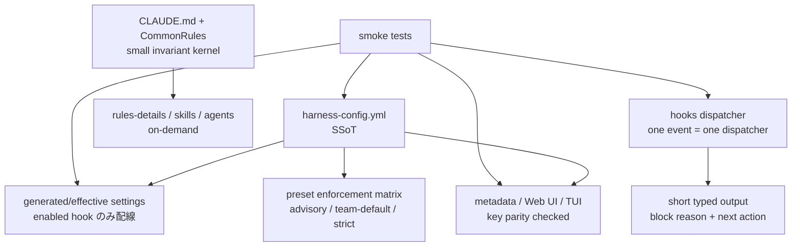
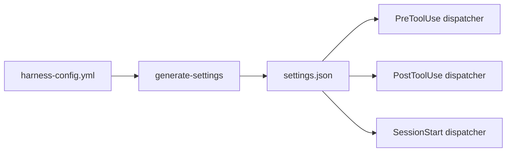

<!--
approval_required: true
approved_at: 2026-06-01
approved_by: takuma hirai (codex review 経由、修正案受け入れ + 全 Phase タスク化指示)
retroactive: false
-->

# Claude Code ハーネス網羅レビューに基づく修正案

**ステータス:** draft（2026-06-01 起案、user 承認待ち）  
**起点:** user 依頼「Claude Code のハーネスを網羅レビュー。context 過多、config 生合成、`.claude/scripts/hc-config.sh` の挙動不審を含め、多角的かつ第一原理で修正案を作成する」  
**対象:** `.claude/` 配下の rules / hooks / scripts / agents / skills / config / tests、および関連 docs

---

## 1. この資料の目的

本資料は、レビューで見えた問題を単発修正の羅列ではなく、Claude Code ハーネスとして「どうあるべきか」から逆算して整理する。

目的は次の 3 つ。

1. **軽快にする**: 常時 context と hook 起動数を減らし、判断面を小さくする。
2. **守れるようにする**: 重要ルールは prompt reminder ではなく deterministic hook / generated settings / test で担保する。
3. **壊れにくくする**: `harness-config.yml`、metadata、Web UI、TUI、docs、tests の drift を検出できる構造にする。

---

## 2. どうあるべきか

### 2.1 第一原理

LLM にルールを守らせるには、ルール文を増やすより、次の順で効く。

| 原則 | あるべき状態 | 理由 |
|---|---|---|
| 小さい不変 kernel | `CLAUDE.md` / `CommonRules.md` は短く、常時必要な不変原則のみ | 常時 context は毎 turn の判断に影響するため、長いほど遵守率と tool-call fidelity を削る |
| scoped retrieval | 詳細 rule / skill / agent は必要時だけ読む | Claude Code の skills / subagents は description によって選択されるため、選択肢が多いほど action space が濁る |
| deterministic enforcement | 破ってはいけない制約は hook / permission / generated settings で止める | reminder は確率的、hook は決定的 |
| typed observation | hook 出力は短い JSON または 1-3 行の要約 | stdout は context に載るため、説明過多は context bloat になる |
| single source of truth | `harness-config.yml` から settings / metadata / UI / tests を検証または生成する | 手書きの複数 SSoT は drift する |
| measurable budget | context byte、hook 起動数、config key parity、smoke 結果を budget 化する | 「軽い」を感覚ではなく regression test にする |

### 2.2 目標アーキテクチャ



---

## 3. 何が問題か

### P1. docs / rules は強制と書くが、config では無効

`.claude/CommonRules.md` と `.claude/rules/workflow.md` は draft-flow / task-rule / workflow / gateguard を BLOCK と説明している。一方で `.claude/harness-config.yml` では以下が `false`。

- `feature_draft_flow_guard_enabled`
- `feature_task_rule_guard_enabled`
- `feature_workflow_enforcement_enabled`
- `feature_gateguard_enabled`
- 多くの `review_required_*`

これは「モデルには必須と読ませるが、実際の境界では止めない」構造である。結果として、遵守は prompt 依存になり、しかも config と docs が矛盾する。

**問題の本質:**  
強制したいなら hook / settings / tests で止める。止めないなら docs 上も advisory と明記する。中間状態がもっとも危険。

### P1. `hc-config --list` / TUI / Web UI が config key を欠落させる

再現結果:

```text
harness-config.yml top-level keys: 79
hc-config.sh --list keys:        75

missing:
- feature_reviewer_count_guard_enabled
- feature_stale_harness_detect_enabled
- harness_version
- stale_harness_markers
```

`--get` と `--diff` では見えるが、`--list` では見えない。原因は `.claude/scripts/hc-config.sh` の `cmd_list()` が metadata category に載った key だけを出し、未分類 key を出さないため。さらに `.claude/scripts/lib/hc-config-metadata.sh` と Web server 側も metadata を key source として扱うため、UI でも同じ欠落が起こる。

**問題の本質:**  
metadata は表示補助であり、config key の存在判定の SSoT ではない。SSoT は YAML であるべき。

### P2. context bloat は rule 本文だけでなく、action space の肥大で起きている

観測値:

| 対象 | 規模 |
|---|---:|
| `.claude/agents` | 144 agents / 約 37k lines |
| agent descriptions | 約 40k chars |
| `.claude/skills` | 63 `SKILL.md` / 約 9k lines (2026-06-01 実測訂正、codex review 時 45) |
| skill descriptions | 約 14k chars |
| `.claude/commands` | 59 commands / 約 11k lines |
| rules | 約 1.1k lines |
| hooks + scripts shell | 約 11.5k lines |

Claude Code では skills / subagents の description が自動選択に使われる。つまり、本文が遅延 load されるとしても、description と選択肢の多さは毎回の判断負荷になる。

**問題の本質:**  
「たくさん用意しておく」ほど賢くなるのではなく、選択面が広がりすぎると、必要な action を選びにくくなる。

### P2. hooks が過配線で、無効 feature でも起動コストを払う

`.claude/settings.json` では、`Edit|Write`、`Bash`、`Agent|Task`、`*` などに複数 hook が配線されている。PostToolUse `*` や PreToolUse `*` もあり、観測系 hook が広く発火する。

feature toggle が `false` でも、hook process は起動し、config を読み、空 JSON を返す。このため「無効なのに軽くならない」状態になる。

**問題の本質:**  
feature toggle は hook 内の if 文だけでは不十分。無効 feature は settings からも外れるべき。

### P2. hook command が相対 path で cwd に依存する

`.claude/settings.json` の hook command は `bash .claude/hooks/...` 形式。Claude Code の hook 実行環境で cwd が repo root でない場合、hook 内の robust loader に到達する前に command が失敗する。

**問題の本質:**  
hook は repo root に依存せず、`${CLAUDE_PROJECT_DIR}` を使うか、install 時に絶対 wrapper を生成すべき。

### P2. why-x5 の docs と実配線がズレている

`.claude/rules/why-x5-output.md` は UserPromptSubmit で毎 turn 注入と説明しているが、実際の `.claude/settings.json` の UserPromptSubmit は context-budget と observe のみ。`why-x5-reminder` は SessionStart wrapper 側にいる。

**問題の本質:**  
毎 turn 強制なのか、SessionStart の reminder なのか、設計意図が曖昧。曖昧な rule は context だけ消費し、遵守は安定しない。

### P3. SessionStart 出力が重く、内容も重複している

`session-start-wrapper.sh` の出力は約 3.4KB。Loop mode、resume-state、why-x5 などが重なり、初期 context を押し上げる。

**問題の本質:**  
SessionStart は説明文を流す場ではなく、現在状態を短く渡す場にするべき。

### P3. test drift がある

`session-help-surface-smoke.sh` は PASS。一方、`hook-frequency-tweaks-smoke.sh` は session-help の旧仕様を期待して 1 case fail。現在の実装が opt-in pointer 化されているなら、test 側が古い。

**問題の本質:**  
軽量化施策は test の期待値も変える。古い test は回帰検出ではなくノイズになる。

---

## 4. どう修正するべきか

### 4.1 Phase 1: config / metadata / UI parity を直す

最優先。`hc-config` の挙動不審を解消し、以後の設定変更を安全にする。

#### 修正案

1. `hc-config.sh --list` は YAML top-level key を必ず全件出す。
2. metadata に存在しない key は `未分類` category として表示する。
3. `.claude/scripts/lib/hc-config-metadata.sh` に欠落 4 key を追加する。
4. Web server の `/api/keys` は metadata table だけでなく YAML keys を基準に merge する。
5. smoke test を追加する。

#### config 生合成 / drift の具体修正

現状の弱点は、`harness-config.yml`、metadata shell、Web server、TUI、docs がそれぞれ「config を知っている」こと。これをやめ、YAML を唯一の key source にする。

| 対象 | 現状 | 修正 |
|---|---|---|
| key existence | metadata table が実質 key 一覧になっている | YAML top-level key を SSoT にする |
| metadata | 手書きで drift する | key ごとの label / category / description だけを持つ補助情報にする |
| Web UI | metadata から keys を組み立てる | YAML keys に metadata を left join する |
| TUI / `--list` | category 付き key だけ表示 | 未分類 group を必ず出す |
| docs | 実 key と手書き説明がズレる | `hc-config --dump-docs` で表を生成するか、parity smoke を入れる |

##### 目標データモデル

```text
harness-config.yml
  key: value                       # SSoT

hc-config-metadata.sh
  key -> label/category/description # 任意の表示補助

hc-config schema
  key -> type/default/allowed       # validation 補助

Web UI / TUI / docs
  YAML keys + metadata/schema merge # 派生物
```

##### local override の扱い

`.claude/harness-config.local.yml` は override であり、key 追加の SSoT にはしない。local にだけ存在する key は `unknown_local_key` として warning 表示し、誤字を検出する。

##### migration の扱い

key rename / delete は手作業にしない。`deprecated_keys` table を持ち、`hc-config --migrate` で以下を行う。

1. old key を検出する。
2. new key に移す。
3. 移行ログを出す。
4. deprecated key が残っていれば smoke fail にする。

#### 追加 smoke

```bash
# pseudo
yml_keys=$(extract_yaml_top_level_keys .claude/harness-config.yml)
list_keys=$(bash .claude/scripts/hc-config.sh --list --machine)
api_keys=$(curl -s http://127.0.0.1:<port>/api/keys | jq ...)

assert_same_set "$yml_keys" "$list_keys"
assert_same_set "$yml_keys" "$api_keys"
```

#### 完了条件

- YAML 79 key と `--list` / Web API の key set が一致する。
- metadata 未整備の key が UI から消えない。
- 今回欠落した 4 key が list / TUI / Web UI で見える。
- local override に未知 key があれば warning になる。
- deprecated key が残っていれば migrate 案内が出る。

### 4.2 Phase 2: enforcement matrix を定義する

docs と config の矛盾をなくす。

#### 修正案

`harness-config.yml` に preset を明示する。

| preset | 用途 | enforcement |
|---|---|---|
| `advisory` | 個人実験 / PoC | BLOCK は最小、warn 中心 |
| `team-default` | 通常開発 | draft/task/workflow の重要 guard は ON |
| `strict` | release / production | review / gateguard / workflow を強める |
| `harness-dev` | ハーネス自体の開発 | 一部 guard は緩和するが、緩和理由を明示 |

#### 重要な設計

- docs に `BLOCK` と書く feature は、対応 preset で `true` でなければならない。
- `false` にする場合は docs 側も `advisory` と書く。
- `hc-config --summary` で「今の preset / 有効 guard / 無効 guard / docs と不一致」を出す。

#### enforcement matrix の具体形

`harness-config.yml` に feature flag が増えても意味が伝わらないため、matrix を別 table として定義する。

```yaml
enforcement_matrix:
  draft_flow_guard:
    feature_key: feature_draft_flow_guard_enabled
    docs_claim: block
    events:
      - PreToolUse:Write
      - PreToolUse:Edit
    presets:
      advisory: false
      team-default: true
      strict: true
      harness-dev: false
    disabled_reason:
      harness-dev: "ハーネス自身の設計 draft 編集を妨げないため"
```

##### `hc-config --summary` の出力案

```text
preset: harness-dev
guards:
  draft_flow_guard: disabled (docs: block, reason: harness-dev exception)
  task_rule_guard: disabled (docs: block, reason: harness-dev exception)
  workflow_guard: disabled (docs: block, reason: harness-dev exception)
  stale_harness_detect: enabled
warnings:
  docs/config mismatch: 3 exceptions documented
```

##### docs の書き換え方

docs には「常に BLOCK」と書かず、次のように preset aware にする。

```text
team-default / strict では BLOCK。
harness-dev では advisory。理由: ハーネス自身の編集を妨げないため。
現在の effective 状態は `hc-config --summary` を参照。
```

#### 追加 smoke

- `mandatory rule wording` と `feature toggle` の不一致を検出する。
- 少なくとも `draft-flow`, `task-rule`, `workflow`, `gateguard`, `review-required` を対象にする。
- mismatch がある場合は、`disabled_reason` が存在しない限り fail にする。

### 4.3 Phase 3: settings を生成物にする

無効 feature の hook を起動しない。

#### 修正案

1. `harness-config.yml` を SSoT にする。
2. `settings.json` を直接編集対象ではなく generated artifact に寄せる。
3. event ごとの hook は単一 dispatcher に寄せる。



#### dispatcher の contract

```json
{
  "status": "pass|warn|block",
  "summary": "one-line result",
  "next_actions": ["short actionable item"],
  "additionalContext": "optional, short"
}
```

#### hook 過多の具体的な修正方法

hook 削減は「消す」ではなく、**頻度 × 重要度 × 出力量** で再配置する。現在は高頻度 event に advisory / observe / failure detection が重なっているため、以下の 4 分類に分けて扱う。

| 分類 | 役割 | 配線方針 | 出力方針 |
|---|---|---|---|
| `blocker` | 危険操作を止める | 対象 tool/event にだけ残す | BLOCK 時のみ理由と次 action |
| `advisory` | 行動を促す | SessionStart / UserPromptSubmit に集約 | 状態変化時だけ短文 |
| `observer` | telemetry / drift 検知 | Stop または sampled PostToolUse に移す | 原則 stdout なし、log file へ |
| `bootstrap` | 初期状態提示 | SessionStart dispatcher へ統合 | 800 chars 目標 |

##### 目標 event matrix

| Event | 現状の問題 | 目標 |
|---|---|---|
| `PreToolUse: Bash` | 複数 guard + observe が毎回起動 | `pretool-dispatcher.sh Bash` 1 本。Bash 専用 blocker のみ実行 |
| `PreToolUse: Edit/Write` | draft/task/stale 系が重なりやすい | `pretool-dispatcher.sh WriteLike` 1 本。書込系 blocker のみ実行 |
| `PreToolUse: Agent/Task` | delegation reminder が context を増やす | blocker だけ残し、parallel reminder は advisory 化 |
| `PreToolUse: *` | observe が全 tool で起動 | 原則廃止。必要なら debug preset のみ |
| `PostToolUse: *` | observe / failure / why-x5 detect が全 tool で起動 | `posttool-dispatcher.sh` 1 本。failure らしき結果だけ処理、通常成功時は無出力 |
| `Stop` | 複数 hook が独立起動 | `stop-dispatcher.sh` 1 本。最終 gate / summary / state save に限定 |
| `SessionStart` | wrapper 内で複数 reminder が重複 | `session-start-dispatcher.sh` 1 本。mode / resume / guards / help pointer のみ |
| `UserPromptSubmit` | context-budget と observe が毎回起動 | `userprompt-dispatcher.sh` 1 本。budget warning と why-x5 を設定に応じて短文出力 |

##### 即時 pruning 案

1. `PreToolUse: *` の observe hook を default preset から外す。
2. `PostToolUse: *` の observe hook は `observer_level=debug` の時だけ有効にする。
3. `why-x5-violation-detect` は全 PostToolUse ではなく、Stop または UserPromptSubmit に寄せる。
4. `parallel-subagent-reminder` のような助言系は Agent/Task の直前注入をやめ、SessionStart の 1 行 pointer にする。
5. `session-start-wrapper.sh` 内の mode / resume / why-x5 / help 系 reminder を 1 つの compact status に畳む。
6. feature flag が `false` の guard は settings に出力しない。
7. debug 用の詳細 trace は `HC_HOOK_TRACE=1` または `preset=debug` でのみ出す。

##### dispatcher 実装手順

1. **inventory を作る**  
   `.claude/settings.json` から event / matcher / command / timeout / feature flag / output bytes を抽出し、`docs` または test fixture に保存する。

2. **hook と feature flag の対応表を作る**  
   例: `draft-flow-guard.sh -> feature_draft_flow_guard_enabled`、`task-rule-guard.sh -> feature_task_rule_guard_enabled`。対応しない hook は `always`, `debug`, `deprecated` のいずれかに分類する。

3. **event dispatcher を追加する**  
   まずは 5 本に集約する。

   ```text
   .claude/hooks/pretool-dispatcher.sh
   .claude/hooks/posttool-dispatcher.sh
   .claude/hooks/stop-dispatcher.sh
   .claude/hooks/session-start-dispatcher.sh
   .claude/hooks/userprompt-dispatcher.sh
   ```

4. **settings generator を追加する**  
   `harness-config.yml` から enabled feature だけを `.claude/settings.json` に出す。手書き override が必要な場合は `settings.local.json` または generated block 外に逃がす。

5. **既存 hook は段階的に dispatcher 配下へ移す**  
   いきなり削除せず、dispatcher が既存 hook を呼ぶ形から始める。安定後に shell function 化 / library 化して process 数を減らす。

6. **stdout budget を設ける**  
   通常成功時は `{}` または無出力。warn は 1-3 行。BLOCK は `reason`, `next_action`, `bypass` だけにする。

7. **metrics を取る**  
   hook event ごとの起動回数、累積 timeout 上限、実 stdout bytes を smoke で測る。

##### hook 削減 smoke

```bash
# disabled feature が settings に出ない
bash .claude/tests/settings-generation-feature-pruning-smoke.sh

# repo root 以外からでも hook command が動く
bash .claude/tests/hook-cwd-robustness-smoke.sh

# SessionStart が budget 内
bash .claude/hooks/session-start-dispatcher.sh </dev/null | wc -c

# YAML feature と settings hook 配線の整合
bash .claude/tests/effective-hook-matrix-smoke.sh
```

##### 移行中に守ること

- blocker の検出力は落とさない。削る対象はまず advisory / observer。
- `BLOCK` する hook は、同じ入力に対して dispatcher 化前後で同じ exit code になることを smoke で確認する。
- `observer` は stdout ではなく log に寄せる。モデルに読ませたい情報だけ `additionalContext` に短く出す。
- wildcard hook を残す場合は、なぜ wildcard が必要かを docs に書く。

#### 完了条件

- disabled feature の hook process が起動しない。
- hook command は `${CLAUDE_PROJECT_DIR}` か generated absolute wrapper を使う。
- PreToolUse / PostToolUse の wildcard hook は必要最小限になる。
- high-frequency event の settings command は原則 1 dispatcher になる。
- 通常成功時の hook stdout が context を増やさない。
- `observer` 系 hook は default preset で stdout を出さない。

### 4.4 Phase 4: context / action space を削る

常時見える rule / agent / skill / command を小さくする。

#### 修正案

1. project `.claude/agents` の常時露出を 15-25 程度に絞る。
2. long-tail agents は user scope / plugin / archive に移す。
3. project `.claude/skills` の常時露出を 8-12 程度に絞る。
4. utility skill は自動選択対象から外す設計を検討する。
5. `CommonRules.md` は invariant kernel のみ残し、詳細は `rules-details/` 参照にする。

#### 分類案

| 分類 | 置き場所 | 方針 |
|---|---|---|
| project-critical | `.claude/agents`, `.claude/skills` | 常時露出 |
| occasionally useful | user scope / plugin | 必要時に利用 |
| historical / experimental | archive | Claude Code の discover 対象外 |
| deterministic task | scripts / hooks | agent ではなく tool 化 |

#### agents / skills 棚卸し手順

1. **使用頻度を出す**  
   docs / tasks / transcripts / settings から agent / skill 名の参照回数を集計する。

2. **責務重複を畳む**  
   似た description の agents は 1 つに統合する。特に reviewer / build resolver / planner 系は粒度を揃える。

3. **project 固有か判定する**  
   この repo のハーネス運用に固有でないものは project `.claude/` から外す。

4. **deterministic 化できるものを外す**  
   config parity、hook inventory、smoke 実行のような定型作業は agent ではなく script / command にする。

5. **復帰経路を残す**  
   削除ではなく `archive/` または user scope へ移し、復帰コマンドを docs に書く。

##### 残す候補の基準

| 残す | 外す |
|---|---|
| ハーネス設計に直接必要 | 一般的すぎる |
| 頻繁に明示起動する | description が他と重複 |
| project local file に依存する | どの repo でも使える |
| deterministic script にできない | script / hook にできる |

##### description のルール

description は自動選択の入口なので、短く、非重複にする。

```text
悪い例: "Use for reviewing code quality, architecture, tests, maintainability..."
良い例: "Review Claude harness hook/config changes for drift, latency, and enforcement gaps."
```

#### 追加 smoke / metric

- `agents count <= 25`
- `skills count <= 12`
- `SessionStart output <= 800 chars`
- `CommonRules.md <= 150 lines`
- `rules/*.md total <= 700 lines`

数値は初期目標。厳密な絶対値ではなく、regression budget として使う。

### 4.5 Phase 5: SessionStart / UserPromptSubmit を短文化する

#### 修正案

SessionStart は以下だけにする。

```text
mode=<current>
resume=<available|none>
next_actions=<count>
guards=<preset summary>
help=<command or file pointer>
```

##### compact status の具体例

```text
harness: mode=loop preset=harness-dev guards=3off/2on resume=available next=4 help=/hc-config
```

詳細説明は出さず、必要なら file pointer / command pointer を出す。

##### 出してよいもの / 出さないもの

| 出す | 出さない |
|---|---|
| 現在 mode | mode の長い説明 |
| preset / guard summary | guard ごとの長文理由 |
| resume の有無 | resume 内容全文 |
| next action count | next-actions.md の全文 |
| help command pointer | slash command 一覧全文 |

why-x5 は次のどちらかに統一する。

| 案 | 内容 | 推奨 |
|---|---|---|
| A | UserPromptSubmit で毎 turn 短く出す | 強制したいならこちら |
| B | SessionStart のみで出す | context 軽量優先ならこちら |

現在のように docs は毎 turn、実装は SessionStart という状態は解消する。

##### UserPromptSubmit の扱い

UserPromptSubmit は毎 turn 発火するため、default では context-budget warning と、必要なら why-x5 の 1 行だけにする。

```text
why-x5: state purpose -> root cause -> action. Details: .claude/rules/why-x5-output.md
```

同じ reminder を連続表示しないため、state file に last emitted hash を保存し、変化がない場合は無出力にする。

### 4.6 Phase 6: test drift を修正する

#### 修正案

1. `session-help-surface` の現仕様を確定する。
2. pointer default が正しいなら `hook-frequency-tweaks-smoke.sh` の旧期待値を更新する。
3. localhost bind が必要な Web UI smoke は sandbox / CI 条件を明示する。
4. context footprint smoke を追加する。

#### test 整理の具体方針

test は増やすだけではなく、目的ごとに分ける。

| 種別 | 目的 | 例 |
|---|---|---|
| parity smoke | SSoT drift を検出 | YAML keys == CLI/API keys |
| behavior smoke | BLOCK / warn の挙動保証 | guard enabled 時に exit 2 |
| budget smoke | 軽量性の回帰検出 | SessionStart bytes / hook count |
| portability smoke | cwd / install 先差分の検出 | subdir から hook 実行 |
| stale-test detector | 古い期待値の検出 | 実装仕様と test name の不一致 |

##### 古い test の扱い

仕様変更で落ちる test は、fail を放置しない。次のどれかに分類する。

1. **regression**: 実装が壊れているので修正する。
2. **spec drift**: test 期待値を新仕様に更新する。
3. **obsolete**: test を削除または deprecated に移す。
4. **environmental**: sandbox / local network など環境条件で skip する。

#### 追加 smoke

```bash
bash .claude/hooks/session-start-wrapper.sh </dev/null | wc -c
find .claude/agents -name '*.md' | wc -l
find .claude/skills -name 'SKILL.md' | wc -l
```

---

## 5. 実施順序

| 順 | 作業 | 理由 | 目安 |
|---:|---|---|---:|
| 1 | `hc-config` key parity 修正 | config 操作の基盤。今すぐ実害がある | 1-2h |
| 2 | metadata / Web UI key merge 修正 | `hc-config` と同じ drift を UI でも止める | 1-2h |
| 3 | enforcement matrix / preset 明文化 | docs と config の矛盾を消す | 2-3h |
| 4 | settings generation / dispatcher 化 | 無効 feature の hook 起動をなくす | 4-8h |
| 5 | agents / skills の露出削減 | context と action space を削る | 3-6h |
| 6 | SessionStart / UserPromptSubmit 短文化 | 毎 session の context tax を下げる | 1-2h |
| 7 | context footprint / parity smoke 追加 | 軽量化を回帰させない | 2-3h |

---

## 6. 受け入れ条件

### 必須

- `harness-config.yml` の top-level key と `hc-config --list` の key set が一致する。
- Web UI `/api/keys` が YAML top-level key を欠落させない。
- docs で `BLOCK` と説明する guard と、effective config の enabled 状態が一致する。
- disabled feature の hook が settings から外れる、または dispatcher が process 起動 1 回で短絡する。
- hook command が repo cwd に依存しない。
- why-x5 の docs と実配線が一致する。

### 軽量化

- SessionStart output が 800 chars 目標に近づく。
- project agents / skills の常時露出が明示的に棚卸しされる。
- wildcard hook の数と目的が説明できる状態になる。

### 検証

- 既存 smoke の意図が現在仕様と一致する。
- key parity smoke、effective enforcement smoke、hook cwd robustness smoke、context footprint smoke が追加される。

---

## 7. リスクと緩和

| リスク | 影響 | 緩和 |
|---|---|---|
| guard を ON にして開発速度が落ちる | 中 | preset で `harness-dev` を用意し、緩和理由を可視化する |
| settings 生成化で既存の手書き調整が消える | 中 | generated block と manual override block を分ける |
| agents / skills 削減で必要な能力が見つからない | 中 | archive ではなく user scope / plugin へ移し、復帰経路を残す |
| hook dispatcher 化で原因切り分けが難しくなる | 中 | dispatcher output に `fired_hooks` と `skipped_hooks` を短く含める |
| context budget を厳しくしすぎて必要情報まで落ちる | 中 | 数値は hard fail ではなく warn から開始する |

---

## 8. 参考にした仕様 / 根拠

- Claude Code Memory: <https://code.claude.com/docs/en/memory>
- Claude Code Hooks: <https://code.claude.com/docs/en/hooks>
- Claude Code Settings / configuration: <https://code.claude.com/docs/en/configuration>
- Claude Code Subagents: <https://code.claude.com/docs/en/sub-agents>
- Claude Code Skills: <https://code.claude.com/docs/en/skills>
- Anthropic "Building effective agents": <https://www.anthropic.com/research/building-effective-agents>
- Anthropic "Writing effective tools for agents": <https://www.anthropic.com/engineering/writing-tools-for-agents>

---

## 9. 関連 draft / task

- `docs/draft/context-bloat-reduction.md`
- `docs/draft/harness-design-fundamental-review.md`
- `docs/draft/hc-config-6axis-data-model.md`
- `docs/tasks/task-51-context-bloat-reduction.md`
- `docs/tasks/task-64-reviewer-count-enforcement.md`
- `docs/tasks/task-65-hc-config-6axis-data-model.md`
- `docs/tasks/task-67-rule-architecture-restructure.md`
- `docs/tasks/task-68-harness-behavior-fixes.md`

---

## 10. 結論

このハーネスの問題は「ルールが足りない」ことではない。むしろ、ルール、hook、config、metadata、agents、skills が増えすぎ、しかも一部が矛盾していることが問題である。

修正の中心は、次の 3 つに集約できる。

1. **config を SSoT にして、metadata / UI / settings / tests を追従させる。**
2. **守るべきものは hook / generated settings で決定的に守り、advisory は短くする。**
3. **常時 context と action space を削り、必要な時だけ詳細を読ませる。**

これにより「重いのに守り切れない」状態から、「軽く、矛盾が少なく、破ってはいけないところだけ確実に止まる」ハーネスへ移行できる。
