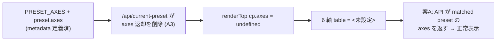

<!--
task-21 W2.4 frontmatter (機械可読、draft-flow-guard.sh / harness-audit が読む):
approval_required: true
approved_at: 2026-06-01
approved_by: takuma.hirai1@gmail.com
retroactive: false
-->

# hc-config Web UI 6 軸 data model (案A: preset metadata 方式)

**ステータス:** ✅ **承認済（2026-06-01 起案・承認、task-65 化）**
**起点:** task-63 Step 7 visual verification で 6 軸 table が `<未設定>` 表示と判明 (next-actions #63、user follow-up 分離承認済 2026-05-30)
**前提:**
- task-63 (hc-config Web UI UX 再設計) PR #37 merged (2026-06-01)
- task-61 (hc-config Web UI 本体) / task-60 (TUI legacy) 完遂済
- 6 軸 data model 方向は **案A (preset metadata 方式)** に user 確定 (2026-06-01 擦り合わせ)

**関連 fixture / rule:**
- `.claude/scripts/lib/hc-config-web-server.js` (`PRESET_AXES` L129-136 / `getCurrentPreset` L875-924 / `computePresetDiff` L560-589)
- `.claude/scripts/lib/hc-config-web-ui/app.js` (`renderTop` L461-510 / edit view 6 軸 dropdown L670-732 / `loadCurrentAxes` L238-240)
- `.claude/tests/hc-config-web-ui-smoke.sh`
- `docs/draft/hc-config-web-ui-ux-redesign.md` §3.4 wireframe / §3.6 API 仕様 (矛盾箇所)

---

## 1. 真因サマリ / 課題サマリ

task-63 の案 C 簡素化で `/api/current-preset` から `axes` 返却を削除した (§3.6 A3)。一方 top view の wireframe (§3.4) は「6 軸詳細を read-only table で表示」を要求しており、app.js `renderTop` は `cp.axes` を参照する。API が `axes` を返さず、かつ 6 軸 (quality_level 等) は yml に raw key として存在しないため `loadCurrentAxes()` fallback (`/api/keys` から軸 key 名で抽出) も空を返す → top view が `<未設定>`、edit view の 6 軸 dropdown が 0 件になる。



**真因:** API response (`getCurrentPreset`) が preset の `axes` メタデータを返さない。6 軸は yml raw key ではなく preset metadata なので、現在状態の 6 軸は「一致した preset の axes」から導出するのが自然だが、その経路が A3 で断たれた。

**副次:** §3.4 wireframe と §3.6 API 仕様の文書矛盾。app.js state 定義 comment (L61 `axes: {6軸}`) と実 API response の乖離。edit view の 6 軸 dropdown が options 取得元なく機能不全。

---

## 2. 解決アプローチ比較

| 案 | 内容 | 工数 | メリット | デメリット |
|:---:|:---|---:|:---|:---|
| **A (採用)** | 6 軸を preset metadata と位置づけ、`/api/current-preset` が matched preset の `axes` を返す (A3 の部分 revert)。top view は preset 一致時に 6 軸 read-only 表示、unsaved 時は「カスタム (プリセット外)」パネル表示 (差分は edit view の preset diff preview 経由)。6 軸 dropdown は撤去し、編集は preset 一括変更の 1 経路 (per-key 個別編集 UI は task-63 簡素化で元々不在 = phantom、reviewer code-reviewer H1 で判明) | 1.5 | yml schema 変更なし / 飾り key を作らない (原則遵守) / 工数小 / 6 軸 = 人間向け preset ラベルとして責務明確 | unsaved 状態では 6 軸の現在値を厳密表示できない (preset 外なので axis 値が一意でない) → カスタムパネル表示で割り切る |
| B | 6 軸を実 yml key 化 (quality_level 等 6 key を harness-config.yml に追加)、各 preset が set、/api/keys 公開、個別 dropdown 編集可 | 3.0+ | unsaved 状態でも個別軸値を保持・編集可 | 6 軸自体は hook 動作を駆動せず「飾り key」化 (feedback_config_value_needs_consumer_and_smoke 違反)、consumer 別設計が必要、--update 上書き等の保護も追加要 |
| C | 6 軸を実 yml key 群から逆算する関数を定義 (review_intensity = review_min_count_* の組合せ判定等)、個別軸編集 = 該当 values 群一括 set | 4.0+ | 原案最忠実、unsaved でも逆算表示可 | 逆算関数が設計判断 (恣意性) を含む / 実装複雑 / 軸↔values が多対多で逆算が一意にならないケースあり |

→ **案A** を採用 (user 確定 2026-06-01)。理由: yml schema を汚さず飾り key を作らない原則を守り、6 軸を「preset を人間に説明するラベル」として責務を明確化できる。実駆動は従来どおり `values` (review_*/feature_*)。

---

## 3. 採用案の詳細設計

### Task 計画 (採用 6 条準拠、Phase 中間階層廃止)

> 1 draft = 1 Task。UI 変更を含むため Step 5 (テスト合格) は **E2E + visual verification 必須** (採用 6 条 4)。

#### Step 計画

| Step | Status | 作業概要 | 工数 | 依存 |
|:---:|:---:|:---|---:|:---|
| 1 | 🔲 | server.js `getCurrentPreset` が matched preset の `axes` を返す (A3 部分 revert) + unsaved 時の axes 扱い定義 | 0.3h | — |
| 2 | 🔲 | app.js top view `renderTop` を API `axes` 参照に修正 + `loadCurrentAxes` fallback 撤去 + edit view 6 軸 dropdown 撤去 (編集は preset 一括の 1 経路、per-key UI は元々不在) | 0.5h | Step 1 |
| 3 | 🔲 | smoke 更新 (`/api/current-preset` axes 返却 case + top view 6 軸表示 case + unsaved 時カスタム表示 case) | 0.3h | Step 2 |
| 4 | 🔲 | (テスト設計レビュー) 5+ reviewer 動的選定 + iter cycle 収束 (上限 5 回) | 0.5h | Step 3 |
| 5 | 🔲 | (テスト合格) script/web-ui smoke + visual verification (top view 6 軸表示 / unsaved 表示 / preset 切替後 / 主要 breakpoint) | 0.5h | Step 4 |
| 6 | 🔲 | (リファクタリング) 3 観点判定 + §3.4/§3.6 draft 矛盾解消の同期 | 0.2h | Step 5 |

合計: **2.3h**

### Step 1 詳細

#### スコープ
- 対象ファイル: `.claude/scripts/lib/hc-config-web-server.js`
- 対象関数: `getCurrentPreset` (L875-924)

#### 変更内容
```js
// before (A3 簡素化後)
function getCurrentPreset(overrides) {
  const allValues = hcListAll(overrides)
  for (const [key, p] of Object.entries(PRESETS)) {
    if (valuesSubsetEqual(p.values, allValues)) {
      return { name: key, display_name_ja: p.display_name_ja || key, match_type: 'preset' }
    }
  }
  return { name: 'custom', display_name_ja: '未保存変更あり', match_type: 'unsaved' }
}

// after (案A: matched preset の axes を含める)
function getCurrentPreset(overrides) {
  const allValues = hcListAll(overrides)
  for (const [key, p] of Object.entries(PRESETS)) {
    if (valuesSubsetEqual(p.values, allValues)) {
      return {
        name: key,
        display_name_ja: p.display_name_ja || key,
        match_type: 'preset',
        axes: p.axes || {},        // ← preset metadata の 6 軸を返す
      }
    }
  }
  // unsaved 時: axes は preset 外で一意でない → null (UI 側でカスタム表示)
  return { name: 'custom', display_name_ja: '未保存変更あり', match_type: 'unsaved', axes: null }
}
```

#### テスト
- smoke: `/api/current-preset` が preset 一致時に `axes` object (6 key) を返す / unsaved 時に `axes: null` を返す

### Step 2 詳細

#### スコープ
- 対象ファイル: `.claude/scripts/lib/hc-config-web-ui/app.js`
- 対象: `renderTop` (L461-510)、`loadCurrentAxes` (L238-240)、edit view 6 軸 dropdown (L670-732)

#### 変更内容
- **top view**: `renderTop` は `cp.axes` を直接参照 (API が返すようになるため fallback 不要)。`axes` が `null` (unsaved) の場合は 6 軸 table を「カスタム設定 (プリセット外)」見出し + `computePresetDiff` 由来の差分 values list 表示に切替
- **`loadCurrentAxes()` 撤去**: `/api/keys` から軸 key 名で抽出する fallback は 6 軸が yml key でないため常に空 → 削除 (dead path 化)
- **edit view 6 軸 dropdown 撤去**: 6 軸個別編集 (L670-732) は撤去。編集経路は preset 一括変更の **1 経路** (§3.4 wireframe と整合、6 軸は top view の read-only 表示専用)。**注**: 当初「既存 74 key 個別編集」を 2 経路目と想定していたが、task-63 簡素化で per-key UI は元々不在 (dead 6 軸 dropdown のみ) と reviewer (code-reviewer H1) で判明。`/api/keys`+`/api/set` は server API としてのみ残置し、per-key UI 化は将来 task で検討 (next-actions 候補)
- app.js state 定義 comment (L61 / L223) を実 API response に同期

#### テスト
- smoke: top view で preset 一致時に 6 軸 table が日本語ラベル + 値表示 / unsaved 時にカスタム表示 / edit view に 6 軸 dropdown が存在しないこと (撤去確認)

### Step 3-6 詳細 (Task 最終、固定)

- **Step 3 (smoke)**: `hc-config-web-ui-smoke.sh` に case 追加 — `/api/current-preset` axes 返却 (preset/unsaved) + top view 6 軸表示 + edit view dropdown 撤去確認
- **Step 4 (テスト設計レビュー)**: 5+ reviewer 動的選定 (tdd-guide / test-automator / qa-expert / pr-test-analyzer + ui-designer / code-reviewer)。起動前に `bash .claude/scripts/hc-config.sh --get review_max_count_test` で上限確認 (task-64 強制)。収束まで反復 (上限 `review_iteration_max`、bypass `ECC_TEST_DESIGN_REVIEW_OFF=1`)
- **Step 5 (テスト合格)**: UI 変更を含むため **E2E + visual verification 必須** (採用 6 条 4)。agent-browser + screenshot で top view 6 軸表示 / unsaved カスタム表示 / preset 切替後 / 主要 breakpoint (1280 / 1024) / theme を撮影。script smoke 21/21 + tui smoke 14/14 regression 0
- **Step 6 (リファクタリング)**: 3 観点 (持続可能性 / 汎用性 / 非冗長化)。§3.4 wireframe と §3.6 API 仕様の矛盾を draft 側で解消同期 (axes 返却を §3.6 に反映)

---

## 4. リスクと緩和

| リスク | 確率 | 影響 | 緩和 |
|---|:---:|:---:|---|
| A3 部分 revert で task-63 の他簡素化と不整合 | L | M | `/api/current-preset` の axes 追加は additive (既存 name/display_name_ja/match_type は不変)、後方互換維持 |
| unsaved 時のカスタム表示 UX が分かりにくい | M | M | 「カスタム設定 (プリセット外)」見出し + 差分 values list で「どの設定が preset と違うか」を明示 |
| edit view 6 軸 dropdown 撤去で機能後退と誤認 | L | L | 6 軸はもともと options 取得元なく機能不全 (0 件表示) だった。撤去は dead UI の除去であり後退ではない (draft に明記) |
| visual regression (layout 崩れ) | L | M | Step 5 visual verification で主要 breakpoint 撮影、採用 6 条 4 必須 |

---

## 5. 移行計画

- [ ] feature flag 不要 (UI 内部の表示ロジック修正、破壊的変更なし、additive API)
- [ ] Step 1-3 実装 → smoke PASS
- [ ] Step 5 で visual verification (top view 6 軸表示の実描画確認)
- [ ] feature branch push + PR create (自律可)
- [ ] PR merge (user) + 4 リポ install (user manual)

---

## 6. 完了条件（DoD）

- [ ] `/api/current-preset` が preset 一致時に `axes` (6 key) を返し、unsaved 時に `axes: null` を返す (smoke 実測)
- [ ] top view で preset 一致時に 6 軸 read-only table が日本語ラベル + 値で正常表示 (visual 実測、`<未設定>` 解消)
- [ ] top view で unsaved 時にカスタム設定パネル表示 (差分は edit view の preset diff preview 経由、top view は一意 diff 不能のため値一覧は出さない)
- [ ] edit view の 6 軸 dropdown 撤去、編集は preset 一括変更の 1 経路 (per-key UI は task-63 簡素化で元々不在、smoke 確認)
- [ ] `loadCurrentAxes` dead path 撤去
- [ ] 新規/更新 smoke PASS + 既存 web-ui/script/tui smoke regression 0
- [ ] visual verification (top 6 軸 / unsaved / preset 切替 / breakpoint / theme) 撮影
- [ ] §3.4 wireframe と §3.6 API 仕様の矛盾解消 (axes 返却を §3.6 に反映)
- [ ] yml schema 変更なし (飾り key を作らない原則遵守の確認)

---

## 7. 工数見積

合計 **2.3h** (Step 1 0.3 + Step 2 0.5 + Step 3 0.3 + Step 4 0.5 + Step 5 0.5 + Step 6 0.2)。UI 変更小規模 (server.js 数行 + app.js 表示ロジック修正 + dropdown 撤去)。

---

## 8. レビューサイクル (workflow.md §「収束条件」準拠)

> draft レビューは reviewer 最低 3 体以上 並列起動 + CRITICAL/HIGH/MEDIUM = 0 まで反復 (LOW 許容、上限 `review_iteration_max`)。

| iter | 日付 | reviewer (起動数) | CRITICAL | HIGH | MEDIUM | LOW | 修正 commit | 状態 |
|:---:|---|---|:---:|:---:|:---:|:---:|---|---|
| 1 | — | (Step 4 で実施) | — | — | — | — | — | 未実施 |

**収束判定**: CRITICAL = 0 ∧ HIGH = 0 ∧ MEDIUM = 0 (LOW 許容)

---

## 9. 承認履歴

| 日付 | 承認者 | 結果 |
|---|---|---|
| 2026-06-01 | (擦り合わせ) | 6 軸 data model 方向 = 案A (preset metadata 方式) に確定 |
| 2026-06-01 | user (takuma.hirai1@gmail.com) | draft 全文承認 → `docs/tasks/task-65-hc-config-6axis-data-model.md` 化 + 自律実装着手 |

---

## 10. 関連

- 親 task: [task-63-hc-config-web-ui-ux-redesign.md](../tasks/task-63-hc-config-web-ui-ux-redesign.md) (本 follow-up の発生源)
- 関連 task: task-61 (Web UI 本体) / task-60 (TUI legacy)
- 副産物 registry: [next-actions.md](../tasks/next-actions.md) entry #63 (🔴 user 承認済分離)
- 原案矛盾箇所: [hc-config-web-ui-ux-redesign.md](hc-config-web-ui-ux-redesign.md) §3.4 / §3.6
- 原則: memory `feedback_config_value_needs_consumer_and_smoke` (飾り key を作らない、案B を退ける根拠)
