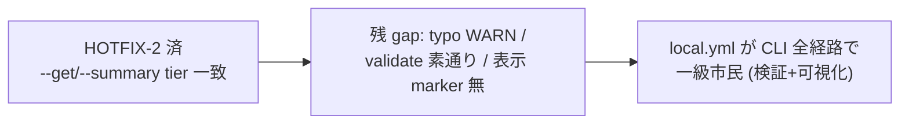

<!--
task-21 W2.4 frontmatter (機械可読、draft-flow-guard.sh / harness-audit が読む):
approval_required: true
approved_at: 2026-07-05
approved_by: user (kfurutani@classlab.co.jp)
retroactive: false
-->

# hc-config.sh local.yml 統合 (P1-2 残 scope)

**ステータス:** 📝 **draft（2026-07-05 起案、user 承認待ち）**
**起点:** roadmap [`install-immediately-usable-redesign-20260618.md`](install-immediately-usable-redesign-20260618.md) §4.2 (R6) / §5 P1-2 + `docs/tasks/next-actions.md` entry #79 (2026-07-05 HOTFIX-2 review LOW findings)
**前提:**
- **HOTFIX-2 済 (PR #68、main merge 済)**: `hc-config.sh` の `_get_current` に Step 1.5 (local.yml tier) 挿入済 (`hc-config.sh:757-763`)、`--get` local-only key 対応 (`hc-config.sh:956-964`)、`--summary` の `local config:` 行 + `(local overridden)` marker (`hc-config.sh:1157-1168, 1181-1185`)、`--set` の local override stderr note (`hc-config.sh:1001-1006`)。値解決順 `env > local.yml > SSoT yml > default` は runtime (`config-loader.sh` Step 3.5) と一致済
- **HOTFIX-1 済 (PR #68)**: install.sh §6.4 が consuming repo に `harness-config.local.yml` を create-if-absent 生成 (8 toggle true)
- smoke 既存: `.claude/tests/hc-config-local-yml-smoke.sh` (Case 1〜5c、12 assertions) / `.claude/tests/install-local-yml-smoke.sh` (7 case)、両者 `run-all-smokes.sh` 登録済 (L57 / L73)

**関連 fixture / rule:**
- `.claude/scripts/hc-config.sh` (2345 LOC) — `cmd_get` / `cmd_validate` / `cmd_list` / `cmd_diff` / `_tui_render_effect_panel_for_key`
- `.claude/hooks/lib/config-loader.sh` — Step 3.5 (L544-569) / Step 3.6 unknown_local_key WARN (L571-608)
- `.claude/tests/hc-config-local-yml-smoke.sh` / `hc-config-key-parity-smoke.sh`

---

## 1. 真因サマリ / 課題サマリ

HOTFIX-2 で「CLI 表示と hook runtime 実効値の真実が 2 つに分裂」する主経路 (`--get` / `--summary`) は塞いだが、adversarial review (2026-07-05、code-reviewer LOW ×3 + 実装報告残課題 = next-actions entry #79) で **local.yml 統合の周辺経路に 4 つの残 gap** が確定した:

1. **array 型 key の表示ギャップ**: `_get_current` Step 1.5/2 は yml の raw inline (`[a, b, c]`) を返すが (`hc-config.sh:757-770`、`_yml_get_raw` L306-351 は array を parse しない)、runtime (`config-loader.sh` `_hc_parse_yaml_file` L459 定義、array parse sub-block は L503-530) は改行区切り list に parse する。CLI `--get` と runtime `HC_*` の**文字列表現**が array key でだけ食い違う (既存挙動の波及、SSoT key でも同じ。scalar 主用途で実害小)
2. **local-only key の typo WARN 不在**: runtime は Step 3.6 (L587-607) が `unknown_local_key: <key> ... possible typo` を stderr WARN するが、CLI `--get` は local-only key を無警告で値返しする (`cmd_get` L956-964)。typo した override key を CLI で確認しても気付けない
3. **smoke gap**: `hc-config-local-yml-smoke.sh` に env>local parity / array key / local-only key の case が無い
4. **`--validate` が local.yml を素通り**: `cmd_validate` (L1258-1277) は `_yml_list_keys "$CONFIG_PATH"` のみ検証。local.yml の不正値 (例: bool key に `banana`) は検出されず runtime に流れる
5. **表示一貫性**: `--list` (`_cmd_list_rows` L912 定義、呼出側 L921) / `--diff` (L1072) / TUI effect panel (L1741) は `_get_current` 経由で local 値を**表示はする**が、local 由来だと分かる marker / notice が無い (`--summary` のみ marker 有り)



**真因:** HOTFIX-2 は「値解決の tier 一致」に scope を絞った minimal fix であり、local.yml の**検証系** (`--validate` / typo 検出) と**可視化系** (`--list` / `--diff` / TUI) が未統合のまま残った。

**副次:** entry #79 (4) の「`--overwrite-all` で harness 自身の dev local.yml が target へ copy される」は install.sh 側の問題であり、**本 draft の scope 外** (entry #47 系 [`install-sh-yml-customization-preserve.md`](install-sh-yml-customization-preserve.md) と統合予定、§10 参照)。

---

## 2. 解決アプローチ比較

| 案 | 内容 | 工数 | メリット | デメリット |
|:---:|:---|---:|:---|:---|
| **A 最小補完 (raw 表示維持 + 検証/可視化追加)** | array は raw inline 表示を**現状固定** (semantic equivalence を smoke で機械保証 + code comment 明示)。typo WARN / validate / stderr notice / TUI marker を追加 | 4h | 既存出力 format 完全互換 (`--get` を parse する rule 文書・smoke・mode-session-start を壊さない)。fail-open 一貫 | array の「見た目の非対称」は残る (smoke + comment で明示化に留まる) |
| **B parser 全面切替** | `_get_current` を廃止し、CLI の値取得を全て `config-loader.sh` の source (subshell) に一本化。array も parsed 改行 list で返す | 2day | 表現含め runtime と完全一致、二重 parser 解消 | `--get` array key 出力が変わる breaking change。TUI 毎 keypress の subprocess fork 増 (entry #55 perf 懸念と逆行)。key 存在判定 (`key not found`) が defaults 全 key set 化で困難に |
| **C array 出力のみ是正** | `cmd_get` の array key 出力を parsed 改行 list に変換 (`config-loader` と同 logic を CLI 側に複製) | 6h | 表示 gap 解消 | breaking change は B と同じ + parse logic 二重実装で drift リスク増。scalar 主用途 (feature toggle / preset) で得る実益が小さい |

→ **案 A** を推奨。理由: entry #79 自身が「既存挙動の波及、scalar 主用途で実害小」と評価しており、breaking change (B/C) の cost > 実益。runtime との**意味的一致**は smoke の equivalence assertion で機械保証し、**文字列表現の差**は code comment + smoke で明示・固定する。B の「二重 parser 解消」は魅力だが perf / 互換 / 工数の 3 点で本 P1-2 の残 scope を超える (必要なら将来 draft で再検討)。

---

## 3. 採用案の詳細設計

### Task 計画 (採用 6 条準拠、Phase 中間階層廃止)

**ゴール**: `harness-config.local.yml` が hc-config.sh の全 CLI 経路 (`--get` / `--validate` / `--list` / `--diff` / TUI) で「検証され、可視化される」一級市民になり、smoke がその全 semantics を機械固定する。

#### Step 計画

| Step | Status | 作業概要 | 工数 | 依存 |
|:---:|:---:|:---|---:|:---|
| 1 | 🔲 | smoke 拡張 Case 6〜10 追加 (RED: Case 8/9/10 FAIL 確認、Case 6/7 は現挙動固定) | 1.0h | — |
| 2 | 🔲 | `cmd_get` local-only key typo WARN (Step 3.6 同文言、fail-open) | 0.5h | Step 1 |
| 3 | 🔲 | `cmd_validate` の local.yml 検証対応 | 0.7h | Step 1 |
| 4 | 🔲 | `--list` / `--diff` stderr notice + TUI effect panel marker + array gap 明示 comment | 0.8h | Step 1 |
| 5 | 🔲 | (テスト設計レビュー) reviewer 動的選定 (`review_min_count_test`〜`review_max_count_test` 範囲、`hc-config.sh --get review_max_count_test` で上限確認) | 0.5h | Step 2-4 |
| 6 | 🔲 | (テスト合格) local-yml smoke 全 PASS + 既存 smoke regression 0 | 0.3h | Step 5 |
| 7 | 🔲 | (リファクタリング) 3 観点判定 or `skip: <reason>` | 0.2h | Step 6 |

合計: 4.0h

### Step 1 詳細 (smoke 拡張、TDD RED)

#### スコープ
- 対象ファイル: `.claude/tests/hc-config-local-yml-smoke.sh` (123 LOC → 約 200 LOC)

#### 追加 case (既存 sandbox 方式 = `/tmp` cp -R を踏襲、L28-38)

| Case | 検証内容 | 期待 |
|:---:|:---|:---|
| 6 | **env > local parity**: local.yml が `default_preset: team-default` の状態で `HC_DEFAULT_PRESET=strict bash "$HC" --get default_preset` | `strict` (env 勝ち、`_get_current` Step 1 L749-756)。`--summary` の preset 行に `(local overridden)` marker **無し** (`_is_local_overridden` env guard L785-787) |
| 7 | **array key**: local.yml に `protected_paths: [alpha, beta]` → `--get protected_paths` と runtime loader の `HC_PROTECTED_PATHS` を比較 | CLI = raw inline `[alpha, beta]` (現挙動固定)。runtime = `alpha\nbeta` (改行 list)。CLI raw を正規化 (`[]` 除去 + `, ` → 改行) した結果が runtime と**意味的一致** |
| 8 | **local-only key WARN**: local.yml に typo key `feature_draft_flow_guard_enalbed: true` → `--get feature_draft_flow_guard_enalbed` | stdout `true` + exit 0 (fail-open 維持) + stderr に `unknown_local_key: feature_draft_flow_guard_enalbed` を含む。`HC_UNKNOWN_LOCAL_KEY_WARN=0` で WARN 消滅 |
| 9 | **validate local**: local.yml に `feature_draft_flow_guard_enabled: banana` → `--validate` | exit 非 0 + stderr に `invalid (local): feature_draft_flow_guard_enabled`。local が正常値なら exit 0 + 既存成功行 `validation OK: all keys valid` **不変** |
| 10 | **表示一貫性**: local.yml override 有りで `--list` / `--diff` 実行 | stdout に `local` という疑似 key 行が混入しない (`hc-config-key-parity-smoke.sh` L62-64 の抽出 regex `^[a-z_][a-zA-Z0-9_]*[[:space:]]` + `awk '{print $1}'` 互換維持) + stderr に local notice 1 行 |

完了条件: `bash .claude/tests/hc-config-local-yml-smoke.sh` で Case 8/9/10 が FAIL (RED)、Case 1〜7 PASS、を実行 log で確認。

### Step 2 詳細 (`cmd_get` typo WARN)

#### スコープ
- 対象: `.claude/scripts/hc-config.sh` `cmd_get` (L946-975)

#### 変更内容 (擬似 diff)
```bash
# cmd_get 分岐 1 (L956-964) 内、_get_current 呼び出し前に挿入:
#   SSoT に不在 ∧ local にのみ存在 = typo の可能性 → config-loader Step 3.6 (L600-601) と
#   同文言 body で stderr WARN (prefix のみ [hc-config])。値は返す (fail-open、exit 0 維持)。
#   抑止 env は Step 3.6 と共用: HC_UNKNOWN_LOCAL_KEY_WARN=0
if ! _yml_get_raw "$CONFIG_PATH" "$key" >/dev/null 2>&1 \
  && [ "${HC_UNKNOWN_LOCAL_KEY_WARN:-1}" != "0" ]; then
  _err "WARN: unknown_local_key: ${key} (in ${LOCAL_CONFIG_PATH} but not in SSoT ${CONFIG_PATH}; possible typo)"
fi
```

#### テスト
- Step 1 Case 8 が GREEN 化。既存 Case 1〜5c regression 0。

### Step 3 詳細 (`cmd_validate` local 対応)

#### スコープ
- 対象: `.claude/scripts/hc-config.sh` `cmd_validate` (L1258-1277)

#### 変更内容
- 既存 SSoT loop の**後に** local loop を追加 (SSoT 検証結果・出力は不変):
  1. `LOCAL_CONFIG_PATH` 存在時のみ `_yml_list_keys "$LOCAL_CONFIG_PATH"` を loop
  2. **SSoT に存在する key**: SSoT 側 raw から `_infer_type` した型で local raw を `_validate_value` → 不正なら `invalid (local): <key> (type=<t>, value='<raw>')` + errors 加算 (→ 非 0 exit)
  3. **SSoT に不在の key** (local-only): error にせず Step 3.6 同文言 WARN のみ (runtime が fail-open で load する仕様と整合、config-loader.sh L574-576「key 追加の SSoT にはしない」)
- 成功時の既存行 `validation OK: all keys valid` (L1275) は文言不変 (`hc-config-script-smoke.sh` 互換)。

#### テスト
- Step 1 Case 9 が GREEN 化。

### Step 4 詳細 (表示一貫性 + array gap 明示)

#### スコープ
- 対象: `cmd_list` (L849-908) / `cmd_diff` (L1063-1080) / `_tui_render_effect_panel_for_key` (L1736-1753) / `_get_current` header comment (L737-744)

#### 変更内容
1. **`--list` / `--diff`**: local.yml 存在時、**stderr** に `note: harness-config.local.yml overrides applied to CURRENT (details: --summary)` を 1 行出力。stdout に出さない理由: `hc-config-key-parity-smoke.sh` (L62-64) が `--list` stdout を `^[a-z_][a-zA-Z0-9_]*[[:space:]]` で key 抽出するため、`local config: ...` 行を stdout に足すと疑似 key `local` が混入して parity FAIL する (実在確認済)
2. **TUI effect panel**: `_tui_render_effect_panel_for_key` の `現在値` 行 (L1750) に `_is_local_overridden "$selected_key"` true 時 ` (local overridden)` を付与 (`--summary` L1184 と同 marker 文言)。TUI は TTY 専用で smoke 未発火 (task-48 前例) のため手動確認 + 静的 grep assertion (Case 10 に marker 文字列存在確認を含める)
3. **array gap 明示**: `_get_current` header comment (L737-744) に「array key は raw inline (`[a, b, c]`) を返す。runtime (config-loader `_hc_parse_yaml_file` L459 定義、array parse sub-block L503-530) は改行区切り list に parse する — 文字列表現は非対称、意味的一致は hc-config-local-yml-smoke Case 7 が機械保証 (是正しない判断は draft hc-config-local-yml-integration §2 案 A)」を追記

#### テスト
- Step 1 Case 10 が GREEN 化 + `bash .claude/tests/hc-config-key-parity-smoke.sh` PASS 維持。

### Step 5-7 詳細 (Task 最終 3 Steps、固定)

- **Step 5 (テスト設計レビュー)**: reviewer を `review_min_count_test`〜`review_max_count_test` 範囲で動的選定 (base: `tdd-guide` / `test-automator` / `qa-expert` / `pr-test-analyzer`、起動前に `bash .claude/scripts/hc-config.sh --get review_max_count_test` で上限確認)、収束まで反復 (上限 `review_iteration_max`、bypass `ECC_TEST_DESIGN_REVIEW_OFF=1`)
- **Step 6 (テスト合格)**: UI なし task → unit/integration PASS で OK。`hc-config-local-yml-smoke.sh` 全 PASS + §6 DoD の regression smoke 群 0 FAIL
- **Step 7 (リファクタリング)**: 持続可能性 / 汎用性 / 非冗長化 の 3 観点 (特に WARN 文言の 2 箇所実装 → helper 抽出要否判定)、不要なら `skip: <reason>` 明示

---

## 4. リスクと緩和

| リスク | 確率 | 影響 | 緩和 |
|---|:---:|:---:|---|
| `--list` stdout 変更で key-parity smoke / 他 consumer 破壊 | M | H | notice を **stderr** に出す設計 (§3 Step 4-1)。Case 10 + `hc-config-key-parity-smoke.sh` PASS を DoD に含め機械検証 |
| `cmd_validate` 拡張で既存 `validation OK` 行 grep する smoke が FAIL | L | M | 成功行文言・SSoT 検証出力は不変、local 検証行は**追加のみ**。`hc-config-script-smoke.sh` を DoD regression に含める |
| typo WARN が既存 script の stderr 監視を汚す (例: `2>&1` で値 capture している caller) | L | M | fail-open (exit code / stdout 不変) + `HC_UNKNOWN_LOCAL_KEY_WARN=0` で抑止可 (runtime Step 3.6 と同一 env、二重管理なし) |
| local-only key の型検証 skip で不正値が runtime に残る | L | L | 意図的 (runtime も unknown key を型検証せず load する)。WARN で operator に可視化されるため実害は typo 検出遅延のみ |
| WARN prefix 相違 (`[hc-config]` vs `[config-loader]`) で log grep が片方を見落とす | L | L | body (`unknown_local_key: ... possible typo`) を完全同文言にし、grep は body で行う運用を comment 明示 |

---

## 5. 移行計画

- [ ] 破壊的変更なし (出力 format 互換 + 追加のみ) のため feature flag 不要
- [ ] sandbox smoke (`/tmp` cp -R 方式) で repo 汚染なし検証
- [ ] `run-all-smokes.sh` は既存登録 (L57 `hc-config-local-yml-smoke`) のまま case 数増で自動 pickup
- [ ] consuming repo への配布は通常の `install.sh --update` / npx update 経路 (hc-config.sh + smoke の 2 file 更新)

---

## 6. 完了条件（DoD）

- [ ] `bash .claude/tests/hc-config-local-yml-smoke.sh` → `0 FAIL`、assertion 数 **12 → 20 以上** (Case 6〜10 追加)
- [ ] local-only key typo WARN (fail-open 検証):
  ```bash
  # sandbox 内で: local.yml に typo key を置き
  out=$(bash "$HC" --get feature_draft_flow_guard_enalbed 2>/tmp/err.log); ec=$?
  [ "$out" = "true" ] && [ "$ec" -eq 0 ] && grep -c "unknown_local_key: feature_draft_flow_guard_enalbed" /tmp/err.log  # → 1
  ```
- [ ] `--validate` local 検証: local.yml に `feature_draft_flow_guard_enabled: banana` で exit 非 0 + stderr `invalid (local)`、正常 local で exit 0 + `validation OK: all keys valid` 行不変
- [ ] `bash .claude/tests/hc-config-key-parity-smoke.sh` PASS (`--list` stdout 汚染 0)
- [ ] regression 0: `bash .claude/tests/hc-config-script-smoke.sh` / `hc-config-tui-smoke.sh` / `enforcement-mismatch-smoke.sh` / `install-local-yml-smoke.sh` 全 PASS
- [ ] `_get_current` header comment に array 表示 gap の明示 (grep `hc-config-local-yml-integration` 1 hit 以上)

---

## 7. 工数見積

合計 **4.0h** (Step 1: 1.0h / Step 2: 0.5h / Step 3: 0.7h / Step 4: 0.8h / Step 5-7: 1.0h)。roadmap P1-2 見積 0.5 day から HOTFIX-2 実装済分 (tier 統合 + --summary marker) を控除した残量。

---

## 8. レビューサイクル (workflow.md §「収束条件」準拠)

> draft レビューは **reviewer 最低 3 体以上 並列起動** + **CRITICAL/HIGH/MEDIUM = 0 まで反復** (LOW 許容、上限 5 回)。

| iter | 日付 | reviewer (起動数) | CRITICAL | HIGH | MEDIUM | LOW | 修正 commit | 状態 |
|:---:|---|---|:---:|:---:|:---:|:---:|---|---|
| — | — | (未実施) | — | — | — | — | — | 起案直後 |

---

## 9. 承認履歴

| 日付 | 承認者 | 結果 |
|---|---|---|
| — | — | (承認待ち) |

> **/new-task 時の list.md 概要欄更新 (2026-07-05 review 反映)**: 承認後 `/new-task 86` 時に list.md #86 概要欄を残 scope 文言 (本 draft §1 の gap 1-5) へ更新する (main 専任)。現行概要「local.yml を SSoT 後に merge する実装に変更し --summary に local override 箇所を明示」は HOTFIX-2 完了済 scope のままで残 scope (typo WARN / validate / 表示 / smoke) を反映していない。
> 承認記入は先頭 HTML comment frontmatter の承認日 field (file 内 1 箇所) のみに行う (7 draft frontmatter 統一、2026-07-05 review 反映)。

---

## 10. 関連

- 既存設計: [`install-immediately-usable-redesign-20260618.md`](install-immediately-usable-redesign-20260618.md) §4.2 (R6) / §5 P1-2 / §9.1 HOTFIX-2
- 副産物起源: `docs/tasks/next-actions.md` entry #79 (2026-07-05、L139)
- **scope 外 (別 draft へ)**: entry #79 (4) `--overwrite-all` の dev local.yml 漏洩 → [`install-sh-yml-customization-preserve.md`](install-sh-yml-customization-preserve.md) (entry #47 系) と統合
- 将来候補 (本 draft §2 案 B 却下分): CLI parser の config-loader 一本化 (二重 parser 解消) — perf (entry #55 TUI render cache) とセットで再検討
- 関連タスク: task #86 (P1-2、本 draft のタスク化先) / HOTFIX-1+2 = PR #68 (merge 済)
