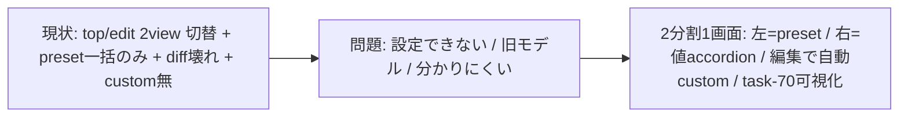

<!--
approval_required: true
approved_at: 2026-06-03
approved_by: user
retroactive: false
-->

# hc-config Web 設定ページ 2 分割再設計 (custom 復活 + task-70/71 取込 + diff バグ修復)

**ステータス:** 🔲 **draft（2026-06-03 起案、user 承認待ち）**
**起点:** user 報告 (resume-state loop session)。「設定できる状態じゃない / 差分取得失敗: Failed to fetch / カスタム設定がない / UX が悪い、もっとシンプルに / task-70-71 の更新が未取込」
**前提:**
- task-61 / task-63 で実装済の Web UI (`.claude/scripts/lib/hc-config-web-server.js` 1473 行 + `app.js` 988 行) が稼働中
- task-70 で `harness-config.yml` に `enforcement_matrix` + `default_preset` (advisory/team-default/strict/harness-dev) 導入済だが Web UI 未参照
- task-71 で dispatcher 統合済 (Web UI は独立 server のため直接の取込対象は薄い)

**関連 fixture / rule:**
- `.claude/rules/task-management.md` (採用 6 条 4: UI 含む Task は E2E + visual 必須)
- `.claude/tests/hc-config-web-ui-smoke.sh` (既存 smoke、flaky 既知)
- `.claude/scripts/lib/hc-config-metadata.sh` (74 key の description + effect + category)

---

## 1. 真因サマリ / 課題サマリ

現 Web UI は task-63 案 C で「10 preset 一括選択のみ / 個別 key 編集と custom preset を撤去」した簡素化版。その結果:

1. **差分取得が「Failed to fetch」で機能不全** — preset 選択時の diff preview がブラウザで失敗し、事実上「設定できない」状態。**有力仮説 (bug 診断 subagent、confidence 0.78、現環境では再現せず未確証)**: `computePresetDiff` (`web-server.js` L598-628) が `hcListAll` キャッシュを使わず key ごとに `hcGet` (= `spawnSync bash hc-config.sh --get`) を N 回呼び、Node event loop を同期ブロック (`/api/current-preset` の `hcListAll` 約 2 秒 + diff の N×spawnSync が重なり数秒)。ブラウザの keep-alive 並列接続で hung connection → `TypeError: Failed to fetch`。curl は毎回新規接続 + 長 timeout で素直に待つため出ない。**未再現のため Step 1 で実機再現を最優先で試みてから確定する。**
2. **カスタム設定の喪失** — 個別 key 編集導線が撤去され、preset の値を一部だけ変えたい運用ができない
3. **task-70 の新 config モデル未取込** — `default_preset` (4 段階 enforcement level) と `enforcement_matrix` (guard ごとの有効/無効 + disabled_reason) が UI に一切現れず、「今どの強制レベルで、どの guard が ON/OFF か」が不可視
4. **UX が複雑** — top / edit の 2-view 排他切替 + 6 軸 read-only table + unsaved banner という独自構造が直感的でない



**真因:** task-63 の過剰簡素化 (preset 一括選択への一本化) で実用上必要な「個別値編集 = custom」導線が失われ、かつ task-70 の config モデル進化に Web UI が追従していない。diff endpoint のブラウザ失敗が「設定不能」を決定づけている。

**副次:** server.js / app.js のコメント肥大 (各 20-30% が旧 task docstring)、dead code (app.js sidebar コメント残留)。

---

## 2. 解決アプローチ比較

| 案 | 内容 | 工数 | メリット | デメリット |
|:---:|:---|---:|:---|:---|
| **A** | diff バグだけ修復、UI 構造維持 | 0.5 | 最小 | custom 無 / task-70 未取込 / UX 改善せず (user 要求未充足) |
| **B 全面再設計** | top/edit 2view を廃し **2 分割 1 画面** (左 preset / 右 値 accordion)、個別値編集で自動 custom 化、task-70 可視化、diff バグ修復 | 3.0 | user 仕様完全充足 + 直感的 + 旧モデル一掃 | app.js/server.js 大幅改修 |
| **C ハイブリッド** | B の 2 分割は採用しつつ、enforcement_matrix の編集は read-only 可視化に留める (preset level 切替のみ) | 2.4 | scope 抑制 + 安全 (guard 編集は CLI 側に委ねる) | enforcement guard の個別 ON/OFF は UI 不可 (右 accordion の feature toggle で代替可能) |

→ **C ハイブリッド** を推奨。理由: user の 4 要求 (diff 修復 / custom / 2 分割 / 編集で custom 化) を満たしつつ、enforcement_matrix の nested block 編集という危険・複雑領域は「default_preset 切替 + feature toggle 編集」に還元して安全に。右 accordion の「機能カテゴリ」に既存 feature toggle 群が含まれるため、guard ON/OFF は実質右ペインで操作可能。

---

## 3. 採用案の詳細設計

### 全体レイアウト (上部タブ + 2 分割 1 画面、no-scroll)

```
┌──────────────────────────────────────────────────────────────┐
│  hc-config 設定   [ 設定 ] [ 履歴 ]      状態: [ harness-dev ] │  ← 上部タブ + 状態バッジ
├──────────────────┬───────────────────────────────────────────┤
│  左ペイン         │  右ペイン: 実際の設定値                      │
│  プリセット        │  (機能カテゴリごとに accordion、同時 1 つ開) │
│                  │                                           │
│  ── 推奨レベル ── │  ▼ 強制 / guards            (n keys)       │
│  ○ advisory      │     default_preset       [harness-dev ▾]  │
│  ○ team-default  │     feature_draft_flow_guard   [on/off]   │
│  ○ strict        │     feature_task_rule_guard    [on/off]   │
│  ● harness-dev   │  ▶ レビュー制御              (n keys)       │
│                  │  ▶ context budget           (n keys)       │
│  ── プリセット ── │  ▶ workflow                 (n keys)       │
│  ○ poc-no-git    │  ▶ ...                                     │
│  ○ inner-ts      │                                           │
│  ○ prod-ts-ent   │  [値変更で自動「カスタム」化]    [保存][取消] │
│  ★ カスタム       │                                           │
└──────────────────┴───────────────────────────────────────────┘
   ↑ 全体が viewport (100vh) に収まり、ページ全体スクロールを発生させない。
     accordion は同時に 1 category のみ展開、開いた領域が長い時のみその内部だけスクロール。

[ 履歴 ] タブ (別画面、設定タブには出さない):
┌──────────────────────────────────────────────────────────────┐
│  hc-config 設定   [ 設定 ] [ 履歴 ]                            │
├──────────────────────────────────────────────────────────────┤
│  プリセット適用 / rollback 履歴 (時刻 / 操作 / preset / 件数)    │
│  [ts] apply  harness-dev (12 keys)            [この時点へ戻す]  │
│  [ts] rollback → team-default (8 keys)        [この時点へ戻す]  │
└──────────────────────────────────────────────────────────────┘
```

**挙動仕様:**
- **上部タブ 2 つ「設定」「履歴」**。プリセット適用 / rollback 履歴は **「履歴」タブに分離** (設定タブには出さない、user 要求)
- **no-scroll (user 要求)**: 設定画面全体は viewport (100vh) に収め、ページ全体スクロールを発生させない。右ペイン accordion は **同時に 1 category のみ展開** (他は閉じる)、開いた category が長い時だけその領域内で内部スクロール。左 preset リストも収まる高さに収める
- 左 preset を選択 → その preset の全値を右ペインに反映 (preview、未保存)
- 右ペインで任意の値を変更 → 左の選択が自動的に **★ カスタム** にハイライト遷移 (どの preset とも完全一致しなくなったため)
- 「保存」→ 現在の右ペイン値を yml に atomic 適用 (preset 適用 or 個別 set の batch)
- 値が既存 preset と完全一致すればヘッダーにその preset 名、不一致なら「カスタム」表示 (既存 `/api/current-preset` の match_type 'preset'|'unsaved' を 'preset'|'custom' に読み替え)

> **左ペインの preset 分類 (2026-06-03 データ確認で確定、上の ASCII 左列より本 note が SSoT)**: データ実査の結果、web-server.js の **10 axes-preset** と yml の **4 enforcement level (advisory/team-default/strict/harness-dev)** には **対応マッピングが存在しない** (PRESETS に `level:` field なし)。よって「10 を 4 level で section 分け」は不採用。代わりに **実在軸 `quality_level` で 3 group に分割**:
> - **POC** (`quality_level: poc`): poc-no-git / poc-with-git
> - **社内ツール** (`inner_system`): inner-typescript / inner-python
> - **本番運用** (`production_service`): production-typescript-personal / -enterprise / -python / -rust / -go
> - **★ カスタム** (現値がどの preset とも不一致のとき)
>
> ※ `harness-development` preset が 10 件目に存在する場合は「ハーネス開発」group か本番群に含める (実装時 `/api/presets` の全件で確認)。
> **enforcement level (default_preset 4 種) + 各 guard feature toggle は右ペインの「強制 / guards」accordion に集約** (左ペインには出さない、二重 selector 回避)。default_preset dropdown を選ぶと対応 guard 群が一括反映され、値が変われば「カスタム」化する。

### Task 計画 (採用 6 条準拠)

#### Step 計画

| Step | Status | 作業概要 | 工数 | 依存 |
|:---:|:---:|:---|---:|:---|
| 1 | 🔲 | **diff「Failed to fetch」バグ修復** (root cause を Step 0 診断結果から確定し最小差分修正 + RED smoke) | 0.5h | — |
| 2 | 🔲 | server.js API 拡張 (enforcement_matrix/default_preset/preset-level 提供、custom 判定、個別値 batch set) | 0.8h | Step 1 |
| 3 | 🔲 | app.js 実装 (上部タブ 設定/履歴 + 左 preset section / 右 category accordion 同時1開 / 編集→custom 遷移 / 履歴をタブに分離) | 1.1h | Step 2 |
| 4 | 🔲 | style.css 2 分割 + accordion + **no-scroll (100vh 収め)** + responsive | 0.5h | Step 3 |
| 5 | 🔲 | dead code 削除 + コメント整理 (sidebar 残骸 / 旧 task docstring 圧縮) | 0.2h | Step 3 |
| 6 | 🔲 | (テスト設計レビュー) reviewer 動的選定 (min≤N≤max、`hc-config.sh --get review_max_count_*` で上限確認) | 0.5h | Step 5 |
| 7 | 🔲 | (テスト合格) smoke 更新 + E2E + **visual 検証必須** (採用 6 条 4、agent-browser screenshot: 初期 / preset 選択 / 値編集→custom / accordion 開閉 / **設定↔履歴タブ切替** / **no-scroll 確認** / responsive / 保存 toast) | 0.6h | Step 6 |
| 8 | 🔲 | (リファクタリング) 3 観点判定 (持続可能性 / 汎用性 / 非冗長化) | 0.3h | Step 7 |

合計: 約 4.3h

### Step 1 詳細 (diff バグ修復)
- 対象: `web-server.js` `computePresetDiff` (L598-628) / diff route (L1225-1234) / `app.js` `api()` (L177) / `loadPresetDiff` (L222)
- **まず実機再現**: agent-browser で「Failed to fetch」を実環境で再現 (診断 agent は現環境で未再現、confidence 0.78 の仮説のため確証が先)。再現できたら DevTools の net エラー種別 (ERR_EMPTY_RESPONSE / timeout 等) を確定
- **最小差分 fix (仮説に基づく構造改善、再現有無に関わらず妥当)**: `computePresetDiff` を `hcGet` N 回 → `hcListAll(overrides)` キャッシュ参照 1 回に変更。key 不在は null フォールバック。これで diff request の event loop ブロックが 2 回目以降 0ms 化
- RED: diff endpoint の正常 JSON 応答 + 連続呼び出しの応答性を assert する smoke
- **注意**: 再現できない / fix で解消しない場合は別 root cause (環境固有 / port / node 版数等) を疑い user に実機ログ依頼

### Step 2 詳細 (server API 拡張)
- `/api/keys` の各 key に既存 category metadata を付与 (右 accordion grouping 用、既存 `/api/categories` + metadata.sh 活用)
- `/api/current-preset` の match_type を 'preset'|'custom' に整理 (現 'unsaved' を 'custom' に)
- task-70 取込: `enforcement_matrix` / `default_preset` を read して preset を enforcement level で group 化する `/api/preset-levels` (or `/api/presets` に `level` field 追加) を提供
- 個別値変更の batch set 経路 (既存 `/api/set` を複数呼ぶ or batch endpoint)

### Step 3 詳細 (app.js: タブ + 2 分割)
- top/edit の 2-view 排他 state machine を廃し、**上部タブ (設定 / 履歴) + 設定タブ内 2 分割 (左 preset / 右 accordion)** の state に再構成
- state に `tab: 'config'|'history'` を追加。**履歴 (apply/rollback) は履歴タブでのみ描画** (設定タブから除去)
- 右ペイン: category ごとに accordion (`<details>`/`<summary>` ベース、依存追加なし)、**同時に 1 つだけ開く** (他 category の開閉は閉じる、no-scroll の要)。各 key を inline 編集 (toggle / select / text、型は metadata 由来)
- 編集 reducer: 右ペイン値が変わったら現在値 set と全 preset 値を比較し、一致 preset 無→「カスタム」、一致→その preset 名に header 更新
- XSS 対策 (textContent-only) / a11y は現行水準維持 (タブは role=tab / aria-selected)

### Step 4-8 詳細
- Step 4: 2 column grid (左固定幅 / 右可変) + **`html,body{height:100%}` / 最上位 container `height:100vh; overflow:hidden`** でページ全体スクロール禁止、accordion 展開領域のみ `overflow:auto`。768px 以下で縦積み (この時のみ縦スクロール許容)
- Step 5: app.js sidebar dead comment 削除、server.js/app.js の旧 task docstring を要点のみに圧縮
- Step 6 (テスト設計レビュー): base (tdd-guide/test-automator/qa-expert/pr-test-analyzer) + UI/JS domain reviewer、上限は `review_max_count_*` 範囲遵守
- Step 7 (テスト合格): smoke 更新 (diff 新 case + custom 遷移 + accordion)、**visual 検証必須** (memory feedback_step6_visual_verification_browser_skill_template)
- Step 8 (リファクタリング): 3 観点、不要なら skip 理由明示

---

## 4. リスクと緩和

| リスク | 確率 | 影響 | 緩和 |
|---|:---:|:---:|---|
| app.js 全面改修で既存 smoke 大量 regression | H | M | Step 1 で diff バグ単独修復 → Step 3 改修と分離 commit、smoke は逐次更新 |
| 編集→custom 判定が全 preset 比較で重い | L | L | preset 数 10 + key 74 で O(740)、無視可能 |
| enforcement level と axes-preset の対応誤り | M | M | 実装前に enforcement_matrix 定義を grep 確認 (memory feedback_design_external_dependency_verification) |
| 個別値編集復活で task-63 の簡素化意図と矛盾 | M | L | user 明示要求のため意図的、draft に記録 |

---

## 5. 移行計画
- [ ] Step 1 diff 修復を独立 commit (即効性)
- [ ] 2 分割 UI は Step 2-4 でまとめて、既存 UI を置換
- [ ] smoke + visual で regression 0 確認後 PR

---

## 6. 完了条件（DoD）
- [ ] ブラウザで preset 選択時の diff が「Failed to fetch」にならず正常表示
- [ ] 左 preset / 右 category accordion の 2 分割画面が動作
- [ ] **上部タブ「設定」「履歴」が動作し、プリセット適用履歴は履歴タブにのみ表示 (設定タブに無い)**
- [ ] **設定画面でページ全体スクロールが発生しない (viewport 100vh 内に収まる、主要 breakpoint で確認)**
- [ ] 右ペインで値を変更すると header / 左選択が自動「カスタム」化
- [ ] task-70 の default_preset (4 level) + 主要 guard feature toggle が右ペインから視認・変更可能
- [ ] smoke 全 PASS + 既存 harness smoke regression 0
- [ ] visual 検証 (agent-browser screenshot 主要状態) 合格
- [ ] dead code / 旧 docstring 整理

---

## 7. 工数見積
合計 約 4.3h (Step 1 diff 0.5 / Step 2 API 0.8 / Step 3 app 1.0 / Step 4 css 0.4 / Step 5 cleanup 0.2 / Step 6 review 0.5 / Step 7 test+visual 0.6 / Step 8 refactor 0.3)

---

## 8. レビューサイクル

| iter | 日付 | reviewer (起動数) | CRITICAL | HIGH | MEDIUM | LOW | 修正 commit | 状態 |
|:---:|---|---|:---:|:---:|:---:|:---:|---|---|
| 1 | — | — | — | — | — | — | — | 未実施 |

**収束判定**: CRITICAL = 0 ∧ HIGH = 0 ∧ MEDIUM = 0 (LOW 許容)

---

## 9. 承認履歴

| 日付 | 承認者 | 結果 |
|---|---|---|
| 2026-06-03 | user | **承認** (① → 1: full redesign 採用案 C で Step 1-8 実装。左ペインは draft 通り「10 axes-preset を 4 enforcement level で section 分け」で進行) → `docs/tasks/task-76-hc-config-web-2pane-redesign.md` 作成 |
| 2026-06-03 | user | **追加仕様 (承認方向内 refinement)**: (1) プリセット適用履歴を別タブに分離 (設定タブに出さない) (2) この規模ではスクロール不要 = 設定画面を viewport 100vh 内に収め全体スクロール禁止。レイアウト §3 / Step 3-4 / Step 7 visual / DoD に反映済 |
| 2026-06-03 | (AI 設計補正) | **データ確認による grouping 補正**: axes-preset(10) と enforcement level(4) に対応マッピング不在を実査確認。左ペイン分類を「4 level section」→「実在軸 quality_level 3 group (POC/社内/本番)」に変更、enforcement level + guards は右 accordion に集約 (§3 note が SSoT)。承認方向 (2 分割・custom・diff 修復) は不変のため再承認不要、visual review (Step 7) で最終確認 |

---

## 10. 関連
- 既存設計: task-61 (Web UI 実装) / task-63 (案 C 簡素化) / task-60 (TUI legacy 化) / task-70 (enforcement_matrix)
- 関連 memory: feedback_design_external_dependency_verification / feedback_parallel_subagent_cross_file_contract_drift / feedback_step6_visual_verification_browser_skill_template
- 関連タスク: #72 (web-ui flaky smoke root-cause、本 task で同時解消検討)
