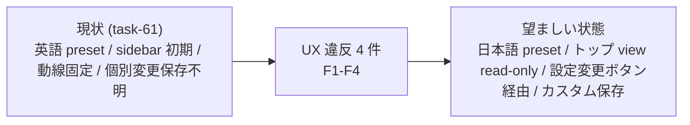
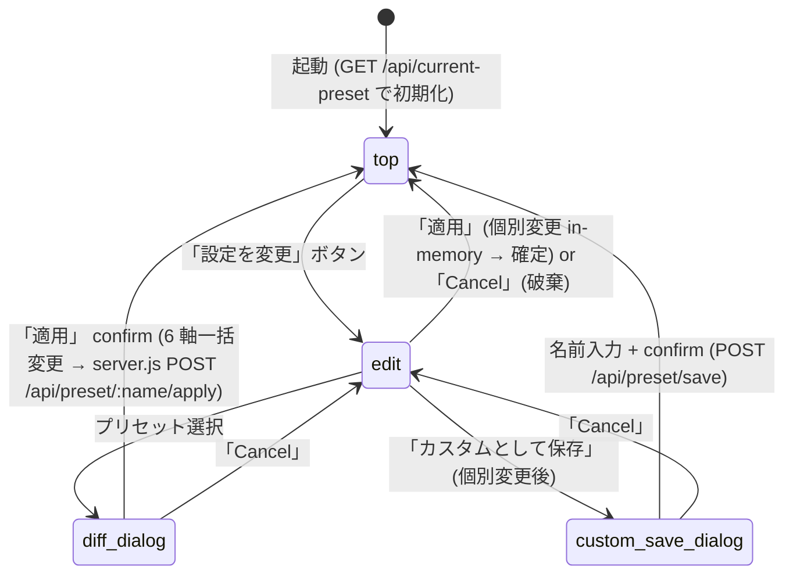

# hc-config Web UI UX 再設計 (絵文字撤廃 + トップ画面 + 編集画面 2 view 化)

**ステータス:** 🔲 **draft（2026-05-29 起案、user 承認待ち）**
**起点:** task-61 (hc-config Web UI) 完遂後の user UX フィードバック (2026-05-29 動作確認時、4 件)
**前提:**
- task-60 (hc-config TUI legacy fallback、commit `442ef21` 前) 完了済
- task-61 (hc-config Web UI 初版、commit `442ef21`) 完了済 (script 21/21 + tui 14/14 + visual 10/10 PASS、WCAG 2.2 AA 全 SC)
- task-61 の preset hardcode 10 件 (PRESETS object in `hc-config-web-server.js`) を継承
- `.claude/scripts/lib/hc-config-web-ui/` 配下の Tailwind + vanilla JS + Pure Function Reducer pattern を継承

**関連 fixture / rule:**
- `.claude/rules/task-management.md` §採用 6 条 (Task = Phase = N Step)
- `.claude/rules/workflow.md` §「収束条件」 (draft レビュー 3+ reviewer / CRITICAL+HIGH+MEDIUM = 0)
- `~/.claude/memory/feedback_ui_visual_verification_mandate.md` (browser UI 実装後 agent-browser + screenshot 必須)
- task-61 task file: `docs/tasks/task-61-hc-config-web-ui.md`

---

## 1. 真因サマリ / 課題サマリ

task-61 で hc-config Web UI 初版を実装したが、user 動作確認時に **動線・命名・初期 view の 3 軸で UX 違反**が判明した。

### user UX フィードバック (2026-05-29、4 件、絶対遵守要求)

| # | 違反 | user 指示 |
|---|---|---|
| **F1** | preset 名が英語 key 表示 (例: `inner-typescript`) | 「猿でも分かる日本語」要求 |
| **F2** | 初期表示が sidebar から preset 選択待ち placeholder | 「現在の設定 + プリセット名 or カスタム + 6 軸詳細」要求 (read-only) |
| **F3** | 動線が「sidebar → preset 選択 → diff → apply」固定 | 「『設定を変更』ボタン → 編集画面 → プリセット選択 (一括) or 個別 key 変更」動線要求 |
| **F4** | 個別変更時の保存経路が unclear | 「カスタムとして保存」ボタン要求 (`.claude/presets/custom-<name>.yml`) |



**真因:** task-61 設計 (`docs/tasks/task-61-hc-config-web-ui.md` §3) で **「sidebar = preset list + main = key 編集」の 1 画面 dashboard** を採用したが、初期 view (現在状態確認) と編集 view (preset 一括 / 個別変更) の責務分離が欠落していた。さらに preset 名は英 key を string そのまま流用しており i18n を考慮していなかった。

**副次:**
- 絵文字 (✨ 🔥 🎯 等) の使用は task-61 初版で未採用だが、UI redesign 議論中に追加候補として挙がっていた。user は「絵文字不要、シンプル日本語のみ」と明示否定。
- 「カスタム」と「未保存変更」の状態識別が unclear (両方とも preset 名 mismatch だが意味が異なる)。

---

## 2. 解決アプローチ比較

| 案 | 内容 | 工数 | メリット | デメリット |
|:---:|:---|---:|:---|:---|
| **A** | task-61 初版を最小修正 (display_name_ja 追加のみ) | 1h | 動線・layout 変更ゼロ、低 risk | F2/F3/F4 未解決、UX 違反 3 件残存 |
| **B** | 全面 redesign (top view + edit view 2 画面、preset 日本語名、custom 保存) | 9.5h | F1-F4 全解決、責務分離明確、将来拡張容易 | layout 全 build / smoke 全 case 再撮影 / regression risk 中 |
| **C ハイブリッド** | top view 追加 + sidebar 維持 (sidebar = preset list 並走) | 4h | F1/F2 解決、F3 部分解決 | 1 画面 2 動線で UX 二重化、user 要求 F3 (「設定を変更」ボタン経由) 不完全 |

→ **B 全面 redesign** を推奨。理由: F1-F4 4 件全解決必須、`/api/current-preset` endpoint 新規 + state machine `top | edit` 2 view 分離で責務明確化。task-61 の Pure Function Reducer pattern と Tailwind 構成は継承するため build 工数は中規模で済む。layout 再構築だが既存 component は流用可。

---

## 3. 採用案の詳細設計

### 3.1 preset 日本語名 mapping (絵文字なし、シンプル、10 件 + 将来拡張余地)

| 英 key (内部、yml + JS 識別子) | 日本語表示名 (UI 表示専用) | 用途 |
|---|---|---|
| `poc-no-git` | POC・お試し (Git なし) | アイディア検証 / 捨てコード |
| `poc-with-git` | POC・お試し (Git あり) | 検証 + 履歴保存 |
| `inner-typescript` | 社内ツール (TypeScript) | 社内 web/CLI |
| `inner-python` | 社内ツール (Python) | 社内 script / 自動化 |
| `production-typescript-personal` | 本番運用・個人 (TypeScript) | 個人プロダクト本番 |
| `production-typescript-enterprise` | 本番運用・企業 (TypeScript) | エンタープライズ高品質 |
| `production-python` | 本番運用 (Python) | Python 本番アプリ |
| `production-rust` | 本番運用 (Rust) | Rust 本番システム |
| `production-go` | 本番運用 (Go) | Go 本番サーバー |
| `harness-development` | ハーネス開発専用 | hirai-method 自体の開発 |

**規約**:
- 英 key は yml / `.claude/presets/<key>.yml` / JS PRESETS object key に流用 (内部識別子のみ)
- 日本語名は UI 表示専用 (sidebar list / banner / dialog confirm message / history log)
- 将来 preset 追加時は `display_name_ja` を必ず併設、英 key は kebab-case 維持

### 3.2 画面構成 (2 view + 補助 dialog、責務分離明確)

| # | 画面 | 役割 | 主要 component |
|---|---|---|---|
| 1 | **トップ画面 (View モード)** | 現状確認 + 編集動線開始 | 現在 preset 名 banner + 6 軸詳細 table (read-only) + 「設定を変更」ボタン (主要 CTA) + 適用履歴 footer |
| 2 | **編集画面 (Edit モード)** | preset 一括変更 or 個別 key 変更 | preset 選択 list (日本語名) + 6 軸 drop-down form (個別) + 「カスタムとして保存」 + 「適用」 + 「Cancel」 |
| - | confirm dialog | 破壊的操作確認 | preset 適用前 (diff preview) / カスタム保存前 (名前入力) |

### 3.3 状態遷移 (state machine)



### 3.4 トップ画面 layout (text-based wireframe)

```
+--------------------------------------------------+
| ヘッダー: hc-config Web UI                       |
+--------------------------------------------------+
| 現在の設定                                       |
| ┌──────────────────────────────────────────┐ |
| │ プリセット: 社内ツール (TypeScript)              │ |
| │ (またはカスタム: my-preset / 未保存変更あり)     │ |
| └──────────────────────────────────────────┘ |
|                                                  |
| 設定内容 (6 軸)                                  |
| ┌──────────────────────────────────────────┐ |
| │ 品質レベル:        inner                       │ |
| │ 言語・FW:          typescript                  │ |
| │ Git 運用:          main_protected              │ |
| │ TDD ポリシー:      hybrid                      │ |
| │ レビュー強度:      moderate                    │ |
| │ 自律度:            cautious                    │ |
| └──────────────────────────────────────────┘ |
|                                                  |
| [ 設定を変更 ]                                   |
+--------------------------------------------------+
| フッター: 適用履歴 (直近 3 件、rollback ボタン)  |
+--------------------------------------------------+
```

**状態識別 3 種** (`/api/current-preset` response の `match_type`):
- `preset`: 現在 yml 6 軸が name preset と完全一致 → 「プリセット: 社内ツール (TypeScript)」
- `custom`: 現在 yml 6 軸が `.claude/presets/custom-<name>.yml` と完全一致 → 「カスタム: my-preset」
- `unsaved`: 現在 yml 6 軸がどの preset/custom にも一致しない → 「未保存変更あり」

### 3.5 編集画面 layout (text-based wireframe)

```
+--------------------------------------------------+
| ヘッダー: 設定を編集                             |
| [ ← トップに戻る ]                              |
+--------------------------------------------------+
| プリセットから選ぶ                               |
| ┌──────────────────────────────────────────┐ |
| │ ○ POC・お試し (Git なし)    [選択]            │ |
| │ ○ POC・お試し (Git あり)    [選択]            │ |
| │ ○ 社内ツール (TypeScript)   [選択]            │ |
| │ ... (10 件 + カスタム保存分)                   │ |
| └──────────────────────────────────────────┘ |
|                                                  |
| 個別に変更                                       |
| ┌──────────────────────────────────────────┐ |
| │ 品質レベル: [drop-down: poc/inner/prod/lib]   │ |
| │ 言語・FW: [drop-down: ts/py/rust/go/...]      │ |
| │ Git 運用: [drop-down: ...]                    │ |
| │ TDD ポリシー: [drop-down: ...]                │ |
| │ レビュー強度: [drop-down: ...]                │ |
| │ 自律度: [drop-down: ...]                      │ |
| │ (各 drop-down 横に tooltip 説明 icon)         │ |
| └──────────────────────────────────────────┘ |
|                                                  |
| [ カスタムとして保存 ]  [ 適用 ]  [ Cancel ]     |
+--------------------------------------------------+
```

### 3.6 server.js API 変更

#### 新規 endpoint

| method | path | 役割 |
|---|---|---|
| GET | `/api/current-preset` | 現在 yml 6 軸を全 preset と照合し `{ match_type: "preset"\|"custom"\|"unsaved", name: "...", display_name_ja: "..." }` を返す |

#### 既存 endpoint 維持 (task-61 で実装済、変更なし)

- `GET /api/presets` (response に `display_name_ja` field 追加)
- `GET /api/preset/:name/diff`
- `POST /api/preset/:name/apply`
- `POST /api/preset/save` (custom 保存)
- `GET /api/keys`
- `POST /api/set`
- `GET /api/preset/history`
- `POST /api/preset/rollback/:ts`

#### PRESETS 定義変更 (`hc-config-web-server.js`)

```js
const PRESETS = {
  "poc-no-git": {
    display_name_ja: "POC・お試し (Git なし)",
    values: { quality: "poc", lang: "any", git: "none", ... }
  },
  "inner-typescript": {
    display_name_ja: "社内ツール (TypeScript)",
    values: { quality: "inner", lang: "typescript", ... }
  },
  // ... 残 8 件
};
```

`/api/presets` response 形式:
```json
{
  "presets": [
    { "name": "poc-no-git", "display_name_ja": "POC・お試し (Git なし)" },
    { "name": "inner-typescript", "display_name_ja": "社内ツール (TypeScript)" },
    ...
  ]
}
```

### 3.7 app.js state machine 拡張 (Pure Function Reducer)

```js
// state shape
const initialState = {
  view: 'top',  // 'top' | 'edit'
  currentPreset: null,  // { match_type, name, display_name_ja, values: {6軸} }
  editBuffer: null,  // 編集中 6 軸 in-memory copy (edit view のみ)
  pendingPreset: null,  // diff dialog 用 preset name
  pendingCustomSave: false,  // custom save dialog 開閉
};

// actions
const ACTIONS = {
  LOAD_CURRENT: 'LOAD_CURRENT',  // GET /api/current-preset で初期化
  GOTO_EDIT: 'GOTO_EDIT',  // top → edit (「設定を変更」)
  GOTO_TOP: 'GOTO_TOP',  // edit → top (Cancel / 適用後)
  SELECT_PRESET: 'SELECT_PRESET',  // edit 内で preset 選択 → diff dialog
  APPLY_PRESET: 'APPLY_PRESET',  // diff dialog confirm → POST /api/preset/:name/apply
  CHANGE_KEY: 'CHANGE_KEY',  // edit 内で個別 key 変更 (editBuffer 更新)
  OPEN_CUSTOM_SAVE: 'OPEN_CUSTOM_SAVE',  // 「カスタムとして保存」ボタン
  SAVE_CUSTOM: 'SAVE_CUSTOM',  // custom save dialog confirm → POST /api/preset/save
  CANCEL: 'CANCEL',  // 編集破棄 → top
};

// reducer (Pure Function、task-61 から拡張)
function reducer(state, action) {
  switch (action.type) {
    case 'LOAD_CURRENT':
      return { ...state, view: 'top', currentPreset: action.payload };
    case 'GOTO_EDIT':
      return { ...state, view: 'edit', editBuffer: { ...state.currentPreset.values } };
    case 'GOTO_TOP':
      return { ...state, view: 'top', editBuffer: null, pendingPreset: null, pendingCustomSave: false };
    // ... 他 actions
  }
}
```

### 3.8 layout 変更概要

- **index.html**: sidebar (280px) 削除 → main 領域 100% 化、ヘッダー + view-switch 領域 (top view コンテナ + edit view コンテナ) + footer (history)
- **style.css**: top view 用 banner / table / button + edit view 用 preset list / form + dialog overlay
- **app.js**: state.view で top / edit を排他切替 (DOM 上は両方 mount、`hidden` class で表示制御)、reducer 拡張

### 3.9 アクセシビリティ (WCAG 2.2 AA 維持、task-61 継承)

- top view: banner role=region aria-labelledby、table role=table、CTA button focus ring 3:1
- edit view: preset list role=radiogroup、各 radio aria-labelledby、drop-down label 明示、focus order top→bottom
- dialog: role=dialog aria-modal=true、focus trap、Esc で close
- 日本語名: lang="ja" 属性、screen reader 日本語読み上げ確認

---

### Task 計画 (採用 6 条準拠、Phase 中間階層廃止)

> **採用 6 条 (2026-05-25)**: Task = Phase = N Step、Phase 中間階層廃止。1 draft = 1 Task (= 1 deliverable: hc-config Web UI 全面 redesign)。

#### Step 計画

| Step | Status | 作業概要 | 工数 | 依存 |
|:---:|:---:|:---|---:|:---|
| 1 | 🔲 | PRESETS に `display_name_ja` 追加 + `/api/current-preset` endpoint 実装 (server.js) | 1h | — |
| 2 | 🔲 | app.js state machine 拡張 (top view + edit view 分離、reducer / actions / state) | 2h | Step 1 |
| 3 | 🔲 | index.html layout 再構築 (sidebar 削除 + 新 layout) + style.css 調整 | 1.5h | Step 2 |
| 4 | 🔲 | preset 日本語名表示 (list / banner / dialog confirm、`lang="ja"` 属性) | 0.5h | Step 3 |
| 5 | 🔲 | smoke 新規 case 追加 (`/api/current-preset` / top view / 編集画面遷移 / preset 適用後復帰 / カスタム保存) | 1h | Step 4 |
| 6 | 🔲 | (テスト設計レビュー) 5+ reviewer 動的選定 | 1.5h | Step 5 |
| 7 | 🔲 | (テスト合格) script smoke + tui smoke + visual verification 10 case 再撮影 | 1.5h | Step 6 |
| 8 | 🔲 | (リファクタリング) 3 観点判定 or skip | 0.5h | Step 7 |

合計: 9.5h

### Step 1 詳細

#### スコープ
- 対象ファイル: `.claude/scripts/lib/hc-config-web-server.js`
- 対象モジュール: `PRESETS` const + Express route handlers

#### 変更内容
```js
// before
const PRESETS = {
  "inner-typescript": {
    quality: "inner", lang: "typescript", git: "main_protected", ...
  },
};

// after
const PRESETS = {
  "inner-typescript": {
    display_name_ja: "社内ツール (TypeScript)",
    values: { quality: "inner", lang: "typescript", git: "main_protected", ... }
  },
};

// 新規 endpoint
app.get('/api/current-preset', (req, res) => {
  const currentYml = loadCurrentYml();  // .claude/harness-config.yml 6 軸読込
  const match = matchPreset(currentYml, PRESETS);  // 完全一致 preset 探索
  res.json(match);  // { match_type, name, display_name_ja, values }
});
```

#### テスト
- `hc-config-web-ui-smoke.sh`: `/api/current-preset` 3 case (preset 一致 / custom 一致 / unsaved)

### Step 2 詳細

#### スコープ
- 対象ファイル: `.claude/scripts/lib/hc-config-web-ui/app.js`
- 対象モジュール: state / reducer / actions

#### 変更内容
state machine 拡張 (§3.7 通り)、view 排他切替 logic 追加。

#### テスト
- E2E (Playwright via agent-browser): top → edit → preset apply → top 復帰 → 6 軸 banner 更新確認

### Step 3 詳細

#### スコープ
- 対象ファイル: `.claude/scripts/lib/hc-config-web-ui/index.html` + `style.css`

#### 変更内容
- sidebar `<aside>` 削除 → main `<main>` 100% 化
- top view `<section id="view-top">` + edit view `<section id="view-edit">` 排他表示 (`hidden` class)
- footer history 領域は維持

#### テスト
- visual verification (agent-browser screenshot): top view / edit view / dialog 3 種、3 breakpoint (mobile 375 / tablet 768 / desktop 1440)

### Step 4 詳細

#### スコープ
- 対象ファイル: `app.js` (display_name_ja 取得 + render) + `index.html` (`lang="ja"` 属性)

#### 変更内容
- `/api/presets` response の `display_name_ja` を edit view preset list render に使用
- banner / dialog confirm message も日本語名表示

#### テスト
- visual verification: 全 preset list 日本語表示 / banner 「現在の設定: 社内ツール (TypeScript)」表示確認

### Step 5 詳細

#### スコープ
- 対象ファイル: `.claude/tests/hc-config-web-ui-smoke.sh`

#### 変更内容
新規 case 5 件追加:
1. `GET /api/current-preset` 200 + `match_type` 含む
2. top view 初期表示で「現在の設定」banner 描画 (DOM check)
3. 「設定を変更」ボタン押下で edit view 遷移 (`view-edit` 表示 / `view-top` hidden)
4. preset 適用後 → top view 復帰 + banner 新 preset 名表示
5. カスタム保存 → top view で「カスタム: <name>」banner 表示

#### テスト
- bash hc-config-web-ui-smoke.sh で全 case PASS

### Step 6 詳細 (テスト設計レビュー、採用 6 条 4)

#### 動的 reviewer 選定 (5+ 件、case-by-case)
- **base 4 件**: tdd-guide / test-automator / qa-expert / pr-test-analyzer
- **domain-specific 1+ 件**:
  - frontend-design-reviewer (UI/UX / WCAG / 日本語 i18n 観点)
  - code-architect (state machine / API 設計観点)
  - security-reviewer (custom 保存時の path traversal / 入力 sanitize 観点)

#### reviewer prompt 必須項目 (workflow.md §reviewer prompt 共通規約 5 件)
1. 対象 Read: `docs/draft/hc-config-web-ui-ux-redesign.md` 全文
2. 観点: state machine 整合性 / API 契約 / WCAG 2.2 AA / 日本語 i18n / smoke 網羅性 / custom 保存 security
3. findings format: CRITICAL / HIGH / MEDIUM / LOW + confidence + 修正提案
4. confidence: 0.0 - 1.0 (median 0.85 以上を収束目安)
5. プロジェクト整合性 + 他 task 影響: task-60 TUI legacy fallback と並走確認 / task-61 既存 smoke 21+14 regression 0 / `HC_HC_CONFIG_TUI_LEGACY=true` 経路維持確認

#### 収束条件
- 全 reviewer approve / no objection (CRITICAL+HIGH+MEDIUM = 0、LOW 許容)
- 反復上限: 5 回 (`ECC_TEST_DESIGN_REVIEW_OFF=1` で bypass)

### Step 7 詳細 (テスト合格、採用 6 条 4)

#### test 層
- **unit**: smoke script 21/21 PASS 維持 (regression 0)
- **integration**: tui smoke 14/14 PASS 維持 (TUI legacy fallback 影響なし確認)
- **E2E**: 新 smoke 5 case PASS (Step 5 で追加)
- **visual verification (UI 必須)**: agent-browser skill + screenshot
  - top view (3 状態 × 3 breakpoint = 9 case)
  - edit view (preset list + form、3 breakpoint = 3 case)
  - dialog (diff / custom save、2 case)
  - 合計 14 case 再撮影 (task-61 10 case を superset で拡充)

#### WCAG 2.2 AA 全 SC PASS
- focus visible / contrast 4.5:1 / focus order / aria roles / lang="ja"

### Step 8 詳細 (リファクタリング、採用 6 条 4)

#### 3 観点判定
- **持続可能性 (Sustainability)**: PRESETS object `display_name_ja` field を必須化 → 将来 preset 追加時の漏れ防止 (lint rule or runtime check 提案)
- **汎用性 (Generality)**: state machine の `view` enum を `top | edit` 2 値固定 → 将来 view 拡張時 (例: `settings | help`) は enum 拡張で対応可
- **非冗長化 (Deduplication)**: preset 名表示 logic を `formatPresetName(preset)` ヘルパー化、banner / list / dialog 3 箇所で再利用

skip 判定: 適用、上記 3 観点で軽量 refactor 1 件 (`formatPresetName` 抽出) のみ実施。

---

## 4. リスクと緩和

| リスク | 確率 | 影響 | 緩和 |
|---|:---:|:---:|---|
| layout 全 build で既存 visual 10 case regression | M | M | task-61 既存 case + 新 case 計 14 case を全件再撮影 + diff 確認 |
| state machine 拡張で reducer bug | M | H | Pure Function pattern 維持 + unit test 追加 (state 遷移 7 case) |
| `/api/current-preset` の 6 軸完全一致判定で edge case (yml 形式差異 / quote 違い) | L | M | 6 軸 normalize 関数 + smoke で全 preset 一致確認 |
| custom 保存時の path traversal (例: `custom-../../../etc/passwd.yml`) | L | H | name 入力 regex 制限 `^[a-z0-9-]+$` + server.js sanitize |
| 日本語表示で font fallback 崩れ (system font 依存) | L | L | Tailwind `font-sans` + visual verification で確認 |
| TUI legacy fallback (HC_HC_CONFIG_TUI_LEGACY=true) との影響 | L | M | TUI 経路は本 task 対象外、tui smoke 14/14 で regression 0 確認 |

---

## 5. 移行計画

- [ ] Step 1-5 実装 (server.js → app.js → index.html/style.css → 日本語名 → smoke)
- [ ] Step 6 テスト設計レビュー (5+ reviewer 動的選定、収束まで反復)
- [ ] Step 7 テスト合格 (script 21/21 + tui 14/14 + new 5 + visual 14 case)
- [ ] Step 8 リファクタリング (3 観点判定、`formatPresetName` 抽出のみ)
- [ ] WCAG 2.2 AA 全 SC PASS 再確認
- [ ] task-60 TUI legacy fallback 動作確認 (`HC_HC_CONFIG_TUI_LEGACY=true` で旧 TUI 起動)
- [ ] commit 分割: Step 1 (server.js) / Step 2 (app.js) / Step 3 (layout) / Step 4 (i18n) / Step 5 (smoke) / Step 6-8 (review/test/refactor)
- [ ] PR 作成 + user 動作確認依頼

---

## 6. 完了条件（DoD）

- [ ] `bash .claude/scripts/lib/hc-config.sh interactive` で **トップ画面**が初期表示される (現在 preset 名 + 6 軸詳細 + 「設定を変更」ボタン)
- [ ] 「設定を変更」ボタン押下で**編集画面**遷移する
- [ ] 編集画面で preset 選択 → diff preview → 「適用」 confirm で 6 軸一括変更 → トップ画面復帰 + 新 preset 名表示
- [ ] 編集画面で個別 key 変更 → 「カスタムとして保存」 → 名前入力 confirm → `.claude/presets/custom-<name>.yml` 生成 → トップ画面で「カスタム: <name>」表示
- [ ] preset 名は全 10 件日本語化 (英 key は内部のみ、user 視点では日本語のみ)
- [ ] 絵文字なし (visual verification 全 14 case で確認)
- [ ] 既存 smoke 全 PASS (script 21/21 + tui 14/14、regression 0)
- [ ] 新 smoke (top view / 編集画面遷移 / `/api/current-preset` 識別 / custom 保存後 banner 表示) 5/5 PASS
- [ ] visual verification 14 case (top × 3 状態 × 3 breakpoint + edit × 3 breakpoint + dialog × 2) PASS
- [ ] WCAG 2.2 AA 全 SC PASS (task-61 維持 + 日本語 i18n 追加項目)
- [ ] task-60 TUI legacy fallback 維持 (`HC_HC_CONFIG_TUI_LEGACY=true` で旧 TUI 起動確認)

---

## 7. 工数見積

| Step | 工数 |
|:---:|---:|
| 1. server.js (PRESETS + `/api/current-preset`) | 1.0h |
| 2. app.js (state machine 拡張) | 2.0h |
| 3. index.html + style.css (layout 再構築) | 1.5h |
| 4. 日本語名表示 (banner / list / dialog) | 0.5h |
| 5. smoke 新規 5 case 追加 | 1.0h |
| 6. テスト設計レビュー (5+ reviewer 動的) | 1.5h |
| 7. テスト合格 (smoke + visual 14 case) | 1.5h |
| 8. リファクタリング (3 観点 + `formatPresetName`) | 0.5h |
| **合計** | **9.5h** |

---

## 8. アンチパターン (避けるべき)

- 絵文字を使う (✨ 🔥 🎯 ✅ 等、user 明示禁止 F1 要求と矛盾)
- sidebar に preset list を直接置く (F3 要求「設定を変更」ボタン経由動線と矛盾)
- 英語 preset 名を user に見せる (F1 要求、内部 key のみ、表示は日本語)
- 「カスタム」と「未保存変更」を混同 (別状態 `custom` vs `unsaved` として識別)
- task-61 の sidebar 280px layout を残したまま top view を main に追加 (1 画面 2 動線で UX 二重化)
- custom 保存で name 入力 sanitize 怠り (path traversal risk)
- TUI legacy fallback (`HC_HC_CONFIG_TUI_LEGACY=true`) 経路に影響を与える変更

---

## 9. レビューサイクル (workflow.md §「収束条件」準拠)

> draft レビューは **reviewer 最低 3 体以上 並列起動** + **CRITICAL/HIGH/MEDIUM = 0 まで反復** (LOW 許容、上限 5 回)。

| iter | 日付 | reviewer (起動数) | CRITICAL | HIGH | MEDIUM | LOW | 修正 commit | 状態 |
|:---:|---|---|:---:|:---:|:---:|:---:|---|---|
| 1 | TBD | architect, frontend-design-reviewer, code-architect, security-reviewer, qa-expert (5) | — | — | — | — | — | 未実施 |

**収束判定**: CRITICAL = 0 ∧ HIGH = 0 ∧ MEDIUM = 0 (LOW は許容、cosmetic finding として記録のみ)

**上限超過時 (iter 5 でも未収束)**: user escalation → `ECC_DESIGN_REVIEW_OFF=1` で bypass + `.claude/.workflow-state/bypass.log` 記録 + 理由を §10 承認履歴末尾に追記

---

## 10. 承認履歴

| 日付 | 状態 | 備考 |
|---|---|---|
| 2026-05-29 | 起案 | task-61 完遂後の user UX フィードバック (絵文字不要 + トップ現状 + 設定変更ボタン + プリセット選択 / 個別 + カスタム保存) を反映、AI 推奨案 B (全面 redesign) で詳細設計、preset 日本語名 mapping 10 件 + 動線 + state machine + API 拡張提案 |
| 2026-05-29 | 承認待ち | user 確認待ち |

---

## 11. 関連

- 既存設計: [task-61-hc-config-web-ui.md](../tasks/task-61-hc-config-web-ui.md) (task-61 task file、本 draft の前提)
- 既存設計: [task-60-hc-config-tui-legacy.md](../tasks/task-60-hc-config-tui-legacy.md) (task-60、TUI legacy fallback、本 draft で影響なし確認対象)
- 既存実装: `.claude/scripts/lib/hc-config-web-server.js` (commit `3a86a65`)
- 既存実装: `.claude/scripts/lib/hc-config-web-ui/` (commit `442ef21`)
- 関連 rule: `.claude/rules/task-management.md` §採用 6 条
- 関連 rule: `.claude/rules/workflow.md` §「収束条件」
- 関連 memory: `~/.claude/memory/feedback_ui_visual_verification_mandate.md`
- 関連 task: #63 (本 draft 対応 task、`/new-task` で生成予定)
