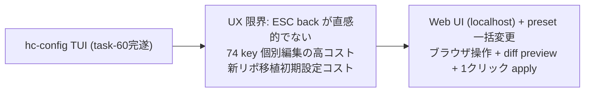

<!--
approval_required: true
approved_at: 2026-05-29
approved_by: user
retroactive: false
-->

# hc-config Web UI + Preset 一括変更機能

**ステータス:** ✅ **draft 承認済（2026-05-29 起案 → 2026-05-29 user 承認、4 確認ポイント全 AI 推奨採用: 10 named preset / git_workflow 4 値 / server.js hardcode / .preset-history gitignore）**
**起点:** task-60 完遂後の user 「UX 悪い、戻ったりできません。起動したら WebServer を起動して Web で変更する仕様に変更したい」+ 「プリセットを作成して一括変更できるように」指示
**前提:**
- task-60 (hc-config TUI 真の 2 階層 Navigation) の Step 1-5 完遂 (7 commits、smoke 21/21+14/14 PASS) が前提
- task-48 (hc-config 対話的 TUI 化) の `hc-config.sh`、`hc-config-metadata.sh` が既存 API

**関連 fixture / rule:**
- `.claude/scripts/hc-config.sh` — 既存 cmd_set / cmd_get / cmd_list / cmd_interactive_tui API
- `.claude/scripts/lib/hc-config-metadata.sh` — hc_metadata_* API (category / description / effect)
- `.claude/harness-config.yml` — 74+ key (preset で操作対象)
- `.claude/rules/task-management.md` — 採用 6 条

---

## 1. 真因サマリ / 課題サマリ

task-60 で 2 階層 TUI navigation が完成したが、TUI の UX 限界 (ESC/LEFT での back 操作が直感的でない、74 key の個別編集コスト高) が顕在化した。また、プロジェクト用途 (POC / 内部ツール / production service) ごとに最適な yml 設定が異なるが、現状は 1 key ずつ手動変更しかなく、新しいリポへの移植コスト (harness-config.yml 初期設定) が高い。



**真因:** TUI (terminal raw mode) は back / forward 操作・diff 表示・一括変更に構造的制限があり、ブラウザ UI で解決すべき UX 問題群である。

**副次:** 新リポ移植時の初期設定に「どの key を何にすれば良いか」ガイドがなく、移植コストが高い。

---

## 2. 解決アプローチ比較

| 案 | 内容 | 工数 | メリット | デメリット |
|:---:|:---|---:|:---|:---|
| **A** | Python3 自前 HTTP server + HTML | 4h | 依存 0 | Python3 + PyYAML 不在 env あり (task-46 iter3 教訓)。code 複雑化 |
| **B** | Node.js (http module) + Tailwind CDN + 素 JS | 10-15h | 依存 0 (node.js only)、CDN でリッチ UI、モダン JS | CDN online 必須、Node.js インストール必要 |
| **C** | shadcn/React + vite build | 20h+ | 最もリッチ | build 環境必須、consuming repo に node_modules が必要、ポータビリティ損失 |
| **D** | B + preset 機能 (採用案)** | 13-18h | B の利点 + use case 別一括設定 + diff preview + history rollback | CDN online 必須、Node.js 必要 |

→ **案 D (Node.js + Tailwind CDN + preset 機能)** を推奨。理由: CDN online は通常利用環境で問題なし、Node.js は macOS/Linux 標準。preset で移植コスト問題も同時解決。

---

## 3. 採用案の詳細設計

### Task 計画 (採用 6 条準拠、Phase 中間階層廃止)

> **採用 6 条 (2026-05-25)**: Task = Phase = N Step、Phase 中間階層廃止。1 draft = 1 Task (= 1 deliverable)。

#### Step 計画

| Step | Status | 作業概要 | 工数 | 依存 |
|:---:|:---:|:---|---:|:---|
| 1 | 🔲 | `hc-config.sh` wrapper 修正 (legacy env switch + node 起動 + port 自動検出) | 1h | — |
| 2 | 🔲 | `hc-config-web-server.js` 新規 (API 8+ endpoint、HTTP server) | 3h | Step 1 |
| 3 | 🔲 | Web UI ファイル新規 (`index.html` + `app.js` + `style.css`) | 3h | Step 2 |
| 4 | 🔲 | 10 named preset yml 定義 + preset 適用ロジック (batch cmd_set + history rollback) | 3h | Step 2 |
| 5 (固定) | 🔲 | (テスト設計レビュー) 5+ reviewer 動的選定 | 1h | Step 4 |
| 6 (固定) | 🔲 | (テスト合格) smoke + 手動 Web UI 検証 | 2h | Step 5 |
| 7 (固定) | 🔲 | (リファクタリング) 3 観点判定 or skip | 1h | Step 6 |

合計: 14h 工数

### Step 1 詳細: `hc-config.sh` wrapper 修正

#### スコープ
- 対象ファイル: `.claude/scripts/hc-config.sh`
- 対象関数: `_cmd_interactive` dispatch、新規 `_cmd_interactive_web`

#### 変更内容

```bash
# before: interactive サブコマンドで TUI 直起動
_cmd_interactive() {
  if [[ -t 0 ]]; then
    _cmd_interactive_tui  # task-60 実装
  else
    _cmd_interactive_numeric
  fi
}

# after: legacy env switch + Web UI default
_cmd_interactive() {
  # legacy fallback: HC_HC_CONFIG_TUI_LEGACY=true で旧 TUI 維持
  if [[ "${HC_HC_CONFIG_TUI_LEGACY:-false}" == "true" ]]; then
    if [[ -t 0 ]]; then
      _cmd_interactive_tui
    else
      _cmd_interactive_numeric
    fi
    return
  fi
  # Web UI default
  _cmd_interactive_web
}

_cmd_interactive_web() {
  local node_bin
  node_bin="$(command -v node || command -v nodejs || true)"
  if [[ -z "$node_bin" ]]; then
    echo "WARN: node not found. Falling back to TUI." >&2
    _cmd_interactive_tui; return
  fi
  local server_js="${REPO_ROOT}/.claude/scripts/lib/hc-config-web-server.js"
  local port
  port="$(_find_free_port 3060 3070)"
  echo "hc-config Web UI: http://localhost:${port}" >&2
  _open_browser "http://localhost:${port}" &
  exec "$node_bin" "$server_js" "--port=$port" "--config=${HC_CONFIG_FILE}"
}
```

#### テスト
- `tests/hc-config-web-smoke.sh` Case 1: `HC_HC_CONFIG_TUI_LEGACY=true` で TUI 起動確認
- Case 2: node 不在 env で TUI fallback 確認

### Step 2 詳細: `hc-config-web-server.js`

#### スコープ
- 対象ファイル: `.claude/scripts/lib/hc-config-web-server.js` (新規、~400 LOC)
- Node.js `http` module のみ使用 (外部 npm 依存 0)

#### HTTP API 一覧

| Method | Path | 説明 |
|---|---|---|
| GET | `/api/categories` | 6 category 一覧 + key 数 |
| GET | `/api/keys?category=<cat>` | category 配下 key 一覧 (description / effect / type / current_value) |
| GET | `/api/value/:key` | 単一 key の現在値 (env override 優先) |
| POST | `/api/set` | `{ key, value }` → `hc-config.sh --set` 実行 (atomic backup) |
| GET | `/api/presets` | 10 named preset 一覧 + 6 軸メタデータ |
| GET | `/api/preset/:name/diff` | `{ current: {...}, preset: {...}, changes: [{key, current, new, effect}] }` |
| POST | `/api/preset/:name/apply` | `{ skip_keys: [...] }` → batch cmd_set 実行 + history append |
| POST | `/api/preset/save` | `{ name, description }` → 現在状態を `.claude/presets/custom-<name>.yml` 保存 |
| GET | `/api/preset/history` | `.claude/.preset-history/*.json` 一覧 |
| POST | `/api/preset/rollback` | `{ timestamp }` → 指定 snapshot の値を batch cmd_set で復元 |
| GET | `/static/*` | index.html / app.js / style.css 配信 |

#### 実装ポイント

```javascript
// server.js 骨格
const http = require('http')
const { execFileSync } = require('child_process')
const path = require('path')
const fs = require('fs')

const REPO_ROOT = process.env.REPO_ROOT || path.resolve(__dirname, '../../../..')
const HC_CONFIG = path.join(REPO_ROOT, '.claude/harness-config.yml')
const HC_CONFIG_SCRIPT = path.join(REPO_ROOT, '.claude/scripts/hc-config.sh')

// cmd_set 呼出 (既存 hc-config.sh 経由で atomic + backup 保証)
function hcSet(key, value) {
  execFileSync('bash', [HC_CONFIG_SCRIPT, '--set', `${key}=${value}`], {
    env: { ...process.env, HC_CONFIG_FILE: HC_CONFIG }
  })
}

// preset diff 計算: preset yml → 現在値との差分
function computePresetDiff(presetName) {
  const presetPath = path.join(REPO_ROOT, `.claude/presets/${presetName}.yml`)
  const presetValues = parsePresetYml(presetPath)
  const changes = []
  for (const [key, newVal] of Object.entries(presetValues)) {
    const currentVal = hcGet(key)
    if (currentVal !== String(newVal)) {
      changes.push({ key, current: currentVal, new: String(newVal), effect: getEffect(key) })
    }
  }
  return changes
}
```

### Step 3 詳細: Web UI ファイル

#### スコープ
- `.claude/scripts/lib/hc-config-web-ui/index.html` (新規、~100 LOC)
- `.claude/scripts/lib/hc-config-web-ui/app.js` (新規、~400 LOC)
- `.claude/scripts/lib/hc-config-web-ui/style.css` (新規、~50 LOC)

#### UI 構成 (4 エリア)

```
┌─────────────────────────────────────────────────────────────┐
│ [banner] 現在 preset: inner-typescript | Diff: 3 changes    │
├──────────────┬──────────────────────┬───────────────────────┤
│ [left sidebar│ [center: key list]   │ [right: edit panel]   │
│ Presets      │ feature_toggle (21)  │ Key: feature_xxx      │
│ ▶ poc-no-git │ ☑ feature_a ...     │ Current: true         │
│   poc-git    │ ☐ feature_b ...     │ New value: [____]     │
│ ─────────── │                      │ Effect: ...           │
│ Categories   │                      │ [Save] [Reset]        │
│ ▶ feature_t │                      │                       │
│   reviewer_c│                      │ [Apply Preset]        │
│   保護パス  │                      │ [Diff Preview]        │
└──────────────┴──────────────────────┴───────────────────────┘
│ [footer] Preset History: [2026-05-28 inner-typescript] [Rollback] │
```

#### UI 操作フロー (preset)

1. 左 sidebar の preset selector で preset 選択
2. 「Diff Preview」ボタン → 中央に diff table 表示 (key / current / new / effect)
3. 各行の checkbox で「適用 / skip」toggle
4. 「Apply」ボタン → `/api/preset/:name/apply` POST (skip_keys 含む)
5. 完了後 banner に「Applied: inner-typescript (3 changes)」表示
6. footer の history から rollback 可

### Step 4 詳細: 10 named preset yml + 適用ロジック

#### preset yml 形式 (`.claude/presets/<name>.yml`)

```yaml
# .claude/presets/poc-no-git.yml
# preset: poc-no-git
# axes: { quality_level: poc, language_framework: mixed, git_workflow: none, tdd_policy: optional, review_intensity: minimum, autonomy_level: aggressive }
# use_case: 実験 / 一時試作 (1 日以内、捨てる予定)
confidence_threshold: 0.5
review_required_design: false
review_required_test: false
review_required_module: false
review_required_system: false
review_required_security: false
review_min_count_design: 1
review_min_count_test: 1
review_iteration_max: 2
feature_loop_auto_progress_enabled: true
feature_gateguard_enabled: false
feature_workflow_guard_enabled: false
```

#### 10 named preset 一覧

| preset name | quality | lang | git | tdd | review | autonomy | 想定 use case |
|---|---|---|---|---|---|---|---|
| `poc-no-git` | poc | mixed | none | optional | minimum | aggressive | 実験 / 一時試作 (捨てる予定) |
| `poc-with-git` | poc | mixed | unrestricted | optional | minimum | aggressive | 個人 spike / 軽量 POC (Git 管理) |
| `inner-typescript` | inner_system | typescript | main_protected | recommended | standard | moderate | 内部 tool TypeScript |
| `inner-python` | inner_system | python | main_protected | recommended | standard | moderate | 内部 tool Python |
| `production-typescript-personal` | production_service | typescript | main_stg_protected | mandatory | standard | moderate | 個人 production (classlab 等) |
| `production-typescript-enterprise` | production_service | typescript | main_stg_protected | mandatory | strict | conservative | 企業 production TypeScript |
| `production-python` | production_service | python | main_stg_protected | mandatory | strict | conservative | 企業 production Python |
| `production-rust` | production_service | rust | main_stg_protected | mandatory | strict | conservative | 企業 production Rust |
| `production-go` | production_service | go | main_stg_protected | mandatory | strict | conservative | 企業 production Go |
| `harness-development` | inner_system | mixed | main_protected | recommended | strict | moderate | hirai-method 自体の開発 (dogfooding) |

#### preset 適用時の batch cmd_set (server.js 内)

```javascript
async function applyPreset(presetName, skipKeys = []) {
  const diff = computePresetDiff(presetName)
  const toApply = diff.filter(c => !skipKeys.includes(c.key))
  // atomic: 各 key を順次 hcSet (既存 --set の backup 保証を流用)
  for (const change of toApply) {
    hcSet(change.key, change.new)
  }
  // history 保存
  const historyDir = path.join(REPO_ROOT, '.claude/.preset-history')
  fs.mkdirSync(historyDir, { recursive: true })
  const stamp = new Date().toISOString().replace(/[:.]/g, '-')
  const historyFile = path.join(historyDir, `${stamp}-${presetName}.json`)
  fs.writeFileSync(historyFile, JSON.stringify({
    preset: presetName, applied_at: new Date().toISOString(),
    changes: toApply, skipped: skipKeys
  }, null, 2))
  return { applied: toApply.length, skipped: skipKeys.length }
}
```

#### preset 適用履歴 + rollback

- 適用履歴: `.claude/.preset-history/<ISO-stamp>-<preset_name>.json`
- rollback: 履歴 json の `changes[].current` 値を batch cmd_set で復元
- `.gitignore` に `.claude/.preset-history/` を追加 (session ローカル、tracking 不要)

### Step 5-7 詳細 (Task 最終 3 Steps、固定)

- **Step 5 (テスト設計レビュー)**: 5+ reviewer 動的選定 (tdd-guide / test-automator / qa-expert / pr-test-analyzer + ui-designer + code-reviewer)、収束まで反復 (上限 5 回、bypass `ECC_TEST_DESIGN_REVIEW_OFF=1`)
- **Step 6 (テスト合格)**: UI 含む Task なので E2E 必須。smoke (Node.js server 起動 + API endpoint curl + preset apply atomic + legacy fallback TUI) + 手動 Web UI 検証 (browser で preset 選択 / diff / apply / rollback 動作確認、主要 breakpoint screenshot)
- **Step 7 (リファクタリング)**: 3 観点 (持続可能性 / 汎用性 / 非冗長化) で判定、不要なら `skip: <reason>` 明示

---

## 4. リスクと緩和

| リスク | 確率 | 影響 | 緩和 |
|---|:---:|:---:|---|
| Node.js 不在 env | M | M | node 不在時 TUI fallback + 明示 WARN メッセージ |
| CDN online 必須 (Tailwind) | L | M | offline 環境では style なし degraded 動作、機能は維持 (style.css で最低限維持) |
| Port 競合 (3060-3070) | L | L | `_find_free_port` で 3060-3070 を順次試行 |
| preset 適用の partial failure (cmd_set 途中失敗) | M | H | history に適用済 key を記録 → rollback で復元可。`--set` の atomic backup が個別 key 単位で保証 |
| preset 軸定義の YAGNI 違反 | M | M | 6 軸 10 preset は YAGNI 観点で最小 (実際 use case ベース)。拡張は custom preset で吸収 |
| localhost security (外部 LAN からのアクセス) | L | M | `127.0.0.1` bind only (default)。LAN 公開不可 |
| consuming repo Node.js 化の懸念 | L | L | hc-config.sh は optional subcommand 経由のみ、Node.js なし env は TUI fallback で既存動作維持 |

---

## 5. 移行計画

- [x] task-60 完遂 (前提)
- [ ] `HC_HC_CONFIG_TUI_LEGACY=true` feature toggle を `harness-config.yml` に追加 (Step 1 で実装)
- [ ] `.claude/.preset-history/` を `.gitignore` に追加
- [ ] `docs/INVENTORY.md` に新規ファイル path を追記
- [ ] `README.md` の hc-config 説明を Web UI 起動手順に更新

---

## 6. 完了条件（DoD）

### Web UI 基本機能 (6 項目)
- [ ] `hc-config.sh interactive` 実行で Node.js HTTP server が起動し、ブラウザが自動 open される
- [ ] 左 sidebar に 6 category が表示され、category クリックで中央 key list に配下 key が表示される
- [ ] key 選択で右 edit panel に current value / description / effect が表示され、新値入力 + Save で `--set` が実行される
- [ ] `HC_HC_CONFIG_TUI_LEGACY=true` 環境変数で旧 TUI (task-60 実装) が起動する (regression なし)
- [ ] node 不在 env では TUI fallback が発動し明示 WARN が出る
- [ ] `/api/set` 失敗時に Web UI がエラーメッセージを表示する (silent failure 禁止)

### Preset 機能 (6 項目)
- [ ] 左 sidebar の Presets セクションに 10 named preset が表示される
- [ ] preset 選択 + Diff Preview で「current / new / effect」3 列の diff table が表示される
- [ ] diff table の各行 checkbox で apply / skip toggle が動作し、Apply で選択 key のみ batch cmd_set される
- [ ] Apply 後に `.claude/.preset-history/<stamp>-<name>.json` が生成される
- [ ] footer の history から Rollback ボタンで適用前の値が復元される
- [ ] 現在状態を「Save as Custom Preset」で `.claude/presets/custom-<name>.yml` に保存できる

### テスト / 品質 (3 項目)
- [ ] `tests/hc-config-web-smoke.sh` 全 case PASS (Node.js server 起動 / API endpoint / preset apply / legacy fallback / rollback)
- [ ] 手動 Web UI 検証: browser で preset 選択 / diff / apply / rollback の end-to-end 動作確認 + screenshot
- [ ] `docs/INVENTORY.md` + `README.md` に新規ファイルと使用方法が記載済

---

## 7. 工数見積

| Step | 内容 | 見積 |
|---|---|---|
| Step 1 | wrapper 修正 | 1h |
| Step 2 | HTTP server (server.js) | 3h |
| Step 3 | Web UI (HTML + JS + CSS) | 3h |
| Step 4 | 10 preset yml + 適用ロジック | 3h |
| Step 5 | テスト設計レビュー | 1h |
| Step 6 | テスト合格 (smoke + 手動検証) | 2h |
| Step 7 | リファクタリング | 1h |

**合計: 14h**

---

## 8. レビューサイクル (workflow.md §「収束条件」準拠)

> draft レビューは **reviewer 最低 3 体以上 並列起動** + **CRITICAL/HIGH/MEDIUM = 0 まで反復** (LOW 許容、上限 5 回)。

| iter | 日付 | reviewer (起動数) | CRITICAL | HIGH | MEDIUM | LOW | 修正 commit | 状態 |
|:---:|---|---|:---:|:---:|:---:|:---:|---|---|
| — | — | 起案のみ | — | — | — | — | — | 承認待ち |

**収束判定**: CRITICAL = 0 ∧ HIGH = 0 ∧ MEDIUM = 0

---

## 9. 承認履歴

| 日付 | 承認者 | 結果 |
|---|---|---|
| 2026-05-29 | architect (code-architect agent) | 起案 (subagent a9a409d69db838980 conf 0.87、387 行、Step 7) |
| 2026-05-29 | user | **承認** (4 確認ポイント全 AI 推奨採用: (1) 10 named preset 軸組合せ classlab-weekly-news ≒ `production-typescript-personal` 等 / (2) git_workflow 4 値 `none`/`unrestricted`/`main_protected`/`main_stg_protected` / (3) preset 軸定義 server.js 内 hardcode / (4) `.claude/.preset-history/` `.gitignore` 対象) |

---

## 10. 関連

- 前提 task: [task-60-hc-config-tui-2tier-navigation.md](../tasks/task-60-hc-config-tui-2tier-navigation.md)
- 前提 task: [task-48-hc-config-interactive-tui.md](../tasks/task-48-hc-config-interactive-tui.md)
- 設計 draft (TUI phase): [config-yml-phase3-hc-config-script.md](./config-yml-phase3-hc-config-script.md)
- 規範: `.claude/rules/task-management.md` 採用 6 条
- API: `.claude/scripts/hc-config.sh` cmd_set / cmd_get
- metadata: `.claude/scripts/lib/hc-config-metadata.sh` hc_metadata_*
- config: `.claude/harness-config.yml` (74+ key)
