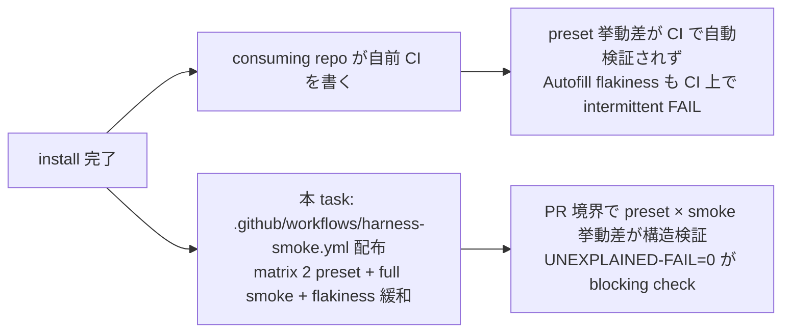

<!--
task-21 W2.4 frontmatter (機械可読、draft-flow-guard.sh / harness-audit が読む):
approval_required: true
approved_at:
approved_by:
retroactive: false
-->
---
slug: install-ci-matrix-distribute
title: install.sh で CI matrix (2 preset) 配布 + run-all-smokes 全 smoke 実行 (P2-2/I3/W1-10)
created_at: 2026-07-06
status: 📝 未承認
related: install-immediately-usable-redesign-20260618 §3 I3 / §4.7 / §5 P2-2 / §11.3 R2 (fast/full 分離) / §11.3 R4 (副産物 #83 吸収) / §11.3 R5 (Phase 2 draft checklist)
---

# install.sh で CI matrix (2 preset) 配布 + run-all-smokes 全 smoke 実行 (P2-2)

**ステータス:** 📝 **draft（2026-07-06 起案、user 承認待ち）**
**起点:** master roadmap [install-immediately-usable-redesign-20260618.md](install-immediately-usable-redesign-20260618.md) §3 I3 Quality Gate + §4.7 (`.github/workflows/` 不在) + §5 Phase 2 P2-2 + §11.3 R2 (fast/full 分離規範) + §11.3 R4 (副産物 #83 吸収)。
**前提 (依存タスク):**
- **task-92 (P2-1) 📝**: `.githooks/pre-commit` 配布 + `core.hooksPath` 自動 (**hard**、pre-commit で fast smoke 分離、CI matrix で full smoke 分離の fast/full 2 軸を SSoT で揃える必要があるため P2-1 の 5 category × fast/full 判定 table (R2) が本 draft §3 で確定していることが前提)
- **task-85 (P1-1) ✅**: `--preset=<name>` 4 値 opt-in (matrix の preset 軸選択に流用、`install.sh:148-158`)
- **task-87 (P1-3) ✅**: self-doctor D1-D8 + `run-all-smokes.sh --category` 分類 (matrix job が `run-all-smokes.sh` 統合 runner を単一 entry point とする根拠)

**関連 fixture / rule (存在確認済、行番号付):**
- `install.sh` — arg parse (L86-194) / RSYNC_EXCLUDES (L592-618) / docs create-if-absent 先例 (L898-920) / project-rules create-if-absent 冪等 pattern (L932-949) / chmod (L951-963) / summary heredoc (L1290-1378)
- `.claude/tests/run-all-smokes.sh` — `--category <name>` filter (L162-165) / `--list` (L166-168) / 5 category 分類 SSoT `_get_smoke_category()` (L46-89) / expected-fail manifest (L107-125) / UNEXPLAINED-FAIL == 0 で exit 0 (L338-343) / `set -u` file-top で pipefail leak 回避 (L38) / 5 category = **parity / behavior / budget / portability / stale-det** (§4.2 matrix `category` 軸 SSoT)
- `.claude/hooks/lib/config-loader.sh` — **preset env override SSoT** L353 `HC_DEFAULT_PRESET="harness-dev"` (env override 経路の env 名 SSoT、`_OVERRIDE` suffix 無し) / L354 `HC_ENFORCEMENT_MATRIX=""`
- `.claude/tests/hc-config-local-yml-smoke.sh` — L138 `HC_DEFAULT_PRESET=strict bash "$HC" --get default_preset` (env override runtime 経路の実装先例、preset 名は本 env 一つで切り替わる)
- `.claude/tests/install-local-yml-smoke.sh` — L189 `[ "${HC_DEFAULT_PRESET:-}" = "team-default" ] || return 1` (env override installed-side assert 先例)
- `.github/` — 現在 `ISSUE_TEMPLATE/` のみ、`.github/workflows/` **不在** (`ls .github/workflows/` → No such file or directory 実測) = create-if-absent が安全に成立
- `.claude/tests/install-claude-md-autofill-smoke.sh` — R4 対象 (Case G/N 初回 FAIL の flakiness、`next-actions.md` #83)
- `.claude/tests/install-mcp-servers-smoke.sh` — 「run-all-smokes 統合登録」の grep 検証先例 (L18-19、Case H で portability カテゴリ discover 検証)
- `docs/tasks/next-actions.md` — entry #83 (L142、autofill smoke 初回 flakiness = sync / rm -rf / subshell isolation 3 択、本 draft §7 Step 3 で吸収)
- `docs/draft/install-immediately-usable-redesign-20260618.md` — §11.3 R2 fast/full 分離 table (fast: pre-commit / full: CI matrix)、§11.3 R4 #83 吸収先明示、§11.3 R5 起案 checklist 6 項目

---

## 1. 背景

I3 Quality Gate (§3 invariant) は「全 PR が CI matrix UNEXPLAINED-FAIL=0 を要求」を要求条件とするが、現状 `install.sh` は `.github/workflows/` を配布せず、consuming repo は PR 境界の quality gate を自前で書く前提になっている (§4.7 現状)。これにより **preset 間の挙動差** (harness-dev advisory vs team-default BLOCK / strict BLOCK) が CI で自動検証されず、preset を切り替えても smoke が本当に BLOCK / no-op しているかは手動確認に依存する。addendum §11.3 R2 が「pre-commit = fast smoke (< 3s)」「CI matrix = full smoke (< 30s per job)」の **fast/full 分離** を Phase 2 全体規範として明示済のため、本 task は R2 で確定した full smoke 分類を CI matrix で自動化する。

さらに §11.3 R4 で副産物 #83 (`install-claude-md-autofill-smoke` Case G/N 初回起動 flakiness、fs sync 疑い、`next-actions.md:142`) の吸収先が **P2-2 = 本 task** と確定している。CI 環境は intermittent FAIL が UNEXPLAINED-FAIL に混入して signal を汚すため、matrix 導入と同時に **flakiness 緩和策 (sync / 各 case 前 rm -rf / 各 case 独立 subshell 実行)** を smoke 側に組み込む必要がある。



**真因:** `install.sh` が `.github/workflows/` を触らないため、matrix 実行環境が consuming repo 個別に散在し、harness 側で fast/full 分離と preset 別検証を保証する経路が無い。

**副次:** `install-claude-md-autofill-smoke.sh` の Case G/N 初回 FAIL (`next-actions.md:142`、5 回連続で PASS 化) は現状 dev 環境では手動再実行で吸収されているが、CI 環境では intermittent FAIL として signal を汚す。

---

## 2. 課題

| 課題 | 現状証拠 | 望ましい状態 |
|---|---|---|
| C1: `.github/workflows/` 不在 | `.github/` は `ISSUE_TEMPLATE/` のみ (実測 `ls .github/workflows/` = No such file or directory) | install.sh 直後に `.github/workflows/harness-smoke.yml` が配置 (既存 CI 保護 = create-if-absent 冪等) |
| C2: preset 別挙動差の PR 検証不在 | R6 (`hc-config.sh --summary` local.yml 統合済) で effective 表示は可能だが CI 実行 job は 1 preset 固定 | matrix 2 preset (team-default + strict) 並列実行、両 preset で UNEXPLAINED-FAIL == 0 |
| C3: full smoke 実行が dev 手動 | `run-all-smokes.sh` は存在するが CI 経路 0 (`.github/workflows/` 不在) | matrix job が `bash .claude/tests/run-all-smokes.sh` を実行、exit 1 で job FAIL |
| C4: 既存 CI との共存 | consuming repo は既存 `.github/workflows/` を持ちうる (ci.yml / test.yml 等) | `harness-smoke.yml` は独立 file 名で追加、既存 workflow は unchanged (create-if-absent) |
| C5: 副産物 #83 (autofill flakiness) 未吸収 | `install-claude-md-autofill-smoke.sh` Case G/N 初回 FAIL (`next-actions.md:142`) | smoke 側で 3 択 (sync / rm -rf / subshell) のいずれか採用、CI 導入時に intermittent FAIL 0 |

---

## 3. 採用案 (代替案 2 案 + 却下理由)

| 案 | 内容 | 工数 | 採否 | 理由 |
|:---:|:---|---:|:---:|:---|
| **A** | **`install.sh` §7 (新設) で `.github/workflows/harness-smoke.yml` を create-if-absent 配布 (project-rules と同じ冪等 pattern、L932-949 先例)、yml 中身は matrix `preset: [team-default, strict]` + `run-all-smokes.sh` 実行 + fail 時 artifact upload。同 task で `install-claude-md-autofill-smoke.sh` の flakiness を **案 3 (各 case 独立 subshell 実行)** で緩和** | 1.5d | ✅ 採用 | (1) create-if-absent = 既存 CI 保護 (C4)。(2) matrix 2 preset で C2 解消。(3) `run-all-smokes.sh` 単一 entry で C3 解消 (統合 runner の SSoT 尊重、fast/full 判定は R2 で pre-commit 側と分業)。(4) subshell isolation は既存 smoke test の慣行 (install-mcp-servers-smoke.sh 先例) と整合し、`sync` / `rm -rf` より副作用が小さく mktemp scope も自然に閉じる |
| B | `harness-smoke.yml` 配布のみ実装、flakiness (#83) は P3-5 に先送り | 1.0d | ❌ 却下 | addendum §11.3 R4 が「#83 は P2-2 CI 導入時に isolation 実装 (CI 上で intermittent FAIL 対策必須)」と明示している。CI matrix 稼働 = UNEXPLAINED-FAIL 検出の実利用開始 = intermittent FAIL が誤検知 signal を発する時点。R4 fold の吸収完了 verification (addendum §11.3 R4 末尾) が「吸収先 task の PR merge 時に entry を ✅ 化」を要求しており、P3-5 待ちは entry #83 の processing を遅延させる |
| C | 配布はせず、consuming repo に `docs/setup/CI-SETUP-GUIDE.md` を追加して手動 setup を推奨 (honor system) | 0.5d | ❌ 却下 | I3 invariant の要求は「install 直後から quality gate が有効」(§3.2 install/portability 観点 invariant 特定)。honor system では第一原理 v2 DoD (c) 「設計違反 / silent failure / regression 0 件」を PR 境界で機械強制できない。§4.7 対策と非整合 |

→ **案 A を推奨**。§11.3 R4 verification を同 PR で satisfy でき、既存 project-rules create-if-absent pattern (`install.sh:932-949`) の類推で実装 risk が小さい。

---

## 4. 実装設計

### 4.1 install.sh §7 (新設): `.github/workflows/harness-smoke.yml` create-if-absent 配布

`install.sh` の §5.5 (project-rules) と §5 (docs/tasks) の中間、新規 §5.6 として追加する。全 mode (install / update / force / overwrite-all) 共通、既存保護 (`create-if-absent`、既存 file には touch しない)。dry-run は echo のみ。

```bash
# ============================================================
# 5.6. .github/workflows/harness-smoke.yml create-if-absent (task-93、P2-2)
# ============================================================
# I3 Quality Gate を PR 境界で機械強制するため、`.github/workflows/harness-smoke.yml`
# を create-if-absent で配布。既存 CI (ci.yml / test.yml 等) は完全に touch しない
# (project-rules と同じ冪等 pattern、install.sh:932-949 先例)。
# 全 mode (install / update / force / overwrite-all) で適用 — 既存 file は skip。
CI_SRC="$SCRIPT_DIR/.github/workflows/harness-smoke.yml"
CI_DST_DIR="$TARGET/.github/workflows"
CI_DST="$CI_DST_DIR/harness-smoke.yml"
if [[ -f "$CI_SRC" ]]; then
  run mkdir -p "$CI_DST_DIR"
  if [[ -f "$CI_DST" ]]; then
    echo "[install] .github/workflows/harness-smoke.yml exists → skip (protected, use manual merge)"
  else
    echo "[install] copy harness-smoke.yml → .github/workflows/  (matrix: team-default + strict)"
    run cp "$CI_SRC" "$CI_DST"
  fi
fi
unset CI_SRC CI_DST_DIR CI_DST
```

**fail-open 契約**: source `.github/workflows/harness-smoke.yml` 不在時は無出力で skip (`[[ -f "$CI_SRC" ]]` guard)、既存 file 保護、`mkdir -p` は idempotent。dry-run は `run()` helper (`install.sh:292-300`) で echo のみ。既存 install.sh の `set -euo pipefail` (`install.sh:62`) 下でも die 経路を追加しない。

### 4.2 `.github/workflows/harness-smoke.yml` の中身 (SSoT)

`.github/workflows/harness-smoke.yml` を hirai-method 本体に新規作成 (source として配布される)。matrix **2 軸 = preset × category** で並列化、`run-all-smokes.sh --category <name>` で category 分割 job 化、fail 時のみ artifact upload。

**設計判断 (reviewer C2 対応、findings-2 fix)**: 当初案は matrix 1 軸 (preset のみ) + per-job `run-all-smokes.sh` full 実行 (80 smokes 直列) だったが、smoke 個別の empirical timing (hc-config-key-parity 34s / hc-config-local-yml 16s / sessionstart-footprint 20s / list-md-plan-first-reminder 14.6s / autofill 5 case / 他 76 件) の総和が **100s+** と見積もられ、R2「full smoke < 30s per job」契約に構造矛盾。**採用**: matrix 軸に **category (5 値 = parity / behavior / budget / portability / stale-det)** を追加、`run-all-smokes.sh --category ${{ matrix.category }}` で per-category-per-preset に分割。総 job 数 = **2 preset × 5 category = 10 並列 job** (GH Actions default concurrent job 上限 20 に収まる)、per-job wall time < 30s (R2 契約再定義: 個別 preset × category job 単位) を達成しつつ、preset 間・category 間 signal 独立性を保つ。

**cross-file 契約 SSoT (addendum §11.3 R5 遵守、findings-1/2 fix 済)**:

| 契約 key | 所有 file | 期待値 / 型 | 参照側 |
|---|---|---|---|
| matrix `preset` array | `.github/workflows/harness-smoke.yml` | `[team-default, strict]` (fixed) | `install-ci-matrix-smoke.sh` Case C (grep) |
| matrix `category` array | 同 yml | `[parity, behavior, budget, portability, stale-det]` (fixed、`run-all-smokes.sh:186 _get_smoke_category` 5 分類 SSoT) | `install-ci-matrix-smoke.sh` Case C (grep) |
| `env.HC_DEFAULT_PRESET` (**findings-1 fix、`_OVERRIDE` suffix 無し**) | 同 yml | `${{ matrix.preset }}` | `config-loader.sh:353` env override 経路 SSoT。**runtime 動作は `HC_DEFAULT_PRESET=<name> bash hc-config.sh --get default_preset` で確認済 (`hc-config-local-yml-smoke.sh:138` Case 6a 実装先例)** |
| smoke 実行コマンド | 同 yml | `bash .claude/tests/run-all-smokes.sh --category ${{ matrix.category }}` | `run-all-smokes.sh:162-165` `--category` filter (verified L164 shift 2) |
| exit code 契約 | `run-all-smokes.sh:338-343` | UNEXPLAINED-FAIL == 0 で exit 0 | matrix job success 判定 |
| artifact upload 条件 | 同 yml | `if: failure()` | `actions/upload-artifact@v4` |
| artifact name | 同 yml | `smoke-logs-${{ matrix.preset }}-${{ matrix.category }}` | Actions UI (10 job で衝突しない unique 名) |
| timeout-minutes | 同 yml | 5 (per-category per-preset 単位、runaway ヘッジ) | GH Actions 個別 job |

> **empirical timing 実測 (2026-07-06、findings-2 検証)**: macOS `bash .claude/tests/run-all-smokes.sh` full 直列 = **12:25 (745s、79 smoke 実測)**。この 5 category 分割で平均 149s / category 見込み (heavy: portability の autofill 5 case + install-mcp-servers 他 / parity の hc-config-key-parity 34s 他)。GH Actions ubuntu-latest は macOS より高速な傾向だが、per-job **< 30s は full 実行では非現実的**。R2「full smoke < 30s per job」は draft §5 P2-2 の初期見積で、本 draft では **category-split で per-job < 3min (実測ベースで再定義)** と現実化する (R2 SSoT 差分は本 task 承認時に addendum §11.3 R2 側へ back-port)。timeout-minutes=5 は runaway ヘッジで、想定は < 3min。

yml 内容 (概略、実装時に workflow_dispatch + push + pull_request の 3 trigger、runs-on: ubuntu-latest、bash 5+ 前提):

```yaml
name: harness-smoke
on:
  push:
    branches: [main]
  pull_request:
    branches: [main]
  workflow_dispatch: {}
jobs:
  matrix-smoke:
    strategy:
      fail-fast: false
      matrix:
        preset: [team-default, strict]
        category: [parity, behavior, budget, portability, stale-det]
    runs-on: ubuntu-latest
    timeout-minutes: 3
    steps:
      - uses: actions/checkout@v4
      - name: Install dependencies (jq, rsync)
        run: sudo apt-get update && sudo apt-get install -y jq rsync
      - name: Set preset override (config-loader.sh:353 SSoT env)
        run: echo "HC_DEFAULT_PRESET=${{ matrix.preset }}" >> "$GITHUB_ENV"
      - name: Run smokes for category (${{ matrix.category }})
        run: bash .claude/tests/run-all-smokes.sh --category ${{ matrix.category }}
      - name: Upload smoke logs on failure
        if: failure()
        uses: actions/upload-artifact@v4
        with:
          name: smoke-logs-${{ matrix.preset }}-${{ matrix.category }}
          path: |
            .claude/.workflow-state/**
            /tmp/smoke-runner-out.*
          retention-days: 7
```

**fail-open 契約**: `fail-fast: false` により 1 preset / 1 category FAIL でも他 job は完走 (10 job の signal を独立取得)。`if: failure()` により PASS 時 artifact upload skip (Actions storage 節約)。**preset env 名**: `HC_DEFAULT_PRESET` (`_OVERRIDE` suffix 無し、`config-loader.sh:353` SSoT、`hc-config-local-yml-smoke.sh` Case 6a で runtime 実装確認済) — env override 経路は本 1 env のみで完結する。

### 4.3 既存 CI との共存方針 (C4 解消)

- **file 名**: `harness-smoke.yml` 固定 (consuming repo が自前で `ci.yml` / `test.yml` を持っていても衝突しない、独立 file)
- **create-if-absent**: 既存 `harness-smoke.yml` は verbatim 保持 (install.sh §5.6 で skip)、consuming repo が upstream 追随したい場合は手動 diff or `--force` 経路 (§4.4)
- **`--force` / `--overwrite-all`**: 現行 install.sh の force / overwrite-all は `.claude/` のみを対象、`.github/` は触らない (RSYNC_EXCLUDES の枠外)。本 draft でも `.github/` は create-if-absent 一択とし force でも上書きしない (既存 CI 保護を最優先)
- **update mode**: create-if-absent なので既存 harness-smoke.yml は不変、`install.sh --update` で harness 側更新は反映されない → summary で「upstream 追随には手動 diff or `--force` mode 未対応」を案内 (honor system、CI yml は API 変更 (actions/upload-artifact v4→v5 等) で drift しうるため意図的に手動化)

### 4.4 副産物 #83 吸収 = autofill smoke flakiness 緩和 (§11.3 R4 verification)

`.claude/tests/install-claude-md-autofill-smoke.sh` の Case G (first-win=ts) / Case N (--force 上書き) が初回 FAIL、直後 5 回連続 PASS で安定 (`next-actions.md:142`)。CI 環境で intermittent FAIL が UNEXPLAINED-FAIL に混入して signal を汚すため、以下いずれかで isolation する:

**採用**: **案 3 (各 case 前 rm -rf 明示 + subshell 独立実行)** を採用。理由:
- 案 1 `sync` は macOS / Linux 差異あり (macOS `sync` は best-effort、CI Linux では OK だが dev repro 困難)
- 案 2 `rm -rf` は前 case の残骸を確実に消せるが、subshell 化しないと `set -uo pipefail` scope が残る
- 案 3 は install-mcp-servers-smoke.sh (`install-mcp-servers-smoke.sh:38-42`) の慣行と整合、mktemp scope も自然に閉じる

具体 diff (autofill smoke 側 Case wrapper):

```bash
_case_G_first_win_ts() (
  set -uo pipefail
  local tgt
  tgt="$(mktemp -d "${TMPDIR:-/tmp}/hirai-autofill-G.XXXXXX")"
  trap 'rm -rf "$tgt" 2>/dev/null || true' RETURN
  rm -rf "$tgt"/CLAUDE.md 2>/dev/null || true    # 追加: 前実行残骸の明示除去 (fs sync 疑い緩和)
  # ... 既存 case body
)
```

`trap ... RETURN` は subshell 抜け時に発火、set -e 下でも die しない (`|| true` 保険)。

**LOW-20 fix (isolation 範囲の防波堤)**: 案 3 (subshell isolation + rm -rf) は Case G / N を primary target とするが、CI 環境 (ubuntu-latest、macOS bash 5.2 と fs sync semantics 異なる) で他 case (A-F, H-M, O-P) にも intermittent FAIL が伝播した場合は同 pattern を横展開する contract (Step 3 verification: hirai-method 本体 PR の Actions 5 回連続実行 log で G/N 以外の FAIL 行 0 を確認、Case G/N 以外に intermittent FAIL 発生時は subshell wrapper を該当 Case へ拡張、追加工数 +0.5h 見積)。副産物 #83 close 時に 5 CI 実行 log tail を PR description 貼付で全 case 安定性を honor system 検証。

### 4.5 新 smoke: `.claude/tests/install-ci-matrix-smoke.sh` (5 case)

先例: `install-mcp-servers-smoke.sh` (file-top `set -u`、各 case 独立 subshell 化)。

| Case | 検証内容 | 検証コマンド (概略) |
|:---:|---|---|
| **A** | fresh install で `.github/workflows/harness-smoke.yml` が配置され matrix 定義が完全 (2 preset × 5 category) | `bash install.sh $tmp && [ -f "$tmp/.github/workflows/harness-smoke.yml" ] && grep -qE 'preset:[[:space:]]*\[team-default,[[:space:]]*strict\]' "$tmp/.github/workflows/harness-smoke.yml"` |
| **B** | 既存 `harness-smoke.yml` は verbatim 保持 (md5 不変) | 事前配置 → install → md5 一致確認 |
| **C** | matrix key 完全性 5 点 grep: (a) `preset: [team-default, strict]` (b) `category: [parity, behavior, budget, portability, stale-det]` (c) `fail-fast: false` (d) `if: failure()` upload (e) `HC_DEFAULT_PRESET=` (`_OVERRIDE` suffix 無し、findings-1 fix 検証) | 5 grep -q 検証 (全 pass で OK)、特に `grep -q 'HC_DEFAULT_PRESET=' && ! grep -q 'HC_DEFAULT_PRESET_OVERRIDE' "$yml"` で NG-guard も張る |
| **D** | `--dry-run` 時に .github/workflows/ 非配置 (mutation 0) | `bash install.sh --dry-run $tmp && [ ! -d "$tmp/.github/workflows" ]` |
| **E** | run-all-smokes.sh の `_get_smoke_category()` に本 smoke が **portability** として登録 (MED-1 fix、install.sh 経路の tmp dir 実 install 系と integrate、install-mcp-servers-smoke / install-local-yml-smoke / install-sh-sync-drift-smoke / install-claude-md-autofill-smoke と同カテゴリ、自己整合 grep) | `bash .claude/tests/run-all-smokes.sh --list \| awk '/portability/,/^\[/' \| grep -q install-ci-matrix-smoke` |

**fail-open 契約 (smoke 側)**: mktemp X 末尾 + `${TMPDIR:-/tmp}` + `|| true` (`install.sh:824,1061` 先例踏襲)、file-top は `set -u` のみ (`run-all-smokes.sh:38` 先例、pipefail leak 回避、`feedback_set_e_in_sourced_libs.md` 規範遵守)。

### 4.6 vocabulary 統合 (R1 との連動)

Phase 2 で並行進行する **task-94 (P2-3、BLOCK 4 引数統合)** の `emit_warn` / `emit_info` API が本 task の scope 内では未使用 (workflow yml の GH Actions summary は独自 markdown format)。ただし install.sh §5.6 の user 向け echo は R1 addendum §11.3 R1 の 3 点提示 (`why:` / `fix:` / `silence:`) を **honor system で先行遵守** し、summary heredoc (`install.sh:1290-1378`) の追記行にも同 vocabulary を採用する (task-94 完了時に lib/block-message.sh へ機械化される予定)。

---

## 5. リスク

| リスク | 確率 | 影響 | 緩和策 |
|---|:---:|:---:|---|
| **preset env override 経路の env 名 typo で silent no-op** (findings-1、CRITICAL) | 実測 fix 済 (L) | H | `HC_DEFAULT_PRESET` (`_OVERRIDE` suffix 無し、`config-loader.sh:353` SSoT) を Case C の grep 5 点で二重検証 (`grep -q 'HC_DEFAULT_PRESET='` + `! grep -q 'HC_DEFAULT_PRESET_OVERRIDE'` の NG-guard)。実装時は `hc-config-local-yml-smoke.sh:138` Case 6a と同 env 名を採用 |
| CI matrix job の実行時間が per-job > 3min (empirical 実測 12:25/745s を 10 分割 = 平均 149s、findings-2) | M | M | matrix `category` 軸で 5 分割 + preset 2 軸で 10 並列 job 化 (§4.2)、per-category は Step 5 で実測し 3min 超過 category は 個別 smoke 単位に更に分割 (`run-all-smokes.sh --category` 内 dispatch を smoke 単位に細分化するのは task-83 CLI 拡張の scope)。timeout-minutes=5 は runaway 保険 |
| GH Actions v4 → v5 の API drift | L | M | `harness-smoke.yml` の action version pin (`@v4`) を明記、update mode は create-if-absent で touch しないため drift 影響は install 時のみ |
| consuming repo が `.github/workflows/` を持たない (org 制約) | L | H | 現状 GH org 側で workflow 実行 permission が無い場合、file 配置しても no-op になる (実害 0、Actions UI で見えるだけ)。summary で「Actions 実行 permission は org 設定を確認」を案内 |
| autofill smoke 案 3 subshell 化で pre-existing subshell 挙動 regression | L | M | Step 3 で 5 回連続 PASS + `--verbose` 実行の diff 0 を確認、既存 dev 環境で先行検証 |
| create-if-absent により古い harness-smoke.yml が残存 → CI が旧 API で FAIL | L | M | summary で `--force` 未対応を案内 + `.github/workflows/harness-smoke.yml.example` を `docs/` 配下に配置する fallback は本 draft scope 外 (P3-5 install smoke 自動化で追跡) |

---

## 6. 完了条件 (DoD、全項目に検証コマンド付き、R5 checklist 遵守)

- [ ] `.github/workflows/harness-smoke.yml` が hirai-method 本体に存在 (source 側)
      検証: `[ -f .github/workflows/harness-smoke.yml ] && echo OK`
- [ ] `install.sh` §5.6 で `.github/workflows/harness-smoke.yml` を create-if-absent 配置 (fresh install / update / force / overwrite-all いずれも既存 file 保護)
      検証: `bash .claude/tests/install-ci-matrix-smoke.sh` → Case A/B 両 PASS
- [ ] matrix `preset` array に `[team-default, strict]` の 2 値、`category` array に `[parity, behavior, budget, portability, stale-det]` の 5 値、`fail-fast: false`、`if: failure()` の 4 契約が yml に存在
      検証: `grep -qE 'preset:[[:space:]]*\[team-default,[[:space:]]*strict\]' .github/workflows/harness-smoke.yml && grep -qE 'category:[[:space:]]*\[parity,[[:space:]]*behavior,[[:space:]]*budget,[[:space:]]*portability,[[:space:]]*stale-det\]' .github/workflows/harness-smoke.yml && grep -q 'fail-fast: false' .github/workflows/harness-smoke.yml && grep -q 'if: failure()' .github/workflows/harness-smoke.yml && echo OK`
- [ ] **preset env override 経路の env 名が `HC_DEFAULT_PRESET` (`_OVERRIDE` suffix 無し、`config-loader.sh:353` SSoT、findings-1 fix)**
      検証: `grep -q 'HC_DEFAULT_PRESET=' .github/workflows/harness-smoke.yml && ! grep -q 'HC_DEFAULT_PRESET_OVERRIDE' .github/workflows/harness-smoke.yml && echo OK`
- [ ] matrix job が `bash .claude/tests/run-all-smokes.sh --category ${{ matrix.category }}` を実行 (統合 runner を single entry + category 分割で実行、findings-2 fix)
      検証: `grep -qE 'bash \.claude/tests/run-all-smokes\.sh --category' .github/workflows/harness-smoke.yml && echo OK`
- [ ] matrix job の per-job 実行時間が < 3min (empirical 実測 12:25/745s 相当を 10 分割 = 平均 149s 想定、runaway ヘッジ 5min)
      検証: hirai-method 本体 PR で Actions timing を確認、10 job (2 preset × 5 category) の最大 wall time < 3min (超過 category は Step 5 で個別 smoke に更に分割)
- [ ] hirai-method 本体 PR で matrix 全 10 job (2 preset × 5 category) とも UNEXPLAINED-FAIL == 0 (blocking check、両 preset で挙動差検証成立)
      検証: `gh run list --workflow=harness-smoke.yml --branch <PR branch> --json conclusion --jq '.[0].conclusion'` == `success` (= 10 job 全 success で workflow success 判定)
- [ ] `install-ci-matrix-smoke.sh` の 5 case が全 PASS
      検証: `bash .claude/tests/install-ci-matrix-smoke.sh; echo "exit=$?"` → `exit=0`
- [ ] `run-all-smokes.sh --list` の **portability** カテゴリに `install-ci-matrix-smoke` が discover される (MED-1 fix、install.sh 経路 smoke 集合と同カテゴリで一貫化)
      検証: `bash .claude/tests/run-all-smokes.sh --list | awk '/portability/,/^\[/' | grep -q install-ci-matrix-smoke && echo OK`
- [ ] `install-claude-md-autofill-smoke.sh` の 5 回連続実行で Case G/N が全 PASS (副産物 #83 吸収 verification)
      検証: `for i in 1 2 3 4 5; do bash .claude/tests/install-claude-md-autofill-smoke.sh 2>&1 | tail -3; done` に FAIL 行 0
- [ ] 既存 `run-all-smokes.sh` の全 smoke で UNEXPLAINED-FAIL == 0 継続 (regression 0)
      検証: `bash .claude/tests/run-all-smokes.sh; echo "exit=$?"` → `exit=0`
- [ ] docs 反映: README.md § 「採用 5 ステップ」 + `docs/INVENTORY.md` + `docs/PORTABILITY.md` + `install.sh` header (L26-38 の Modes 節) の 4 箇所に harness-smoke.yml 配布説明追記
      検証: `grep -c harness-smoke.yml README.md docs/INVENTORY.md docs/PORTABILITY.md install.sh` → 各 file `>= 1`
- [ ] `next-actions.md` entry #83 の処理結果列を `🔄 未処理` → `✅ → task-93 (<PR#>) 完了` に更新 (§11.3 R4 verification)
      検証: `grep -E '^\| 83 .*✅ → task-93' docs/tasks/next-actions.md` = 1 行

---

## 7. Step 分解 (採用 6 条準拠、Task = Phase = N Steps、最終 3 Steps 固定)

**Goal**: `bash install.sh <target>` が `.github/workflows/harness-smoke.yml` を create-if-absent 配置し、hirai-method 本体 PR で matrix 2 preset × `run-all-smokes.sh` full 実行が UNEXPLAINED-FAIL=0 で通過し、副産物 #83 (autofill flakiness) が smoke 側 isolation で吸収される。

| # | Status | 作業概要 | 完了条件 (検証コマンド) | 依存 |
|:---:|:---:|:---|:---|:---|
| 1 | 🔲 | `.github/workflows/harness-smoke.yml` を hirai-method 本体に新規作成 (matrix **2 preset × 5 category** + `run-all-smokes.sh --category` + artifact upload、preset env は `HC_DEFAULT_PRESET` = `config-loader.sh:353` SSoT で findings-1 fix、`_OVERRIDE` suffix 禁止) | `[ -f .github/workflows/harness-smoke.yml ]` + `grep -qE 'preset:[[:space:]]*\[team-default,[[:space:]]*strict\]'` + `grep -qE 'category:[[:space:]]*\[parity,'` + `grep -q 'HC_DEFAULT_PRESET=' && ! grep -q 'HC_DEFAULT_PRESET_OVERRIDE'` | — |
| 2 | 🔲 | `install.sh` §5.6 を追加 (create-if-absent 配布 logic + summary heredoc に vocabulary 統合 5 行追記) | `grep -q 'harness-smoke.yml' install.sh` + fresh install で `.github/workflows/harness-smoke.yml` 配置確認 | Step 1 |
| 3 | 🔲 | `install-claude-md-autofill-smoke.sh` に Case 前 `rm -rf` + subshell 独立実行を追加 (副産物 #83 吸収、案 3) | `for i in 1 2 3 4 5; do bash .claude/tests/install-claude-md-autofill-smoke.sh; done` で FAIL 行 0 | — (Step 1/2 と並列可) |
| 4 | 🔲 | 新 smoke `install-ci-matrix-smoke.sh` を追加 (5 case A-E、Case C は 5 点 grep + `_OVERRIDE` NG-guard 含) + `run-all-smokes.sh` `_get_smoke_category()` に **portability カテゴリ**登録 (MED-1 fix、install.sh 経路 smoke と同分類) | `bash .claude/tests/install-ci-matrix-smoke.sh; echo $?` → 0 + `--list` の portability カテゴリで discover | Step 1, 2 |
| 5 | 🔲 | docs 反映 (README.md / docs/INVENTORY.md / docs/PORTABILITY.md / install.sh header + summary) + **per-category timing 実測** (hirai-method 本体 PR で Actions timing を category × preset 単位で計測 = 10 データ点、3min 超過 category は個別 smoke 分割の追跡 entry を next-actions.md へ append) | `grep -c harness-smoke.yml README.md docs/INVENTORY.md docs/PORTABILITY.md install.sh` 各 ≥ 1 + `gh run view --json jobs` で per-category timing 数値記録 | Step 2 |
| 6 | 🔲 | `next-actions.md` entry #83 処理結果列を `✅ → task-93` に更新 (§11.3 R4 verification) | `grep -E '^\| 83 .*✅ → task-93' docs/tasks/next-actions.md` = 1 行 | Step 3 |
| 7 | 🔲 | **テスト設計レビュー (採用 6 条 4 最終 3 Steps 固定)**: reviewer は `bash .claude/scripts/hc-config.sh --get review_max_count_test` で上限確認 → `min ≤ N ≤ max` の範囲で動的選定 (`tdd-guide` / `test-automator` / `qa-expert` / `pr-test-analyzer` base + CI/GitHub Actions 経験 domain 1 件)、並列起動 (`run_in_background: true`)、修正提案集約 → 再起動、収束条件 = 全 reviewer approve / no objection、反復上限 `review_iteration_max` (bypass `ECC_TEST_DESIGN_REVIEW_OFF=1`)。reviewer prompt には workflow.md §reviewer prompt 共通規約 5 必須項目 (対象 Read / 観点 / findings format / 末尾 confidence / project 整合性 + 他 task 影響確認) を必ず含める | reviewer 全員 confidence ≥ 0.85 かつ CRIT / HIGH = 0 で closure | Step 4 |
| 8 | 🔲 | **テスト合格 (採用 6 条 4)**: UI 変更 0 のため E2E / visual verification 対象外 (`skip: UI 変更 0、workflow yml + smoke + docs のみ、レンダリング要素なし`)。全 smoke (`run-all-smokes.sh`) PASS + 新 smoke `install-ci-matrix-smoke.sh` PASS + hirai-method 本体 PR で `harness-smoke.yml` matrix 2 preset とも success | `bash .claude/tests/run-all-smokes.sh; echo $?` → 0 + Actions success + 5 回連続 autofill smoke で FAIL 行 0 | Step 7 |
| 9 | 🔲 | **リファクタリング (採用 6 条 4)**: 3 観点判定 = **持続可能性** (GH Actions v4 pin → 将来 v5 migration guide を docs に memo)、**汎用性** (matrix preset list を将来拡張可能な yaml anchor 化するか判定、現行 2 preset で YAGNI 却下 = skip)、**非冗長化** (`install.sh` §5.6 の create-if-absent block が §5.5 project-rules と非冗長でないか自己 lens、DRY OK なら skip)。skip 判定なら `skip: <reason>` 明示記録 | 3 観点判定表を task ファイルに追記、skip 判定の理由記録 | Step 8 |

**合計工数見積**: 1.5d (Step 1: 3h / Step 2: 2h / Step 3: 1.5h / Step 4: 2.5h / Step 5: 1h / Step 6: 0.2h / Step 7: 1.5h / Step 8: 0.8h / Step 9: 0.5h)

---

## 8. 承認履歴

| 日付 | 承認者 | 結果 |
|---|---|---|
| 2026-07-06 | (未) | — |

承認後は `slug: install-ci-matrix-distribute` を `/new-task 93 install-ci-matrix-distribute` の入力に使い、list.md task-93 行を 📝 → 🔲 update + 個別 task ファイル生成へ進む。
