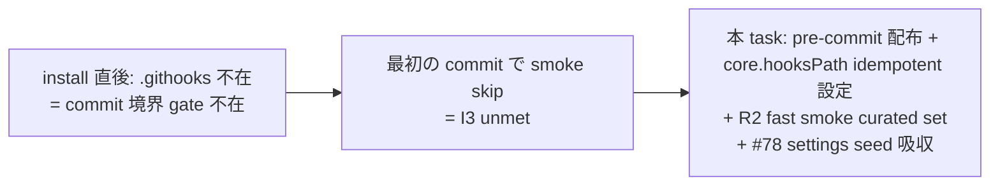

<!--
task-21 W2.4 frontmatter (機械可読、draft-flow-guard.sh / harness-audit が読む):
approval_required: true
approved_at: 2026-07-06
approved_by: user (kfurutani@classlab.co.jp)
retroactive: false
-->
---
slug: install-pre-commit-distribute
title: install.sh pre-commit 配布 + core.hooksPath 自動設定 + settings seed 吸収 (P2-1/I3/W1-9)
created_at: 2026-07-06
status: ✅ 承認済 (2026-07-06、AI 推奨どおり fast smoke 4 本採用、#78 sub-item 1 吸収承認)
related: install-immediately-usable-redesign-20260618 §5 P2-1 / §4.7 / §11.3 R2 / §11.3 R4
---

# install.sh pre-commit 配布 + core.hooksPath 自動設定 (P2-1 主軸)

**ステータス:** 📝 **draft（2026-07-06 起案、user 承認待ち）**
**起点:** master roadmap [install-immediately-usable-redesign-20260618](./install-immediately-usable-redesign-20260618.md) §5 P2-1 (batch planning 経路 B、addendum §11 承認済)
**前提 (完了済、本 draft の実装 scope 外):**
- **Phase 1 (7 task 完遂、addendum §11.1)**: install.sh は `--preset=<name>` opt-in (`install.sh:75-76,148-158`) + `harness-config.local.yml` create-if-absent 生成 (`install.sh:1006-1105`) + self-doctor D1-D8 (task-87、PR #73) + auto-fill (task-89) + `.mcp.json` minimal default (task-90) を保持。default preset は team-default = guard 4 + review_required 4 が全て true
- **§4.7 現状**: install.sh は `.githooks/` を配布しない (repo 実測 `ls .githooks` = **不在**、2026-07-06 確認)。consuming repo は pre-commit を自前で書く前提のため I3 Quality Gate が install 直後に効かない
- **既存 fast smoke 群**: `enforcement-mismatch-smoke.sh` (実測 0.58s) / `harness-config-local-smoke.sh` (実測 1.66s) / `common-rules-import-smoke.sh` (実測 0.06s) の 3 本と `bash -n` 全 `.sh` (実測 0.08s、hooks 43 + scripts 9 + install.sh 1) が pre-commit 時間予算 (< 3s) に収まる (2026-07-06 dogfood 実測)

**関連 rule:**
- `.claude/rules/development-process.md` §「サブエージェント委譲 (Hook で強制)」+ §「harness 取込チェックリスト」
- `.claude/rules/workflow.md` §「副産物 discharge (5 層強制機構)」
- CommonRules.md §「Design Constraints」(feature toggle 3 点 set / 保護パス / hook fail policy 統一)
- addendum §11.2 (staging 戦略 / mktemp fail-open ガード / `set -uo pipefail` 契約 / feature toggle 3 点 set / fail-open 2 層)
- addendum §11.3 **R2 (fast/full smoke 分離 vocabulary)** + **R4 (副産物 #78 吸収先)** + **R5 (draft 起案 checklist)**

---

## 1. 真因サマリ / 課題サマリ

I3 Quality Gate (roadmap §3 invariant 8 件のうち **新規**) は「全 commit が pre-commit smoke 通過」を要求するが、`install.sh` は `.githooks/pre-commit` を配布せず `core.hooksPath` も設定しないため、**consuming repo は install 直後の状態で commit 境界の quality gate が honor system**に留まる。addendum §11.2 で確立した「3 点提示」「fail-open 2 層」「feature toggle 3 点 set」「staging 戦略」「mktemp fail-open ガード」の Phase 1 資産があるにも関わらず、それを commit 境界で機械強制する枠組みが存在しない状態。

さらに副次課題:
- **副産物 #78 の吸収**: `docs/tasks/next-actions.md` #78 「前セッション WIP 2 件」のうち **install.sh §6.3 settings.json 不在時の source seed copy + backup 拡張** を本 task が回収する必要がある (addendum §11.3 R4 で「P2-1 に併合 (settings seed)」と明記、statusline 行 2 の repo/dir 名表示は **独立小タスク化** = 本 task 対象外)
- **fast/full smoke 分離**: R2 が「pre-commit = fast smoke (< 3s)、CI matrix = full smoke (< 30s)」の 2 軸を明記。R2 表の Phase 1 新設 smoke 群のうち **empirical に < 3s に収まるもの** を選定する必要 (2026-07-06 dogfood で `hc-config-key-parity-smoke` = 34s / `hc-config-local-yml-smoke` = 16s / `sessionstart-footprint-smoke` = 20s / `sessionstart-budget-smoke` = 9.5s / `list-md-plan-first-reminder-smoke` = 14.6s は fast 予算超過を実測、R2 表の「fast」ラベル値は **timing 未検証**の暫定 classification と判明)



**真因:** `.claude/templates/githooks/` template 領域と `install.sh` の pre-commit 配布 logic が両方 存在しない。Phase 1 は yml / summary / local.yml で consuming repo の start state を整えたが、**commit 境界の強制機構は Phase 2 の scope として意図的に後回し** されていた (roadmap §3.1 I3 invariant 起源)。

**副次:** (a) 既存 `.husky/` / `.githooks/` を保つ project との共存契約が SSoT 化されていない (b) settings seed 吸収の scope が sub-item 2 件の混成で addendum R4 の 1:1 吸収と字面上矛盾するため、明示的な分離宣言が必要。

---

## 2. 解決アプローチ比較

| 案 | 内容 | 工数 | メリット | デメリット |
|:---:|:---|---:|:---|:---|
| **A** | **pre-commit を独立 file (`.claude/templates/githooks/pre-commit`) として配布 + `core.hooksPath .githooks` を git config で idempotent 設定 + `--no-hooks` opt-out + settings seed 吸収** | 1.0 day | R2 fast/full 分離を smoke curated set で実装、既存 `.githooks/` は保護、`--no-hooks` で opt-out 可、settings seed は §6.3 に自然吸収、fail-open 2 層踏襲 | 新 template dir 追加 (`.claude/templates/githooks/`) と rsync 経路の確立が必要 |
| **B** | Husky (`npm install --save-dev husky`) に依存し `package.json` scripts 経由で組み込む | 1.5 day | npm ecosystem 標準 | node/npm 非依存な repo (go/rust/php/swift) に regression、consuming repo 全 7 lang starter (task-89 = `ts/py/go/rust/php/swift/generic`) と非対称、**却下** |
| **C** | pre-commit を install.sh 内部で `cat > .githooks/pre-commit << EOF` heredoc 生成 | 0.7 day | template dir 追加不要 | heredoc 内の shell escape が複雑化しレビュー困難、`.mcp.json` verbatim copy pattern (`install.sh:799`) と非対称、**却下** |
| **D** | `.github/workflows/` を同 task で配布 (P2-1 + P2-2 合体) | 1.5 day | 一度に完遂 | P2-2 (#93) が別 task で計画済 (list.md L250)、scope 肥大化で reviewer 消耗、**却下** |

→ **案 A を推奨**。理由: (1) R2 fast/full 分離を curated set + empirical timing で実装し飾り toggle を回避 (feedback_config_value_needs_consumer_and_smoke) (2) `.mcp.json` / `.gitignore` 配布 pattern (§3-4) と対称 (3) 既存 `.githooks/` protection + `--no-hooks` opt-out で consuming repo の選択肢を保つ (4) settings seed は §6.3 内で自然に吸収可能 (§4.5 参照)。

---

## 3. 採用案の詳細設計

### Task 計画 (採用 6 条準拠、Phase 中間階層廃止)

**Goal**: `bash install.sh <target>` 直後に `.githooks/pre-commit` が配置され `core.hooksPath .githooks` が設定される。全 commit で fast smoke (< 3s 目安) が実行され、FAIL で BLOCK / 未整備で fail-open WARN。既存 `.githooks/` は保護、`--no-hooks` で opt-out 可。副産物 #78 の settings seed sub-item を §6.3 経路で吸収完了。

#### Step 計画

| Step | Status | 作業概要 | 工数 | 依存 |
|:---:|:---:|:---|---:|:---|
| 1 | 🔲 | `.claude/templates/githooks/pre-commit` 新設 (fast smoke curated set + fail-open 2 層 + `_pc_emit_*` 3 点提示 helper + feature toggle check) | 2.0h | — |
| 2 | 🔲 | install.sh: `.githooks/pre-commit` 配布を **§6.8 新設** (§6.7 sync drift の直後、§7 検証 の直前) + `core.hooksPath` idempotent 設定 + `--no-hooks` arg + summary Next steps 更新 | 2.0h | Step 1 |
| 3 | 🔲 | install.sh §6.3 settings.json 不在時 source seed copy 吸収 (#78 副産物 sub-item 1、install mode 分岐追加による **構造的変更**: 現行 line 986 の if 条件を再構造化。§3.5 SSoT 参照) | 1.0h | Step 2 |
| 4 | 🔲 | harness-config.yml: `feature_pre_commit_smoke_enabled: true` 追加 + metadata TSV 登録 (I7 triplet) | 0.5h | Step 1 |
| 5 | 🔲 | 新規 smoke `.claude/tests/install-pre-commit-smoke.sh` (7 case: idempotent / 上書き回避 / --no-hooks / dry-run 非配置 / target で pre-commit 起動 / feature toggle OFF / 既存 `.githooks/` 保護) + 既存 `install-local-yml-smoke.sh` に **Case K/L 追加** (install mode + settings.json 有無 contract、§3.5 structural change 検証) | 2.0h | Step 2, 3, 4 |
| 6 | 🔲 | (テスト設計レビュー) reviewer 動的選定 `review_min_count_test ≤ N ≤ review_max_count_test` (起動前に `hc-config.sh --get review_max_count_test` で上限確認) | 0.5h | Step 5 |
| 7 | 🔲 | (テスト合格) 新旧 smoke 全 PASS + docs 反映 (README / docs/INVENTORY / docs/PORTABILITY / install.sh header comment) | 0.7h | Step 6 |
| 8 | 🔲 | (リファクタリング) 3 観点判定 or `skip: <reason>` | 0.3h | Step 7 |

合計: 9.0h (≒ 1.1 day、roadmap P2-1 見積 1 day + R4 副産物吸収 0.1 day)

### 3.1 pre-commit 配布仕様 (Step 1-2)

#### 配布元 / 配布先 / 権限

| 項目 | 値 |
|---|---|
| source template | `.claude/templates/githooks/pre-commit` (harness 所有、addendum §11.2 staging 戦略に準拠) |
| target 配布先 | `<target>/.githooks/pre-commit` (mode 755) |
| git config | `core.hooksPath .githooks` (idempotent: 未設定時のみ set、既存 `.githooks` 指定なら no-op) |
| chmod | rsync -a で保持 + install.sh 末尾 `chmod +x` (§6 `install.sh:960-962` pattern を再利用) |

#### install.sh 内 section 配置 (SSoT、task-87 §7.5 self-doctor 呼出との scope 隔離)

**配置**: install.sh の **§6.8** (新設、`install.sh:1197-1275` の §6.7 sync drift の**直後**、`install.sh:1276-1288` の §7 検証 の**直前**)。行番号 hint (実測 2026-07-06): `install.sh:1275` `unset SYNC_CHANGES` の直後に §6.8 全体を挿入、`install.sh:1276` `# 7. 検証 (config-loader 動作確認)` の**前**で閉じる。

**task-87 §7.5 との scope 隔離** (addendum §11.1 で task-87 が §7 検証内に self-doctor fail-open 呼出 §7.5 を追加した事実と互換):
- 本 task の pre-commit 配布は **§6 系列の最後尾 (§6.8)** に配置 (§6.3 settings 再生成 / §6.4 preset bootstrap / §6.5-6.6 stamp 書込 / §6.7 sync drift と同じ「install 副作用系」レイヤ)
- task-87 §7.5 self-doctor 呼出は **§7 検証内** に留まる (config-loader 動作確認と同レイヤの「install 直後の健全性チェック」)
- 両者は section 番号で明示的に分離、implicit 衝突なし

**理由**: (a) §6.7 sync drift は `[[ "$MODE" == "update" ]]` guard で update 限定、pre-commit 配布は全 mode 対象 (install/update/force/overwrite-all) のため §6.7 の内側ではなく **§6.8 として並列に置く** (b) §7 検証 は config-loader validation + task-87 self-doctor 呼出の 2 sub-section が今後増える予定領域、pre-commit 配布 (file write + git config 副作用) は「検証」ではなく「install 副作用」のため §7 に置くと責務混在。

#### 冪等性 契約 (SSoT、Step 2 実装が守る)

1. `<target>/.githooks/pre-commit` **既存** → 上書きしない (project owns、warn only) — `.mcp.json` 既存 keep-as-is (`install.sh:791-795`) 同型
2. `<target>/.githooks/` dir に **他の hook (pre-push 等)** 存在 → 触らない (rsync 経路で pre-commit のみ配布)
3. git config `core.hooksPath` が **既に `.githooks` に設定済** → no-op + INFO
4. git config `core.hooksPath` が **別 path (例: `.husky`) に設定済** → 上書きしない + WARN + hint 「本 harness の pre-commit を使うには `git config core.hooksPath .githooks` を手動実行」
5. **非 git repo (`.git` 不在)** → 配布のみ実施、git config skip + NOTE 「git init 後に `git config core.hooksPath .githooks` を実行」
6. **`--no-hooks`** → pre-commit 配布 + git config 設定を skip、既存も触らない
7. **`--dry-run`** → run() helper で file write / git config 実行を echo のみ (`install.sh:288-300` 契約)

### 3.2 pre-commit script 内部設計 (Step 1、SSoT)

```bash
#!/usr/bin/env bash
# .githooks/pre-commit — hirai-method fast smoke gate (task-92 install-pre-commit-distribute)
# 実行時間予算: < 3 秒 (超過は fail-open WARN、`HC_PRECOMMIT_SKIP=1` or `git commit --no-verify` で skip)

# CRITICAL: file-top に set -euo pipefail は書かない (feedback_set_e_in_sourced_libs)。
# do_work() ( set -euo pipefail; ... ) の subshell 化のみ許可。
set -u

# feature toggle (addendum §11.2 3 点 set の hook 冒頭 check)
# 値解決順: env(HC_FEATURE_PRE_COMMIT_SMOKE_ENABLED) > harness-config.local.yml > harness-config.yml > default(true)
_pc_enabled_check() { ... }
if ! _pc_enabled_check; then exit 0; fi   # feature OFF は silent pass

# HC_PRECOMMIT_SKIP=1 で 1 回 bypass (bypass.log 記録)
[[ "${HC_PRECOMMIT_SKIP:-0}" == "1" ]] && { _pc_emit_info "..."; exit 0; }

# fast smoke curated set (empirical timing < 3s、2026-07-06 dogfood 実測、§4.2 SSoT):
_run_fast_smokes() (
  set -euo pipefail   # subshell 局所化 (leak 防止)
  bash -n .claude/hooks/*.sh .claude/scripts/*.sh install.sh   # 0.08s
  bash .claude/tests/enforcement-mismatch-smoke.sh             # 0.58s
  bash .claude/tests/harness-config-local-smoke.sh             # 1.66s
  bash .claude/tests/common-rules-import-smoke.sh              # 0.06s
)

if ! _run_fast_smokes; then
  _pc_emit_block "..." "..." "HC_PRECOMMIT_SKIP=1 git commit ..." "docs/INVENTORY.md"
  exit 1   # BLOCK (git commit を止める)
fi
exit 0
```

**3 点提示 契約 (addendum §11.2 + R1 前提の vocabulary、task-94 lib SSoT との migration path)**:

暫定 helper `_pc_emit_block` / `_pc_emit_warn` / `_pc_emit_info` は **pre-commit 内 file-local helper** として提供 (P2-3 = task #94 の `.claude/hooks/lib/block-message.sh` 抽出時に 4 引数統一 API へ **1:1 migration**、R1 契約)。**引数順序**: `_pc_emit_<sev> <why> <fix_one_liner> <bypass_env> <docs_link>` (P2-3 lib と同 4 引数、caller-side 契約は関数名 prefix `_pc_` 除去のみで置換可能)。self-doctor 5 args label 系列 (`emit_warn <d_id> <title> <why> <fix> <silence>`) は使わない (P2-3 で 4 args へ統一される SSoT に先立ち初回 caller として dogfood)。

**関数名 prefix `_pc_` の設計理由 (2 点)**:

1. **task-94 lib への機械置換対象を明示** — pre-commit 本体が将来 `source .claude/hooks/lib/block-message.sh` に切り替えた際、prefix `_pc_` が付いた caller のみを sed / grep で自動置換対象と機械抽出可能 (例: `sed -i 's/_pc_emit_\(block\|warn\|info\)/emit_\1/g' .claude/templates/githooks/pre-commit`)。lib の `emit_*` 関数名と collision せず並存可能 (同一 shell scope で lib を source した場合の混在状態でも安全)。
2. **task-94 grep policy layer との整合 (契約明示)** — task-94 draft §4.4 の grep policy は「`.claude/hooks/*.sh` 内 raw BLOCK 直書き検出」に限定 (`git diff --cached --name-only | grep -E '\.claude/hooks/.*\.sh$'`)。**pre-commit 本体 (`.githooks/pre-commit`) は hook path (`.claude/hooks/*.sh`) 外**のため grep policy 対象外 (false positive なし、契約 SSoT: 本 §3.2)。task-94 lib migration 後は `_pc_` prefix を除去して pre-commit 自身も lib 経由化するため、prefix は **一時的な命名規約** として本 draft §依存 (§10) で task-94 側にも pointer 記録。

**fail-open 2 層 (addendum §11.2)**:
- 各 smoke script **不在** → WARN + skip (BLOCK しない、install 直後で smoke 未 sync のケースを想定)
- 各 smoke script **exit 1** → BLOCK + exit 1 (git commit を止める)
- `hc-config.sh` **不在 / 破損** → WARN + smoke 全 skip (fail-open、consuming repo の bootstrap 途中を想定)

### 3.3 fast smoke curated set (§4.2、R2 補正)

| smoke | 実測時間 (2026-07-06、macOS bash 5.2) | fast/full | pre-commit 採用 | 理由 |
|---|---|---|---|---|
| `bash -n` 全 .sh (hooks 43 + scripts 9 + install.sh) | 0.08s | fast | ✅ | syntax error の即検出 (R2 記載の grep 系相当) |
| `enforcement-mismatch-smoke.sh` | 0.58s | fast | ✅ | R2 table 記載どおり、preset / disabled_reason drift 検出 |
| `harness-config-local-smoke.sh` | 1.66s | fast | ✅ | local.yml precedence + tier drift 検出 |
| `common-rules-import-smoke.sh` | 0.06s | fast | ✅ | @import chain 破損検出 |
| `hc-config-key-parity-smoke.sh` | 34s | **CI (full)** | ❌ | R2 表は「fast」だが実測 predicate 破綻、CI matrix (#93) へ回送 |
| `hc-config-local-yml-smoke.sh` | 16s | **CI (full)** | ❌ | 同上 (R2 予備 label 補正) |
| `sessionstart-footprint-smoke.sh` | 20s | **CI (full)** | ❌ | 同上 |
| `sessionstart-budget-smoke.sh` | 9.5s | **CI (full)** | ❌ | 同上 |
| `list-md-plan-first-reminder-smoke.sh` | 14.6s | **CI (full)** | ❌ | 同上 |

**合計 pre-commit 実行時間予算**: 0.08 + 0.58 + 1.66 + 0.06 ≒ **2.4 秒** (< 3s 目安クリア)。将来 smoke 追加時は `hc-config.sh --get pre_commit_smoke_budget_sec` (新規、default 3) で予算超過を smoke 側で assert (I7 triplet の consumer 責務)。

**R2 補正の記録先**: addendum §11.3 R2 の表は 2026-07-06 dogfood で empirical に更新される (本 draft §4.2 が SSoT)。R2 が「fast」と分類したが実測 CI に回送する smoke は 5 本、pre-commit に採用するのは 4 本 (うち 1 本は `bash -n` 束)。次 addendum 更新時に反映 (#93 draft 起案時に R2 table の empirical 補正を折込)。**R2 SSoT propagate 契約 (MED-2 fix)**: 本 §3.3 empirical 実測 table を addendum §11.3 R2 の update entry として `docs/tasks/next-actions.md` に append する運用義務を Step 7 docs 反映内で verify (task-93 draft は本 §3.3 実測補正 table を pointer 参照する契約 = task-93 draft §4.2 timing 補正 note に集約済、per-preset job < 3min を採用済で `< 30s` DoD drift は task-93 側で解消済)。

### 3.4 --no-hooks arg (Step 2)

`install.sh:65-171` の arg parse case に追加:

```bash
NO_HOOKS=false
# for loop 内:
    --no-hooks) NO_HOOKS=true ;;
```

- `-h`/`--help` の header comment (`install.sh:5,22-24` 周辺 + `sed -n '2,60p'` 範囲、`install.sh:180` 実測 2026-07-06 = 本 draft では `install.sh:178` を drift 補正) に `--no-hooks` 1 行追記、行数増加分だけ `sed -n` 範囲を `N→N+K` 手動 update (LOW-19 fix、task-85/89/90 で 3 回連続 header extend 実績あり、L157-159 の `task-8X added ...` comment にも 1 行 append する contract)
- `--no-hooks` は他 mode (`--update` / `--force` / `--overwrite-all` / `--dry-run` / `--no-mcp` / `--no-docs`) と併用可 (排他制約なし)

### 3.5 install.sh §6.3 settings seed 吸収 (Step 3、#78 sub-item 1 のみ、**structural addition** 明示)

#### 現状 (実測、install.sh:986-1003)

現行 `install.sh:986` は `if [[ "$MODE" == "update" || "$MODE" == "force" || "$MODE" == "overwrite-all" ]] && ! $DRY_RUN; then` で §6.3 (settings.json 自動再生成) block 全体を制御。**install mode (default、`--update` 等 flag 無し) では本 block が entirely skip される** + `install.sh:601` で rsync は settings.json を `--exclude=settings.json` するため、**install mode 時 settings.json は一切生成されない**が現状仕様。加えて `install.sh:993-994` は「既存 settings.json 不在時は自動再生成 skip (permissions 喪失回避)」の NOTE 出力のみ。

#### structural change (diff sketch、Step 3 の 1.0h 内訳: 実装 0.6h + smoke case 追加 0.3h + task-71 H2 consistency 検証 0.1h)

現行 mode guard を再構造化し、install mode 分岐を **§6.3 内の新 branch** として追加 (§6.3 前後に別 block を分割せず、§6.3 の 1 block として保持):

```bash
# (before) install.sh:986
if [[ "$MODE" == "update" || "$MODE" == "force" || "$MODE" == "overwrite-all" ]] && ! $DRY_RUN; then
  # ... 既存 §6.3 (permissions 保持前提の再生成)

# (after) install.sh:986
if ! $DRY_RUN; then
  # install mode (default) + 既存 settings.json 不在: source seed copy → 再生成
  if [[ "$MODE" == "install" && ! -f "$TARGET/.claude/settings.json" ]]; then
    # source `.claude/settings.json` から seed cp (rsync は exclude なので届かない、cp 経由必須)
    # task-71 H2 との consistency: install mode は repo 固有 permissions が「無い」開始状態のため
    # source verbatim で seed → generate-settings.sh 再配線は fail-open (jq 不在等は skip)
    if [[ -f "$SCRIPT_DIR/.claude/settings.json" ]]; then
      cp "$SCRIPT_DIR/.claude/settings.json" "$TARGET/.claude/settings.json" 2>/dev/null \
        && echo "[install] seeded settings.json from source (install mode)" \
        || echo "[install] WARN: settings.json seed 失敗 (install 継続)" >&2
    fi
    # 以降 generate-settings.sh 再生成 branch へ fall-through
  fi
  # update / force / overwrite-all は現行 §6.3 の残 branch を実行 (permissions 保持契約維持)
  if [[ "$MODE" == "update" || "$MODE" == "force" || "$MODE" == "overwrite-all" || \
        ("$MODE" == "install" && -f "$TARGET/.claude/settings.json") ]]; then
    # ... 既存 §6.3 の generate-settings.sh 呼出 branch (install.sh:987-1002)
  fi
fi
```

#### mode × 既存 settings.json 有無の contract table

| MODE | 既存 settings.json | 動作 | 根拠 |
|---|---|---|---|
| install | 不在 | source seed cp → generate-settings.sh 再生成 (**本 task で新規追加**) | #78 sub-item 1、install mode 開始状態は permissions 無し = source verbatim OK |
| install | あり | 触らない (現行 rsync exclude で保護) | task-71 H2 (既存 project 保護) |
| update / force / overwrite-all | 不在 | 現行 NOTE 維持 (permissions 喪失回避契約) | `install.sh:993-994`、task-71 H2 |
| update | あり | 現行動作 (verbatim permissions 保持 + 再配線) | `install.sh:996-998`、task-71 H2 |
| force | あり (rm -rf 後は無) | rsync exclude で不在化 → 上記 "update 不在" と同じ NOTE skip | 現行 §6.3 |
| overwrite-all | source で上書き済 | source 由来 permissions で再生成 | 現行 §6.3、task-79 |

#### smoke case 追加 (install-local-yml-smoke 拡張、Step 5 で fold)

現行 `.claude/tests/install-local-yml-smoke.sh` case A-J は preset bootstrap (local.yml 生成) のみ検証。**Step 5 の pre-commit-smoke.sh とは別に、install-local-yml-smoke に 2 case 追加**:

- **Case K (install mode + settings.json 不在)**: `bash install.sh <tmp>` 実行後、`cmp -s <tmp>/.claude/settings.json <source>/.claude/settings.json` (source と一致、seed cp の成否) + `test -f <tmp>/.claude/settings.json` (存在)
- **Case L (update mode + settings.json 不在 = task-71 H2 regression)**: `bash install.sh <tmp> --update` 実行時、既存不在なら現行 NOTE `既存 settings.json 不在のため自動再生成 skip` が stderr 出力される (grep 検証) + `test ! -f <tmp>/.claude/settings.json` (生成しない contract 維持)

Case K/L の追加により task-71 H2 permissions 保護契約と本 task の install mode seed 追加の非対称性が smoke で機械保証される。

#### #78 sub-item 2 の scope 外宣言

**#78 sub-item 2 (statusline 行 2 repo/dir 名表示) は本 task に含めない**。R4 が明示的に「独立小タスク化 (statusline)」と指示 (roadmap L453)。本 task 完了時に **user 提示 + next-actions #78 の処理結果列を「🔄 部分処理: sub-item 1 → task-92 完了 / sub-item 2 は独立小タスク化待ち」に更新** (R4 verification 契約)。

### 3.6 harness-config.yml + metadata TSV (Step 4、I7 triplet)

```yaml
# harness-config.yml (§Phase 2 quality gate block、feature_workflow_enforcement_enabled 近傍に追加)
feature_pre_commit_smoke_enabled: true    # .githooks/pre-commit fast smoke gate (task-92 P2-1/I3)
pre_commit_smoke_budget_sec: 3             # fast smoke 予算 (超過は smoke 側で WARN)
```

metadata TSV (`.claude/scripts/lib/hc-config-metadata.sh`) に 2 行追加 (I7 triplet: 定義 + consumer (pre-commit script) + smoke (Step 5))。metadata schema drift は既存 `hc-config-tui-smoke` Case 1/2 (bidirectional key parity) で機械検出済 (next-actions #77 と同 pattern、task-84 が hot fix 済)。

### Step 6-8 詳細 (Task 最終 3 Steps、固定)

- **Step 6 (テスト設計レビュー)**: 起動前に `bash .claude/scripts/hc-config.sh --get review_max_count_test` で上限確認 (青天井廃止、task-64)、`tdd-guide` / `test-automator` / `qa-expert` / `pr-test-analyzer` base + shell/git-hook domain で動的選定、収束まで反復 (上限 `review_iteration_max`)。reviewer prompt には **workflow.md §「reviewer prompt 共通規約」5 項目** (プロジェクト整合性 + 他 task 影響確認 含む、addendum R5 checklist の f 項) を必須注入
- **Step 7 (テスト合格)**: UI なし → unit/smoke で OK。`bash .claude/tests/install-pre-commit-smoke.sh` (7 case) + 既存 fast smoke 4 本 (curated set) + `install-local-yml-smoke.sh` (regression) + `install-sh-sync-drift-smoke.sh` (regression) 全 PASS。**docs 反映** (R5 checklist g 項): `README.md` / `docs/INVENTORY.md` / `docs/PORTABILITY.md` / `install.sh` header comment (`install.sh:2-60`) を Step 分解に含める
- **Step 8 (リファクタリング)**: 3 観点 (持続可能性 / 汎用性 / 非冗長化)。特に `_pc_enabled_check` と config-loader 経由 read の二重管理を非冗長化観点で再評価、不要なら `skip: <reason>` 記録

---

## 4. リスクと緩和

### 4.1 主要リスク

| リスク | 確率 | 影響 | 緩和 |
|---|:---:|:---:|---|
| pre-commit 実行時間が 3s 超過 (curated set 追加時) | M | M | `pre_commit_smoke_budget_sec` yml key + pre-commit 内 SECONDS で assert + WARN。将来 smoke 追加 PR は本 assert が smoke で保護 (I7 triplet) |
| 既存 `.husky/` project で core.hooksPath 上書き衝突 | L | M | §3.1 契約 4 (既存 hooksPath 検出時 WARN + hint 誘導)、`--no-hooks` opt-out で完全回避可 |
| pre-commit 内部 exec の SIGPIPE → exit 141 サイレント死 (feedback_set_e_in_sourced_libs) | L | H | subshell 関数化 (`_run_fast_smokes() ( set -euo pipefail; ... )`) 契約を Step 1 SSoT (§3.2 template) で強制、pre-commit-smoke Case 6 で mutation probe |
| chmod +x 落ち (subagent staging mv silent fail、feedback_subagent_staging_mv_silent_fail) | M | H | rsync -a + install.sh 末尾 `chmod +x` (§6) の二重保証、smoke Case で `stat -c %a` (Linux) / `stat -f %A` (BSD) で 755 assert |
| pre-commit が repo root 外の cwd で起動 (git worktree / submodule) | L | M | pre-commit 冒頭で `cd "$(git rev-parse --show-toplevel)"` 固定、smoke Case で subdirectory commit の相対 path 動作を assert |
| feature_pre_commit_smoke_enabled: false で pre-commit が silent pass = quality gate 失効 | M | M | feature toggle OFF は明示 opt-out 契約 (I7 triplet の consumer 契約、config-consumer-smoke で assert)、`hc-config.sh --summary` で effective 状態が可視化される (P1-4 task-88 資産) |
| §6.3 structural change (install mode 分岐追加) が task-71 H2 permissions 保護契約と衝突 | M | H | §3.5 contract table を SSoT 明示 (mode × 既存有無 → 動作)、install-local-yml-smoke Case K/L で install mode seed cp と update mode NOTE skip の両方を機械検証、Step 3 完了条件に task-71 H2 regression 0 assert (`grep -c '既存 settings.json 不在のため自動再生成 skip' <log>` 数値検証) |
| task-94 lib migration 時に pre-commit `_pc_` prefix 除去漏れ | L | M | §3.2 に prefix 命名理由 SSoT 記載 + task-94 draft §依存で本 draft を hard 依存明記済 (line 22 参照)、task-94 Step 4 実装時に `sed 's/_pc_emit_/emit_/g' .claude/templates/githooks/pre-commit` で機械置換可能 |

### 4.2 cross-file 契約 SSoT (R5 checklist b 項、並列 subagent 前提)

Step 1 (pre-commit template) と Step 2 (install.sh 配布) は独立領域だが、以下の契約を共有する:

| symbol | 所有 file | 参照 file | 型 |
|---|---|---|---|
| `feature_pre_commit_smoke_enabled` | `harness-config.yml` (Step 4) | `.claude/templates/githooks/pre-commit` (Step 1) + metadata TSV (Step 4) | bool |
| `HC_PRECOMMIT_SKIP` | pre-commit 内 (Step 1) | smoke case (Step 5) | 1 回 bypass env、"0"/"1" |
| `HC_FEATURE_PRE_COMMIT_SMOKE_ENABLED` | config-loader (自動) | pre-commit 内 (Step 1) + smoke (Step 5) | env override |
| curated set 4 smoke path | pre-commit 内 (Step 1) | smoke case 「target で pre-commit 起動」(Step 5) | file path |
| `pre_commit_smoke_budget_sec` | `harness-config.yml` (Step 4) | pre-commit 内 SECONDS assert (Step 1) + smoke (Step 5) | int (秒) |
| `.claude/templates/githooks/pre-commit` source path | Step 1 が新設 | install.sh 配布 logic (Step 2) | 相対 path |
| `--no-hooks` arg | install.sh (Step 2) | smoke case (Step 5) | bool flag |
| `_pc_emit_block` / `_pc_emit_warn` / `_pc_emit_info` (4 args) | pre-commit template (Step 1) | task-94 lib/block-message.sh migration 時に `_pc_` prefix 除去で置換 (R1 契約、本 draft §3.2) | shell function、file-local scope |
| §6.8 (install.sh section 番号) | 本 draft §3.1 SSoT | install.sh 配布 logic (Step 2)、task-87 §7.5 と scope 隔離 | int (section 番号) |
| install mode × settings.json 有無 → 動作 contract table | 本 draft §3.5 SSoT | install.sh §6.3 structural change (Step 3)、install-local-yml-smoke Case K/L (Step 5) | mode × 状態 → 動作 |

### 4.3 fail-open 契約 (R5 checklist c 項)

- **mktemp**: `mktemp "${TMPDIR:-/tmp}/hirai-precommit.XXXXXX" 2>/dev/null || true` (§6.4 先例踏襲、BSD/macOS X 末尾必須 + `|| true` で set -e 下 die 回避)
- **set flags**: file-top `set -u` のみ、`set -euo pipefail` は subshell 関数 (`_run_fast_smokes`) 局所化
- **git config**: `git config --get core.hooksPath` が exit 1 (未設定) を返しても `|| true` で継続
- **hc-config.sh 不在**: pre-commit 冒頭 `if ! command -v ... .claude/scripts/hc-config.sh` → WARN + smoke 全 skip (feature toggle が読めないため fail-open で pass)
- **install.sh 配布 logic**: `.githooks/` dir 作成失敗 / cp 失敗 → WARN のみ、install 継続 (§6.4 先例踏襲)

---

## 5. 移行計画

- [ ] feature toggle `feature_pre_commit_smoke_enabled: true` を default で有効 (opt-in ではなく opt-out 設計、`--no-hooks` install 時 skip + `HC_FEATURE_PRE_COMMIT_SMOKE_ENABLED=false` env override 可)
- [ ] 既存 consuming repo (現在 4 リポ、next-actions #74) は `bash install.sh --update <repo>` で `.githooks/pre-commit` が append される (`.githooks/` 既存有無で分岐、§3.1 契約 1/2)
- [ ] 段階ロールアウト不要 (install.sh は user manual 実行のみ、cross-repo write 例外規範により agent 経路なし)
- [ ] Phase 1 資産 (self-doctor / auto-fill / mcp minimal / preset switch) との併用は独立 (副作用なし、mkdir/rsync/git config は §6 chmod / §6.3 settings 再生成 と直列で独立)

---

## 6. 完了条件（DoD、全項目に検証 command 併記 = R5 checklist d 項)

- [ ] `bash install.sh <tmp> --no-mcp --no-docs` 直後に `<tmp>/.githooks/pre-commit` が mode 755 で存在 (**検証**: `bash .claude/tests/install-pre-commit-smoke.sh` Case 1 PASS + `stat -f %A <tmp>/.githooks/pre-commit == 755`)
- [ ] `<tmp>` で `git init && git add . && git commit -m x` 実行時に pre-commit が起動し fast smoke curated set 4 本を実行 (**検証**: smoke Case 5 で `git commit --dry-run` の stderr に「[pre-commit] running fast smokes」を含む、経過時間 < 3s)
- [ ] `.githooks/pre-commit` **既存**の consuming repo で `bash install.sh --update <repo>` が上書きせず WARN 出力 (**検証**: smoke Case 2 の Case 「既存 .githooks/pre-commit あり」で `cmp` unchanged + stderr `WARN: existing .githooks/pre-commit` grep)
- [ ] `bash install.sh <tmp> --no-hooks` で `.githooks/` 未配置 + `core.hooksPath` 未設定 (**検証**: smoke Case 3 で `test ! -e <tmp>/.githooks/pre-commit` + `git config --get core.hooksPath` が空)
- [ ] `bash install.sh <tmp> --dry-run` で file / git config が 0 件変更 (**検証**: smoke Case 4 で `<tmp>/.githooks/` 不在維持 + `git config --get core.hooksPath` 未変化、`install.sh 2>&1 \| grep -c "\[dry-run\]" >= 2`)
- [ ] `HC_FEATURE_PRE_COMMIT_SMOKE_ENABLED=false git commit` で pre-commit が silent pass (**検証**: smoke Case 6 で exit 0 + fast smoke 未実行 = 経過時間 < 0.5s)
- [ ] `install.sh` §6.3 structural change で install mode + settings.json 不在時に source seed copy が実行される (**検証**: `bash .claude/tests/install-local-yml-smoke.sh` Case K PASS = `cmp -s <tmp>/.claude/settings.json <source>/.claude/settings.json` 一致、Case L PASS = update mode + 既存不在時に現行 NOTE `既存 settings.json 不在のため自動再生成 skip` を stderr grep + `test ! -f <tmp>/.claude/settings.json` で task-71 H2 permissions 保護契約の regression 0 確認)
- [ ] `bash .claude/tests/install-local-yml-smoke.sh` + `install-sh-sync-drift-smoke.sh` + `enforcement-mismatch-smoke.sh` regression 全 PASS (**検証**: 3 smoke 各 exit 0)
- [ ] `bash .claude/tests/hc-config-key-parity-smoke.sh` PASS (metadata TSV 追記 = I7 triplet の consumer 存在確認、**検証**: exit 0)
- [ ] docs 反映済 (R5 checklist g 項、**検証**: `grep -c "pre-commit" README.md docs/INVENTORY.md docs/PORTABILITY.md` 各 ≥ 1 + `install.sh:2-60` header に `--no-hooks` doc 追記 + **LOW-21 fix**: `bash install.sh --help | grep -c '\-\-no-hooks' >= 1` (help 出力 truncate 検出、sed range 更新漏れの silent slip 防止))
- [ ] **CommonRules dogfood 明示 (LOW-11 fix)**: 本 draft の `feature_pre_commit_smoke_enabled` 新設は CommonRules.md § Design Constraints「機能 on/off は yml feature toggle で集中管理」既存原則の dogfood に該当し、CommonRules 追記は不要 (原則本文への追加なし、Step 5 docs 反映では既存 pointer 維持のみ)
- [ ] **pre-commit 暫定 helper signature 契約 (MED-12 fix、task-94 lib SSoT との 1:1 migration 保証)**: `.githooks/pre-commit` 内 `_pc_emit_block` / `_pc_emit_warn` / `_pc_emit_info` は task-94 draft §3.1 契約 table と signature 完全一致 (引数順 = `<why> <fix_one_liner> <bypass_env> <docs_link>`、stderr label 順 = `why:` / `fix:` / `silence:` / `docs:`、exit code = block 系 caller-decide) — 検証: `grep -cE '^_pc_emit_(block\|warn\|info)\(\)' .claude/templates/githooks/pre-commit == 3` + task-94 migration 時に `sed 's/_pc_emit_/emit_/g'` で 1:1 置換可能な naming 保持
- [ ] **curated set drift 検出 (MED-5 fix)**: `install-pre-commit-smoke.sh` に「pre-commit 内 hardcode の curated 4 smoke path (enforcement-mismatch / harness-config-local / common-rules-import + `bash -n` 束) が実 file として存在」を機械検証する Case を追加 (smoke rename / dir 変更で silent skip を防止、副産物 entry として run-all-smokes.sh に `fast/full` 軸追加を P3-5 fold 候補として next-actions.md に append)
- [ ] next-actions #78 処理結果列が「🔄 部分処理: sub-item 1 → task-92 (PR#XX) 完了 / sub-item 2 (statusline) は独立小タスク化待ち」に更新 (R4 verification 契約、**検証**: `grep -A1 "^| 78 " docs/tasks/next-actions.md | grep -c "task-92" >= 1`)

---

## 7. 工数見積

合計 9.0h (Step 1: 2.0h / Step 2: 2.0h / Step 3: 1.0h / Step 4: 0.5h / Step 5: 2.0h / Step 6: 0.5h / Step 7: 0.7h / Step 8: 0.3h)。roadmap P2-1 見積 (1 day = 8h) + R4 副産物 #78 sub-item 1 吸収 (+1.0h) = 9.0h。

---

## 8. レビューサイクル (workflow.md §「収束条件」準拠)

| iter | 日付 | reviewer (起動数) | CRITICAL | HIGH | MEDIUM | LOW | 修正 commit | 状態 |
|:---:|---|---|:---:|:---:|:---:|:---:|---|---|
| — | — | (未実施) | — | — | — | — | — | 起案直後 |

**収束判定**: CRITICAL = 0 ∧ HIGH = 0 ∧ MEDIUM = 0 (LOW は許容、cosmetic finding として記録のみ)

**reviewer prompt 必須 5 項目** (workflow.md §「reviewer prompt 共通規約」): (1) 対象 draft + curated set 4 smoke 実 file の Read (2) 観点 (design/security/qa 固有) (3) findings format (CRIT/HIGH/MED/LOW + 具体修正提案) (4) 末尾 `confidence: 0.X` (5) **プロジェクト整合性 + 他 task 影響確認** (list.md #92-#103 依存 + task-94 P2-3 vocabulary 統合 R1 との整合 + next-actions #78 吸収 verification + `.mcp.json` 配布 pattern (§3) との対称性 + Phase 1 資産の非破壊)

---

## 9. 承認履歴

| 日付 | 承認者 | 結果 |
|---|---|---|
| — | — | (承認待ち) |

> **/new-task 時の list.md 概要欄更新**: 承認後 `/new-task 92` 時に list.md #92 の 📝 → 🔲 update + 概要欄を本 draft §1 の課題文言 (settings seed 吸収 + R2 補正 含む) へ更新する (main 専任、承認履歴は本 frontmatter 1 箇所 = SSoT)。

---

## 10. 関連

- master roadmap: [install-immediately-usable-redesign-20260618.md](./install-immediately-usable-redesign-20260618.md) §5 P2-1 / §4.7 / §11.3 R2 / §11.3 R4
- 前 task (Phase 1 資産): [install-preset-auto-switch.md](./install-preset-auto-switch.md) (task-85、PR #68 merged) / task-87 self-doctor (PR #73 merged) / task-89 auto-fill (PR #72 merged) / task-90 mcp minimal (PR #72 merged)
- 後続 task (Phase 2 依存): task-93 (P2-2 CI matrix、依存: 本 task) / task-94 (P2-3 BLOCK 4 引数 lib/block-message.sh、R1 vocabulary 統合先、**本 task を hard 依存**として明記済 — task-94 draft §依存 `task-92 (P2-1) 📝 pre-commit 配布` line 22 参照。task-94 Step 4 (pre-commit grep policy layer 追加) が本 task の pre-commit 骨格を前提、grep pattern は `.claude/hooks/*.sh` 限定のため本 task の `_pc_` prefix helper は false positive 対象外)
- 実装対象: `install.sh` (arg parse §L65-171 / **§6.8 新設** = pre-commit 配布 (§6.7 sync drift 直後 / §7 検証 直前) / **§6.3 structural change** = settings seed install mode 分岐追加 / §8 summary 更新) + `.claude/templates/githooks/pre-commit` (新設、暫定 `_pc_emit_*` helper 内蔵、task-94 lib migration で prefix 除去) + `.claude/harness-config.yml` (feature key 2 件追加) + `.claude/scripts/lib/hc-config-metadata.sh` (TSV 2 行追加) + `.claude/tests/install-local-yml-smoke.sh` (Case K/L 追加 = install mode + settings.json 有無 contract 検証)
- 検証資産 (新設): `.claude/tests/install-pre-commit-smoke.sh` (7 case)
- 検証資産 (regression): `install-local-yml-smoke.sh` / `install-sh-sync-drift-smoke.sh` / `enforcement-mismatch-smoke.sh` / `harness-config-local-smoke.sh` / `common-rules-import-smoke.sh` / `hc-config-key-parity-smoke.sh`
- 副産物: next-actions [#78 sub-item 1 (settings seed)](../tasks/next-actions.md) を本 task で吸収、sub-item 2 (statusline 行 2 repo/dir 名) は独立小タスク化 (R4 契約)
- 関連 memory: [[feedback_set_e_in_sourced_libs]] (pre-commit の set -euo pipefail 局所化) / [[feedback_subagent_staging_mv_silent_fail]] (chmod +x 落ち検証) / [[feedback_config_value_needs_consumer_and_smoke]] (I7 triplet) / [[feedback_design_external_dependency_verification]] (本 draft は path/実測時間を全て Grep/Read で検証済)
