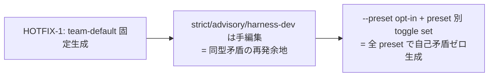

<!--
task-21 W2.4 frontmatter (機械可読、draft-flow-guard.sh / harness-audit が読む):
approval_required: true
approved_at:
approved_by:
retroactive: false
-->
---
slug: install-preset-auto-switch
title: install.sh consuming repo 用 preset 自動切替 (opt-in --preset arg + preset 別 toggle set)
created_at: 2026-07-05
status: 📝 未承認
related: install-immediately-usable-redesign-20260618 §4.1 対策 A / §5 P1-1 / §9.1 HOTFIX-1
---

# install.sh consuming repo 用 preset 自動切替 (P1-1 残 scope)

**ステータス:** 📝 **draft（2026-07-05 起案、user 承認待ち）**
**起点:** master roadmap [install-immediately-usable-redesign-20260618](./install-immediately-usable-redesign-20260618.md) §4.1 対策 A + §5 P1-1 (batch planning 経路 B)
**前提 (完了済、本 draft の実装 scope 外):**
- **HOTFIX-1 (PR #68、main merge 済)**: install.sh §6.4 (`install.sh:505-571`) が consuming repo に `harness-config.local.yml` を create-if-absent 生成 (`default_preset: team-default` + 8 toggle true = feature 4 + review_required 4)。self-install skip (`install.sh:526-527`) / dry-run 非生成 (`install.sh:522`) / 既存 verbatim 保持 (`install.sh:530-531`) / fail-open (`install.sh:566`) / mktemp X 末尾 (`install.sh:536`)
- **HOTFIX-2 (同 merge 済)**: `hc-config.sh --get/--summary` が local.yml tier 対応 (解決順 env > local > yml > default、`hc-config.sh:741` / `(local overridden)` marker `hc-config.sh:775,1165` / `local config:` 行 `hc-config.sh:1161`)
- smoke: `install-local-yml-smoke.sh` (7 case A-G) / `hc-config-local-yml-smoke.sh` (12 assert)

**関連 rule:**
- `.claude/rules/development-process.md` §「harness 取込チェックリスト」
- CommonRules.md § Design Constraints「enforcement は preset で明示制御 (task-70 Phase 2)」

---

## 1. 真因サマリ / 課題サマリ

HOTFIX-1 で「新規 consuming repo が guard 全 disabled で始まる」事故 (subscbase-api 2026-06-18) は防止済だが、P1-1 (roadmap §4.1 対策 A) の残 scope が 3 件ある:

| # | 課題 | 現状証拠 |
|---|---|---|
| **C1** | preset が team-default 固定で **opt-in 選択不可**。対策 A が明記する「opt-in で `--preset=harness-dev` を allow」未実装 | `install.sh:68-106` arg parse に `--preset` 無し、§6.4 heredoc (`install.sh:552-560`) は team-default 固定 |
| **C2** | **preset 別 toggle set が未定義**。strict / advisory / harness-dev を選びたい repo は local.yml 手編集となり、「preset 宣言 + toggle 不足」の同型矛盾を preset ごとに再発しうる (HOTFIX-1 review で team-default 宣言 + toggle 不足 = enforcement-mismatch-smoke Case 3 FAIL を実測)。**特に advisory は enforcement_matrix に advisory の `disabled_reason` が 0 件** (`harness-config.yml:478-534` 実測、8 guard 全て harness-dev のみ) のため、advisory 選択は現状構造的に Case 3 (`enforcement-mismatch-smoke.sh:160-190`) + Case 5 (同 `:220-245`) FAIL する | `harness-config.yml:484-485` 等 8 箇所 |
| **C3** | install summary (`install.sh:769-779`) の preset 案内が HOTFIX-1 の生成報告のみで、**preset の選択肢・変更方法・effective 状態の検証導線** (`hc-config.sh --summary`) が無い | `install.sh:774-775` |

**核心論点 (C0)**: roadmap §4.1 対策 A の原案「copied SSoT yml の `default_preset` 書換」は依然必要か? → **不要 (不採用)** と判断する。理由は §2 案 A 却下理由参照。**対策 B (HOTFIX-1) + 本 draft の `--preset` 拡張で対策 A の意図 (consuming repo が正しい preset で始まる + opt-in で他 preset 選択可) を完全に満たす** ため、P1-1 を「local.yml 生成の preset parameterize」として re-scope する。



**真因:** local.yml 生成内容が単一 preset hardcode であり、enforcement_matrix の presets 期待値 (`{advisory: false, team-default: true, strict: true, harness-dev: false}`、`harness-config.yml:483,490,497,504,511,518,525,532` で 8 guard 一様) と機械的に連動していない。

**副次:** install.sh の allowed preset set と `hc-config.sh` `_validate_default_preset` (`hc-config.sh:1216-1226`、4 値 set) の drift 余地。

---

## 2. 解決アプローチ比較

| 案 | 内容 | 工数 | メリット | デメリット |
|:---:|:---|---:|:---|:---|
| **A** | 対策 A 原案: copied SSoT yml の `default_preset` + toggle 8 件を sed 書換 | 0.5d | local.yml 不要 | **却下**: (1) `--update` の rsync は SSoT yml を毎回 source 値で上書きするため書換は次回 update で harness-dev に巻き戻る (RSYNC_EXCLUDES は local.yml のみ除外、`install.sh:221`)。(2) install.sh 自身の MIGRATE 案内 (`install.sh:183`)「SSoT yml の local 値は local.yml へ移せ」と自己矛盾。(3) I1 Config SSoT + Design Constraints (local.yml 経由 override) に反する |
| **B** | **`--preset=<name>` opt-in arg + preset 別 toggle set で local.yml 生成を parameterize + enforcement_matrix に advisory disabled_reason 追記 + summary 案内** | 1.0d | 全 preset で自己矛盾ゼロを smoke で機械保証。default 挙動 (team-default) 不変 = 後方互換。HOTFIX-1/2 資産を全て再利用 | advisory disabled_reason 8 行の SSoT yml 追記が必要 (影響は表示/検証補助のみ、§4.3) |
| **C** | roadmap 対策 C: `preset_table.<preset>.features.*` の preset block 構造化で `default_preset` 切替が toggle に自動連動 | 5d+ | R7 の根本解消 | **却下**: flat parser 制約 (`harness-config.yml:466-469` 注記) で nested block は config-loader が読めず parser 全面改修が必要。roadmap §8.3 が「Phase 4 (別 epic) で段階導入」と明記済 |
| **D** | 縮小版: `--preset` は team-default / strict のみ許可 (advisory / harness-dev reject) | 0.7d | matrix 追記不要 | **却下**: `hc-config.sh` `_validate_default_preset` の 4 値 set と非対称になり validation SSoT が分裂。対策 A が harness-dev opt-in を明記しており要件割れ。ただし advisory 採否が user 未決なら本案へ縮退可 (§「未決事項」) |

→ **案 B を推奨**。理由: HOTFIX-1 の「preset 宣言と toggle set の自己矛盾」教訓を構造化 (mapping 関数 + smoke 実走検証) し、対策 A の意図を SSoT 汚染なしで満たす唯一の案。

---

## 3. 採用案の詳細設計

### Task 計画 (採用 6 条準拠、Phase 中間階層廃止)

**Goal**: `bash install.sh <target> [--preset=<name>]` が 4 preset いずれでも「enforcement_matrix と自己矛盾しない local.yml」を生成し、不正値は reject、summary で preset 状態と検証導線を案内する。

#### Step 計画

| Step | Status | 作業概要 | 工数 | 依存 |
|:---:|:---:|:---|---:|:---|
| 1 | 🔲 | install.sh: `--preset=<name>` arg parse + validation + §6.4 生成 parameterize + summary 更新 | 2.5h | — |
| 2 | 🔲 | harness-config.yml: enforcement_matrix 8 guard に advisory `disabled_reason` 追記 | 0.5h | — |
| 3 | 🔲 | install-local-yml-smoke.sh: case H-M 追加 (preset 別生成 / reject / 既存保持 / set drift 静的検査) | 1.5h | Step 1, 2 |
| 4 | 🔲 | (テスト設計レビュー) reviewer 動的選定 `review_min_count_test ≤ N ≤ review_max_count_test` | 0.5h | Step 3 |
| 5 | 🔲 | (テスト合格) 新旧 smoke 全 PASS (install-local-yml 7+N case / enforcement-mismatch 5 case / hc-config-local-yml 12 assert) | 0.5h | Step 4 |
| 6 | 🔲 | (リファクタリング) 3 観点判定 or `skip: <reason>` | 0.3h | Step 5 |

合計: 5.8h (≒ 0.75 day、roadmap P1-1 見積 0.5 day + advisory matrix 追記分)

### Step 1 詳細 (install.sh)

#### 1a. arg parse (`install.sh:68-106` の for loop に case 追加)

```bash
PRESET="team-default"   # default = HOTFIX-1 現行挙動維持 (後方互換)
PRESET_EXPLICIT=false
# for loop 内:
    --preset=*)
      PRESET="${arg#--preset=}"
      # allowed set は hc-config.sh _validate_default_preset (L1216-1226) と同一 4 値。
      # drift は install-local-yml-smoke case M (静的比較) で機械検出。
      case "$PRESET" in
        advisory|team-default|strict|harness-dev) PRESET_EXPLICIT=true ;;
        *) echo "[install] error: invalid --preset '$PRESET' (must be one of: advisory, team-default, strict, harness-dev)" >&2
           exit 64 ;;
      esac
      ;;
```

- usage 行 (`install.sh:109`) と header comment (`install.sh:5,22-24` 周辺) に `--preset=<name>` を追記。**header 追記時は `-h` の `sed -n '2,48p'` (`install.sh:90`) の範囲を行数増加分ずらす** (task-79 と同じ注意点、`install.sh:87-89` comment 参照)

#### 1b. §6.4 生成の parameterize (`install.sh:539-561`)

toggle 値 mapping を関数化。enforcement_matrix の presets 行が 8 guard 一様 (`{advisory: false, team-default: true, strict: true, harness-dev: false}`) である事実に一致させる:

```bash
# preset → toggle 値 (enforcement_matrix presets 行と一致、乖離は smoke case I/J が実走検出)
_preset_toggle_value() {
  case "$1" in
    team-default|strict) echo "true" ;;
    advisory|harness-dev) echo "false" ;;
  esac
}
```

- 生成方式: **既存 quoted heredoc (`'LOCAL_YML_EOF'`) は comment header 部のみ維持**し、`default_preset: ${PRESET}` 行 + 8 toggle 行は `printf` で追記 (unquoted heredoc 化による展開事故を回避)
- advisory / harness-dev でも 8 toggle を **明示 false で書く** (R7 対称性 + SSoT 将来値変更に対する pin。`default_preset` 行だけの local.yml が guard 状態を保証しない事故の再発防止)
- 生成 echo (`install.sh:564`) を `harness-config.local.yml 生成 (default_preset: ${PRESET} + guard toggle 8 件 $(_preset_toggle_value "$PRESET"))` に変更
- **既存 local.yml + `--preset` 明示** (`$PRESET_EXPLICIT` true): 現行 NOTE (`install.sh:531`) に加え `WARN: --preset=$PRESET は無視 (既存 local.yml 保持。変更は \$EDITOR .claude/harness-config.local.yml)` を stderr 出力 (verbatim 保持は不変)
- **self-install + `--preset` 明示**: 既存 NOTE (`install.sh:527`) に「--preset は無視 (harness-dev dogfood 維持)」を追記
- **--dry-run + `--preset`**: 生成なし (現行 `install.sh:522` の `if ! $DRY_RUN` 維持)。dry-run 出力に `would generate local.yml (preset: $PRESET)` を echo

#### 1c. summary 案内 (`install.sh:769-779`)

Next steps 2 の HOTFIX-1 文言 (`install.sh:774-775`) を preset aware に更新:

```
(preset: ${PRESET} で local.yml 自動生成済。他 preset は install 時 --preset=<name>、
 生成後の変更は本 file を編集 → bash .claude/scripts/hc-config.sh --summary で effective 状態確認。
 advisory は PoC 用 = 主要 guard warn 化。通常運用は team-default を推奨)
```

### Step 2 詳細 (harness-config.yml)

#### スコープ
- 対象: `.claude/harness-config.yml:478-534` enforcement_matrix 8 guard の `disabled_reason:` map

#### 変更内容
各 guard の `disabled_reason:` に advisory 行を追記 (harness-dev 行と併存、per-preset map なので競合なし):

```yaml
    disabled_reason:
      harness-dev: "(既存文言、変更なし)"
      advisory: "advisory preset は個人実験 / PoC 用に warn 中心運用 (BLOCK 最小) とするため"
```

- 根拠: preset 説明 (`harness-config.yml:454`)「advisory: 個人実験 / PoC。BLOCK は最小、warn 中心」と整合。これが無いと `--preset=advisory` の consuming repo で Case 3 (UNDOCUMENTED mismatch) + Case 5 (disabled_reason 網羅) が FAIL する (`enforcement-mismatch-smoke.sh:176,234-236` の判定)
- 本 repo (preset=harness-dev) への影響: なし (Case 3/5 は現 preset の reason のみ参照。追記後も本 repo smoke 5 PASS 維持を Step 5 で確認)

### Step 3 詳細 (install-local-yml-smoke.sh 拡張)

既存 7 case (A-G、`install-local-yml-smoke.sh:92-221`) は無変更維持 (Case A が「--preset 無指定 default = team-default」の regression を兼ねる)。追加 case:

| case | 内容 | assert |
|---|---|---|
| H | `--preset=strict` 新規 install | `default_preset: strict` + 8 toggle true |
| I | `--preset=advisory` 新規 install | `default_preset: advisory` + 8 toggle false + **target で enforcement-mismatch-smoke 全 PASS** (Case G 同型、`install-local-yml-smoke.sh:190` 参照) |
| J | `--preset=harness-dev` 新規 install | `default_preset: harness-dev` + 8 toggle false + target mismatch smoke 全 PASS |
| K | `--preset=bogus` | exit 64 + local.yml 非生成 + `.claude/` 未配置 (arg parse 段で die) |
| L | 既存 local.yml + `--update --preset=strict` | byte 不変 (cmp) + stderr に WARN「--preset は無視」 |
| M | (静的) install.sh の allowed set == hc-config.sh `_validate_default_preset` の set | 両 file から 4 値を grep 抽出して sort 比較 |

### Step 4-6 詳細 (Task 最終 3 Steps、固定)

- **Step 4 (テスト設計レビュー)**: 起動前に `bash .claude/scripts/hc-config.sh --get review_max_count_test` で上限確認、`tdd-guide` / `test-automator` / `qa-expert` / `pr-test-analyzer` base + shell/install domain で動的選定、収束まで反復 (上限 `review_iteration_max`)
- **Step 5 (テスト合格)**: UI なし → unit/smoke で OK。`bash .claude/tests/install-local-yml-smoke.sh` (7+6 case) + `bash .claude/tests/enforcement-mismatch-smoke.sh` (5 case) + `bash .claude/tests/hc-config-local-yml-smoke.sh` (12 assert) 全 PASS
- **Step 6 (リファクタリング)**: 3 観点 (持続可能性 / 汎用性 / 非冗長化)。特に `_preset_toggle_value` と matrix presets 行の二重管理を非冗長化観点で再評価、不要なら `skip: <reason>` 記録

---

## 4. リスクと緩和

| リスク | 確率 | 影響 | 緩和 |
|---|:---:|:---:|---|
| enforcement_matrix presets 行が将来 guard 別に分岐 (一様でなくなる) と `_preset_toggle_value` の一様 mapping が乖離 | M | H | smoke case I/J が **target で mismatch smoke を実走** するため乖離は即 FAIL で機械検出。分岐時は生成 logic を matrix awk parse (`.claude/scripts/lib/enforcement-matrix-parse.sh` 再利用) へ昇格 |
| consuming repo が安易に advisory を選び guard 全 OFF で HOTFIX-1 以前の状態に自己回帰 | M | M | default は team-default 維持 (opt-in 明示のみ advisory 化) + summary に「advisory は PoC 用、通常は team-default」明記 + local.yml 生成 header comment にも同旨記載 |
| install.sh / hc-config.sh の allowed preset set drift | L | M | smoke case M (静的比較) + 両所 comment で相互参照 |
| heredoc の quoted → 変数展開混在による生成事故 | L | M | comment header は quoted heredoc 維持、値行のみ printf 分離 (§3 Step 1b) |
| `-h` help の sed 範囲ずれ (header 行数増) | L | L | Step 1a に範囲更新を明記 + case K で exit code 検証 |

---

## 5. 移行計画

- [ ] feature flag 不要 (opt-in arg のみ、`--preset` 無指定の default 挙動 = HOTFIX-1 現行と byte 互換 → install-local-yml-smoke Case A/B が regression 検証)
- [ ] 既存 consuming repo への影響なし (local.yml 既存 → 生成 skip 不変)
- [ ] dry-run で生成予定 preset の事前確認可
- [ ] 段階ロールアウト不要 (install.sh は user manual 実行のみ、cross-repo write 例外規範により agent 経路なし)

---

## 6. 完了条件（DoD）

- [ ] `bash install.sh <tmp> --preset=strict|advisory|harness-dev --no-mcp --no-docs` で local.yml が preset 別 toggle set で生成される (検証: `bash .claude/tests/install-local-yml-smoke.sh` case H/I/J PASS)
- [ ] 4 preset いずれの生成 local.yml 下でも target の `bash .claude/tests/enforcement-mismatch-smoke.sh` が **5 PASS, 0 FAIL** (自己矛盾ゼロ、case G/I/J で機械検証)
- [ ] `--preset=bogus` が exit 64 で reject される (検証: case K PASS)
- [ ] `--preset` 無指定の default 生成が HOTFIX-1 と同一内容 (検証: 既存 case A/B PASS 維持)
- [ ] 本 repo (harness-dev) の `bash .claude/tests/enforcement-mismatch-smoke.sh` が advisory disabled_reason 追記後も 5 PASS, 0 FAIL
- [ ] `bash .claude/tests/hc-config-local-yml-smoke.sh` 12 assert PASS 維持 (regression 0)
- [ ] install summary に preset 名 + 変更手順 + `hc-config.sh --summary` 検証導線が出力される (検証: `bash install.sh <tmp> --no-mcp --no-docs 2>&1 | grep -c "preset"` ≥ 2)

---

## 7. 工数見積

合計 5.8h (Step 1: 2.5h / Step 2: 0.5h / Step 3: 1.5h / Step 4: 0.5h / Step 5: 0.5h / Step 6: 0.3h)

---

## 8. レビューサイクル (workflow.md §「収束条件」準拠)

| iter | 日付 | reviewer (起動数) | CRITICAL | HIGH | MEDIUM | LOW | 修正 commit | 状態 |
|:---:|---|---|:---:|:---:|:---:|:---:|---|---|
| — | — | (未実施) | — | — | — | — | — | 起案直後 |

**収束判定**: CRITICAL = 0 ∧ HIGH = 0 ∧ MEDIUM = 0 (LOW は許容)

---

## 9. 承認履歴

| 日付 | 承認者 | 結果 |
|---|---|---|
| — | — | (承認待ち) |

> **/new-task 時の list.md 概要欄更新 (2026-07-05 review 反映)**: 承認後 `/new-task 85` 時に list.md #85 概要欄を残 scope 文言 (本 draft §1 の C1-C3) へ更新する (main 専任)。現行概要「feature toggle 4 件を team-default 値で書込し --preset opt-in を追加」は HOTFIX-1 完了済 scope + 件数 stale (実際は 8 件) のため、放置すると台帳↔実 scope 乖離が固定化する。
> 承認記入は先頭 HTML comment frontmatter の承認日 field (file 内 1 箇所) のみに行う (7 draft frontmatter 統一、2026-07-05 review 反映)。

### 未決事項 (user 判断要)

1. **対策 A 不採用の確定**: 本 draft は「copied SSoT yml の default_preset 書換 (対策 A 原案) は不採用、対策 B + `--preset` 拡張で P1-1 充足」と re-scope した (§1 C0 / §2 案 A)。roadmap §4.1 の対策 A 行はこの解釈で supersede してよいか
2. **advisory サポートの v1 採否**: `--preset=advisory` 対応は enforcement_matrix への advisory disabled_reason 8 行追記 (SSoT yml 変更) を伴う。見送るなら案 D (team-default / strict / harness-dev の 3 値) へ縮退可 (工数 -0.5h、ただし hc-config.sh の 4 値 set と非対称化)
3. **strict の追加強化**: matrix 上 strict と team-default の期待値は現状同一 (8 guard true)。strict 選択時に `review_required_security: true` (`harness-config.yml:443`、matrix 対象外 key) も生成に含めるか — 本 draft は保守的に**含めない** (matrix 非対象 key の生成は I7 triplet 原則から consumer/smoke 同時整備が必要になるため)

---

## 10. 関連

- master roadmap: [install-immediately-usable-redesign-20260618.md](./install-immediately-usable-redesign-20260618.md) §4.1 / §5 P1-1 / §9.1
- HOTFIX-1/2 実装: `install.sh:505-571` (§6.4) / `.claude/scripts/hc-config.sh:741,775,1161,1216-1226`
- 検証資産: `.claude/tests/install-local-yml-smoke.sh` / `.claude/tests/enforcement-mismatch-smoke.sh` / `.claude/tests/hc-config-local-yml-smoke.sh`
- 関連 draft: [install-sh-yml-customization-preserve.md](./install-sh-yml-customization-preserve.md) (SSoT yml へ local 値を書かない MIGRATE 規範)
- 関連 memory: `feedback_config_value_needs_consumer_and_smoke` (I7 triplet) / `feedback_design_external_dependency_verification` (外部依存の起案時存在確認 — 本 draft は全引用 path/行番号を実測済)
