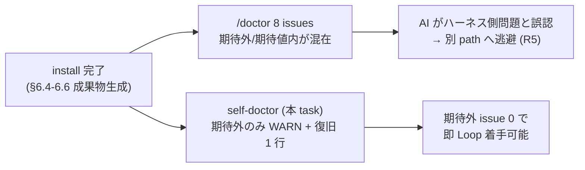

<!--
task-21 W2.4 frontmatter (機械可読、draft-flow-guard.sh / harness-audit が読む):
approval_required: true
approved_at:
approved_by:
retroactive: false
-->

# install.sh 末尾 self-doctor (install 直後の setup issue 0 化検証、P1-3)

**ステータス:** 📝 **draft（2026-07-05 起案、user 承認待ち）**
**起点:** master roadmap [install-immediately-usable-redesign-20260618.md](install-immediately-usable-redesign-20260618.md) §4.5 (R5: install 直後の `/doctor` 8 setup issues) + §5 P1-3。subscbase-api 2026-06-18 実機事案で statusline に `8 setup issues: settings, MCP · /doctor` が常時表示され、AI が「ハーネス側問題あり」と誤認識して別 path (Workflow / ultracode) へ逃げた (roadmap §1.2 R5)。
**前提 (依存タスク、list.md L242-243):**
- **task-85 (P1-1)** 📝: install.sh consuming repo 用 preset 自動切替 — self-doctor の D1/D6 check は preset bootstrap の成果物を検証する
- **task-86 (P1-2)** 📝: hc-config.sh --get/--summary の local.yml 統合 — self-doctor の D6 check は `--summary` の effective 値表示を信頼できることが前提
- **HOTFIX 済事実 (PR #68、main merge 済、上記 2 task の minimal subset)**: install.sh §6.4 が harness-config.local.yml を create-if-absent 生成 (`install.sh` L505-571、team-default + 8 toggle true、self-install skip L526-527 / dry-run 非生成 L522 / fail-open L563-568)。hc-config.sh --get/--summary は local.yml tier 対応済 (`hc-config.sh` L1160-1162 `local config:` 行 + L1166/L1184 `(local overridden)` marker)。smoke: `install-local-yml-smoke.sh` (Case A-G 7 件) / `hc-config-local-yml-smoke.sh` (12 件)。**本 draft はこの HOTFIX 済 scope を再実装しない** — self-doctor はこれら成果物の「事後検証層」として residual scope に絞る
- **fresh install は settings.json 非配布 (task-71 H2 設計、2026-07-05 review 反映)**: default 新規 install は rsync exclude (`install.sh:218` `--exclude=settings.json`) により `.claude/settings.json` を target に配布しない。§6.3 自動再生成も update/force/overwrite-all mode 限定 (`install.sh:486`) かつ既存 settings.json 前提 (`install.sh:493-494` NOTE「新規は手動生成要」)。さらに `generate-settings.sh` は live settings 不在で **初期化段 die** (`generate-settings.sh:40` `[ -f "$LIVE_SETTINGS" ] || die`) するため、fresh repo では `--check` / `--out` とも実行不能。seed copy は `docs/tasks/next-actions.md` entry #78 (L138、stash WIP、**未 merge**) が担う予定 — D2 の 3 分岐設計 (§3.1) はこの事実に基づく

**関連 fixture / rule (存在確認済、行番号付):**
- `install.sh` — §6.3 generate-settings 自動再生成 subshell pattern (L486-503)、§6.4 local.yml bootstrap (L505-571)、§6.5 harness_version stamp (L573-609)、§6.6 harness_npm_version stamp (L611-661)、chmod exec bit (L458-463)、§7 config-loader 検証 (L742-753)、§8 summary heredoc (L755-824)
- `.claude/scripts/generate-settings.sh` — `--check` mode (L134-156、DRIFT 検出で return 1 L155 / check target invalid JSON は die L144、jq 必須 die L38、**live settings.json 不在は初期化段 die L40 = fresh repo では --check dispatch に到達不能**)
- `docs/tasks/next-actions.md` — entry #78 (L138、install.sh §6.3 settings seed copy の stash WIP、未 merge。D2 分岐 (a) の WARN 昇格 trigger)
- [`install-preset-auto-switch.md`](install-preset-auto-switch.md) (#85 draft) — §3 Step 1b `_preset_toggle_value` (advisory / harness-dev は 8 toggle **明示 false** 生成) + Step 2 advisory disabled_reason 追記 + 未決事項 2 (advisory v1 採否)。D6 の preset-aware 分岐 (§3.1 note) が連動
- `.claude/harness-config.yml` — enforcement_matrix presets 行 (L483/490/497/504/511/518/525/532、8 guard 一様 `{advisory: false, team-default: true, strict: true, harness-dev: false}`) — D6 二次 heuristic の preset 集合の根拠
- `.claude/scripts/hc-config.sh` — `cmd_summary` (L1142-1214、`totals: N enabled, M disabled` L1210、UNDOCUMENTED mismatch で非 0 exit L1213)、`LOCAL_CONFIG_PATH` 解決 (L2332-2334、env override `HC_LOCAL_CONFIG_PATH` L730)
- `.mcp.json` — env 前提 `${GITHUB_PAT}` (L7) / `${SALESFORCE_*}` (L14-18) / `${ASANA_PAT}` (L29) / `${SLACK_MCP_*}` (L36-37)
- `.claude/hooks/check-required-env.sh` — severity 3 段 (error/warn/info) の既存 vocabulary (本 draft の WARN/INFO 分類が踏襲)
- `.claude/harness-config.yml` — `required_env: []` (L210)、feature toggle 群 (L365-388、命名規約 `feature_<name>_enabled`)

---

## 1. 真因サマリ / 課題サマリ

install 直後の consuming repo で Claude Code の `/doctor` が 8 setup issues を報告し (subscbase-api 実機: (a) settings.local.json 重複定義 ASANA_PAT 2 回 (b) MCP 未設定 env (c) permissions stale entry 等)、「install 直後すぐ使える」の DoD と矛盾する。issue には **期待外** (install.sh が保証すべき成果物の欠落 = 本当の不具合) と **期待値内** (secret env 未設定等、user しか埋められない値) が混在しており、区別なく提示されると AI / user 双方が「ハーネスが壊れている」と誤認する。



**真因:** install.sh は §6.3-6.6 で成果物 (settings.json 配線 / local.yml / version stamp) を生成するが、**生成結果を横断検証する層が無い**。各 § は個別 fail-open (WARN + 継続) のため、部分失敗が install 末尾で集約されず、user は `/doctor` の混在 issue 一覧で初めて気付く。

**副次:** roadmap §4.5 の「`/doctor` も期待値内を grayout」は Claude Code 本体の機能であり harness 側から制御不能。self-doctor は harness 責務範囲の **proxy 検証** に位置付ける (built-in `/doctor` の完全再現はしない)。

---

## 2. 解決アプローチ比較

| 案 | 内容 | 工数 | メリット | デメリット |
|:---:|:---|---:|:---|:---|
| **A** | install.sh 内 inline 関数 (`run_self_doctor()`) | 0.3 day | file 1 つで完結 | install.sh 824 行が更に肥大 / **consuming repo で再実行不可** / 単体 smoke 不能 |
| **B** | **`.claude/scripts/self-doctor.sh` 独立 script + install.sh 末尾から呼出** | 0.5 day | rsync で consuming repo に配布され**随時再実行可能** (`bash .claude/scripts/self-doctor.sh`) / generate-settings.sh と同じ資産 pattern (L26-29 resolve_project_root) / 単体 smoke 可能 / install.sh 側は呼出 ~15 行のみ | file +1 (許容: 既存 scripts/ 資産 pattern に一致) |
| **C** | SessionStart hook 化 (毎 session doctor) | 0.7 day | 常時監視 | SessionStart 注入は task-21 で削減した attention dilution を再導入 / staleness は `stale-harness-detect.sh` が既にカバー / install 直後検証は 1 回で十分 |

→ **案 B** を採用。理由: 「install 直後 1 回 + consuming repo で随時再実行」の両立は独立 script のみ可能。SSoT を script に置けば install.sh / 手動実行 / smoke の 3 経路が同一判定を共有する (I1 Config SSoT 整合)。案 C は将来 opt-in (§4 リスク表参照) として却下、案 A は再実行不可で却下。

---

## 3. 採用案の詳細設計

### 3.1 check 項目 (D1-D8) と WARN / INFO 分類

**分類原則**: 「install.sh の責務内で生成済のはずの成果物の欠落 / 破損」= **WARN (期待外)** / 「user しか埋められない値・user 手動 step 未了」= **INFO (期待値内、absorb)**。check-required-env.sh の severity 3 段 vocabulary (error/warn/info) と整合させ、self-doctor は warn/info の 2 段を使う。

| # | check | 検証方法 (実装 primitive) | 期待外 (WARN) 条件 | 復旧 1 行コマンド |
|---|---|---|---|---|
| **D1** | harness-config.local.yml 生成済 | `[[ -f .claude/harness-config.local.yml ]]` | 不在 (ただし preset=harness-dev の self-install は INFO 降格 — dogfood は local.yml 無しが正) | `bash <harness>/install.sh . --update` 再実行 |
| **D2** | settings.json dispatcher 配線 (**3 分岐**) | 前段 gate `[[ -f .claude/settings.json ]]` → 存在時のみ `bash .claude/scripts/generate-settings.sh --check` (L134-156)。**gate 必須**: generate-settings.sh は live settings 不在で初期化段 die (L40) するため、不在のまま呼ぶと `--check` dispatch 前に exit 1 し分岐 (b) と区別不能 | **(a) 不在 = INFO** (期待値内: fresh install は rsync exclude `install.sh:218` で非配布、task-71 H2 設計。案内: update 経路 §6.3 or entry #78 seed 導入後に配線) / **(b) 存在 ∧ jq 有 ∧ `--check` DRIFT (return 1) or invalid JSON = WARN** / **(c) jq 不在 = INFO** (検証不能を正直に報告) | (b) のみ `bash .claude/scripts/generate-settings.sh --out .claude/settings.json` (settings.json 存在時は L40 die 非該当で有効)。(a) は復旧コマンド対象外 (INFO 案内のみ) |
| **D3** | harness_version stamp | `grep -qE '^harness_version:' .claude/harness-config.yml` (§6.5 L585 と同 regex) | 0 hit | `bash <harness>/install.sh . --update` |
| **D4** | harness_npm_version stamp | `grep -qE '^harness_npm_version:'` (§6.6 L638 と同 regex) | — (常に INFO。§6.6 は package.json 不在で正当に skip する fail-safe L657-658 のため WARN 化しない) | `npx @takuma-hirai/hirai-method@latest update .` |
| **D5** | hooks / scripts 実行 bit | `find .claude/hooks -maxdepth 2 -name '*.sh' ! -perm -u+x` (scripts/ も同様、§6 chmod L461-462 と対象一致) | 1 件以上 hit (staging mv での bit 落ち実績: memory feedback_subagent_staging_mv_exec_bit_loss) | `find .claude/hooks .claude/scripts -name '*.sh' -exec chmod +x {} +` |
| **D6** | guard effective state (**preset-aware**) | `bash .claude/scripts/hc-config.sh --summary` の exit code (L1213) + `totals:` 行 (L1210) + effective preset parse | **一次**: exit != 0 (UNDOCUMENTED mismatch — matrix 期待値照合は --summary へ完全委譲) = WARN / **二次 heuristic**: **preset ∈ {team-default, strict} ∧ enabled == 0 のみ** WARN (subscbase-api 型全滅。matrix presets 行 L483-532 は両 preset で 8 guard true 期待のため enabled 0 は期待外)。**advisory / harness-dev の enabled == 0 は INFO** (matrix 期待どおりの正当状態、下記 note)。4 値外 preset は一次判定へ委譲 | `$EDITOR .claude/harness-config.local.yml` (現 preset の matrix 期待値に合わせ toggle 確認) |
| **D7** | .mcp.json env 前提 | `grep -oE '\$\{[A-Z_]+\}' .mcp.json` で参照 env 抽出 → 未設定を列挙 | — (常に INFO。secret は install が設定できない期待値内 issue の代表) | `export ASANA_PAT=...` 等の案内のみ (severity は将来 `required_env` L210 連携で昇格可) |
| **D8** | settings.local.json 健全性 | 存在時のみ: `jq empty` (invalid JSON 検出) + `grep -oE '"[A-Z_]+"[[:space:]]*:' \| sort \| uniq -d` (重複 key heuristic) | invalid JSON or 重複 key 検出 (subscbase-api ASANA_PAT 2 回事案)。**file 不在は check skip (正常)** | 該当 key を手動 dedupe (`$EDITOR .claude/settings.local.json`) |

> **D6 × #85 連動 note (2026-07-05 review 反映)**: D6 二次 heuristic の WARN 対象は enforcement_matrix presets 行 (`harness-config.yml:483,490,497,504,511,518,525,532`、8 guard 一様 `{advisory: false, team-default: true, strict: true, harness-dev: false}`) の「true 期待 preset」集合 **{team-default, strict} に限定**する。advisory / harness-dev の enabled == 0 は [#85 install-preset-auto-switch](install-preset-auto-switch.md) §3 Step 1b (`_preset_toggle_value` が advisory/harness-dev に 8 toggle **明示 false** 生成) の正当な帰結のため heuristic では WARN しない。advisory 型 local.yml で一次判定 (--summary exit) が #85 Step 2 (advisory disabled_reason 追記) merge **前**に UNDOCUMENTED mismatch WARN を出すのは matrix 側の documented 化で解消すべき実 mismatch であり D6 の誤報ではない。#85 未決事項 2 (advisory v1 採否) が案 D 縮退でも手編集 local.yml で advisory は出現しうるため、本分岐は #85 採否に非依存で安全 (§4 リスク表 / 未決事項 4 参照)。

### 3.2 出力 format (第一原理 v2 §2.3 BLOCK 教育 3 点提示に整合)

期待外 (WARN) のみ詳細提示、期待値内 (INFO) は件数 + `--verbose` で展開:

```
[self-doctor] WARN D2: settings.json が dispatcher manifest と drift
  why: generate-settings.sh --check が DRIFT を検出 (配線が manifest 由来生成結果と不一致)
  fix: bash .claude/scripts/generate-settings.sh --out .claude/settings.json
  silence: HC_FEATURE_SELF_DOCTOR_ENABLED=false (install 時は --no-doctor)
[self-doctor] INFO 3 件 (期待値内、absorb): D4 npm stamp / D7 env 2 件 (ASANA_PAT, SLACK_MCP_XOXP_TOKEN)
[self-doctor] result: WARN 1 / INFO 3 — 期待外 issue 1 件 (fix 後に再実行: bash .claude/scripts/self-doctor.sh)
```

### 3.3 exit code 方針 (fail-open 2 層)

| 層 | 挙動 |
|---|---|
| `self-doctor.sh` 単体 | WARN ≥ 1 → exit 1 (smoke / CI から検出可能に。hc-config.sh cmd_summary L1213 と同 pattern) / INFO のみ → exit 0 |
| install.sh 呼出側 | `( cd "$TARGET" && HC_PROJECT_ROOT="$TARGET" bash .claude/scripts/self-doctor.sh ) \|\| true` で **install は常に exit 0** (報告のみ)。script 不在 / crash も WARN + 継続 (§6.3 L486-503 と同 subshell + fail-open pattern) |

### 3.4 install.sh 統合 (呼出 ~15 行)

- 挿入位置: **§7 config-loader 検証 (L742-753) の直後、§8 summary (L755) の前** に §7.5 として追加。§6.3-6.6 の全成果物生成後に検証する順序を保証
- `--no-doctor` flag を arg parse (L82-85 の flag 群) に追加 + dry-run では skip (mutation なしだが検証対象が未生成のため)
- §8 summary heredoc (L758-824) の Next steps に `bash .claude/scripts/self-doctor.sh` 再実行案内を 1 行追記

### 3.5 feature toggle (I7 triplet: 定義 + consumer + smoke を同 task で)

- yml: `feature_self_doctor_enabled: true` を L365-388 の toggle 群に追加 (命名規約準拠、comment で対象 script 明示)
- consumer: self-doctor.sh 冒頭で config-loader.sh 経由 `is_feature_enabled self_doctor` check → false なら no-op exit 0。env override `HC_FEATURE_SELF_DOCTOR_ENABLED`
- smoke: toggle false で no-op を検証する case を新規 smoke に含める (§3.6 Case H)

### 3.6 Task 計画 (採用 6 条準拠)

**Goal**: install 直後および consuming repo での随時再実行で、期待外 setup issue のみを 3 点提示 format で検出・報告する self-doctor が動作し、dummy repo 新規 install 直後に WARN 0 が成立する。

| Step | Status | 作業概要 | 工数 | 依存 |
|:---:|:---:|:---|---:|:---|
| 1 | 🔲 | `.claude/scripts/self-doctor.sh` 新設 (D1-D8 check + WARN/INFO 分類 + 3 点提示 format + exit code §3.3)。完了条件: `bash .claude/scripts/self-doctor.sh --help` が usage 表示 + tmp dir install 済 target で WARN 0 exit 0 | 0.4d | — |
| 2 | 🔲 | install.sh §7.5 呼出統合 (`--no-doctor` flag + fail-open + dry-run skip) + §8 summary 案内 1 行。完了条件: `bash install.sh <tmp> --dry-run` で self-doctor 非実行、実 install で `[self-doctor] result:` 行出力 + exit 0 | 0.2d | Step 1 |
| 3 | 🔲 | feature toggle 3 点 set (§3.5) + 新規 smoke `self-doctor-smoke.sh` (Case A: clean install で WARN 0 — **D2 は分岐 (a) INFO** / B: local.yml 削除で D1 WARN / C: exec bit 落しで D5 WARN / D: settings.local.json 重複 key で D8 WARN / E: env 未設定は INFO のみ exit 0 / F: --no-doctor で非実行 / G: script 不在でも install exit 0 / H: toggle false で no-op / I: local.yml を `default_preset: harness-dev` + 8 toggle false に置換で **D6 WARN なし** — 二次 heuristic 非発火 + matrix harness-dev disabled_reason 既存で一次判定も exit 0、advisory 同型 case は #85 Step 2 merge 後に追加 / J: manifest 乖離 settings.json 配置 (`{"hooks":{}}` 等 valid JSON) で **D2 分岐 (b) WARN** + exit 1)。完了条件: `bash .claude/tests/self-doctor-smoke.sh` 10/10 PASS | 0.5d | Step 2 |
| 4 | 🔲 | (テスト設計レビュー) reviewer を `review_min_count_test`〜`review_max_count_test` 範囲で動的選定 (`hc-config.sh --get review_max_count_test` で上限確認)、収束まで反復 (上限 `review_iteration_max`) | 0.3d | Step 3 |
| 5 | 🔲 | (テスト合格) 新 smoke 10/10 + 既存 install 系 smoke regression 0 (`install-local-yml-smoke.sh` 7 件 / `install-sh-regen-settings-smoke.sh` / `install-sh-sync-drift-smoke.sh` / `install-sh-overwrite-all-smoke.sh` / `hc-config-local-yml-smoke.sh` 12 件)。UI 無し task のため E2E/visual 対象外 | 0.2d | Step 4 |
| 6 | 🔲 | (リファクタリング) 3 観点 (持続可能性 / 汎用性 / 非冗長化 — 特に D2/D6 の既存 script 委譲徹底で判定 logic 重複 0 確認)、不要なら `skip: <reason>` 明示 | 0.1d | Step 5 |

合計: 1.7 day (roadmap P1-3 見積 0.5 day は script 本体のみの粗見積、テスト 3 段を含む実質は本値)

---

## 4. リスクと緩和

| リスク | 確率 | 影響 | 緩和 |
|---|:---:|:---:|---|
| built-in `/doctor` と self-doctor の判定基準乖離 (Claude Code version 依存の issue を検出不能) | H | M | self-doctor を「harness 責務範囲の proxy 検証」と明示位置付け。DoD の `/doctor` 0 issue 化は Phase 1 統合 DoD (roadmap §5) の手動確認項目に残す。claude CLI 依存は install.sh に持ち込まない |
| D8 重複 key heuristic の過検知 (JSON 文字列値内の `"KEY":` 様 pattern) | M | L | 過検知許容 (UI 変更検出基準と同方針)。WARN 文言に「heuristic 検出、手動確認要」を明記。false positive 報告あれば jq ベース精緻化を follow-up |
| task-85 ([#85 install-preset-auto-switch](install-preset-auto-switch.md)) が §6.4 を `--preset=<name>` 対応へ拡張した際の D1/D6 期待値 drift | M | M | D1 は「local.yml 存在」のみ検証 (内容非依存)。D6 の matrix 期待値照合は hc-config.sh --summary へ完全委譲 (一次判定 = SSoT 維持)、self-doctor 独自の二次 heuristic は **preset ∈ {team-default, strict} に限定** (§3.1 note) し、#85 §3 Step 1b の advisory/harness-dev 明示 false 生成と衝突しない。二次 heuristic の preset 集合が matrix presets 行 (L483-532) と drift しないかは #85 smoke case M 同型の静的比較を Step 3 レビューで検討 |
| entry #78 (settings seed copy WIP、next-actions.md L138) merge 後、fresh install にも settings.json が存在し D2 分岐 (a) が消滅 | M | L | D2 は「存在有無」の実測分岐のため seed 導入後は自動的に分岐 (b) 判定へ移行 (期待値 hardcode なし)。Case A は seed 導入後も drift なしなら WARN 0 のまま不変 |
| install.sh 肥大 (824 行 →) | L | L | 呼出 ~15 行のみに抑制、判定 logic は全て script 側 (案 B の効能) |
| self-doctor 自体の bug で install 阻害 | L | H | §3.3 の 2 層 fail-open (`\|\| true` + script 内 subshell 局所化、file-top `set -e` 禁止規範遵守) |

---

## 5. 移行計画

- [ ] Step 1-3 実装 (feature toggle default true、既存 repo への影響は --update 時の新 file 配布のみ)
- [ ] tmp dir dummy repo で実 install 検証 (§6 DoD コマンド)
- [ ] 既存 4 consuming repo へは通常の `install.sh --update` 経路で配布 (user manual、cross-repo 制約)
- [ ] 過検知報告の監視 → D8 heuristic 精緻化判断 (follow-up)

---

## 6. 完了条件（DoD）

- [ ] **dummy repo 新規 install 直後に WARN 0**: `T=$(mktemp -d) && bash install.sh "$T" && (cd "$T" && bash .claude/scripts/self-doctor.sh); echo "exit=$?"` → `[self-doctor] result: WARN 0` + `exit=0` (D2 は settings.json 非配布のため分岐 (a) INFO 側、WARN に数えない)
- [ ] **期待外 issue の検出能力**: 上記 target で `rm "$T/.claude/harness-config.local.yml"` 後の再実行が `WARN D1` + exit 1
- [ ] **D2 分岐 (b) 検出**: target に manifest 乖離 settings.json (`{"hooks":{}}`) を配置した再実行が `WARN D2` + exit 1 (検証: Case J PASS)
- [ ] **D6 preset-aware**: target の local.yml を `default_preset: harness-dev` + 8 toggle false に置換した再実行で D6 WARN なし (検証: Case I PASS — 二次 heuristic 非発火)
- [ ] **install fail-open**: self-doctor が WARN を出しても `bash install.sh "$T" --update; echo $?` → `0`
- [ ] **新規 smoke 10/10 PASS**: `bash .claude/tests/self-doctor-smoke.sh` → `PASS 10 / FAIL 0`
- [ ] **既存 smoke regression 0**: `bash .claude/tests/install-local-yml-smoke.sh && bash .claude/tests/hc-config-local-yml-smoke.sh && bash .claude/tests/install-sh-regen-settings-smoke.sh` 全 PASS
- [ ] **3 点提示 format**: WARN 出力に `why:` / `fix:` / `silence:` の 3 行が全 WARN 種で存在 (`bash .claude/scripts/self-doctor.sh 2>&1 | grep -c 'fix:'` ≥ WARN 数)
- [ ] **toggle no-op**: `HC_FEATURE_SELF_DOCTOR_ENABLED=false bash .claude/scripts/self-doctor.sh; echo $?` → 出力なし + `0`

---

## 7. 工数見積

合計 **1.7 day** (Step 1: 0.4 / Step 2: 0.2 / Step 3: 0.5 / Step 4: 0.3 / Step 5: 0.2 / Step 6: 0.1)。roadmap P1-3 公称 0.5 day との差はテスト 3 段 (採用 6 条 4) と smoke 10 case を含むため。

---

## 8. レビューサイクル (workflow.md §「収束条件」準拠)

> draft レビューは reviewer 最低 3 体以上並列起動 + CRITICAL/HIGH/MEDIUM = 0 まで反復 (LOW 許容、上限 `review_iteration_max`)。

| iter | 日付 | reviewer (起動数) | CRITICAL | HIGH | MEDIUM | LOW | 修正 commit | 状態 |
|:---:|---|---|:---:|:---:|:---:|:---:|---|---|
| 1 | 2026-07-05 | cross-draft 整合 review (subagent fan-out) | 0 | 2 | 0 | 0 | (main commit 待ち) | HIGH 2 反映済 (D6 preset-aware 化 / D2 3 分岐化) |

---

## 9. 承認履歴

| 日付 | 承認者 | 結果 |
|---|---|---|
| — | — | (承認待ち。承認後 `/new-task 87 install-self-doctor` で list.md L244 の 📝 → 🔲 update) |

> 承認記入は先頭 HTML comment frontmatter の承認日 field (file 内 1 箇所) のみに行う (7 draft frontmatter 統一、2026-07-05 review 反映)。承認依頼時に「Phase 1 実質 total ≈ 2.5-3 day (クリティカルパス P1-1 0.75d → P1-3 1.6d ≈ 2.35d)」の前提更新を明示する。

---

## 10. 関連

- master roadmap: [install-immediately-usable-redesign-20260618.md](install-immediately-usable-redesign-20260618.md) §1.2 R5 / §4.5 / §5 P1-3 / §7.2 DAG (P1-3 は P1-1 + P1-2 後)。**roadmap §7.2 DAG の P1-4→P1-3 辺は §7.1 本文 (P1-3 は P1-1+P1-2 後のみ) 準拠で読む** (§7.1↔§7.2 表記揺れの承認時注記、2026-07-05 review 反映)
- 依存 task: #85 (P1-1、list.md L242) / #86 (P1-2、list.md L243)
- 相互参照 draft: [install-preset-auto-switch.md](install-preset-auto-switch.md) (#85) — D6 二次 heuristic の preset 集合 (§3.1 note) は #85 §3 Step 1b の明示 false 生成 + 未決事項 2 (advisory v1 採否) と連動、裁定時に本 draft 未決事項 4 も同時確定
- settings seed copy WIP: `docs/tasks/next-actions.md` entry #78 (L138) — merge 後 D2 分岐 (a) は存在分岐により自動的に分岐 (b) 判定へ移行 (§4 リスク表)
- HOTFIX 済実装: install.sh §6.4 (L505-571) / hc-config.sh HOTFIX-2 (L1157-1214) — PR #68
- 委譲先既存資産: `generate-settings.sh --check` (L134-156) / `hc-config.sh --summary` (L1142-1214) / `check-required-env.sh` (severity vocabulary)
- 関連 rule: `.claude/rules/development-process.md` §「cross-repo write 例外」(配布は user manual) / CommonRules.md §Design Constraints (feature toggle 3 点 set / fail-open 統一)

---

## 未決事項 (user 判断要)

1. **built-in `/doctor` 照合を DoD に含めるか**: self-doctor は proxy 検証であり、Claude Code 本体 `/doctor` の 0 issue 化は claude CLI 実行が必要。推奨: Phase 1 統合 DoD の手動確認項目に留め、install.sh には claude CLI 依存を持ち込まない
2. **将来の SessionStart opt-in 配線 (案 C の部分採用)**: 毎 session doctor は attention dilution 再導入のため今回却下したが、`feature_self_doctor_on_session_start: false` (default OFF) の opt-in key を将来追加するか
3. **D7 の severity 昇格経路**: `required_env` (harness-config.yml L210) に project が entry を書いた場合、self-doctor D7 も error 昇格させるか (check-required-env.sh との二重報告になるため、推奨: self-doctor は INFO 固定で check-required-env に委譲)
4. **D6 二次 heuristic と #85 未決事項 2 の連動確定**: 本 draft は「preset ∈ {team-default, strict} ∧ enabled == 0 のみ WARN、advisory / harness-dev は INFO」を採用 (matrix presets 行 L483-532 準拠、§3.1 note)。#85 が案 D (advisory 不採用) へ縮退しても手編集 local.yml で advisory は出現しうるため本分岐は #85 採否に非依存で不変 — #85 未決事項 2 の裁定時に本節も同時確定する (推奨: 現分岐のまま確定)
5. **工数縮退 fallback**: Phase 1 クリティカルパス超過 (本 task 1.7 day > roadmap P1-3 公称 0.5 day) が問題になる場合、Step 3 の smoke 8 case → 最小 5 case へ縮退する fallback を許容するか (2026-07-05 review 反映)
