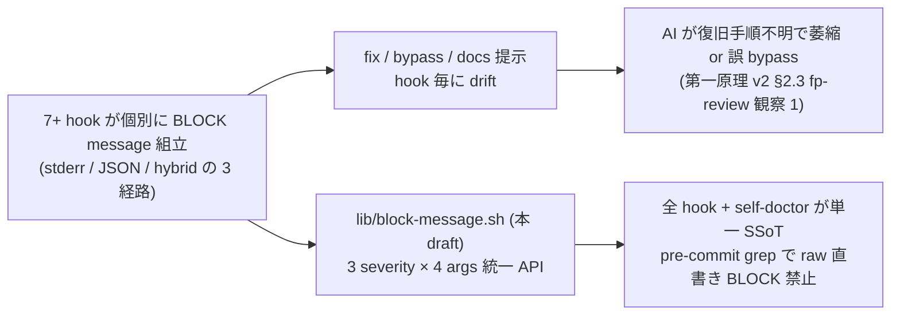

<!--
task-21 W2.4 frontmatter (機械可読、draft-flow-guard.sh / harness-audit が読む):
approval_required: true
approved_at:
approved_by:
retroactive: false
-->
---
slug: lib-block-message-4args
title: BLOCK message 4 引数統一 lib/block-message.sh (P2-3/I6/W1-12)
created_at: 2026-07-06
status: 📝 未承認
related: install-immediately-usable-redesign-20260618 §5 P2-3 / §11.3 R1 / §11.2 3 点提示 / §11.3 R2 (fast smoke) / §11.3 R5 (Phase 2 起案 checklist) / §11.3 R6 (DAG)
---

# BLOCK message 4 引数統一 lib/block-message.sh (P2-3/I6/W1-12)

**ステータス:** 📝 **draft（2026-07-06 起案、user 承認待ち）**
**起点:** master roadmap [install-immediately-usable-redesign-20260618.md](install-immediately-usable-redesign-20260618.md) §5 P2-3 (I6 Education) + §11.3 R1 (Wave 4 self-doctor 3 点提示との vocabulary 統合、承認済 2026-07-06)。第一原理 v2 §2.3「BLOCK 教育 3 点提示」が honor system のみで、既存 hook 群の BLOCK 出力は **2 pattern に分裂** (stderr + exit 2 系 / JSON stdout + exit 0 系) しており復旧手順 / bypass env 未提示率が高い。

**前提 (依存 / 契約 consumer):**
- **task-92 (P2-1) 📝 pre-commit 配布** — `.githooks/pre-commit` の grep policy layer に「BLOCK exit 2 path が lib 経由か」の regex 検証を追加する consumer 側 (本 draft §4.4)。P2-3 の enforcement は task-92 完了後に有効化 (task-92 未 merge の間は grep 検査 skip で fail-open、本 draft §5 リスク表)
- **task-87 (P1-3) self-doctor.sh — SSoT 三重不整合 (2026-07-06 実測)**:
  - **branch `docs/phase2-drafts` (HEAD `c61402f`) 上の実 file 状態**: `.claude/scripts/self-doctor.sh` **不在** (`ls .claude/scripts/self-doctor.sh` → No such file)。task-87 実装 commit (`a7c0287` — addendum §11.1 で言及) は本 branch HEAD の ancestor **ではない**
  - **`docs/tasks/list.md` L244 の記載**: task-87 status = 🔲 (未着手)
  - **addendum §11.1 table (`install-immediately-usable-redesign-20260618.md` L382)**: task-87 = PR #73 として **merged** と記載
  - **本 SSoT 三重不整合の SSoT 選定**: 実 branch 上の file state (= 不在) を **hard evidence** として採用し、addendum §11.1 の「merged」記載を advisory (別 branch or 未 rebase) 扱いにする。本 draft の Step 3 (self-doctor migration) は **task-87 の `docs/phase2-drafts` branch への reflect (`.claude/scripts/self-doctor.sh` の commit 化 or cherry-pick from PR #73 branch) を hard dependency** とし、reflect 前は Step 3 のみ **defer** (Step 1/2/4-8 は task-87 独立で並行実装可、下記 Step 依存欄)。
  - **本 dep drift の handling 運用選択** (main agent が §5 リスク表と併せて着手前判断):
    - (a) `/start-task 94` 前に task-87 を先行完遂し `.claude/scripts/self-doctor.sh` を本 branch に取り込む
    - (b) task-87 PR #73 branch から cherry-pick で `.claude/scripts/self-doctor.sh` を先行導入 (task-87 status は 🔲 のまま)
    - (c) Step 3 を defer のまま task-94 を Step 1/2/4-8 のみで着手 (task-87 reflect 後に Step 3 追加着手)
  - 上記 3 案の user 判断は本 draft §承認履歴 §未決事項 3 と統合
  - **migration 内容 (task-87 reflect 完了後)**: `.claude/scripts/self-doctor.sh` の 3 点提示 (WARN 5 args = `d_id / title / why / fix / silence` / INFO 2 args = `d_id / detail`) が本 lib の initial caller として migration される (§4.3)
- **完了済**: task-70 Phase 2 (harness-dev preset + `enforcement_matrix.disabled_reason`)、task-85 (advisory disabled_reason 追記、preset 4 値)

**関連 fixture / rule (存在確認済、行番号付):**
- `.claude/hooks/gateguard.sh:91` `emit_block() { jq -n --arg r "$1" '{decision:"block", reason:$r}'; }` (JSON stdout pattern SSoT 候補)
- `.claude/hooks/gateguard.sh:128,162,203` caller (Edit / Write / Bash gate、msg 組立 → `emit_block "$msg"`)
- `.claude/hooks/confidence-gate.sh:60,81,83,133` 同一 pattern の emit_block() + `build_below_threshold_reason` / `build_no_match_reason` (`.claude/hooks/lib/confidence-gate/messages.sh` 済分割)
- `.claude/hooks/autonomous-action-guard.sh:181-226` `reason_loop` / `reason_normal` テキスト生成 + `jq -n --arg r ... '{decision:"block", reason:$r}'` (loop 分岐) / `{hookSpecificOutput:{...additionalContext:$r}}` (normal 分岐)
- `.claude/hooks/draft-flow-guard.sh:281-304` `cat <<EOF >&2 ... exit 2` pattern (stderr + exit 2 系)
- `.claude/hooks/task-rule-guard.sh:274-281,295-311` `jq -n --arg r "$reason" '{decision:"block", reason:$r}' + exit 0` pattern (JSON stdout 系)
- `.claude/hooks/workflow-guard.sh:236-263` `printf '%s\n' "$reason" >&2` + jq JSON stdout + `exit 2` (hybrid 系)
- `.claude/hooks/byproduct-discharge-guard.sh:94-114` `printf ... >&2` 逐次 + `exit 2` (stderr 系)
- `.claude/hooks/lib/bypass-logger.sh:46-82` subshell 関数化 pattern (`log_bypass() ( set -uo pipefail; ... )`、本 lib のスタイル SSoT)
- `.claude/hooks/lib/confidence-gate/messages.sh:1-20` 既存 build_*_reason (本 lib へ pointer 化 or fold の判断は §5 リスク表)
- addendum §11.3 R1 契約 table (severity × output 経路 × exit code × JSON decision) / §11.2 3 点提示 format / §11.3 R5 checklist

---

## 1. 真因サマリ / 課題サマリ

roadmap §2.3 の「BLOCK 教育 3 点提示 = (1) なぜ block されたか (2) 復旧 1 行コマンド (3) bypass env」は honor system のまま各 hook 個別に文言を書く方式で、下記 3 症状が実測されている:

- **出力経路が hook 単位で drift**: JSON stdout 経由 (`gateguard.sh:91` / `confidence-gate.sh:60` / `autonomous-action-guard.sh:226` / `task-rule-guard.sh:280`) と stderr + exit 2 経由 (`draft-flow-guard.sh:282-304` / `workflow-guard.sh:236-263` / `byproduct-discharge-guard.sh:94-114`) が 2 分裂
- **復旧 1 行 / bypass env 未提示率**: `gateguard.sh` / `byproduct-discharge-guard.sh` は 3 点全提示、`confidence-gate.sh:81` は 1 行 message (fix / silence 欠落)、`autonomous-action-guard.sh:214-222` は「参考」表記で復旧手順が推測依存
- **docs_link 一切なし**: 全 hook で「詳細は `<rule>.md` 参照」を書く caller と書かない caller が混在、AI が session 中に規範文書を辿れない



**真因:** BLOCK / WARN / INFO の 3 severity 統一 API 不在。既存 `gateguard.sh:91` の emit_block() が最も SSoT 化に近いが単一 hook 内 local、fix / bypass_env / docs_link を引数化していない。加えて、移行対象 7 hook は **hook event の観点で 3 種混在** (`dispatcher-manifest.tsv` 実測: PreToolUse × 5 / Stop × 1 = `byproduct-discharge-guard.sh:24` / SubagentStop × 1 = `confidence-gate.sh:25`) しており、`{decision:"block"}` JSON は event 別に semantics が異なる (PreToolUse = tool 操作 block / SubagentStop = subagent 完了阻止 / Stop = 主 tool 停止阻止)。severity のみの統一 API を単一 pattern で提供すると event 別 caller が意図せず別 semantic を invoke するリスクを内包する (§3.1 / §3.5 で event 別 3 variant に分割して解決)。

**副次:** self-doctor.sh (task-87、addendum §11.2) は既に 3 点提示 (`emit_warn <d_id> <title> <why> <fix> <silence>` 5 args + `emit_info <d_id> <detail>` 2 args) を実装しており、統一 API 側の contract を先取りしているが独立実装のため lib 共有していない。addendum §11.3 R1 の refinement (共通引数 4 種 + self-doctor initial caller として migration) を本 draft で実現する。ただし本 branch (`docs/phase2-drafts` HEAD `c61402f`) 上に self-doctor.sh 実 file が **不在** (2026-07-06 実測)、SSoT 三重不整合が §前提で解決済。

---

## 2. 解決アプローチ比較

| 案 | 内容 | 工数 | メリット | デメリット |
|:---:|:---|---:|:---|:---|
| **A** | **`.claude/hooks/lib/block-message.sh` 新設**: `emit_block` / `emit_warn` / `emit_info` の 3 severity 統一 API (共通 4 args: `why` / `fix_one_liner` / `bypass_env` / `docs_link`)。全 hook を lib source に置換 + self-doctor を initial caller として dogfood + pre-commit grep で raw 直書き BLOCK 禁止 | 2 day | (a) addendum §11.3 R1 契約 table を直接実装 (b) `bypass-logger.sh` L46-82 の subshell 関数化 pattern を踏襲し fail-open 契約 一貫性 (c) self-doctor / hook / (将来) command が単一 vocabulary (d) pre-commit grep で drift 恒常検知 | file +1 (lib、既存 pattern に一致) / 全 hook migration (~7 hook × 5-10 行 = 50-70 行 diff、behavior-preserving mechanical) |
| **B** | caller-side hardcode 維持 + rule 文書化のみ (現状延長) | 0.2 day | 変更範囲最小 | drift 継続、pre-commit grep 化不可、addendum §11.3 R1 未達 (**却下**) |
| **C** | dispatcher-core.sh 側で BLOCK 経路を統一 (`.claude/hooks/lib/dispatcher-core.sh` 参照) | 3 day+ | 経路 1 本化 | dispatcher-core は hook routing 用で message 生成責務ではない (責務混在)。既存 dispatcher-manifest.tsv の schema 拡張必要で影響面積大 (**却下**) |

→ **案 A を採用**。理由: addendum §11.3 R1 の refinement 契約を最短で満たしつつ、既存 subshell 関数化 pattern (`bypass-logger.sh`) と自然に接続する。self-doctor initial caller で dogfood 済 vocabulary を SSoT 化することで token 効率も改善 (caller あたり `fix:` / `silence:` / `docs:` label が短縮)。

---

## 3. 採用案の詳細設計

### 3.1 3 severity × hook event 別契約 table (addendum §11.3 R1 と 1:1、event 別分岐版)

**背景**: 移行対象 hook のうち (a) `byproduct-discharge-guard.sh` は **Stop** hook (`.claude/hooks/dispatcher-manifest.tsv:24` 実測)、(b) `confidence-gate.sh` は **SubagentStop** hook (同 `SubagentStop 1 confidence-gate.sh ...`)、残 5 hook (gateguard / task-rule-guard / draft-flow-guard / autonomous-action-guard / workflow-guard) は **PreToolUse** hook。**同じ `{decision:"block"}` JSON でも event 単位で semantic が異なる**: PreToolUse では「該当 tool_use 操作を block」、SubagentStop では「subagent 完了を阻止」、Stop では JSON `{decision:"block"}` は主 tool の停止阻止に相当し、正確な semantic は Claude Code hook spec に依存する。統一 API を event 非対応で単一 pattern に絞ると caller が誤って別 event 用の `emit_block` を invoke した際に **意図せず別 semantic が発火** するリスクがある。よって本 lib は共通 4 args を維持しつつ **event 別 3 variant + 内部 severity 3 種の直交 grid** で契約分離する。

**API 命名**: 各 severity につき **event 別 explicit variant** を提供 (単一 `emit_block` の暗黙分岐は撤廃):

| API 関数 | 対象 event | 対象 hook (現行) | output 経路 | exit code | JSON decision output |
|---|---|---|---|---|---|
| `emit_block_pretool <why> <fix> <bypass_env> <docs_link>` | **PreToolUse** | gateguard / task-rule-guard / draft-flow-guard / autonomous-action-guard / workflow-guard | (1) JSON stdout `{decision:"block", reason:"<label化 4 行連結>"}` (`gateguard.sh:91` pattern を SSoT) + (2) stderr 4 行 (`why:` / `fix:` / `silence:` / `docs:`) | **0** (JSON 経路で block 通知、PreToolUse spec 準拠) | あり |
| `emit_block_stop <why> <fix> <bypass_env> <docs_link>` | **Stop** | byproduct-discharge-guard | stderr 4 行のみ (JSON stdout 出力 **なし**、Stop 系 `{decision:"block"}` の停止阻止 semantic 発火を回避) | **2** (byproduct-discharge-guard.sh:114 の現行 `exit 2` semantic を維持) | **なし** |
| `emit_block_subagent <why> <fix> <bypass_env> <docs_link>` | **SubagentStop** | confidence-gate | (1) JSON stdout `{decision:"block", reason:"<連結>"}` + (2) stderr 4 行 (`confidence-gate.sh:60,81,83,133` 現行 semantic 維持 = subagent 完了阻止) | **0** | あり |
| `emit_warn <why> <fix> <bypass_env> <docs_link>` | 全 event | 全 hook + self-doctor.sh | stderr 4 行のみ | **0** (fail-open) | なし |
| `emit_info <why> <docs_link>` | 全 event | 全 hook + self-doctor.sh | stderr 1-2 行 (`why + docs?`) | **0** | なし |

**旧 alias (deprecated)**: `emit_block` (event 非明示) は Step 1 で **提供しない** — caller は必ず 3 variant のいずれかを明示 invoke する。caller が意識せず暗黙分岐に依存するリスク (Stop 系で PreToolUse semantic が誤発火するリスク) を実装層で排除する。migration Step 2 で全 caller は event 別 variant を明示採用。

**注**: 上記 3 variant いずれの block API も **caller に対して `exit` は呼ばない** — caller が自身の event と現行 exit code semantic に基づいて明示的に `exit N` する (下記 §3.5 併存契約と整合)。特に `emit_block_stop` は byproduct-discharge-guard.sh 現行の exit 2 を維持するため、caller 側で `emit_block_stop "$why" "$fix" "$bypass" "$docs"; exit 2` を書く。

**共通挙動**: (a) `docs_link` は空文字許容 (旧 hook 移植時の drift 吸収)、(b) 各引数は改行 → 空白 sanitize (bypass-logger.sh HIGH-1 と同型、audit trail 破壊防止)、(c) `jq` 不在時は `printf` で JSON fallback (`gateguard.sh` の hard 依存を回避、fail-open 徹底)。

### 3.2 `bypass_env` 引数の型 (addendum §11.3 R1 準拠)

- **default 型**: env var literal (例: `HC_FEATURE_SELF_DOCTOR_ENABLED=false` / `ECC_GATEGUARD=off`)
- **fallback 型**: 自由文 (bypass 手順が env 単独で表現不能な hook 用、例: `/gate-bypass <slug> command 経由` / `ECC_TASKGUARD=off または touch <state_dir>/<slug>.cleared`)
- self-doctor 既存 `silence:` label は本 `bypass_env` に **1:1 mapping** — migration path: `emit_warn <d_id> <title> <why> <fix> <silence>` (5 args) → 統一 API `emit_warn <why> <fix> <bypass_env> <docs_link>` (4 args) に契約変更、`d_id` / `title` は caller 側 prefix (例: `[self-doctor] WARN D2: ...`) で吸収

### 3.3 cross-file 契約 SSoT (addendum §11.3 R5 [並列 subagent 前提 task の共有契約])

本 lib は 7 hook (PreToolUse × 5 + Stop × 1 + SubagentStop × 1) + self-doctor + (将来) command / smoke が同時参照する共有 API のため、契約要素を SSoT 化:

| 契約要素 | 所有 file | 変更時の影響先 |
|---|---|---|
| 関数名 / 引数順 (`emit_block_{pretool,stop,subagent}` / `emit_warn` / `emit_info` の共通 4 args = `<why> <fix> <bypass_env> <docs_link>`) | `.claude/hooks/lib/block-message.sh` (新設) | 全 caller (hook / self-doctor / smoke) |
| stderr line label (`why:` / `fix:` / `silence:` / `docs:`) | 同上 | grep 依存 smoke (`self-doctor-smoke` / 新 `lib-block-message-smoke`) |
| JSON key (`decision` / `reason`) | 同上 | Claude Code PreToolUse / SubagentStop spec (変更不可) — Stop 系 emit_block_stop は JSON 非出力で本項目 non-scope |
| exit code (event 別: PreToolUse=0, SubagentStop=0, Stop=2 は caller 責務 / warn=0 / info=0 / 単体 script は WARN >= 1 で exit 1) | 同上 + caller | pre-commit grep policy (§4.4) + 新 smoke `lib-block-message-smoke` の event 別 exit code 検証 |
| **hook event ↔ variant mapping** (PreToolUse → `emit_block_pretool` / Stop → `emit_block_stop` / SubagentStop → `emit_block_subagent`) | dispatcher-manifest.tsv (event 列 SSoT) + 本 lib | 移行対象 7 hook の caller (§4.5 table)、event 変更時は本 mapping も同期必要 |

### 3.4 fail-open 契約 (addendum §11.3 R5 [新 lib は fail-open 契約を §4 に明記])

- file-top に `set -euo pipefail` を **書かない** (`.claude/hooks/lib/bypass-logger.sh` L37-41 と同規範、caller への shell flags leak 防止 = CLAUDE.md Critical Lessons HIGH)
- 各関数 body は subshell `( set -uo pipefail; ... )` 形式で局所化 (bypass-logger.sh L46 と同型)
- `jq` 不在 → `printf '{"decision":"block","reason":"%s"}\n' "$reason"` fallback (`gateguard.sh:32-36` `printf` fallback pattern と同型)
- 引数不足 (< 4) → `docs_link=""` default、`bypass_env=""` は WARN 出力に `silence:` 行のみ空 (5 args 未満で silent fail しない)

### 3.5 hook event × exit code 併存契約 (既存 hook の後方互換)

`draft-flow-guard.sh:304` / `workflow-guard.sh:263` / `byproduct-discharge-guard.sh:114` は `exit 2` を採用、`gateguard.sh` / `confidence-gate.sh` / `task-rule-guard.sh` / `autonomous-action-guard.sh` は `exit 0` + JSON stdout を採用。本 lib は event × exit code の 4 分類 (PreToolUse / Stop / SubagentStop / UserPromptSubmit) で移行後 pattern を明示する:

| hook event | 現行 exit code | 現行 output 経路 | 対象 hook (現状) | migration 後 API | migration 後 exit code |
|---|---|---|---|---|---|
| PreToolUse | 0 | JSON stdout | gateguard / task-rule-guard / autonomous-action-guard | `emit_block_pretool` | 0 (現状維持) |
| PreToolUse | 2 | stderr | draft-flow-guard / workflow-guard | `emit_block_pretool` (JSON stdout も併用可) or 内部 helper `_emit_stderr_4lines` + caller `exit 2` | 2 (現状維持) |
| Stop | 2 | stderr | byproduct-discharge-guard | `emit_block_stop` (stderr のみ、JSON 非出力) + caller `exit 2` | 2 (現状維持) |
| SubagentStop | 0 | JSON stdout | confidence-gate | `emit_block_subagent` (subagent 完了阻止 semantic 維持) | 0 (現状維持) |
| UserPromptSubmit | (未使用) | — | — | 将来採用時は本 table 拡張 | — |

**exit は lib からしない**: 3 variant いずれも `exit` 呼出は含まず、caller が上表の「移行後 exit code」列に基づき明示 `exit N` する (byproduct-discharge-guard は `emit_block_stop ...; exit 2`、confidence-gate は `emit_block_subagent ...; exit 0`)。

**Stop / SubagentStop での「block」semantic の非対称性 (実装 note)**: (a) PreToolUse `{decision:"block"}` = 該当 tool_use を実行させない (b) SubagentStop `{decision:"block"}` = subagent 完了を阻止 (c) Stop での `{decision:"block"}` は主 tool 停止阻止相当のため **本 lib では出力しない** (byproduct-discharge-guard は現行 stderr + exit 2 のみで意図実現しており、この semantic を維持)。`emit_block_stop` を JSON stdout emission から明示除外することで、caller が Stop hook から誤って PreToolUse-風 semantic を invoke するリスクを実装層で排除する。

pre-commit grep policy (§4.4) は「BLOCK exit 2 path が lib 経由か」を検査し、exit 2 系 hook で lib 未経由の raw `printf` / `cat <<EOF >&2` は fail。event 別 variant の誤 caller は Step 6 reviewer prompt の必須項目 (下記 §7 Step 6) で人間 review + smoke で検出する。

### 3.6 self-doctor migration (addendum §11.3 R1 initial caller)

`.claude/scripts/self-doctor.sh` を本 lib の initial caller として dogfood:

- 現行 `emit_warn <d_id> <title> <why> <fix> <silence>` (5 args) → 統一 API `emit_warn <why> <fix> <bypass_env> <docs_link>` (4 args)
- `d_id` / `title` は caller 側 prefix で吸収 (例: `emit_warn "$why" "$fix" "$silence" "$docs" | sed 's/^/[self-doctor] D2: /'` or wrapper 関数)
- `emit_info <d_id> <detail>` (2 args) → 統一 API `emit_info <why> <docs_link>` (2 args)、`d_id` は wrapper 経由で prefix
- self-doctor 側 wrapper: `_sd_warn() { emit_warn "$@" | sed -e "s/^/[self-doctor] WARN ${d_id}: /"; }` 相当 (実装詳細は Step 2 で確定)
- feature toggle `HC_FEATURE_SELF_DOCTOR_ENABLED=false` は self-doctor 側で維持、lib は toggle 独立

### 3.7 Task 計画 (採用 6 条準拠、Phase 中間階層廃止)

**Goal**: 全 hook (7 件) + self-doctor が単一 `lib/block-message.sh` (3 severity × 4 args) を経由し、pre-commit grep policy が raw 直書き BLOCK を機械検出できる状態を達成する。

| Step | Status | 作業概要 | 工数 | 依存 |
|:---:|:---:|:---|---:|:---|
| 1 | 🔲 | `.claude/hooks/lib/block-message.sh` 新設 (**5 関数** = event 別 3 variant `emit_block_pretool` / `emit_block_stop` / `emit_block_subagent` + `emit_warn` + `emit_info`、subshell 関数化 + jq fallback + 4 args sanitize、§3.1 event 別契約 table SSoT)。**MED-3 fix (契約先出し)**: `emit_block_stop` は JSON stdout emission を明示 disable (Stop `{decision:"block"}` の停止阻止 semantic 誤発火を実装層で排除)、`emit_block_pretool` / `emit_block_subagent` は JSON stdout + stderr 4 行を両方 emit。完了条件: `bash -n .claude/hooks/lib/block-message.sh` + 単体呼出 test (source 後 `declare -f emit_block_pretool emit_block_stop emit_block_subagent emit_warn emit_info \| wc -l >= 5` かつ `emit_warn "w" "f" "b" "d"` が stderr 4 行出力 + exit 0) | 0.5d | — |
| 2 | 🔲 | 全 hook migration: gateguard / confidence-gate / autonomous-action-guard / task-rule-guard / draft-flow-guard / workflow-guard / byproduct-discharge-guard の 7 hook を lib source + emit_* 経由に置換 (§3.5 exit code policy 準拠)。完了条件: `grep -lE '(jq -n --arg r|printf.*decision.*block\|cat <<.*BLOCK.*EOF|printf.*BLOCK)' .claude/hooks/*.sh` が lib 経由化した caller で 0 hit (lib 自身は例外) | 0.6d | Step 1 |
| 3 | 🔲 | self-doctor.sh 5→4 args migration (§3.6)。完了条件: `bash .claude/scripts/self-doctor.sh` の WARN 出力 3 行 label (`why:` / `fix:` / `silence:`) が lib 由来の label と完全一致 (grep 検証) | 0.3d | Step 1 (task-87 merge 済想定、未 merge 時は本 Step を task-87 完了後に defer) |
| 4 | 🔲 | pre-commit grep policy layer 追加 (§4.4)。完了条件: `.githooks/pre-commit` に「exit 2 前に `emit_block \|\| source lib/block-message.sh` grep」 layer 追加、意図的違反 (test fixture) で non-zero exit + 復旧手順 stderr | 0.3d | Step 2, task-92 (P2-1 pre-commit 配布完了) |
| 5 | 🔲 | 新規 smoke `.claude/tests/lib-block-message-smoke.sh` (7 case A-G: A `emit_block_pretool` JSON stdout + stderr / B `emit_warn` stderr のみ / C `emit_info` 2 args / D 4 args sanitize (改行 → 空白) / E jq 不在 fallback / **F `emit_block_stop` JSON stdout 非出力 assertion + stderr 4 行** (finding-2) / **G `emit_block_subagent` JSON stdout + stderr semantic 維持** (finding-2))。addendum §11.3 R2 fast/full 分類 = **parity / fast** (< 3 秒、bash -n + grep 系) | 0.3d | Step 1 |
| 6 | 🔲 | (テスト設計レビュー) reviewer を `review_min_count_test`〜`review_max_count_test` 範囲で動的選定 (`hc-config.sh --get review_max_count_test` で上限確認)、収束まで反復 (上限 `review_iteration_max`)。**reviewer prompt 必須項目 (finding-2)**: (a) Stop / SubagentStop hook 移行後の `{decision:"block"}` semantics 変化検証 (byproduct-discharge-guard は JSON 非出力維持 / confidence-gate は subagent 完了阻止 semantic 維持) / (b) event 別 variant (`emit_block_pretool` / `emit_block_stop` / `emit_block_subagent`) を caller が event に整合して invoke しているか grep 検証 / (c) `_emit_stderr_4lines` 内部 helper 経路の存在確認 (draft-flow / workflow の PreToolUse exit 2 系) | 0.3d | Step 5 |
| 7 | 🔲 | (テスト合格) 新 smoke 5/5 + 既存 hook smoke regression 0 (`gateguard-smoke.sh` / `confidence-gate-smoke.sh` / `autonomous-action-guard-smoke.sh` / `draft-flow-guard-smoke.sh` / `workflow-guard-smoke.sh` / `byproduct-discharge-guard-smoke.sh` / `task-rule-guard`-smoke 系 / `self-doctor-smoke.sh`)。UI 無し task のため E2E/visual 対象外 | 0.2d | Step 6 |
| 8 | 🔲 | (リファクタリング) 3 観点 (持続可能性 / 汎用性 / 非冗長化 — 特に `confidence-gate/messages.sh` の `build_*_reason` 群を本 lib への pointer 化 or fold 判定)、不要なら `skip: <reason>` 明示 | 0.2d | Step 7 |

合計: **2.7 day** (roadmap P2-3 見積 2 day + task-92 依存 + 既存 messages.sh との非冗長化検討)

---

## 4. 実装設計 (file / 関数 / 行レベル)

### 4.1 lib/block-message.sh の構造 (Step 1)

```bash
# .claude/hooks/lib/block-message.sh — BLOCK/WARN/INFO 統一 API (I6 Education)
# file-top: set を書かない (caller への leak 防止、CLAUDE.md Critical Lessons HIGH)

# emit_block <why> <fix_one_liner> <bypass_env> <docs_link>
#   → JSON stdout `{decision:"block", reason:"..."}` (jq fallback: printf)
#   → stderr 4 lines (why: / fix: / silence: / docs:)
#   → exit 0 (caller が exit 2 する場合は明示、§3.5)
emit_block() ( set -uo pipefail; ... )

# emit_warn <why> <fix_one_liner> <bypass_env> <docs_link>
#   → stderr 4 lines
#   → exit 0
emit_warn() ( set -uo pipefail; ... )

# emit_info <why> <docs_link>
#   → stderr 1-2 lines
#   → exit 0
emit_info() ( set -uo pipefail; ... )
```

### 4.2 caller migration 例 (Step 2)

`gateguard.sh:91` 現行:
```bash
emit_block() { jq -n --arg r "$1" '{decision:"block", reason:$r}'; }
# ... callers: emit_block "$msg"  (msg = 多行組立)
```
migration 後:
```bash
source "$(dirname "$0")/lib/block-message.sh"
# ... callers:
emit_block "First Edit to: $file — public API 変更の可能性" \
           "grep -r 'import.*$(basename $file .sh)' src/" \
           "ECC_GATEGUARD=off / /gate-bypass $file" \
           "docs/CONFIDENCE-GATE.md#f1-gateguard"
```

### 4.3 self-doctor wrapper (Step 3)

```bash
# self-doctor.sh 内で lib source 済想定
_sd_warn() {
  local d_id="$1" title="$2" why="$3" fix="$4" silence="$5"
  # lib の emit_warn (4 args) を prefix 付きで呼出
  emit_warn "$why" "$fix" "$silence" "" \
    | sed -e "1s/^\\[block-message\\] WARN/[self-doctor] WARN ${d_id}: ${title}/"
  WARN_COUNT=$((WARN_COUNT + 1))
}
```

### 4.4 pre-commit grep policy (Step 4、task-92 完了後有効化)

`.githooks/pre-commit` に追加する layer (task-92 が pre-commit 骨格を提供、本 draft は grep policy のみ追加):

```bash
# BLOCK direct-write check (task-94)
# hook で raw BLOCK / exit 2 を書いた場合は lib/block-message.sh source 必須
_BLOCK_VIOLATORS=$(git diff --cached --name-only | grep -E '\.claude/hooks/.*\.sh$' \
  | xargs grep -lE '(printf.*BLOCK|cat <<.*EOF.*>&2.*BLOCK|jq -n .*decision.*block)' 2>/dev/null \
  | xargs grep -L 'lib/block-message.sh' 2>/dev/null || true)
if [ -n "$_BLOCK_VIOLATORS" ]; then
  emit_block "hook 内で BLOCK message を lib 未経由で raw 直書き検出" \
             "対象 hook で 'source .../lib/block-message.sh' + emit_block/warn/info API へ置換" \
             "ECC_PRECOMMIT_LIB_BLOCK_CHECK_OFF=1 (1 commit のみ、bypass.log 記録)" \
             ".claude/rules/development-process.md §「lib/block-message.sh 経由必須」"
  exit 2
fi
```

対象 grep pattern (raw 直書きの疑い): `printf.*BLOCK` / `cat <<.*EOF.*>&2.*BLOCK` / `jq -n .*decision.*block`。除外条件: 対象 file 内で `lib/block-message.sh` を source している (`grep -L` の反転)。

### 4.5 移行対象 hook 一覧 (Step 2 mechanical migration、hook event 併記)

hook event の SSoT は `.claude/hooks/dispatcher-manifest.tsv` (Step 2 実装前に必ず Grep で最新 event を確認、schema drift 防止)。

| hook | hook event (dispatcher-manifest.tsv 実測) | 現行 pattern | 現行 file:行 | migration 後 API (§3.1 variant) | migration 後 exit code |
|---|---|---|---|---|---|
| gateguard.sh | **PreToolUse** (Edit\|Write / Bash) | emit_block() local (JSON stdout) | :91,128,162,203 | `emit_block_pretool` | 0 (現状維持) |
| task-rule-guard.sh | **PreToolUse** (Edit\|Write) | inline jq (JSON stdout) | :280,310 | `emit_block_pretool` | 0 (現状維持) |
| autonomous-action-guard.sh | **PreToolUse** (Bash) | inline jq (loop 分岐 JSON stdout / normal は additionalContext) | :226 | `emit_block_pretool` (loop 分岐のみ、normal 分岐は additionalContext 経路として本 lib 対象外) | 0 (現状維持) |
| draft-flow-guard.sh | **PreToolUse** (Edit\|Write) | `cat <<EOF >&2` + exit 2 | :281-304 | `emit_block_pretool` (stderr 4 行のみ利用 or 内部 `_emit_stderr_4lines`) + caller `exit 2` | 2 (§3.5、現状維持) |
| workflow-guard.sh | **PreToolUse** (Bash) | `printf ... >&2` + jq JSON + exit 2 (hybrid) | :236-263 | `emit_block_pretool` + caller `exit 2` (lib は message 生成のみ) | 2 (現状維持) |
| byproduct-discharge-guard.sh | **Stop** | printf 逐次 + exit 2 | :94-114 | `emit_block_stop` (JSON 非出力、stderr 4 行 + caller `exit 2`) | 2 (§3.5) |
| confidence-gate.sh | **SubagentStop** | emit_block() local (JSON stdout) + build_*_reason (messages.sh) | :60,81,83,133 | `emit_block_subagent` (subagent 完了阻止 semantic 維持)。`build_*_reason` は本 lib pointer 化 or fold は Step 8 で判定 | 0 (現状維持) |

---

## 5. リスクと緩和

| リスク | 確率 | 影響 | 緩和 |
|---|:---:|:---:|---|
| task-92 (P2-1 pre-commit) 未 merge 状態で本 task 着手すると Step 4 が dangling | M | M | §7 Step 4 の依存を明示 (task-92 未 merge なら Step 4 defer、Step 1-3+5-8 は独立着手可)。着手前に `bash .githooks/pre-commit` 存在確認 |
| **task-87 (P1-3 self-doctor) SSoT 三重不整合 (2026-07-06 実測、finding-1)** | **H** | **M** | §前提の SSoT 三重不整合を hard evidence (= branch `docs/phase2-drafts` HEAD `c61402f` に `.claude/scripts/self-doctor.sh` **不在**) で解決済。**Step 3 (self-doctor migration) は task-87 の本 branch reflect を hard dependency** とする (先行完遂 or PR #73 branch から cherry-pick or Step 3 defer の 3 選択肢は §承認履歴 §未決事項 3)。**Step 1/2/4-8 は task-87 独立で並行実装可** (self-doctor が本 lib caller となる時点で Step 3 追加着手)。**list.md L244 の task-87 status = 🔲 のまま本 draft を Phase 2 kickoff した場合の handling**: main agent が §前提 §handling 3 選択肢から user 判断を仰ぎ、`/start-task 94` 前に (a) 先行完遂 / (b) cherry-pick / (c) Step 3 defer のいずれかを確定 |
| **Stop / SubagentStop hook の `{decision:"block"}` semantics 変化 (finding-2)** | **M** | **H** | §3.1 契約 table を event 別 3 variant (`emit_block_pretool` / `emit_block_stop` / `emit_block_subagent`) に分割し、caller は event 別 variant を明示 invoke する契約に確定。`emit_block_stop` は JSON stdout emission を明示 disable (Stop `{decision:"block"}` の停止阻止 semantic 誤発火を実装層で排除)。Step 6 reviewer prompt に「Stop/SubagentStop hook の block semantics 変化検証」必須項目化。Step 5 新 smoke に event 別 exit code + JSON 出力有無の case (case F/G) を追加検証 |
| `confidence-gate/messages.sh` 既存 `build_*_reason` との責務重複 | M | L | Step 8 (refactor) の 3 観点 (非冗長化) で判定: (a) 本 lib に fold or (b) build_*_reason は confidence-gate 固有として維持 + 本 lib は共通 primitive のみ、の 2 案を比較して skip: 記録。confidence-gate は SubagentStop event 固有 domain (F3 threshold) を持つため fold non-推奨 |
| exit 2 系 hook (draft-flow / workflow / byproduct-discharge) の lib 経由化で JSON stdout が意図せず emit される (finding-2 の初期形) | L | M | §3.1 契約 table で `emit_block_stop` は JSON 非出力を明示、PreToolUse exit 2 系 (draft-flow / workflow) は `emit_block_pretool` を invoke 後 caller が `exit 2` する契約に確定 (Claude Code は PreToolUse で JSON stdout + exit 2 の重複解釈をしないため安全)。Step 1 実装レビューで最終検証 |
| pre-commit grep policy の false positive (test fixture 内の BLOCK 文字列を検出) | M | L | grep pattern を hook path (`.claude/hooks/*.sh`) に限定 + test fixture (`.claude/tests/fixtures/**`) は grep 対象外。addendum §11.3 R2 fast smoke case 内で false positive 0 検証 |
| jq 不在環境で fallback printf の JSON escape 不備 | L | M | `gateguard.sh:33-36` の既存 `printf '{"decision":"approve","reason":"F1..."}\n'` pattern と同型 (簡易 JSON literal、`why` / `fix` 等の変数 embed は `%s` + sed による ` " ` → `\"` escape で対応)。Step 5 case E で jq 不在 fallback を smoke 検証 |
| lib file-top に `set -e` 混入 (leak 事故) | L | H | code review + Step 6 の reviewer prompt に「file-top `set` 検査」を必須項目化。参照: `.claude/rules/development-process.md` §「サブエージェント委譲」の CLAUDE.md Critical Lessons HIGH |

---

## 6. 完了条件（DoD）

- [ ] **lib 新設 + 5 API 契約 (event 別 3 variant + warn + info)**: `bash -c 'source .claude/hooks/lib/block-message.sh; declare -f emit_block_pretool emit_block_stop emit_block_subagent emit_warn emit_info | wc -l'` >= 5 (関数 5 件定義済確認)
- [ ] **全 hook migration**: `grep -l 'lib/block-message.sh' .claude/hooks/*.sh | wc -l` >= 7 (対象 7 hook が lib source 済)
- [ ] **event 別 variant 誤 caller 0**: (a) PreToolUse hook で `emit_block_stop` / `emit_block_subagent` 呼出 0 件、(b) Stop hook (byproduct-discharge-guard) で `emit_block_pretool` / `emit_block_subagent` 呼出 0 件、(c) SubagentStop hook (confidence-gate) で `emit_block_pretool` / `emit_block_stop` 呼出 0 件 — dispatcher-manifest.tsv の event 列と caller variant を交差検証する検証 script (Step 5 smoke 内 or 独立): `bash .claude/tests/lib-block-message-caller-event-parity-smoke.sh` (Step 5 で smoke case F/G に併合 or 独立 smoke 新設)
- [ ] **raw 直書き排除**: `grep -lE '(printf.*"BLOCK|cat <<.*EOF.*BLOCK)' .claude/hooks/*.sh | xargs grep -L 'lib/block-message.sh' | wc -l` == 0 (lib 未経由 raw BLOCK 直書き 0 件)
- [ ] **self-doctor migration** (Step 3、task-87 reflect 済前提、MED-15 fix): `bash .claude/scripts/self-doctor.sh --help 2>&1 >/dev/null; bash .claude/scripts/self-doctor.sh 2>&1 | grep -cE '^  (why|fix|silence|docs):' >= WARN 数 * 3` (統一 API は 4 label = `why:` / `fix:` / `silence:` / `docs:` を stderr 出力するが、`docs_link` は §3.1 共通挙動 (a) で空文字許容のため `docs:` 行が省略される caller あり得ることを反映し `>= WARN * 3` (docs 空許容) を許容下限とする。self-doctor D1-D8 の docs pointer table は addendum §11.2 self-doctor 資産から抽出して Step 3 で `emit_warn <why> <fix> <silence> <docs>` の 4 引数目を必須埋めする方針を推奨、その場合上限 `<= WARN * 4`)。task-87 未 reflect の場合本 check は skip 記録
- [ ] **新 smoke PASS (case A-G)**: `bash .claude/tests/lib-block-message-smoke.sh` → `PASS 7 / FAIL 0` (finding-2 で case F/G 追加)
- [ ] **既存 smoke regression 0**: `bash .claude/tests/gateguard-smoke.sh && bash .claude/tests/confidence-gate-smoke.sh && bash .claude/tests/autonomous-action-guard-smoke.sh && bash .claude/tests/draft-flow-guard-smoke.sh && bash .claude/tests/byproduct-discharge-guard-smoke.sh` 全 PASS (byproduct-discharge も event 別 semantic 維持 regression check として明示)
- [ ] **pre-commit grep policy** (task-92 完了時): `.githooks/pre-commit` に本 draft §4.4 の layer が存在 (grep 検証: `grep -c 'lib/block-message.sh' .githooks/pre-commit` >= 1)、意図的違反 fixture で `.githooks/pre-commit` が non-zero exit
- [ ] **fail-open 契約遵守**: `bash -n .claude/hooks/lib/block-message.sh && grep -c '^set -\(e\|euo\)' .claude/hooks/lib/block-message.sh` == 0 (file-top `set -e` 系 0 件)
- [ ] **docs 反映** (addendum §11.3 R5): `.claude/rules/development-process.md` に「BLOCK message は lib/block-message.sh 経由必須 (event 別 variant を明示)」1 行追加、README または `docs/INVENTORY.md` の hook lib 一覧に本 lib entry 追加 (`grep -c 'block-message.sh' README.md docs/INVENTORY.md .claude/rules/development-process.md` >= 3)、加えて `.claude/rules/development-process.md` の「hook event ↔ variant mapping」に PreToolUse → `emit_block_pretool` / Stop → `emit_block_stop` / SubagentStop → `emit_block_subagent` 3 行を追記 (`grep -c 'emit_block_stop\|emit_block_subagent' .claude/rules/development-process.md` >= 2)

---

## 7. 工数見積

合計 **2.7 day** (Step 1: 0.5 / Step 2: 0.6 / Step 3: 0.3 / Step 4: 0.3 / Step 5: 0.3 / Step 6: 0.3 / Step 7: 0.2 / Step 8: 0.2)。roadmap P2-3 公称 2 day との差は task-92 依存の pre-commit grep policy layer (0.3) + `confidence-gate/messages.sh` との非冗長化判定 (0.2) + task-87 未 merge fallback。

---

## 8. レビューサイクル (workflow.md §「収束条件」準拠)

> draft レビューは reviewer 最低 3 体以上並列起動 + CRITICAL/HIGH/MEDIUM = 0 まで反復 (LOW 許容、上限 `review_iteration_max`)。

| iter | 日付 | reviewer (起動数) | CRITICAL | HIGH | MEDIUM | LOW | 修正 commit | 状態 |
|:---:|---|---|:---:|:---:|:---:|:---:|---|---|
| — | — | (未実施、起案直後) | — | — | — | — | — | 承認前 |

**収束判定**: CRITICAL = 0 ∧ HIGH = 0 ∧ MEDIUM = 0 (LOW は許容、cosmetic finding として記録のみ)

---

## 9. 承認履歴

| 日付 | 承認者 | 結果 |
|---|---|---|
| — | — | (承認待ち。承認後 `/new-task 94 lib-block-message-4args` で list.md #94 の 📝 → 🔲 update) |

> 承認記入は先頭 HTML comment frontmatter の承認 field (file 内 1 箇所) のみに行う (7 draft frontmatter 統一、addendum §11.3 R5 checklist f 項)。

### 未決事項 (user 判断要)

1. **`confidence-gate/messages.sh` の fold 判定**: 既存 `build_no_match_reason` / `build_below_threshold_reason` は confidence-gate 固有の domain vocabulary (F3 threshold explain 等) を持つ。本 lib の共通 primitive (why/fix/bypass/docs) へ fold するか、confidence-gate 固有 helper として残置するかを Step 8 refactor で判定。**推奨**: 残置 (fold すると lib が domain 知識を持ち込み汎用性を損なう)
2. **exit 2 系 hook の emit_block 経路統一** (finding-2 で部分解決済): §3.1 event 別 3 variant + §3.5 event × exit code 併存 table で確定。`byproduct-discharge-guard` は `emit_block_stop` (JSON 非出力) 経由に決定、`draft-flow-guard` / `workflow-guard` は PreToolUse exit 2 系のため `emit_block_pretool` (JSON stdout も併用) + caller `exit 2` か 内部 helper `_emit_stderr_4lines` かは Step 1 実装レビューで確定 (Claude Code PreToolUse で JSON stdout + exit 2 の重複解釈が起きるか実測検証、起きる場合は `_emit_stderr_4lines` 経路採用)
3. **task-87 (self-doctor) の本 branch reflect と本 task 着手順序 (finding-1、SSoT 三重不整合)**: §前提の hard evidence (2026-07-06 実測: 本 branch 上に `.claude/scripts/self-doctor.sh` **不在**、list.md 🔲、addendum §11.1 merged 記載) を踏まえ、以下 3 選択肢から user 判断:
   - (a) `/start-task 94` 前に **task-87 を先行完遂**し `.claude/scripts/self-doctor.sh` を本 branch (docs/phase2-drafts) に取り込む (推奨、依存 clean)
   - (b) task-87 PR #73 branch から `.claude/scripts/self-doctor.sh` を **cherry-pick** で先行導入 (task-87 status は 🔲 のまま、後日 PR #73 merge 時に conflict 解消)
   - (c) Step 3 を defer のまま task-94 を Step 1/2/4-8 のみで着手 (task-87 reflect 後に Step 3 追加着手、self-doctor migration は follow-up entry として next-actions.md に記録)
4. **event 別 variant naming の最終確定 (finding-2)**: §3.1 で提案した `emit_block_pretool` / `emit_block_stop` / `emit_block_subagent` の命名は event 明示型。**代替案**: `emit_block --event=pretool|stop|subagent <args>` (flag 型) / `emit_block_<event>(<args>)` (function 名 embed 型、現案) / `emit_block(<args>) + BLOCK_HOOK_EVENT=<event>` (env 型)。**推奨**: function 名 embed 型 (現案、grep 検出が容易 + 誤 caller 混入時に script parser 段階で名前 mismatch 検出)。Step 1 実装時に最終確定
5. **pre-commit grep policy の false positive 許容**: raw 直書き検出 grep は正規表現ベースのため hook 実装 idiom によっては false positive の可能性。**推奨**: bypass env `ECC_PRECOMMIT_LIB_BLOCK_CHECK_OFF=1` で 1 commit skip 可 + bypass.log 記録

---

## 10. 関連

- master roadmap: [install-immediately-usable-redesign-20260618.md](install-immediately-usable-redesign-20260618.md) §5 P2-3 (task-94) / §11.3 R1 (Wave 4 self-doctor 3 点提示 vocabulary 統合、承認済) / §11.2 3 点提示 pattern / §11.3 R2 fast smoke 分類 / §11.3 R5 起案 checklist / §11.3 R6 DAG (#94 ↔ self-doctor 3 点提示 lib)
- 依存 task: task-92 (P2-1 pre-commit 配布、list.md L249) / task-87 (P1-3 self-doctor、list.md L244、addendum §11.6 PR #73)
- 契約 consumer 候補: 全 hook (`.claude/hooks/*.sh`) + `.claude/scripts/self-doctor.sh` + 新規 smoke + (将来) `.claude/commands/*.md` 内 error message
- 委譲先既存資産: `gateguard.sh:91` emit_block SSoT / `lib/bypass-logger.sh:46-82` subshell 関数化 pattern / `lib/confidence-gate/messages.sh` (fold 判定は Step 8)
- 関連 rule: `.claude/rules/development-process.md` §「サブエージェント委譲」CLAUDE.md Critical Lessons HIGH (set -e leak 禁止) / CommonRules.md §Design Constraints (fail-open 統一 / feature toggle 3 点 set)
- 関連 memory: [[feedback_set_e_in_sourced_libs]] (subshell 関数化根拠) / [[feedback_config_value_needs_consumer_and_smoke]] (I7 triplet: 定義 + consumer + smoke 同 task 整備)
