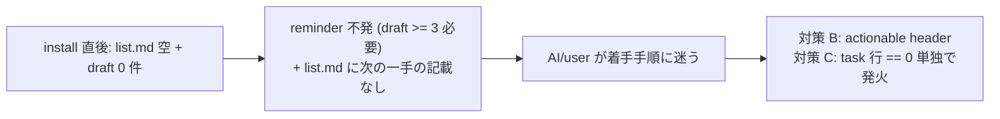

<!--
task-21 W2.4 frontmatter (機械可読、draft-flow-guard.sh / harness-audit が読む):
approval_required: true
approved_at: 2026-07-05
approved_by: user (kfurutani@classlab.co.jp)
retroactive: false
-->

# list.md actionable header + plan-first reminder 発火緩和 (P1-7)

**ステータス:** 📝 **draft（2026-07-05 起案、user 承認待ち）**
**起点:** master roadmap [`install-immediately-usable-redesign-20260618.md`](install-immediately-usable-redesign-20260618.md) §4.8 (list.md 完全 template 状態 + plan-first reminder 不発) / §5 P1-7 (工数 0.5 day、conf 0.85)
**前提:**
- HOTFIX-1/2 (PR #68 main merge 済): install.sh §6.4 が consuming repo に `harness-config.local.yml` を create-if-absent 生成 (`default_preset: team-default` + guard toggle 8 件 true、うち `feature_task_rule_guard_enabled: true` は install.sh L553 で実在確認)。これにより **新規 consuming repo では本 hook の feature group が ON** で稼働する (本 repo harness-dev は `harness-config.yml` L367 で false = advisory、run-all-smokes environmental note 対象)
- hc-config.sh --get/--summary の local.yml tier 対応 (env > local > yml > default) は HOTFIX-2 で解消済 → **本 draft の scope に含めない**
- **依存先 task-85 は soft (2026-07-05 review 反映)**: list.md #91 行 (`docs/tasks/list.md:248`) の依存先 task-85 は、実装 file が完全独立 (template list.md + plan-first hook + smoke vs install.sh §6.4 周辺) のため **soft 依存 (並行着手可)** — roadmap §7.1「P1-5/6/7 は並列 OK」/ §10「P1-7 は P1-5/P1-6 と並列着手可」と整合。Loop 自律 enqueue 順の直列化根拠にはしない

**関連 fixture / rule:**
- `.claude/rules/task-management.md` §plan-first 行先置きフロー (経路 A/B)
- `.claude/tests/list-md-plan-first-reminder-smoke.sh` (現行 9 case)

---

## 1. 真因サマリ / 課題サマリ

install 直後の consuming repo では `docs/tasks/list.md` が `<!-- 例: -->` placeholder のみの完全 template 状態 (`.claude/templates/docs/tasks/list.md` L36-38) で、AI にも user にも「台帳が空 = 次の一手は draft 起案」という事実が伝わらない。既存の安全網である SessionStart hook `list-md-plan-first-reminder.sh` は発火条件が `draft ≥ 3 ∧ task 行 == 0` (hook L115 + L126) と過保護で、**draft が 1 件も無い bootstrap 期にはまったく発火しない** (roadmap §4.8「reminder 不発」)。



**真因:** (1) template list.md が「記入ルール」は説明するが「今どうすべきか」を示さない (静的情報の欠落)。(2) hook の発火条件が batch planning 経路 B 違反検出 (task #35 起源) に特化しており、bootstrap 期 (draft 0-2 件) を検出対象外にしている (動的注入の欠落)。

**副次:** 発火条件を `task 行 == 0` 単独へ緩和すると、新規 repo では最初の task 行が入るまで毎 session 注入されるため、**過検知の騒がしさ抑制** (短文化 + source gating) を同時設計する必要がある。

---

## 2. 解決アプローチ比較

| 案 | 内容 | 工数 | メリット | デメリット |
|:---:|:---|---:|:---|:---|
| **A (採用)** | 対策 B + C 両方: template list.md に actionable header 追加 + hook を 2-tier 化 (tier A = 現行 full / tier B = task 0 単独の短文) + tier B のみ source gating (startup/clear のみ) | 0.5 day | 静的 (header) と動的 (reminder) の二重安全網。hook OFF 環境 (harness-dev / feature 無効 repo) でも header が効く。roadmap Phase 1 DoD「ここから着手 header あり」を直接充足 | smoke 期待値の反転 2 case + 新 case 追加が必要 |
| **B** | 対策 B のみ (template header だけ、hook 触らず) | 0.2 day | 変更最小、smoke 無傷 | **既存 consuming repo に届かない** (install.sh L403-404 create-if-absent で既存 list.md は skip 保護)。AI が list.md を Read しない session では認識されず、roadmap 対策 C が未達のまま |
| **C** | 対策 C のみ (hook 緩和だけ、template 触らず) | 0.3 day | 既存 repo にも `--update` で届く | `feature_task_rule_guard_enabled: false` 環境 (本 repo harness-dev 等) では hook 全体が no-op (hook L72) となり効果ゼロ。user が list.md を直接開いた時の可視性も得られない。roadmap Phase 1 DoD の header 条件 (roadmap L218) を充足できない |
| **D** | 対策 A 前倒し (install.sh first-task wizard で `/new-draft` 自動起動) | 2 day+ | 根本解決 | install.sh の対話化は scope 大。roadmap でも対策 A は別建てで、P1-7 の割当は B/C のみ (roadmap L213)。YAGNI |

→ **案 A** を推奨。理由: roadmap §5 P1-7 の割当 (4.8 B/C) と 1:1 対応し、静的 + 動的の相補で hook OFF / list.md 未 Read のどちらの欠落経路もカバーする。過検知は tier B 短文化 + source gating で抑制する。

**tier B 抑制方式の内部比較** (案 A 内の設計判断):

| 方式 | 内容 | 判定 |
|---|---|---|
| source gating (採用) | SessionStart stdin JSON の `source` field で `startup` / `clear` のみ発火、`resume` / `compact` は skip。dispatcher-core.sh は stdin replay で子 hook に payload 全文を渡す (L18 + L224) ため抽出可能 | 状態 file 不要・GC 不要で最簡。session 1 回性は「startup が session 1 回」で自然に成立 |
| session_id marker file | `.claude/.workflow-state/` に session_id keyed marker で 1 session 1 回抑制 | 却下: session_id 抽出 + marker GC (stale 掃除) の管理 cost が tier B 3 行の抑制目的に対し過大 (KISS 違反) |
| 抑制なし | 毎 SessionStart (resume/compact 含む) で注入 | 却下: Loop モード長時間 session で compact 再発火のたびに 3 行注入は「騒がしい」side が顕在化 |

---

## 3. 採用案の詳細設計

### Task 計画 (採用 6 条準拠、Phase 中間階層廃止)

1 Task = 1 Goal: **install 直後の空台帳状態で AI/user が次の一手 (`/new-draft <slug>`) に迷わない静的 + 動的の二重誘導を実装する**。

#### Step 計画

| Step | Status | 作業概要 | 工数 | 依存 |
|:---:|:---:|:---|---:|:---|
| 1 | 🔲 | template list.md に actionable header 追加 (対策 B) | 0.5h | — |
| 2 | 🔲 | hook 発火条件 2-tier 化 + tier B source gating (対策 C) | 1.5h | — |
| 3 | 🔲 | smoke 期待値反転 2 case + 新 case 4 件 + run-all-smokes note 更新 | 1.0h | Step 2 |
| 4 | 🔲 | (テスト設計レビュー) reviewer 動的選定 (`hc-config.sh --get review_max_count_test` で上限確認) | 0.5h | Step 3 |
| 5 | 🔲 | (テスト合格) smoke 全 PASS + run-all-smokes regression 0 | 0.3h | Step 4 |
| 6 | 🔲 | (リファクタリング) 3 観点判定 or `skip: <reason>` 明示 | 0.2h | Step 5 |

合計: 4.0h (≒ 0.5 day、roadmap 見積と整合)

### Step 1 詳細 — template list.md actionable header (対策 B)

#### スコープ
- 対象ファイル: `.claude/templates/docs/tasks/list.md` のみ (本 repo 稼働中の `docs/tasks/list.md` は**触らない** — 台帳運用中で header 不要)

#### 変更内容

L27「## タスク」直下の既存 blockquote (L29-32) の後に、以下の blockquote を追加:

```markdown
> **ここから着手** (台帳が空の間の案内。最初の Task 行を追加したらこの blockquote を削除):
> 1. 最初の作業対象を決め、`/new-draft <slug>` で設計 draft を起案する
> 2. user 承認を得る (draft 先頭 frontmatter の承認日 field 記入)
> 3. `/new-task <id> <slug>` で本 table に行を追加する (📝 → 🔲)
>
> 規範: `.claude/rules/task-management.md` §「設計→承認→タスク追加フロー」。N ≥ 3 task の一括計画は同 §「plan-first 行先置きフロー」経路 B。
```

文面設計の要点:
- roadmap Phase 1 DoD (L218) の検証文字列「**ここから着手**」+ `/new-draft <slug>` を必ず含める
- self-descriptive な削除条件 (「最初の Task 行を追加したら削除」) を header 自身に明記 → 台帳運用開始後に残骸化しない
- 経路 A (単発) を主導線、経路 B (batch) は 1 行言及に留める (bootstrap 期の読者に過剰情報を与えない)

#### install.sh との整合 (確認済、変更不要)

- install.sh L400 `for f in list.md parking-lot.md _TASK_TEMPLATE.md` に **list.md は既に含まれる** → template 内容変更のみで新規 install に配布される。install.sh 側の変更は 0 行
- next-actions.md entry #32 (L75) の指摘「配置 list hardcode に next-actions.md 未登録」は**別件・本 task scope 外** (next-actions-cleanup-batch Group F で追跡中)。本 task は hardcode list に既登録の file の内容変更のみで、hardcode 問題を悪化させない
- 制約: L403-404 の create-if-absent により**既存 consuming repo の list.md には届かない** (→ §4 リスク、対策 C が補完)

### Step 2 詳細 — hook 発火条件 2-tier 化 (対策 C)

#### スコープ
- 対象ファイル: `.claude/hooks/list-md-plan-first-reminder.sh`

#### 変更内容 (現行 L104-139 の条件分岐を再構成)

| tier | 条件 | source gating | 注入文 |
|---|---|---|---|
| **A (現行維持)** | `task_count == 0 ∧ draft_count >= 3` | なし (全 source で発火、現行互換 — 経路 B 違反は resume 後も再注入に値する) | 現行 full message (L129-138) を維持 |
| **B (新設)** | `task_count == 0 ∧ draft_count < 3` | `startup` / `clear` のみ発火、`resume` / `compact` は skip | 短文 3 行 (下記) |

擬似 diff (現行 L115 `[ "$task_count" -eq 0 ] || exit 0` は共通ゲートとして維持、L126 の early-exit を分岐に変更):

```bash
# before (L126)
[ "$draft_count" -ge 3 ] || exit 0
# (以降 tier A message)

# after
if [ "$draft_count" -ge 3 ]; then
    _emit_tier_a   # 現行 full message そのまま
else
    case "$session_source" in
      startup|clear|"") _emit_tier_b ;;   # "" = 抽出失敗 fallback (下記)
      *) exit 0 ;;                        # resume / compact は skip
    esac
fi
```

- `session_source` 抽出: 現行 L58 の stdin 破棄 (`cat >/dev/null`) を stdin 保持に変更し、`grep -o '"source"[[:space:]]*:[[:space:]]*"[a-z]*"'` + sed で抽出 (jq 非依存、既存 hook 群の no-jq 方針踏襲)。dispatcher-core.sh の stdin replay (L18「payload を 1 度読み、各子に printf で全文を渡す」+ L224) により SessionStart JSON が届くことは確認済
- 抽出失敗 (stdin 空 / 非 JSON / field 不在) は **`startup` 扱いで発火** (fail 方向 = reminder 機能維持。既存 smoke の `</dev/null` 起動でも tier B が検証可能になる副次効果)
- tier B 注入文 (短文化、tier A の 10 行に対し 5 行):

```
<system-reminder>
[list.md plan-first] docs/tasks/list.md に task エントリ行が 0 件です (台帳が空)。
最初の作業を決めたら /new-draft <slug> で設計 draft を起案し、user 承認後に /new-task <id> <slug> で行を追加してください。
規範: .claude/rules/task-management.md §設計→承認→タスク追加フロー / bypass: HC_LIST_PLAN_FIRST_REMINDER_ENABLED=false
</system-reminder>
```

#### 変更しないもの (明示)

- feature toggle: 既存 group `task_rule_guard` (hook L72 / manifest L33) をそのまま使用、**新 env / 新 yml key は追加しない** (tier B 個別 OFF は YAGNI、全体 toggle `HC_LIST_PLAN_FIRST_REMINDER_ENABLED` / `list_plan_first_reminder_enabled` で足りる → config 値 3 点セット義務 [[feedback_config_value_needs_consumer_and_smoke]] の新規発生を回避)
- fail-open guard: L101 (`list.md 不在 → exit 0`) / L102 (`draft_dir 不在 → exit 0`) は**保守的に維持** (list.md 不在 = `/init-tasks` 未実行は `init-tasks-on-start.sh` の担当領域。draft_dir 不在は変則環境と見なし沈黙 → 現行 smoke Case 4/9 の期待値も無変更)
- `set -u` + subshell 関数化 (L55/L77) の fail policy、dispatcher-manifest.tsv L33 の登録 (hook path / timeout 5 不変)

### Step 3 詳細 — smoke 期待値更新

#### スコープ
- 対象ファイル: `.claude/tests/list-md-plan-first-reminder-smoke.sh` / `.claude/tests/run-all-smokes.sh` L137-139

#### 期待値変更 (既存 9 case)

| Case | 現行期待 | 新期待 | 理由 |
|:---:|---|---|---|
| 2 (draft 2 + task 0) | silent | **tier B 発火** (keyword あり ∧ tier A 固有文言「経路 B」なし) | 発火条件緩和の本体 |
| 6 (template 除外で実 draft 2) | silent | **tier B 発火** (tier A でないことを assert) | template 除外の検証意図を「tier A に昇格しない」に変更 |
| 1/3/4/5/7/8/9 | — | 無変更 | tier A / bypass / fail-open は現行互換 |

#### 新規 case (4 件)

| Case | fixture | 期待 |
|:---:|---|---|
| 10 | draft 0 + task 0 (bootstrap 期そのもの) | tier B 発火 |
| 11 | draft 0 + task 0 + stdin `{"source":"resume"}` | silent (source gating) |
| 12 | draft 0 + task 0 + stdin `{"source":"startup"}` | tier B 発火 (明示 startup) |
| 13 | draft 3 + task 0 + stdin `{"source":"resume"}` | tier A 発火 (tier A は非 gating の regression 検証) |

#### 発火系 case の feature toggle 注入 + run-all-smokes.sh environmental note 更新 (2026-07-05 review 反映)

- 発火系 case (Case 1/2/6/7/10/12/13) は **per-case で `HC_FEATURE_TASK_RULE_GUARD_ENABLED=true` を注入**し、harness-dev (本 repo) でも 13/13 PASS を成立させる。hook は自身で config-loader.sh を source する (hook L66-68) ため `is_feature_enabled` は常に定義され、本 repo の `feature_task_rule_guard_enabled: false` (harness-config.yml:367) を読んで L72 で exit 0 する — env 注入なしでは発火系 case は silent FAIL する。env preset は yml false に勝つ (config-loader Step 1b)
- run-all-smokes.sh L137-139 の environmental note (「Case 1/7 は harness-dev expected-fail」) は **縮小方向へ更新** (発火系 case に env 注入済のため expected-fail 前提が解消される旨に書き換え)

### Step 4-6 詳細 (Task 最終 3 Steps、固定)

- **Step 4 (テスト設計レビュー)**: reviewer を `review_min_count_test`〜`review_max_count_test` 範囲で動的選定 (起動前に `bash .claude/scripts/hc-config.sh --get review_max_count_test` で上限確認)。観点: source gating の boundary / 文面の keyword 安定性 / fail-open 維持
- **Step 5 (テスト合格)**: UI なし → smoke 13 case + run-all-smokes regression で OK (terminal 出力のみ、ビジュアル検証対象外)
- **Step 6 (リファクタリング)**: 持続可能性 / 汎用性 / 非冗長化 の 3 観点。tier A/B message の heredoc 共通化余地を判定、不要なら `skip: <reason>` 明示

---

## 4. リスクと緩和

| リスク | 確率 | 影響 | 緩和 |
|---|:---:|:---:|---|
| 新規 repo で最初の task 行が入るまで毎 session tier B 注入 (騒がしい) | H | L | 短文 5 行化 + startup/clear 限定 (resume/compact skip)。意図された挙動 (roadmap §4.8「台帳が空である事実を AI に認識させる」) であり、`/new-task` 1 回で恒久消灯する self-healing |
| 既存 consuming repo に header 届かない (list.md create-if-absent 保護) | H | L | 対策 C (hook) が `--update` 経由で補完。header の遡及挿入は list.md が project 所有 file のため**意図的に scope 外** (§「open questions」2) |
| tier A 文面の keyword 変化で既存 smoke / 下流 grep が壊れる | L | M | tier A message は 1 文字も変更しない (現行 L129-138 維持)。smoke Case 1/7 の assert 文字列 `list.md plan-first` は tier B にも共通で含める |
| source 抽出の JSON parse 誤り (dispatcher 経由 / 直接起動の payload 差) | M | L | 抽出失敗 → `startup` 扱い発火の fail 方向設計 (機能欠落ではなく最悪「1 回余分に出る」側に倒す)。Case 11/12 で両方向を smoke 固定 |
| harness-dev (本 repo) では feature OFF で動作確認できない | — | L | smoke / DoD の発火系検証は per-case `HC_FEATURE_TASK_RULE_GUARD_ENABLED=true` 注入で feature check を通過させる (2026-07-05 review 反映: hook は自身で config-loader.sh を source するため「`is_feature_enabled` 不在環境で素通り」は成立しない — 実測反証済。env preset は yml false に勝つ)。run-all-smokes note は env 注入済の旨へ縮小更新 |

---

## 5. 移行計画

- [ ] Step 1-3 実装 (feature flag 追加なし — 既存 toggle 系に完全内包のため段階 rollout 不要)
- [ ] 本 repo で smoke 13 case + run-all-smokes 全 PASS 確認
- [ ] 新規 dummy repo に `bash install.sh ../dummy-repo` → list.md header 存在確認 + tier B 注入は **dispatcher 直接起動** (dummy repo 内で `bash .claude/hooks/session-start-dispatcher.sh </dev/null`) で確認する (2026-07-05 review 反映: fresh default install は settings.json 非配布 (`install.sh:218` rsync exclude、§6.3 は sync mode 限定) のため実 Claude Code セッションでは SessionStart hook が未配線 — 実セッションでの確認は entry #78 (settings seed copy) 導入後に依存)
- [ ] consuming repo へは通常の `install.sh --update` / npx update 経路で配布 (hook + template 同梱、追加手順なし)

---

## 6. 完了条件（DoD）

- [ ] `grep -c 'ここから着手' .claude/templates/docs/tasks/list.md` が 1 を返し、同 blockquote に `/new-draft <slug>` を含む
- [ ] `grep -c 'ここから着手' docs/tasks/list.md` が 0 を返す (本 repo 稼働台帳は無変更)
- [ ] tmp fixture (draft 0 + task 行 0 の list.md) で `CLAUDE_PROJECT_DIR=<tmp> HC_FEATURE_TASK_RULE_GUARD_ENABLED=true bash .claude/hooks/list-md-plan-first-reminder.sh </dev/null` の stderr に `list.md plan-first` keyword が出力される (tier B、現行では silent。**発火系 DoD 検証は全て同 env prefix 付きで実行** — harness-dev は yml false のため、2026-07-05 review 反映)
- [ ] 同 fixture + stdin `{"source":"resume"}` で stderr 空 (source gating)
- [ ] draft 3 件 fixture で現行 tier A message が 1 文字も変わらず出力される (`diff` で before/after 一致)
- [ ] `bash .claude/tests/list-md-plan-first-reminder-smoke.sh` が 13/13 PASS
- [ ] `bash .claude/tests/run-all-smokes.sh` で新規 FAIL 0 (environmental note 更新済)
- [ ] install.sh の変更行数 0 (`git diff --stat install.sh` が空)

---

## 7. 工数見積

合計 4.0h (Step 1: 0.5h / Step 2: 1.5h / Step 3: 1.0h / Step 4-6: 1.0h) ≒ 0.5 day。roadmap P1-7 見積 (0.5 day) と一致。

---

## 8. レビューサイクル (workflow.md §「収束条件」準拠)

> draft レビューは reviewer 並列起動 + CRITICAL/HIGH/MEDIUM = 0 まで反復 (LOW 許容、上限 `review_iteration_max`)。起動数は `hc-config.sh --get review_min_count_design` / `--get review_max_count_design` で範囲確認。

| iter | 日付 | reviewer (起動数) | CRITICAL | HIGH | MEDIUM | LOW | 修正 commit | 状態 |
|:---:|---|---|:---:|:---:|:---:|:---:|---|---|
| — | — | (未実施) | — | — | — | — | — | 起案直後 |

---

## 9. 承認履歴

| 日付 | 承認者 | 結果 |
|---|---|---|
| — | — | (承認待ち) |

> 承認記入は先頭 HTML comment frontmatter の承認日 field (file 内 1 箇所) のみに行う (7 draft frontmatter 統一、2026-07-05 review 反映)。

---

## 10. 関連 / open questions

- master roadmap: [`install-immediately-usable-redesign-20260618.md`](install-immediately-usable-redesign-20260618.md) §4.8 / §5 P1-7 / §7.2 DAG (P1-7 は P1-5/P1-6 と並列着手可)
- 起源 task: task #35 (`list-md-plan-first-reminder.sh` 新設) / task #36 (PreToolUse Write warn) / task #33 (§plan-first 規範)
- 副産物 registry: `docs/tasks/next-actions.md` entry #32 (install.sh templates 配置 list hardcode — 本 task scope 外、悪化なし)

**open questions (user 判断)**:
1. tier B の source gating を `startup` + `clear` としたが、`compact` 後は context 要約で reminder が失われ得る。compact も発火対象に含めるか (騒がしさ vs 認識維持のトレードオフ)
2. 既存 consuming repo の空 template list.md への header 遡及 (例: `--update` 時に「task 行 0 ∧ header 不在なら挿入」) は project 所有 file への書込みになるため見送った。要否判断
3. smoke Case 9 (draft_dir 不在) は fail-open 沈黙を維持したが、対策 C の趣旨を優先して tier B 発火に変える選択肢もある (本 draft は保守側を採用)
