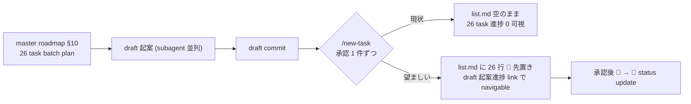

<!--
approval_required: true
approved_at:
approved_by:
retroactive: false
-->

# list.md plan-first 規範化 (batch planning 時の 📝 行先置きフロー)

**ステータス:** 🔲 **draft (2026-05-25 起案、user 承認待ち)**
**起点:** user Post-Mortem 報告 (2026-05-25、recall_poc で観測された list.md plan-first 不在事案)
**前提:**
- task-29 採用 5 条 (Phase→Step 強制タスク構造規範) 適用済
- `.claude/templates/docs/tasks/list.md` の凡例に `📝 設計（未承認）` 既定義 (用途未明文化)
- `task-rule-guard.sh` の hook 許諾仕様で `list.md` Edit は exempt (素通り)
- cross-repo write は user manual 必要 (task-31 で規範化済、本 draft 反映時 `bash install.sh --update <target>` 経由)

**関連 fixture / rule:**
- `.claude/rules/task-management.md` §「設計→承認→タスク追加フロー（必須）」(P1 修正対象)
- `.claude/commands/new-task.md` (P2 拡張対象)
- `.claude/hooks/session-help-surface.sh` または新 hook (P3 注入対象)
- `.claude/hooks/task-rule-guard.sh` (P5 warn 拡張対象)
- `.claude/templates/docs/tasks/_TASK_TEMPLATE.md` 前段 `_LIST_PLAN_TEMPLATE.md` (P4 新設候補)

---

## 1. 真因サマリ / 課題サマリ

`/new-task` は **1 task ずつ sequential** に list.md へ 🔲 行 append する設計で、master roadmap で **N 個の task を batch plan** する用途を想定していない。結果、26 task の batch 計画下でも list.md は空のまま draft 起案だけが進み、user が IDE で進捗追跡不可になる事案が発生 (recall_poc / 2026-05-25 観測)。

**真因 (4 階層)**:

1. **`/new-task` 設計**: 1-task-at-a-time gate で batch planning を想定せず
2. **規範矛盾**: `task-rule-guard.sh` は list.md 直接 Edit を技術的に許可、しかし `task-management.md` step 4 は「`/new-task` 経由のみ」と読める → AI が直接 Edit を躊躇
3. **plan-first 不在**: 凡例 `📝 設計（未承認）` は定義されているが、batch plan 時の「未承認 task を list.md に先置きする」運用規範が未定義
4. **AI 運用判断**: user が IDE で list.md を 3 回開く observation を行動に翻訳できず、karpathy-guidelines「Think Before Coding」未適用

**副次:**
- user の不可視ニーズ (進捗追跡) を AI が想定できず、user 明示質問待ちで顕在化
- batch plan visibility が消失、Phase 1 実装着手 (`/start-task 1`) まで放置リスク
- user 信頼コスト発生 (非対称な指摘依存)

**実害 (recall_poc 観測)**:
- 26 task の進捗 visibility が IDE 視点で 0 (draft 増加に対し list.md 空)
- user 明示質問が無ければ Phase 1 実装着手まで list.md 空継続予定 (推定 +1-2 セッション遅延)
- user の信頼コスト発生

---

## 2. 解決アプローチ比較

| 案 | 内容 | 工数 | メリット | デメリット |
|:---:|:---|---:|:---|:---|
| A 規範のみ | task-management.md に plan-first フロー追加、`/new-task` 既存動作維持 (新規行 append のみ) | 0.5 | 即日改善、cost 低 | 26 task batch 反映時に行重複リスク (📝 + 🔲) |
| B `/new-task` 拡張 + 規範 | P1 + P2 (📝 既存行を🔲 update に変更) を組み合わせる | 1.2 | 整合性確保、行重複なし | `/new-task` 実装拡張要 |
| **C ハイブリッド (P1+P2+P3+P5)** | A + B + SessionStart 検出 hook + task-rule-guard warn 拡張 (P4 は将来) | **2.5** | 完全な plan-first 強制機構 + 機械検出、user 明示質問なしに気付ける | 工数中、4 箇所同期 |
| D 全 P1-P5 | C + P4 (`_LIST_PLAN_TEMPLATE.md` + auto-insert hook) | 3.5 | 完全 plan-first 自動化 (AI が list.md 意識不要) | 工数高、P4 hook 設計負担 |

→ **案 C ハイブリッド (P1+P2+P3+P5)** を推奨。理由: 即日効果 (P1 規範) + 整合性 (P2) + 機械検出 (P3+P5) の 3 層で plan-first 強制を構造的に達成。P4 は工数比効果が低い (template 新設 + hook 設計負担 vs `/new-task` 同 ID update 動作で十分カバー)、parking-lot 検討に分離。

---

## 3. 採用案の詳細設計

### Wave / Sub-task 分割 (Phase→Step 採用 5 条準拠)

| Phase | 名前 | 工数 | 依存 |
|:---:|:---|---:|:---|
| 1 | task-management.md §「plan-first 行先置きフロー」追加 (P1 規範修正) | 0.5 | — |
| 2 | `.claude/commands/new-task.md` の 📝 → 🔲 update 動作拡張 (P2 実装修正) | 0.7 | Phase 1 |
| 3 | SessionStart hook で「list.md 空 + draft 多数」検出 + system-reminder 注入 (P3 新 hook or 既存拡張) | 0.6 | Phase 1 |
| 4 | `task-rule-guard.sh` PreToolUse(`/new-draft`) で 📝 不在 warn 追加 (P5 検出強化) | 0.4 | Phase 1, 2 |
| 5 | テスト設計レビュー → smoke → リファクタリング (採用 5 条 4) | 0.3 | Phase 1-4 |

合計: 2.5 工数

### Phase 1: task-management.md §「plan-first 行先置きフロー」追加

**ゴール**: `.claude/rules/task-management.md` に「設計→承認→タスク追加フロー」を 2 経路 (A: 単発、B: batch planning) に分岐する subsection が存在し、凡例 📝 の用途が明文化される (観察可能: `grep -q "plan-first 行先置きフロー\|経路 B (batch planning)" .claude/rules/task-management.md` exit 0)

**作業概要**:
- 既存 §「設計→承認→タスク追加フロー（必須）」直後に新 subsection 追加
- 経路 A (単発): 既存フロー保持
- 経路 B (batch planning): 4 step (master roadmap plan → list.md 📝 batch 先置き → 個別 draft 起案 → `/new-task` で 📝 → 🔲 update)
- 凡例 📝 用途明文化: 「draft 起案中 / 承認待ち + 計画段階の先置き」

**Step**:
- Step 1.1: task-management.md 編集 (main 直接 Edit、`.claude/rules/` 許可)
  - 完了条件: `grep -q "経路 B (batch planning)" .claude/rules/task-management.md` exit 0、新 subsection 存在
- Step 1.2 (テスト設計レビュー): 5+ reviewer 動的選定 (規範文書系のため architect-reviewer / harness-optimizer / qa-expert / tdd-guide / pr-test-analyzer)、収束まで反復 (上限 5 回)
  - 完了条件: 全 reviewer approve
- Step 1.3 (テスト合格): 規範文書のため grep 検証 + 既存 smoke regression 0
  - 完了条件: `bash .claude/tests/task-rule-guard-smoke.sh` exit 0、既存 smoke 全 PASS
- Step 1.4 (リファクタリング): skip 明示 (規範文書追記のみ、refactor 余地なし)

### Phase 2: `/new-task` の 📝 → 🔲 update 動作拡張

**ゴール**: `.claude/commands/new-task.md` で list.md 同 ID (or 同 slug) の 📝 行が既存なら update (📝 → 🔲)、不在なら append する動作仕様が明文化され、`task-rule-guard.sh` (or `init-tasks.sh` の helper) で機械実装される (観察可能: 同 ID で 📝 行が既存の list.md に対し `/new-task` 実行後、行数増えず status のみ変化)

**作業概要**:
- `.claude/commands/new-task.md` に「📝 行 update or append」logic を明記
- 実装: bash helper or Python script (現 `/new-task` の動作実装を読み、grep + sed or in-place edit で update logic 追加)
- subagent staging 戦略必須 (`.claude/commands/` `.claude/scripts/` 両 code 配下)

**Step**:
- Step 2.1: `/new-task.md` 動作仕様 update (main 直接 Edit、`.claude/commands/` 許可)
- Step 2.2: 実装 helper (subagent staging で `.claude/scripts/` 編集)
- Step 2.3 (テスト設計レビュー): 5+ reviewer (上記 + code-reviewer 追加)
- Step 2.4 (テスト合格): 新 smoke `new-task-batch-update-smoke.sh` で update vs append 動作検証
- Step 2.5 (リファクタリング): 3 観点判定

### Phase 3: SessionStart hook で「list.md 空 + draft 多数」検出

**ゴール**: `.claude/hooks/session-help-surface.sh` (既存拡張) or 新 hook で `docs/draft/*.md` ≥ 3 件 ∧ `list.md` task 行 == 0 の状態を検出し `<system-reminder>` 注入する (観察可能: 条件成立 session で SessionStart 出力に「list.md plan-first」keyword 含まれる)

**作業概要**:
- 既存 `session-help-surface.sh` に分岐追加 or 新 hook `list-md-plan-first-reminder.sh` 新設
- 検出 logic: bash で draft count + list.md task row count を bash で算出
- bypass: `HC_LIST_PLAN_FIRST_REMINDER_ENABLED=false`

**Step**:
- Step 3.1: hook 実装 (subagent staging で `.claude/hooks/` 編集)
- Step 3.2: settings.json 配線 (SessionStart 列に entry 追加)
- Step 3.3 (テスト設計レビュー): 5+ reviewer
- Step 3.4 (テスト合格): smoke で 3 case (条件成立 / 不成立 / bypass) 検証
- Step 3.5 (リファクタリング): skip or 抽出

### Phase 4: `task-rule-guard.sh` PreToolUse(`/new-draft`) で 📝 不在 warn

**ゴール**: `/new-draft <slug>` 実行時、list.md に対応 slug の 📝 行が不在なら warn context 注入 (block しない) されることが smoke で検証される (観察可能: 📝 行不在で `/new-draft` 実行時 stderr に「先に list.md に 📝 行を先置きするか、master roadmap で計画段階を明示」keyword 含まれる)

**作業概要**:
- `task-rule-guard.sh` PreToolUse(Bash) で `/new-draft <slug>` pattern 検出
- list.md grep で `📝 .* <slug>` row 存在 check
- 不在なら warn context 注入 (block しない)

**Step**:
- Step 4.1: hook 拡張 (subagent staging で `.claude/hooks/` 編集)
- Step 4.2 (テスト設計レビュー): 5+ reviewer
- Step 4.3 (テスト合格): smoke 拡充 (`task-rule-guard-smoke.sh` に new case 追加、11→13 cases)
- Step 4.4 (リファクタリング): skip

### Phase 5: テスト設計レビュー → smoke 合格 → リファクタリング (採用 5 条 4 強制、Phase 全体)

**ゴール**: 全 Phase 統合の smoke 全 PASS、既存 smoke regression 0、reviewer 5+ approve 達成

**Step**:
- Step 5.1 (テスト設計レビュー): 全 Phase 統合観点 (architect-reviewer / harness-optimizer / qa-expert / tdd-guide / pr-test-analyzer 5 件)
- Step 5.2 (テスト合格): 全 smoke 統合実行
- Step 5.3 (リファクタリング): 統合観点で重複 / 命名 / 抽出余地評価

---

## 4. リスクと緩和

| リスク | 確率 | 影響 | 緩和 |
|---|:---:|:---:|---|
| `/new-task` 拡張で既存 1-task-at-a-time フロー破壊 | L | H | 経路 A (単発) を default 維持、経路 B は明示 opt-in |
| 📝 行 update logic の同 ID 重複 / 行検索 bug | M | M | smoke で update vs append 動作 2 ケース検証 |
| SessionStart hook の false positive (legitimate な empty state) | M | L | bypass env `HC_LIST_PLAN_FIRST_REMINDER_ENABLED=false` 提供 |
| cross-repo 反映漏れ (本 repo fix → 採用 project 未反映) | H | M | `bash install.sh --update <target>` を user manual で実施 (cross-repo normative) |

---

## 5. 移行計画

- [ ] Phase 1-5 実装 (本 task の進行)
- [ ] hirai-method 本家で smoke 全 PASS 確認
- [ ] 採用 project (recall_poc / classlab-weekly-news / taskManageSystem) に user manual `bash install.sh --update` で反映
- [ ] 各 project で list.md plan-first 動作確認
- [ ] CLAUDE.md Critical Operational Lessons に「list.md plan-first 不在 → 規範化」教訓追加

---

## 6. 完了条件（DoD）

- [ ] `task-management.md` §「plan-first 行先置きフロー」存在、経路 A/B 分岐明文化、凡例 📝 用途明文化
- [ ] `/new-task` で 📝 既存行を 🔲 update 動作実装、新規 smoke `new-task-batch-update-smoke.sh` 全 PASS
- [ ] SessionStart hook で list.md 空 + draft ≥ 3 検出、`<system-reminder>` 注入、bypass env 動作
- [ ] `task-rule-guard.sh` PreToolUse(`/new-draft`) で 📝 不在 warn 注入、smoke 拡充 11→13 cases
- [ ] reviewer 5+ approve (各 Phase 最終 Step)
- [ ] 既存 smoke regression 0 件 (task-rule-guard / workflow-guard / next-actions-hooks / loop-auto-progress 等)
- [ ] CLAUDE.md Critical Operational Lessons に教訓追加 (HIGH)
- [ ] 3 リポ user manual install 反映確認 (recall_poc / taskManageSystem / classlab-weekly-news)

---

## 7. 工数見積

合計 **2.5 工数** (Phase 1: 0.5 + Phase 2: 0.7 + Phase 3: 0.6 + Phase 4: 0.4 + Phase 5: 0.3)。

実装は subagent staging 戦略遵守 (`.claude/commands/` `.claude/hooks/` 配下 code 編集)。Phase 1 のみ main 直接 Edit 可 (`.claude/rules/` 許可)。

---

## 8. 承認履歴

| 日付 | 承認者 | 結果 |
|---|---|---|

---

## 9. 関連

- 起源 Post-Mortem: 2026-05-25 user 報告 (本 draft §1-§4 source)
- 関連既存規範:
  - `.claude/rules/task-management.md` §「設計→承認→タスク追加フロー（必須）」(P1 修正対象)
  - `.claude/rules/task-management.md` §「メインエージェント専任（必須）」(整合性 sanity)
  - `.claude/rules/development-process.md` §「cross-repo write 例外」(task-31 で規範化済、本 draft 反映時 user manual 経由)
- 関連 task: task-29 (Phase→Step 採用 5 条、本 draft の Phase/Step 構造の根拠)
- 副産物 entry: `docs/tasks/next-actions.md` (本 draft 起案と同時に🟡 entry 追加予定)
- 観測 project: recall_poc (本リポでは hot fix 適用済、hirai-method 反映待ち)
- 採用 5 条 4 (テスト設計レビュー 5+ reviewer 動的選定) 適用、bypass `ECC_TEST_DESIGN_REVIEW_OFF=1`
- 派生 task 候補 (parking-lot 検討): P4 `_LIST_PLAN_TEMPLATE.md` 新設 + auto-insert hook (本 task では out-of-scope、効果検証後の昇格判定)
