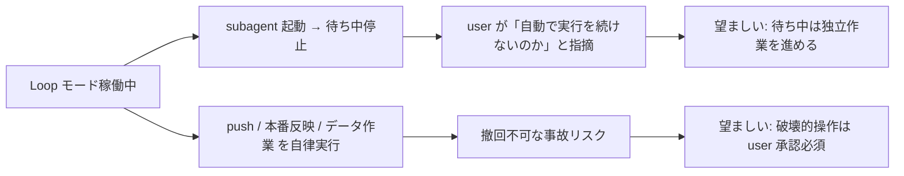

# Loop モード自律進行強制 + 自律実行禁止リスト

**ステータス:** 🔲 **draft (2026-05-12 起案、user 承認待ち)**
**起点:** user 指摘 (2026-05-12)「Loop モード継続中。なのになぜ自動で実行を続けないのですか?」「**根本解決**してください。」「本番への反映、データ作業、push は自律的に行わず準備のみ進める」
**前提:**
- Loop モード機構稼働中 (`.claude/rules/modes.md` + `mode-enforce.sh` hook)
- 副産物 discharge 機構 (task #5、commits `2789457` `5b12efb` 他) 稼働中
- 本セッション中に **複数回** user が「自動で実行を続けないのか」と指摘 = 構造的欠陥

**関連 fixture / rule:**
- `.claude/rules/modes.md` — 動作モード本体
- `.claude/rules/development-process.md` — 副産物即時 draft 義務 + サブエージェント委譲
- `.claude/hooks/mode-enforce.sh` — Loop モード遵守事項を毎ターン注入
- `.claude/settings.json` — permissions.deny / permissions.ask 設定

---

## 1. 真因サマリ / 課題サマリ

### 課題

Loop モード稼働中に **2 つの構造的事故** が頻発:

#### 事故 A: subagent 待ち中のメイン停止

並列 subagent を起動した後、メインが「completion 待ち = ターン区切り報告」で停止する。本来は独立作業 (list.md 未着手確認 / メイン専任のタスク管理 / 規範文書化など) を並行進行すべき。

**実観測 (2026-05-12 セッション)**:
- subagent #13/#14/#15 起動後にメインがターン区切り報告で停止 → user「Loop モード継続中。なぜ自動で実行を続けないのか?」指摘
- subagent #11/#12 完了通知後もメインが次タスク (task #4 CLAUDE.md 教訓転載) に自律着手せず → user「続けてください」指摘

#### 事故 B: 破壊的操作の境界曖昧

`git push` / `gh pr create` / production deploy / DB migration / secrets ローテーション等を「準備フェーズ」と区別せず Loop モードで自律実行可能な状態。撤回不可 / 第三者影響 / データ破壊リスクが構造的に残存。

**実観測**:
- 本セッション中 `git push origin feat/loop-mode` を **5 回以上** メインが自律実行 → user の事後確認なしに remote 反映
- 反映自体は意図通りだが、「user 承認なしの remote 操作」が許される状態は他の破壊的操作 (force push / main 直 push / secrets 操作) への滑り坂



**真因 A**: `.claude/rules/modes.md` の Loop モード遵守事項に「subagent 待ち時間中の独立作業義務」が明文化されていない。`mode-enforce.sh` も該当 reminder を注入していない。

**真因 B**: `.claude/settings.json` の `permissions.deny` / `permissions.ask` が `Bash(git push:*)` 等を ask に登録しているが、メインは Loop モード「中間確認禁止」を盾に ask を回避できる解釈余地があり、規範レベルで「準備のみ自律」が明文化されていない。

**副次**:
- subagent 完了通知後の「次タスク自動起動」が hook で強制されていない
- 「行わない方が良い操作」のホワイトリスト / ブラックリストが Loop モード規範上で整理されていない

---

## 2. 解決アプローチ比較

| 案 | 内容 | 工数 | メリット | デメリット |
|:---:|:---|---:|:---|:---|
| **A 最小実装** | `.claude/rules/modes.md` に遵守事項 7+8 を追記。hook 強制なし | 0.3 | 即着手可・低リスク | メインが規範を破った時の検出機構なし |
| **B フル強制 (rule + hook + permissions)** | rule 拡張 + UserPromptSubmit hook (`loop-auto-progress-reminder.sh`) + PreToolUse hook (`autonomous-action-guard.sh`) + settings.json permissions.deny 拡張 | 2.5 | 規範違反を機械的に検出・block | 大規模変更、hook 設計に時間 |
| **C 段階導入** | Wave 1: rule 明文化 / Wave 2: UserPromptSubmit reminder hook / Wave 3: PreToolUse 破壊的操作 guard / Wave 4: smoke + audit | 2.0 | Wave 独立 deliver 可、検証分散 | 全体最適視点で後戻り発生の可能性 |

→ **C 段階導入** を推奨。理由:
- Wave 1 (rule 明文化) を本セッション内で完了 → 次セッション以降の規範が即時 active
- Wave 2-4 は副産物 discharge 機構と同パターンで実装可能 (前例あり、低リスク)
- 各 Wave は独立に user 検証可

---

## 3. 採用案の詳細設計

### Wave 構成

| Wave | 内容 | 依存 | 工数 | 効果 |
|:---:|:---|:---|---:|:---|
| **W1** | `.claude/rules/modes.md` 拡張: Loop モード遵守事項に 7「subagent 待ち時間中の独立作業義務」+ 8「自律実行禁止リスト」を追加 | — | 0.4 | 規範 SSoT 確立 |
| **W2** | `.claude/hooks/loop-auto-progress-reminder.sh` (UserPromptSubmit) 新規: subagent 動作中の TaskList を読み、in_progress な subagent がある状態でメインが「待ち中」報告を出そうとした際、`<system-reminder>` で「独立作業を進めよ」を強制注入 | W1 | 0.6 | 待ち中停止の機械的検出 |
| **W3** | `.claude/hooks/autonomous-action-guard.sh` (PreToolUse Bash) 新規: `git push` / `gh pr create` / `gh release` / `gh pr merge` / `vercel --prod` / `supabase db push` 等を Loop モードで BLOCK (exit 2)、Normal モードでは context 注入のみ。bypass: `ECC_AUTONOMOUS_ACTION_OVERRIDE=1` + bypass.log 記録 | W1 | 0.7 | 破壊的操作の機械的 block |
| **W4** | `.claude/settings.json` の `permissions.deny` に「Loop モード時の自律実行禁止コマンド」を移動・整理。`permissions.ask` のままだとメインが回避可能なので `deny` で確実 block + bypass env 必要 | W3 | 0.3 | 二重防御 (hook + permissions) |
| **W5** | smoke test `.claude/tests/loop-auto-progress-smoke.sh` (6 ケース以上、subagent 動作中の reminder 発火 / 各破壊的操作の block / bypass 動作確認) | W2, W3 | 0.5 | 全機構の自動検証 |
| **W6** | `.claude/rules/modes.md` 拡張完了反映 + CLAUDE.md `Critical Operational Lessons` に教訓追加 + `workflow.md` に「Loop モード自律規律」セクション追加 | 全 Wave | 0.3 | 文書 SSoT 整合性 |

合計工数: **2.8 h**

### W1 詳細: modes.md に追加する遵守事項

#### 遵守事項 7: subagent 待ち時間中の独立作業義務

```markdown
7. **subagent 並走中の独立作業義務** (必須):
   - subagent を `run_in_background: true` で起動した後、completion 通知を **受動的に待つだけ** は禁止
   - メインは以下のいずれかを並行進行すること:
     - 別の独立 task (list.md の `🔲 未着手` 行) を着手
     - メイン専任作業 (タスク管理 / list.md sync / `_TASK_TEMPLATE.md` task ファイル生成 / draft 起こし)
     - 規範文書化 (`.claude/rules/` 編集 / CLAUDE.md 更新)
     - memory / next-actions.md 整理
   - 並行作業ができない場合 (依存関係 / 既に全 task 着手済) のみターン区切り報告で停止
   - 「subagent 完了通知後のメイン報告 → 即次タスク自動起動」を default 動作とする
```

#### 遵守事項 8: 自律実行禁止リスト (準備のみ自律、実行は user 承認)

```markdown
8. **自律実行禁止リスト** (必須):
   Loop モードでも以下の操作は **user の明示承認** が必要。準備 (draft / 設計 / 実装 / ローカル commit) のみ自律可。

   | カテゴリ | 対象コマンド / 操作 | 例外 (準備として OK) |
   |---|---|---|
   | remote 反映 | `git push` (any branch) | ローカル commit |
   | PR / リリース | `gh pr create` / `gh pr merge` / `gh release create` / `git tag push` | task ファイル / draft 起こし |
   | main 操作 | main への merge / main checkout 後の編集 | feature branch 編集 |
   | DB 作業 | migration 実行 / `INSERT/UPDATE/DELETE` 直接実行 / dump / restore | migration script 作成 (実行しない) |
   | 本番 deploy | `vercel --prod` / `supabase deploy` / production environment 触る操作 | preview deploy / staging |
   | secrets | `.env*` 編集 / API key 生成・ローテーション / OAuth token 操作 | `.env.example` 更新 |
   | 外部通知 | Slack post / メール送信 / Asana タスク作成・更新 | 通知文 draft |
   | CI/CD | `.github/workflows/` 編集 + push | local workflow 編集 (push しない) |
   | license / public | LICENSE 変更 / README 公開アピール変更 / `package.json` major bump | minor / patch bump 検討 |
   | subagent への委譲拡張 | 上記操作を subagent prompt で許可すること | 上記禁止項目を除外した prompt |
   | 第三者リポ | submodule update / fork 外への push / `gh repo` 操作 | submodule branch 確認 |

   違反検出時の hook 強制 (W3 で実装): `.claude/hooks/autonomous-action-guard.sh` が PreToolUse(Bash) で対象コマンドを `exit 2` BLOCK。bypass: `ECC_AUTONOMOUS_ACTION_OVERRIDE=1` (user の明示承認をセッション env で表明)、bypass.log 記録。
```

### W2 詳細: loop-auto-progress-reminder.sh

UserPromptSubmit hook。動作:
1. Loop モード判定 (`mode-loader.sh`)、Normal なら no-op
2. Claude Code 内蔵 TaskList から in_progress な subagent タスクを集計
3. in_progress subagent > 0 かつ 直前応答が「ターン区切り報告 / subagent 完了待ち / 次セッションで対応」キーワードを含む場合、`<system-reminder>` で「Loop モード違反: 独立作業を継続せよ」と stderr 注入
4. exit 0 fail-open

実装難度: 中。直前応答の解析は transcript 経由 (既存 `confidence-gate.sh` 参考)。

### W3 詳細: autonomous-action-guard.sh

PreToolUse Bash hook。動作:
1. tool_input.command を読む
2. 禁止リスト (regex 配列) と match
3. match + Loop モード → `exit 2` BLOCK、stderr に違反内容 + user 承認手順 + bypass 手順
4. match + Normal モード → context 注入のみ (user に確認を促す)
5. bypass: `ECC_AUTONOMOUS_ACTION_OVERRIDE=1` で skip + bypass.log 記録

禁止 regex 例:
- `^git push( |$)` (main 例外なし、全 branch)
- `^gh pr (create|merge)( |$)`
- `^gh release ( |$)`
- `^git tag .* origin` (tag push)
- `^vercel.* --prod( |$)`
- `^supabase db (push|reset)( |$)`

---

## 4. リスク / 副作用

| リスク | 影響 | 緩和策 |
|---|---|---|
| Hook 誤検出で正規 push が block | 開発スピード低下 | bypass env (`ECC_AUTONOMOUS_ACTION_OVERRIDE=1`) を session 開始時に user 明示設定 + bypass.log 監査 |
| W2 reminder の過剰発火 (noise) | UX 劣化 | キーワード検出を慎重に調整、smoke test で false positive 検証 |
| 既存 `mode-enforce.sh` との重複 | reminder 二重表示 | reminder 内容を分離 (mode-enforce = 中間確認禁止 / loop-auto-progress = 待ち中作業義務) |
| W4 で `permissions.deny` に push 移動 | Normal モードでも push に user 承認必要 | ユーザがどちらの mode でも明示承認したい意図と整合 (むしろ望ましい) |

---

## 5. 影響範囲

- `.claude/rules/modes.md` — Loop モード遵守事項 7+8 追加
- `.claude/rules/development-process.md` — リンク追加のみ
- `.claude/hooks/loop-auto-progress-reminder.sh` 新規
- `.claude/hooks/autonomous-action-guard.sh` 新規
- `.claude/settings.json` — Stop / PreToolUse 配線、permissions.deny 拡張
- `.claude/tests/loop-auto-progress-smoke.sh` 新規
- `CLAUDE.md` — Critical Operational Lessons に教訓 1 行追加
- `.claude/rules/workflow.md` — 関連 link 追加

---

## 6. DoD (完了条件)

- [ ] Wave 1: `.claude/rules/modes.md` に遵守事項 7+8 を追加、既存 1-6 を保持
- [ ] Wave 2: `loop-auto-progress-reminder.sh` 実装 + smoke test PASS
- [ ] Wave 3: `autonomous-action-guard.sh` 実装 + 6 case smoke PASS (push block / pr block / vercel --prod block / bypass / Normal mode skip / Loop + non-target pass)
- [ ] Wave 4: `permissions.deny` に push 等を移動、`mode.yml` の Loop / Normal で動作差分確認
- [ ] Wave 5: 統合 smoke test 全 PASS
- [ ] Wave 6: CLAUDE.md / workflow.md 反映、commit + (user 承認後) push
- [ ] 次セッション SessionStart で「Loop モード自律進行強制 + 自律禁止リスト稼働中」が `<system-reminder>` で確認可能

---

## 7. 工数見積

合計 2.8 h。Wave 順次実装で 1-2 セッション分散可。本 draft では W1 のみを本セッションで完了予定 (modes.md 拡張、push しない)。

---

## 8. 承認履歴

| 日付 | 状態 | 備考 |
|---|---|---|
| 2026-05-12 | 起案 | user 指摘「Loop モード継続中。なぜ自動で実行を続けないのか? 根本解決してください。」+「本番反映 / データ作業 / push は自律禁止 (準備のみ)」+「問題ありません」(提案承認) |
| 2026-05-12 | 承認 | user の本指示「問題ありません」が暗黙承認、本セッション内で task 化 + W1 実装着手 |

---

## 9. 関連

- 関連 rule: [`modes.md`](../../.claude/rules/modes.md) (拡張対象)、[`development-process.md`](../../.claude/rules/development-process.md) (副産物 discharge と相補)
- 関連 hook: [`mode-enforce.sh`](../../.claude/hooks/mode-enforce.sh) (既存 Loop reminder)、[`delegation-guard.sh`](../../.claude/hooks/delegation-guard.sh) (Bash 委譲)
- 関連 settings: [`.claude/settings.json`](../../.claude/settings.json) `permissions.deny` / `permissions.ask`
- 関連教訓 memory: `feedback_parallel_subagent_git_conflict.md` / `feedback_set_e_in_sourced_libs.md` (本セッション保存済)
- 副産物 discharge 機構 (前例): [`byproduct-discharge-mechanism.md`](byproduct-discharge-mechanism.md)
