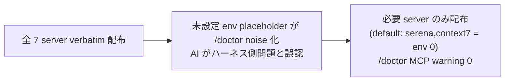

<!--
task-21 W2.4 frontmatter (機械可読、draft-flow-guard.sh / harness-audit が読む):
approval_required: true
approved_at: 2026-07-05
approved_by: user (kfurutani@classlab.co.jp)
retroactive: false
-->

# .mcp.json 配布 minimal default + opt-in flag (`--mcp-servers=<csv>`)

**ステータス:** 📝 **draft（2026-07-05 起案、user 承認待ち）**
**起点:** master roadmap [install-immediately-usable-redesign-20260618.md](install-immediately-usable-redesign-20260618.md) §4.4 (R5) 対策 A + §5 P1-6 (`docs/tasks/list.md:247` row #90。**依存先は `—` (並列) を採用** — 現行 list.md の「依存先 task-87」は roadmap §7.1「P1-5/6/7 は並列 OK」+ §7.2 DAG (P1-3→P1-6 辺なし) と矛盾する誤記のため、`/new-task 90` 時に main が依存先列を `—` へ修正する。§9 未決事項 4 参照)
**前提:**
- PR #68 HOTFIX 済 (main merge 済): install.sh §6.4 が consuming repo に `harness-config.local.yml` を create-if-absent 生成 (team-default + 8 toggle true)。hc-config.sh --get/--summary は local.yml tier 対応済。**本 draft は当該 scope を再実装しない** (前提事実のみ)
- install.sh §3 (`install.sh:344-356`) が `.mcp.json` 配布の現行実装 (既存 keep-as-is / 不在なら全 7 server verbatim cp)
- task #87 (P1-3 self-doctor) は本 task の **依存先ではなく契約 consumer** (順序依存なし・並列可、roadmap §7.1/§7.2)。#87 側 draft D7 が `${VAR}` 走査 (`grep -oE '\$\{[A-Z_]+\}' .mcp.json`、`install-self-doctor.md:83`) を既に仕様化済で、本 draft §3 D5 はその契約との整合確認のみ行う (実行順依存は双方向とも無い)

**関連 fixture / rule:**
- `.mcp.json` (source SSoT、7 server 定義)
- `install.sh` §3 / §6.3 (jq optional fail-open 先例 `install.sh:489-490`) / §6.4 (mktemp X 末尾 + fail-open 先例 `install.sh:533-568`)
- `.claude/tests/install-local-yml-smoke.sh` (7 case、install 系 smoke の先例) / `.claude/tests/run-all-smokes.sh` (portability カテゴリ登録 `run-all-smokes.sh:70-74`)

---

## 1. 真因サマリ / 課題サマリ

install.sh §3 は target に `.mcp.json` が無い場合、source の全 7 MCP server (github / salesforce / agent-browser / asana-pat / slack / serena / context7) を verbatim copy する (`install.sh:351-352`)。うち 4 server は env secret 前提のため、Asana / Slack / Salesforce 連携を使わない consuming repo でも `${ASANA_PAT}` 等の未設定 placeholder が残り、`/doctor` が install 直後から「setup issues: MCP」を報告し続ける (subscbase-api 2026-06-18 実機: statusline `8 setup issues: settings, MCP`)。AI がこの noise を「ハーネス側問題」と誤認識して別 path へ逃げる誘因になった (roadmap §1.2 R5)。



**真因:** `.mcp.json` 配布が all-or-nothing (`--no-mcp` で全 skip か、全 7 server 配布か) で、server 単位の選択肢が無い。

**副次:** harness が実際に依存するのは serena (`/save-state` `/resume-state` `/pm-start` の Serena MCP 必須、`install.sh:345` コメント + `workflow.md` §Session 永続化) と context7 (`development-process.md` §研究の fallback chain default) の 2 つのみで、env 不要。残り 5 server は project 依存の opt-in で足りる。

### server 分類 (source `.mcp.json` 実測、2026-07-05)

| server | 定義行 | 実行系 | env 前提 | 分類 |
|---|---|---|---|:---:|
| serena | `.mcp.json:40-50` | uvx (git+serena) | なし | **default** (harness session 永続化に必須) |
| context7 | `.mcp.json:51-59` | npx | なし (`env: {}`) | **default** (研究 fallback chain) |
| agent-browser | `.mcp.json:21-24` | npx | なし | opt-in (UI task 限定、agent-browser skill 経由でも利用可) |
| github | `.mcp.json:3-9` | http | `GITHUB_PAT` (`.mcp.json:7`) | opt-in |
| asana-pat | `.mcp.json:25-31` | npx | `ASANA_PAT` (`.mcp.json:29`) | opt-in (`mode.yml:28 asana_enabled` と意味的に対応) |
| slack | `.mcp.json:32-39` | npx | `SLACK_MCP_XOXP_TOKEN` / `SLACK_MCP_ADD_MESSAGE_TOOL` (`.mcp.json:36-37`) | opt-in |
| salesforce | `.mcp.json:10-20` | npx | env 5 件 (`.mcp.json:14-18`) | opt-in |

---

## 2. 解決アプローチ比較

| 案 | 内容 | 工数 | メリット | デメリット |
|:---:|:---|---:|:---|:---|
| **A** | `install.sh --mcp-servers=<csv>` (default `serena,context7`、特殊 token `all`)。source `.mcp.json` を SSoT とし install 時に jq で server 単位 filter 生成。jq 不在時は WARN + 全配布 fallback | 0.5 day | SSoT 1 枚維持 (drift なし)、default で env placeholder 0 → /doctor MCP warning 0、既存 `--no-mcp` と直交、§6.3 の jq optional fail-open 先例と一貫 | jq 不在環境では従来同等の noise (ただし regression ではない) |
| **B** | wizard モード (`--interactive`) で server を 1 つずつ y/N 確認 (roadmap 対策 B) | 1.5 day | 柔軟 | install.sh の非対話原則 (現状 block なし、warn + sleep 3 のみ `install.sh:149-159`) を破る。CI / scripted install と両立しない。csv arg は wizard の将来実装でも下層として必要 → 先に A |
| **C** | `mode.yml` の `asana_enabled: false` で asana entry を auto-strip (roadmap 対策 C、`feature_asana_enabled` 新設) | 1.0 day | asana は既存 toggle と連動 | asana 単点対処で slack / salesforce / github の noise が残る。install 時点で target の mode.yml が未生成 / unset (mode-asana-prompt.sh ヒアリング前) のケースで判定不能。**案 A の default (asana 不含) が同効果を包含** → 却下 (asana on 時の追加導線は §4 open question) |
| **D** | 静的 minimal template (`.mcp.minimal.json`) を別 file で harness に持ち 2 枚配布切替 | 0.5 day | jq 不要 | `.mcp.json` SSoT の二重化 → server 定義 drift (I1 Config SSoT 違反、`feedback_config_value_needs_consumer_and_smoke` 系の飾り file 化リスク)。csv 自由選択も不可 → 却下 |

→ **案 A** を推奨。理由: SSoT 単一維持 + default で /doctor MCP warning 0 化 + 既存 flag 体系 (`--no-mcp`) と直交し、jq optional の既存 fail-open 契約 (`install.sh:472,489-490`) と実装様式が揃う。

---

## 3. 採用案の詳細設計

### Task 計画 (採用 6 条準拠、Phase 中間階層廃止)

**Goal**: `bash install.sh <target>` 既定実行で `.mcp.json` が serena + context7 のみで配布され (env placeholder 0)、`--mcp-servers=<csv>` / `all` で opt-in server を選択配布できる。

#### Step 計画

| Step | Status | 作業概要 | 工数 | 依存 |
|:---:|:---:|:---|---:|:---|
| 1 | 🔲 | install.sh arg parse 拡張 (`--mcp-servers=<csv>` + 検証 + `--no-mcp` conflict) | 0.5h | — |
| 2 | 🔲 | §3 配布 logic の csv filter 化 (jq filter / all / fallback / dry-run / summary 出力) | 1.5h | Step 1 |
| 3 | 🔲 | smoke `.claude/tests/install-mcp-servers-smoke.sh` 新設 (10 case) + run-all-smokes 登録 + docs 反映 | 1.0h | Step 2 |
| 4 | 🔲 | (テスト設計レビュー) reviewer 動的選定 `review_min_count_test ≤ N ≤ review_max_count_test` (`hc-config.sh --get` で上限確認) | 0.5h | Step 3 |
| 5 | 🔲 | (テスト合格) 新 smoke 10/10 + 既存 install 系 smoke regression 0 | 0.5h | Step 4 |
| 6 | 🔲 | (リファクタリング) 3 観点判定 or `skip: <reason>` 明示 | 0.3h | Step 5 |

合計: 約 4.3h (roadmap 見積 0.5 day と整合)

### Step 1 詳細 — arg parse 拡張

#### スコープ
- 対象ファイル: `install.sh` (arg parse block `install.sh:52-117`、usage `install.sh:5,109`)

#### 変更内容
```bash
# 変数追加 (install.sh:58 WITH_MCP=true の直後)
MCP_SERVERS="serena,context7"   # minimal default (task-90)
MCP_SERVERS_SET=false

# case 分岐追加 (install.sh:84 --no-mcp の後)
--mcp-servers=*)
  MCP_SERVERS="${arg#--mcp-servers=}"
  MCP_SERVERS_SET=true
  ;;
```

検証 (arg loop 後、`install.sh:108-117` 付近):
1. `--no-mcp` と `--mcp-servers=` の併用 → `exit 64` (「全 skip」と「選択配布」は矛盾、`--commit` requires `--update` の既存 conflict 検出様式 `install.sh:114-117` に倣う)
2. 空 csv (`--mcp-servers=`) → `exit 64`
3. token 形式: 各 token は `^[A-Za-z0-9][A-Za-z0-9_-]*$`、不一致 → `exit 64`
4. `all` は単独 token のみ許可 (`all,serena` → `exit 64`)
5. source `.mcp.json` に対する key 実在検証は Step 2 (jq 存在時のみ、fail-fast で typo 防止。jq 不在時は skip + WARN)

### Step 2 詳細 — §3 配布 logic の csv filter 化

#### スコープ
- 対象ファイル: `install.sh` §3 (`install.sh:344-356`) + §8 summary (`install.sh:758-779`)

#### 変更内容 (§3 rewrite、擬似 diff)
```bash
if $WITH_MCP; then
  if [[ -f "$TARGET/.mcp.json" ]]; then
    # 現行維持: 既存 keep-as-is (install.sh:348-349)。merge しない (冪等・非破壊)
    echo "[install] existing .mcp.json detected → keep as-is"
    $MCP_SERVERS_SET && echo "[install] NOTE: --mcp-servers は既存 .mcp.json には適用しない (manual merge)"
  elif [[ "$MCP_SERVERS" == "all" ]]; then
    run cp "$SCRIPT_DIR/.mcp.json" "$TARGET/.mcp.json"       # 従来動作 (全 7 server)
  elif command -v jq >/dev/null 2>&1; then
    # key 実在検証: jq -r '.mcpServers | keys[]' source に無い token → exit 64
    if $DRY_RUN; then
      echo "[dry-run] would generate .mcp.json (servers: $MCP_SERVERS)"   # raw redirect は run() 非経由のため明示分岐 (2026-07-05 review 反映)
    else
      # 生成: mktemp (X 末尾 + || true ガード、§6.4 先例 install.sh:536) + jq filter + if-wrapper mv
      TMP_MCP="$(mktemp "$TARGET/.mcp.json.XXXXXX" 2>/dev/null || true)"
      jq --arg csv "$MCP_SERVERS" \
        '{mcpServers: (.mcpServers | with_entries(select(.key as $k | ($csv | split(",")) | index($k))))}' \
        "$SCRIPT_DIR/.mcp.json" > "$TMP_MCP" 2>/dev/null || true
      # fail-open (D4): `... > "$TMP_MCP" && mv ...` の && list 終端 mv は失敗時に set -euo pipefail で
      # install 即死し fail-open 契約を破るため、§6.4 先例 (install.sh:563 `if [[ -s "$TMP_LOCAL" ]] && mv ...; then/else WARN`)
      # の if-wrapper 形を踏襲 (2026-07-05 review 反映)
      if [[ -n "$TMP_MCP" && -s "$TMP_MCP" ]] && jq . "$TMP_MCP" >/dev/null 2>&1 && mv "$TMP_MCP" "$TARGET/.mcp.json"; then
        echo "[install] .mcp.json 生成 (servers: $MCP_SERVERS)"
      else
        echo "[install] WARN: .mcp.json filter 生成失敗 → 全 server 配布 fallback (fail-open、install 継続)" >&2
        rm -f "$TMP_MCP" 2>/dev/null || true
        run cp "$SCRIPT_DIR/.mcp.json" "$TARGET/.mcp.json"
      fi
    fi
  else
    echo "[install] WARN: jq 不在のため .mcp.json server 選択 skip → 全 server 配布 (従来動作)" >&2
    run cp "$SCRIPT_DIR/.mcp.json" "$TARGET/.mcp.json"
  fi
else
  echo "[install] (--no-mcp) skip .mcp.json"                 # 現行維持 (install.sh:355)
fi
```

設計決定 (parent 設計論点 (1)-(5) 対応):

| # | 論点 | 決定 |
|---|---|---|
| D1 | minimal default set | `serena,context7` (§1 分類 table 根拠: harness 必須 2 種 = env 0 件)。agent-browser は env 不要だが harness core 非依存 + skill 経由代替ありで opt-in |
| D2 | `--no-mcp` との関係 | `--no-mcp` = 全 skip (最優先、併用は exit 64)。`--mcp-servers` = 選択配布。**既定値変更**: flag 無し新規 install は全配布 → minimal 配布へ (breaking、§4 リスク 1) |
| D3 | 既存 `.mcp.json` merge 方針 | **keep-as-is 維持** (server 単位 merge は不採用: user が意図的に削った server の再注入事故 + jq 必須化 + 非破壊原則違反)。`--update` mode も現行どおり触らない (`install.sh:11`)。再実行冪等 |
| D4 | jq 依存 | optional (§6.3 先例と同契約)。jq 不在 fallback = **全配布 + WARN** (skip だと serena 不在で `/save-state` 系が壊れ機能 regression になるため。全配布は従来同等動作 = regression 0、noise は従来並み) |
| D5 | /doctor 連動 (#87 契約整合) | (a) minimal default では `.mcp.json` 内 `${VAR}` placeholder が 0 になり、#87 self-doctor D7 の「期待値内 absorb」対象 MCP env 項目自体が 0 件。(b) opt-in server 選択時は install summary (§8) に「選択 server の必要 env 一覧」(例: `asana-pat → ASANA_PAT`) を提示。#87 側の `${VAR}` 走査は #87 draft D7 (`install-self-doctor.md:83`、`grep -oE '\$\{[A-Z_]+\}'`) が既に仕様化済 — 本 draft は target `.mcp.json` が常に valid JSON かつ配布 server の env 定義が source verbatim であることを保証して D7 走査と契約整合する (実装は #87、順序依存なし・並列可) |

#### §8 summary 追記
`install.sh:769` Next steps に配布 server 一覧 1 行 + opt-in server 選択時のみ必要 env 一覧を出力 (例: `MCP servers: serena, context7 (opt-in 追加: --mcp-servers=serena,context7,asana-pat)`)。

### Step 3 詳細 — smoke 新設 + 登録 + docs

- `.claude/tests/install-mcp-servers-smoke.sh` 新設 (10 case):
  1. default install → `jq -r '.mcpServers|keys[]'` が serena / context7 の 2 key のみ
  2. 生成 `.mcp.json` が valid JSON (`jq . ; rc=0`) かつ placeholder 0 — assertion は `[ "$(grep -c '\${' "$f" || true)" -eq 0 ]` 形式必須 (`grep -c` は match 0 件で rc=1 を返すため `|| true` なしでは smoke の `set -e` 下で誤 FAIL、2026-07-05 review 反映)
  3. `--mcp-servers=serena,context7,asana-pat` → 3 key + asana-pat env block が source と一致
  4. `--mcp-servers=all` → key set が source `.mcp.json` と完全一致
  5. 未知 token (`--mcp-servers=serena,typo-server`) → exit 64 + error message
  6. `--no-mcp --mcp-servers=serena` 併用 → exit 64
  7. 既存 `.mcp.json` あり + `--mcp-servers=` 指定 → keep-as-is (diff 0) + NOTE 出力
  8. jq 不在 simulation (PATH 制限 wrapper) → WARN + 全 7 server 配布 fallback
  9. `--dry-run` → target に `.mcp.json` 非生成
  10. 再実行冪等 (2 回目 install で diff 0)
- `run-all-smokes.sh` の portability カテゴリ (`run-all-smokes.sh:70-74`、install-local-yml-smoke と同区分) に登録
- docs 反映: `install.sh` header usage (`install.sh:5,23`) + README install セクションに `--mcp-servers` 追記。**header 行数変更時は `-h` の `sed -n '2,48p'` 範囲 (`install.sh:90`) を同 commit で更新する** (task-79 前例。install.sh 同時改修 4 task (85/87/89/90) の競合下では行番号でなく § marker / pattern anchor で位置特定、2026-07-05 review 反映)

### Step 4-6 詳細 (Task 最終 3 Steps、固定)

- **Step 4 (テスト設計レビュー)**: reviewer 動的選定 (`tdd-guide` / `test-automator` / `qa-expert` / `pr-test-analyzer` base + shell/install domain)、起動前に `bash .claude/scripts/hc-config.sh --get review_max_count_test` で上限確認、収束まで反復 (上限 `review_iteration_max`、bypass `ECC_TEST_DESIGN_REVIEW_OFF=1`)
- **Step 5 (テスト合格)**: 新 smoke 10/10 PASS + 既存 install 系 smoke (install-local-yml 7 case / install-sh-regen-settings / install-sh-overwrite-all / install-sh-sync-drift) regression 0。UI なし task のため E2E / visual 不要
- **Step 6 (リファクタリング)**: 3 観点 (持続可能性 / 汎用性 / 非冗長化)。§3 block が肥大する場合は install.sh 内関数 (`distribute_mcp_json()`) へ抽出を判定、不要なら `skip: <reason>` 明示

---

## 4. リスクと緩和

| リスク | 確率 | 影響 | 緩和 |
|---|:---:|:---:|---|
| **既定値変更の breaking**: 全配布前提だった新規 install 手順 (asana / slack 利用 project) が minimal になり MCP 不足 | M | M | `--mcp-servers=all` で従来動作 1 flag 復元 + summary に opt-in 導線明示 + README 記載。既存 repo は keep-as-is で無影響 |
| jq filter の query bug で不正 JSON 生成 | L | H | 生成後 `jq . ` validate + `-s` 空判定、fail 時は全配布 fallback (fail-open)。smoke case 2/3/4 で機械検証 |
| jq 不在環境で /doctor noise が残る | M | L | 従来同等動作 = regression 0。WARN で手動選択手順を案内 |
| list.md #90 概要欄の「mode.yml asana_enabled 連動 strip」(対策 C) を本設計で不採用にする scope 差分 | — | M | §2 案 C 却下理由のとおり案 A default が効果を包含。**user 承認時に scope 確定要** (下記 open question)。`/mode asana on` 時の `.mcp.json` への asana entry 追加案内は follow-up (next-actions entry 候補) |
| serena が uvx 依存で target 環境に uv 不在 → 起動失敗 | M | L | 本 task 対象外 (配布内容の問題ではなく実行環境)。check-serena-mcp.sh (SessionStart) が既存検出 |

---

## 5. 移行計画

- [ ] Step 1-2 実装後、`--dry-run` + tmp dir 実 install で手元検証
- [ ] smoke 10 case + 既存 install 系 smoke で regression 確認
- [ ] README / install.sh header 反映
- [ ] consuming repo への伝搬は通常の `install.sh --update` 経路 (既存 `.mcp.json` は touch されないため既存 repo 無影響)
- [ ] (本 task 外、並列 task #87) self-doctor D7 走査 (`install-self-doctor.md:83`) が本 task の配布結果 (minimal = `${VAR}` 0 / opt-in = source verbatim env block) と契約整合することを #87 実装時に検証

---

## 6. 完了条件（DoD）

- [ ] `bash install.sh /tmp/dummy-repo` 直後: `jq -r '.mcpServers|keys[]' /tmp/dummy-repo/.mcp.json | sort` = `context7` + `serena` の 2 行のみ
- [ ] 同 target: `[ "$(grep -c '\${' /tmp/dummy-repo/.mcp.json || true)" -eq 0 ]` PASS (env placeholder 0 = /doctor MCP env warning 発生源 0。`grep -c` 単体は match 0 件で rc=1 のため `|| true` 形必須)
- [ ] `bash install.sh /tmp/dummy2 --mcp-servers=all` で key set が source と一致: `diff <(jq -S '.mcpServers|keys' .mcp.json) <(jq -S '.mcpServers|keys' /tmp/dummy2/.mcp.json)` = 空
- [ ] `bash install.sh /tmp/dummy3 --mcp-servers=serena,typo` → exit code 64
- [ ] `bash .claude/tests/install-mcp-servers-smoke.sh` → 10/10 PASS
- [ ] 既存 install 系 smoke regression 0: `bash .claude/tests/install-local-yml-smoke.sh` 7/7 ほか §3 Step 5 列挙分 PASS
- [ ] `bash .claude/tests/run-all-smokes.sh` に新 smoke が portability カテゴリで登録済 (grep で確認)
- [ ] docs 反映 (install.sh header + README) を grep で確認: `grep -c 'mcp-servers' install.sh README.md` ≥ 各 1

---

## 7. 工数見積

合計 約 0.5 day (Step 1: 0.5h / Step 2: 1.5h / Step 3: 1.0h / Step 4-6: 1.3h)。roadmap §5 P1-6 見積 (0.5 day、conf 0.85) と整合。

---

## 8. レビューサイクル (workflow.md §「収束条件」準拠)

> draft レビューは reviewer 並列起動 (`review_min_count_design ≤ N ≤ review_max_count_design`) + CRITICAL/HIGH/MEDIUM = 0 まで反復 (LOW 許容、上限 `review_iteration_max`)。

| iter | 日付 | reviewer (起動数) | CRITICAL | HIGH | MEDIUM | LOW | 修正 commit | 状態 |
|:---:|---|---|:---:|:---:|:---:|:---:|---|---|
| — | — | (未実施) | — | — | — | — | — | 起案直後 |

---

## 9. 承認履歴

| 日付 | 承認者 | 結果 |
|---|---|---|
| — | — | (承認待ち。承認後 `/new-task 90 mcp-json-minimal-default` で 📝 → 🔲 update) |

> 承認記入は先頭 HTML comment frontmatter の承認日 field (file 内 1 箇所) のみに行う (7 draft frontmatter 統一、2026-07-05 review 反映)。

**user 確認が必要な未決事項:**
1. list.md #90 概要欄の「mode.yml asana_enabled 連動 strip」(roadmap 対策 C) を本 task scope から外す (§2 案 C 却下、案 A default が効果包含) ことの承認。`/mode asana on` 時の asana entry 追加導線は follow-up 化
2. 新規 install の既定値を全配布 → `serena,context7` minimal に変更する breaking の承認 (`--mcp-servers=all` で従来動作復元可)
3. jq 不在時 fallback を「全配布 + WARN」(機能優先) とする方針の承認 (代替: skip + WARN は serena 欠落で /save-state 系が壊れるため非推奨)
4. **list.md #90 の依存先列を task-87 → `—` へ修正する承認**: 現行 `docs/tasks/list.md:247` の「依存先 task-87」は roadmap §7.1「P1-5/6/7 は並列 OK」+ §7.2 DAG (P1-3→P1-6 辺なし) と矛盾する誤記で、resume-state Phase 6 の自律 enqueue 順が #90 を #87 の後ろへ不要に直列化する。#87 は依存先ではなく契約 consumer (§3 D5、順序依存なし)。list.md は main 専任のため `/new-task 90` 実行時に main が依存先列を `—` へ更新する

---

## 10. 関連

- 既存設計: [install-immediately-usable-redesign-20260618.md](install-immediately-usable-redesign-20260618.md) §4.4 / §5 P1-6 / §7.1 並列判定 / §7.2 DAG + [install-self-doctor.md](install-self-doctor.md) D7 (`${VAR}` 走査契約、`install-self-doctor.md:83`)
- 関連タスク: #90 (本 task、`docs/tasks/list.md:247`、依存先 `—` 採用 — §9 未決事項 4) / #87 (P1-3 self-doctor、契約 consumer — D5/D7 走査契約の実装側、順序依存なし・並列可) / #91 (P1-7、並列可)
- 関連実装: `install.sh:344-356` (§3 現行) / `install.sh:489-490` (jq optional 先例) / `install.sh:533-568` (mktemp + fail-open 先例) / `.mcp.json:2-61` (source SSoT) / `.claude/mode.yml:28` (asana_enabled) / `.claude/hooks/mode-asana-prompt.sh` (案 C 却下根拠の既存 hook)
