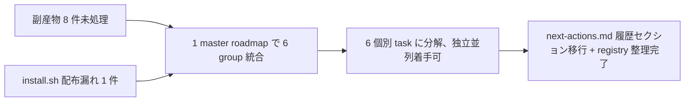

<!--
approval_required: true
approved_at:
approved_by:
retroactive: false
-->

# next-actions cleanup batch (6 group 統合 master roadmap)

**ステータス:** 🔲 **draft（2026-05-25 起案、user 承認待ち）**
**起点:** 2026-05-25 session (resume-state 後) — next-actions.md 未処理 entry 8 件レビュー + `bash install.sh --update` 引き継がれない項目調査で発覚した配布漏れ 1 件 = 計 9 件副産物の統合 cleanup
**前提:**
- task-36 + task-37 全 9 Step 完遂 (commits `cc0cd3f`〜`39dae89` 7 件、push 待ち)
- task-39 緩和 (feature branch push + gh pr create 自律実行可) は実装済
- 採用 6 条 (Task=Phase=N Step、Phase 中間階層廃止、2026-05-25 採用) 適用フェーズ
- 本 draft は **master roadmap** として `task-management.md §plan-first 経路 B (batch planning)` を適用、user 承認後 list.md に 6 行 📝 batch 先置き → 各 group の個別 draft 起案 → `/new-task` で 📝 → 🔲 update

**関連 fixture / rule:**
- `.claude/rules/task-management.md` §plan-first (経路 B batch planning 規範化、task-33 起源)
- `.claude/rules/task-management.md` §タスク構造規範 (採用 6 条、2026-05-25)
- `.claude/rules/development-process.md` §「副産物発生時の即時 draft 起こし義務」
- `docs/tasks/next-actions.md` (副産物 registry SSoT)
- `install.sh` L255 templates 配置ロジック

---

## 1. 真因サマリ / 課題サマリ

本セッションで次の 2 経路から計 9 件の副産物が確認された:

1. **next-actions.md レビュー** (`/resume-state` 後): 未処理 entry 12 件中 8 件が未着手 (#22 / #25 / #26 / #27 / #28 / #29 / #30 / #31)、いずれも task-37 reviewer iter1 / task-39 緩和 / 採用 6 条規範化 / parallel-subagent-reminder 由来の polish or 構造修正
2. **install.sh `--update` 調査**: user 質問「引き継がれない項目」で次の構造 gap を発見 — `next-actions.md` (副産物 registry SSoT) が install.sh の templates 配置リスト (L255) に未登録、新規 install 時 target project に生成されない → 規範前提を満たさない構造的 gap

**真因:**
- task 完遂後の副産物 entry 起票はされているが、個別 task 化のタイミングが user 判断委ね → 蓄積 (8 件)
- install.sh templates 配置リストが hardcode (L255 `for f in list.md parking-lot.md _TASK_TEMPLATE.md`) で SSoT 規範整備時に同期更新されない

**副次:**
- next-actions.md 規範運用 (副産物発生 → 即 draft 起こし) が「entry 追加まで」で停止しがち、draft 化 → task 化 → list.md 反映の 3 ステップ目以降が遅れる
- install.sh templates 配置リスト拡張時に `next-actions.md` 以外にも漏れがある可能性 (`.claude/templates/docs/tasks/` 配下 file 全件チェック必要)

---

## 2. 解決アプローチ比較

| 案 | 内容 | 工数 | メリット | デメリット |
|:---:|:---|---:|:---|:---|
| **A** | 8 件全てを **個別 task** で起票 (group なし) | 4-6h | 各 entry 独立、依存最小 | task 数膨張 (8 個)、management 負荷高、似た cosmetic 修正で commit 散乱 |
| **B** | 1 統合 task で **全 9 件まとめて修正** | 2-3h | task 1 件で完結、PR 1 本 | scope 大、reviewer 評価困難、1 commit が巨大、test 設計レビュー が分野横断で発散 |
| **C ハイブリッド (推奨)** | **6 group 統合 master roadmap** → 各 group 個別 task | 3-4.5h | 関連 entry の集約 commit、独立並列着手可、reviewer scope 明確 | master roadmap + 6 task の 2 階層管理 |

→ **C ハイブリッド** を推奨。理由:
- task-39 polish (Group A) と task-37 reviewer 文書 (Group B) は **scope 異質**、別 task で commit log の意図が明瞭
- parallel-subagent-reminder cosmetic 3 件 (Group D) は **同 hook 系列の polish**、1 task で並列 fix 可
- install.sh 配布漏れ (Group F) は **独立構造修正**、reviewer scope (install.sh + template) 明確
- 6 task のうち file 領域独立な組 (A + C / B + F 等) は並列着手可、user 体感速度向上

---

## 3. 採用案の詳細設計

### Master roadmap (6 group、各 group = 1 task)

| group | 含む entry | 何のため | 何をやる (概要) | 工数 | 緊急度 |
|:---:|---|---|---|---|:---:|
| **A** | #25 + #26 + #31(1) | task-39 緩和実装後の事後 polish (smoke 期待値同期 + 文書数値同期) | 旧 autonomous-action-guard-smoke deprecated 化 + loop-auto-progress + autonomous smoke Case 期待値更新 + draft/task 文書の数値同期 | 30-45 min | 🟡 |
| **B** | #31(2) + #31(3) | task-37 reviewer iter1 指摘の構造修正 (CLAUDE.md polish + bypass log 追加) | CLAUDE.md L146 教訓 entry 文言改善 + list-md-plan-first-reminder.sh silent exit を bypass.log 記録に置換 | 30-45 min | 🟡 |
| **C** | #22 | 採用 6 条規範化 (Phase 中間階層廃止) への smoke 整合 | task-rule-guard-smoke Case 6/7/9 を採用 6 条準拠に書換 + _TASK_TEMPLATE.md 整合性確認 | 30-45 min | 🟡 |
| **D** | #28 + #29 + #30 | task-38 iter5 reviewer 由来 3 件の cosmetic 改善 (信号純度 + carverage + log noise 解消) | smoke Case 10 description 中立化 + exclude keyword 活用形拡張 + bypass-logger.sh stderr leak fix | 30-45 min | 🟢 |
| **E** | #27 | 規範 (modes.md 遵守事項 7 / why-x5-output.md L36) vs 実装乖離の構造修正 (3 hook 配線欠落 + CLAUDE.md HIGH 違反同時修正) | settings.json UserPromptSubmit に 3 hook 配線 + mode-enforce.sh subshell 化 + 配線 smoke 追加 | 60-90 min | 🟡 |
| **F** (新規) | install.sh 配布漏れ | 副産物 registry の SSoT (next-actions.md) が project install 時に生成されない構造 gap 解消 | install.sh L255 templates 配置リストに next-actions.md 追加 + .claude/templates/docs/tasks/next-actions.md 新規作成 + 配布漏れ全件監査 | 30-45 min | 🟡 |

**合計推定**: **210-315 分 (3.5-5.25 時間)**

### Group A 詳細 (task-39 polish)

- **対象 file**:
  - `.claude/tests/autonomous-action-guard-smoke.sh` (header に DEPRECATED コメント + Case 1/2/4 後継 mapping 注釈)
  - `.claude/tests/loop-auto-progress-smoke.sh` (Case 4/5/9 期待値更新: feature branch push + gh pr create + 引数なし push が block → pass)
  - `docs/draft/autonomous-action-guard-relaxation.md` (§4.4 見出し `7 cases` → `12 cases`)
  - `docs/tasks/task-39-autonomous-action-guard-relaxation.md` (L108 Step 1 完了条件 `5 case` → `12 cases`)
- **DoD**: smoke 6 件 FAIL → PASS、文書 3 箇所数値同期、CI 全 PASS

### Group B 詳細 (task-37 reviewer 文書 polish)

- **対象 file**:
  - `CLAUDE.md` L146 教訓 entry: タイトル「メインが〜しない」形式に統一 + bypass 表記非対称明示 + DoD grep コマンド 3 件追記
  - `.claude/hooks/list-md-plan-first-reminder.sh` L69-71 silent exit を `lib/bypass-logger.sh` 経由の bypass.log 記録に置換 + smoke 追加
- **DoD**: CLAUDE.md grep 3 件 PASS、`HC_LIST_PLAN_FIRST_REMINDER_ENABLED=false` 時 bypass.log に追記される smoke PASS

### Group C 詳細 (task-rule-guard-smoke phase section 修正)

- **対象 file**:
  - `.claude/tests/task-rule-guard-smoke.sh` Case 6/7/9 (Phase 計画 section 検証 → Step 計画 section 検証 or 削除)
  - `.claude/templates/docs/tasks/_TASK_TEMPLATE.md` (採用 6 条準拠の section 構造再確認)
- **DoD**: task-rule-guard-smoke 17/17 PASS (現状 8/11 → 11/11、Case 6/7/9 修正 or 削除)

### Group D 詳細 (parallel-subagent-reminder cosmetic 統合)

- **対象 file**:
  - `.claude/tests/parallel-subagent-reminder-smoke.sh` Case 10 description (#28、中立 keyword 化)
  - `.claude/hooks/parallel-subagent-reminder.sh` exclude keyword regex (#29、`(reviewed|reviewing|reviews)?` 拡張、user 判断要)
  - `.claude/hooks/lib/bypass-logger.sh` log_file open redirect (#30、`{ ... } 2>/dev/null` block 化)
- **DoD**: parallel-subagent-reminder smoke 全 PASS、`chmod 000` シナリオで stderr 漏れなし
- **注**: #29 は運用影響極小、user 判断で skip 可

### Group E 詳細 (reminder hooks 配線 + subshell 化)

- **対象 file**:
  - `.claude/settings.json` UserPromptSubmit 配列に 3 hook 追加 (`loop-auto-progress-reminder.sh` / `mode-enforce.sh` / `why-x5-reminder.sh`)
  - `.claude/hooks/mode-enforce.sh` file-top `set -uo pipefail` を `do_work() ( set -uo pipefail; ... )` で subshell 関数化 (CLAUDE.md HIGH 違反修正)
  - `.claude/tests/reminder-hooks-usersubmit-wiring-smoke.sh` (新規、3 hook 各々 UserPromptSubmit 発火検証)
- **DoD**: 3 hook が UserPromptSubmit で発火 (mock event で確認)、mode-enforce.sh が caller shell flags に leak しない (CLAUDE.md HIGH 違反解消)

### Group F 詳細 (install.sh 配布漏れ修正、新規 entry)

- **対象 file**:
  - `install.sh` L255 templates 配置リストに `next-actions.md` 追加: `for f in list.md parking-lot.md next-actions.md _TASK_TEMPLATE.md`
  - `.claude/templates/docs/tasks/next-actions.md` (新規作成、現 `docs/tasks/next-actions.md` の header + 凡例 + 空 entry table をベース)
  - install.sh L255 配布漏れ全件監査 (`.claude/templates/docs/tasks/` `.claude/templates/docs/draft/` 配下 file リスト vs install.sh の hardcode リスト 比較)
- **DoD**: 新規 install で target project に `docs/tasks/next-actions.md` が template 生成される、`bash install.sh --dry-run` で確認、配布漏れ 0 件監査

### Task 計画 (採用 6 条準拠、各 group = 1 task = N Steps)

各 group の個別 draft は本 master roadmap 承認後に `/new-draft <slug>` で起こす。各 task は採用 6 条準拠で:

| group | task slug 案 | 推定 Steps 数 |
|:---:|---|---|
| A | `task-39-followup-polish` | 4 Steps (smoke 更新 + 文書同期 + テスト合格 + refactor skip) |
| B | `task-37-reviewer-polish` | 5 Steps (CLAUDE.md 文言 + hook bypass log + smoke + テスト合格 + refactor skip) |
| C | `task-rule-guard-smoke-phase-fix` | 4 Steps (smoke 書換 + template 確認 + テスト合格 + refactor skip) |
| D | `parallel-reminder-cosmetic-batch` | 5 Steps (3 cosmetic fix + テスト合格 + refactor skip) |
| E | `reminder-hooks-usersubmit-wiring` | 6 Steps (settings.json 配線 + subshell 化 + 新規 smoke + テスト設計レビュー + テスト合格 + refactor) |
| F | `install-sh-next-actions-template` | 5 Steps (install.sh 更新 + template 新規 + 配布漏れ監査 + dry-run 確認 + refactor skip) |

各 task の最終 3 Steps はテスト設計レビュー → テスト合格 → リファクタリング (固定、採用 6 条 4)。

---

## 4. リスクと緩和

| リスク | 確率 | 影響 | 緩和 |
|---|:---:|:---:|---|
| 6 task 並列実装で commit conflict | M | H | file 領域独立 group は並列、依存 group は順次。Group A (smoke) + Group C (smoke 別 case) は同 smoke file 触る場合 commit conflict 可能性、順次推奨 |
| Group E (settings.json 配線) が `mode-enforce.sh` subshell 化と同時実施で regression | L | H | 段階適用: 先に subshell 化 + smoke で leak fix 確認 → 次に settings.json 配線 + 新規 smoke。各 step で smoke regression 0 確認 |
| Group F (install.sh 修正) で既存 project への影響 | L | M | `--dry-run` で全実行 path 確認、既存 `next-actions.md` ある project は skip ロジック有効 (既存保護) |
| 規範変更 (Group C 採用 6 条準拠) が他 smoke と衝突 | L | M | smoke 全件実行で regression check、CI 通過 |
| Group A の旧 smoke deprecated 化 が後続 task で参照される | L | L | header コメントで「後継 = autonomous-action-guard-relaxation-smoke.sh」明示、mapping 注釈 |

---

## 5. 移行計画

- [ ] 本 master roadmap user 承認 (§8 承認履歴記入)
- [ ] list.md に 6 行 📝 batch 先置き (経路 B step 2、main 直接 Edit、ID 払い出し: 既存最大 ID + 1〜+6)
- [ ] 各 group の個別 draft 起案 (subagent 並列可、§3 task slug 案参照)
- [ ] 各 draft user 承認 → `/new-task` で 📝 → 🔲 update
- [ ] 着手順序 (推奨): Group A + C 並列 → Group B + F 並列 → Group E 単独 → Group D (低優先、🟢)
- [ ] 全 task 完遂時に next-actions.md 該当 entry を「処理結果」列に移行先記入、履歴セクションへ移動

---

## 6. 完了条件（DoD）

- [ ] 本 master roadmap user 承認 + list.md に 6 行 📝 batch 先置き
- [ ] 各 group の個別 draft 起案 + user 承認 + task 化 (6 task)
- [ ] 各 task の DoD (§3 各 group 詳細参照) 充足
- [ ] next-actions.md 未処理 entry 8 件 + 新規 entry #32 (install.sh 配布漏れ) = 計 9 件全件処理 (移行先記入 + 履歴移動)
- [ ] 全 smoke regression 0、CI 全 PASS
- [ ] 各 task の reviewer 5+ 並列レビュー (採用 6 条 4) で HIGH 0 + MED 0 収束

---

## 7. 工数見積

| group | 工数 |
|:---:|---|
| A: task-39 polish | 30-45 min |
| B: task-37 reviewer 文書 polish | 30-45 min |
| C: task-rule-guard-smoke phase 修正 | 30-45 min |
| D: parallel-subagent-reminder cosmetic | 30-45 min |
| E: reminder hooks 配線 + subshell 化 | 60-90 min |
| F: install.sh 配布漏れ修正 | 30-45 min |
| **合計** | **210-315 min (3.5-5.25 時間)** |

並列着手による実時間圧縮 (file 領域独立 group の並列起動): 推定 **2.5-3.5 時間** (subagent 並列 reviewer iter1 集約込み)

---

## 8. 承認履歴

| 日付 | 承認者 | 結果 |
|---|---|---|
| 2026-05-25 | user | (承認待ち、承認後 list.md に 6 行 📝 batch 先置き → 6 task 個別起案) |

---

## 9. 関連

- 副産物 registry: [`docs/tasks/next-actions.md`](../tasks/next-actions.md) (entry #22 / #25 / #26 / #27 / #28 / #29 / #30 / #31 + 新規 #32)
- task-management 規範: [`.claude/rules/task-management.md`](../../.claude/rules/task-management.md) §plan-first 経路 B / §タスク構造規範 採用 6 条
- 関連完遂タスク: task-36 (rule-guard warn 注入) / task-37 (smoke 統合 + CLAUDE.md 教訓) / task-38 (parallel-subagent-reminder) / task-39 (autonomous-action-guard 緩和)
- 関連 hook: `.claude/hooks/task-rule-guard.sh` / `list-md-plan-first-reminder.sh` / `parallel-subagent-reminder.sh` / `mode-enforce.sh` / `loop-auto-progress-reminder.sh` / `why-x5-reminder.sh` / `lib/bypass-logger.sh`
- 関連 install: `install.sh` L255 (templates 配置リスト) / `.claude/templates/docs/tasks/`
