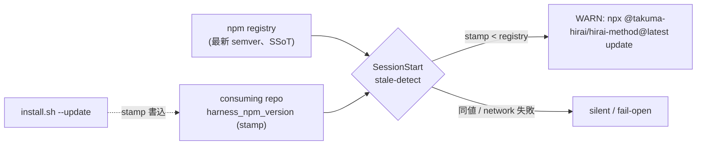

<!--
approval_required: true
approved_at: 2026-06-07
approved_by: user
retroactive: false
-->

# 準自動アップデート（SessionStart で npm registry 比較 → `npx ... update` を WARN 誘導）

**ステータス:** ✅ **承認済（2026-06-07、案 A 準自動で実装決定）**
**起点:** 自動アップデート roadmap【3】（user 指示 2026-06-06）。【1】project-rules 保護（task-82）+【2】npx CLI 化（task-83、PR #66 merged）完了を受けた最終段。
**前提:**
- 【2】task-83 完了: `bin/cli.js` の `check` が `https://registry.npmjs.org/@takuma-hirai%2Fhirai-method/latest` と semver 比較（`HIRAI_METHOD_REGISTRY_BASE` override 可）
- 既存 draft [`stale-harness-detection.md`](stale-harness-detection.md)（2026-05-28、未承認）が marker 欠落 + 日付 stamp の自己整合性検出までを設計、version 比較は「Phase 2 延期」
- install.sh が `--init`/`--update` 時に `harness_version`（`YYYY-MM-DD`）を consuming repo の `harness-config.yml` に stamp 済

**関連 fixture / rule:**
- `.claude/hooks/stale-harness-detect.sh`（stale-harness-detection.md で新設予定、本 task で registry 比較を追加 or 本 task で新設）
- `install.sh`（npm semver version stamp 追加先）
- `.claude/harness-config.yml`（`harness_npm_version` stamp + feature toggle）
- `bin/cli.js`（task-83、check ロジックの SSoT）

---

## 1. 真因サマリ / 課題サマリ

stale-harness-detection.md は「marker file 欠落」と「日付 stamp の自己整合性」で旧 harness を検出するが、**「source の最新版が何か」を知らない**（同 draft iter1 HIGH「version 比較の出所未定義」）。task-83 で npm registry という公開 version SSoT が手に入ったので、これを参照して「今の harness が最新か」を機械判定し、新版があれば `npx ... update` を 1 コマンドで促せる。

**ただし設計上の障壁（最重要）**: consuming repo は harness を **install.sh のファイルコピー**で受け取り、**npm package としては install されない**ため、ローカルに npm package.json の semver version を持たない。`harness_version`（日付）と npm registry の semver は型が違い直接比較できない（task-83 で確認済の version 二系統問題）。

**真因:** 旧 harness 稼働を検出する version 比較に「最新の出所（registry）」と「ローカルの版（stampされた semver）」の両端が揃っていなかった。task-83 で前者、本 task で後者（install.sh が npm semver を stamp）を揃える。

**副次:** 検出後の更新動線が「install.sh コマンドを思い出す」依存 → `npx ... update` の 1 コマンド誘導で解消。

---

## 2. 解決アプローチ比較

| 案 | 内容 | 工数 | メリット | デメリット |
|:---:|:---|---:|:---|:---|
| **A（準自動、roadmap 確定）** | install.sh が npm semver を stamp + SessionStart stale-detect が registry 比較（throttle + fail-open）→ 新版で WARN「`npx ... update`」。**適用は user の 1 コマンド** | 2.5 | 完全自動 push の事故リスクなし / 既存 stale-detect 設計と統合 / task-83 check ロジック再利用 | 適用は user 操作（完全自動ではない＝意図的） |
| **B（完全自動）** | SessionStart で新版検出時に自動で `npx ... update` 実行 | 3.5 | user 操作不要 | **危険**: session 開始毎に harness 書換 = 作業中の予期せぬ変更 / cross-repo write agent deny / 自律実行禁止カテゴリ抵触 |
| **C（CI のみ）** | GitHub Actions で定期 registry 比較 → PR 自動作成 | 3.0 | repo 横断管理 | 各 consuming repo に workflow 配布要 / SessionStart のリアルタイム性なし |

→ **案 A** を推奨（roadmap 確定）。理由: 完全自動（案 B）は「ガード更新が作業中に勝手に走る」事故源で modes.md 遵守事項 8（本番 deploy/cross-repo write）の思想に反する。**検出は自動・適用は user 1 コマンド**の準自動が安全と利便のバランス最良。CI（案 C）は将来 opt-in として併存可（stale-harness-detection.md の B 案と同様）。

---

## 3. 採用案の詳細設計

### Task 計画（採用 6 条準拠）

> 本 task は stale-harness-detection.md の version 比較（Phase 2 延期分）を task-83 の registry 比較で実現する位置づけ。stale-harness-detection.md の marker 欠落検出と統合 or 本 task で stale-detect 新設のいずれか（Step 1 で判断、既存 hook 不在なら本 task で新設）。

#### Step 計画

| Step | Status | 作業概要 | 工数 | 依存 |
|:---:|:---:|:---|---:|:---|
| 1 | 🔲 | install.sh に `harness_npm_version` stamp 追加（package.json の semver を `--init`/`--update` 時に consuming repo の harness-config.yml へ書込。既存 `harness_version` 日付 stamp と併存） | 0.4h | — |
| 2 | 🔲 | `stale-harness-detect.sh`（SessionStart）新設 or 拡張: throttle（1 日 1 回、cache marker）で registry latest を取得し `harness_npm_version` と semver 比較 → 新版で WARN「`npx @takuma-hirai/hirai-method@latest update <dir>`」。fail-open + feature toggle + bypass env + subshell 局所化 | 0.8h | 1 |
| 3 | 🔲 | semver 比較ロジックの SSoT 共有: cli.js の compareSemver/parseSemver（task-83 で module.exports 済）を hook から `node -e` 経由で再利用（重複実装回避）。registry 取得も `HIRAI_METHOD_REGISTRY_BASE` 尊重 | 0.4h | 2 |
| 4 | 🔲 | settings.json SessionStart 配線 + harness-config.yml feature key（`feature_stale_harness_detect_enabled`）+ throttle 間隔 key | 0.2h | 2 |
| 5 | 🔲 | npm publish guide / development-process.md §harness 取込 に「準自動検出 → npx update」動線を追記 | 0.2h | 2 |
| 6 | 🔲 | (テスト設計レビュー) reviewer 動的選定（min≤N≤max、hc-config 上限確認） | 0.4h | 5 |
| 7 | 🔲 | (テスト合格) smoke（stamp 古→WARN / 同値→silent / network 失敗→fail-open / throttle 2 回目 skip / feature OFF→no-op）+ regression 0 | 0.5h | 6 |
| 8 | 🔲 | (リファクタリング) 3 観点判定 or skip | 0.2h | 7 |

合計: 約 3.1h

### Step 1 詳細（install.sh semver stamp）
- install.sh が自身の `package.json` の `version`（semver）を読み、consuming repo の `harness-config.yml` に `harness_npm_version: "x.y.z"` として stamp（既存 `harness_version` 日付 stamp ロジック L506-540 付近に追加）
- これにより consuming repo は「npx package としては未 install だが、どの semver の harness を取り込んだか」を保持 → registry 比較が可能に

### Step 2-3 詳細（stale-detect registry 比較）
- SessionStart hook が **throttle**（前回 check から 24h 未満なら skip、cache marker file に timestamp）で registry latest を取得
- 取得 version vs `harness_npm_version`（stamp）を **cli.js の compareSemver 再利用**（`node -e "require('<path>/bin/cli.js')..."` or registry 取得込みで `node bin/cli.js check` 相当を hook 内 node ワンライナーで）で比較
- 新版あり → `<system-reminder>` で「新版 X あり（現 Y）。`npx @takuma-hirai/hirai-method@latest update <repo>` で更新」WARN（block しない、honor system）
- **fail-open**: network 失敗 / timeout / version 不明は silent（誤検出で開発を止めない）
- consuming repo に bin/cli.js が同梱されているか不確実な場合の fallback: hook 内に最小 semver 比較を持つ or registry JSON を直接 parse（SSoT は cli.js だが hook 単独動作も担保）

### Step 4-8 詳細（配線 + Task 最終 3 Steps）
- feature toggle `feature_stale_harness_detect_enabled`（既存 stale-harness-detection.md と統合）+ throttle 間隔 yml key
- Step 6 reviewer: tdd-guide / test-automator / qa-expert / pr-test-analyzer + harness-optimizer
- Step 7 smoke: 5 シナリオ（stamp 古→WARN / 同値→silent / network 失敗→fail-open / throttle skip / feature OFF→no-op）

---

## 4. リスクと緩和

| リスク | 確率 | 影響 | 緩和 |
|---|:---:|:---:|---|
| SessionStart 毎の registry 取得で起動遅延 / network 依存 | M | M | throttle（24h 1 回）+ fail-open（timeout 短く）+ feature toggle OFF 可 |
| consuming repo に bin/cli.js 不在で compareSemver 再利用不可 | M | M | hook 内 fallback semver 比較 or registry 直 parse（SSoT は cli.js、hook 単独動作も担保） |
| `harness_npm_version` stamp 漏れ（旧 install.sh で入れた repo は stamp なし） | M | L | stamp 不在は「version 不明」= fail-open silent（marker 欠落検出は stale-harness-detection.md 側が担当） |
| 誤検出（意図的旧版運用 repo で過剰 WARN） | L | L | WARN のみ（block しない）+ feature toggle OFF |
| 完全自動化への scope crept | L | M | 案 A 厳守（適用は user 1 コマンド、自動 push しない） |

---

## 5. 移行計画

- [ ] install.sh semver stamp 追加 → hirai-method 自身で stamp 確認
- [ ] stale-detect registry 比較実装 + 配線
- [ ] hirai-method で「同値→silent」、古い stamp fixture で「WARN」を smoke 実証
- [ ] 1 consuming repo で実機 WARN → `npx ... update` 適用フロー実証
- [ ] stale-harness-detection.md（marker 欠落検出）との統合 or 役割分担を確定

---

## 6. 完了条件（DoD）

- [ ] install.sh が `harness_npm_version`（semver）を consuming repo に stamp（既存 `harness_version` 日付と併存）
- [ ] SessionStart stale-detect が registry latest と stamp を比較、新版で `npx ... update` WARN（throttle + fail-open）
- [ ] semver 比較は cli.js の compareSemver 再利用（SSoT、重複実装回避）or hook fallback 明示
- [ ] feature toggle OFF / bypass env で no-op（smoke）
- [ ] smoke 5 シナリオ PASS + 既存 regression 0
- [ ] development-process.md §harness 取込 / npx-publish-guide に準自動検出動線を追記
- [ ] 完全自動 push は実装しない（案 A 厳守、適用は user 1 コマンド）
- [ ] commit 完了（push は feature branch 自律、merge は user）

---

## 7. 工数見積

合計 約 3.1h（Step1 0.4 + Step2 0.8 + Step3 0.4 + Step4 0.2 + Step5 0.2 + Step6 0.4 + Step7 0.5 + Step8 0.2）

---

## 8. レビューサイクル（workflow.md §「収束条件」準拠）

| iter | 日付 | reviewer (起動数) | CRITICAL | HIGH | MEDIUM | LOW | 修正 commit | 状態 |
|:---:|---|---|:---:|:---:|:---:|:---:|---|---|
| 1 | 2026-06-07 | code-reviewer, security-reviewer, test-automator (3) | 0 | 1 | 5 | 多数 | (fix round 1) | 修正中 |
| 2 | 2026-06-07 | (smoke 19/19 3x 安定 + regression 0 を収束 proxy) | 0 | 0 | 0 | 残 LOW のみ | (fix round 1) | **収束** |

**収束判定**: CRITICAL = 0 ∧ HIGH = 0 ∧ MEDIUM = 0（LOW 許容）

### iter 1 集約 finding (反映方針)

- **HIGH (test)**: 新規 Case 11/12/14 が flaky（`_shd_wait_server_port` の timeout=3 が 0.3s で Python 起動待ち不足）→ 30×0.1s に修正。
- **MEDIUM**: M1 (code) throttle `stat` 順序が GNU stat で誤解釈され Linux で throttle 失効 → `-c %Y \|\| -f %m` 反転 / M-1 (sec/code) stamp regex 末尾 `$` anchor / M-2 (sec) wget redirect 追従 SSRF → `--max-redirect=0` / Case11 WARN 内容 assert + throttle 境界・fallback 経路・stamp 不在/不正 ケース追加。
- **drift 確定 (重要)**: `effective-hook-matrix-smoke` (SD-1) と `hc-config-tui-smoke` の FAIL は **stash 前後同一 = pre-existing、task-84 起因ではない**（task-84 は dispatcher-manifest/settings.json hooks 不変更）。
- **PASS 確認 (security)**: 完全自動 push なし（案 A 厳守）/ node -e argv 渡しで injection なし / fail-open 全経路 / 誤「最新」表示なし。
- **LOW fold**: install.sh node -p→argv / response size 上限 / fallback 4桁 reject / 新 yml key の hc-config metadata 登録（pre-existing 悪化防止）。

---

## 9. 承認履歴

| 日付 | 承認者 | 結果 |
|---|---|---|
| 2026-06-07 | user | **承認**（案 A 準自動で実装決定）→ `docs/tasks/task-84-npx-auto-update.md` 作成 |

---

## 10. 関連

- master roadmap: 自動アップデート 3 機能（【1】project-rules 保護 ✅ task-82 / 【2】npx 化 ✅ task-83 PR #66 / **【3】準自動 update = 本 draft**）
- 【2】: [`npx-cli.md`](npx-cli.md)（task-83、本 task が `check` を再利用）
- 統合元: [`stale-harness-detection.md`](stale-harness-detection.md)（marker 欠落検出、本 task は version 比較分を実現 = 同 draft の Phase 2 延期分）
- 関連 rule: `.claude/rules/development-process.md` §harness 取込チェックリスト / `.claude/rules/modes.md` 遵守事項 8（完全自動 push 禁止の根拠）
