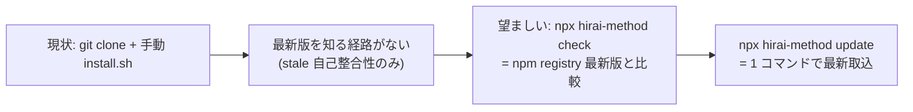

<!--
approval_required: true
approved_at:
approved_by:
retroactive: false
-->

# hirai-method の npx CLI 化（public npm 公開 + `npx hirai-method check / install / update`）

**ステータス:** 🔲 **draft（2026-06-07 起案、user 承認待ち）**
**起点:** 自動アップデート roadmap【2】（user 指示 2026-06-06「2 機能構築後に自動アップデートを成立させる」）。【1】project-rules 保護（task-82 / PR #65）完了を受けた次段。
**前提:**
- 【1】project-rules 保護 完了済（harness rule = update 追従 / project-rules = 永続保護 の分離が確立）
- `install.sh` が consuming repo への配布経路（現状 user manual: `bash install.sh --update <dir>`）
- cross-repo write は agent 経路 deny、`install.sh` は terminal 実行のみ（development-process.md §cross-repo write）

**関連 fixture / rule:**
- `install.sh`（npx CLI が wrap する本体）
- `package.json`（新設、npm package メタ + `bin` field）
- `bin/cli.js`（新設、npx entry point）
- `.claude/harness-config.yml`（`harness_version` stamp、【3】と共有）
- 【3】既存 draft: [`stale-harness-detection.md`](stale-harness-detection.md)（本 task の `check` を再利用）

---

## 1. 真因サマリ / 課題サマリ

現状 harness の配布は `git clone` + `bash install.sh --update <dir>` の **手動・repo ローカル経路**のみ。consuming repo は (a) hirai-method を手元に clone 済であること (b) 正しい install.sh コマンドを覚えていること (c) 最新版を pull していること を全て満たさないと最新 harness を取り込めない。結果、classlab のような **旧 harness 稼働継続**（【3】の起点事案）が起きる。

さらに【3】の stale 検出は現設計だと「marker file 欠落 + version stamp の自己整合性」しか見られず、**「source の最新版が何か」を知らない**（stale-harness-detection.md §1 真因 + iter1 HIGH「version 比較の出所未定義」）。"今動いている harness が最新かどうか" を判定するには、**信頼できる version SSoT へのネットワーク経路**が要る。

**真因:** harness が npm registry のような **公開 version SSoT を持たない**ため、(1) 配布が手動 clone 依存 (2) 最新版判定が自己整合性止まり、の 2 点が解けない。

**副次:** install.sh のコマンド体系（`--update` / `--force` / `--overwrite-all`）が user の記憶頼みで、誤用・取りこぼし（PR #62 fc83df3 のような）が起きる。

---

## 2. 解決アプローチ比較

| 案 | 内容 | 工数 | メリット | デメリット |
|:---:|:---|---:|:---|:---|
| **A** | public npm 公開 + `npx hirai-method <cmd>`（`bin/cli.js` が `.claude` 同梱ツリーを配布、`check` は registry 最新版比較） | 3.0 | clone 不要・1 コマンド配布 / registry が version SSoT / 【3】の stale 比較を本解決 | npm publish 運用（user manual）/ package に `.claude` 全同梱（サイズ） |
| **B** | GitHub Releases + `curl \| bash` インストーラ | 2.0 | npm account 不要 / tarball 配布 | version 比較は GitHub API 依存 / `curl\|bash` は実行前検証困難 / npx ほど普及していない |
| **C ハイブリッド** | npm package は `bin/cli.js` のみ薄く公開し、`install`/`update` 時に GitHub から `.claude` を取得 | 2.5 | npm package が軽量 | ネットワーク 2 経路（npm + GitHub）/ オフライン install 不可 / version SSoT が 2 つに割れる |

→ **案 A** を推奨。理由: (1) `npx <pkg>` は Node エコシステムで最も普及した zero-install 配布で UX が最良、(2) **npm registry が単一 version SSoT** になり【3】の「最新版を知らない」限界を構造的に解消、(3) `.claude` 同梱で**オフライン install 可 + version と中身が常に一致**（C のような SSoT 分裂がない）。さらに案 A の内部実装は **既存 install.sh を Node からラップ**（`child_process.spawn('bash', [installShPath, ...])`）し、701 行の rsync / state 除外 / version stamp / settings 再生成ロジックを 100% 再利用して install ロジックの SSoT 二重化を回避する（Node 側で再実装する案 B は drift リスクで不採用）。

### research 確定事項（subagent 調査、confidence 0.82、2026-06-07）

| # | 確定結果 | 設計への含意 |
|---|---|---|
| **★最重要** | **`.claude` 実サイズ 2.3G の大半 (1.5G+) は `content-post` skill の生成物**（ClassLab 固有の週次画像 JSON/PNG）。**除外すれば `.claude` = 15M / 2025 files** | content-post 生成物の除外が **publish 可否を分ける前提条件**。`files` allowlist + `.npmignore` で `skills/content-post/drafts/`・`contents_manage/images/` を必ず除外。`npm pack --dry-run` で実 tarball サイズ実測必須 |
| 1 | `npx <pkg>` は registry 取得 → npm cache → bin 実行。**一度 cache すると最新を自動取得しない**（既知挙動 npm/cli#7838 等） | 採用者には **`npx <pkg>@latest`** を案内必須 + CLI 内 registry version 比較 WARN の二重対策 |
| 2 | `bin` = `{"hirai-method": "bin/cli.js"}`、実体先頭 `#!/usr/bin/env node` 必須、実行 bit は publish 時自動付与 | shebang + `files` 同梱で OK |
| 3 | `files` allowlist が `.npmignore` より推奨。npm 公式 size 上限は非公開だが実報告で数十 MB 超で失敗例多数 | 除外後 15M なら安全圏。`files` を最優先 allowlist に |
| 4 | `https://registry.npmjs.org/<pkg>/latest` が `version` を含む JSON を返す（実 fetch 確認） | `check` は HTTP fetch（`npm view` より軽量）。timeout + fail-open 必須 |
| 5 | npx CLI は `import.meta.url`/`__dirname` で package root 解決 → install.sh は同じ `SCRIPT_DIR` 方式で整合性高い。Node→bash spawn は標準・低リスク | 案 A の bash ラップが既存資産最大活用 |
| 6 | unscoped は `npm publish` で public、scoped は `--access public` 必須。`publishConfig:{access:public}` で毎回 flag 不要 | **scoped `@<org>/hirai-method` 推奨**（name 衝突回避 + signal 明確）。`publishConfig` を package.json に記載 |

**既存前提**: repo root に `package.json` は**既存**（75 bytes、`devDependencies` に mermaid/jsdom のみ、`name`/`version`/`bin`/`files` 未定義 = 公開不可）。本 task は新規作成でなく**既存 package.json の拡張**。

---

## 3. 採用案の詳細設計

### Task 計画（採用 6 条準拠、Phase 中間階層廃止）

> 1 draft = 1 Task。npx CLI（package 化 + 3 サブコマンド + publish 手順書）を 1 deliverable とする。【3】自動アップデート（stale-detect の registry 比較拡張）は **別 task-84** に分離。

#### Step 計画

| Step | Status | 作業概要 | 工数 | 依存 |
|:---:|:---:|:---|---:|:---|
| 1 | 🔲 | **既存 `package.json` 拡張**（`name`=scoped `@<org>/hirai-method`、`version`=`harness_version` 同期、`bin`、`publishConfig:{access:public}`、`files` allowlist + `.npmignore` で **content-post 生成物 (1.5G+) を除外**、transient 除外） | 0.5h | — |
| 2 | 🔲 | `bin/cli.js` 新設（shebang + arg parse: `check` / `install <dir>` / `update <dir>` / `--version` / `--help`、package root を `import.meta.url`/`__dirname` で解決、**bash/rsync 存在事前チェック**） | 0.8h | Step 1 |
| 3 | 🔲 | `check` 実装（`https://registry.npmjs.org/<pkg>/latest` 取得 → published version vs ローカル version 比較 → stale なら更新案内、network fail は fail-open WARN） | 0.6h | Step 2 |
| 4 | 🔲 | `install <dir>` / `update <dir>` 実装（同梱 `install.sh` を子プロセス起動 or Node 側で rsync 相当、引数透過 `--update`/`--force`/`--overwrite-all`） | 0.6h | Step 2 |
| 5 | 🔲 | npm publish 手順書（`docs/` に user manual: `npm login` → `npm version` → `npm publish --access public`、version と `harness_version` 同期規約） | 0.3h | Step 1-4 |
| 6 | 🔲 | (テスト設計レビュー) reviewer 動的選定（min≤N≤max、起動前に `hc-config.sh --get review_max_count_test` 確認） | 0.4h | Step 5 |
| 7 | 🔲 | (テスト合格) smoke 新設（`npm pack` dry-run で同梱 file 検証 / `check` の version 比較 mock / `install <tmpdir>` で .claude 配布実証）+ 既存 regression 0 | 0.5h | Step 6 |
| 8 | 🔲 | (リファクタリング) 3 観点判定 or skip | 0.2h | Step 7 |

合計: 約 3.8h

### Step 1 詳細（既存 package.json 拡張）
- `name`: **scoped `@<org>/hirai-method`** を推奨（research 項目 6: name 衝突回避 + signal 明確）。unscoped `hirai-method` は最短だが publish 前に npm 上の name 空き確認が必要 → **org 名は user に確認**（下記「承認時の確認事項」）
- `version`: SSoT は `.claude/harness-config.yml` の `harness_version`。publish 手順で両者を同期（規約: publish 前に `npm version <x>` → harness_version stamp も同値に）
- `bin`: `{ "<binname>": "bin/cli.js" }`（`npx <pkg>` で叩く名前。scoped でも bin 名は短く `hirai-method` 可）
- `publishConfig`: `{ "access": "public" }`（scoped を public publish、毎回 `--access public` flag 不要）
- `files`: `["bin/", ".claude/", "install.sh", "CLAUDE.md", "docs/INVENTORY.md"]` allowlist
- **★ content-post 除外（最重要）**: `.npmignore` で `.claude/skills/content-post/drafts/` `.claude/skills/content-post/contents_manage/images/`（= 1.5G+ の生成 JSON/PNG）を除外。除外後 `.claude` = 15M。**`npm pack --dry-run` で実 tarball サイズと同梱 file を必ず検証**（除外漏れ = publish 不能）
- transient 除外: `.claude/.workflow-state/` `.claude/.*-state/` `.task-screenshots/` `docs/draft/` `docs/tasks/`
- `devDependencies`（mermaid/jsdom）は既存維持。`type`: 既存維持 or CJS（`bin/cli.js` を Node 互換最大で）

### Step 2 詳細（bin/cli.js）
- 先頭 `#!/usr/bin/env node` + 実行権限 755（publish 時自動付与だが staging mv で mode 落ち注意、[[feedback_subagent_staging_mv_exec_bit_loss]]）
- arg parse は依存ゼロ（`process.argv` 手書き、外部 lib 入れない = KISS/package 軽量化）
- package root 解決: `path.dirname(fileURLToPath(import.meta.url))` or `__dirname` → そこから `install.sh` / `.claude` を参照（install.sh と同じ `SCRIPT_DIR` 方式で整合）
- **bash/rsync 事前チェック**: install.sh は rsync 依存（不在で exit 69）。`check`/`install`/`update` 実行前に `bash`/`rsync` の存在を確認し、不在なら明確なエラー案内（Windows 非対応の旨含む。Windows サポートは YAGNI）
- サブコマンド: `check`（引数なし、cwd または `--dir`）/ `install <dir>` / `update <dir>` / `--version` / `--help`

### Step 3 詳細（check）
- registry latest 取得: `https://registry.npmjs.org/<pkg>/latest` の JSON `.version`（`npm view` 子プロセスより HTTP fetch が軽量、research で確認）
- ローカル version: 同梱 package.json の version、または対象 dir の `.claude/harness-config.yml` の `harness_version`
- 比較 → stale なら「`npx hirai-method update <dir>` を実行してください」と案内。最新なら silent or "up to date"
- **network fail は fail-open**（WARN のみ、exit 0）。stale 検出機能が自身の network 失敗で開発を止めない（【3】stale-detect の fail-open 思想と整合）

### Step 4 詳細（install / update）
- 同梱 `install.sh` を `child_process.spawn('bash', [installShPath, mode, targetDir])` で起動、stdout/stderr を透過
- `update <dir>` → `install.sh --update <dir>` / `install <dir>` → `install.sh <dir>`（初回）/ `--force` `--overwrite-all` flag 透過
- npx 経由は **user terminal 実行**（cross-repo write の agent deny 制約は npx には無関係 = user が手で叩く）

### Step 5-8 詳細（publish 手順書 + Task 最終 3 Steps）
- **Step 5**: `docs/` に npm publish user manual（agent は publish しない = 自律実行禁止「license/public」カテゴリ、modes.md 遵守事項 8）。version 同期規約を明記
- **Step 6 (テスト設計レビュー)**: reviewer 動的選定（tdd-guide / test-automator / qa-expert / pr-test-analyzer + Node/CLI 観点で 1+）、収束まで反復（上限 `review_iteration_max`）
- **Step 7 (テスト合格)**: CLI = 非 UI のため unit/integration smoke（`npm pack --dry-run` 同梱検証 / `check` version mock / `install <tmpdir>` 実 .claude 配布）、既存 smoke regression 0
- **Step 8 (リファクタリング)**: 3 観点判定、不要なら `skip` 明示

---

## 4. リスクと緩和

| リスク | 確率 | 影響 | 緩和 |
|---|:---:|:---:|---|
| **content-post 生成物 (1.5G+) の混入で publish 不能 / 巨大 package** | **H** | **CRITICAL** | `.npmignore` で content-post drafts/images 除外（除外後 15M）、`npm pack --dry-run` でサイズ + 同梱 file を CI/smoke 検証、除外漏れを smoke で機械検出 |
| npm name 衝突 / org 名未確定 | M | M | scoped `@<org>/hirai-method` を default、org 名は承認時に user 確認、publish 前に空き確認 |
| package サイズ肥大（content-post 以外、skills/hooks 数百 file） | L | M | `files` allowlist + transient 除外、`npm pack --dry-run` で実数検証 |
| bash/rsync 環境依存（案 A は install.sh ラップ、rsync 不在で exit 69 / Windows 非対応） | M | M | cli.js で bash/rsync 事前チェック + 明確なエラー案内、Windows サポートは YAGNI（採用者 = Unix 系想定） |
| publish 漏れ（手順忘れで registry 旧版のまま）→ `check` が誤って "最新" 判定 | M | M | publish 手順書 + version/harness_version 同期規約、CI publish 自動化は将来 opt-in |
| `npx` キャッシュで古い版が実行される | L | M | 案内に `npx hirai-method@latest` 明記、`check` 自身も registry 直問い合わせで最新を見る |
| 実行権限落ち（`bin/cli.js` の 755 が install/同梱で 644 化） | M | M | smoke で実行 bit 検証、staging mv 時 chmod 復元（既知教訓） |

---

## 5. 移行計画

- [ ] npm name 空き確認 → unscoped/scoped 確定
- [ ] package.json + bin/cli.js + 3 サブコマンド実装
- [ ] `npm pack --dry-run` で同梱 file / サイズ検証
- [ ] ローカル `npm link` で `hirai-method check/install/update` を実機検証
- [ ] publish 手順書整備（user manual）
- [ ] user が `npm publish --access public`（agent は実行しない）
- [ ] 1 consuming repo で `npx hirai-method update <dir>` 実証

---

## 6. 完了条件（DoD）

- [ ] `package.json`（`bin` + `files` allowlist）+ `bin/cli.js`（3 サブコマンド + `--version`/`--help`）実装
- [ ] `check` が registry 最新版と比較し stale/up-to-date を判定（network fail は fail-open WARN）
- [ ] `install <dir>` / `update <dir>` が同梱 install.sh 経由で .claude を配布（smoke 実証）
- [ ] `npm pack --dry-run` で同梱 file が allowlist 通り（**content-post 生成物 1.5G+ 混入 0** + transient 混入 0、tarball サイズ 15M 級）
- [ ] npm publish user manual（version/harness_version 同期規約含む）を docs に整備
- [ ] 既存 smoke regression 0
- [ ] CommonRules.md / development-process.md §harness 取込に npx 経路を追記（手動 install.sh と併記）
- [ ] npm publish 自体は user 実行（agent 自律実行禁止カテゴリ遵守）

---

## 7. 工数見積

合計 約 3.8h（Step1 0.4 + Step2 0.8 + Step3 0.6 + Step4 0.6 + Step5 0.3 + Step6 0.4 + Step7 0.5 + Step8 0.2）

---

## 8. レビューサイクル（workflow.md §「収束条件」準拠）

> draft レビューは reviewer 最低 3 体以上 並列起動 + CRITICAL/HIGH/MEDIUM = 0 まで反復（LOW 許容、上限 `review_iteration_max`）。

| iter | 日付 | reviewer (起動数) | CRITICAL | HIGH | MEDIUM | LOW | 修正 commit | 状態 |
|:---:|---|---|:---:|:---:|:---:|:---:|---|---|
| 1 | 2026-06-07 | (起動予定: architect-reviewer, security-reviewer, code-architect, cli-developer + harness-optimizer) | — | — | — | — | — | 未実施 |

**収束判定**: CRITICAL = 0 ∧ HIGH = 0 ∧ MEDIUM = 0（LOW 許容）

---

## 9. 承認履歴

| 日付 | 承認者 | 結果 |
|---|---|---|
| 2026-06-07 | (承認待ち) | — |

---

## 10. 関連

- master roadmap: 自動アップデート 3 機能（【1】project-rules 保護 ✅ / **【2】npx 化 = 本 draft** / 【3】準自動 update）
- 【1】: [`project-rules-protection.md`](project-rules-protection.md)（task-82 完了）
- 【3】: [`stale-harness-detection.md`](stale-harness-detection.md)（本 task の `check` を再利用して registry 比較に拡張、task-84 予定）
- 関連 rule: `.claude/rules/development-process.md` §harness 取込チェックリスト（npx 経路を追記対象）/ `.claude/rules/modes.md` 遵守事項 8（npm publish = user 実行）
- 既存: `install.sh`（npx が wrap）
