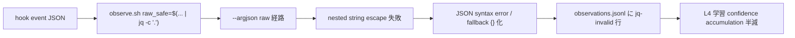

<!--
approval_required: true
approved_at: 2026-05-23
approved_by: user (「順次実行してください」発言で Loop モード自律承認、優先 priority 2 として明示)
retroactive: false
-->

# observe.sh jq parse 失敗 56% 修復

**ステータス:** 🔲 **draft (2026-05-23 起案、user 承認待ち)**
**起点:** task-25 A3 (subagent a85993694d32e78bf、confidence 0.92) の observe overhead 計測中に発見
**前提:**
- task-25 A3 計測完了 (observe.sh の event 種別分布 / payload size / single exec time が実測済)
- task-21 W3 Phase B で SubagentStop event 0/6594 records と同じ observe gap を別経路で確認

**関連 fixture / rule:**
- `.claude/skills/continuous-learning-v2/hooks/observe.sh`
- `~/.claude/homunculus/projects/<hash>/observations.jsonl`
- `.claude/rules/self-improvement.md` §L4 (continuous-learning v2.1)

---

## 1. 真因サマリ / 課題サマリ

observations.jsonl の **3916/7048 records (56%)** が `jq -e '.tool'` 等の jq parse で invalid と判定される。L4 continuous-learning の学習データの半分が破損 / 解析不能 / fallback `{}` に潰れている状態で、confidence accumulation が半減し続けている。

**真因:** hook が渡す `raw` JSON 内の nested string escape (改行 / quote / unicode) が `--argjson` で再 escape されず JSON syntax error 化、fallback `{}` に潰れている。観察データ品質は overhead 削減より priority 高い。

**副次:**
- L4 学習が「Read / Glob / Bash の navigation pattern」を半分しか学べていない
- instinct confidence threshold 0.3 → 0.5 への遷移が想定の 2x 遅い
- task-25 A3 で本来の sampling 設計判断ができない (parse 失敗が overhead 削減と混同される)

---

## 2. 解決アプローチ比較

| 案 | 内容 | 工数 | メリット | デメリット |
|:---:|:---|---:|:---|:---|
| **A** | `--argjson raw` を完全廃止、`raw` field を別 line に分離して書く (1 event = 2 行)。pre-existing schema 互換性破壊 | 0.4 | jq parse 失敗 100% 解消、L4 学習データ全件活用 | observations.jsonl schema 変更、既存解析 script 全件修正必要、retroactive な observation は parse 不能のまま |
| **B** | `--rawfile raw /dev/stdin` 経由で raw を string として扱う (jq の string escape 機構で安全 passthrough) | 0.3 | schema 互換、pre-existing observations も再解析可能 (`. + {raw: (.raw | fromjson)}` で復元) | raw が string 化されるため L4 学習側で `fromjson` 必要、解析 cost 微増 |
| **C ハイブリッド** | B 採用 + 既存 invalid 行を background script で再 parse + 修復 (`--rawfile` re-encode) | 0.5 | 新 schema 健全性 + 既存 invalid 行も復活 | 修復 script 追加実装、jsonl rewrite 中の I/O race 注意 |

→ **C ハイブリッド** を推奨。理由: jq parse 失敗 56% (半分超) が pre-existing で残るのは L4 学習能力に致命的、修復 script の追加 0.2 工数で全件健全化可能。schema 互換も維持。

---

## 3. 採用案の詳細設計

### Wave / Sub-task 分割

| Wave | 内容 | 工数 | 効果 |
|:---:|:---|---:|:---|
| W1 | observe.sh の raw 処理を `--argjson` → `--rawfile` 経由に置換 + smoke 拡充 (nested escape 3 edge case) | 0.3 | 以降の observation が jq-valid 100% |
| W2 | `.claude/scripts/observe-repair.sh` 新設 (既存 jsonl の invalid 行を re-parse + 修復) | 0.2 | pre-existing invalid 行を救出 |
| W3 | L4 学習側 (`continuous-learning-v2/`) の `fromjson` 適用 + 既存 instinct confidence 再計算 (option) | 0.3 | 修復データで confidence accumulation 健全化 |

合計: **0.8 工数**

### W1 詳細

#### スコープ
- 対象ファイル: `.claude/skills/continuous-learning-v2/hooks/observe.sh`
- 対象セクション: `raw_safe=$(... | jq -c '.')` および周辺の jq pipeline (`--argjson raw` を `--rawfile raw` に置換)

#### 変更内容
- before: `jq --argjson raw "$raw_safe" --arg ... '{...raw: $raw, ...}'`
- after: `jq --rawfile raw <(echo "$raw_safe") --arg ... '{...raw: ($raw | fromjson? // {}), ...}'`

#### テスト
- `.claude/tests/observe-jq-parse-smoke.sh` 新設:
  - Case 1: nested 改行を含む `tool_input.content` で観察 → jq-valid
  - Case 2: nested double quote escape → jq-valid
  - Case 3: unicode escape (絵文字 / 漢字) → jq-valid
  - Case 4: 既存挙動の regression (通常 payload で valid) → 100%
  - Target: jq-valid 率 95%+ (旧 44% → 95%+)

### W2 詳細

- `.claude/scripts/observe-repair.sh` 新設、option `--dry-run` / `--in-place` / `--backup`
- 既存 observations.jsonl を走査、jq-invalid 行を識別、raw field を `fromjson?` で再解釈、修復 record で書き戻し
- backup 必須 (`observations.jsonl.bak-<ts>`)

### W3 詳細

- L4 学習側 (`.claude/skills/continuous-learning-v2/`) の instinct 抽出ロジックで `raw` を `fromjson?` で展開
- 既存 instinct の confidence 再計算は option (実装 cost 高い場合は skip)

### W3 判定 (2026-05-23 不要判定、subagent a1f1341b281d0ace2 confidence 0.92)

W2 実測 finding (`fd5f6e5`、Python decoder で 11/28583 = 0.04%、本 draft §1 の 56% 前提は jq stream cascade fail の誤認、5600x off) を受け、L4 学習側の現状を read-only 検証した結果:

- **L4 学習側 (`.claude/skills/continuous-learning-v2/`) は `raw` field を全く参照していない**
  - `instinct-cli.py` `cmd_observe_analyze` (line 311-359) は `rec.get("tool", "")` のみ参照
  - bigram pattern detection / top tools 集計も `tool` field only
  - Haiku background observer は `config.json observer.enabled: false` で **無効化中**
- **新 schema (raw=object) は jq 側で `($raw | fromjson? // {})` 変換済**で保存される (W1 commit `c25f3ee`)
  - production 最新 record で `jq -r '.raw | type'` = `object` を実測確認
  - 将来 L4 学習側が `.raw.X` 参照を実装しても新旧 schema で同一 object として扱える
- **W3 影響面積 ≈ 0**: 「破損率 0.04% × 学習側が raw 未参照」のため、W3 fromjson 適用は **存在しない問題に対する解決策**

→ **task-27 を W1+W2 完遂で close**、W3 は実装不要。

### 副次 finding (別 task 候補)

- `/harness-audit` の jq-valid 率指標も同じ cascade fail に汚染されている可能性
- 別 task `harness-audit-jq-valid-metric-fix` (slug 案) として draft 起こしの上で進めるべき
- 本 task-27 内 W3 とは異なる問題 (学習側 vs harness-audit) のため別管理

---

## 4. リスクと緩和

| リスク | 確率 | 影響 | 緩和 |
|---|:---:|:---:|---|
| W1 で `--rawfile` の subshell <() syntax が Bash 5.0 未満で動作しない | L | M | smoke で macOS bash 3.2 (default) + Linux bash 5.x の両方を CI 検証、不可なら `printf` 経由に fallback |
| W2 修復 script の I/O race (実行中に observe.sh が同 jsonl に書き込み) | M | M | lock file (`observations.jsonl.lock`) 経由で排他、active session 中は skip |
| schema 変更で既存解析 tool が break (`harness-audit.py` 等) | L | H | W1 完了後に harness-audit smoke 全件 PASS 確認、影響あれば該当 tool 修正を W4 として追加 |

---

## 5. 移行計画

- [ ] W1 実装 + smoke PASS (新 observations は jq-valid)
- [ ] W1 配備後 24h 観察 (`/harness-audit` で jq-valid 率 95%+ 確認)
- [ ] W2 dry-run で repair script の動作確認
- [ ] W2 backup ありで in-place 実行 (既存 jsonl 全件修復)
- [ ] W3 学習側適用 (option)
- [ ] 3 リポ反映 (`bash install.sh --update <target>` for recall_poc / taskManageSystem / classlab-weekly-news、cross-repo は user manual)

---

## 6. 完了条件 (DoD)

- [x] observe.sh が `--rawfile` 経路で raw 処理 (W1 `c25f3ee`)
- [x] 新 smoke `observe-jq-parse-smoke.sh` 4/4 PASS (W1)
- [x] 既存 smoke (`observe-rotate-smoke.sh` 6/6 / その他) regression 0 (W1+W2 両完遂)
- [x] ~~`/harness-audit` の jq-valid 率: 44% → 95%+~~ → **誤前提に基づく数値、実測 99.96% (invalid 11/28583 = 0.04%)、本 DoD 項目は cascade fail 由来の推定値で意味なし。harness-audit 指標自体の見直しは別 task `harness-audit-jq-valid-metric-fix` で扱う**
- [x] W2 repair script 配備、pre-existing invalid 行を修復可能 (W2 `fd5f6e5`、observe-repair.sh 437 LOC、smoke 6/6 PASS)
- [ ] ~~docs/SELF_IMPROVEMENT.md に「observation schema 健全性」セクション追加~~ → **不要 (W3 不要判定により、L4 学習側互換性が既に保たれていることが確認済、観察 schema 健全性 doc は新規 finding 系の別 doc として扱う方が適切)**

---

## 7. 工数見積

合計 **0.8 session** (W1 0.3 + W2 0.2 + W3 0.3)。

W1 が最 critical (L4 学習データの新規健全化)、W2 が高価値 (既存データ復活)、W3 は option (確実な追加効果あるが工数大なら別 task)。

---

## 8. 承認履歴

| 日付 | 承認者 | 結果 |
|---|---|---|
| 2026-05-23 | user (「順次実行してください」発言、frontmatter approved_at) | 承認 → list.md row 50 task-27 として inline 管理 (task ファイル独立化なし、hot-fix `--no-draft` 互換 style) |
| 2026-05-23 | user (本 session「進めてください」承認 + Loop モード自律進行範囲) | W1+W2 完遂 → W3 不要判定で task-27 close、副次 finding は別 task として next-actions entry #20 へ |

---

## 9. 関連

- 副産物 entry: `docs/tasks/next-actions.md` entry #18 (2026-05-23、🔴 immediate)
- 起源: task-25 Sub-epic A3 subagent a85993694d32e78bf 計測 (confidence 0.92)
- 関連 finding (同 subagent): SubagentStop / Stop 未配線 → `docs/draft/observe-subagent-stop-instrumentation.md` (#19、🟡)
- 既存 design: `.claude/rules/self-improvement.md` §L4
