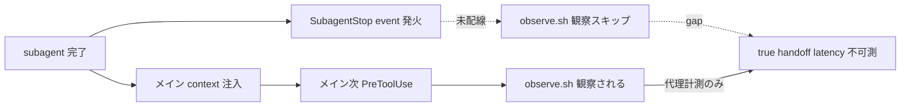

<!--
approval_required: true
approved_at: 2026-05-23
approved_by: user (「タスク化して実行」発言で Loop モード自律承認、副産物 #19 → task-28 化)
retroactive: false
-->

# observe.sh を SubagentStop / Stop / UserPromptSubmit / SessionStart に追加配線

**ステータス:** 🔲 **draft (2026-05-23 起案、user 承認待ち)**
**起点:** task-25 A3 subagent a85993694d32e78bf 計測 + task-21 W3 Phase B 「true subagent handoff latency 計測不可 (SubagentStop event 0/6594 records)」で同根因確認
**前提:**
- task-25 A3 完了 (observe.sh の現状配線 = PreToolUse + PostToolUse のみと確定)
- task-21 W3 採用判定基準 4 (handoff latency 秒オーダー) の真値計測が本拡張に依存

**関連 fixture / rule:**
- `.claude/settings.json` (hook 配線、SubagentStop / Stop / UserPromptSubmit / SessionStart 配列)
- `.claude/skills/continuous-learning-v2/hooks/observe.sh` (event ハンドラ拡張)
- `.claude/evals/loop-mode-autonomy.md` (Test 3 副次指標 handoff latency の measurable 化)

---

## 1. 真因サマリ / 課題サマリ

現状 observe.sh は `PreToolUse` + `PostToolUse` の `*` matcher のみ配線され、`SubagentStop` / `Stop` / `UserPromptSubmit` / `SessionStart` event は L4 観察対象外。結果として:

- subagent の完了 metric (`agent_id` / `duration_ms` / `total_tokens` / completion summary) が L4 から見えない
- session の wrap-up event (Stop hook 発火 = ターン終了時 のタイミング) が観察対象外で「Loop モード遵守事項 7 違反 (subagent 待ち中停止)」を後追い分析できない
- user prompt の到来 timestamp が記録されず、メイン応答開始 latency / 応答長 / 規範違反率を session 単位で集計できない
- session 開始時の env / mode / branch / context budget が記録されず、session 比較分析ができない

**真因:** observe.sh の hook event 配線が `PreToolUse` + `PostToolUse` の 2 種のみ。tool 呼び出し前後のみ捕捉する設計で、tool 間 / subagent 終了 / session boundary の event が空白。

**副次:** task-21 W3 採用判定基準 4 (true handoff latency 秒オーダー) が本 gap のせいで上界 36 秒 (代理計測 = `PostToolUse(Agent)` → 次 `PreToolUse`) しか出せない。本拡張で SubagentStop matcher 配線後に再測すれば真値 (subagent stop 直後 → メイン次 tool_use) を取得可能。

---

## 2. 解決アプローチ比較

| 案 | 内容 | 工数 | メリット | デメリット |
|:---:|:---|---:|:---|:---|
| **A** | 4 event すべて (SubagentStop / Stop / UserPromptSubmit / SessionStart) を observe.sh に追加配線 | 0.5 | session lifecycle 全 event 捕捉、L4 学習 baseline 厚化 | observations.jsonl サイズ 1.3-1.5x 増 (event 種別追加分)、現状の jq parse 失敗 56% (#18) と組み合わせると invalid 率さらに上昇懸念 |
| **B** | 最 critical な SubagentStop のみ追加配線 (handoff latency 真値計測 enable) | 0.2 | task-21 W3 採用判定 即時 unblock、最小 overhead | Stop / UserPromptSubmit / SessionStart の追加 value 失う、後で B' として追加配線 task が必要 |
| **C 段階** | Phase 1 = B (SubagentStop only)、jq parse fix (#18) 完了後に Phase 2 = 残 3 event 追加 | 0.5 (内 P1=0.2) | リスク分離、Phase 1 で task-21 W3 unblock、Phase 2 で全 lifecycle 捕捉 | 2 commit に分かれる、Phase 2 着手判断が必要 |

→ **C 段階** を推奨。理由: 本副産物の元来目的は task-21 W3 採用判定の真値計測。SubagentStop のみで目的達成、残 3 event は #18 (jq parse fix) 完了後に取り組めば observation schema 健全性と組み合わせて L4 学習に最大効果。

---

## 3. 採用案の詳細設計

### Wave / Sub-task 分割

| Wave | 内容 | 工数 | 効果 |
|:---:|:---|---:|:---|
| W1 (Phase 1) | `.claude/settings.json` SubagentStop 配列に observe.sh entry 追加 + observe.sh の event handler に SubagentStop case 追加 | 0.2 | handoff latency 真値計測 enable、task-21 W3 採用判定 unblock |
| W2 (Phase 2 前提) | next-actions #18 (observe jq parse fix) 完了確認 | 0 | gating dependency |
| W3 (Phase 2) | settings.json + observe.sh に Stop / UserPromptSubmit / SessionStart 配線追加 + event 別 payload schema 定義 | 0.3 | session lifecycle 全 event 捕捉 |
| W4 | task-21 W3 採用判定 retry (handoff latency 真値で再測) | 0.1 | 採用判定基準 4 確定 |

合計: **0.6 session** (W1 0.2 + W3 0.3 + W4 0.1)

### W1 詳細

#### スコープ
- 対象ファイル: `.claude/settings.json` (hooks.SubagentStop 配列追加 or 既存配列に append) + `.claude/skills/continuous-learning-v2/hooks/observe.sh` (event handler)

#### 変更内容
- settings.json: `hooks.SubagentStop` に `{"matcher": "*", "command": "bash .claude/skills/continuous-learning-v2/hooks/observe.sh"}` を append
- observe.sh: `hook_event_name` の switch / if 分岐に SubagentStop case を追加 (既存 PreToolUse / PostToolUse pattern に倣う)、payload は `agent_id` / `agent_type` / `duration_ms` / `total_tokens` / completion text を抽出

#### テスト
- `.claude/tests/observe-subagent-stop-smoke.sh` 新設:
  - Case 1: mock SubagentStop event JSON → observations.jsonl に 1 行記録
  - Case 2: agent_id / duration_ms 抽出正常
  - Case 3: 既存 PreToolUse / PostToolUse 観察に regression 0

### W3 詳細

- Stop / UserPromptSubmit / SessionStart の payload schema 定義 (各 event の意味ある field 抽出)
- L4 学習側 (`continuous-learning-v2/`) の event 解釈拡張 (event type 別 instinct extraction)
- 既存 smoke の regression 確認

### W4 詳細

- task-21 W3 Phase B の handoff latency 計測を W1 実装後の post-W1 期間で再実行
- true handoff latency = `SubagentStop event ts` → 次 `PreToolUse event ts` の median 取得
- 目標: 秒オーダー (≤ 10 秒) 達成確認、達成なら task-21 採用判定基準 4 確定

---

## 4. リスクと緩和

| リスク | 確率 | 影響 | 緩和 |
|---|:---:|:---:|---|
| settings.json への hook 追加で SubagentStop 既存 hook (confidence-gate.sh 等) との発火順序が崩れる | L | M | settings.json で配列順序を意図的に observe.sh を 末尾 (or 先頭、要決定) に固定、smoke で 順序 invariant 確認 |
| Phase 2 着手前に Phase 1 だけで止まり中途半端な lifecycle 捕捉が続く | M | L | task-21 W3 採用判定後に Phase 2 を明示的に scheduling、本 draft 自体が schedule の証拠 |
| jq parse 失敗 56% (#18) 未解消のまま新 event 追加で invalid 率さらに上昇 | M | M | Phase 2 着手は #18 完了が gating dependency (本 draft §3 W2 明記)、Phase 1 のみは 1 event 追加なので invalid 上昇は marginal |

---

## 5. 移行計画

- [ ] W1 実装 + smoke PASS (settings.json + observe.sh)
- [ ] W1 配備後 1 session 観察 (mock subagent 起動 → SubagentStop event が observations.jsonl に出現)
- [ ] W4 task-21 W3 採用判定 retry (handoff latency 真値計測)
- [ ] (#18 完了確認後) W3 Phase 2 実装 + smoke
- [ ] 3 リポ反映 (`bash install.sh --update <target>`、cross-repo は user manual)

---

## 6. 完了条件 (DoD)

- [ ] settings.json SubagentStop 配列に observe.sh 配線
- [ ] observe.sh で SubagentStop event payload を抽出 + observations.jsonl に記録
- [ ] 新 smoke `observe-subagent-stop-smoke.sh` 3/3 PASS
- [ ] 既存 smoke (observe-rotate / observe 関連) regression 0
- [ ] task-21 W3 採用判定基準 4 (handoff latency 秒オーダー): 真値で再測 + 達成判定
- [ ] (Phase 2) Stop / UserPromptSubmit / SessionStart 配線追加 + smoke + jq-valid 率 95%+ 維持

---

## 7. 工数見積

合計 **0.6 session** (W1 0.2 + W3 0.3 + W4 0.1)。

W1 単体で 0.2、これだけで task-21 W3 採用判定 unblock の effect。W3 は #18 完了後の追加 work、必要に応じて別 task 化も可。

---

## 8. 承認履歴

| 日付 | 承認者 | 結果 |
|---|---|---|
| YYYY-MM-DD | user | 承認 → `docs/tasks/task-<ID>-observe-subagent-stop-instrumentation.md` 作成 |

---

## 9. 関連

- 副産物 entry: `docs/tasks/next-actions.md` entry #19 (2026-05-23、🟡 next session)
- 起源: task-25 A3 subagent a85993694d32e78bf 計測 + task-21 W3 Phase B 同根因確認
- gating dependency: `docs/draft/observe-jq-parse-fix.md` (#18、🔴 immediate、Phase 2 の前提)
- 採用判定 unblock 先: `docs/tasks/task-21-system-reminder-attention-fix.md` W3 採用判定基準 4
- 関連 eval: `.claude/evals/loop-mode-autonomy.md` Test 3 副次指標 (handoff latency 中央値 ≤ 60 秒)
