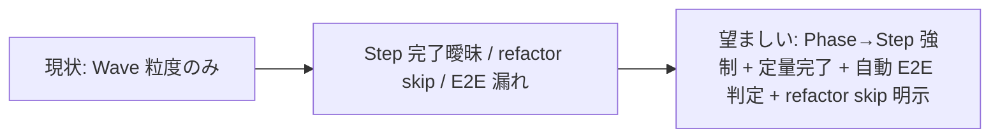

<!--
approval_required: true
approved_at: 2026-05-23
approved_by: user
retroactive: false
-->

# Phase→Step 強制タスク構造規範

**ステータス:** ✅ **承認済（2026-05-23 user 承認、task 化待ち）**
**起点:** 2026-05-23 セッション、user 指摘「タスクリストは Phase→Step 粒度で記載、Phase ゴール+作業概要、Step に明確な完了条件 (可能なら定量指標)、Phase 最終 Step は必ずテスト合格→リファクタ (UI 含む場合 E2E 必須)」
**前提:**
- `_TASK_TEMPLATE.md` v2 (Wave / 完了条件セクション既存)
- `workflow.md` 14-stage workflow (Stage 8 `tdd` / Stage 10 `local-test` / Stage 13 `scenario-test` 既存)
- `task-rule-guard.sh` (PreToolUse Bash で `docs/tasks/*` Write を強制) 既存
- `feedback_chat_list_output_as_table.md` (2026-05-23 起案、テーブル化規範)

**関連 fixture / rule:**
- `.claude/rules/task-management.md`
- `.claude/rules/workflow.md`
- `.claude/templates/docs/tasks/_TASK_TEMPLATE.md`
- `.claude/hooks/task-rule-guard.sh`
- `.claude/tests/task-rule-guard-smoke.sh`

---

## 1. 真因サマリ / 課題サマリ

既存 `_TASK_TEMPLATE.md` は **Wave 単位** での task 分解を強制するが、Wave 内の **Step 粒度 / 完了条件 / E2E 条件 / リファクタ強制** が未規範化。結果:

- subagent 委譲時の acceptance criteria が曖昧 (本セッション 11 subagent median confidence 0.88、再委譲発生事案あり)
- TDD GREEN → REFACTOR 規範違反 (本セッションで「test PASS 後にリファクタ skip」事案複数)
- UI 動作未検証で「build green = 完了」誤判定 (E2E 未配線、Critical Operational Lessons HIGH 「UI または frontend changes は browser 検証」未強制)

**真因:** 既存テンプレが Wave 単位で止まり、Wave 内部の構造化を user 任せにしている。

**副次:**
- リスト視認性 (テーブル化規範は別 feedback で対応済 `feedback_chat_list_output_as_table.md`)
- 14-stage workflow との二重化リスク (Stage 8 `tdd` / Stage 10 `local-test` で部分カバーされているが規範未統合)

---

## 2. 解決アプローチ比較

| 案 | 内容 | 工数 | メリット | デメリット |
|:---:|:---|---:|:---|:---|
| **A** | 全タスク Phase→Step 強制 (閾値なし) + 既存 `_TASK_TEMPLATE.md` 拡張 + 14-stage 統合 | 1.5 | 構造均一、subagent 委譲品質向上、TDD 規範完全強制 | typo / 1 行 fix で overhead、既存 6 task 移行 cost |
| **B** | 3 Step 以上のみ強制 (閾値あり) | 1.2 | overhead 回避 | 適用基準が曖昧、small fix から大 task への昇格時に再構造化必要 |
| **C** | 現状維持 | 0 | 移行 cost なし | confidence / TDD / E2E 問題が継続 |

→ **A** を採用 (user 決定、2026-05-23)。理由: user 明示で「閾値なし」採用、small fix の overhead は最小 Phase 1 + Step 1 の単一構造で吸収可能。

---

## 3. 採用案の詳細設計

### 規範本体 (採用 5 条)

1. **Phase→Step 2 階層必須**
   - Phase: 論理的に独立した作業単位 (1 Phase = 1 完了 commit 単位、独立動作可能な状態)
   - Step: Phase 内の最小実行単位 (1 Step = 1 subagent 委譲 or 1 ローカル操作)
   - 最小構造: 1 Phase + 1 Step (small fix 用)

2. **Phase 必須項目**
   - ゴール: 完了時に何が達成されているか (1 文、観察可能)
   - 作業概要: 含まれる Step の概要 (箇条書き 3-5 件)

3. **Step 必須項目**
   - 内容: 何をするか (1-2 文)
   - 完了条件: 定量指標 or 観察可能な事実 (例: 「smoke 6/6 PASS」「LOC < 100」「`grep -q 'X' file && exit 0`」)
   - 定性的な場合は「観察可能な事実」で代替可 (例: 「規範文書に §X が追加済」)

4. **Phase 最終 Step = テスト合格 → リファクタリング (必須 2 段)**
   - テスト合格 Step:
     - UI 変更含む Phase (UI ファイル変更検出: `git diff --name-only` で `*.tsx` / `*.vue` / `*.svelte` / `*.jsx` / `*.html` / `*.css` 等を match) → **E2E 必須** (Playwright / 同等)
     - UI 変更なし Phase → unit / integration test PASS で OK
   - リファクタリング Step:
     - 持続可能性 / 汎用性 / 非冗長化 の 3 観点 (`/module-review` 同期)
     - 不要なら `skip: <reason>` で明示記録 (例: `skip: 単一 commit message 修正、refactor 対象なし`)

5. **小タスクの単一 Phase 許容**
   - 1 Step のみで完結する作業 (typo 修正 / 1 行 fix / コメント追加等) は単一 Phase + 単一 Step で OK
   - ただし「テスト合格 (規範文書修正なら observability check で代替) → リファクタ skip 記録」は必須

### Wave / Sub-task 分割

| Wave | 内容 | 工数 | 効果 |
|:---:|:---|---:|:---|
| W1 | `_TASK_TEMPLATE.md` 改訂 (Phase/Step セクション追加、既存 Wave セクションは Phase に rename) | 0.4 | 構造規範実体化 |
| W2 | `task-management.md` 規範追記 + `workflow.md` 14-stage 統合 (Stage 8 `tdd` 内で Phase→Step 粒度明文化、Stage 10 `local-test` / 13 `scenario-test` で完了条件参照) | 0.3 | 規範文書統合 |
| W3 | UI 変更検出 logic 実装 (規範のみ or hook 強制まで、§3.W3 判断点参照) | 0.3-0.8 | E2E 漏れ防止 |
| W4 | 既存 task 6 件 (task-21 / 23 / 24 / 27 / 28 + 本 task) の Phase→Step 形式移行ガイド (規範文書、実適用は task ごとに個別) | 0.4 | 規範整合 |
| W5 | smoke 追加 (`task-rule-guard.sh` 拡張で Phase/Step format 検証、不在時 warning) + 本セッション内に最低 1 task で実適用して効果実測 (target: subagent confidence ≥ 0.92) | 0.5 | 効果実証 |

合計: 1.9-2.4 工数

### W1 詳細

#### スコープ
- 対象ファイル: `.claude/templates/docs/tasks/_TASK_TEMPLATE.md`
- 対象モジュール: タスクテンプレ schema

#### 変更内容
- 既存 `## Wave 計画` セクション → `## Phase 計画` に rename + 各 Phase の必須項目 (ゴール / 作業概要) を template 化
- 各 Phase 内に `### Step N: <名前>` サブセクション (内容 / 完了条件) を template 化
- 各 Phase 末尾に「### Step <N>: テスト合格」「### Step <N+1>: リファクタリング (skip: ... の場合は理由明記)」の 2 step を雛形として固定配置
- 上部 frontmatter HTML comment に `phase_count: N` / `total_steps: M` を追加 (W5 の smoke で集計)

#### テスト
- `.claude/tests/task-rule-guard-smoke.sh`: 既存 case が pass し続けることを確認 (regression 0)
- 新 case: template に Phase/Step セクションが存在することを grep で検証

### W2 詳細

#### スコープ
- `.claude/rules/task-management.md`: §「タスク構造規範 (Phase→Step 強制)」を新設
- `.claude/rules/workflow.md`: Stage 8 `tdd` 説明文に「Phase 最終 Step = テスト合格→リファクタリング」を追記、Stage 10 `local-test` / 13 `scenario-test` で UI 検出による E2E 強制を参照

#### 変更内容
- `task-management.md` に採用 5 条の本文 + bypass 経路 (`ECC_PHASE_STEP_STRUCTURE_OFF=1` for hot fix)
- `workflow.md` 14-stage 統合: 二重 template を作らず、`task-management.md` への参照リンクで吸収

### W3 詳細

#### スコープ (判断点 2 つ)
- **判断点 A**: UI 変更検出は規範のみ (markdown で「UI 変更なら E2E 必須」と書く) か、機械強制 hook (`task-rule-guard.sh` に Phase 内容を解析して UI 変更時に E2E Step 存在を検証) まで実装するか
- **判断点 B**: UI 変更の検出基準: 拡張子 (`*.tsx` 等) + path (`src/components/**` `src/pages/**` `apps/**/components/**` 等) のどちらで判定するか

#### 推奨
- 判断点 A: **規範のみ** (W3 工数 0.3) でまず開始、本セッション中の実適用効果を観察してから機械強制化を別タスクで検討
- 判断点 B: 拡張子 + path の **OR** 条件 (誤検知より過検知を許容、user が手動で E2E skip 記録可能)

#### 変更内容
- `task-management.md` に「UI 変更検出基準」を §として追加
- 既存 hook 変更なし (規範のみフェーズ)

### W4 詳細

#### スコープ
- 既存 task 6 件: task-21 / 23 / 24 / 27 / 28 + 本 task
- 移行は「ガイドライン文書化」のみ、実適用は task ごとに個別 (本タスク完了後、Phase→Step 形式での着手時に適用)

#### 変更内容
- `.claude/rules/task-management.md` に §「既存 task 移行ガイド」を追記
- 移行優先度表 (active 3 件 = task-21 / 23 / 24 を最優先、completed 系は移行不要)

### W5 詳細

#### スコープ
- `.claude/tests/task-rule-guard-smoke.sh` 拡張
- 本セッション内に最低 1 task で実適用 (推奨: task-21 W3 capability eval の Phase→Step 化)

#### 変更内容
- 新 smoke case (Phase/Step 数集計、UI 変更検出 logic 単体テスト)
- 実適用 task の subagent confidence 実測 → DoD §6 達成判定

---

## 4. リスクと緩和

| リスク | 確率 | 影響 | 緩和 |
|---|:---:|:---:|---|
| 小 task の overhead で slowdown | M | M | 最小構造 (1 Phase + 1 Step) を許容、template に「small fix mode」記載 |
| 既存 task 6 件の移行 cost | M | M | W4 で移行ガイドのみ、実適用は task ごとに個別 (本タスクと分離) |
| UI 変更検出の誤検知 (CSS 変更だが E2E 不要等) | M | L | 規範のみフェーズで観察、user 手動 skip 記録許容、機械強制化は別タスク |
| 「リファクタ何もない」場合の skip 濫用 | M | L | skip 理由を明示記録、`/harness-audit` で集計可能化 (将来) |
| 14-stage workflow との二重化 | L | M | W2 で `workflow.md` 修正は参照リンクのみ、本体は `task-management.md` |

---

## 5. 移行計画

- [ ] W1 `_TASK_TEMPLATE.md` 改訂
- [ ] W2 `task-management.md` + `workflow.md` 規範統合
- [ ] W3 UI 変更検出 logic (規範のみフェーズ)
- [ ] W4 既存 task 移行ガイド文書化
- [ ] W5 smoke + 本セッション内に最低 1 task で実適用、subagent confidence ≥ 0.92 実測
- [ ] DoD 全条件達成確認
- [ ] `/finish-task <id>` で完了クローズ

---

## 6. 完了条件（DoD）

- [ ] `_TASK_TEMPLATE.md` に Phase/Step セクション + テスト合格 / リファクタリング 2 step 固定が追加済
- [ ] `task-management.md` に §「タスク構造規範 (Phase→Step 強制)」+ §「既存 task 移行ガイド」が追加済
- [ ] `workflow.md` 14-stage の Stage 8 / 10 / 13 から本規範への参照リンク追加済
- [ ] UI 変更検出基準が markdown で文書化済 (規範のみフェーズ)
- [ ] `task-rule-guard-smoke.sh` で Phase/Step format 検証 case 追加 + 全 PASS
- [ ] 本セッション内に最低 1 task で実適用、subagent median confidence ≥ 0.92 実測
- [ ] regression 0 (既存 smoke 全 PASS)

---

## 7. 工数見積

合計 1.9-2.4 工数 (W1: 0.4 / W2: 0.3 / W3: 0.3-0.8 / W4: 0.4 / W5: 0.5)。

W3 の幅は「規範のみ (0.3)」or「機械強制 hook まで (0.8)」の判断による。推奨 0.3 (本タスクは規範のみ、機械強制は別タスク化)。

---

## 8. 承認履歴

| 日付 | 承認者 | 結果 |
|---|---|---|
| 2026-05-23 | user | 承認 → `docs/tasks/task-29-phase-step-task-structure.md` 作成 (W3 判断点 A: 規範のみ採用、機械強制 hook は別タスク化) |

---

## 9. 関連

- 関連 feedback: [`feedback_chat_list_output_as_table.md`](~/.claude/projects/-Users-t-hirai-work-hirai-method/memory/feedback_chat_list_output_as_table.md) (2026-05-23、リスト視認性のテーブル化規範)
- 既存テンプレ: [`_TASK_TEMPLATE.md`](../../.claude/templates/docs/tasks/_TASK_TEMPLATE.md)
- 既存 14-stage workflow: [`workflow.md` §新規機能開発フロー](../../.claude/rules/workflow.md)
- 既存 task-management 規範: [`task-management.md`](../../.claude/rules/task-management.md)
- task-rule-guard hook: [`task-rule-guard.sh`](../../.claude/hooks/task-rule-guard.sh)
- 関連タスク: 本 draft 承認後 `docs/tasks/task-<ID>-phase-step-task-structure.md` 生成
