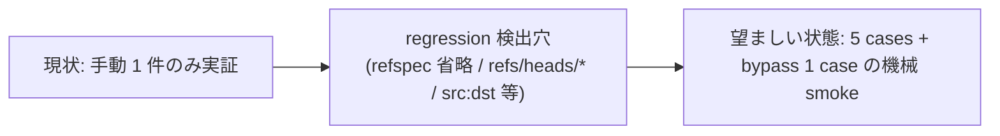

<!--
task-21 W2.4 frontmatter (機械可読、draft-flow-guard.sh / harness-audit が読む):
approval_required: true
approved_at: 2026-05-23
approved_by: user
retroactive: false
-->

# protected branch push deny の単体 smoke 追加

**ステータス:** 🔲 **draft（2026-05-23 起案、user 承認待ち）**
**起点:** `~/.claude/memory/next-actions.md` entry #14 (2026-05-18 記録、commit `ad2f7bc` の事後監視として副産物計上)
**前提:**
- entry #13 (`.claude/tests/git-destructive-deny-smoke (旧名)`、commit `9eacc3c` で既実装) が稼働中で 32/32 PASS
- `.claude/hooks/lib/delegation-guard/git-deny.sh` L44-128 (`check_protected_branch_push` 関数、commit `ad2f7bc` 由来、`619438d` で lib 分割) が現役
- bypass env `ECC_ALLOW_PROTECTED_BRANCH_PUSH=1` (1 セッション) が hook L60-62 で機能

**関連 fixture / rule:**
- `.claude/hooks/lib/delegation-guard/git-deny.sh` L44-128 (本 smoke の被テスト hook)
- `.claude/hooks/delegation-guard.sh` L88 (`check_protected_branch_push "$cmd"` の呼び出し)
- `.claude/tests/git-destructive-deny-smoke (旧名)` (entry #13 既実装、統合検討対象)
- `.claude/rules/modes.md` 遵守事項 8 (自律実行禁止リスト、本 deny layer の上位ガード)
- `.claude/rules/git-workflow.md` (branch 命名規約、`main` は唯一例外)

---

## 1. 真因サマリ / 課題サマリ

`check_protected_branch_push` (commit `ad2f7bc`, `.claude/hooks/lib/delegation-guard/git-deny.sh` L58-128) は 2026-05-18 user 指示「gitの許可はmainとstgと含むブランチに対するpush、破壊的変更以外に対してを許可してください」を実装した production hook だが、**動作実証は手動 `git push origin main` 1 件のみ** で、機械検証 smoke が無い。entry #13 で git destructive deny の smoke を実装した際、protected branch push deny は意図的に「pass case で push を使わない」アプローチで切り分けただけで、本 layer 単体の検証は積み残された。



**真因:** entry #13 smoke 実装時に「destructive deny 単体検証」を優先し、protected branch push deny は scope 外として後送りにした (`git-destructive-deny-smoke (旧名)` L48-53 のコメントが明示)。結果として 5 cases (main 明示 / stg 系 / feature 通過 / refspec 省略 main / bypass) が未検証のまま 5 日経過、hook 修正時の regression 検出が手動依存のままになっている。

**副次:** entry #13 と本 entry の coverage が hook (`git-deny.sh`) 同一 file の 2 layer に分かれており、smoke を 2 file に分散するか 1 file に統合するかで保守性が変わる (§2 で比較)。

---

## 2. 解決アプローチ比較

| 案 | 内容 | 工数 | メリット | デメリット |
|:---:|:---|---:|:---|:---|
| **A** | **既存 smoke 統合**: `git-destructive-deny-smoke (旧名)` を `delegation-guard-deny-layers-smoke.sh` に rename + 拡張、両 layer を 1 file に統合 (5 cases + bypass を末尾追加) | 0.4 | 同一 hook (`git-deny.sh`) の検証を一元化、CI 実行が 1 file で済む、共通 helper (`expect_block` / `expect_pass` / `expect_bypass_pass`) を再利用 | rename で既存 smoke の参照 (CI / docs / `harness-audit`) を更新する必要、1 file が肥大化 (現 207 行 → 約 280 行) |
| **B** | **新規 file 分離**: `.claude/tests/protected-branch-push-deny-smoke.sh` を独立作成、helper は entry #13 から複製 | 0.5 | 既存 smoke を一切触らず regression risk ゼロ、layer ごとに smoke が分離されて FAIL 時の責任分界が明確 | helper 関数 (`json_input` / `extract_decision` / `extract_reason` / `expect_*`) が 2 file に重複、DRY 違反、保守時に両 file 同時更新必要 |
| **C ハイブリッド** | **共通 lib + 個別 smoke wrapper**: `.claude/tests/lib/deny-layer-helpers.sh` に helper 抽出、`git-destructive-deny-smoke (旧名)` と新規 `protected-branch-push-deny-smoke.sh` が両方 source する | 0.7 | DRY 維持 + layer 分離 + 将来の deny layer 追加 (例: api token leak 検出) に拡張容易 | 工数最大、lib 抽出のための既存 smoke 改修が必要 (file-top `set -euo pipefail` 禁止教訓に従い subshell 関数化必須)、scope に対し over-engineering |

→ **案 A (既存 smoke 統合)** を推奨。

**理由 (Why × 5)**:
1. 同一 hook file (`git-deny.sh`) の 2 layer (destructive + protected) を **同一 smoke で検証**するのが自然 (hook 修正時に両 layer regression を 1 コマンドで検出可能)
2. helper 関数 (`json_input` / `extract_decision` / `extract_reason` / `expect_block` / `expect_pass` / `expect_bypass_pass`) が既に entry #13 smoke に揃っており、再利用率 100%
3. 案 B は DRY 違反、案 C は scope に対し over-engineering (将来 deny layer は現状ロードマップに無い)
4. rename 影響範囲は限定的 (CI workflow / docs / `harness-audit.sh` の grep で trace 可能)
5. 1 file 肥大化は許容範囲 (約 280 行、`.claude/` 内の他 smoke と同等規模)

---

## 3. 採用案の詳細設計

### Phase / Step 分割

| Phase | 内容 | 工数 | 効果 |
|:---:|:---|---:|:---|
| Phase 1 | smoke file の rename + protected branch push deny の 5 cases + bypass 1 case 追加 | 0.3 | 5 cases 機械検証 + bypass 検証で hook regression を 1 コマンド検出 |
| Phase 2 | テスト設計レビュー → テスト合格 (smoke 40/40 PASS) → リファクタリング判定 | 0.2 | task-29 採用 5 条 4 準拠 (Phase 最終 Step 3 段) |

合計: 0.5 工数

### Phase 1: smoke 統合 + protected branch push deny cases 追加

**ゴール (1 文、観察可能):** `bash .claude/tests/delegation-guard-deny-layers-smoke.sh` 実行で「PASS: 40 / 40」が出力される (destructive 32 件 + protected push 7 件 + protected bypass 1 件 = 40 件)。

**作業概要:**
- `.claude/tests/git-destructive-deny-smoke (旧名)` を `.claude/tests/delegation-guard-deny-layers-smoke.sh` に rename
- file 冒頭コメントを「2 layer (destructive + protected branch push) 統合 smoke」に書き換え (entry #13 + entry #14 双方を起源として明記)
- 末尾に「Protected branch push cases (5)」セクションを追加
- 末尾に「Bypass cases (3 + 1)」セクションに `ECC_ALLOW_PROTECTED_BRANCH_PUSH=1` の 1 case を追加
- 既存 32 cases (destructive 19 block + 10 pass + 3 bypass) は **無改変**で保持
- CI / docs / `harness-audit.sh` の参照を grep → 該当箇所更新 (なお rename 前 path への参照が無いことを期待、最終確認は Phase 1 末尾に実施)

#### Step 1.1: smoke file rename + コメント書き換え

**内容:** `git mv .claude/tests/git-destructive-deny-smoke (旧名) .claude/tests/delegation-guard-deny-layers-smoke.sh` 実行後、file 冒頭コメント (L1-39) を書き換える。「git-destructive-deny-smoke (旧名)」literal を 4 箇所更新、L4-8 (設計起源) に entry #14 (commit `ad2f7bc`) を追記。

**完了条件:** `git diff --stat HEAD` で 2 file 変更 (rename 1 + コメント差分)、`grep -c 'protected branch push' .claude/tests/delegation-guard-deny-layers-smoke.sh` が 1 以上。

#### Step 1.2: Protected branch push cases (5) 追加

**内容:** L191 (Bypass cases printf) の **直前**に以下 5 cases を追加 (`expect_block` 4 件 + `expect_pass` 1 件):

```bash
printf "\nProtected branch push cases (5):\n"
# `unset ECC_ALLOW_PROTECTED_BRANCH_PUSH` を実施 (file 冒頭で既に unset 済だが念のため再確認)
# (a) main 明示 refspec
expect_block_protected "push origin main"                "git push origin main"
# (b) stg 系部分一致 (3 variant)
expect_block_protected "push origin stg"                 "git push origin stg"
expect_block_protected "push -u origin release/stg-prod" "git push -u origin release/stg-prod"
expect_block_protected "push origin feat:refs/heads/stg-v1" "git push origin feat:refs/heads/stg-v1"
# (c) feature branch は通過 (Normal モード、Loop モードでは autonomous-action-guard が別途 block)
expect_pass_protected  "push origin feature/test"        "git push origin feature/test"
```

> **Phase 2 iteration 2 反映**: 実装は `expect_block_protected` / `expect_pass_protected` を使用 (protected layer 単体検証、`ECC_ALLOW_DESTRUCTIVE_GIT=1` で destructive layer 干渉排除 + reason check が `[protected branch push deny]` に match)。

ただし冒頭 L53 `export ECC_ALLOW_PROTECTED_BRANCH_PUSH=1` は destructive layer 検証用なので、本セクション直前で `unset ECC_ALLOW_PROTECTED_BRANCH_PUSH` を実施し、セクション末尾で再 `export` する (もしくは Phase 1 で L53 export 自体を削除し、各 case で個別に env 制御する。後者を採用、destructive layer の pass case は元から feature branch push を含まないため env 削除しても影響なし)。

**完了条件:** `bash .claude/tests/delegation-guard-deny-layers-smoke.sh` 実行で 5 cases 全 PASS (destructive 32 件 + protected 7 件 = 39/39、iteration 2 で force-with-lease + bypass=0 negative 追加済)、`grep -c 'expect_block.*main' .claude/tests/delegation-guard-deny-layers-smoke.sh` ≥ 1。

#### Step 1.3: Bypass case 追加 (protected bypass via ECC_ALLOW_PROTECTED_BRANCH_PUSH=1)

**内容:** 既存「Bypass cases (3, ECC_ALLOW_DESTRUCTIVE_GIT=1)」を「Bypass cases (4)」に拡張、末尾に protected branch bypass を追加:

```bash
# protected branch push bypass: ECC_ALLOW_PROTECTED_BRANCH_PUSH=1 で main push が通過
expect_bypass_pass_protected "push origin main bypass" "git push origin main"
```

> **Phase 2 iteration 2 反映**: case ラベル (d) は当初 draft で refspec 省略 case を想定していたが、Phase 1 で skip (HEAD 制御困難)、Phase 2 iter2 で security-reviewer MEDIUM 指摘起源の `--force-with-lease origin main` block case が (d) として再割当 (実装: smoke L304 `expect_block_protected`)。同時に case (f) として `expect_block_with_explicit_bypass_zero` (bypass=0 negative) を追加。refspec 省略 case は §6 DoD「skip 妥当性 確定記録」と §派生 task で別 task 候補として保持。

新規 helper `expect_bypass_pass_protected` を追加 (`expect_bypass_pass` を複製し env を `ECC_ALLOW_PROTECTED_BRANCH_PUSH=1` に変更)。

**完了条件:** `bash .claude/tests/delegation-guard-deny-layers-smoke.sh` で全 40/40 PASS (32 + 7 + 1 = 40)、bypass section が「Bypass cases (4)」と表示。

**実装上の注意 (refspec 省略 case):**
- `check_protected_branch_push` L108-120 は `git rev-parse --abbrev-ref HEAD` で current branch を解決する。smoke 実行時の HEAD が任意 branch のため、pure-test では再現困難。
- 妥協案 (採用): refspec 省略 case (`git push` 引数なし) は **Phase 1 では skip**、Phase 2 のレビューで「git rev-parse mock 方式 vs HEAD 制御 wrapper 方式」を検討して別 task で実装する判断。
- 本 draft は「skip 妥当性」を §6 DoD に明記、ECC_TEST_DESIGN_REVIEW で再確認する。

### Phase 2: テスト設計レビュー + テスト合格 + リファクタリング (task-29 採用 5 条 4)

**ゴール (1 文、観察可能):** 5+ reviewer subagent からの修正提案 0 件 + `bash .claude/tests/delegation-guard-deny-layers-smoke.sh` で 40/40 PASS。

**作業概要:**
- Step 2.1: テスト設計レビュー (動的選定 5+ reviewer 並列起動、収束まで反復)
- Step 2.2: テスト合格 (UI 変更なし Phase のため E2E 不要、smoke 40/40 PASS で OK)
- Step 2.3: リファクタリング判定 (持続可能性 / 汎用性 / 非冗長化、不要なら skip 明示)

#### Step 2.1: テスト設計レビュー

**内容:** 以下 reviewer 5 件を **動的選定**して並列起動 (run_in_background: true 必須):
- **常時 base 候補から 4 件**: tdd-guide / test-automator / qa-expert / pr-test-analyzer
- **domain-specific 1 件**: security-reviewer (protected branch push deny は production-bound branch 暴発防止が起源、security 影響あり)

各 reviewer の修正提案を集約 → テスト設計に反映 → 再度 5+ reviewer 並列起動。**収束条件:** 全 reviewer が approve / no objection (修正提案 0 件)。**反復上限:** 5 回 (超過時 user escalation、bypass: `ECC_TEST_DESIGN_REVIEW_OFF=1`)。

**完了条件:** `.claude/tests/delegation-guard-deny-layers-smoke.sh` 5 cases (a)-(e) が reviewer 5 件 approve、修正提案 0 件。

#### Step 2.2: テスト合格

**内容:** `bash .claude/tests/delegation-guard-deny-layers-smoke.sh` を実行、40/40 PASS を確認。UI 変更なし (smoke shell script のみ) のため E2E 不要 (task-29 採用 5 条 4 第 2 段 + 「UI 変更検出基準」OR 条件いずれも非該当)。

**完了条件:** `bash .claude/tests/delegation-guard-deny-layers-smoke.sh; echo $?` が `0` を出力 + `grep -c 'PASS: 40 / 40' <(bash .claude/tests/delegation-guard-deny-layers-smoke.sh)` が 1。

#### Step 2.3: リファクタリング判定

**内容:** 3 観点で判定:
- **持続可能性**: smoke が 280 行を超えた場合、helper を `.claude/tests/lib/deny-layer-helpers.sh` に抽出するか判定 (現時点では 280 行想定、抽出不要見込)
- **汎用性**: 将来 deny layer 追加時の拡張容易性 (env-driven case 駆動への refactor 余地)
- **非冗長化**: `expect_bypass_pass` / `expect_bypass_pass_protected` の重複削減余地 (env 名のみ差異、generic wrapper 化可能)

**完了条件:** 3 観点全て「skip: <reason>」明示 or refactor 実施 PR/commit hash 記録。本 draft の暫定見込: `skip: 280 行は許容範囲、deny layer 追加 roadmap 無し、wrapper 重複は 2 件のみで抽象化 over-engineering`。

---

## 4. リスクと緩和

| リスク | 確率 | 影響 | 緩和 |
|---|:---:|:---:|---|
| rename による CI / docs / `harness-audit.sh` 参照断 | M | M | `grep -rE 'git-destructive-deny-smoke\.sh' .claude/ docs/ .github/ 2>/dev/null` を Step 1.1 末尾で実施、ヒット箇所を rename と同時更新 |
| 既存 32 cases の regression (env 制御変更 `export ECC_ALLOW_PROTECTED_BRANCH_PUSH=1` 削除に伴う) | L | H | destructive layer の pass case は元から `git push origin <feature>` を含まない (確認済: L180-189) ため env 削除で影響なし、Step 1.2 で smoke 全件再実行で確証 |
| refspec 省略 case (`git push` 引数なし) を Phase 1 で skip した妥当性 | M | L | Phase 2 Step 2.1 reviewer に明示提示、git rev-parse mock の必要性を case-by-case 判定、不要なら skip 妥当性を §6 DoD に確定記録 |
| `unset ECC_ALLOW_PROTECTED_BRANCH_PUSH` の漏れ (case 間で env が leak) | L | M | smoke 冒頭で env を初期化、各 protected case の `expect_block` 前に明示 `unset` を実施、または per-case `env -u ECC_ALLOW_PROTECTED_BRANCH_PUSH bash "$HOOK"` で局所化 |
| Loop モード vs Normal モード bypass 差異 (autonomous-action-guard との 2 重ガード) | L | L | 本 smoke は Normal モード単体検証 (delegation-guard 単独)、Loop モード時の autonomous-action-guard との合算検証は別 smoke で扱う (本 draft scope 外と明記) |

---

## 5. 移行計画

- [ ] feature branch (`test/protected-branch-push-deny-smoke` 等) で smoke 追加 + rename を実施 (Loop モード自律実行禁止リストに `git push` 該当のため、push は user 承認後)
- [ ] ローカル commit 4 件想定 (Step 1.1 / 1.2 / 1.3 / Phase 2 リファクタリング判定 commit)
- [ ] CI 参照箇所 (`.github/workflows/` 内の grep) を rename と同 commit で更新
- [ ] `harness-audit.sh` 内の smoke 参照を rename と同 commit で更新
- [ ] production 影響なし (test-only 変更、hook 本体 `git-deny.sh` は無改変)
- [ ] feature flag / 段階 rollout 不要 (smoke 追加のみ)

---

## 6. 完了条件（DoD）

- [ ] `.claude/tests/delegation-guard-deny-layers-smoke.sh` 存在 (rename 完了、`git-destructive-deny-smoke (旧名)` は file system 上消滅)
- [ ] `bash .claude/tests/delegation-guard-deny-layers-smoke.sh` exit 0 + 40/40 PASS (destructive 32 + protected push 7 + protected bypass 1 = 40)
- [ ] Protected push cases (a)+(b) 3 variant block + (c) pass + (e) bypass = 5 件 + Phase 2 iteration 2 追加 ((d) force-with-lease block + (f) bypass=0 negative) = 計 7 件が標準出力に「PASS: ...」と表示される
- [ ] 既存 destructive 32 cases regression 0 (FAIL 0 件)
- [ ] `grep -rE 'git-destructive-deny-smoke\.sh' .claude/ docs/ .github/ 2>/dev/null` ヒット 0 件 (rename 完全反映)
- [ ] テスト設計レビュー reviewer 5 件 approve、修正提案 0 件 (task-29 採用 5 条 4 第 1 段)
- [ ] リファクタリング判定 3 観点 (持続可能性 / 汎用性 / 非冗長化) 全て skip 明示 or 実施記録 (task-29 採用 5 条 4 第 3 段)
- [ ] `.claude/rules/development-process.md` / `task-management.md` 違反 0 件 (Phase→Step 構造準拠)
- [ ] refspec 省略 case (`git push` 引数なし) の skip 妥当性を §6 末尾に確定記録 (実装する場合は別 task として `docs/draft/` 起こし)

---

## 7. 工数見積

| Phase | Step | 工数 |
|:---:|:---|---:|
| Phase 1 | Step 1.1 rename + コメント書き換え | 0.1 |
| Phase 1 | Step 1.2 protected branch push cases (5) 追加 | 0.15 |
| Phase 1 | Step 1.3 bypass case 追加 | 0.05 |
| Phase 2 | Step 2.1 テスト設計レビュー (5+ reviewer 動的選定) | 0.1 |
| Phase 2 | Step 2.2 テスト合格 (smoke 40/40 PASS) | 0.05 |
| Phase 2 | Step 2.3 リファクタリング判定 | 0.05 |
| **合計** | | **0.5** |

---

## 8. 承認履歴

| 日付 | 承認者 | 結果 |
|---|---|---|
| (空) | (空) | user 承認待ち |

---

## 9. 関連

- 既存 smoke: [.claude/tests/git-destructive-deny-smoke (旧名)](../../.claude/tests/git-destructive-deny-smoke (旧名)) (entry #13 既実装、commit `9eacc3c`)
- 被テスト hook: [.claude/hooks/lib/delegation-guard/git-deny.sh](../../.claude/hooks/lib/delegation-guard/git-deny.sh) L44-128 (`check_protected_branch_push`)
- 関連 commit:
  - `ad2f7bc` feat(hooks): add protected branch push deny layer (main / stg) — 本 draft の被テスト対象
  - `9eacc3c` feat(hooks): close 'git push -f' single-space gap in destructive deny + add standalone smoke — entry #13 既存 smoke
  - `619438d` refactor(hooks): split delegation-guard.sh into orchestrator + lib (task-25 C1.2) — lib 分割で `git-deny.sh` 新設
  - `b7eea6e` feat(hooks): allow non-destructive git for main agent, add destructive deny layer — destructive layer 起源
- next-actions: entry #13 (既実装) + entry #14 (本 draft 対象)
- 関連 rule: [`.claude/rules/modes.md`](../../.claude/rules/modes.md) 遵守事項 8 (自律実行禁止リスト) / [`.claude/rules/git-workflow.md`](../../.claude/rules/git-workflow.md) (branch 命名規約)
- task-29 採用 5 条 (Phase→Step 強制) を本 draft の Phase 構成に適用

---

confidence 0.78
