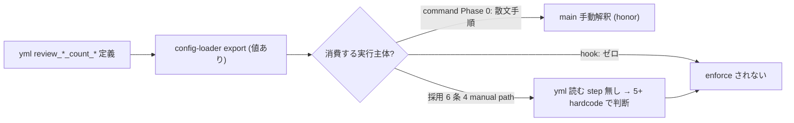

# reviewer 数 config 強制実装 (review_*_count_* / required_* / iteration_max を「飾り」から「機能」へ)

**ステータス:** 🔲 **draft（2026-05-30 起案、user 承認待ち）**
**起点:** user 指摘「reviewer 数 config が機能していない」(2026-05-30、task-63 Step 6 で main が 6 reviewer 起動、yml max を無視)
**user 承認済 方針 (2026-05-30 AskUserQuestion):** ① 完全実装 (規範 + honor step + 強制 hook + config-loader fix + local.yml 移行) / ② reviewer 数値は現状維持 (強制機構だけ追加、具体値は別途 `hc-config.sh --set`)

---

## 1. 真因サマリ / 課題サマリ

`.claude/harness-config.yml` の reviewer 制御値群 (`review_required_<design|test|module|system|security>` / `review_min_count_*` / `review_max_count_*` / `review_iteration_max`) が **動作に一切影響しない「飾り」状態**。task-63 Step 6 で main agent が採用 6 条 4 の「reviewer 5+」文言に従い 6 reviewer 起動 + re-review 5 reviewer を使ったが、yml の上限 (実値 `review_max_count_test: 10`、user 想定 3) を読まずに無視した。

### 調査で確定した root cause (subagent ae14acad conf 0.9)

| # | root cause | 実証 |
|---|---|---|
| **A** | **honor-system 不在 (主因)** | 採用 6 条 4 (task-management.md) も command Phase 0 も「yml を読んで起動数を決めろ」が散文手順のみ。main が手動 review path を使う時に yml を読む実行手順・機械強制が無い |
| **D** | **規範矛盾 (主因と相互増幅)** | 採用 6 条 4 が「reviewer **5+**」(下限 5・上限青天井) を hardcode。yml `review_max_count_*` の上限意図と直接矛盾。「5+」が main の 6 体起動を正当化 |
| **C** | **command 非経由** | 採用 6 条 4 のテスト設計レビューは `/test-design` を呼ばない独立 manual path。command の Phase 0 (yml 参照記述) が発火しない |
| **B** | **config-loader inline-comment 汚染 (潜在 2 次バグ)** | `config-loader.sh` は行末コメントを strip しない (L36 明記制約)。`HC_REVIEW_MAX_COUNT_TEST="10   # ..."` となり数値比較が壊れる。`hc-config.sh --get` は strip するので 2 read path で値形式が非対称 |
| **E** | **値の非永続 (user 体感の一部)** | user 想定値 (test max 3 等) が実 yml に不在 (実値 10/7/5、iteration 2、required 全 false)。`harness-config.local.yml` 不在。`install.sh --update` が main yml の customization を上書きした疑い (既知 next-actions #47、task-55 で local.yml override 導入済) |

**根本:** task-44 commit が「Phase 1 は yml schema のみ、参照 logic は Phase 2 で追加」と明記したが、**採用 6 条 4 の manual path と PreToolUse(Agent) hook には Phase 2 相当の enforcement が一度も実装されなかった**。



---

## 2. 解決アプローチ比較

| 案 | 内容 | 工数 | メリット | デメリット |
|:---:|:---|---:|:---|:---|
| **A** | 規範 + honor step のみ (hook なし) | 1.5h | 軽量、規範矛盾解消 | 機械強制なし、main 失念で再発 |
| **B 完全実装 (採用)** | 規範修正 + honor step + 強制 hook + config-loader fix + local.yml 移行 | 4-5h | reviewer 数が yml で確実制御、--update-safe、機械再発防止 | 工数大、hook 1 本新設 |
| **C** | 強制 hook 中心 (規範 + hook) | 3h | 機械強制 | config-loader bug / local.yml 移行を欠き値が壊れる/消える |

→ **B 完全実装** を採用 (user 承認済)。honor-system (A 解消) + 機械強制 (P2) + 値の clean read (B 解消) + 永続化 (E 解消) を一括で閉じる。

---

## 3. 採用案の詳細設計

### 3.1 P1a 規範修正 — 採用 6 条 4「5+」撤廃 (D 解消)

`.claude/rules/task-management.md` 採用 6 条 4「テスト設計レビュー」:
- **before**: 「reviewer 5+ subagent を動的選定」
- **after**: 「`review_min_count_test`〜`review_max_count_test` の**範囲内**で reviewer を動的選定。**起動前に `bash .claude/scripts/hc-config.sh --get review_max_count_test` で上限を確認し、起動数 N ≤ max を保証する**。`review_required_test: false` なら本 step skip 可」
- `.claude/rules-details/task-management.details.md` の「default min=5」記述を yml 現値と同期 (drift 解消)、青天井「5+」表現を全廃。

### 3.2 P1b honor step — command Phase 0 + 採用 6 条 4 に実行手順 (A 解消)

各 command (`test-design` / `design-review` / `module-review` / `system-review`) の Phase 0 + 採用 6 条 4 に、散文「参照する」を **具体コマンド step** に格上げ:

```
### Phase 0: reviewer 数の確定 (必須、起動前)
1. bash .claude/scripts/hc-config.sh --get review_required_<cat>   # false なら skip
2. bash .claude/scripts/hc-config.sh --get review_min_count_<cat>  # 下限
3. bash .claude/scripts/hc-config.sh --get review_max_count_<cat>  # 上限
4. min ≤ 起動 reviewer 数 ≤ max を保証して並列起動
```

### 3.3 P2 強制 hook — PreToolUse(Agent) reviewer 数上限 warn (A 機械化)

`.claude/hooks/parallel-subagent-reminder.sh` を拡張 (or 新 hook `reviewer-count-guard.sh`):
- **発火条件**: PreToolUse(Agent) で同一 turn 内の reviewer/review keyword 検出 (既存 reminder の逆 — review 系を**対象に**する)
- **動作**: 同一 turn 内の review subagent 起動数を state file でカウント、`review_max_count_<推定 cat>` 超過時に `<system-reminder>` で warn 注入
- **BLOCK でなく warn** (review category の機械推定は不確実なため過剰 block 回避、honor system 補強)
- category 推定: prompt 内の「テスト設計レビュー」「design-review」「module-review」「system-review」keyword から判定、不明時は最大値 (`max(review_max_count_*)`) を緩い上限に
- state: `.claude/.reviewer-count-state/<turn>.json` (TTL、atomic-mkdir lock)
- bypass: `HC_REVIEWER_COUNT_GUARD_ENABLED=false` / `ECC_REVIEWER_COUNT_OFF=1`
- feature toggle: `feature_reviewer_count_guard_enabled: true` (yml)

### 3.4 P3a config-loader 行末コメント strip 修正 (B 解消)

`.claude/hooks/lib/config-loader.sh` の単行 value parser に、`hc-config.sh` の `_yml_get_raw` と同等の**行末コメント strip** を追加。`HC_REVIEW_MAX_COUNT_TEST` 等が `10` (clean) で export されるようにし、2 read path (config-loader source / hc-config.sh --get) の値形式を統一。既存の他 key への regression を smoke で確認 (コメント付き値の key 全件)。

### 3.5 P3b local.yml 移行 — review_* を --update-safe に (E 解消)

`review_*` 系 key 群を `.claude/harness-config.local.yml` (task-55 導入の override file、`install.sh --update` で温存) に移行。**値は現状維持** (user 方針 ②: test max 10 等そのまま、required 現状)。これで以後 user が `hc-config.sh --set` した値が --update で消えない。`harness-config.yml` 側は default としてコメントアウト or 残置 (local が優先 override)。

> **注**: 値の具体変更 (max 3 等) は本 task scope 外。user が enforcement 完成後に `hc-config.sh --set review_max_count_test=3` 等で任意設定。

### 3.6 値解決の優先順 (確認)

`env(HC_REVIEW_*) > harness-config.local.yml > harness-config.yml > config-loader default`。local.yml が --update 温存層、env が一時上書き層。

---

## 4. リスクと緩和

| リスク | 確率 | 影響 | 緩和 |
|---|:---:|:---:|---|
| config-loader strip 変更が他 key を破壊 | M | H | コメント付き値 key 全件の smoke + regression、strip regex を `_yml_get_raw` と一致させる |
| hook の category 誤推定で過剰/過少 warn | M | L | warn のみ (BLOCK なし)、不明時は緩い上限、bypass env |
| local.yml 移行で値読込経路が変わり既存 review が無設定化 | L | M | 移行時に値同一性 grep 検証、優先順 fallback で main yml が残る設計 |
| 採用 6 条 4 規範変更が他 task の review 運用に影響 | L | M | 「5+」→「yml 範囲」は緩和方向、min 1 で最低 1 reviewer は保証 |

---

## 5. 移行計画 (Step、採用 6 条準拠)

| Step | Status | 作業概要 | 依存 |
|:---:|:---:|:---|:---|
| 1 | 🔲 | P3a config-loader 行末コメント strip 修正 + 既存 key regression smoke | — |
| 2 | 🔲 | P3b review_* を harness-config.local.yml に移行 (値現状維持) + 優先順 fallback 確認 | Step 1 |
| 3 | 🔲 | P1a 規範修正 (採用 6 条 4「5+」→ yml 範囲) + details.md drift 同期 | — |
| 4 | 🔲 | P1b command Phase 0 + 採用 6 条 4 に hc-config.sh --get 実行手順追加 (4 command + rule) | Step 3 |
| 5 | 🔲 | P2 強制 hook (PreToolUse(Agent) reviewer 数上限 warn) 新設 + feature toggle + smoke | Step 1 |
| 6 | 🔲 | (テスト設計レビュー) reviewer 動的選定 (**本 task で確定する yml 範囲に従う**) + iter cycle | Step 5 |
| 7 | 🔲 | (テスト合格) 全 smoke + hook 発火検証 (max 超過で warn) + config-loader regression 0 | Step 6 |
| 8 | 🔲 | (リファクタリング) 3 観点判定 | Step 7 |

---

## 6. 完了条件（DoD）

- [ ] `config-loader.sh` が `review_max_count_test` 等を行末コメントなしの clean 数値で export (`HC_REVIEW_MAX_COUNT_TEST=10`)
- [ ] `review_*` 系が `harness-config.local.yml` に存在し `install.sh --update` で温存される (値現状維持)
- [ ] 採用 6 条 4 + 4 command の Phase 0 に `hc-config.sh --get review_max_count_<cat>` の実行手順が明記、「5+」青天井表現が全廃
- [ ] PreToolUse(Agent) hook が reviewer 数 > `review_max_count_*` で warn 注入 (smoke で発火検証)、bypass env 動作
- [ ] feature toggle `feature_reviewer_count_guard_enabled` で OFF 可能
- [ ] `hc-config.sh --set review_max_count_test=3` → 次回 review で main が 3 以内に絞る (honor + hook の二重で実効)
- [ ] 既存 smoke 全 PASS (config-loader 経由の他 hook regression 0)
- [ ] reviewer 5+ を強制する旧記述が task-management.md / details.md / workflow.md から消える

---

## 7. 工数見積

合計 **4-5h** (Step 1: 1h + Step 2: 0.5h + Step 3: 0.5h + Step 4: 0.5h + Step 5: 1.5h + Step 6: 0.5h + Step 7: 0.5h + Step 8: 0.25h)。

---

## 8. アンチパターン (避けるべき)

- reviewer 数を hook で **BLOCK** する (category 推定が不確実、warn に留める)
- yml の値を本 task で変更する (user 方針 ②: 値現状維持、enforcement のみ)
- config-loader と hc-config.sh で strip 挙動を非対称のまま残す
- 採用 6 条 4 に「5+」を残したまま yml 範囲手順を足す (矛盾が残る → 「5+」を撤廃)
- local.yml 移行で値を取りこぼし review_required が事実上無効化される

---

## 9. レビューサイクル

> draft レビューは reviewer 最低 3 体並列 + CRITICAL/HIGH/MEDIUM=0 まで反復 (LOW 許容、上限 5)。**本 task の review reviewer 数自体が yml 範囲に従う (dogfood)**。

| iter | 日付 | reviewer (起動数) | CRIT | HIGH | MED | LOW | 状態 |
|:---:|---|---|:---:|:---:|:---:|:---:|---|
| 1 | TBD | (yml review_*_count_design 範囲で確定) | — | — | — | — | 未実施 |

---

## 10. 承認履歴

| 日付 | 状態 | 備考 |
|---|---|---|
| 2026-05-30 | 起案 | user 指摘 (reviewer 数 config 不機能) → subagent 調査 (root cause A+D+B+C+E) → AskUserQuestion で方針 ① 完全実装 + ② 値現状維持 を user 承認。本 draft 詳細設計 |
| 2026-05-30 | 承認 | user 承認 (takuma.hirai1@gmail.com、AskUserQuestion「承認 (実装開始)」)。`/new-task 64` でタスク化 → Step 1-8 自律実装へ |

---

## 11. 関連

- 調査: subagent ae14acad6fe7ff3fc (2026-05-30、conf 0.9)
- 起源 task: task-44/45/46 (config-yml Phase 1-3、enforcement 未実装が判明)
- 関連 task: task-55 (harness-config.local.yml override 導入)、next-actions #47 (install.sh --update yml 上書き)
- 関連 rule: `.claude/rules/task-management.md` 採用 6 条 4 / `.claude/rules/workflow.md` 収束条件 / `.claude/rules/development-process.md` reviewer 制御 SSoT
- 関連 hook: `.claude/hooks/parallel-subagent-reminder.sh` / `.claude/hooks/lib/config-loader.sh`
