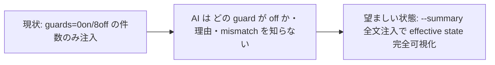

<!--
task-21 W2.4 frontmatter (機械可読、draft-flow-guard.sh / harness-audit が読む):
approval_required: true
approved_at:
approved_by:
retroactive: false
-->

# SessionStart hc-config --summary 全文注入 (effective state 常時可視化)

**ステータス:** 📝 **draft(2026-07-05 起案、user 承認待ち)**
**起点:** master roadmap [`install-immediately-usable-redesign-20260618.md`](./install-immediately-usable-redesign-20260618.md) §4.6 対策 W1-2 (採用済 ✅ conf 0.85) / §5 P1-4
**前提 (成立済):**
- **#86 依存の実態 = subset 依存のみ (2026-07-05 review 反映)**: list.md 依存先 #86 のうち本 task が前提とする subset (**HOTFIX-2 の `--summary` local tier 対応**) は PR #68 で main merge 済 (commit `da42e78`) — `hc-config.sh --get` / `--summary` が `harness-config.local.yml` tier を読む (env > local > yml > default)、`--summary` 冒頭に `local config:` 行 + `(local overridden)` marker を出力 (`.claude/scripts/hc-config.sh:1157-1168` で実在確認)。**#86 残 scope (typo WARN / validate / 表示一貫性) には非依存のため並行着手可**。**「CLI が注入する情報が嘘になる」roadmap §4.6 の前提条件は解消済**。`/new-task 88` 時に list.md #88 依存先列の扱い (task-86 維持 or subset 注記) は main が確定する
- **HOTFIX-1 (PR #68)**: install.sh §6.4 が consuming repo に `harness-config.local.yml` (team-default + 8 toggle true) を create-if-absent 生成済。本 draft の実装 scope に含まない

**関連 fixture / rule:**
- `.claude/hooks/mode-session-start.sh` / `.claude/hooks/session-start-wrapper.sh` / `.claude/hooks/session-start-dispatcher.sh`
- `.claude/tests/sessionstart-footprint-smoke.sh` / `.claude/tests/sessionstart-budget-smoke.sh`
- `.claude/rules/modes.md` (mode 系 hook) / CommonRules.md §「機能 on/off は yml feature toggle で集中管理」(3 点 set)

---

## 1. 真因サマリ / 課題サマリ

roadmap §4.6 (R3): 規範文書は「BLOCK」と書くが、preset によっては実際は advisory に降格している。AI は in-context rule を信じて萎縮する (fp-review 観察 1) か、逆に guard が disabled である事実を見抜けず別経路に逃げる (subscbase-api 2026-06-18 事案)。対策 W1-2 = **SessionStart で `hc-config.sh --summary` 全文を `<system-reminder>` 注入し、AI が effective state を毎セッション可視化する**。

現状の実装は部分注入に留まる: `mode-session-start.sh:50-58` が `--summary` を既に 1 回呼び、awk で `preset:` ($2) と `totals:` (`Non/Moff` 形式) の **2 フィールドだけ** compact status 1 行に抽出している。「**どの guard が disabled か / なぜ (disabled_reason) / docs mismatch があるか / local override されているか**」が AI から不可視。



**真因:** task-73 の SessionStart 短文化 (footprint hard cap 800B、`sessionstart-footprint-smoke.sh:29` `FOOTPRINT_CAP=800`) と W1-2 全文注入 (+300 tokens 許容、roadmap §8.4 D) が **未調停のまま並存** している。全文注入すると cap 800B を必ず超えるため、cap 設計の解決なしに実装できない。

**副次:** roadmap は「13 行注入」と記載するが、HOTFIX-2 で `local config:` 行が追加され実測 **14 行** (2026-07-05 本 repo 実測: 14 行 / 1,364 bytes。team-default 全 enabled 相当を env simulate すると 14 行 / **562 bytes**)。行数は hardcode せず「全文」を仕様とする。

---

## 2. 解決アプローチ比較

| 案 | 内容 | 工数 | メリット | デメリット |
|:---:|:---|---:|:---|:---|
| **A (採用)** | `mode-session-start.sh` を拡張: 既取得の `SUMMARY` 変数 (line 54) を同一 `<system-reminder>` 内に全文 print。compact status の `preset=`/`guards=` フィールドは維持 (FP-2d smoke 互換 + toggle OFF 時 fallback)。footprint cap 800 → **2400B** 引上げ。sub-feature toggle `feature_sessionstart_summary_enabled` 新設 | 0.5 day | `--summary` 呼び出しが既存 1 回のまま (追加 subprocess 0)。diff 最小 (実装は既存 hook 内 +10 行程度)。I2 (dispatcher 経由) 配線変更ゼロで自動充足 | cap 引上げで SessionStart token 増 (下記予算検証)。mode_session_start feature OFF 時は summary も消える (依存を §4 に明記) |
| **B** | 新規独立 hook `hc-summary-surface.sh` を `session-start-wrapper.sh` `DEFAULT_HOOKS` (line 39-50) に追加 | 1 day | 責務分離が file 単位で明確 | `hc-config.sh --summary` が **2 回起動** (mode-session-start.sh:54 と新 hook で重複、SessionStart 並列でも CPU 重複)。新 file + wrapper 配列 + metadata 登録の変更点が多い。**却下**: 既存 hook が同一データを既に取得している以上、DRY 違反 |
| **C** | 圧縮 format: disabled guard 名のみ 1 行列挙 (`guards-disabled: draft_flow_guard,task_rule_guard,... 詳細: hc-config.sh --summary`) で cap 800B 維持 | 0.5 day | footprint 予算現状維持 | **却下**: (1) W1-2 は「全文注入」で承認済 (roadmap §4.6 conf 0.85) — 圧縮採用は承認済 §3 採用案からの逸脱 = user 再確認事項。(2) `disabled_reason` / `(local overridden)` / mismatch 警告が落ち、AI が「なぜ advisory か」を誤解する §4.6 の本来課題が残る |
| **D** | 条件付き注入: mismatch or disabled > 0 のときのみ全文 | 0.7 day | 健全 repo で footprint 増ゼロ | **却下**: 健全 repo でも「有効 guard 一覧を常時可視化」する W1-2 の要件を失う。健全 (全 enabled) 時の全文は実測 562B と小さく、常時注入コストは低い。分岐追加で smoke matrix も複雑化 |

→ **案 A** を推奨。理由: 追加 subprocess 0 / diff 最小 / I2 自動充足 / W1-2 承認 scope に忠実。

### footprint 予算検証 (案 A、2026-07-05 実測)

| 測定 | 現状 | 案 A 後 (推定) |
|---|---:|---:|
| dispatcher stdout (loop + ctx present、FP-1 baseline) | 623B | 623 + 1,364 + header ≈ **2,030B** (harness-dev worst) |
| dispatcher stdout (normal + no ctx、FP-3) | 447B | 447 + 1,364 ≈ 1,850B |
| 同上、consuming repo (team-default 全 enabled、summary 562B) | — | 623 + 562 ≈ **1,230B** |

- cap **2400B** = harness-dev worst 2,030B + 18% margin。budget smoke の hard-fail 5000 chars (`sessionstart-budget-smoke.sh:24` 2 段構成) には十分収まる
- roadmap §8.4 D「+300 tokens 許容」との整合: 本 P1-4 の対象読者 = **consuming repo (team-default)** では summary 562B ≈ 150-190 tokens で予算内。harness-dev (本 repo dogfood) は日本語 disabled_reason 8 件で 1,364B ≈ 400-450 tokens と予算超過するが、これは dogfood repo 限定の自己負担 (§4 リスク R2 参照)

---

## 3. 採用案の詳細設計

### Task 計画 (採用 6 条準拠、Phase 中間階層廃止)

**Goal (1 文):** consuming repo / 本 repo の Claude Code セッション開始時に `hc-config.sh --summary` 全文が `<system-reminder>` で AI に注入され、effective state (preset / guard 別 enabled・disabled / disabled_reason / local override / docs mismatch) が常時可視化される。

#### Step 計画

| Step | Status | 作業概要 | 工数 | 依存 |
|:---:|:---:|:---|---:|:---|
| 1 | 🔲 | `mode-session-start.sh` 拡張: SUMMARY 全文注入 + `is_feature_enabled sessionstart_summary` gate | 1.0h | — |
| 2 | 🔲 | feature toggle 3 点 set: yml key + metadata 登録 + env override 確認 | 0.5h | Step 1 |
| 3 | 🔲 | smoke 更新: footprint cap 2400 + 新 FP-5 (presence/toggle-off) + budget warn 同期 | 1.0h | Step 1-2 |
| 4 | 🔲 | (テスト設計レビュー) reviewer 動的選定 `review_min_count_test ≤ N ≤ review_max_count_test` | 0.5h | Step 3 |
| 5 | 🔲 | (テスト合格) 全対象 smoke PASS + regression 0 | 0.5h | Step 4 |
| 6 | 🔲 | (リファクタリング) 3 観点判定 or `skip: <reason>` | 0.3h | Step 5 |

合計: 約 0.5 day

### Step 1 詳細

#### スコープ
- 対象ファイル: `.claude/hooks/mode-session-start.sh` (94 行、SessionStart wrapper child)
- 配線変更: **なし** (I2 充足根拠: `settings.json:190-201` は `session-start-dispatcher.sh` のみ → `dispatcher-manifest.tsv:32` `session-start-wrapper.sh` → `DEFAULT_HOOKS` line 43 に `mode-session-start` 登録済。settings.json / manifest / wrapper いずれも無改変)

#### 変更内容 (line 74-91 の `<system-reminder>` block 拡張)

```bash
# before (mode-session-start.sh:81-91): compact status 1 行のみ
{
  printf '<system-reminder>\n'
  printf '%s\n' "$STATUS"
  ...
}
# after: SUMMARY 全文を同一 reminder 内に追記 (fail-open: SUMMARY 空なら skip)
# 前提 (2026-07-05 review 反映): SUMMARY="" を PRESET/GUARDS 空初期化 (L51-52) と同列で必ず初期化する。
#   hc-config.sh 不在時に SUMMARY が unset のままだと set -uo pipefail (L15) の nounset で
#   <system-reminder> 開始 printf 直後に閉じタグ無しで hook が途中死し、L13「失敗しても
#   セッションをブロックしない」契約を破るため。
SUMMARY=""   # L52 相当 (hc-config.sh 不在でも定義済を保証)
{
  printf '<system-reminder>\n'
  printf '%s\n' "$STATUS"
  # gate: is_feature_enabled 不在 (config-loader load 失敗) は enabled 扱い (fail-open、L39 の command -v pattern と同方向)
  if [ -n "$SUMMARY" ] && { ! command -v is_feature_enabled >/dev/null 2>&1 || is_feature_enabled sessionstart_summary; }; then
    printf -- '--- effective state (hc-config.sh --summary) ---\n'
    printf '%s\n' "$SUMMARY"
  fi
  ...
}
```

- `SUMMARY` は line 54 で取得済の変数を再利用 (`bash "$HC_SCRIPT" --summary 2>/dev/null || true`)、**追加 subprocess 0**
- `SUMMARY=""` 初期化 (L52 相当) を必ず先行させる (hc-config.sh 不在 × `set -u` での reminder 途中死 = 閉じタグ欠落を防止、2026-07-05 review 反映)
- `is_feature_enabled` 不在 (config-loader.sh load 失敗) 時は `command -v` guard で **不在 = enabled 扱い** の fail-open (line 39 の既存 pattern 踏襲)。素朴な `&& is_feature_enabled ... 2>/dev/null` 形はコマンド不在 rc=127 で条件 false → summary 注入が silent off となり「default ON / fail-open」と矛盾するため、上記 `{ ! command -v ... || is_feature_enabled ...; }` gate 形を採用。`is_feature_enabled` 実体: `.claude/hooks/lib/config-loader.sh:759-784` (空文字含む未知値は enabled 扱い = default ON)
- compact status の `preset=` / `guards=` フィールド (line 75-76) は **維持**: (a) toggle OFF 時の最低限可視化 fallback (b) 既存 FP-2d smoke assert (`sessionstart-footprint-smoke.sh:161-175`) 互換
- wrapper per-hook timeout 5s (`session-start-wrapper.sh:60`) への影響なし (`--summary` 呼び出し回数不変)

### Step 2 詳細

#### スコープ (CommonRules「feature toggle 3 点 set」準拠)
1. `.claude/harness-config.yml`: feature toggle 群 (line 365-388、`feature_agent_router_suggest_enabled` line 388 の直後) に追加:
   ```yaml
   feature_sessionstart_summary_enabled: true   # mode-session-start (hc-config --summary 全文注入、P1-4)
   ```
2. `.claude/scripts/lib/hc-config-metadata.sh`: TSV 1 行登録 (line 108 `feature_agent_router_suggest_enabled` 行と同 format: key / type=feature_toggle / 説明 / false 時効果 / 短 label)
3. hook 冒頭 check は Step 1 の `is_feature_enabled sessionstart_summary` が該当 (hook 全体 gate ではなく summary 注入 section の局所 gate。hook 全体は既存 `feature_mode_session_start_enabled` line 381 が引き続き gate)。env override: `HC_FEATURE_SESSIONSTART_SUMMARY_ENABLED=false`

#### I7 (Config-Consumer-Smoke Triplet) 充足
新 yml key (定義) + `mode-session-start.sh` (consumer) + Step 3 の toggle-off smoke case (値変更で動作が変わる smoke) を **同 task 内** で揃える (memory feedback_config_value_needs_consumer_and_smoke 準拠)。

### Step 3 詳細

#### スコープ
- `.claude/tests/sessionstart-footprint-smoke.sh`:
  - `FOOTPRINT_CAP=800` (line 29) → `2400` + 根拠 comment (実測表 §2 を引用)
  - **FP-5 新設 (presence)**: FP-1 出力に `totals:` と `guards:` が含まれる (summary 全文注入の構造保証。値 hardcode なし、FP-2d と同 style)
  - **FP-6 新設 (toggle-off)**: `HC_FEATURE_SESSIONSTART_SUMMARY_ENABLED=false` で `totals:` absent ∧ footprint < FP-1 baseline (FP-4 の kill-switch 検証 pattern line 229-249 を踏襲)
  - **FP-7 検討 (fail-open)**: hc-config.sh 不在 fixture で `<system-reminder>` 閉じタグまで出力される (hook 途中死なし) case の追加を検討 (SUMMARY 未初期化 × set -u regression の機械固定、2026-07-05 review 反映)
- `.claude/tests/sessionstart-budget-smoke.sh`: `BUDGET_WARN=800` (line 38) → `2400` に同期 (hard-fail 5000 は据置。「hard cap SSoT は footprint-smoke」の役割分担 comment line 12-18 は維持)

---

## 4. リスクと緩和

| # | リスク | 確率 | 影響 | 緩和 |
|:---:|---|:---:|:---:|---|
| R1 | SessionStart token 常時増 (consuming repo +562B ≈ 150-190 tokens/session) | 確定 | L | roadmap §8.4 D で user 許容済 (+300 tokens、月 $0.03 規模)。`HC_FEATURE_SESSIONSTART_SUMMARY_ENABLED=false` で即 OFF 可 |
| R2 | harness-dev の日本語 disabled_reason 肥大で cap 2400 超過 regression (現 worst 2,030B、margin 370B) | M | M | footprint smoke が hard FAIL で機械検出。超過時は disabled_reason 短文化 or cap 再見積を smoke FAIL 起点で対処 |
| R3 | `--summary` 出力 format 変更 (行追加等) で smoke presence assert 空振り | L | L | FP-5 は `totals:` / `guards:` の exists のみ assert (値・行数 hardcode なし)。`cmd_summary` 側にも「mode-session-start.sh が parse する」旨の既存 comment あり (`hc-config.sh:1158-1159`) |
| R4 | `feature_mode_session_start_enabled: false` 時に summary 注入も連動して消える (toggle 依存関係) | L | L | 仕様として明文化 (hook 全体 gate > section gate の階層)。metadata 説明文に「mode_session_start OFF 時は本 toggle に関わらず注入されない」を記載 |
| R5 | `--summary` が exit 非 0 (undocumented mismatch 時、`hc-config.sh:1213`) でも stdout は完全 → `|| true` (line 54 既存) で出力は保持される | — | — | 既存実装で吸収済 (確認済、リスクなしを記録) |
| R6 | #91 (P1-7 list-md-actionable-header) の SessionStart 注入と同時稼働時の合算 context 増 (bootstrap 期) | L | L | #91 tier B は stderr 経路 (`list-md-plan-first-reminder.sh` は `cat >&2`) のため本 draft の footprint cap (dispatcher stdout 計測) に非干渉 (実測確認済)。bootstrap 期 (task 行 0) のみ合算 +5 行。編集 file も完全非重複のため並行実装時の smoke 衝突なし (追加対処不要、2026-07-05 review 反映) |

---

## 5. 移行計画

- [ ] `feature_sessionstart_summary_enabled: true` default ON で投入 (opt-out 型。effective state 可視化は roadmap 承認済の default 挙動)
- [ ] 本 repo (harness-dev) で 1 session dogfood → 注入内容と footprint 実測記録
- [ ] `install.sh --update` 配布対象 (`.claude/hooks/` / `.claude/tests/` / `harness-config.yml`) に自動包含 — 追加作業なし
- [ ] consuming repo (subscbase-api) 側は次回 harness 取込 (development-process.md §harness 取込チェックリスト) で自然反映

---

## 6. 完了条件（DoD）

- [ ] **全文注入**: `env HC_MODE=loop bash .claude/hooks/session-start-dispatcher.sh </dev/null 2>/dev/null | grep -c 'totals:'` → `1` (summary 全文が dispatcher stdout に 1 回出現)
- [ ] **toggle OFF**: `env HC_MODE=loop HC_FEATURE_SESSIONSTART_SUMMARY_ENABLED=false bash .claude/hooks/session-start-dispatcher.sh </dev/null 2>/dev/null | grep -c 'totals:'` → `0`
- [ ] **footprint**: `bash .claude/tests/sessionstart-footprint-smoke.sh` → 全 case PASS (cap 2400、FP-5/FP-6 含む)
- [ ] **budget**: `bash .claude/tests/sessionstart-budget-smoke.sh` → PASS (WARN 0)
- [ ] **yml key 登録**: `bash .claude/scripts/hc-config.sh --get feature_sessionstart_summary_enabled` → `true`
- [ ] **regression 0**: `bash .claude/tests/enforcement-mismatch-smoke.sh` PASS + 既存 SessionStart 系 smoke (`session-start-parallel-smoke.sh` / `session-help-surface-smoke.sh`) PASS
- [ ] **I2 無違反**: `git diff --name-only` に `.claude/settings.json` / `dispatcher-manifest.tsv` が含まれない

---

## 7. 工数見積

合計 **約 0.5 day** (Step 1: 1.0h / Step 2: 0.5h / Step 3: 1.0h / Step 4-6: 1.3h)。roadmap §5 P1-4 見積 0.5 day と整合。

---

## 8. レビューサイクル (workflow.md §「収束条件」準拠)

> draft レビューは reviewer 並列起動 + CRITICAL/HIGH/MEDIUM = 0 まで反復 (LOW 許容、上限 `review_iteration_max`)。起動数は `hc-config.sh --get review_min_count_design` / `--get review_max_count_design` で現在値確認。

| iter | 日付 | reviewer (起動数) | CRITICAL | HIGH | MEDIUM | LOW | 修正 commit | 状態 |
|:---:|---|---|:---:|:---:|:---:|:---:|---|---|
| — | — | — | — | — | — | — | — | 未実施 |

---

## 9. 承認履歴

| 日付 | 承認者 | 結果 |
|---|---|---|
| — | — | (user 承認待ち) |

> 承認記入は先頭 HTML comment frontmatter の承認日 field (file 内 1 箇所) のみに行う (7 draft frontmatter 統一、2026-07-05 review 反映)。

---

## 10. 関連

- master roadmap: [`install-immediately-usable-redesign-20260618.md`](./install-immediately-usable-redesign-20260618.md) §4.6 / §5 P1-4 / §8.4 D
- 依存 task: **#86 の HOTFIX-2 subset のみ** (PR #68 merge 済、commit `da42e78`) — CLI local.yml tier 対応が本 draft の注入内容の正しさを担保。#86 残 scope (typo WARN / validate / 表示一貫性) には非依存で並行着手可 (§前提参照)
- 既存実装: `.claude/hooks/mode-session-start.sh` (task-73 案 B 短文化) / `.claude/hooks/session-start-wrapper.sh` (task-25 A2) / `.claude/hooks/session-start-dispatcher.sh` (task-71)
- 既存 smoke: `.claude/tests/sessionstart-footprint-smoke.sh` (task-73 Step 1) / `.claude/tests/sessionstart-budget-smoke.sh`
- 規範: CommonRules.md §「機能 on/off は yml feature toggle で集中管理」(3 点 set) / roadmap §3 I2 (Dispatcher-Only) / I7 (Triplet)
