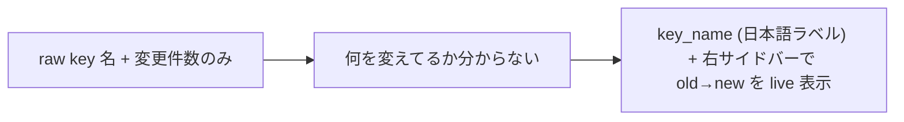

<!--
approval_required: true
approved_at: 2026-06-03
approved_by: user
retroactive: false
-->

# 設定画面 UX 強化 (key 日本語ラベル + 変更内容 右サイドバー、3 列 no-scroll)

**ステータス:** 🔲 **draft（2026-06-03 起案、user 承認待ち）**
**起点:** user 要望 (resume-state loop session): 「キー表示は `key_name (日本語ラベル)` 形式に」+「設定画面にさらに右サイドバーを作成、何を変更しているのか (どの key 日本語が 何→何) を具体表示」
**前提:**
- task-76 (hc-config Web 2 分割再設計、merged PR #57): 左 preset / 右 category accordion / 編集→custom / no-scroll 100vh
- task-77 (git policy、PR #59): web UI 右ペインに mainline_* key + ENUM_OPTIONS。**本 task の実装は #59 merge 後の最新 main から開始** (app.js 衝突回避)
- metadata: `hc-config-metadata.sh` `_hc_metadata_table` = `key<TAB>category<TAB>description<TAB>effect` (82 key、短い日本語ラベル無し)

**関連 fixture / rule:**
- `.claude/scripts/lib/hc-config-metadata.sh` (label 追加先) / `.claude/scripts/lib/hc-config-web-server.js` (metadata parser, /api/keys) / `.claude/scripts/lib/hc-config-web-ui/{app.js,index.html,style.css}`
- `.claude/tests/hc-config-{web-ui,key-parity,tui}-smoke.sh`

---

## 1. 課題サマリ

(1) **key 名が raw**: 右ペインが `feature_draft_flow_guard_enabled` 等の生 key 名で、非専門 user に意味が伝わりにくい。
(2) **変更内容が不透明**: 編集中に「N 件の変更があります」とだけ出て、**どの設定が何から何に変わったか**が一覧で見えない (保存前の確認手段が弱い)。



**真因:** metadata に短い日本語ラベルが無く、変更差分を可視化する UI 面が無い。

---

## 2. 解決アプローチ

| 案 | 内容 | 工数 | 判断 |
|:---:|:---|---:|:---|
| **A 分割** | label と sidebar を別 task | — | 2 回 app.js/metadata 編集で非効率 + sidebar は label 依存 |
| **B 統合 (採用)** | 1 task で label_ja 追加 + render `key_name (label)` + 右サイドバー (3 列 no-scroll) | 3.0 | 密結合 (sidebar が label を使う)、app.js 1 回改修、cohesive |

→ **B 採用**。label → sidebar の順に Step 化 (sidebar が label に依存)。

---

## 3. 採用案の詳細設計

### 3.1 metadata に label_ja 追加 (82 key)

`_hc_metadata_table` の各行を **5 列化**: `key<TAB>category<TAB>description<TAB>effect<TAB>label_ja`。`label_ja` = 短い日本語ラベル (例 `confidence_threshold→信頼度しきい値` / `mainline_integration_policy→本流統合ポリシー` / `feature_draft_flow_guard_enabled→draft フローガード`)。

- **parser 更新**: `hc-config-web-server.js` の metadata 分割 (現 `parts[1]=category` 等) に `parts[4]=label_ja` を追加。`/api/keys` の各 entry に `label_ja` field を追加 (後方互換: 既存 field 維持)。
- **後方互換**: label_ja 欠落 key は空 → UI は key 名のみ表示 (fallback)。
- **key-parity / metadata 行数 smoke**: 列追加で壊れないか確認。82 key 全てに label 付与 (一括は subagent 生成 + main レビュー)。

### 3.2 render `key_name (日本語ラベル)`

中央 accordion の各 key 行ラベルを `<label_ja> (<key_name>)` or `<key_name> (<label_ja>)` 形式に (user 要望は後者 `key_name (日本語ラベル)`)。`label_ja` 空時は `key_name` のみ。CLI (`hc-config.sh --list` / TUI) も任意で同形式に (scope: 本 task は web UI 必須、CLI は余力で)。

### 3.3 右サイドバー「変更内容」(3 列 no-scroll)

```
┌──────────────────────────────────────────────────────────────────┐
│ hc-config 設定  [設定][履歴]              状態:[カスタム]            │
├──────────┬────────────────────────────┬──────────────────────────┤
│ 左:preset │ 中央: 設定値 (accordion)      │ 右: 変更内容 (NEW)        │
│ ○ POC    │ ▼ Gate/Confidence          │ ● 信頼度しきい値            │
│ ● 本番    │   信頼度しきい値              │   (confidence_threshold) │
│ ★ カスタム │   (confidence_threshold)    │   0.6 → 0.7              │
│          │     [0.7 ▾]                 │ ● 本流統合ポリシー          │
│          │   本流統合ポリシー            │   (mainline_integ...)    │
│          │   (mainline_integration...)  │   pr-required            │
│          │     [local-merge ▾]         │   → local-merge          │
│          │            [値変更で custom]  │ (変更なし時「変更なし」)    │
│          │                  [保存][取消] │                          │
└──────────┴────────────────────────────┴──────────────────────────┘
  ↑ 3 列とも viewport 100vh no-scroll (task-76 踏襲)、各列内のみ内部スクロール
```

- **データ**: 既存の baseline↔draft 差分 (app.js state、task-76 で算出済) を使う。各変更 key を `<label_ja> (<key>): <old> → <new>` で list 表示。
- **live 更新**: 値編集の度に右サイドバー再描画。変更 0 件は「変更なし」。
- **既存 save-bar との関係**: save-bar の「N 件の変更があります」は維持 (サマリ)、サイドバーが詳細版。
- **no-scroll**: task-76 の `#app-root{height:100vh;overflow:hidden}` + grid を 2 列→**3 列** (左固定 ~240px / 中央 1fr / 右固定 ~260px) に。各列 `overflow:hidden` + 内部 body `overflow:auto`。768px 以下は縦積み (サイドバーは中央の下 or 折りたたみ)。

### Step 計画 (採用 6 条準拠)

| Step | Status | 作業概要 | 工数 | 依存 |
|:---:|:---:|:---|---:|:---|
| 1 | 🔲 | metadata 5 列化 (label_ja) + 82 key にラベル付与 (subagent 生成→main レビュー) + parser/`/api/keys` に label_ja + key-parity/行数 smoke 維持 | 1.0h | — |
| 2 | 🔲 | 中央 accordion render を `key_name (label_ja)` 形式に (app.js) + label 空 fallback | 0.4h | 1 |
| 3 | 🔲 | 右サイドバー「変更内容」実装 (app.js: 3 列目 render + baseline↔draft 差分→`label (key): old→new`、変更なし表示) | 0.8h | 2 |
| 4 | 🔲 | style.css 2 列→3 列 grid + no-scroll 100vh 維持 + 768px responsive | 0.5h | 3 |
| 5 | 🔲 | (テスト設計レビュー) reviewer 動的選定 min≤N≤max | 0.4h | 4 |
| 6 | 🔲 | (テスト合格) smoke (label_ja in /api/keys、key_name(label) render、サイドバー差分表示) + visual (3 列 no-scroll / 変更内容 live) | 0.6h | 5 |
| 7 | 🔲 | (リファクタリング) 3 観点 | 0.3h | 6 |

合計: 約 4.0h

---

## 4. リスクと緩和

| リスク | 確率 | 影響 | 緩和 |
|---|:---:|:---:|---|
| metadata 5 列化で parser / key-parity / 行数 smoke が壊れる | M | M | column 追加は末尾 (index 安定)、parser は parts[4] 追加のみ、smoke を列追加対応で更新 |
| 82 label の品質ばらつき / 工数 | M | L | subagent 一括生成 → main レビューで統一 (用語整合)、空は key 名 fallback で段階導入可 |
| 3 列で no-scroll が破れる (横幅不足 / 縦溢れ) | M | M | task-76 の min-height:0 + overflow パターン踏襲、狭幅は responsive 縦積み、visual で実測 |
| task-77 (#59) app.js と衝突 | M | M | **#59 merge 後の最新 main から実装開始** (本 draft 前提に明記) |

---

## 5. 移行計画
- label_ja 空 key は key 名のみ表示 → 段階導入可 (全 82 一括が理想だが fallback あり)
- #59 merge 確認後に branch 作成

---

## 6. 完了条件 (DoD)
- [ ] metadata に label_ja (82 key) + `/api/keys` が label_ja を返す + key-parity/行数 smoke 維持
- [ ] 中央 accordion が `key_name (日本語ラベル)` 形式で表示 (label 空は key 名 fallback)
- [ ] 右サイドバー「変更内容」が baseline↔draft 差分を `<label> (<key>): <old> → <new>` で live 表示、変更なしは「変更なし」
- [ ] 3 列レイアウトで viewport 100vh no-scroll (1280/1024 で pageScrollable false) + 768px responsive
- [ ] smoke 全 PASS + 既存 harness smoke regression 0
- [ ] visual 検証 (3 列描画 / 変更内容 live / no-scroll) 合格
- [ ] reviewer approve

---

## 7. 工数見積
約 4.0h

---

## 8. レビューサイクル

| iter | 日付 | reviewer (起動数) | CRITICAL | HIGH | MEDIUM | LOW | 修正 | 状態 |
|:---:|---|---|:---:|:---:|:---:|:---:|---|---|
| 1 | — | — | — | — | — | — | — | 未実施 |

**収束判定**: CRITICAL = 0 ∧ HIGH = 0 ∧ MEDIUM = 0 (LOW 許容)。

---

## 9. 承認履歴

| 日付 | 承認者 | 結果 |
|---|---|---|
| 2026-06-03 | user | **承認** (採用案 B、5 列 metadata + `key_name (label)` + 3 列サイドバー、軽め review = Task 最終のテスト設計レビューのみ)。**実装は PR #59 merge 後の最新 main から開始** (metadata/web-server/app.js の task-77 変更込み) |

---

## 10. 関連
- 既存: task-76 (2 分割 UI、PR #57) / task-77 (git policy 右ペイン key、PR #59)
- 関連 memory: feedback_parallel_subagent_cross_file_contract_drift (app.js↔index.html id) / feedback_step6_visual_verification_browser_skill_template
