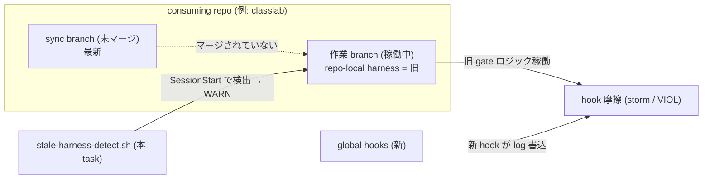

<!--
approval_required: true
approved_at:
approved_by:
retroactive: false
-->

# 旧 harness 稼働継続の検出（stale-harness-detection）

**ステータス:** 🔲 **draft（2026-05-28 起案、user 承認待ち）**
**起点:** 5 リポ調査（2026-05-28）で classlab-weekly-news が 2026-05-07 の旧 harness で稼働継続中であることを実証（資料 `harness-health-7items-analysis.md` §3-F）
**前提:**
- task-44/45/46（feature toggle 化 + config-loader + hc-config.sh）完了済
- install.sh `--update` が consuming repo への配布経路（user manual）

**関連 fixture / rule:**
- `.claude/harness-config.yml`（version marker 追加先）
- `.claude/hooks/session-start-wrapper.sh` / `.claude/settings.json`（SessionStart 配線）
- `install.sh`（version stamp 書込）

---

## 1. 真因サマリ / 課題サマリ

consuming repo が `install.sh --update` を作業 branch に取り込まないまま開発を続けると、旧 harness のまま稼働する。classlab は作業 branch `feat/viewer-list-history` が 2026-05-07 の旧 harness（CommonRules / feature toggle / 新 guard 7 種すべて欠落）、最新 sync は未マージ branch `chore/harness-sync` に隔離。global `~/.claude/hooks/`（新）が log を書く一方で repo-local harness は旧 → **hybrid 稼働**となり、confidence-gate `regex_no_match` storm（79/日）や loop-confirmation VIOLATION（10 件）の摩擦を生む（= 報告問題②「hook 過剰」の根本原因）。

**真因:** harness に version marker が無く、「現在動いている harness がいつのものか」「最新かどうか」を機械検出できない。よって旧 harness 稼働を user / agent が気付けない。

**副次:** global hook（newer）と repo-local hook（older）の hybrid という、検出が一層難しい状態が発生しうる。

---

## 2. 解決アプローチ比較

| 案 | 内容 | 工数 | メリット | デメリット |
|:---:|:---|---:|:---|:---|
| **A** | harness-config.yml に `harness_version` stamp + SessionStart hook で「local version < SSoT」or marker 欠落を検出 → WARN | 1.5 | 軽量、version 比較で明確 | SSoT version を consuming repo が知る経路が必要（install.sh 書込時の値を基準にする） |
| **B** | install.sh --update に「git branch 横断で .claude が最新か」+ 未マージ sync branch 検出 | 2.5 | sync branch 隔離を直接検出 | install 実行時のみ（稼働中の常時検出にならない）、git 解析が重い |
| **C ハイブリッド** | A（version stamp + SessionStart WARN）+ 主要 marker file 存在チェック（CommonRules.md / hc-config.sh / 新 guard 等が欠落していれば WARN） | 1.8 | version 不一致 + marker 欠落の両面で旧 harness を検出、常時稼働 | 検出ロジックがやや増える |

→ **C ハイブリッド** を推奨。理由: version stamp は install.sh が書くため「いつ sync したか」は分かるが、classlab のような「global 新 + repo-local 旧」hybrid は marker file 存在チェックの方が確実。両面検出で取りこぼしを防ぐ。WARN 注入（block しない、honor system）で誤検知時の害を最小化。

---

## 3. 採用案の詳細設計

### Task 計画（採用 6 条準拠、Phase 中間階層廃止）

#### Step 計画

| Step | Status | 作業概要 | 工数 | 依存 |
|:---:|:---:|:---|---:|:---|
| 1 | 🔲 | harness-config.yml に `harness_version` key 追加 + install.sh が stamp 書込（同期日 or SSoT commit short） | 0.4h | — |
| 2 | 🔲 | SessionStart hook `stale-harness-detect.sh` 新設（version 古 or 主要 marker file 欠落で WARN 注入、feature toggle + bypass env、subshell 局所化） | 0.6h | Step 1 |
| 3 | 🔲 | settings.json SessionStart 配線（wrapper 後配置）+ harness-config.yml feature key（`feature_stale_harness_detect_enabled`） | 0.2h | Step 2 |
| 4 | 🔲 | (テスト設計レビュー) 5+ reviewer 動的選定 | 0.3h | Step 3 |
| 5 | 🔲 | (テスト合格) smoke 新設（marker 欠落 fixture で WARN / 最新で silent）+ 既存 regression 0 | 0.3h | Step 4 |
| 6 | 🔲 | (リファクタリング) 3 観点判定 or skip | 0.2h | Step 5 |

合計: 約 2.0h

### Step 1 詳細
- harness-config.yml に `harness_version: "<YYYY-MM-DD or commit-short>"` を追加
- install.sh が `--init` / `--update` 時に現 SSoT の値（git rev-parse --short HEAD or 日付）を stamp として書込
- consuming repo の値 = 最後に sync した時点の SSoT version

### Step 2 詳細
- 新 hook `.claude/hooks/stale-harness-detect.sh`（SessionStart）:
  - 主要 marker file 存在チェック（`CommonRules.md` / `scripts/hc-config.sh` / `hooks/loop-confirmation-detector.sh` / `harness-config.yml` の `feature_*` key 等）→ 欠落があれば「旧 harness 稼働の可能性」WARN
  - （任意）`harness_version` が一定日数より古ければ WARN
  - feature toggle（`is_feature_enabled stale_harness_detect`）+ bypass env（`HC_STALE_HARNESS_DETECT_ENABLED=false`）+ fail-open
- WARN は `<system-reminder>` 注入（block しない、honor system）

### Step 3-6 詳細（Task 最終 3 Steps + 配線）
- **Step 4 (テスト設計レビュー)**: 5+ reviewer 動的選定（tdd-guide / test-automator / qa-expert / pr-test-analyzer + harness-optimizer）、収束まで反復（上限 5）
- **Step 5 (テスト合格)**: smoke（marker 欠落 fixture で WARN 発火 / 全 marker 在で silent / feature OFF で no-op）、既存 smoke regression 0
- **Step 6 (リファクタリング)**: 3 観点判定、不要なら `skip` 明示

---

## 4. リスクと緩和

| リスク | 確率 | 影響 | 緩和 |
|---|:---:|:---:|---|
| 誤検知（意図的に旧版運用中の repo で過剰 WARN） | M | L | block でなく WARN 注入のみ + feature toggle で OFF 可 |
| marker file 一覧の保守漏れ（新 guard 追加時に検出 list 古化） | M | M | 検出は「代表 marker の欠落」に限定（全 file 網羅でなく主要 3-5 個）、規範で追加時の手順明記 |
| global hook と repo-local hook の hybrid を SessionStart 単体で完全検出できない | M | M | marker file（repo-local）欠落で間接検出、完全検出は B 案（install 時 git 解析）を将来追加 |

---

## 5. 移行計画

- [ ] harness_version stamp 導入 + install.sh 書込
- [ ] stale-harness-detect.sh 実装 + 配線
- [ ] hirai-method 内で全 marker 在 → silent を確認
- [ ] classlab で marker 欠落 → WARN 発火を実証（user manual install 前の状態で）

---

## 6. 完了条件（DoD）

- [ ] harness-config.yml に harness_version stamp（install.sh 書込）
- [ ] stale-harness-detect.sh が主要 marker 欠落で WARN、全在で silent（smoke 実証）
- [ ] feature toggle OFF / bypass env で no-op（smoke）
- [ ] 既存 smoke regression 0
- [ ] 規範（CommonRules.md / modes.md or development-process.md）に stale harness 検出機構を明記
- [ ] cross-repo 配布は install.sh user manual

---

## 7. 工数見積

合計 約 2.0h（Step1 0.4 + Step2 0.6 + Step3 0.2 + Step4 0.3 + Step5 0.3 + Step6 0.2）

---

## 8. レビューサイクル（workflow.md §「収束条件」準拠）

| iter | 日付 | reviewer (起動数) | CRITICAL | HIGH | MEDIUM | LOW | 修正 commit | 状態 |
|:---:|---|---|:---:|:---:|:---:|:---:|---|---|
| 1 | 2026-05-28 | architect-reviewer（partial/stall）, harness-optimizer, security-reviewer（2.5） | 0 | 3 | 4 | 2 | — | 修正待ち |

**収束判定**: CRITICAL = 0 ∧ HIGH = 0 ∧ MEDIUM = 0（LOW 許容）

### 8.1 iter 1 集約 finding（反映方針、案 C は全 reviewer 支持）

- **HIGH（version 設計の穴）**: install.sh は working-tree から rsync で **git tag/VERSION 概念が存在しない** → 案 A/C の version 比較は出所未定義。→ `harness_version` を **`YYYY-MM-DD` 固定**、install.sh が --init/--update 時に書込、日数比較は **Phase 2 延期**（当面は version key 欠落 + marker 欠落のみ先行検出）。
- **HIGH**: version-only では hybrid（global 新 + repo-local 旧）を検出不可 → marker file 欠落チェック必須（案 C の論拠は正確と確認）。
- **HIGH**: marker list を hook 内 hardcode は Design Constraints 違反 → **`harness-config.yml` の `stale_harness_markers` key に外出し**（新 guard 追加で yml 1 行）。
- **HIGH（security）**: fail-open は「ガードが古いことを検出するメタ機能」が自身の bug/bypass で stale を見逃すリスク → bypass 可視化（OFF 時も `<system-reminder>` で抑制中を明示）+ self-diagnosis stderr + smoke 拡充。
- **MEDIUM**: fail-open 全ケース（config 不在 / key 不在 / find 異常）列挙 + subshell 局所化明記 / config-loader source 後に `is_feature_enabled` 呼出 / `harness_version` を sanitize（`YYYY-MM-DD` 不一致は UNKNOWN）+ 未来日付検出 / 同一 session 重複 WARN 抑制（state file）。
- **反映**: 案 C 確定。上記を §3 に織り込み iter 2 で再 review（CRIT+HIGH+MED=0 目標）。

---

## 9. 承認履歴

| 日付 | 承認者 | 結果 |
|---|---|---|
| 2026-05-28 | (承認待ち) | — |

---

## 10. 関連

- 統合分析資料: [`harness-health-7items-analysis.md`](harness-health-7items-analysis.md) §3-F（最重要 finding）
- master roadmap: [`harness-health-improvements.md`](harness-health-improvements.md)
- 関連 task: task-44/45/46（feature toggle）/ G（confidence-gate、本 task 完了後に要否再評価）
- 関連 rule: `.claude/rules/modes.md`（Loop モード）/ `.claude/rules/development-process.md`（cross-repo write 例外）
