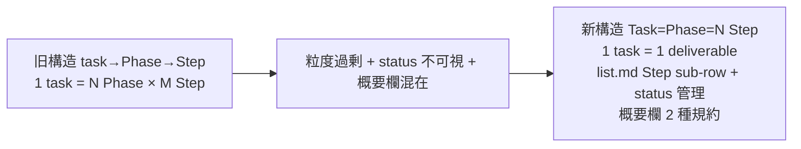

<!--
approval_required: true
approved_at: 2026-05-25
approved_by: user
retroactive: false
-->

# Task = Phase = N Step 規範化 (Step status 管理 + Task 完了条件 + 概要欄 2 種規約)

**ステータス:** ✅ **draft (2026-05-25 起案、user 承認済)**
**起点:** user 指示 (2026-05-25、task-33 Phase 2 Step 2.3 iter1 review 中の指摘、4 ターン連続承認)
**前提:**
- task-29 採用 5 条 (Phase→Step 強制タスク構造規範、2026-05-23 採用) 適用済
- task-33 Phase 1 完遂 + Phase 2 Step 2.2 まで実装済の状態で本規範改定が発生
- 既存 in-progress task (task-21/23/24/27/28) は次回着手時に再構造化推奨 (honor system)
- 完遂済 task (task-1〜32) は履歴として現構造保持

**関連 fixture / rule:**
- `.claude/rules/task-management.md` §タスク構造規範 (task-29 採用 5 条、本規範で改定)
- `.claude/templates/docs/tasks/_TASK_TEMPLATE.md` (Phase 計画 sections 廃止)
- `.claude/templates/docs/tasks/list.md` (Step Status column 追加、sub-row 形式)
- `.claude/templates/docs/draft/_DRAFT_TEMPLATE.md` (§3 Wave/Sub-task → Task 計画)
- `.claude/rules/workflow.md` (Stage 8/9/10/11/13 の Phase 言及書換)
- `.claude/hooks/task-rule-guard.sh` (Phase 構造検証 logic 更新、要 grep 確認)
- `.claude/tests/task-rule-guard-smoke.sh` (Case 6-11 _TASK_TEMPLATE 構造検証、要 update)
- `CLAUDE.md` (§Rules table + §Critical Lessons 追記)

---

## 1. 真因サマリ / 課題サマリ

task-29 採用 5 条 (Phase→Step 強制) により task は「task → Phase → Step」の 3 階層構造になっていたが、user 観察により以下 3 つの粒度設計問題が顕在化した:

1. **粒度過剰**: 1 task が 5 Phase × 14 Step (task-33 実例) のような大規模化、独立した deliverable として scope 過大
2. **status 不可視**: list.md row は task 単位のみ、各 Step の status (📝/🔲/🔄/✅) が IDE 視点で追跡不可
3. **概要欄混在**: list.md 概要列が task overview / step description 区別なく記載、purpose / work / outcome の階層化されない

**真因 (3 階層)**:
1. **規範設計**: task-29 採用 5 条が「Phase」を中間階層として強制、task の粒度を decoupling せず
2. **list.md 設計**: row = task 単位、Step status を表現する column 構造を持たない
3. **概要欄設計**: task / step の責務違いを概要欄文言規約で表現していなかった

**副次:**
- review 単位が「Phase 最終 Step」になり、Phase 跨りの review coverage を判断困難
- task の依存関係が「Phase 1 → Phase 2」のように内部 reference になり、外部依存と区別が不明瞭

**実害 (本セッション task-33 観測)**:
- task-33 が 5 Phase × 14 Step 規模、Phase 1 完遂時点で「task としては完了か」judgment 困難
- list.md task-33 行が概要欄に Phase 全体進捗を文章で表現する形になり、IDE 視点で各 Step status 不可視
- user 明示質問 (本セッション 4 ターン) でようやく構造改定の必要性顕在化

---

## 2. 解決アプローチ比較

| 案 | 内容 | 工数 | メリット | デメリット |
|:---:|:---|---:|:---|:---|
| A 規範のみ | task-management.md §タスク構造規範 update のみ、テンプレ / list.md 据置 | 0.3 | 即日改善、cost 低 | テンプレ / list.md が乖離し新 task で適用されない |
| B 規範 + テンプレ | A + `_TASK_TEMPLATE.md` + `_DRAFT_TEMPLATE.md` + `list.md` template 更新 | 1.0 | 新 task で即適用、移行可能 | 既存 task 構造との不整合、hook 検証未対応 |
| **C ハイブリッド (フル改定)** | B + workflow.md / CLAUDE.md / hook / smoke 更新 + 既存 task-33 restructure (5 task 分割) + 既存 in-progress task 移行ガイド | **3.0** | 完全な新規範運用、hook 検証対応、既存 task 即適用 | 工数中、複数 file 同期、commit 件数増 |
| D B + 既存全 task 一括移行 | C + task-1〜32 完遂済 task も新構造へ書換 | 8.0 | 歴史的整合性、grep 結果一貫性 | 工数過大 + 歴史改変リスク + 既存 commit message との乖離 |

→ **案 C ハイブリッド (フル改定)** を採用。理由: 即日効果 (規範 + テンプレ) + 整合性 (workflow + hook + smoke) + 既存 task-33 即適用 (restructure) の 3 軸で完成度を最大化、案 D の歴史改変は不要 (task-29 既存ガイドと同じく「完遂済は履歴として保持、未着手は次回再構造化」honor system で十分)。

---

## 3. 採用案の詳細設計 (Wave A-D)

### Wave 一覧 (サマリ表)

| Wave | 名前 | 工数 | 依存 |
|:---:|:---|---:|:---|
| A | 規範 + テンプレ (main 直接 Edit 可) | 1.5 | — |
| B | hook 改修 + smoke (subagent staging 必須) | 0.5 | A-2 |
| C | task-33 restructure + list.md restructure + finding carry-forward | 0.8 | A-2, A-4 |
| D | 移行ガイド文書化 (A-2 内に統合) | 0.2 | A-2 |

合計: 3.0 工数

### Wave A: 規範 + テンプレ (main 直接 Edit)

#### A-1: 本 draft 起案
- file: `docs/draft/task-equals-phase-step-status-list-normative.md` (本 file)
- user 指示経緯 + 新規範 + Wave A-D plan + 移行ガイド を 1 file に集約
- 完了条件: file 存在 + user 承認 frontmatter `approved_at: 2026-05-25`

#### A-2: 規範改定 (`.claude/rules/task-management.md` §タスク構造規範)

旧 採用 5 条 → 新 採用 6 条:

1. **Task = Phase = N Step (2 階層、Phase 廃止)** — 1 task は 1 つの Goal + N Steps、Phase という中間階層は廃止し Task と Phase を同義化
2. **Task 必須項目**: 「ゴール (1 文、観察可能)」+ 「作業概要 (箇条書き 3-5 件)」+ 「完了条件 (定量 or 観察可能な事実)」+ 「概要欄: 何のため × 何をやる × 何ができるようになる」
3. **Step 必須項目**: 「作業概要 (1-2 文 actionable description)」+ 「完了条件 (定量 or 観察可能な事実)」+ 「Step status (📝/🔲/🔄/✅)」+ 「概要欄: 作業概要のみ」
4. **Task 最終 = テスト設計レビュー → テスト合格 → リファクタリング (3 段必須)** — 旧 Phase 最終 Step 3 段と同じ、Task 内の最終 3 Steps として配置
5. **小タスク許容**: 1 Task + 1 Step OK (Step 内に test 検証 + refactor 判定併記可)
6. **list.md 表現**: Task header (Step Status=Task 集約 status) + Step sub-rows (Step Status 個別) の 2 階層 markdown table、概要欄は規約 2 種で書き分け

#### A-3: `_TASK_TEMPLATE.md` 改修

- 「Phase 計画」section 廃止
- 「Task ゴール / 作業概要 / 完了条件 / 概要欄」section 追加 (テンプレ冒頭)
- 「Step 計画」section 新設 (Phase 1 / Phase 2 / ... の階層なし、Step 直下列挙)
- 各 Step に「Step Status」「作業概要」「完了条件」明記
- 最終 3 Steps を fixture: テスト設計レビュー / テスト合格 / リファクタリング

#### A-4: `list.md` (template) 改修

新 table 構造:
- column: `# | Step Status | Task / Step | 概要 | 詳細`
- Task header row: `| <id> | <集約 status> | **Task: <タスク名>** | <Task 概要欄: 何のため × 何をやる × 何ができる> | [task-<id>-<slug>.md] |`
- Step sub-row: `|    | <Step status> | Step N.M | <作業概要> | |`

凡例:
- Task header 集約 status: 全 Step ✅ なら ✅、Step に 🔄 / 🔲 が混在なら 🔄、全 🔲 なら 🔲
- Step status: 📝/🔲/🔄/✅/⏸️ (Task header も同じ凡例)
- 📝 (設計未承認) は Step 単位では使用しない (Task header のみ、batch planning 経路 B 中間状態)

#### A-5: `_DRAFT_TEMPLATE.md` 改修

- §3 「採用案の詳細設計」内の「Wave / Sub-task 分割」table 名を「Task 計画」に変更
- 「W1 詳細 / W2 詳細」section を「Step 1 詳細 / Step 2 詳細」に変更
- 完了条件は draft 全体 (= 1 task) に対する DoD として §6 で集約

#### A-6: `workflow.md` Phase → Task 書換

- Stage 8 (TDD) / Stage 9 (module-review) / Stage 10 (local-test) / Stage 11 (system-review) / Stage 13 (scenario-test) の「Phase」言及を「Task」に書換
- Stage 8 description: 「Phase 最終 Step」→「Task 最終 3 Steps」
- §「リファクタリング強制 (W3)」の「Phase 完了時の 3 観点レビュー」→「Task 完了時の 3 観点レビュー」

#### A-7: `CLAUDE.md` Rules table + Critical Lessons 追記

- Rules table の `task-management.md` 行に「採用 6 条 (Phase 廃止、Task=Phase=Step、Step status 管理、Task 完了条件)」と注記
- Critical Lessons に「Phase 中間階層の不採用 (粒度過剰 / status 不可視 / 概要欄混在)」を HIGH 級教訓として追加
- 「task-33 規範改定経緯 (Phase→Step → Task=Phase=Step)」を起源 link

### Wave B: hook 改修 (subagent staging 必須)

#### B-1: `task-rule-guard.sh` Phase 検証 logic 更新

- 既存 hook が Phase 構造を検証している場合 (要 grep 確認) → Task=Phase=Step に合わせて update
- `_TASK_TEMPLATE.md` Phase 計画 section を参照している validation を Step 計画 section に変更
- Step status 列の format check (Step row に Step status 列がない場合は warn)

#### B-2: `task-rule-guard-smoke.sh` 11 cases update

- Case 6-11 が `_TASK_TEMPLATE.md` Phase→Step 構造を検証している場合 → 新構造に合わせて update
- 新 case 追加候補:
  - Case: Task header の集約 status 計算が正しい (全 Step ✅ なら ✅、混在なら 🔄)
  - Case: Step status が 5 種 (📝/🔲/🔄/✅/⏸️) 以外なら warn
  - Case: Task 概要欄が「何のため × 何をやる × 何ができる」3 要素を含むか (regex check)

### Wave C: task-33 restructure + list.md restructure

#### C-1: task-33 file 分割 (5 task)

| 旧 Phase | 新 Task ID | 新 Task slug | 新 Task ファイル名 | Status |
|---|---|---|---|---|
| Phase 1 (規範追加) | task-33 (継承) | list-md-plan-first-normative-rules | task-33-list-md-plan-first-normative-rules.md | ✅ 完遂 (現 commit `9691a1a`) |
| Phase 2 (/new-task 拡張) | task-34 | list-md-plan-first-new-task-update | task-34-list-md-plan-first-new-task-update.md | 🔄 Step 2 完了、Step 3 (テスト設計レビュー) iter1 完了 |
| Phase 3 (SessionStart hook) | task-35 | list-md-plan-first-session-hook | task-35-list-md-plan-first-session-hook.md | 🔲 未着手 |
| Phase 4 (PreToolUse warn) | task-36 | list-md-plan-first-draft-warn | task-36-list-md-plan-first-draft-warn.md | 🔲 未着手 |
| Phase 5 (統合 + CLAUDE.md) | task-37 | list-md-plan-first-integration | task-37-list-md-plan-first-integration.md | 🔲 未着手 |

各 task ファイルは新 `_TASK_TEMPLATE.md` (A-3 更新後) ベースで作成、現 task-33 file の対応 Phase content を移植。

#### C-2: list.md restructure

- 既存 task-33 row を削除
- 新 row 5 件追加 (task-33/34/35/36/37)、各 Task header + Step sub-rows 形式
- 凡例 update (Step Status / Task header status の説明追加)
- table column header update (`# | Step Status | Task / Step | 概要 | 詳細`)

#### C-3: 6 reviewer iter1 findings carry forward

- 現 task-34 (旧 Phase 2) Step 3 (旧 Step 2.3 テスト設計レビュー) iter1 完了
- 6 reviewer iter1 集約: CRIT 3 + HIGH 17+ + MED 多数
- これら finding を新 task-34 ファイル内に「Step 3 iter1 finding 集約」として記録
- Step 4 (旧 Step 2.4 テスト合格) で iter2 fix scope として継続着手

### Wave D: 移行ガイド (A-2 に統合)

A-2 (`.claude/rules/task-management.md` §タスク構造規範) 内に「既存 task 移行ガイド」subsection を新設:

- 完遂済 task (task-1〜32): 履歴として現 Phase 構造保持、書換不要
- in-progress task (task-21/23/24/27/28): 次回着手時に新構造へ再構造化推奨 (honor system)
- task-33 (本 restructure 対象): C-1, C-2 で 5 task に分割 (本 commit で完了)

---

## 4. リスクと緩和

| リスク | 確率 | 影響 | 緩和 |
|---|:---:|:---:|---|
| 既存 in-progress task (task-21/23/24/27/28) の新構造移行漏れ | H | M | honor system 文書化 + 次回着手時の `/start-task` で reminder 注入 (将来 hook 拡張候補) |
| `task-rule-guard.sh` Phase 検証 logic の broken state (B-1 で更新漏れ) | M | H | smoke (B-2) で必ず検証 + commit 前に手動確認 |
| list.md restructure (C-2) で既存 row format との混在 | L | M | row 単位の atomicity 維持、commit 内に before/after 検証 grep を含める |
| 6 reviewer iter1 findings carry forward (C-3) の意味重複 / 漏れ | L | M | 新 task-34 file 内に「Step 3 iter1 finding 集約」section として 17+ finding を明示列挙 |
| 概要欄 2 種規約の文言 drift (Task / Step で混乱) | M | L | A-2 規範文書内に「Task = 何のため × 何をやる × 何ができる」「Step = 作業概要」を明示 + NG/OK 例追加 |

---

## 5. 移行計画

- [x] Wave A-1: 本 draft 起案 (`docs/draft/task-equals-phase-step-status-list-normative.md`)
- [ ] Wave A-2: `.claude/rules/task-management.md` §タスク構造規範 update (採用 6 条 + 移行ガイド)
- [ ] Wave A-3: `.claude/templates/docs/tasks/_TASK_TEMPLATE.md` 改修
- [ ] Wave A-4: `.claude/templates/docs/tasks/list.md` template 改修
- [ ] Wave A-5: `.claude/templates/docs/draft/_DRAFT_TEMPLATE.md` 改修
- [ ] Wave A-6: `.claude/rules/workflow.md` Phase → Task 書換
- [ ] Wave A-7: `CLAUDE.md` Rules table + Critical Lessons 追記
- [ ] Wave B-1: `task-rule-guard.sh` Phase 検証 logic 更新 (subagent staging)
- [ ] Wave B-2: `task-rule-guard-smoke.sh` 11 cases update (subagent staging)
- [ ] Wave C-1: task-33 file を 5 task (33/34/35/36/37) に分割
- [ ] Wave C-2: list.md restructure (sub-row 形式 + Step status 列)
- [ ] Wave C-3: 6 reviewer iter1 findings carry forward to 新 task-34 Step 3 iter1 集約
- [ ] commit (本 amendment scope 全体を 1 commit に集約、または Wave 別 commit 2-3 件)

---

## 6. 完了条件（DoD）

- [ ] `.claude/rules/task-management.md` §タスク構造規範 新採用 6 条が存在 (grep "採用 6 条" PASS)
- [ ] `_TASK_TEMPLATE.md` で Phase 計画 section 廃止 + Step 計画 section 存在 (grep "Phase 計画" not found, grep "Step 計画" PASS)
- [ ] `list.md` template に Step Status column + sub-row 形式 example 存在
- [ ] `_DRAFT_TEMPLATE.md` §3 「Task 計画」section 存在
- [ ] `workflow.md` Stage 8/9/10/11/13 で「Phase」→「Task」書換完了 (grep diff)
- [ ] `CLAUDE.md` Rules table + Critical Lessons 追記完了
- [ ] `task-rule-guard.sh` 新構造対応 + smoke 11 cases (+ new cases) PASS
- [ ] task-33 file が 5 task (33/34/35/36/37) に分割済 + 旧 task-33 file は task-33 (新) として Phase 1 scope のみに reduce
- [ ] list.md restructure 完了 + 新 row 5 件 (33/34/35/36/37) + Task header + Step sub-rows 表示
- [ ] 6 reviewer iter1 findings が新 task-34 Step 3 iter1 集約として記録
- [ ] commit 完了 (push は user manual で実施、Loop モード自律実行禁止)
- [ ] 既存 in-progress task (task-21/23/24/27/28) は次回着手時に移行 (本 commit では対象外、honor system)

---

## 7. 工数見積

合計 **3.0 工数** (Wave A: 1.5 + Wave B: 0.5 + Wave C: 0.8 + Wave D: 0.2)。

主は main 直接 Edit (Wave A + C)、hook 改修のみ subagent staging (Wave B)。

---

## 8. 承認履歴

| 日付 | 承認者 | 結果 |
|---|---|---|
| 2026-05-25 | user | 承認 (本 session 4 ターンの user 指示「タスク=Phase->step」「list.md も管理項目、Step status、Phase ごと完了条件」「概要欄 Phase=何のため×何をやる×何ができる、Step=作業概要」「ハーネス改修プラン問題ありません」) → 本 draft 起案 + Wave A-D 即時着手 |

---

## 9. 関連

- 起源 user 指示: 2026-05-25 セッション 4 ターン (本 draft §1-§3 source)
- 関連既存規範:
  - `.claude/rules/task-management.md` §タスク構造規範 (task-29 採用 5 条、本 draft で改定)
  - `.claude/rules/task-management.md` §「設計→承認→タスク追加フロー（必須）」(本 draft も同フロー準拠)
- 前提 task: task-29 (Phase→Step 採用 5 条、本規範の前身、規範自体は新採用 6 条に supersede)
- 影響 task: task-33 (現 Phase 構造 → 5 task 分割) / task-21/23/24/27/28 (in-progress、次回着手時移行 honor system) / task-1〜32 (完遂済、履歴保持)
- 設計判断起源: 本セッション task-33 Phase 2 Step 2.3 iter1 review 中の user 観察 + 即時 user 明示指示 (4 ターン)
- 採用 6 条 4 段 (旧 Phase 最終 Step 3 段) は Task 最終 3 Steps として継承、bypass `ECC_TEST_DESIGN_REVIEW_OFF=1` も継承
- 派生 task 候補 (parking-lot 検討): Wave B-1 hook 拡張で Task 概要欄 3 要素 regex check (本 draft では out-of-scope、効果検証後の昇格判定)
