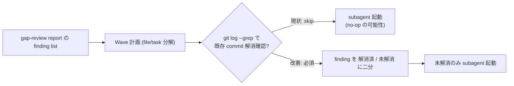

# Wave 計画事前確認 (git log --grep) のテンプレ強制

**ステータス:** 🔲 **draft（2026-05-21 起案、user 承認待ち）**
**起点:** 本セッション 2026-05-21 TM 別 repo (`/Users/t.hirai/タスクマネジメント/`) の HIGH 9 件修正で発覚した重複 subagent 起動 (Wave 2-C / 2-D / 4 が既存 commit `d705efc` / `d752046` で no-op だった)
**前提:**
- task #1 (W1-W5 workflow 強制) 完了済
- next-actions.md entry #15 起源

**関連 fixture / rule:**
- `.claude/rules/development-process.md` (本 draft で参照される副産物即時 draft 起こし義務)
- `.claude/rules/workflow.md` Stage 8 (`tdd`) / Stage 7 (`tdd` for modify)
- `.claude/commands/new-feature.md` / `modify-feature.md`
- `.claude/templates/docs/tasks/_TASK_TEMPLATE.md`

---

## 1. 真因サマリ / 課題サマリ

別 repo (TM) の gap-review report (`docs/reports/2026-05-20_implementation-gap-review.md`) を起点に Wave 計画を立てる際、**finding list と git log の同期確認を省略**したため、既に解消済の finding に対しても subagent を起動してしまい、token / 時間の二重消費が発生した。

具体的には本 session の Wave 2-C (C-7) / Wave 2-D (E-2) / Wave 4 (B-3) の 3 件が **既存 commit (`d705efc` / `d752046`) で解消済の no-op**。Wave 2 完了後に手動で「事前確認 step」を inline 追加し Wave 3 / 4 に組み込んだが、構造的な再発防止には至らず。



**真因:** Wave 計画 stage (workflow.md Stage 8 `tdd` 直前) に「finding の git log --grep 事前確認」を強制する機構が存在しない。subagent dispatch prompt も「対象 finding が解消済か検証してから着手」を明示していない。

**副次:** review report が古い state で書かれた場合 (本 session の TM gap-review は 2026-05-20 作成、その後 `d705efc` で複数 finding が解消されたが report 未更新) に、計画段階で乖離を検出できない。

---

## 2. 解決アプローチ比較

| 案 | 内容 | 工数 | メリット | デメリット |
|:---:|:---|---:|:---|:---|
| **A** | `_TASK_TEMPLATE.md` の Wave セクションに「事前確認 (git log --grep)」step を追加 | 0.2 | テンプレ強制で漏れ防止、新規 task 全件適用 | 既存 task / 別 repo 作業は対象外 |
| **B** | subagent dispatch prompt template に「事前確認 step」を強制 | 0.4 | subagent prompt level の強制で別 repo 作業も captured | template の SSoT 化が必要、保守コスト中 |
| **C ハイブリッド** | A + B (テンプレ + prompt 強制) + Wave 計画 phase で「`git log --all --grep <finding-pattern>`」を必須コマンドとして `workflow.md` Stage 8 / Stage 7 に明文化 | 0.6 | 三層防御 (template / prompt / rule)、別 repo 作業も別 repo の git log で確認可能 | doc 編集箇所が複数 (3 file) |

→ **C ハイブリッド** を推奨。理由: Wave 計画 → subagent prompt → 実装の各 stage で independent に検出可能で、1 stage で漏れても次 stage で catch できる。本 session のように「Wave 2 で no-op 発覚 → Wave 3 / 4 で inline 補正」のような事後対応を防げる。

---

## 3. 採用案の詳細設計

### Wave / Sub-task 分割

| Wave | 内容 | 工数 | 効果 |
|:---:|:---|---:|:---|
| W1 | `_TASK_TEMPLATE.md` の Wave セクションに「事前確認 (git log --grep)」step 追加 | 0.2 | 新規 task 全件で事前確認義務 |
| W2 | `workflow.md` Stage 8 (`tdd`) / Stage 7 (modify) に「Wave 計画前に `git log --all --grep <pattern>` で finding 解消確認」必須化 | 0.2 | rule level での強制 |
| W3 | `new-feature.md` / `modify-feature.md` orchestrator command の Stage transition に「事前確認 sub-step」を組み込み | 0.3 | command level で機械化 |
| W4 | smoke test `.claude/tests/wave-precheck-template-smoke.sh` 新規追加 (W1-W3 の存在検証、4 cases) | 0.3 | regression 防止 |

合計: 1.0 工数

### W1 詳細

#### スコープ
- 対象ファイル: `.claude/templates/docs/tasks/_TASK_TEMPLATE.md`
- 対象セクション: 「Wave 計画」セクション (既存)

#### 変更内容
既存テンプレに以下のサブセクションを追加:

```markdown
### Wave 計画前の事前確認 (必須)

別 repo 作業 / 既存 gap-review report 起点の Wave 計画では、各 finding に対し以下を**着手前に**実施:

1. `git log --all --grep <finding-id-or-keyword> --oneline` で既存 commit を確認
2. 該当 file を Read で現状確認
3. 解消済 finding は Wave list から除外し、本テンプレに「[no-op、commit <sha> で解消済]」と記録
4. 未解消 finding のみ subagent dispatch 対象に残す

省略時: 重複 subagent 起動 / no-op 発覚での Wave 再計画コスト
```

#### テスト
- `wave-precheck-template-smoke.sh` Case 1: テンプレ内に「事前確認」keyword 存在検証

### W2 詳細

#### スコープ
- 対象ファイル: `.claude/rules/workflow.md`
- 対象セクション: 新規機能 14-stage 表 (Stage 8 `tdd`) / 既存機能修正 10-stage 表 (Stage 7 `tdd`)

#### 変更内容
Stage 8 / Stage 7 の説明列に以下を追記:

```markdown
| 8 | `tdd` | RED → GREEN → REFACTOR (subagent 経由のみ、メイン直接編集禁止)。**Wave 計画前に `git log --all --grep <finding>` で既存 commit 解消確認必須** (本セッション 2026-05-21 の TM 修正で no-op 重複起動を防ぐため) | `/start-task <id>` |
```

#### テスト
- Case 2: workflow.md Stage 8 / Stage 7 説明列に「git log --grep」keyword 存在検証

### W3 詳細

#### スコープ
- 対象ファイル: `.claude/commands/new-feature.md` / `.claude/commands/modify-feature.md`

#### 変更内容
Stage 8 (new) / Stage 7 (modify) に sub-step として `Wave Pre-check` を追加:

```markdown
### Stage 8 (tdd) sub-step: Wave Pre-check

Wave / sub-task 分解後、各 Wave 着手前に:

1. メインが `git log --all --grep <finding>` で既存 commit を確認
2. 解消済 finding は task ファイルの Wave 表から「[no-op、commit <sha>]」マーク
3. 未解消 finding のみ subagent dispatch
4. subagent prompt に「事前確認 step」を明示 (現状ファイルを Read → 解消済なら no-op 報告)
```

#### テスト
- Case 3: new-feature.md / modify-feature.md に「Wave Pre-check」keyword 存在検証

### W4 詳細

#### スコープ
- 新規ファイル: `.claude/tests/wave-precheck-template-smoke.sh`

#### 変更内容
4 cases:
1. `_TASK_TEMPLATE.md` に「事前確認」keyword 存在
2. `workflow.md` Stage 8 / Stage 7 に「git log --grep」keyword 存在
3. `new-feature.md` に「Wave Pre-check」存在
4. `modify-feature.md` に「Wave Pre-check」存在

PASS 判定: 4/4 grep hit。

---

## 4. リスクと緩和

| リスク | 確率 | 影響 | 緩和 |
|---|:---:|:---:|---|
| 事前確認 step が過剰負荷で skip 化 | M | M | grep 1 行のみで負荷最小、自動化候補は次バージョンで検討 |
| `git log --grep` の検索パターン設計が不適切で取りこぼし | M | M | finding-id (例: B-1 / C-3) + keyword (例: snake_case / business_hours) の **2 系統 grep** を template に例示 |
| 別 repo 作業時の `git -C <abs path>` 忘れ | L | M | template に「別 repo は `git -C <abs path>` 必須」明記 |

---

## 5. 移行計画

- [ ] W1 _TASK_TEMPLATE.md 編集
- [ ] W2 workflow.md 編集
- [ ] W3 new-feature.md / modify-feature.md 編集
- [ ] W4 smoke test 追加 + 4/4 PASS 確認
- [ ] 既存 smoke regression 確認 (workflow-guard-smoke / next-actions-hooks-smoke / loop-auto-progress-smoke 等)
- [ ] commit (1 W = 1 commit、Conventional Commits 形式)

---

## 6. 完了条件（DoD）

- [ ] W1-W4 全 commit (4 commit 想定)
- [ ] `wave-precheck-template-smoke.sh` 4/4 PASS
- [ ] 既存 smoke regression 0
- [ ] next-actions.md entry #15 を「処理結果」列に `→ docs/draft/wave-precheck-git-log-grep.md → task-<id>` と記入
- [ ] docs/tasks/list.md に task 行追加 (`/new-task` 経由)
- [ ] CLAUDE.md Critical Operational Lessons (任意、HIGH 級事例なら転記)

---

## 7. 工数見積

合計 1.0 工数 (W1 0.2 + W2 0.2 + W3 0.3 + W4 0.3)

---

## 8. 承認履歴

| 日付 | 承認者 | 結果 |
|---|---|---|
| 2026-05-21 | user | 起案 (user 指示「このリポジトリも修正してくださいね」を承認とみなす) → `docs/tasks/task-<ID>-wave-precheck-git-log-grep.md` 作成予定 |

---

## 9. 関連

- next-actions.md entry #15 (起源)
- `.claude/rules/development-process.md` §「副産物発生時の即時 draft 起こし義務」
- `.claude/rules/workflow.md` 新規 14-stage / 修正 10-stage
- 本セッションの no-op 発覚 commit: `d705efc` (asana overdue assignee + maxTurns 30) / `d752046` (SDK MCP + snake_case)
- TM gap-review report: `/Users/t.hirai/タスクマネジメント/docs/reports/2026-05-20_implementation-gap-review.md` (本 draft の起源データ)
