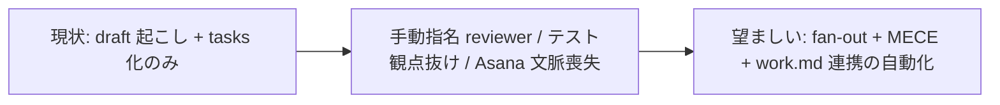

# HIRAI メソッド Workflow Enforcement（設計レビュー fan-out + テスト設計 MECE + workflow 強制 + リファクタリング強制）

**ステータス:** 🔲 **draft v2（2026-05-12 起案 / 2026-05-12 round-2 review 反映、user 承認待ち）**
**起点:** user 依頼「ハーネスに組み込んでテストしてください」(2026-05-12)
**前提:**
- HIRAI メソッド Loop/Normal モード機構が稼働中（`.claude/rules/modes.md`）
- 設計→承認→タスク追加フロー稼働中（`.claude/rules/development-process.md`）
- confidence-gate.sh が subagent transcript path を agent_id 経由で解決できる (commit 96da878 適用済)
- Asana MCP / Slack MCP が `.mcp.json` で wire 済み（W6 で利用、それ以外の Wave は MCP 非依存）

**関連 fixture / rule:**
- `.claude/rules/development-process.md` — 既存 TDD・委譲・タスク管理ルール
- `.claude/rules/modes.md` — Normal/Loop モード
- `.claude/hooks/task-rule-guard.sh` — 既存タスク命名ガード
- `.claude/hooks/confidence-gate.sh` — F3 subagent transcript path 解決 (round-2 で要修正済)
- `.claude/commands/new-draft.md` / `new-task.md` / `start-task.md` / `finish-task.md`
- `.mcp.json` — Asana / Slack MCP 接続定義（W6 で利用）

---

## 0. v2 変更点（round-2 review 反映）

3 reviewer (architect-reviewer / code-architect / security-reviewer) round-2 で合計 46 findings (CRITICAL 6 / HIGH 16 / MEDIUM 15 / LOW 9) を受領。本 v2 で **CRITICAL 6 + HIGH 主要項目** を反映:

| 変更 | 反映元 finding | v2 修正概要 |
|---|---|---|
| **work.md を W1 (最初) から W6 (最後・optional) に降格** | arch-rev C1 (二重 SSoT) / sec-rev C1 (commit 時データ露出) / sec-rev H6 (prompt injection vehicle) | 既存 task-`<id>`-`<slug>`.md frontmatter にメタ情報を載せ work.md は補助。default `.gitignore`、commit はユーザ opt-in (`HIRAI_COMMIT_WORK_MD=true`)。SessionStart 注入時は外部コンテンツを sanitize し基本情報表のみ |
| **workflow-guard.sh を grep 依存から `.claude/.workflow-state/<slug>.json` 構造化ステートに変更** | arch-rev C2 / code-arch C2 | step 番号は JSON フィールド、pending findings も JSON 配列。発火イベントは `PreToolUse(Bash)` の `/finish-task` 検知 (既存 task-rule-guard / gateguard と同パターン) |
| **reviewer-registry を `.claude/lib/` 新設ではなく `harness-config.yml` のフラット配列に集約** | arch-rev H4 / code-arch C1 | `reviewer_registry_design`, `_security`, `_test`, `_impl` 4 キー、config-loader 既存パーサで読める形式。新パーサ実装不要 |
| **Wave 順序を再構成: W1 = test-design (最低依存)、Asana 連携は最後 (W6, optional)** | arch-rev H2 / code-arch C2 dependency | W1 (MECE test-design) → W2 (design-review fan-out) → W3 (module/system-review) → W4 (new-feature/modify-feature command + workflow-guard.sh) → W5 (rule 文書化) → W6 (Asana/Slack 連携 + work.md) |
| **全 env-var bypass を `bypass.log` に audit 記録** | sec-rev H3 | `ECC_*_OFF=1` と `HC_*_ENABLED=false` の両系統で session_id + timestamp + bypass 理由を log。`harness-audit` で集計参照 |
| **slug 引数 / URL 引数を strict validation** | sec-rev H4 (URL injection) / H5 (slug path traversal) | slug: `^[a-z0-9][a-z0-9-]{2,48}$` (git branch 規約準拠)、Asana URL: `^https://app\.asana\.com/0/[0-9]+/[0-9]+$`、Slack URL: `^https://[a-z0-9-]+\.slack\.com/archives/[A-Z0-9]+/p[0-9]+$` |
| **設定 14/10 step を共通 stage 名で抽象化** | arch-rev H3 (MECE 違反) | `.claude/lib/workflow-stages.yml` ではなく `harness-config.yml` の `workflow_stages_new` `workflow_stages_modify` フラット配列にステージ名列挙。workflow-guard.sh は stage 名で判定し step 番号を使わない |
| **新規 command に共通 frontmatter + Phase 構造スケルトン強制** | code-arch H1 | draft 内に 7 command 共通スケルトンを追記 (description / 使い方 / 引数 / Phase 1〜N / 制約 / 関連) |
| **W4b 統合**: `/module-review` `/system-review` は workflow command の前段 (W3) に位置付け | arch-rev H1 (W4/W4b 依存逆転) | W3 で module/system-review、W4 で workflow command。元 W4b は廃止 (内容を W3 に統合) |
| **CRITICAL 独立 hot-fix**: `.claude/settings.local.json` の blanket `"Bash"` `"Edit"` `"Write"` 削除 | sec-rev C2 | 本 draft の scope 外だが実装前に必須。Out-of-band の 1 commit で別途修正 |

未反映で v3 (将来) 検討対象: MEDIUM-1 (DRAFT_TEMPLATE 破壊的変更を _FEATURE_DRAFT_TEMPLATE に分離) / MEDIUM-3 (MECE 20 カテゴリのサイズ別段階適用) / その他 MEDIUM/LOW 計 24 件 — 実装中に都度判断。

レビュー詳細: `~/.claude/projects/.../tasks/a6bd1076559c8c7f9.output` (architect-reviewer) / `a6190636a32bd7260.output` (code-architect) / `a001d82c42672c0f8.output` (security-reviewer)。要約は `docs/tasks/` 個別 task の「設計起源」に保管予定。

---

## 1. 真因サマリ / 課題サマリ

現状の HIRAI ハーネスは「設計→承認→タスク追加」までは強制している（task-rule-guard.sh）が、その**後段の質保証フロー**が個別 agent 依頼に依存しており、以下が欠落:

1. **設計レビューの自動 fan-out 不在**: draft 作成後、user が手動で `architect` / `security-reviewer` 等を個別指名する必要があり、レビュー漏れ・観点抜けが発生
2. **テスト設計の MECE 強制不在**: テスト観点が agent 任せで、E2E / DB / 境界値 / カバレッジ / レスポンスタイム等の網羅性確認なし。「何をやらないか」の明示なし
3. **新規/既存の workflow 差分強制不在**: 5 フェーズ workflow（新規）と 8 ステップ workflow（既存修正）が成文化されておらず、phase skip / pre-test 省略が発生
4. **タスク文脈の永続化不在**: Asana チケット ID / Slack スレ / 依頼者 / 期日が会話履歴に閉じており、セッション再開時に再ヒアリングが必要



**真因:** ハーネスが「タスク管理機構」までは整備されたが「品質保証 orchestration」が未整備。

**副次:**
- セッション跨ぎ時、現タスクの依頼背景がメインに復元されない
- 設計レビューが特定 reviewer に偏り、観点が固定化
- 「やらないテスト」の意思決定が記録されず、後で「なぜカバレッジが低い?」が再燃

---

## 2. 解決アプローチ比較

| 案 | 内容 | 工数 | メリット | デメリット |
|:---:|:---|---:|:---|:---|
| **A 最小実装** | hook 追加なしで rule 文書化のみ。slash command 追加なし | 0.3 | 低リスク・即着手可 | 強制力ゼロ。user 「修正してほしい」と毎回明示要 |
| **B フル強制 (hook + command + rule)** | `/new-feature` `/modify-feature` `/design-review` `/test-design` `/work-init` 5 command + 3 hook + 2 rule + work.md template | 3.5 | 全工程強制可能・テンプレ化で再現性高 | 大規模変更・review fan-out で cost 増 |
| **C 段階導入** | Wave 1: work.md + Asana 連携 / Wave 2: design-review fan-out / Wave 3: test-design MECE / Wave 4: workflow 強制 hook | 2.8 | 各 Wave 独立 deliver 可・review コスト分散 | 全体最適視点で後戻り発生の可能性 |

→ **C 段階導入** を推奨。理由:
- 各 Wave は独立に user 検証可能（Loop モードで一気通貫実装してもコミット粒度を保てる）
- Wave 1（work.md + Asana）は他 Wave の前提（タスク文脈基盤）になるため最初に固める
- Wave 4 の workflow 強制は前 3 Wave の成果物（command / template）を組み合わせるだけで実装可

---

## 3. 採用案の詳細設計（Wave / Sub-task 分割）

**v2 構造**（§0 「v2 変更点」参照、依存順に並べ替え済）:

| Wave | 内容 | 依存 | 工数 | 効果 |
|:---:|:---|:---|---:|:---|
| **W1** | `/test-design <slug>` command + MECE テストカタログ template (`.claude/templates/docs/draft/_TEST_DESIGN_TEMPLATE.md`) + ユーザスコープ決定強制 (`/new-task` 連動 block) | (独立) | 0.6 | テスト設計網羅性担保。最低依存・最大価値 |
| **W2** | `/design-review <slug>` command + reviewer registry を `harness-config.yml` フラット配列で実装 + parallel Agent fan-out + 集約レポート `docs/draft/<slug>-review.md` | (独立) | 1.0 | 設計レビュー自動化。reviewer-loader.sh で env override 対応 |
| **W3** | `/module-review <module>` `/system-review` command + refactoring-specialist 起動規約 (持続可能性 / 汎用性 / 非冗長化 3 観点) + behavior-preserving 自動 diff チェック | W2 | 0.7 | 持続可能性・汎用性・非冗長化の強制 |
| **W4** | `/new-feature <slug>` `/modify-feature <slug>` command + `workflow-guard.sh` (`PreToolUse(Bash) /finish-task` 検知 + `.claude/.workflow-state/<slug>.json` 参照) + `workflow_stages_new` `workflow_stages_modify` を harness-config.yml に追加 + `_TASK_TEMPLATE.md` frontmatter 拡張 (Asana URL / Slack URL / 期日 / 依頼者) | W3, _TASK_TEMPLATE | 1.2 | 14/10 step workflow 強制。step 番号でなく stage 名で判定 |
| **W5** | `.claude/rules/workflow.md` 新設 (`development-process.md` 重複部分は参照リンクのみ) + `modes.md` に Loop 例外規約追記 + CLAUDE.md Rules/Commands 表更新 + smoke test | 全 Wave | 0.5 | ハーネス自己整合性確保 |
| **W6** | `docs/work.md` template (default `.gitignore`、opt-in commit) + `/work-init` command (URL 厳格 validation、prompt-injection sanitize) + Asana/Slack MCP 取得 helper + work-session-check.sh (基本情報表のみ注入) | (optional) | 0.5 | タスク文脈基盤。Asana 連携任意化、core 機能は W1-W5 で完結 |

合計: **4.5 工数** （v1 4.2 から +0.3、CRITICAL 修正吸収分）

**重要**: 各 Wave の詳細セクション (§3 W1 詳細以下) は v1 順序のまま残存している。v2 順序適用時は **§0 変更点** の指示が優先される。次フェーズ (`/new-task` 化) で v2 順に並べ直す。

---

### W1 詳細: docs/work.md + Asana/Slack 連携

#### スコープ
- 新規: `docs/work.md`（プロジェクトルート直下、現タスク文脈の SSoT）
- 新規: `.claude/templates/docs/work.md`（テンプレート）
- 新規: `.claude/commands/work-init.md`（Asana URL ヒアリング + MCP 取得 + work.md 書き込み）
- 新規: `.claude/hooks/work-session-check.sh`（SessionStart hook、work.md 内容を再注入）
- 編集: `.claude/settings.json` (SessionStart hooks 配列に追加)
- 編集: `.gitignore`（work.md を含めるか除外するかは検討。秘匿情報含まない前提で commit 対象案を推奨）

#### work.md テンプレ提案

```markdown
# Work Context — <タスク略称>

> このファイルは現在進行中のタスクの SSoT。
> セッション開始時に `.claude/hooks/work-session-check.sh` が読み、メインに再注入する。
> タスク切替時は `/work-init <new-slug>` で上書き、または `docs/work-archive/` へ退避。

## 基本情報

| 項目 | 値 |
|---|---|
| **タスク slug** | <kebab-case> |
| **目的** | <1〜3 文で「なぜこれをやるか」> |
| **依頼者** | <name / Slack handle / Asana user> |
| **期日** | YYYY-MM-DD（または "未設定"） |
| **ブランチ** | feat/<slug> など `.claude/rules/git-workflow.md` 規約準拠 |
| **Asana URL** | https://app.asana.com/0/<project>/<task> |
| **Slack スレッド** | https://<workspace>.slack.com/archives/<channel>/<ts>（複数可） |
| **設計 draft** | `docs/draft/<slug>.md` |
| **タスクファイル** | `docs/tasks/task-<id>-<slug>.md` |

## 時系列ログ

| 日時 | 出来事 | 出典 |
|---|---|---|
| 2026-05-12 09:30 | Asana 起票（status: To Do） | Asana API |
| 2026-05-12 10:15 | Slack `#dev-foo` で要件議論 | Slack API |
| 2026-05-12 14:00 | `/work-init` 実行、本ファイル生成 | work-init command |
| 2026-05-12 14:05 | `/new-draft <slug>` で設計起こし | new-draft command |

## Asana タスク要約

<MCP で取得した Asana タスクの本文を 200 字以内で要約。完了条件・添付ファイル URL を含む>

## Slack コンテキスト

### Thread 1: <スレ URL>

<MCP で取得した Slack スレッドの要約。発言者・要点 3 点>

### Thread 2: ...

## 未解決 / 確認待ち

- [ ] <未確定の仕様>
- [ ] <依頼者への質問>

---

最終更新: YYYY-MM-DD HH:MM
```

#### `/work-init` 動作

1. user に Asana URL をヒアリング（既に引数で渡されていなければ）
2. Asana MCP `asana_get_task` で本文取得 → タスク名・期日・assignee・依頼者抽出
3. Asana タスクの comments / description から Slack URL を正規表現で抽出
4. 抽出した各 Slack URL に対し Slack MCP `read_thread` で本文取得
5. branch 提案: Asana タスク名から slug 生成 → `feat/<slug>` または `fix/<slug>`（user 確認）
6. work.md テンプレ展開 + 上記情報を埋め込み
7. `git checkout -b <branch>` 提案（user 承認後実行）

#### work-session-check.sh 動作

```bash
# 疑似コード
if [ -f "docs/work.md" ]; then
  # 先頭 60 行を <system-reminder> で注入
  # メインが「現在のタスク文脈」を session 開始時点で把握できるようにする
fi
```

#### テスト
- `tests/work-init-cmd.test.sh`: Asana URL → MCP mock → work.md 生成検証
- `tests/work-session-check.test.sh`: work.md 存在/不在パターン

---

### W2 詳細: 設計レビュー fan-out

#### スコープ
- 新規: `.claude/commands/design-review.md`
- 新規: `.claude/lib/reviewer-registry.yml`（design / impl / security / test 等のカテゴリ別 agent リスト）
- 編集: `.claude/rules/development-process.md`（fan-out フロー追記）

#### reviewer-registry.yml 提案

```yaml
# Agent タイプを「カテゴリ」ごとに分類。
# /design-review <slug> は design カテゴリ全 agent を並列起動する。
# Loop モード時は全カテゴリ起動、Normal モード時は user が確認した上で起動範囲決定。

design:
  - architect           # システム設計全般
  - architect-reviewer  # 設計レビュー専門
  - code-architect      # コード構造設計
  - api-designer        # API endpoint 設計（API task のみ）
  - ui-designer         # UI/UX 設計（FE task のみ）
  - database-reviewer   # DB スキーマ・migration（DB task のみ）

security:
  - security-auditor
  - security-reviewer
  - penetration-tester  # 攻撃面ある場合のみ

test:
  - tdd-guide
  - test-automator
  - qa-expert
  - pr-test-analyzer

impl:
  - code-reviewer
  - typescript-reviewer  # 言語別は task の stack から自動選択
  - python-reviewer
  - go-reviewer
```

#### `/design-review` 動作

1. 対象 draft（`docs/draft/<slug>.md`）読み込み
2. draft 内容から stack 推定（path / mermaid / 採用案テキストの heuristic）
3. design カテゴリ全 agent + stack 適合 reviewer を**並列 fan-out**（`run_in_background: true` 必須、TaskCreate で登録）
4. 各 agent からの review を集約 → `docs/draft/<slug>.review.md` に追記
5. CRITICAL / HIGH 指摘が 1 件以上あれば draft を「修正待ち」ステータス、それ以外は「承認待ち」へ遷移
6. ユーザに集約結果提示

#### Loop モード時の特例

- 全 reviewer を一斉起動（cost 増だが網羅性優先）
- 集約後の修正提案も自動採用（HIGH 以上の指摘は user 確認）

#### テスト
- mock draft + mock reviewer 応答で集約ロジック検証

---

### W3 詳細: テスト設計 MECE + スコープ決定

#### スコープ
- 新規: `.claude/commands/test-design.md`
- 新規: `.claude/templates/docs/test-design/_TEST_DESIGN_TEMPLATE.md`
- 編集: `_DRAFT_TEMPLATE.md` に「テスト設計セクション」を追加

#### MECE テストカタログ（テンプレに埋め込む全テスト次元）

| カテゴリ | 観点 | 採用/不採用 | 不採用なら理由 |
|---|---|:---:|---|
| **単体テスト** | 関数/クラス単位の入出力 | ☐ | |
| **統合テスト** | 複数モジュール間の連携 | ☐ | |
| **E2E テスト** | ユーザ操作シナリオ | ☐ | |
| **DB テスト** | migration / RLS / トランザクション | ☐ | |
| **境界値テスト** | min/max/off-by-one/null/empty | ☐ | |
| **異常系テスト** | 例外・エラーパス | ☐ | |
| **回帰テスト** | 既存機能影響なし確認 | ☐ | |
| **カバレッジ計測** | line / branch / function | ☐ | |
| **網羅性検証** | 全 if/switch ブランチ網羅 | ☐ | |
| **完全性検証** | 仕様書の全要件にテスト紐付け | ☐ | |
| **性能テスト (レスポンスタイム)** | 95p / 99p latency | ☐ | |
| **負荷テスト** | 高 QPS / 大量データ | ☐ | |
| **セキュリティテスト** | 認可 / インジェクション / XSS | ☐ | |
| **互換性テスト** | ブラウザ / OS / API バージョン | ☐ | |
| **アクセシビリティ** | WCAG / a11y | ☐ | |
| **i18n テスト** | 多言語 / RTL | ☐ | |
| **smoke test** | 本番デプロイ後の基本疎通 | ☐ | |
| **シナリオテスト** | ユーザストーリ全体 | ☐ | |
| **chaos / 障害注入** | 依存サービス停止時の挙動 | ☐ | |
| **契約テスト** | API consumer/provider 間 | ☐ | |

#### `/test-design <slug>` 動作

1. 対象 draft 読み込み
2. tdd-guide / test-automator / qa-expert を並列起動し、上記カタログ各行への「採用推奨/不採用推奨 + 理由」案を生成
3. `docs/draft/<slug>.test-design.md` に MECE カタログを書き出し（採用推奨はデフォルト ☑ 、不採用推奨は理由付き）
4. **ユーザに ☑ / ☐ の最終判断を提示**（強制 ack）
5. ユーザ判断後、採用テストのみ task 化（`/new-task` 時に DoD に反映）

#### 強制点（必須）

- ユーザが「採用/不採用」を全行確認するまで `/new-task` を block する（hook で実現）
- 不採用には**必ず理由を書く欄**を強制

---

### W4 詳細: workflow 強制 hook + 5 フェーズ/8 ステップコマンド

#### スコープ
- 新規: `.claude/commands/new-feature.md`（5 フェーズ workflow オーケストレータ）
- 新規: `.claude/commands/modify-feature.md`（8 ステップ workflow オーケストレータ）
- 新規: `.claude/hooks/workflow-guard.sh`（phase skip 検出 + block）
- 編集: `_DRAFT_TEMPLATE.md` を「要件定義 / 基本設計 / 詳細設計 / テスト設計」4 セクション化

#### `/new-feature <slug>` の自動進行

```
Step 1:  要件定義   → /new-draft で section 1 (要件) のみ埋める + product-manager agent review
Step 2:  基本設計   → section 2 (基本設計) 埋める + architect agent review
Step 3:  詳細設計   → section 3 (詳細設計) 埋める + code-architect review
Step 4:  テスト設計 → /test-design で MECE カタログ + user スコープ決定
Step 5:  design-review fan-out → /design-review で全 reviewer 並列レビュー
Step 6:  承認 → user 明示承認
Step 7:  タスク化   → /new-task でタスク化
Step 8:  実装 (TDD) → /start-task → Red/Green/Refactor ループ（モジュール単位）
Step 9:  モジュール単位レビュー + リファクタリング (必須) → /module-review <module>
         各モジュール完了直後に code-reviewer + refactoring-specialist 並列起動
         持続可能性 / 汎用性 / 非冗長化 の 3 観点で指摘 → 修正 → テスト再 PASS
Step 10: ローカルテスト → 採用テスト全 PASS
Step 11: 全体レビュー + リファクタリング (必須) → /system-review
         全モジュール統合後に code-reviewer + refactoring-specialist + architect-reviewer 並列起動
         モジュール間重複 / 横断的責務漏れ / 設計乖離を検出 → 修正 → 全テスト再 PASS
Step 12: CI/CD pipeline 構築 → user が skip 可能
Step 13: シナリオテスト → 採用 scenario テスト実行
Step 14: 完了 → /finish-task
```

各 step で次に進む条件を hook が検証（前 step の成果物存在チェック）。
Step 9 / Step 11 のリファクタリング step は user が「skip」を明示しない限り **必須**。skip 時は理由を `docs/work.md` 時系列ログに記録。

#### `/modify-feature <slug>` の自動進行

```
Step 1:  ブランチ確定 → user に既存 branch / 新規 branch をヒアリング
                        新規なら git-workflow.md 規約で命名提案 → user 承認後 checkout
Step 2:  既存設計回収 → docs/draft/ / docs/tasks/ を grep して関連 draft/task を提示
                        無ければ「新規作成しますか?」と提案
Step 3:  既存テスト確認 → 関連テストファイルを Read → 全 PASS を確認
                          FAIL があれば「修正前のテスト失敗あり、まず原因調査」と block
Step 4:  設計更新 / テスト設計更新 → /design-review + /test-design
Step 5:  テストクラス修正 → 採用テストに差分を反映
Step 6:  実装 (TDD) → Red/Green/Refactor（モジュール単位）
Step 7:  モジュール単位レビュー + リファクタリング (必須) → /module-review <module>
         code-reviewer + refactoring-specialist 並列起動
         持続可能性 / 汎用性 / 非冗長化 の 3 観点で指摘 → 修正 → モジュールテスト再 PASS
Step 8:  テスト全 PASS 確認
Step 9:  全体レビュー + リファクタリング (必須) → /system-review
         code-reviewer + refactoring-specialist + architect-reviewer 並列起動
         既存コードとの統合面での重複・乖離を検出 → 修正 → 全テスト再 PASS
Step 10: マージ → user 確認 + git push
```

#### workflow-guard.sh

- PreToolUse(Edit|Write) で `src/**` `tests/**` 対象の場合、`docs/work.md` の「現在 step」を読む
- step が「実装フェーズ」より前なら BLOCK + 「先に Step N を完了せよ」
- step が「ローカルテスト」完了済み・「全体レビュー」未完了の場合、`src/**` への Edit/Write を BLOCK + 「先に /system-review を実行」
- bypass: `ECC_WORKFLOW_GUARD=off`

#### リファクタリング観点（Step 9 / Step 11 共通強制基準）

`/module-review` `/system-review` で起動される code-reviewer + refactoring-specialist agent に共通で適用する 3 観点:

| 観点 | 具体チェック | 失敗時の指摘例 |
|---|---|---|
| **持続可能性 (Sustainability)** | (a) 命名が意図を表しているか / (b) 関数 50 行以内・ファイル 800 行以内 / (c) ネスト 4 階層以内 / (d) magic number 排除 / (e) 副作用が局所化 / (f) 型注釈・docstring が将来の読み手に必要十分 / (g) error path が silent failure になっていない | 「`process()` 関数 92 行: 責務 3 つ分。`processInput` / `processCore` / `processOutput` に分割推奨」 |
| **汎用性 (Generality)** | (a) 引数で挙動を切替可能か / (b) 1 callee に特化したコードでないか / (c) 言語/framework idiom に従っているか / (d) interface が抽象に依存し具象に縛られていないか / (e) test seam が存在するか | 「`fooLogger.write` 内で hardcoded `/tmp/foo.log`: 引数化 or DI 化。複数 callsite で再利用可能になる」 |
| **非冗長化 (Deduplication)** | (a) 同一ロジックの複製がないか (DRY) / (b) 似た条件分岐の table-driven 化候補がないか / (c) 既存 util/helper の再発明をしていないか / (d) 既存型・既存 schema を流用できる箇所はないか / (e) 不要な抽象 (over-engineering) を作っていないか (YAGNI) | 「`parseAsana` `parseSlack` の URL 抽出ロジックが 90% 重複: `parseUrl(url, pattern)` に共通化」 |

#### refactoring-specialist 起動プロンプト規約

各 review 起動時に下記を必ず agent に伝える:

```
入力: 対象モジュール / 変更後コードの diff / 関連 test
出力: 3 観点ごとに findings (CRITICAL / HIGH / MED / LOW) + 修正コード提案 (具体 diff)
原則: 既存仕様を変更しない (behavior-preserving)。public API / DB schema 変更は禁止
完了条件: 全 finding に対し「修正」or「skip 理由 (user 承認後)」が紐付くこと
```

#### 強制点 (workflow-guard.sh での block 条件)

- Step 9 (`/module-review`) を skip して Step 10 に進む → BLOCK
- Step 11 (`/system-review`) を skip して Step 12 に進む → BLOCK
- refactoring findings に未対応 (CRITICAL/HIGH) があるまま `/finish-task` → BLOCK
- skip する場合は `docs/work.md` 時系列ログに「skip 理由 + user 承認時刻」記載必須 (hook で grep 検証)

---

### W5 詳細: rule 文書化 + CLAUDE.md 更新 + smoke test

#### スコープ
- 新規: `.claude/rules/workflow.md`（5 フェーズ / 8 ステップ仕様）
- 編集: `.claude/rules/development-process.md`（fan-out / test-design への参照追加）
- 編集: `CLAUDE.md` Rules 表 / Commands 表
- smoke test: 主要 command の dry-run

---

## 4. リスクと緩和

| リスク | 確率 | 影響 | 緩和 |
|---|:---:|:---:|---|
| reviewer fan-out で cost 急騰 | H | M | Normal モードは user 確認後起動、Loop モードのみ即時 fan-out。`--max-reviewers` で上限指定可 |
| Asana/Slack MCP の API rate limit | M | M | work.md 生成時に 1 task = 1 Asana call + N Slack call とし、cache marker で重複取得抑止 |
| workflow-guard.sh の過剰 block | M | H | bypass env (`ECC_WORKFLOW_GUARD=off`) を必ず提供、hot fix 経路を残す |
| `_DRAFT_TEMPLATE.md` の 4 design セクション拡張で既存 draft が schema 不整合 | L | L | 既存 draft は手動 migration 案内のみ、強制移行しない |
| Asana / Slack の secret 漏洩 | L | H | `.claude/settings.local.json` に閉じ込め、example 側は placeholder のみ |
| test-design MECE が「スコープ決定」を機械強制できない（user 判断必須） | H | L | hook で `<slug>.test-design.md` の全行 ☑/☐ 確認を grep し、未確認行があれば block |
| refactoring 強制が過剰となり small bug fix まで重い review/refactor を要求する | M | M | task の規模指標（変更行数 / モジュール数）で軽量モード切替。`--skip-refactor` 引数 + user 承認の記録 |
| refactoring-specialist 提案による behavior-breaking 変更 | L | H | プロンプト規約で「behavior-preserving 原則」+「public API / DB schema 変更禁止」明示、変更後の全テスト再 PASS で検証 |
| confidence-gate hook が subagent transcript path を誤認識して全 reviewer を block | H | H | 既知 bug。harness-optimizer が `confidence-gate.sh` に `<parent>/subagents/agent-<id>.jsonl` 参照ロジックを追加済（要 commit + smoke test） |

---

## 5. 移行計画

- [ ] W1 実装 + smoke test → user 検証（mock Asana / Slack）
- [ ] W2 実装 + smoke test → 既存 draft 1 件で fan-out 動作確認
- [ ] W3 実装 + smoke test → test-design カタログ生成・user スコープ決定 UI 確認
- [ ] W4 実装 + smoke test → 新規/既存 workflow の dry-run（block 動作確認）
- [ ] W4b 実装 + smoke test → `/module-review` で 3 観点 finding が出ること、`/finish-task` が未対応 CRITICAL/HIGH で block されること
- [ ] W5 rule 文書化 → review
- [ ] 全 Wave 統合テスト → 仮想タスクで end-to-end 実行（refactoring step を含む）

---

## 6. 完了条件（DoD）

- [ ] `docs/work.md` テンプレ + `/work-init` で Asana URL から自動生成可能
- [ ] SessionStart hook で work.md 内容がメインに再注入される（grep で session-reminder 中に「Asana URL」を確認）
- [ ] `/design-review <slug>` で 4+ reviewer が並列起動し、`<slug>.review.md` に集約される
- [ ] `/test-design <slug>` で MECE カタログ 20+ カテゴリが提示され、未確認行は `/new-task` を block する
- [ ] `/new-feature` が 14 step / `/modify-feature` が 10 step を自動進行し、phase skip は workflow-guard で block される
- [ ] `/module-review <module>` で code-reviewer + refactoring-specialist が 3 観点（持続可能性 / 汎用性 / 非冗長化）で並列レビューし、未対応 CRITICAL/HIGH は次 step に進めない
- [ ] `/system-review` で全モジュール統合面の重複・乖離検出が動作、未対応 CRITICAL/HIGH は `/finish-task` を block する
- [ ] skip する場合は `docs/work.md` 時系列ログに skip 理由 + user 承認時刻が記録されている（hook 検証 PASS）
- [ ] `.claude/rules/workflow.md` で全仕様が成文化（refactoring 観点 3 点を含む）
- [ ] CLAUDE.md Rules / Commands 表に追記
- [ ] 全 smoke test PASS

---

## 7. 工数見積

| Wave | 工数 |
|---|---:|
| W1 work.md + Asana 連携 | 0.7 |
| W2 design-review fan-out | 0.8 |
| W3 test-design MECE | 0.7 |
| W4 workflow 強制 hook + command | 1.0 |
| W4b module/system-review + refactoring 強制 | 0.6 |
| W5 rule 文書化 + smoke | 0.4 |
| **合計** | **4.2** |

Loop モード稼働で 1 セッション内一気通貫実装を想定。context limit 60% 到達時は今回実装した context-budget hook で自動 save。

---

## 8. 承認履歴

| 日付 | 承認者 | 結果 |
|---|---|---|
| 2026-05-12 | user | レビュー待ち |

---

## 9. 関連

- 既存設計: なし（新規）
- 関連ルール: [`.claude/rules/development-process.md`](../../.claude/rules/development-process.md), [`.claude/rules/modes.md`](../../.claude/rules/modes.md)
- 関連 command: [`/new-draft`](../../.claude/commands/new-draft.md), [`/new-task`](../../.claude/commands/new-task.md), [`/start-task`](../../.claude/commands/start-task.md), [`/finish-task`](../../.claude/commands/finish-task.md)
- 関連 MCP: `.mcp.json` (Asana / Slack / GitHub / Serena)
- 既存 hook: `task-rule-guard.sh` (本拡張で活用), `mode-enforce.sh`, `context-budget.sh`
