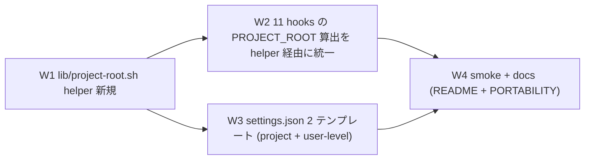

# Task #12: Dual-mode Portability — user-level + project-level install 両対応

> Status: **🔲 未着手**
> 起案: 2026-05-13
> 関連: #7 (Custom PM / Session), #10 (sc:* 排除 + Serena 警告), #11 (session-help-surface) / Phase loop-mode
> 設計起源: [`docs/draft/dual-mode-portability.md`](../draft/dual-mode-portability.md) (✅ 承認済 2026-05-13)

## 背景・目的

現状、ハーネス hooks は `SCRIPT_DIR/../..` で PROJECT_ROOT を算出する pattern を採用しており、hook 自身が `<project>/.claude/hooks/` に置かれていることを暗黙の前提にしている。これは project-level install (`<project>/.claude/` 配下) には適合するが、user-level install (`~/.claude/` 配下) では `SCRIPT_DIR/../..` が `~/` を指し、project file (`docs/tasks/list.md`、`CLAUDE.md`、`.claude/rules/`) 参照が失敗する。

user の本来要求は「ユーザ領域とプロジェクト領域のどちらにインストールしても動く」。本 task は hook 物理位置と PROJECT_ROOT を分離する helper 導入 + 11 hooks 統一更新 + settings.json 2 テンプレート整備 + smoke / docs 更新により dual-mode portability を実現する。

## 仕様（決定済）

### Q1: アプローチ選定

| 案 | 内容 | 評価 |
|---|---|---|
| A 最小 patch | `SCRIPT_DIR/../..` を `git rev-parse --show-toplevel` に直接置換、user-level 未対応 | dual-mode 未充足で user 要求未達成 |
| **B フル dual-mode** | lib/project-root.sh helper + 全 hook 更新 + settings.json 2 テンプレート + smoke + docs | user 要求充足、1.8h、subagent 並列で実 10-15 分見込み |
| C ハイブリッド | B の W1-W3 を最小、W4 smoke 後追い | smoke なしで regression 検出弱 |

→ **B フル dual-mode** 採用 (draft §2)。

### Q2: PROJECT_ROOT 解決の優先順位

→ 1. `${HC_PROJECT_ROOT}` env override (CI / test 用) → 2. `git rev-parse --show-toplevel` (標準) → 3. `pwd` (git 不在 fallback)

### Q3: settings.json テンプレート分離

→ `.claude/settings.json` は project-level 維持 (cwd-relative)。`.claude/templates/settings.user-level.json.template` を新規 (user-level、`bash ${HOME}/.claude/hooks/X.sh` 形式)。

## 設計

### Wave 構成 (draft §3)



### W1: `.claude/hooks/lib/project-root.sh` (新規)

`resolve_project_root()` を subshell 関数化 (`set -uo pipefail` 局所化、`feedback_set_e_in_sourced_libs` 規範) し、env → git → pwd の 3 段優先で root を resolve。詳細コードは draft §3 W1 詳細参照。

### W2: 11 hooks の置換

対象: `check-serena-mcp.sh` / `autonomous-action-guard.sh` / `context-budget.sh` / `mode-session-start.sh` / `loop-auto-progress-reminder.sh` / `lib/mode-loader.sh` / `mode-asana-prompt.sh` / `mode-enforce.sh` / `improvement-proposal.sh` / `check-required-env.sh` / `agent-router-suggest.sh`

```bash
# before
PROJECT_ROOT="$(cd "$(dirname "${BASH_SOURCE[0]}")/../.." && pwd)"

# after
SCRIPT_DIR="$(cd "$(dirname "${BASH_SOURCE[0]}")" && pwd)"
# shellcheck source=lib/project-root.sh
source "$SCRIPT_DIR/lib/project-root.sh"
PROJECT_ROOT=$(resolve_project_root)
```

`SCRIPT_DIR` = hook 自身の dir (lib source 用)、`PROJECT_ROOT` = 実 project root (project file 参照用)。両者を明確に分離。

### W3: settings.json 2 テンプレート

- `.claude/settings.json` (project-level 維持、cwd-relative path `bash .claude/hooks/X.sh`)
- `.claude/templates/settings.user-level.json.template` (新規、user-level、`bash ${HOME}/.claude/hooks/X.sh` 形式)

### W4: smoke + docs

- `.claude/tests/dual-mode-portability-smoke.sh` 新規 (Case 1: env override / Case 2: git rev-parse / Case 3: pwd fallback / Case 4: user-level hook 経路)
- `README.md`「インストール」セクションに 2 mode 分岐記載
- `docs/PORTABILITY.md` dual-mode 動作保証 + 移植手順 update

## TDD 戦略

### RED (先に追加するテスト)

- `.claude/tests/dual-mode-portability-smoke.sh`
  - Case 1: `HC_PROJECT_ROOT=/tmp/fake-project` 設定 → `resolve_project_root` が `/tmp/fake-project` を返す
  - Case 2: env unset + git repo 内 → `git rev-parse --show-toplevel` の値
  - Case 3: env unset + git 不在 dir → `pwd` の値
  - Case 4: hook (例: `check-serena-mcp.sh`) を user-level 風 path から実行 + `HC_PROJECT_ROOT=<temp project>` → PROJECT_ROOT が temp project を指す

### GREEN (最小実装)

- W1: lib/project-root.sh で 4 case 全 PASS
- W2: 11 hooks の置換後、既存 smoke 7 件 全 PASS (regression 0)

### REFACTOR

- helper の関数化境界 (`resolve_project_root` 単独責務) を維持
- subshell 関数で strict mode 局所化、caller への leak 防止

## Wave 構成

| Wave | 内容 | 工数 | 依存 |
|:---:|:---|---:|:---|
| W1 | `.claude/hooks/lib/project-root.sh` 新規 + 単独 smoke | 0.3h | — |
| W2 | 11 hooks の `SCRIPT_DIR/../..` → helper 経由に置換 | 0.5h | W1 |
| W3 | `.claude/settings.json` 維持 + `templates/settings.user-level.json.template` 新規 | 0.4h | W1 |
| W4 | `dual-mode-portability-smoke.sh` 新規 + `README.md` / `docs/PORTABILITY.md` 更新 | 0.6h | W2, W3 |

合計工数: **1.8h** (subagent 並列で実時間 10-15 分見込み)

## 完了条件

- [ ] `.claude/hooks/lib/project-root.sh` 新規実装、`resolve_project_root()` が env override / git / pwd の 3 段優先で動作
- [ ] 11 hooks の `SCRIPT_DIR/../..` PROJECT_ROOT 算出を helper 経由に統一
- [ ] `.claude/templates/settings.user-level.json.template` 新規 (user-level install 用)
- [ ] `.claude/tests/dual-mode-portability-smoke.sh` 4/4 PASS
- [ ] 既存 smoke 全 PASS (workflow-guard / next-actions / loop-auto-progress / custom-pm / delegation-guard-segment / audit-followups / check-serena-mcp / session-help-surface = 7 件 + 新規 1 = 8 件)
- [ ] `README.md` 「インストール」セクションに project-level / user-level 2 mode 分岐記載
- [ ] `docs/PORTABILITY.md` dual-mode 動作保証 + 移植手順 update
- [ ] commit hashes が `docs/tasks/list.md` 行 12 に記録される

## 工数見積

1.8 時間 (W1=0.3 / W2=0.5 / W3=0.4 / W4=0.6)。task #7-#11 の前例より subagent 並列性で実時間 10-15 分見込み。

## 影響範囲

| 範囲 | 詳細 |
|---|---|
| ファイル | `.claude/hooks/lib/project-root.sh` (新規) / 11 hooks 更新 / `.claude/settings.json` (維持) / `.claude/templates/settings.user-level.json.template` (新規) / `.claude/tests/dual-mode-portability-smoke.sh` (新規) / `README.md` (Edit) / `docs/PORTABILITY.md` (Edit) |
| migration | なし |
| 環境変数 | `HC_PROJECT_ROOT` (新規 env override) |
| 互換性 | project-level install は完全後方互換 (cwd-relative path 維持)。user-level install が新規サポート |

## 再発防止

- 今後の hook 追加時は `lib/project-root.sh` の `resolve_project_root` を必ず使う旨を `.claude/rules/development-process.md` に追記検討 (派生 task 候補)
- PROJECT_ROOT 算出が hook 物理位置依存になっていないか定期 audit (`.claude/scripts/harness-audit.py` に dual-mode check 追加検討、派生 task 候補)

## ステータスログ

| 日付 | 状態 | 備考 |
|---|---|---|
| 2026-05-13 | 起案 | 設計 draft 起こし (`docs/draft/dual-mode-portability.md`) |
| 2026-05-13 | 承認 | user「問題ありません。実装してください」、`list.md` に行追加 |
| (未定) | 着手 | branch `feat/loop-mode` (既存)、`/start-task 12` |
| (未定) | 完了 | commit `<sha>`, 新規 smoke 4/4 + 既存 smoke 7/7 PASS |

## 派生 task / 次アクション候補

### 義務 (development-process.md §「副産物発生時の即時 draft 起こし義務」準拠)

- 副産物発見の瞬間に **必ず本セクションに記入** (memory / 会話履歴に流すだけは禁止)
- task 完了 (`/finish-task`) 時、本セクションのすべての entry が以下のいずれかに処理済であること:
  - (a) `docs/draft/<slug>.md` に draft 起こし済 (緊急度 🔴 / 🟡)
  - (b) `docs/tasks/next-actions.md` に entry 追加済 (緊急度 🟢 + 後日判断)
  - (c) 無視 (理由を明記、commit message に記録)

### 現時点の候補 (発見時点で追記)

- (現時点なし、実装中に発見次第追記)

### 関連

- [`next-actions.md`](next-actions.md) — 本セクションと連動する registry
- [`.claude/rules/development-process.md`](../../.claude/rules/development-process.md) §「副産物発生時の即時 draft 起こし義務」

## 関連

- Draft: [`dual-mode-portability.md`](../draft/dual-mode-portability.md)
- 依存タスク: #7, #10, #11 (SessionStart 補助 hook 群、本 task はそれらを user-level でも動くようにする基盤)
- 派生タスク: (実装中に発見次第追記)
