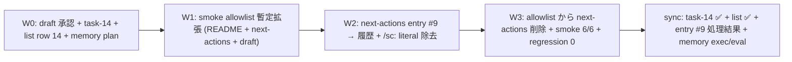

# Task #14: Custom-PM Case 5 follow-up — `/sc:` 残存解消

> Status: **🔄 進行中**
> 起案: 2026-05-14
> 関連: #7 (custom-pm-commands), #10 (sc-removal-serena-warning)
> 設計起源: [`docs/draft/custom-pm-case-5-followup.md`](../draft/custom-pm-case-5-followup.md) (2026-05-14 user 承認)

## 背景・目的

task #7 W4 (`f063ff3` `/sc:* → 自前 command 1:1 置換`) の事後監視 smoke `.claude/tests/custom-pm-commands-smoke.sh` Case 5 が 2026-05-13 から pre-existing FAIL 状態。subagent ac8dfc5e6bfd4d22e 調査 (confidence 0.85) で真因 = 2 file (`docs/tasks/next-actions.md` entry #9 + `README.md`) が allowed-files regex 外、と確定。

直接削除 (案 A) は audit trail 喪失で不可、allowlist 恒久拡張 (案 B) は entry #9 内 `/sc:` literal 永続残存で catch-22 構造温存。案 C ハイブリッド (W1 暫定拡張 → W2 entry 履歴化 + literal 除去 → W3 整理) で構造的解決を図る。

## 仕様（決定済）

### Q1: 採用案

| 案 | 内容 | 評価 |
|---|---|---|
| A | next-actions entry #9 削除 | ✗ README.md 未対応 + audit trail 喪失 |
| B | allowlist 恒久拡張 (next-actions + README) | ✗ catch-22 温存 → 将来再発 |
| **C** | hybrid (W1 暫定 + W2 履歴化 + W3 整理) | **✓ 採用** (3 構造的問題を同時解消) |

→ 案 C ハイブリッドを採用。理由は draft §2 参照。

### Q2: subagent 委譲範囲

| Wave | 委譲 | 理由 |
|---|:---:|---|
| W0 | no (メイン直接) | `docs/draft/` `docs/tasks/` はメイン許可、orchestration 1 commit |
| W1 | yes (subagent) | `.claude/tests/` 編集、staging 戦略 (`/tmp` + `mv`) 必須 |
| W2 | no (メイン直接) | `docs/tasks/next-actions.md` は許可、文言修正のみ |
| W3 | yes (subagent) | `.claude/tests/` 編集 + smoke 6 件実行、staging 戦略必須 |
| sync | no (メイン直接) | task / list 同期 + commit、メイン許可 |

## 設計

draft §3 採用案詳細を参照。要約:



各 Wave 1 commit、合計 5 commit (W0 / W1 / W2 / W3 / sync)。Conventional Commits 形式、独立動作可能粒度。

### W1 subagent prompt 雛形 (抜粋)

```
.claude/tests/custom-pm-commands-smoke.sh Case 5 allowed-files regex (line 64 付近) に
以下 3 path を追加せよ:
- ^\./README\.md
- ^\./docs/tasks/next-actions\.md
- ^\./docs/draft/custom-pm-case-5-followup\.md

staging 戦略 (development-process.md §「サブエージェント `.claude/` 編集の staging 戦略」):
1. /tmp/custom-pm-commands-smoke.sh に Write
2. mv /tmp/custom-pm-commands-smoke.sh .claude/tests/custom-pm-commands-smoke.sh
3. chmod +x

検証: bash .claude/tests/custom-pm-commands-smoke.sh → Case 5 PASS + 6/6
commit: test(smoke): expand custom-pm Case 5 allowlist for legitimate references
confidence: 0.X (末尾必須)
```

### W3 subagent prompt 雛形 (抜粋)

```
W2 完了確認 (git log で entry #9 履歴化 commit 存在 + grep '/sc:(save|load|pm)' docs/tasks/next-actions.md が 0 件)。
.claude/tests/custom-pm-commands-smoke.sh allowed-files regex から
^\./docs/tasks/next-actions\.md を削除せよ (W1 で追加した 3 件のうち 1 件を整理)。

staging 戦略適用必須 (W1 と同じパターン)。

全 smoke 6 件実行 + 結果報告:
- bash .claude/tests/custom-pm-commands-smoke.sh → 6/6
- bash .claude/tests/workflow-guard-smoke.sh → 8/8
- bash .claude/tests/next-actions-hooks-smoke.sh → 9/9
- bash .claude/tests/loop-auto-progress-smoke.sh → 9/9
- bash .claude/tests/delegation-guard-segment-smoke.sh → 6/6
- bash .claude/tests/audit-followups-smoke.sh → 4/4

commit: test(smoke): finalize custom-pm Case 5 allowlist after next-actions history migration
confidence: 0.X (末尾必須)
```

## TDD 戦略

本 task は smoke + 文言修正であり classical TDD (RED/GREEN/REFACTOR) より「事実検証 loop」が中心:

### RED (期待値先行)

- W0 開始時点: `bash .claude/tests/custom-pm-commands-smoke.sh` Case 5 FAIL (現状)
- next-actions entry #9 = エントリ一覧 行、🟡、処理結果列 `—` (現状)

### GREEN (W1 + W2 + W3 後)

- Case 5 PASS (zero match)
- 全 Case 6/6 PASS
- next-actions entry #9 = 履歴セクション、処理結果列に task #14 link
- `grep -nE '/sc:(save\|load\|pm)' docs/tasks/next-actions.md` → 0 件 (catch-22 解消)
- regression: 既存 smoke 5 件 (workflow-guard / next-actions-hooks / loop-auto-progress / delegation-guard-segment / audit-followups) 全て baseline 同等

### REFACTOR

- W3 で allowlist から next-actions.md を削除 (W1 で暫定追加した 3 件のうち 1 件を整理) = リファクタリング相当
- allowlist の最終構成: 旧 7 件 + README.md + 本 draft 自身 = 9 件 + `^\./\.serena/`

## Wave 構成

| Wave | 内容 | 工数 | 依存 |
|:---:|:---|---:|:---|
| W0 | draft 承認反映 + task-14 file + list.md row 14 + Serena memory plan/hypothesis + commit | 0.1 | — |
| W1 | subagent: smoke allowlist 暫定拡張 (3 path 追加) + commit | 0.2 | W0 |
| W2 | main: next-actions entry #9 → 履歴セクション移行 + literal 除去 + commit | 0.2 | W1 |
| W3 | subagent: allowlist から next-actions 削除 + smoke 6 件実行 + regression 0 確認 + commit | 0.2 | W2 |
| sync | main: task-14 file 完了化 + list.md row 14 ✅ + next-actions 処理結果列 + Serena memory exec/eval + commit | 0.1 | W3 |

合計工数: 0.8 (約 30-40 分想定、subagent 2 件 逐次)

## 完了条件

- [ ] `bash .claude/tests/custom-pm-commands-smoke.sh` Case 5 PASS (zero match)
- [ ] 同 smoke 全 Case 6/6 PASS
- [ ] 既存 smoke 5 件 regression 0 (workflow-guard 8/8 / next-actions-hooks 9/9 / loop-auto-progress 9/9 / delegation-guard-segment 6/6 / audit-followups 4/4)
- [ ] `grep -nE '/sc:(save\|load\|pm)' docs/tasks/next-actions.md` 0 件 (catch-22 解消)
- [ ] `docs/tasks/next-actions.md` entry #9 が 履歴セクションに移行済、処理結果列に task #14 link 記入
- [ ] `docs/tasks/list.md` row 14 ✅ 化、概要に commit hash 4 件 + 主要 metric (6/6 + regression 0) 反映
- [ ] Status / Wave 構成 / ステータスログ完了化 (本 file 内)
- [ ] Critical Operational Lessons 違反 0 件 (`git push` 0 / 並列 subagent commit 0 / 自律破壊操作 0 / set -e leak 該当外)
- [ ] Loop 自律実行禁止リスト違反 0 件
- [ ] subagent confidence ≥ 0.85 (W1 / W3 両者)、F3 confidence-gate 通過
- [ ] Serena memory 3 件永続化 (plan / execution / evaluation)

## 工数見積

合計 0.8 工数 (約 30-40 分想定)

- W0: 0.1 (main 直接、5 file edit + commit)
- W1: 0.2 (subagent 1 件、staging 戦略適用)
- W2: 0.2 (main 直接、next-actions.md 2 箇所修正)
- W3: 0.2 (subagent 1 件、staging 戦略 + smoke 6 件実行)
- sync: 0.1 (main 直接、task-14 + list.md + memory 永続化)

subagent 件数: 2 (W1 + W3、逐次 dispatch、合計約 70-100 秒想定)

## 影響範囲

| 範囲 | 詳細 |
|---|---|
| ファイル | `.claude/tests/custom-pm-commands-smoke.sh` (W1 + W3), `docs/tasks/next-actions.md` (W2), `docs/tasks/list.md` (W0 + sync), `docs/tasks/task-14-custom-pm-case-5-followup.md` (W0 + sync), `docs/draft/custom-pm-case-5-followup.md` (W0) |
| migration | なし (DB / schema 変更 0) |
| 環境変数 | なし |
| 互換性 | smoke 拡張は backward compatible (既存 allowed files 全件保持)、文言修正は audit trail 等価 (履歴セクション移行で内容保持) |
| public API | なし (実行可能 code 変更 0) |

## 再発防止

本 task 完了時に以下を検討:

1. **smoke allowlist の運用ルール記載** — `.claude/rules/workflow.md` §「Session 永続化と PM Orchestration」または `development-process.md` に「事後監視 smoke の allowed-files は legitimate 参照 (registry entry / migration doc / 設計起源 draft) を含めて運用」の旨を 1 段落追記 (sync phase で検討)
2. **next-actions entry に literal を残さないガイドライン** — entry 記述時に旧 command literal (例: `/sc:foo`) を含める場合は「catch-22 リスク」を考慮し generic 表現を優先 (本 task の教訓を `learning/solutions/` に永続化)

## ステータスログ

| 日付 | 状態 | 備考 |
|---|---|---|
| 2026-05-14 | 起案 | 設計 draft 起こし (`docs/draft/custom-pm-case-5-followup.md`) |
| 2026-05-14 | 承認 | user 承認 (逐語: 「承認します。」)、`list.md` row 14 追加、W0 開始 |
| 2026-05-14 | 進行中 | W0 spawn (本 file + list row + memory plan + commit) |

## 派生 task / 次アクション候補

W0 起案時点では 0 件。W1-W3 実装中に発見次第、本セクションに即時記入 (`development-process.md` §「副産物発生時の即時 draft 起こし義務」遵守)。

候補 (実装中に判定):

- [ ] (🟡 候補) smoke allowlist 運用ルール文書化 — `.claude/rules/workflow.md` に 1 段落追加 (本 task §「再発防止」§1)
- [ ] (🟢 候補) entry literal-free ガイドライン — `learning/solutions/next-actions-entry-without-literal` Serena memory 永続化

### 関連

- [`next-actions.md`](next-actions.md) — 副産物 registry
- [`.claude/rules/development-process.md`](../../.claude/rules/development-process.md) §「副産物発生時の即時 draft 起こし義務」

## 関連

- Draft: [`docs/draft/custom-pm-case-5-followup.md`](../draft/custom-pm-case-5-followup.md) (2026-05-14 user 承認)
- 起源 entry: [`docs/tasks/next-actions.md` entry #9](next-actions.md)
- 依存タスク: #7 (custom-pm-commands W4 `f063ff3`)、#10 (sc-removal-serena-warning)
- 派生タスク: TBD (W1-W3 実装中に判定)
- Subagent research: agentId `ac8dfc5e6bfd4d22e` (内部 task #1、confidence 0.85、2026-05-14)
