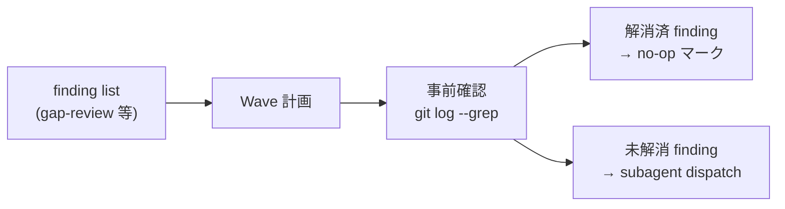

# Task #20: Wave 計画事前確認 (git log --grep) のテンプレ強制

> Status: **✅ 完了** (2026-05-21、4 commit `297d295` / `2e7c18a` / `67da376` / `fdeaa1b`、smoke 4/4 PASS、既存 smoke regression 0)
> 起案: 2026-05-21
> 関連: next-actions.md entry #15
> 設計起源: [`docs/draft/wave-precheck-git-log-grep.md`](../draft/wave-precheck-git-log-grep.md)

## 背景・目的

本セッション 2026-05-21 で TM 別 repo (`/Users/t.hirai/タスクマネジメント/`) の HIGH 9 件修正を Wave 化して進めた際、Wave 2-C (C-7) / Wave 2-D (E-2) / Wave 4 (B-3) の 3 件が既存 commit (`d705efc` / `d752046`) で **既に解消済の no-op** だった。Wave 計画段階で `git log --all --grep <finding>` 等による事前確認を省略していたため、subagent 起動 → no-op 報告 → Wave 再計画の二重消費が発生。

本 task は draft §3 採用案 C ハイブリッド (template + prompt + rule の三層防御) を実装し、hirai-method ハーネス自身が「Wave 計画事前確認」を構造強制する状態を作る。

## 仕様

### Q1: 三層防御のうち実装範囲は？

| 案 | 内容 | 評価 |
|---|---|---|
| A | template のみ (`_TASK_TEMPLATE.md`) | 不十分。別 repo / 既存 task は対象外 |
| B | prompt のみ (subagent dispatch 強制) | 不十分。Wave 計画 stage 自体が漏れる |
| **C** | template + rule + command (三層防御) | 採用。draft §2 推奨案 |

→ **C** 採用。`_TASK_TEMPLATE.md` / `workflow.md` Stage 8+7 / `new-feature.md` + `modify-feature.md` の 3 file 編集 + smoke test 1 file 新規。

## 設計

詳細は draft §3 (Wave / Sub-task 分割、各 W スコープ / 変更内容 / テスト) 参照。本 file は task tracking 用、設計実体は draft を SSoT とする。

## TDD 戦略

### RED

新規 smoke `.claude/tests/wave-precheck-template-smoke.sh` (4 cases):
- Case 1: `_TASK_TEMPLATE.md` に「事前確認」keyword
- Case 2: `workflow.md` Stage 8 / 7 に「git log --grep」keyword
- Case 3: `new-feature.md` / `modify-feature.md` に「Wave Pre-check」
- Case 4: 既存 smoke 5 file 存在検証 (regression safety)

### GREEN

W1-W3 で対象 file に該当 keyword を追加することで 4 cases PASS 状態に。

### REFACTOR

不要 (doc 編集のみ、abstraction の余地なし)。

## Wave 構成

| Wave | 内容 | 工数 | 依存 |
|:---:|:---|---:|:---|
| W1 | `_TASK_TEMPLATE.md` Wave 事前確認 subsection 追加 | 0.2h | — |
| W2 | `workflow.md` Stage 8+7 説明列に明文化 | 0.2h | — |
| W3 | `new-feature.md` + `modify-feature.md` に Wave Pre-check sub-step 追加 | 0.3h | — |
| W4 | `wave-precheck-template-smoke.sh` 4 cases 新規 + 4/4 PASS + 既存 smoke regression 0 | 0.3h | W1, W2, W3 |

合計工数: **1.0h**

## 完了条件

- [x] W1-W4 全 commit (4 commit、Conventional Commits): `297d295` / `2e7c18a` / `67da376` / `fdeaa1b`
- [x] `wave-precheck-template-smoke.sh` 4/4 PASS (subagent 実測 log: Case 1 hit=1 / Case 2 hit=2 / Case 3 new=1 modify=1 / Case 4 all present)
- [x] 既存 smoke regression 0: workflow-guard 8/8 / next-actions-hooks 9/9 / loop-auto-progress 9/9 / delegation-guard-segment 6/6 / audit-followups 4/4 / custom-pm-commands 6/6
- [x] next-actions.md entry #15 処理結果列に `→ task #20` 記入済
- [x] list.md row 43 で task #20 行追加済
- [x] subagent confidence: **0.9** (≥ 0.85)

## 工数見積

合計 1.0h (W1 0.2 + W2 0.2 + W3 0.3 + W4 0.3)。subagent 1 件で逐次実装中 (agentId 内部管理)。

## 影響範囲

| 範囲 | 詳細 |
|---|---|
| ファイル | `.claude/templates/docs/tasks/_TASK_TEMPLATE.md` / `.claude/rules/workflow.md` / `.claude/commands/new-feature.md` / `.claude/commands/modify-feature.md` / `.claude/tests/wave-precheck-template-smoke.sh` (新規) |
| migration | なし |
| 環境変数 | なし (新規 hook なし) |
| 互換性 | 後方互換 (既存 template / rule / command への追記のみ、削除なし) |

## 再発防止

本 task そのものが「Wave 計画事前確認の欠落」という事故の再発防止策。本 task 完了後は新規 / 既存修正 task の全 Wave 計画で `git log --all --grep` 事前確認が template / rule / command の三層で強制される。

## ステータスログ

| 日付 | 状態 | 備考 |
|---|---|---|
| 2026-05-21 | 起案 | 設計 draft `docs/draft/wave-precheck-git-log-grep.md` 起こし、user 指示「このリポジトリも修正してくださいね」で承認 |
| 2026-05-21 | 着手 | subagent 1 件 (W1-W4 逐次実装) を background 起動、agentId 内部管理 |
| 2026-05-21 | 完了 | W1 `297d295` / W2 `2e7c18a` / W3 `67da376` / W4 `fdeaa1b`、smoke 4/4 PASS、既存 smoke 6 件 regression 0、subagent confidence 0.9、staging 戦略全 step 適用 (subagent `.claude/` write denied 回避) |

## 派生 task / 次アクション候補

(本 task 実装中に発生した副産物は本セクションに記入)

- (現時点で発生なし)

## 関連

- Draft: [`docs/draft/wave-precheck-git-log-grep.md`](../draft/wave-precheck-git-log-grep.md)
- 起源 entry: [`next-actions.md`](next-actions.md) entry #15
- 起源セッション: 2026-05-21 TM 別 repo HIGH 修正セッション
- 影響を受けた no-op commit: TM 側 `d705efc` (asana overdue assignee + maxTurns 30) / `d752046` (SDK MCP + snake_case) / `0cf9af3` (business-hours 関連)
- 規範: `.claude/rules/development-process.md` §「副産物発生時の即時 副産物即時 draft 起こし義務」
