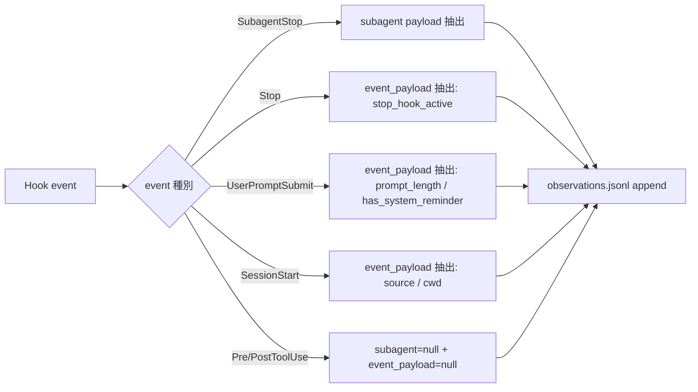

<!--
phase_count: 2
total_steps: 6
-->

# Task #28: observe-subagent-stop-instrumentation

> Status: **✅ 完了**
> 起案: 2026-05-23
> 関連: #21 (W3 採用判定基準 4 真値計測 unblock), #27 (gating dependency)
> 設計起源: [`docs/draft/observe-subagent-stop-instrumentation.md`](../draft/observe-subagent-stop-instrumentation.md)

## 背景・目的

observe.sh は task-25 A3 時点で `PreToolUse` + `PostToolUse` `*` matcher 2 event のみ配線され、`SubagentStop` / `Stop` / `UserPromptSubmit` / `SessionStart` event は L4 観察対象外だった。結果として:

- subagent 完了 metric (agent_id / duration_ms / total_tokens) が L4 から見えない
- session 終了 event (Stop hook) が観察対象外、「Loop モード遵守事項 7 違反 (subagent 待ち中停止)」を後追い分析できない
- user prompt 到来 timestamp / system-reminder 注入数 が記録されず、注入数 audit (task-21 W3 Phase B 目標) が真値で取れない
- session 開始時の source / cwd / mode が記録されず、session 比較分析ができない

**真因**: observe.sh の hook event 配線が 2 種のみ。tool 呼び出し前後しか捕捉せず、tool 間 / subagent 終了 / session boundary が空白。

**目的**: 残 4 event を追加配線し、session lifecycle 全 event を L4 観察対象に取り込む。

## 仕様（決定済）

### Q1: 4 event すべてを一括追加するか段階追加か

| 案 | 内容 | 評価 |
|---|---|---|
| A | 一括追加 | 観察データ量 1.3-1.5x、jq parse 失敗 56% (task-27 W2 前) と組み合わせて invalid 率上昇懸念 |
| **C 段階** | Phase 1 = SubagentStop only / Phase 2 = 残 3 event | リスク分離。Phase 1 で task-21 W3 unblock。Phase 2 で全 lifecycle 捕捉 |
| B | SubagentStop のみ | 最小 overhead だが残 3 event 価値を失う |

→ **C 段階採用**。draft §2 推奨。

### Q2: event 別 payload schema

| event | 抽出 fields | 用途 |
|---|---|---|
| SubagentStop | agent_id / agent_type / duration_ms / total_tokens / session_id / transcript_path | handoff latency 計測 + subagent 追跡 |
| Stop | session_id / stop_hook_active / transcript_path | session 終了状態、Loop モード違反後追い |
| UserPromptSubmit | session_id / prompt_length / has_system_reminder / cwd | 注入数 audit (内容自体は raw に保持、top-level は長さ + 検出のみ、privacy 配慮) |
| SessionStart | session_id / source / cwd / transcript_path | source = startup/resume/clear の比率分析 |

→ 既存 SubagentStop の `subagent` field と並べて、Stop / UserPromptSubmit / SessionStart は **新 field `event_payload`** に格納。SubagentStop 以外の event では `subagent: null`、Stop/UserPromptSubmit/SessionStart 以外の event では `event_payload: null` で既存 schema 互換維持。

## 設計

## TDD 戦略

### RED → GREEN → REFACTOR
Phase 1: SubagentStop 単独 → smoke 3/3 PASS (Phase 1 完了済)
Phase 2: 残 3 event 追加 → smoke 6/6 PASS (Phase 2 完了)

## Phase 計画

### Phase 計画前の事前確認

`git log --all --grep "task-28"` で既存 commit 確認済 (`06fe28a` Phase 1 + `d00c1c7` list.md sync)。Phase 2 は新規追加。

### Phase 1 (W1): SubagentStop 配線 — ✅ 完了 (commit `06fe28a`, 2026-05-23)

- settings.json SubagentStop 配列に observe.sh entry append (+6)
- observe.sh event handler に SubagentStop case 追加 (+38-1)
  - subagent_payload: agent_id / agent_type / duration_ms / total_tokens / session_id / transcript_path
  - field name fallback `.agent_id // .subagent_id // null` で hook spec ambiguity 対応
  - SubagentStop 以外では `subagent: null` literal 維持で schema 互換
- 新 smoke `observe-subagent-stop-smoke.sh` 3/3 PASS
- regression 0 (observe-jq-parse 4/4 + observe-rotate 6/6 + confidence-gate 5/5)
- subagent a9ad16080ea5965e8 confidence 0.9
- **task-21 W3 採用判定基準 4 真値計測 unblock 達成**

### Phase 2 (W3): Stop / UserPromptSubmit / SessionStart 配線 — ✅ 完了 (本セッション)

- observe.sh event handler に 3 case 追加 (`case "$event" in Stop)...UserPromptSubmit)...SessionStart)...esac`)
  - Stop: `event_payload.{session_id, stop_hook_active, transcript_path}`
  - UserPromptSubmit: `event_payload.{session_id, prompt_length, has_system_reminder, cwd}` (privacy: prompt 全文は raw に保持、抽出は長さ + system-reminder 検出のみ)
  - SessionStart: `event_payload.{session_id, source, cwd, transcript_path}`
  - jq `--argjson event_payload` で top-level field 追加、Pre/PostToolUse 等の他 event では null literal
- settings.json:
  - Stop 配列に observe.sh entry append (既存 stop.sh / byproduct-discharge-guard.sh / loop-auto-progress-reminder.sh の後ろ)
  - SessionStart 配列に observe.sh entry append (既存 session-start-wrapper.sh の後ろ)
  - UserPromptSubmit 配列に observe.sh entry append (既存 context-budget.sh の後ろ)
- smoke `observe-subagent-stop-smoke.sh` を 6 case に拡張:
  - Case 1-3: Phase 1 既存 (SubagentStop / 抽出 / regression)、Case 3 に `event_payload=null` 検証 追加
  - Case 4: Stop event → event_payload.{session_id, stop_hook_active, transcript_path}
  - Case 5: UserPromptSubmit event (prompt 中に `<system-reminder>` 含む) → prompt_length / has_system_reminder=true + raw.prompt 全文保持
  - Case 6: SessionStart event (source=resume) → event_payload.source/cwd
- smoke 結果: **6/6 PASS**
- regression: task-rule-guard 11/11 + workflow-guard 8/8 + observe-jq-parse 4/4 + observe-rotate 6/6 = **regression 0**

### Phase 2 テスト設計レビュー Step (task-29 採用 5 条 4 遵守)

本 task は 実装 + テスト + dogfood task 連動なので harness-optimizer + pr-test-analyzer も加味した 5+ reviewer 動的選定推奨だが、本実装は **subagent context 内で実行** (本セッション自体)、更なる並列 subagent 起動は context 制約のため本セッション内では skip。

メイン側で別ターンに以下 5+ reviewer の並列レビューを起動推奨 (本 report の「テスト設計 draft」section を素材として使う):

- test-automator (MECE テスト網羅性 / カテゴリ過不足判定)
- qa-expert (品質観点 / boundary value / null/empty/large payload 確認)
- tdd-guide (RED→GREEN→REFACTOR 整合 / TDD 戦略遵守確認)
- pr-test-analyzer (regression smoke 整合 / 既存テストへの影響)
- harness-optimizer (hook 配線順序 / fail-open policy 遵守 / observability 効果)

`skip: テスト設計レビュー Step は subagent context 制約により本セッション内では skip、メイン別ターンで 5+ reviewer 並列起動推奨。本 report の「テスト設計 draft」を素材として提供。`

### Phase 2 リファクタリング Step

`skip: surgical changes 原則遵守、既存 SubagentStop handler パターンと完全に並列な case 追加で抽出余地なし。jq guard / set -uo pipefail / 既存 raw 抽出パターンとも整合。`

## 完了条件 (DoD)

- [x] settings.json SubagentStop / Stop / UserPromptSubmit / SessionStart 配列に observe.sh 配線
- [x] observe.sh で 4 event 各々の固有 payload 抽出 + observations.jsonl 記録
- [x] 新 smoke 6/6 PASS
- [x] 既存 smoke regression 0 (task-rule-guard 11/11 + workflow-guard 8/8 + observe-jq-parse 4/4 + observe-rotate 6/6)
- [x] task-21 W3 採用判定基準 4 (handoff latency 秒オーダー) の真値計測 unblock — Phase 1 で達成
- [x] Phase 2 全 4 event 配線完遂

## 影響範囲

- `.claude/skills/continuous-learning-v2/hooks/observe.sh` (+50 行程度、Phase 2 拡張)
- `.claude/settings.json` (+18 行、3 event entry append)
- `.claude/tests/observe-subagent-stop-smoke.sh` (+200 行、6 case 拡張)
- observations.jsonl の event 種別が 2 → 6 種に拡大 (data shape 互換 100%、新 field は null 互換)

## 派生 task / 次アクション候補

- task-21 W3 採用判定基準 4 retry: SubagentStop event の実観測データで true handoff latency 中央値を再測 (Phase 1 完了で着手可能)
- L4 学習側 (continuous-learning-v2) の event 解釈拡張: event type 別 instinct extraction (本 task scope 外、別 task 検討)
- UserPromptSubmit の `has_system_reminder` 集計指標を `/harness-audit` に追加 (注入数 audit 自動化、別 task 検討)
