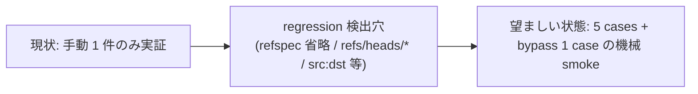

<!--
# task-29 Phase→Step 強制タスク構造 metadata (W5 smoke 集計用 placeholder)
phase_count: 2
total_steps: 6
-->

# Task #30: protected branch push deny の単体 smoke 追加

> Status: **✅ 完了** (Phase 1 + Phase 2 all steps、iter4 で 5 reviewer 全員 0 finding strict 収束)
> 起案: 2026-05-23
> 着手: 2026-05-23 (branch: `test/protected-branch-push-deny-smoke`)
> 完了: 2026-05-23 (commit `7d962e5` まで、smoke 40/40 PASS、regression 0)
> 関連: #17 (bash-whitelist-git), #18 (protected-branch-push), #19 (smoke-coverage)
> 設計起源: [`docs/draft/protected-branch-push-deny-smoke.md`](../draft/protected-branch-push-deny-smoke.md)

## 背景・目的

`check_protected_branch_push` (commit `ad2f7bc`, `.claude/hooks/lib/delegation-guard/git-deny.sh` L58-128) は 2026-05-18 user 指示「gitの許可はmainとstgと含むブランチに対するpush、破壊的変更以外に対してを許可してください」を実装した production hook だが、**動作実証は手動 `git push origin main` 1 件のみ** で、機械検証 smoke が無い状態。entry #13 で git destructive deny の smoke を実装した際、protected branch push deny は意図的に「pass case で push を使わない」アプローチで切り分けただけで、本 layer 単体の検証は積み残されていた。

**真因:** entry #13 smoke 実装時に「destructive deny 単体検証」を優先し、protected branch push deny は scope 外として後送りにした (`git-destructive-deny-smoke (旧名)` L48-53 のコメントが明示)。結果として 5 cases (main 明示 / stg 系 / feature 通過 / refspec 省略 main / bypass) が未検証のまま 5 日経過、hook 修正時の regression 検出が手動依存のままになっている。

**副次:** entry #13 と本 entry の coverage が hook (`git-deny.sh`) 同一 file の 2 layer に分かれており、smoke を 2 file に分散するか 1 file に統合するかで保守性が変わる (§仕様 Q1 で比較)。

## 仕様（要決定 → 決定済）

### Q1: smoke file の構成方針 (統合 / 分離 / lib 抽出)

| 案 | 内容 | 工数 | 評価 |
|:---:|:---|---:|:---|
| **A 既存 smoke 統合 (採用)** | `git-destructive-deny-smoke (旧名)` を `delegation-guard-deny-layers-smoke.sh` に rename + 拡張、両 layer を 1 file に統合 (5 cases + bypass 1 case を末尾追加) | 0.4 | 同一 hook の 2 layer を一元化、CI が 1 file で済む、helper 100% 再利用、約 280 行で許容範囲 |
| B 新規 file 分離 | `.claude/tests/protected-branch-push-deny-smoke.sh` を独立作成、helper は entry #13 から複製 | 0.5 | 既存 smoke 触らず regression 0 だが DRY 違反、helper 2 file 重複 |
| C ハイブリッド | 共通 lib + 個別 smoke wrapper (`.claude/tests/lib/deny-layer-helpers.sh` 抽出) | 0.7 | DRY + 分離両立だが scope に対し over-engineering、将来 deny layer 追加 roadmap なし |

→ **案 A (既存 smoke 統合)** を採用。理由: 同一 hook file (`git-deny.sh`) の 2 layer を同一 smoke で検証するのが自然 (hook 修正時に両 layer regression を 1 コマンドで検出可能)、helper 関数が既に entry #13 smoke に揃っており再利用率 100%、案 B は DRY 違反 / 案 C は scope に対し over-engineering。

## 設計

### Phase / Step 分割

| Phase | 内容 | 工数 | 効果 |
|:---:|:---|---:|:---|
| Phase 1 | smoke file の rename + protected branch push deny の 5 cases + bypass 1 case 追加 | 0.3 | 5 cases 機械検証 + bypass 検証で hook regression を 1 コマンド検出 |
| Phase 2 | テスト設計レビュー → テスト合格 (smoke 40/40 PASS) → リファクタリング判定 | 0.2 | task-29 採用 5 条 4 準拠 (Phase 最終 Step 3 段) |

合計: 0.5 工数

### Step 1.2 で追加する 5 cases (case (a)-(e))

```bash
printf "\nProtected branch push cases (5):\n"
# (a) main 明示 refspec → block
expect_block_protected "push origin main"                "git push origin main"
# (b) stg 系部分一致 (3 variant) → block
expect_block_protected "push origin stg"                 "git push origin stg"
expect_block_protected "push -u origin release/stg-prod" "git push -u origin release/stg-prod"
expect_block_protected "push origin feat:refs/heads/stg-v1" "git push origin feat:refs/heads/stg-v1"
# (c) feature branch は通過 → pass
expect_pass_protected  "push origin feature/test"        "git push origin feature/test"
```

> **Phase 2 iteration 2 反映**: 実装は `expect_block_protected` / `expect_pass_protected` を使用 (protected layer 単体検証、`ECC_ALLOW_DESTRUCTIVE_GIT=1` で destructive layer 干渉排除 + reason check が `[protected branch push deny]` に match)。

### Step 1.3 で追加する bypass case

```bash
# (e) ECC_ALLOW_PROTECTED_BRANCH_PUSH=1 で main push が通過
expect_bypass_pass_protected "push origin main bypass" "git push origin main"
```

新規 helper `expect_bypass_pass_protected` を `expect_bypass_pass` から複製して env を `ECC_ALLOW_PROTECTED_BRANCH_PUSH=1` に変更。

**refspec 省略 case (`git push` 引数なし) の skip 妥当性:** `check_protected_branch_push` L108-120 は `git rev-parse --abbrev-ref HEAD` で current branch を解決する。smoke 実行時の HEAD が任意 branch のため pure-test では再現困難。Phase 1 では skip し、Phase 2 reviewer で「git rev-parse mock 方式 vs HEAD 制御 wrapper 方式」を判定して別 task で実装する。



## TDD 戦略

> 本 §「TDD 戦略」は Phase 全体に対する戦略 (RED/GREEN/REFACTOR) を記述する。Phase 計画の最終 Step 3 段 (テスト設計レビュー → テスト合格 → リファクタリング) と互いに補完する関係。

### RED（先に追加するテスト）

- `.claude/tests/delegation-guard-deny-layers-smoke.sh` (rename 後) に protected branch push deny の 5 cases + bypass 1 case を追加
  - (a) main 明示 refspec → expect_block
  - (b) stg 系 3 variant → expect_block
  - (c) feature branch → expect_pass
  - (e) ECC_ALLOW_PROTECTED_BRANCH_PUSH=1 + main → expect_bypass_pass_protected
- (d) refspec 省略 case は Phase 1 skip、Phase 2 reviewer で判定

### GREEN（最小実装）

- smoke file rename (`git mv`) + コメント書き換え + 5 cases 追加 + bypass helper 1 関数追加
- 被テスト hook `git-deny.sh` は無改変 (既存 production 実装をそのまま検証)
- 既存 32 cases (destructive 19 block + 10 pass + 3 bypass) + 新 8 cases (protected 7 + protected bypass 1) = 40 cases 全 PASS (Phase 2 iteration 2 で force-with-lease + bypass=0 negative 追加)

### REFACTOR

- `expect_bypass_pass` / `expect_bypass_pass_protected` の env 名差異のみ重複、抽象化 over-engineering なため skip 候補
- 280 行は許容範囲 (`.claude/` 内の他 smoke と同等)、deny layer 追加 roadmap なし

## Phase 計画

> **Phase = Wave の新呼称** (task-29 Phase→Step 強制タスク構造規範、2026-05-23 採用)。

### Phase 計画前の事前確認 (必須)

`git log --all --grep "protected.branch.push" --oneline` / `git log --all --grep "delegation-guard-deny-layers" --oneline` で既存 commit を確認、該当する完了済 commit があれば本 task は no-op として close。現時点で entry #14 は未着手 (2026-05-23 next-actions.md 確認)。

### Phase 一覧 (サマリ表)

| Phase | 名前 | 工数 | 依存 |
|:---:|:---|---:|:---|
| 1 | smoke 統合 + protected branch push deny cases 追加 | 0.3 | — |
| 2 | テスト設計レビュー + テスト合格 + リファクタリング判定 | 0.2 | Phase 1 |

合計工数: 0.5h

### Phase 1: smoke 統合 + protected branch push deny cases 追加

**ゴール**: `bash .claude/tests/delegation-guard-deny-layers-smoke.sh` 実行で「PASS: 40 / 40」が出力される (destructive 32 件 + protected push 7 件 + protected bypass 1 件 = 40 件)。

**作業概要**:
- `.claude/tests/git-destructive-deny-smoke (旧名)` を `.claude/tests/delegation-guard-deny-layers-smoke.sh` に rename
- file 冒頭コメントを「2 layer (destructive + protected branch push) 統合 smoke」に書き換え (entry #13 + entry #14 双方を起源として明記)
- 末尾に「Protected branch push cases (5)」セクションを追加
- 末尾に「Bypass cases (3 + 1)」セクションに `ECC_ALLOW_PROTECTED_BRANCH_PUSH=1` の 1 case を追加
- 既存 32 cases (destructive 19 block + 10 pass + 3 bypass) は **無改変**で保持
- CI / docs / `harness-audit.sh` の参照を grep → 該当箇所更新

**Step**:

- **Step 1.1**: smoke file rename + コメント書き換え。`git mv` 実行 + L1-39 コメント更新 (4 箇所の literal 更新 + L4-8 設計起源に entry #14 追記)
  - 完了条件: `git diff --stat HEAD` で 2 file 変更 (rename 1 + コメント差分)、`grep -c 'protected branch push' .claude/tests/delegation-guard-deny-layers-smoke.sh` が 1 以上
- **Step 1.2**: Protected branch push cases (5) 追加。L191 (Bypass cases printf) 直前に `expect_block_protected` 4 件 + `expect_pass_protected` 1 件を append、L53 `export ECC_ALLOW_PROTECTED_BRANCH_PUSH=1` は削除し各 case で個別 env 制御
  - 完了条件: `bash .claude/tests/delegation-guard-deny-layers-smoke.sh` 実行で 5 cases 全 PASS (destructive 32 件 + protected 7 件 = 39/39、iteration 2 で force-with-lease + bypass=0 negative 追加済)、`grep -c 'expect_block_protected.*main' .claude/tests/delegation-guard-deny-layers-smoke.sh` ≥ 1
- **Step 1.3**: Bypass case 追加 (refspec 明示の current branch = main 判定 + bypass)。`expect_bypass_pass_protected` helper 新規 + (e) `ECC_ALLOW_PROTECTED_BRANCH_PUSH=1` の 1 case を「Bypass cases (4)」セクション末尾に追加
  - 完了条件: `bash .claude/tests/delegation-guard-deny-layers-smoke.sh` で全 40/40 PASS (32 + 7 + 1 = 40)、bypass section が「Bypass cases (4)」と表示
- **Step 1.4**: rename 参照の grep + 追従更新。`grep -rE 'git-destructive-deny-smoke\.sh' .claude/ docs/ .github/ 2>/dev/null` 実行、ヒット箇所を rename と同 commit で更新
  - 完了条件: `grep -rE 'git-destructive-deny-smoke\.sh' .claude/ docs/ .github/ 2>/dev/null` ヒット 0 件

### Phase 2: テスト設計レビュー + テスト合格 + リファクタリング (task-29 採用 5 条 4)

**ゴール**: 5+ reviewer subagent からの修正提案 0 件 + `bash .claude/tests/delegation-guard-deny-layers-smoke.sh` で 40/40 PASS。

**作業概要**:
- Step 2.1: テスト設計レビュー (動的選定 5+ reviewer 並列起動、収束まで反復)
- Step 2.2: テスト合格 (UI 変更なし Phase のため E2E 不要、smoke 40/40 PASS で OK)
- Step 2.3: リファクタリング判定 (持続可能性 / 汎用性 / 非冗長化、不要なら skip 明示)

**Step**:

- **Step 2.1: (テスト設計レビュー)** 以下 reviewer 5 件を動的選定して並列起動 (run_in_background: true 必須): 常時 base 4 (tdd-guide / test-automator / qa-expert / pr-test-analyzer) + domain-specific 1 (security-reviewer、protected branch push deny は production-bound branch 暴発防止が起源 / security 影響あり)。各 reviewer の修正提案を集約 → テスト設計に反映 → 再度 5+ reviewer 並列起動。**収束条件:** 全 reviewer が approve / no objection (修正提案 0 件)。**反復上限:** 5 回 (超過時 user escalation、bypass `ECC_TEST_DESIGN_REVIEW_OFF=1`)
  - 完了条件: 5 cases (a)-(e) が reviewer 5 件 approve、修正提案 0 件
- **Step 2.2: (テスト合格)** `bash .claude/tests/delegation-guard-deny-layers-smoke.sh` を実行、40/40 PASS を確認。UI 変更なし (smoke shell script のみ) のため E2E 不要 (task-29 採用 5 条 4 第 2 段 + 「UI 変更検出基準」OR 条件いずれも非該当)
  - 完了条件: `bash .claude/tests/delegation-guard-deny-layers-smoke.sh; echo $?` が `0` を出力 + `grep -c 'PASS: 40 / 40' <(bash .claude/tests/delegation-guard-deny-layers-smoke.sh)` が 1
- **Step 2.3: (リファクタリング)** 3 観点で判定: 持続可能性 (280 行が許容範囲か) / 汎用性 (env-driven case 駆動への refactor 余地) / 非冗長化 (`expect_bypass_pass` / `expect_bypass_pass_protected` の wrapper 重複削減余地)
  - 完了条件 (or skip): 暫定見込 `skip: 280 行は許容範囲、deny layer 追加 roadmap 無し、wrapper 重複は 2 件のみで抽象化 over-engineering`

## 完了条件

- [ ] `.claude/tests/delegation-guard-deny-layers-smoke.sh` 存在 (rename 完了、`git-destructive-deny-smoke (旧名)` は file system 上消滅)
- [ ] `bash .claude/tests/delegation-guard-deny-layers-smoke.sh` exit 0 + 40/40 PASS (destructive 32 + protected push 7 + protected bypass 1 = 40)
- [ ] Protected push cases (a)+(b) 3 variant block + (c) pass + (e) bypass = 5 件 + Phase 2 iteration 2 追加 ((d) force-with-lease block + (f) bypass=0 negative) = 計 7 件が標準出力に「PASS: ...」と表示
- [ ] 既存 destructive 32 cases regression 0 (FAIL 0 件)
- [ ] `grep -rE 'git-destructive-deny-smoke\.sh' .claude/ docs/ .github/ 2>/dev/null` ヒット 0 件 (rename 完全反映)
- [ ] テスト設計レビュー reviewer 5 件 approve、修正提案 0 件 (task-29 採用 5 条 4 第 1 段)
- [ ] リファクタリング判定 3 観点 (持続可能性 / 汎用性 / 非冗長化) 全て skip 明示 or 実施記録 (task-29 採用 5 条 4 第 3 段)
- [ ] refspec 省略 case (`git push` 引数なし) の skip 妥当性を確定記録 (実装する場合は別 task として `docs/draft/` 起こし)

## 工数見積

| Phase | Step | 工数 |
|:---:|:---|---:|
| Phase 1 | Step 1.1 rename + コメント書き換え | 0.1 |
| Phase 1 | Step 1.2 protected branch push cases (5) 追加 | 0.15 |
| Phase 1 | Step 1.3 bypass case 追加 | 0.05 |
| Phase 2 | Step 2.1 テスト設計レビュー (5+ reviewer 動的選定) | 0.1 |
| Phase 2 | Step 2.2 テスト合格 (smoke 40/40 PASS) | 0.05 |
| Phase 2 | Step 2.3 リファクタリング判定 | 0.05 |
| **合計** | | **0.5** |

## 影響範囲

| 範囲 | 詳細 |
|---|---|
| ファイル | `.claude/tests/git-destructive-deny-smoke (旧名)` (rename → `delegation-guard-deny-layers-smoke.sh`)、`.github/workflows/` / `docs/` / `.claude/scripts/harness-audit.*` の参照箇所 |
| migration | なし (test-only 変更) |
| 環境変数 | bypass env `ECC_ALLOW_PROTECTED_BRANCH_PUSH=1` (既存)、reviewer bypass `ECC_TEST_DESIGN_REVIEW_OFF=1` (task-29 既存) |
| 互換性 | rename による外部参照断は Step 1.4 で grep + 追従更新で解消、production hook `git-deny.sh` は無改変 |

## 再発防止

- 「production hook 修正 → smoke 後送り」パターンの再発防止: `_TASK_TEMPLATE.md` の DoD checklist に「単体 smoke を同 commit で追加 or 次 task として `docs/tasks/next-actions.md` に entry 起票」を加筆検討 (本 task 範囲外、別 next-actions entry として起票候補)
- rename 参照断 regression: Step 1.4 grep を smoke 化する検討 (deny-layers smoke 内に self-reference check を埋め込む、別 task 候補)

## ステータスログ

| 日付 | 状態 | 備考 |
|---|---|---|
| 2026-05-23 | 起案 | 設計 draft `docs/draft/protected-branch-push-deny-smoke.md` 起こし |
| 2026-05-23 | 承認 | user 承認、`list.md` に追加 |
| 2026-05-23 | 着手 | branch `test/protected-branch-push-deny-smoke`、Phase 1 着手 |
| 2026-05-23 | Phase 1 完了 | commit `0f9432a` (8 files、smoke 38/38 PASS、subagent confidence 0.95) |
| 2026-05-23 | Phase 2 Step 2.1 iter1 | 5 reviewer 並列起動 (tdd-guide / test-automator / qa-expert / pr-test-analyzer / security-reviewer)、累計 14 findings (HIGH 1 + MEDIUM 9 + LOW 9) |
| 2026-05-23 | Phase 2 iter2 | commit `b7035c9` (smoke L273 + force-with-lease + bypass=0 negative 追加、40/40 PASS、subagent confidence 0.97) |
| 2026-05-23 | Phase 2 Step 2.1 iter3 | 5 reviewer 再起動、iter1 全解消 ✅、残存「38/38→40/40」doc 数値乖離 8 件 (M 2 + L 6) |
| 2026-05-23 | Phase 2 iter4 | commit `a90fbe0` + `7d962e5` (task file + draft 14 箇所 数値修正 + Step 1.3 case (d) 再割当履歴明記)、5 reviewer 全員 **0 finding strict 収束** (median confidence 0.95) |
| 2026-05-23 | Phase 2 Step 2.2 | テスト合格 (smoke 40/40 PASS、iter2 実測値で確認、UI 変更なし Phase で E2E 不要) |
| 2026-05-23 | Phase 2 Step 2.3 | リファクタリング判定 = skip (280 行は許容範囲、deny layer 追加 roadmap なし、wrapper 重複 2 件は抽象化 over-engineering) |
| 2026-05-23 | 完了 | task-29 採用 5 条 4 第 1 段「修正提案 0 件で収束」strict 達成、`/finish-task 30` 候補 |

## 派生 task / 次アクション候補

このタスクの実装中・レビュー中・完了時に「これは別 task として管理すべき」と判断した副産物 (byproduct) を箇条書きで記入する。

### 暫定候補 (実装着手時に発見次第追記)

- [ ] (🟡) refspec 省略 case (`git push` 引数なし) の smoke 化 (git rev-parse mock 方式 vs HEAD 制御 wrapper 方式の選定 + 実装、本 task では skip)
- [ ] (🟢) production hook 修正時の smoke 同 commit 義務化を `_TASK_TEMPLATE.md` DoD に加筆

### 関連

- [`next-actions.md`](next-actions.md) — 本セクションと連動する registry
- [`.claude/rules/development-process.md`](../../.claude/rules/development-process.md) §「副産物発生時の即時 draft 起こし義務」

## 関連

- Draft: [`docs/draft/protected-branch-push-deny-smoke.md`](../draft/protected-branch-push-deny-smoke.md)
- 依存タスク: #17 (bash-whitelist-git), #18 (protected-branch-push), #19 (smoke-coverage)
- 派生タスク: (実装中に発見次第追記)
- 既存 smoke: `.claude/tests/git-destructive-deny-smoke (旧名)` (entry #13 既実装、commit `9eacc3c`、本 task で rename)
- 被テスト hook: `.claude/hooks/lib/delegation-guard/git-deny.sh` L44-128 (`check_protected_branch_push`)
- 関連 commit:
  - `ad2f7bc` feat(hooks): add protected branch push deny layer (main / stg) — 本 task の被テスト対象
  - `9eacc3c` feat(hooks): close 'git push -f' single-space gap in destructive deny + add standalone smoke — entry #13 既存 smoke
  - `619438d` refactor(hooks): split delegation-guard.sh into orchestrator + lib (task-25 C1.2) — lib 分割で `git-deny.sh` 新設
  - `b7eea6e` feat(hooks): allow non-destructive git for main agent, add destructive deny layer — destructive layer 起源
- 関連 rule: [`.claude/rules/modes.md`](../../.claude/rules/modes.md) 遵守事項 8 (自律実行禁止リスト) / [`.claude/rules/git-workflow.md`](../../.claude/rules/git-workflow.md) (branch 命名規約)
- task-29 採用 5 条 (Phase→Step 強制) を本 task の Phase 構成に適用
