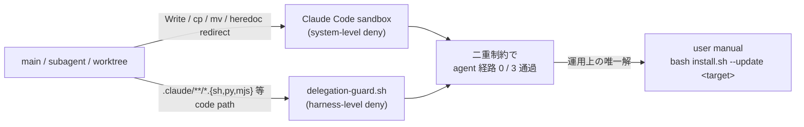

<!--
# task-29 Phase→Step 強制タスク構造 metadata (W5 smoke 集計用 placeholder)
phase_count: 5
total_steps: 13
-->

# Task #31: cross-repo write の user manual normative pattern 規範化

> Status: **🔲 未着手**
> 起案: 2026-05-23
> 関連: #21 (system-reminder-attention), #24 (taskmanagesystem-recovery), #26 (delegation-code-enforcement)
> 設計起源: [`docs/draft/cross-repo-write-user-manual-normative.md`](../draft/cross-repo-write-user-manual-normative.md)

## 背景・目的

cross-repo write (本 repo `/Users/t.hirai/work/hirai-method` → 外部 repo `/Users/t.hirai/タスクマネジメント/taskManageSystem` / `/Users/t.hirai/recall_poc` / `/Users/t.hirai/work/classlab-weekly-news` 等) を実行する task は **agent context (main / subagent / `isolation: "worktree"` を含む全経路) で完全 denied** と確定している (2026-05-23 task-24 W1 subagent a174bcef696b54860 confidence 0.85)。`bash install.sh --update <target>` 系 cross-repo sync は **user manual 実行のみ可能**。

**真因 (技術的根本原因):**
- **system-level**: Claude Code sandbox が cross-repo Write / cp / mv / heredoc redirect を一律 deny。`dangerouslyDisableSandbox: true` 付き Bash も block (task-24 W1 実証)
- **harness-level**: `delegation-guard.sh` が main からの `.claude/hooks/*.sh` 等 code 配下 Write を block するため、外部 repo の同種 path への Write も同様に block 経路にかかる (二重制約)
- subagent foreground / background / `isolation: "worktree"` いずれも同 permission policy 下、回避経路なし
- `ECC_*_OVERRIDE` / `HC_*_ENABLED=false` 等 bypass env は **system-level 制約には効かない** (harness-level のみ無効化可)

**副次 (運用課題):**
- 副産物 task の Wave 計画段で agent 経由実行を試み、subagent block で時間を浪費するケースが反復 (task-21 W3.3 / task-24 W1 / task-26 W6 で同様)
- 「user manual normative pattern」が memory (`feedback_cross_repo_write_sandbox_block.md`) と一部 commit message にしか記録されておらず、規範文書 / template / installer script の 3 箇所に明文化されていない
- 新規 task 起票時に「cross-repo は user manual」を明示しないと、subagent が「sandbox deny で進められず loop 停止」と誤判断するリスク (development-process.md §5 Bash deny 反射と類似の構造)

## 仕様（要決定 → 決定済）

### Q1: 採用案 (規範化のみ / 代替策探索 / ハイブリッド)

| 案 | 内容 | 工数 | 評価 |
|:---:|:---|---:|:---|
| A | 規範化のみ (3 箇所明文化 + 既存 task back-port) | 0.5 | 最小工数、honor system で運用、即日改善 |
| B | 自動代替策探索 (subprocess / `child_process.spawn` / 外部 helper) | 2.0 | sandbox 制約 system-level のため実現性ほぼなし、ROI 低い |
| **C ハイブリッド (採用)** | A (規範化) + parking-lot 🔍 entry で将来 sandbox 仕様変化に追随窓口 | 0.7 | 即日効果 + 将来追随性両立、parking-lot 運用と整合、+0.2 工数のみ |

→ **案 C ハイブリッド** を採用。理由: 案 A の即日効果 (3 箇所明文化 + 既存 task back-port) を即取りつつ、案 B の代替策検討を parking-lot.md に🔍 entry として残すことで将来の sandbox 仕様変化 (例: Claude Code が cross-repo Write を opt-in で許可する future feature) に対応可能。honor system のリスクは `harness-audit.py` の `bypass_log_summary` で副次的に検知 (cross-repo agent 試行が block された痕跡が `.claude/.workflow-state/bypass.log` に記録される設計、entry 起票忘れの再発検出に活用)。

## 設計

### Phase / Step 分割 (task-29 Phase→Step 強制準拠)

| Phase | ゴール | 作業概要 |
|:---:|:---|:---|
| Phase 1 | `.claude/rules/development-process.md` に「cross-repo write 例外」セクション新設 | development-process.md §「サブエージェント `.claude/` 編集の staging 戦略」直後に新セクション追加 / memory 引用 / smoke regression 0 |
| Phase 2 | `_TASK_TEMPLATE.md` Phase 計画段に cross-repo 明示テンプレを追加 | template 内 「Phase / Step 計画」section に「cross-repo を含む Phase は user manual 注意書きを必ず明記」hint 追加 |
| Phase 3 | `install.sh` 冒頭コメントに agent 実行不可 / user manual 専用を明記 | usage section に WARNING block 追加、`--update` mode 説明に「user manual 実行のみ可能」明記 |
| Phase 4 | 既存 task-21 / task-24 / task-26 の cross-repo 関連箇所に user manual 注意書きを back-port | 3 task ファイルの該当 Phase に注意書きセクション追加 (履歴改変ではなく追記) |
| Phase 5 | `docs/tasks/parking-lot.md` に🔍 entry「cross-repo sandbox 緩和の future Claude Code 仕様変化追随」起票 | 必須 7 項目 (起案日 / 保留日 / 保留理由 / 設計書 / 実装状態 / 再検討トリガー / 代替現状) を埋める |

合計: 0.7 工数 (各 Phase 0.1-0.2)

## TDD 戦略

> 本 §「TDD 戦略」は Phase 全体に対する戦略 (RED/GREEN/REFACTOR) を記述する。Phase 計画の最終 Step 3 段と互いに補完する関係。

### RED（先に追加するテスト）

- 規範文書系のため UI 変更なし、unit test 不要。代わりに **完了条件として grep 検証** を全 Phase で必須化:
  - Phase 1: `grep -q "cross-repo write 例外" .claude/rules/development-process.md` exit 0、4 keyword (sandbox / delegation-guard / user manual / `bash install.sh --update`) 全登場
  - Phase 2: `grep -q "cross-repo write" .claude/templates/docs/tasks/_TASK_TEMPLATE.md` exit 0
  - Phase 3: `grep -q "user manual (terminal) 実行のみ可能" install.sh` exit 0
  - Phase 4: 3 task ファイル全てで `grep -q "cross-repo 注意" docs/tasks/task-{21,24,26}-*.md` exit 0
  - Phase 5: `grep -q "cross-repo sandbox 緩和" docs/tasks/parking-lot.md` exit 0

### GREEN（最小実装）

- 各 Phase で対象 file に追記 (履歴改変ではなく追記、既存 commit hash / status 表記は touch しない)
- 規範文書のみ (実装コード変更なし)、subagent 委譲不要 (main から `.claude/rules/` `.claude/templates/` `docs/tasks/` 直接編集可)

### REFACTOR

- 規範文書追加のため refactor 余地は限定的、各 Phase で skip 明示見込
  - Phase 1: `skip: 既存セクション順序を維持、新セクション挿入のみで重複なし`
  - Phase 2: `skip: template 1 行追加のみ、既存構造との重複なし`
  - Phase 3: `skip: コメント追加のみ、既存 logic 変更なし`
  - Phase 4: `skip: 注意書き追加のみ、task 履歴の意味的変更なし`
  - Phase 5: `skip: 新 entry 追加のみ、parking-lot 構造との重複なし`

## Phase 計画

> **Phase = Wave の新呼称** (task-29 Phase→Step 強制タスク構造規範、2026-05-23 採用)。

### Phase 計画前の事前確認 (必須)

`git log --all --grep "cross-repo" --oneline` / `git log --all --grep "user manual normative" --oneline` で既存 commit を確認、該当する完了済 commit があれば該当 Phase は no-op として skip。task-26 W6 / task-21 / task-24 sync commit `c5d00cf` / README rewrite commit `24049f2` は本 task の前提 (既完了)。

### Phase 一覧 (サマリ表)

| Phase | 名前 | 工数 | 依存 |
|:---:|:---|---:|:---|
| 1 | development-process.md 「cross-repo write 例外」セクション追加 | 0.2 | — |
| 2 | _TASK_TEMPLATE.md hint コメント追加 | 0.1 | — |
| 3 | install.sh WARNING block 追加 | 0.1 | — |
| 4 | 既存 task-21 / task-24 / task-26 注意書き back-port | 0.2 | Phase 1 (規範完成後 link 可) |
| 5 | parking-lot.md 🔍 entry 起票 | 0.1 | Phase 1 (規範 link 可) |

合計工数: 0.7h (Phase 1-3 並行起動可、Phase 4-5 は Phase 1 後着手)

### Phase 1: development-process.md 新セクション追加

**ゴール**: development-process.md に「cross-repo write 例外」セクションが存在し、4 keyword (sandbox / delegation-guard / user manual / `bash install.sh --update`) が全登場する (観察可能: `grep -q "cross-repo write 例外" .claude/rules/development-process.md` exit 0)

**作業概要**:
- 対象 file: `.claude/rules/development-process.md`
- 対象セクション: 「サブエージェント `.claude/` 編集の staging 戦略」直後に新セクション挿入
- memory `feedback_cross_repo_write_sandbox_block.md` の 4 段 (Why / How to apply / 例外 / 起源) を rule 文書化形式に整形して埋め込み

**Step**:

- **Step 1.1**: development-process.md に新セクション「cross-repo write 例外 (agent 経路 deny / user manual 専用)」を追加。memory 4 段を rule 文書化形式に整形して埋め込み
  - 完了条件: `grep -q "cross-repo write 例外" .claude/rules/development-process.md` exit 0、新セクション内に「Claude Code sandbox」「delegation-guard」「user manual」「`bash install.sh --update`」4 keyword 全登場
- **Step 1.2: (テスト設計レビュー)** 5+ reviewer 動的選定 (tdd-guide / test-automator / qa-expert / pr-test-analyzer + domain-specific: 規範文書系のため `architect-reviewer` を加味)、並列起動、収束まで反復 (上限 5 回)
  - 完了条件: 全 reviewer approve / no objection (修正提案 0 件)
- **Step 1.3: (テスト合格)** 規範文書のみのため UI 変更なし → unit/integration test 不要、`grep -q` ベースの完了条件検証 + 既存 smoke (delegation-guard / workflow-guard / next-actions-hooks 等) regression 0
  - 完了条件: 既存 smoke 全 PASS regression 0
- **Step 1.4: (リファクタリング)** skip 明示
  - 完了条件: `skip: 既存セクション順序を維持、新セクション挿入のみで重複なし、refactor 不要` 明示記録

### Phase 2: _TASK_TEMPLATE.md hint コメント追加

**ゴール**: `_TASK_TEMPLATE.md` の Phase / Step 計画 section に「cross-repo write を含む Phase は user manual 注意書きを必ず明記」hint コメントが存在する (観察可能: `grep -q "cross-repo write" .claude/templates/docs/tasks/_TASK_TEMPLATE.md` exit 0)

**作業概要**:
- 対象 file: `.claude/templates/docs/tasks/_TASK_TEMPLATE.md`
- 対象セクション: Phase / Step 計画 section の冒頭 hint block
- 具体例文: `「Phase X cross-repo: user manual \`bash install.sh --update <target>\` 案内」`

**Step**:

- **Step 2.1**: template の Phase / Step 計画段に「cross-repo write を含む Phase は user manual 注意書きを必ず明記」hint コメントを追加
  - 完了条件: `grep -q "cross-repo write" .claude/templates/docs/tasks/_TASK_TEMPLATE.md` exit 0、hint コメントが Phase 計画 section 内に配置
- **Step 2.2: (テスト設計レビュー)** 5+ reviewer 動的選定 (常時 base 4 + template 変更系のため `code-architect` / `harness-optimizer` を加味)、並列起動、収束まで反復 (上限 5 回)
  - 完了条件: 全 reviewer approve / no objection
- **Step 2.3: (テスト合格)** template 変更のため、新 task 起票 dry-run (`/new-task --dry-run` 相当) で template 内 hint が表示されること、regression 0
  - 完了条件: template 内 hint が grep 検証可能、既存 task-rule-guard smoke 11/11 PASS regression 0
- **Step 2.4: (リファクタリング)** skip 明示
  - 完了条件: `skip: template 1 行追加のみ、既存構造との重複なし` 明示記録

### Phase 3: install.sh WARNING block 追加

**ゴール**: `install.sh` 冒頭 30 行以内に WARNING block が存在し、`user manual (terminal) 実行のみ可能` keyword が登場する (観察可能: `grep -q "user manual (terminal) 実行のみ可能" install.sh` exit 0)

**作業概要**:
- 対象 file: `install.sh` (冒頭コメント section、L1-22 周辺)
- 対象セクション: Usage / Modes コメント

**Step**:

- **Step 3.1**: `install.sh` 冒頭の Usage コメントに WARNING block を追加 (cross-repo execution restriction の説明、`.claude/rules/development-process.md` 参照リンク)
  - 完了条件: `grep -q "user manual (terminal) 実行のみ可能" install.sh` exit 0、`install.sh` 冒頭 30 行以内に WARNING block 配置
- **Step 3.2: (テスト設計レビュー)** 5+ reviewer 動的選定 (常時 base 4 + installer 系のため `code-reviewer` / `security-reviewer` を加味、`security-reviewer` は WARNING の誤解釈リスクを評価)、並列起動、収束まで反復 (上限 5 回)
  - 完了条件: 全 reviewer approve / no objection
- **Step 3.3: (テスト合格)** `bash install.sh --dry-run` 相当の WARNING 表示確認 + 既存 install smoke regression 0
  - 完了条件: WARNING 表示確認 + 既存 install smoke regression 0
- **Step 3.4: (リファクタリング)** skip 明示
  - 完了条件: `skip: コメント追加のみ、既存 logic 変更なし` 明示記録

### Phase 4: 既存 task-21 / task-24 / task-26 注意書き back-port

**ゴール**: `docs/tasks/task-21-*.md` / `task-24-*.md` / `task-26-*.md` 3 file 全てに `cross-repo 注意` 注意書きが存在する (観察可能: 3 task ファイル全てで `grep -q "cross-repo 注意" docs/tasks/task-{21,24,26}-*.md` exit 0)

**作業概要**:
- 対象 file: `docs/tasks/task-21-system-reminder-attention-fix.md` / `docs/tasks/task-24-taskmanagesystem-recovery.md` / `docs/tasks/task-26-delegation-code-enforcement.md`
- 対象セクション: 各 task の cross-repo 関連 Phase (task-21 W3.3 / task-24 W1 / task-26 W6) に注意書きセクション追加 (履歴改変ではなく追記)

**Step**:

- **Step 4.1**: 3 task ファイルの該当 Phase description に注意書き追加 (`> **cross-repo 注意**: ...` blockquote 形式)
  - 完了条件: 3 task ファイル全てで `grep -q "cross-repo 注意" docs/tasks/task-{21,24,26}-*.md` exit 0、注意書きが該当 Phase 直後に配置
- **Step 4.2: (テスト設計レビュー)** 5+ reviewer 動的選定 (常時 base 4 + task 履歴系のため `architect-reviewer` を加味)、並列起動、収束まで反復 (上限 5 回)
  - 完了条件: 全 reviewer approve / no objection
- **Step 4.3: (テスト合格)** 3 task ファイル grep 検証 + 既存 task-rule-guard smoke regression 0 (11/11 PASS)
  - 完了条件: 既存 task-rule-guard smoke 11/11 PASS regression 0
- **Step 4.4: (リファクタリング)** skip 明示
  - 完了条件: `skip: 注意書き追加のみ、task 履歴の意味的変更なし` 明示記録

### Phase 5: parking-lot.md 🔍 entry 起票

**ゴール**: `docs/tasks/parking-lot.md` に 🔍「cross-repo sandbox 緩和」entry が存在し、7 必須項目が埋まっている (観察可能: `grep -q "cross-repo sandbox 緩和" docs/tasks/parking-lot.md` exit 0)

**作業概要**:
- 対象 file: `docs/tasks/parking-lot.md`
- 対象セクション: 🔍 (再検討予定) entry section
- 必須 7 項目: 起案日 / 保留日 / 保留理由 / 設計書 / 実装状態 / 再検討トリガー / 代替現状

**Step**:

- **Step 5.1**: parking-lot.md に新 entry「cross-repo sandbox 緩和の future Claude Code 仕様変化追随」追加、必須 7 項目を埋める (起案日: 2026-05-23 / 保留日: 2026-05-23 / 保留理由: system-level 制約 / 設計書: 本 task draft §仕様 Q1 案 B / 実装状態: 未着手 / 再検討トリガー: Claude Code が cross-repo Write を opt-in 許可する future feature / 代替現状: user manual `bash install.sh --update <target>`)
  - 完了条件: `grep -q "cross-repo sandbox 緩和" docs/tasks/parking-lot.md` exit 0、🔍 status マーク付与
- **Step 5.2: (テスト設計レビュー)** 5+ reviewer 動的選定 (常時 base 4 + parking-lot 運用系のため `harness-optimizer` を加味)、並列起動、収束まで反復 (上限 5 回)
  - 完了条件: 全 reviewer approve / no objection
- **Step 5.3: (テスト合格)** parking-lot.md 7 必須項目 grep 検証 + 既存 task-rule-guard smoke regression 0
  - 完了条件: 7 項目全 grep 検証 PASS + 既存 smoke regression 0
- **Step 5.4: (リファクタリング)** skip 明示
  - 完了条件: `skip: 新 entry 追加のみ、parking-lot 構造との重複なし` 明示記録

## 完了条件

- [ ] `.claude/rules/development-process.md` に「cross-repo write 例外」セクション存在、4 keyword (sandbox / delegation-guard / user manual / `bash install.sh --update`) 全登場
- [ ] `.claude/templates/docs/tasks/_TASK_TEMPLATE.md` に cross-repo hint コメント存在
- [ ] `install.sh` 冒頭 30 行以内に WARNING block 存在、`user manual (terminal) 実行のみ可能` keyword 登場
- [ ] `docs/tasks/task-21-*.md` / `task-24-*.md` / `task-26-*.md` 3 file 全てに `cross-repo 注意` 注意書き存在
- [ ] `docs/tasks/parking-lot.md` に 🔍「cross-repo sandbox 緩和」entry 存在、7 必須項目埋め
- [ ] 既存 smoke 全 PASS regression 0 (delegation-guard / task-rule-guard / workflow-guard / next-actions-hooks / observe-jq-parse / observe-rotate 各最新版)
- [ ] `docs/tasks/next-actions.md` entry #17 の処理結果列に移行先記入完了
- [ ] cross-repo 反映時の user manual 動作確認手順が `.claude/rules/development-process.md` 新セクションに明記され、user が pasta-able な one-liner として提示可能

## 工数見積

合計 0.7 工数 (各 Phase 0.1-0.2)。

内訳:
- Phase 1 (development-process.md 新セクション): 0.2
- Phase 2 (_TASK_TEMPLATE.md hint): 0.1
- Phase 3 (install.sh WARNING): 0.1
- Phase 4 (既存 3 task back-port): 0.2
- Phase 5 (parking-lot.md entry): 0.1

工数前提: 規範文書追加のみ (実装コード変更なし)、subagent 委譲不要 (main から `.claude/rules/` `.claude/templates/` `docs/tasks/` 直接編集可)、Phase 1-3 並行起動可 / Phase 4-5 は Phase 1 後 (file 競合なし)。

## 影響範囲

| 範囲 | 詳細 |
|---|---|
| ファイル | `.claude/rules/development-process.md`、`.claude/templates/docs/tasks/_TASK_TEMPLATE.md`、`install.sh`、`docs/tasks/task-21-*.md` / `task-24-*.md` / `task-26-*.md`、`docs/tasks/parking-lot.md` |
| migration | なし (規範文書 + template + コメント追加のみ) |
| 環境変数 | reviewer bypass `ECC_TEST_DESIGN_REVIEW_OFF=1` (task-29 既存) |
| 互換性 | 全 Phase 追記方式 (既存 commit hash / status 表記は touch しない)、実装コード変更なし、subagent 委譲なし |

## 再発防止

- 副産物 task の Wave 計画段で agent 経由 cross-repo 実行を試みる再発防止: development-process.md 新セクションを毎セッション参照させる仕組み (本 task で規範化、honor system)
- `.claude/.workflow-state/bypass.log` の cross-repo agent 試行 block 痕跡を `harness-audit.py` `bypass_log_summary` で集計、entry 起票忘れの再発検出に活用
- 将来 Claude Code sandbox 仕様変化 (cross-repo Write opt-in 許可) への追随: parking-lot.md 🔍 entry で四半期 review、Claude Code release notes 監視を user manual で実施

## ステータスログ

| 日付 | 状態 | 備考 |
|---|---|---|
| 2026-05-23 | 起案 | 設計 draft `docs/draft/cross-repo-write-user-manual-normative.md` 起こし |
| 2026-05-23 | 承認 | user 承認、`list.md` に追加 |

## 派生 task / 次アクション候補

このタスクの実装中・レビュー中・完了時に「これは別 task として管理すべき」と判断した副産物 (byproduct) を箇条書きで記入する。

### 暫定候補 (実装着手時に発見次第追記)

- [ ] (🟢) cross-repo agent 試行 block 痕跡の `bypass_log_summary` 集計の有効化検証 (再発検出の運用化)
- [ ] (🟢) Claude Code release notes 監視 cadence の規範化 (四半期 review トリガー)

### 関連

- [`next-actions.md`](next-actions.md) — 本セクションと連動する registry
- [`.claude/rules/development-process.md`](../../.claude/rules/development-process.md) §「副産物発生時の即時 draft 起こし義務」

## 関連

- Draft: [`docs/draft/cross-repo-write-user-manual-normative.md`](../draft/cross-repo-write-user-manual-normative.md)
- 依存タスク: #21 (system-reminder-attention), #24 (taskmanagesystem-recovery), #26 (delegation-code-enforcement)
- 派生タスク: (実装中に発見次第追記)
- 既存設計 / 規範:
  - `.claude/rules/development-process.md` §「サブエージェント `.claude/` 編集の staging 戦略」(task #12 起源、本 task の隣接セクション)
  - `.claude/rules/task-management.md` §「タスク構造規範 (Phase→Step 強制)」(task-29 起源、本 task の Phase / Step 構造の根拠)
- 関連 commit:
  - `89013c5` — entry #17 起票 (本 task 直接の起源、副産物登録)
  - `c5d00cf` — task-26 完了 (W6 user manual 3 リポ反映) + task-21/24 sync
  - `24049f2` — README rewrite (task-25 B2、cross-repo manual normative pattern note 追加)
  - `b302b13` — task-24 W2+W4 (taskManageSystem .envrc + COEXISTENCE.md、HC_PROJECT_ROOT 固定)
- 副産物 entry: `docs/tasks/next-actions.md` entry #17 (2026-05-23、🟡)
- memory: `feedback_cross_repo_write_sandbox_block.md` (2026-05-23、本 task の事実根拠)
- 関連 audit: `.claude/.workflow-state/bypass.log` (cross-repo agent 試行 block 痕跡)、`harness-audit.py` `bypass_log_summary` (再発検知)
