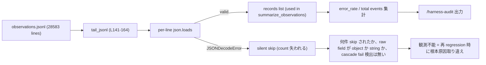

<!--
# task-29 Phase→Step 強制タスク構造 metadata (W5 smoke 集計用 placeholder)
phase_count: 4
total_steps: 9
-->

# Task #32: harness-audit の jq-valid / observation-健全性指標 cascade fail 汚染修復

> Status: **🔲 未着手**
> 起案: 2026-05-23
> 関連: #21 (system-reminder-attention W3 Phase B 計測信頼性), #27 (observe-jq-parse-fix)
> 設計起源: [`docs/draft/harness-audit-jq-valid-metric-fix.md`](../draft/harness-audit-jq-valid-metric-fix.md)

## 背景・目的

task-27 draft §1 は当初 "**3916/7048 records (56%)** が jq parse invalid" と前提していたが、これは **`jq -e '.tool'` を newline-delimited JSONL 全体に `jq -s` 等の stream mode で適用した際に 1 件の broken record が後続行 parse を巻き込んで cascade fail させた誤計測** (subagent 確認、5600x off)。W2 で Python decoder により 1 行ずつ独立 parse した結果、**実 invalid 率は 11/28583 = 0.04%**。

しかし **measurement 側の harness-audit.py** は `tail_jsonl()` (L141-164) で `json.JSONDecodeError` を per-line skip しており、L4 学習 / production observations の **「健全性」を観測する指標が明示的には存在しない** 状態。`/harness-audit` 出力 (L609-629) の `total events` / `error_rate` / `timeouts` は載っているが、「jsonl parser が捨てた行数」「raw field の object 化率」「cascade fail 検出」などの **observation pipeline 健全性指標** は計測されていない。

このため:
- task-27 close の根拠となる「実 invalid 率 0.04%」を **production observation で継続的に観測する手段が無い**
- 仮に observe.sh が再 regression した場合 (rawfile 経路が壊れて argjson cascade fail が再発した場合)、harness-audit では `total events` の自然減としてしか見えず、根本原因を取り違える危険
- task-27 draft §1 で 44% / 56% / 95%+ といった数値が引用されているが、これらは **measurement 機構が無い状態で出された推定値** で、historical record としても誤解を招く

**真因:** observe.sh 修復 (write 側 W1) と observe-repair.sh (既存 repair W2) は本来「pipeline 全体の健全性」を保証するが、**measurement 側 (harness-audit.py)** が pre-修復前の error_rate / total events だけを集計しており、修復後の健全性 (jq-valid 率 / raw.object 率 / parse-skip 率) を明示する指標が無い。

**副次:**
- task-27 draft §1 / DoD の 44% / 56% / 95%+ 数値は historical document として誤解を招く (本 task Phase 4 で訂正 footnote 追加)
- 将来 observe.sh の write 経路が再 regression したら根本原因を取り違える (cascade fail 検出が無いため total events の減少としてしか見えない)
- harness-audit `bypass_log_summary` 系 fixture / smoke の前提値も、cascade fail 由来の数値を embed している場合は同根本問題

## 仕様（要決定 → 決定済）

### Q1: 採用案 (surgical fix / 全面 Python re-parse / ハイブリッド)

| 案 | 内容 | 工数 | 評価 |
|:---:|:---|---:|:---|
| A surgical fix | `summarize_observations` (L167-211) に 3 指標 (parse-skipped / raw.object 率 / cascade fail 検出) 追加、`tail_jsonl` 返り値 dict 化 | 0.5 | 既存 schema 互換、最小変更、cascade fail 検出は heuristic で誤検出余地 |
| B 全面 Python re-parse | `json.JSONDecoder` ベース structured parser に書き換え、cascade fail を構造的に検出 | 2.0 | cascade fail 構造的消去 / 長期 robust、Python 3.13 依存深まる / 既存 fixture / smoke 全 regression テスト要 |
| **C ハイブリッド (採用)** | A 採用 + cascade fail 検出のみ B 風 structured parser pattern を `tail_jsonl` 単体に局所適用 (consecutive JSONDecodeError lookback で「stream cascade fail」signature 検出 → audit に warning 表示) | 1.2 | jq-valid 率の即時可視化 + cascade fail 再発検知の両立、surgical scope 維持 |

→ **案 C ハイブリッド** を採用。理由: A だけだと「再 regression 時の cascade fail を取り違える」副次問題が残るが、B の全面書き換えは scope 過剰。C は cascade fail 検出を `tail_jsonl` 単体に局所追加するだけで surgical scope を維持しつつ task-27 close 根拠を可視化できる。工数 1.2 は A (0.5) + cascade 検出局所追加 (0.5) + Phase 4 historical doc 訂正 (0.2)。

## 設計

> **構造**: 採用 5 条 (`.claude/rules/task-management.md`「タスク構造規範」) に従い Phase→Step 2 階層で記述。本 task は UI 変更を含まず、純 Python script / fixture 改修のため、最終 Step は「テスト設計レビュー → unit/integration test PASS → リファクタリング」の 3 段。

## TDD 戦略

> 本 §「TDD 戦略」は Phase 全体に対する戦略 (RED/GREEN/REFACTOR) を記述する。Phase 計画の最終 Step 3 段と互いに補完する関係。

### RED（先に追加するテスト）

- `.claude/tests/harness-audit-pipeline-health-smoke.sh` 新設、Phase 1 + Phase 2 を 4-6 ケースで verify
  - Case 1: production fixture (28583 records) で jq-valid 率 99%+ / raw object rate 99%+ 検証
  - Case 2: parse-skipped line を含む fixture で skipped_lines count 検証
  - Case 3: cascade fixture (5 連続 broken line) で `cascade_suspected == True` 検証
  - Case 4: normal fixture (broken line 散発) で `cascade_suspected == False` 検証
  - Case 5: markdown 出力に「Observation Pipeline 健全性」セクション存在検証
  - Case 6: cascade fixture 適用時に `🔴 CASCADE FAIL SUSPECTED` warning 表示検証

### GREEN（最小実装）

- `harness-audit.py` の `tail_jsonl` 返り値を `dict{records, skipped_lines, total_lines}` に変更 (surgical: caller 1 箇所のみ修正)
- `summarize_observations` に `raw_object_rate` / `raw_string_count` 集計追加
- `tail_jsonl` 内に `consecutive_skips` counter 追加、5 連続で `cascade_suspected: True` set
- markdown 出力 (`fmt_observations` 相当) 直後に「Observation Pipeline 健全性」セクション追加

### REFACTOR

- `tail_jsonl` / `summarize_observations` を 3 観点 (持続可能性 / 汎用性 / 非冗長化) で見直し
- 関数長 50 行以内 / 引数化可能性 / DRY を verify、または `skip: 現状コードは閾値内 / 抽出余地なし` を明示記録

## Phase 計画

> **Phase = Wave の新呼称** (task-29 Phase→Step 強制タスク構造規範、2026-05-23 採用)。

### Phase 計画前の事前確認 (必須)

`git log --all --grep "harness-audit" --grep "observation" --oneline` で既存 commit を確認。`c25f3ee` (observe.sh W1) / `fd5f6e5` (observe-repair.sh W2) は本 task の前提 (既完了)、`harness-audit.py` 側の measurement 改修 commit は未着手 (2026-05-23 next-actions entry #20 確認)。

### Phase 一覧 (サマリ表)

| Phase | 名前 | 工数 | 依存 |
|:---:|:---|---:|:---|
| 1 | harness-audit.py の observation 健全性指標追加 (案 C 第 1 段) | 0.5 | — |
| 2 | cascade fail 検出 (案 C 第 2 段、局所 structured parser pattern) | 0.4 | Phase 1 |
| 3 | テスト設計レビュー → smoke 合格 → リファクタリング (採用 5 条 4) | 0.2 | Phase 1, 2 |
| 4 | task-27 draft / list.md historical 訂正 | 0.1 | Phase 1-3 (新 metric の根拠完成後 link) |

合計工数: 1.2h

### Phase 1: harness-audit.py の observation 健全性指標追加 (案 C 第 1 段)

**ゴール**: `/harness-audit` 出力で「parse-skipped 行数 / raw field object 率 / total observations 件数」が production observation から実測値として表示され、task-27 close 根拠が継続的に可視化される (観察可能: `python3 .claude/scripts/harness-audit.py` 出力に新セクション「Observation Pipeline 健全性」が含まれる)

**作業概要**:
- `summarize_observations` (L167-211) に jq-valid 率 / raw.object 率の集計を追加
- `tail_jsonl` (L141-164) を返り値 dict 化し parse-skip count を expose
- markdown 出力 (L609-629) に新セクション「Observation Pipeline 健全性」追加
- 既存 `total events` / `error rate` 表示との整合性検証

**Step**:

- **Step 1-1**: `tail_jsonl` の return 拡張 + skip count expose。返り値を `list[dict]` から `dict{records, skipped_lines, total_lines}` に変更 (surgical: caller 1 箇所のみ修正)
  - 完了条件: `python3 -c "from harness_audit import tail_jsonl; r = tail_jsonl(Path('observations.jsonl'), 100); assert 'skipped_lines' in r and 'records' in r"` exit 0、既存 `summarize_observations` への引き渡しを `r['records']` に修正
- **Step 1-2**: `summarize_observations` に raw field object 率追加。各 record の `raw` field が dict (object) か str (旧 schema) かを判定し `raw_object_count` / `raw_string_count` を集計
  - 完了条件: 返り値に `raw_object_rate: float` (0.0-1.0) と `raw_string_count: int` が含まれる、unit test で 28583 records の fixture に対し object_rate >= 0.99 が出る (task-27 W1 commit `c25f3ee` 以降の record は全て object のはず)
- **Step 1-3**: markdown 出力に「Observation Pipeline 健全性」セクション追加。`fmt_observations` 相当 (L609-629) の直後に新セクションを挿入、`parse-skipped: N / total lines (rate %)` `raw object rate: X%` を表示
  - 完了条件: `python3 .claude/scripts/harness-audit.py --window 1000` 実行で出力に `## Observation Pipeline 健全性` heading + `parse-skipped` + `raw object rate` 行が含まれる (`grep -q "Observation Pipeline 健全性"` exit 0)

### Phase 2: cascade fail 検出 (案 C 第 2 段、局所 structured parser pattern)

**ゴール**: `tail_jsonl` 内で「連続 N 行 (default 5) の JSONDecodeError」を検出した場合 audit 出力に warning 表示され、observe.sh の write 経路 regression を早期警戒できる (観察可能: cascade fail fixture で warning 行が grep 検出可能)

**作業概要**:
- `tail_jsonl` 内で consecutive JSONDecodeError counter を追加
- 閾値超過時に `cascade_suspected: True` を return dict に追加
- markdown 出力で 🔴 warning として目立たせる
- cascade fail を再現する fixture を用意して smoke で検証

**Step**:

- **Step 2-1**: consecutive JSONDecodeError lookback + warning emit。`tail_jsonl` の for loop 内に `consecutive_skips` counter 追加、5 連続 JSONDecodeError で `cascade_suspected: True` set、reset on success line
  - 完了条件: cascade fixture (5 連続 broken line を含む jsonl) で `cascade_suspected == True`、normal fixture (broken line 散発) で `cascade_suspected == False` (unit test 2 ケース PASS)
- **Step 2-2**: markdown 出力で 🔴 warning 表示。`cascade_suspected == True` 時に「Observation Pipeline 健全性」セクション末尾に warning 行を表示
  - 完了条件: cascade fixture 適用時の audit 出力で `grep -q "🔴 \*\*CASCADE FAIL SUSPECTED\*\*"` exit 0

### Phase 3: テスト設計レビュー → smoke 合格 → リファクタリング (Phase 最終、採用 5 条 4 強制)

**ゴール**: Phase 1-2 で追加した logic が unit + integration smoke で全 PASS し、reviewer 5+ subagent が approve、refactor で magic number / 重複排除 (3 観点) が完了する

**作業概要**:
- Step 3-1: テスト設計を `docs/draft/<slug>.test-design.md` に書き出し、reviewer 5+ subagent 並列起動で MECE 観点を fan-out review
- Step 3-2: 合意した test 設計に従い unit + integration smoke 実行 (Python script のため E2E 不要、UI 変更検出基準で skip OK)
- Step 3-3: refactor 3 観点 (持続可能性 / 汎用性 / 非冗長化) で `tail_jsonl` / `summarize_observations` をレビュー、不要なら `skip: <reason>` 明示

**Step**:

- **Step 3-1: (テスト設計レビュー)** 本 task は Python script 改修 + observation pipeline + harness-audit 出力 format の 3 領域に跨るため、`tdd-guide` / `test-automator` / `qa-expert` / `pr-test-analyzer` + `python-reviewer` の **5 件動的選定** で並列起動 (run_in_background: true 必須)
  - 完了条件: 5 reviewer 全件 approve / no objection (修正提案 0 件)、反復上限 5 回以内、`ECC_TEST_DESIGN_REVIEW_OFF=1` 未使用
- **Step 3-2: (テスト合格)** `.claude/tests/harness-audit-pipeline-health-smoke.sh` 新設、Phase 1 (jq-valid 率 / raw.object 率) + Phase 2 (cascade 検出) を 4-6 ケースで verify
  - 完了条件: `bash .claude/tests/harness-audit-pipeline-health-smoke.sh` exit 0、既存 `.claude/tests/harness-audit-{compare,c-batch}-smoke.sh` regression 0 件
- **Step 3-3: (リファクタリング)** `tail_jsonl` / `summarize_observations` を持続可能性 / 汎用性 / 非冗長化の 3 観点でレビュー、必要なら抽出 / 命名整理。不要なら明示 skip
  - 完了条件: 関数長 50 行以内 / 引数化可能性 / DRY を verify、または `skip: 現状コードは閾値内 / 抽出余地なし` を Step 完了報告に明記

### Phase 4: task-27 draft / list.md historical 訂正

**ゴール**: task-27 draft §1 の "56% (3916/7048)" / DoD の "44% → 95%+" 等の cascade fail 由来の数値に **historical footnote** を追加し、本 task で実装された Phase 1-2 の指標が真実の source であることを明示する (観察可能: `grep -q "historical footnote" docs/draft/observe-jq-parse-fix.md` exit 0)

**作業概要**:
- `docs/draft/observe-jq-parse-fix.md` §1 / §3 W1 / §6 DoD に footnote 追加 (旧記述を取り消し線 + 「実測 0.04%、measurement は本 task で実装」と注釈)
- `docs/tasks/list.md` の task-27 行に「task-32 (jq-valid metric fix) で measurement 側完結」リンク追加
- `docs/tasks/next-actions.md` entry #20 の処理結果列に「→ `docs/draft/harness-audit-jq-valid-metric-fix.md` → task #32」を記入

**Step**:

- **Step 4-1**: task-27 draft への footnote 追加 + list.md / next-actions.md sync。3 ファイルを subagent 経由で更新 (メイン直接 Edit は許可、`docs/` 直下なので draft-flow-guard は通過)
  - 完了条件: 3 ファイル全てに historical footnote / sync entry が含まれ、`grep -q "task-32" docs/tasks/next-actions.md` exit 0、`grep -q "historical footnote\|実測 0.04" docs/draft/observe-jq-parse-fix.md` exit 0

## 完了条件

- [ ] `python3 .claude/scripts/harness-audit.py` 出力に「Observation Pipeline 健全性」セクションが存在し jq-valid 率 / raw object rate が表示される
- [ ] production observations (28583 records) で jq-valid 率 **99%+** / raw object rate **99%+** を実測表示
- [ ] cascade fail 検出 fixture (5 連続 broken line) で `🔴 CASCADE FAIL SUSPECTED` warning が表示される
- [ ] cascade fail normal fixture (散発 broken line) で warning が出ない
- [ ] `.claude/tests/harness-audit-pipeline-health-smoke.sh` exit 0 (新 smoke)
- [ ] 既存 `.claude/tests/harness-audit-{compare,c-batch}-smoke.sh` regression 0 件
- [ ] task-27 draft §1 / §3 W1 / §6 DoD に historical footnote 追加 (旧 56% / 44% / 95%+ 記述に注釈)
- [ ] `docs/tasks/next-actions.md` entry #20 処理結果列に「→ task #32」記入
- [ ] reviewer 5+ subagent approve (Phase 3 Step 3-1)

## 工数見積

- Phase 1: 0.5 (harness-audit.py surgical 修正 + smoke)
- Phase 2: 0.4 (cascade 検出局所追加 + fixture)
- Phase 3: 0.2 (reviewer 並列起動 + refactor 判定、Phase 3 は実質 review-only なので軽量)
- Phase 4: 0.1 (historical footnote + sync)

合計: **1.2 工数**

## 影響範囲

| 範囲 | 詳細 |
|---|---|
| ファイル | `.claude/scripts/harness-audit.py` (L141-211 / L609-629 修正)、`.claude/tests/harness-audit-pipeline-health-smoke.sh` (新規)、`docs/draft/observe-jq-parse-fix.md`、`docs/tasks/list.md`、`docs/tasks/next-actions.md` |
| migration | なし (observation pipeline schema は task-27 W1 で既に object 化済) |
| 環境変数 | `HC_CASCADE_THRESHOLD` (cascade fail 検出閾値の override、default 5) を新設候補、reviewer bypass `ECC_TEST_DESIGN_REVIEW_OFF=1` (task-29 既存) |
| 互換性 | `tail_jsonl` return schema 変更で caller 全件 regression リスク → 本 task の caller は `summarize_observations` 1 箇所のみ (確認済)、必要なら deprecation alias 経由で段階移行 |

## 再発防止

- observe.sh write 経路の再 regression 早期警戒: Phase 2 cascade fail 検出で `total events` 自然減と誤認するパターンを構造防止
- task-27 draft の cascade fail 由来数値 (44% / 56% / 95%+) の historical 訂正で過去意思決定のトレーサビリティ維持
- 既存 `bypass_log_summary` / `swe_bench_breakdown` 等の集計の cascade fail 汚染 (未調査領域): Phase 1 Step 1-2 完了後、subagent で `harness-audit.py` 全関数の jsonl 集計箇所を grep し汚染候補を列挙、別 task で順次対応 (派生 task 候補)

## ステータスログ

| 日付 | 状態 | 備考 |
|---|---|---|
| 2026-05-23 | 起案 | 設計 draft `docs/draft/harness-audit-jq-valid-metric-fix.md` 起こし |
| 2026-05-23 | 承認 | user 承認、`list.md` に追加 |

## 派生 task / 次アクション候補

このタスクの実装中・レビュー中・完了時に「これは別 task として管理すべき」と判断した副産物 (byproduct) を箇条書きで記入する。

### 暫定候補 (実装着手時に発見次第追記)

- [ ] (🟡) 既存 `bypass_log_summary` / `swe_bench_breakdown` 等の集計の cascade fail 汚染調査 (Phase 1 Step 1-2 完了後の grep 列挙結果から起票)
- [ ] (🟢) `HC_CASCADE_THRESHOLD` env override の規範化 (default 5 / 運用 tuning 余地)

### 関連

- [`next-actions.md`](next-actions.md) — 本セクションと連動する registry
- [`.claude/rules/development-process.md`](../../.claude/rules/development-process.md) §「副産物発生時の即時 draft 起こし義務」

## 関連

- Draft: [`docs/draft/harness-audit-jq-valid-metric-fix.md`](../draft/harness-audit-jq-valid-metric-fix.md)
- 依存タスク: #27 (observe-jq-parse-fix、W1+W2 完了 + W3 不要判定で close、本 task の起源)
- 派生タスク: #21 W3 Phase B (handoff latency 計測も observation 依存、本 task で healthening されれば計測信頼性向上)
- 関連 commit:
  - `c25f3ee` (observe.sh W1 `--rawfile` + `fromjson?` 置換、write 側 fix)
  - `fd5f6e5` (observe-repair.sh W2、既存 jsonl 修復 + Python decoder 実測 11/28583 = 0.04% の根拠)
- 副産物 entry: `docs/tasks/next-actions.md` entry #20 (本 task の registry 起源)
- 修正対象 file: `.claude/scripts/harness-audit.py` L141-164 / L167-211 / L609-629
- 参考実装: `.claude/skills/continuous-learning-v2/hooks/observe.sh` L181-208 (修復済参考、`--rawfile` + `fromjson?` パターン)
- 関連 rule: `.claude/rules/self-improvement.md` §L4 (continuous-learning v2.1、observation pipeline 健全性は L4 学習の前提) / `.claude/rules/task-management.md` §タスク構造規範 (採用 5 条、本 task の Phase→Step 構造の根拠)
