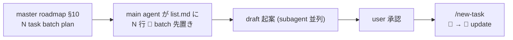

<!--
# task-29 Phase→Step 強制タスク構造 metadata (W5 smoke 集計用 placeholder)
phase_count: 5
total_steps: 14
-->

# Task #33: list.md plan-first 規範化 (batch planning 時の 📝 行先置きフロー)

> Status: **🔄 進行中**
> 起案: 2026-05-25
> 関連: #29 (Phase→Step 採用 5 条、本 task の構造根拠)
> 設計起源: [`docs/draft/list-md-plan-first-normative.md`](../draft/list-md-plan-first-normative.md)

## 背景・目的

`/new-task` は **1 task ずつ sequential** に list.md へ 🔲 行 append する設計で、master roadmap で **N 個の task を batch plan** する用途を想定していない。結果、26 task の batch 計画下でも list.md は空のまま draft 起案だけが進み、user が IDE で進捗追跡不可になる事案が recall_poc で発生 (2026-05-25 観測)。本 task で plan-first 規範化 (案 C ハイブリッド P1+P2+P3+P5、工数 2.5) を実装する。

**真因 (4 階層)**:
1. `/new-task` 1-task-at-a-time gate で batch planning 想定外
2. 規範矛盾 (task-rule-guard 許諾 vs `/new-task` 経由のみ 読解)
3. 凡例 📝 用途未明文化
4. AI 運用判断ミス (karpathy Think Before Coding 未適用)

詳細は draft §1 真因サマリを参照。

## 仕様（要決定 → 決定済）

draft §2 の 4 案比較から **案 C ハイブリッド (P1+P2+P3+P5)** を採用。理由: 即日効果 (P1 規範) + 整合性 (P2) + 機械検出 (P3+P5) の 3 層で plan-first 強制を構造的に達成。P4 は工数比効果が低い、parking-lot 検討に分離。

## 設計

draft §3 を参照。Phase→Step 採用 5 条準拠で 5 Phase 14 Step。

## TDD 戦略

### RED
- 規範文書系 (Phase 1) は grep 検証ベース、unit test 不要
- 実装系 (Phase 2-4) は smoke test 先行:
  - **Phase 2**: 新規 `new-task-batch-update-smoke.sh` (3 cases: update / append / batch 先置き整合性)
  - **Phase 3**: 新規 `list-md-plan-first-reminder-smoke.sh` (3 cases: 条件成立 [draft=3] / 不成立 [draft=2 境界] / bypass)
  - **Phase 4**: 既存 `task-rule-guard-smoke.sh` 拡充 11→13 cases (Case 12: 📝 不在 warn / Case 13: 📝 存在 素通り)

### GREEN
- Phase 1: task-management.md 新 subsection 追加 (main 直接 Edit)
- Phase 2: `.claude/commands/new-task.md` + `.claude/scripts/` helper (subagent staging)
- Phase 3: `.claude/hooks/session-help-surface.sh` 拡張 or 新 hook (subagent staging)
- Phase 4: `task-rule-guard.sh` 拡張 (subagent staging)

### REFACTOR
- 各 Phase 最終 Step 3 段 (テスト設計レビュー → テスト合格 → リファクタリング判定) で 3 観点評価

## Phase 計画

> **Phase = Wave の新呼称** (task-29 Phase→Step 強制タスク構造規範、2026-05-23 採用)。

### Phase 計画前の事前確認 (必須)

`git log --all --grep "plan-first" --grep "list.md" --oneline` で既存 commit 確認。本 task は新規規範化のため既存解消 commit なし。

### Phase 一覧 (サマリ表)

| Phase | 名前 | 工数 | 依存 |
|:---:|:---|---:|:---|
| 1 | task-management.md §「plan-first 行先置きフロー」追加 (P1) | 0.5 | — |
| 2 | `/new-task` の 📝 → 🔲 update 動作拡張 (P2) | 0.7 | Phase 1 |
| 3 | SessionStart hook で「list.md 空 + draft ≥ 3」検出 (P3) | 0.6 | Phase 1 |
| 4 | `task-rule-guard.sh` PreToolUse(`/new-draft`) で 📝 不在 warn (P5) | 0.4 | Phase 1, 2 |
| 5 | テスト設計レビュー → smoke → リファクタリング (採用 5 条 4 強制) | 0.3 | Phase 1-4 |

合計工数: **2.5h**

### Phase 1: task-management.md §「plan-first 行先置きフロー」追加 (P1)

**ゴール**: `.claude/rules/task-management.md` に「設計→承認→タスク追加フロー」を 2 経路 (A: 単発、B: batch planning) に分岐する subsection が存在し、凡例 📝 の用途が明文化される (観察可能: `grep -q "経路 B (batch planning)" .claude/rules/task-management.md` exit 0)

**honor system 退行リスク認識**: Phase 3+4 機械検出は warn ベース (block しない) のため、AI が経路 A only に退行する可能性残存。Phase 5 Step 5.4 で CLAUDE.md Critical Lessons に教訓追加し永続化することで再発抑制を構造的に補完。

**作業概要**:
- 既存 §「設計→承認→タスク追加フロー（必須）」直後に新 subsection 追加
- 経路 A (単発): 既存フロー保持
- 経路 B (batch planning): 4 step (master roadmap plan → list.md 📝 batch 先置き → 個別 draft 起案 → `/new-task` で 📝 → 🔲 update)
- 凡例 📝 用途明文化: 「draft 起案中 / 承認待ち + 計画段階の先置き」

**Step**:
- **Step 1.1**: task-management.md 編集 (main 直接 Edit、`.claude/rules/` 許可)
  - 完了条件: `grep -q "経路 B (batch planning)" .claude/rules/task-management.md` exit 0、新 subsection 存在
- **Step 1.2 (テスト設計レビュー)**: 5+ reviewer 動的選定 (architect-reviewer / harness-optimizer / qa-expert / tdd-guide / pr-test-analyzer)、収束まで反復 (上限 5 回)
  - 完了条件: 全 reviewer approve
- **Step 1.3 (テスト合格)**: 規範文書のため grep 検証 + 既存 smoke regression 0
  - 完了条件:
    - `grep -q "経路 A (単発、既存フロー、default)" .claude/rules/task-management.md` exit 0 (経路 A 不破壊)
    - `grep -q "経路 B (batch planning)" .claude/rules/task-management.md` exit 0 (経路 B 追加)
    - `grep -q "📝 設計（未承認）" .claude/rules/task-management.md` exit 0 (凡例 📝 status 文言存在)
    - `grep -q "2 用途" .claude/rules/task-management.md` exit 0 (用途 (1)/(2) table 存在、QA-08 強化: status 文言単独では table 削除を検知できないため AND 条件で table 自体の存在を担保)
    - `bash .claude/tests/task-rule-guard-smoke.sh` exit 0、既存 11 cases regression 0
- **Step 1.4 (リファクタリング)**: skip 明示 (規範文書追記のみ、refactor 余地なし)
  - 完了条件: `skip: 規範文書追記のみ、refactor 余地なし` 明記

### Phase 2: `/new-task` の 📝 → 🔲 update 動作拡張 (P2)

**ゴール**: list.md **同 ID かつ 同 slug** (**ID + slug の AND 一致** 必須、ID 単独 / slug 単独 grep 禁止、task-management.md L163 規範整合) の 📝 行が既存なら update (📝 → 🔲)、不在なら append する動作が `.claude/commands/new-task.md` で仕様化され helper script で機械実装される (観察可能: 同 ID + 同 slug の 📝 行が既存の list.md に対し `/new-task` 実行後、行数増えず status のみ変化)

**作業概要**:
- `.claude/commands/new-task.md` に「📝 行 update or append」logic 明記
- 実装: bash helper or Python script (subagent staging 必須、`.claude/commands/` `.claude/scripts/` 配下)
- 新 smoke `new-task-batch-update-smoke.sh` で update vs append 動作 2 cases 検証

**Step**:
- **Step 2.1**: `/new-task.md` 動作仕様 update (main 直接 Edit、`.claude/commands/` は protected_paths_code 配下のため要確認)
  - 完了条件: 動作仕様明文化、`grep -q "📝 行 update" .claude/commands/new-task.md` exit 0
- **Step 2.2**: 実装 helper (subagent staging で `.claude/scripts/init-tasks.sh` or 新 helper)
  - 完了条件: helper 関数 `update_or_append_task_row()` 存在、grep 検証可能
- **Step 2.3 (テスト設計レビュー)**: 5+ reviewer (上記 + code-reviewer 追加)
  - 完了条件: 全 reviewer approve
- **Step 2.4 (テスト合格)**: 新 smoke `new-task-batch-update-smoke.sh` で **3 cases** PASS
  - 完了条件: 新 smoke `new-task-batch-update-smoke.sh` で **3 cases** PASS:
    - Case 1 (update mode): list.md に同 ID 📝 行 既存 + `/new-task` 実行 → 行数増えず status 🔲 へ変化
    - Case 2 (append mode): list.md 同 ID 不在 + `/new-task` 実行 → 新規行 append
    - Case 3 (batch 先置き整合性): list.md に 📝 N 行 batch 先置き後、同 ID で `/new-task` 連続実行 → 各行 status 順次 update、行重複なし
    - **実行時間制約 (pr-test-analyzer M-02)**: N=3 (最小 MECE batch) で必ず検証、N=10 でも **smoke 全体実行時間 10 秒以内**完了 (他 smoke は 30 秒以内目安に揃える、Phase 5 統合実行で timeout / CI 負荷回避)。N=100 は scope 外 (Phase 5 別 stress test 検討)
    既存 smoke (task-rule-guard 11 cases / workflow-guard / next-actions-hooks 等) regression 0
  - 追加: `bash .claude/tests/task-rule-guard-smoke.sh` exit 0、既存 11 cases regression 0
- **Step 2.5 (リファクタリング)**: 3 観点 (持続可能性 / 汎用性 / 非冗長化) 判定
  - 完了条件: refactor 実施 or skip 明示

### Phase 3: SessionStart hook で「list.md 空 + draft ≥ 3」検出 (P3)

**ゴール**: `docs/draft/*.md` ≥ 3 件 ∧ `list.md` task 行 == 0 を SessionStart hook が検出し `<system-reminder>` で plan-first 規範参照を強制注入する (観察可能: 条件成立 session で SessionStart 出力に「list.md plan-first」keyword 含まれる)

**作業概要**:
- 既存 `session-help-surface.sh` 拡張 or 新 hook `list-md-plan-first-reminder.sh` 新設
- bypass env: `HC_LIST_PLAN_FIRST_REMINDER_ENABLED=false`
- subagent staging で `.claude/hooks/` 編集 + settings.json SessionStart 配線

**計測ロジック**:
- task エントリ行カウント: `grep -cE '^\| [0-9]' docs/tasks/list.md`
- draft カウント: `find docs/draft -name "*.md" -not -name "_*" | wc -l`
- 検出条件: `task_count == 0 && draft_count >= 3`
- bypass: `[ "${HC_LIST_PLAN_FIRST_REMINDER_ENABLED:-true}" = "false" ]` で skip

**Step**:
- **Step 3.1**: hook 実装 (subagent staging で `.claude/hooks/` 編集)
  - 完了条件:
    - hook file 存在 + bypass env 動作
    - **fail-open guard (harness-opt M-01)**: hook 先頭に `[ -f docs/tasks/list.md ] || exit 0` 形式の guard を置く。list.md 不在 (新規採用 project / `/init-tasks` 未実行環境) で grep が exit 2 (file not found) を返した場合に誤発火しないことを smoke で検証 (Step 3.4 Case で list.md 不在 condition を追加)
    - hook 全体は `set -uo pipefail` (fail-open) で `set -e` なし、grep error は exit code 検知 + skip
- **Step 3.2**: settings.json SessionStart 配線
  - 完了条件:
    - `jq '.hooks.SessionStart' .claude/settings.json` で新 entry 含まれる
    - `.claude/harness-config.yml` に `list_plan_first_reminder_enabled: true` キー追加 (Phase 1 で追加済) + `config-loader.sh` で `HC_LIST_PLAN_FIRST_REMINDER_ENABLED` export 確認 (Phase 1 iter4 で `_HC_KNOWN_KEYS` / defaults / export 節 3 箇所追加済、commit `<iter4>`)
    - **wrapper 順序確認 (harness-opt M-02)**: 現 SessionStart は `session-start-wrapper.sh` (timeout 15s) + `observe.sh` (timeout 3s) の 2 entry。wrapper.sh 内実装を Read し、新 hook を wrapper 内に組み込むか直接 SessionStart 配列に追記するか判定 (二重実行リスク回避)。直接追記の場合は wrapper.sh の前 or 後 (default: wrapper.sh **後**、wrapper failure 時の独立発火維持)
- **Step 3.3 (テスト設計レビュー)**: 5+ reviewer
  - 完了条件: 全 reviewer approve
- **Step 3.4 (テスト合格)**: 新 smoke `.claude/tests/list-md-plan-first-reminder-smoke.sh` で **3 cases** PASS (tdd-guide M-01 / pr-test-analyzer M-01 反映: smoke ファイル名 + 検証方式明示):
  - **Case 1 (条件成立)**: tmp dir に `docs/draft/` 配下 3 file 作成 + `docs/tasks/list.md` を task エントリ行 0 状態にして hook を bash 直接実行 → stderr に `list.md plan-first` keyword を含む `<system-reminder>` が出力されることを `grep -q "list.md plan-first"` で検証
  - **Case 2 (不成立、N=2 境界、G5 LOW 反映)**: tmp dir に `docs/draft/` 配下 **2 file** のみ作成 + list.md 同条件 → stderr に `list.md plan-first` keyword **含まれない**ことを `! grep -q "list.md plan-first"` で検証 (N=3 が経路 B 境界の真値、N=2 で不発火を実証)
  - **Case 3 (bypass)**: Case 1 と同条件 + `HC_LIST_PLAN_FIRST_REMINDER_ENABLED=false` env 設定 → stderr に keyword **含まれない**ことを検証
  - 検証方式: hook 直接 bash 実行 + stderr grep (SessionStart hook は `<system-reminder>` を stderr 出力する形式、`decision/reason` JSON 方式と異なる)
  - 追加: `bash .claude/tests/task-rule-guard-smoke.sh` exit 0、既存 11 cases regression 0
- **Step 3.5 (リファクタリング)**: skip (tdd-guide M-02 反映: 観察可能事実明記)
  - 完了条件: `skip: hook 新設のみ (約 30 LOC)、汎用 helper 抽出余地なし、refactor 対象パターンなし` と Step 完了記録に明記

### Phase 4: `task-rule-guard.sh` PreToolUse(Write `docs/draft/*.md`) で 📝 不在 warn (P5、R-03 反映)

**ゴール**: Write(`docs/draft/<slug>.md`) 発生時、list.md に対応 slug の 📝 行が不在なら warn context 注入されることが smoke で検証される

**作業概要**:
- `task-rule-guard.sh` の既存 PreToolUse(Edit/Write) hook を拡張、tool_input.file_path が `docs/draft/*.md` pattern に match する場合に slug 抽出 + list.md grep
- slug 抽出: file_path から `docs/draft/<slug>.md` の `<slug>` を basename + .md strip で取得
- list.md grep: `grep -E "^\| [0-9]+ \| 📝 .* ${slug}" docs/tasks/list.md`
- 不在なら warn context 注入 (block しない、honor system)
- smoke 拡充 11→13 cases (2 new case: 📝 不在で warn / 📝 存在で素通り、Bash `/new-draft` intercept は scope 外)

**Step**:
- **Step 4.1**: hook 拡張 (subagent staging で `.claude/hooks/task-rule-guard.sh`)
  - 完了条件:
    - hook 拡張済、新 logic grep 検証可能
    - **⚠️ フィルタ順序 (H-02 HIGH 反映)**: 既存 hook L106-111 で `task_glob="*/${HC_TASK_DIR}/*"` ( = `*/docs/tasks/*`) に match しない path は `echo '{}'; exit 0` で early-exit する。`docs/draft/*.md` はこのフィルタを通過せず到達不能になるため、新 logic は **L106 以前** に draft path 判定を挿入する (or 既存フィルタ後の early-exit を draft path の場合 skip する分岐を加える) 必要あり。L111 以降に追記しても warn 一切発火しない無音障害になる
- **Step 4.2 (テスト設計レビュー)**: 5+ reviewer
  - 完了条件: 全 reviewer approve
- **Step 4.3 (テスト合格)**: smoke 拡充 11→13 cases、Write(docs/draft/*.md) で 📝 不在 warn 検証
  - 完了条件: smoke exit 0、`bash .claude/tests/task-rule-guard-smoke.sh` exit 0、既存 11 cases regression 0
  - **新規 case 詳細 (pr-test-analyzer L-02 反映)**:
    - **Case 12 (📝 不在 → warn)**: fixture で list.md に対応 slug の 📝 行が **無い**状態 + Write(`docs/draft/<slug>.md`) tool_input を hook stdin → output JSON の `hookSpecificOutput.additionalContext` に「先に list.md に 📝 行を先置きするか、master roadmap で計画段階を明示」keyword 含まれることを `jq -r '.hookSpecificOutput.additionalContext' | grep -q "plan-first"` で検証 (jq path は task-rule-guard.sh の実出力構造 `{"hookSpecificOutput":{"hookEventName":"PreToolUse","additionalContext":"..."}}` と整合、トップレベル `additionalContext` 参照は常時 null で偽陰性化するため禁止)
    - **Case 13 (📝 存在 → 素通り)**: fixture で list.md に対応 slug の 📝 行が **既存**状態 + 同 Write tool_input → output JSON の `hookSpecificOutput.additionalContext` が **無い** or warn keyword **含まれない**ことを `jq -r '.hookSpecificOutput.additionalContext // ""' | grep -qv "plan-first"` で検証
- **Step 4.4 (リファクタリング)**: skip (tdd-guide M-02 反映: 観察可能事実明記)
  - 完了条件: `skip: task-rule-guard.sh への 2 case 追加 (約 20 LOC) のみ、既存関数の汎用抽出余地なし、refactor 対象パターンなし` と Step 完了記録に明記

### Phase 5: テスト設計レビュー → smoke 統合 → リファクタリング (採用 5 条 4 強制、Phase 全体)

**ゴール**: 全 Phase 統合の smoke 全 PASS、既存 smoke regression 0、CLAUDE.md Critical Operational Lessons に教訓追加

**Step**:
- **Step 5.1 (テスト設計レビュー)**: 全 Phase 統合観点 (上記 5 reviewer + 必要に応じ追加)
  - 完了条件: 全 reviewer approve
- **Step 5.2 (テスト合格)**: 全 smoke 統合実行、既存 smoke regression 0 確認
  - 完了条件: 全 smoke exit 0
- **Step 5.3 (リファクタリング)**: 統合観点で重複 / 命名 / 抽出余地評価
  - 完了条件: refactor or skip 明示
- **Step 5.4 (CLAUDE.md 教訓追加)**: Critical Operational Lessons に HIGH 級として追加
  - 完了条件:
    - `grep -q "list.md plan-first" CLAUDE.md` exit 0
    - 教訓 entry が HIGH 列に分類 (`grep -A 2 "list.md plan-first" CLAUDE.md | grep -q "HIGH"` exit 0)
    - 再発防止 action 1 行以上記載 (`grep -A 5 "list.md plan-first" CLAUDE.md | grep -qE "(再発防止|prevention|Phase 3|Phase 4)"` exit 0)

## 完了条件

- [ ] `task-management.md` §「plan-first 行先置きフロー」存在、経路 A/B 分岐明文化、凡例 📝 用途明文化
- [ ] `/new-task` で 📝 既存行を 🔲 update 動作実装、新 smoke `new-task-batch-update-smoke.sh` 全 PASS
- [ ] SessionStart hook で list.md 空 + draft ≥ 3 検出、`<system-reminder>` 注入、bypass env 動作
- [ ] `task-rule-guard.sh` PreToolUse(`/new-draft`) で 📝 不在 warn 注入、smoke 拡充 11→13 cases
- [ ] reviewer 5+ approve (各 Phase 最終 Step)
- [ ] 既存 smoke regression 0 件 (task-rule-guard / workflow-guard / next-actions-hooks / loop-auto-progress 等)
- [ ] CLAUDE.md Critical Operational Lessons に教訓追加 (HIGH)
- [ ] 3 リポ user manual install 反映確認 (recall_poc / taskManageSystem / classlab-weekly-news)

## 工数見積

合計 **2.5 工数** (Phase 1: 0.5 + Phase 2: 0.7 + Phase 3: 0.6 + Phase 4: 0.4 + Phase 5: 0.3)。

実装は subagent staging 戦略遵守 (`.claude/commands/` `.claude/hooks/` `.claude/scripts/` 配下 code 編集)。Phase 1 のみ main 直接 Edit 可 (`.claude/rules/` 許可)。

## 影響範囲

| 範囲 | 詳細 |
|---|---|
| ファイル | `.claude/rules/task-management.md` / `.claude/commands/new-task.md` / `.claude/scripts/` helper / `.claude/hooks/session-help-surface.sh` (or 新 hook) / `.claude/hooks/task-rule-guard.sh` / `.claude/settings.json` / `.claude/tests/task-rule-guard-smoke.sh` + 新 smoke / CLAUDE.md |
| migration | なし |
| 環境変数 | `HC_LIST_PLAN_FIRST_REMINDER_ENABLED` 新設 (bypass)、`ECC_TEST_DESIGN_REVIEW_OFF` 既存 |
| 互換性 | 経路 A (単発) 既存フロー保持で backward 互換、経路 B opt-in |

## 再発防止

- list.md plan-first 不在 → 再発防止:
  - P1 規範文書化で AI が経路 B を選択可能
  - P3 SessionStart hook で「list.md 空 + draft 多数」自動検出
  - P5 task-rule-guard で `/new-draft` 時の 📝 不在 warn
- CLAUDE.md Critical Operational Lessons に HIGH 級教訓として永続化

## ステータスログ

| 日付 | 状態 | 備考 |
|---|---|---|
| 2026-05-25 | 起案 | 設計 draft `docs/draft/list-md-plan-first-normative.md` 起こし (commit `87a50ea`) |
| 2026-05-25 | 承認 | user「a」発話で承認、`docs/tasks/task-33-list-md-plan-first-normative.md` 作成 |
| 2026-05-25 | 着手 | branch `feat/list-md-plan-first-normative` |

## 派生 task / 次アクション候補

### 暫定候補 (実装着手時に発見次第追記)

- [ ] (🟢) P4 `_LIST_PLAN_TEMPLATE.md` 新設 + auto-insert hook (本 task では out-of-scope、parking-lot 検討対象)

### 関連

- [`next-actions.md`](next-actions.md) — 本セクションと連動する registry (entry #21)
- [`.claude/rules/development-process.md`](../../.claude/rules/development-process.md) §「副産物発生時の即時 draft 起こし義務」

## 関連

- Draft: [`docs/draft/list-md-plan-first-normative.md`](../draft/list-md-plan-first-normative.md)
- 依存タスク: #29 (Phase→Step 採用 5 条、本 task の構造根拠)
- 派生タスク: P4 `_LIST_PLAN_TEMPLATE.md` (parking-lot 候補)
- 既存規範:
  - `.claude/rules/task-management.md` §「設計→承認→タスク追加フロー（必須）」(P1 修正対象)
  - `.claude/rules/development-process.md` §「cross-repo write 例外」(task-31 で規範化済、本 task 反映時 user manual 経由)
- 副産物 entry: `docs/tasks/next-actions.md` entry #21 (2026-05-25、🟡 → 🔄)
- 観測 project: recall_poc (本リポでは hot fix 適用済、hirai-method 反映待ち)
- 起源: user Post-Mortem 報告 (2026-05-25)
