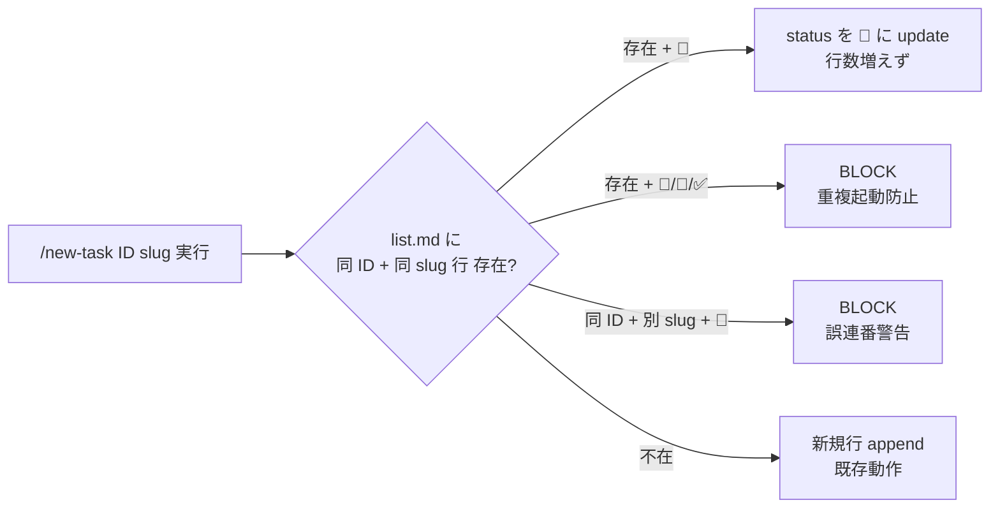

<!--
# 採用 6 条 (Task=Phase=N Step、2026-05-25 採用) metadata
total_steps: 5
-->

# Task #34: `/new-task` の 📝 → 🔲 update or append 動作実装

> Status: **🔄 進行中** (2026-05-25、Step 1+2 完了、Step 3 iter1 完了、Step 4 iter2 fix 待ち)
> 起案: 2026-05-25 (task #33 分割、旧 Phase 2)
> 関連: #33 (継承元 task)、#35/#36/#37 (兄弟分割 task)
> 設計起源: [`docs/draft/list-md-plan-first-normative.md`](../draft/list-md-plan-first-normative.md) §3 P2 (`/new-task` 動作拡張)

## Task ゴール

list.md **同 ID かつ 同 slug** (ID + slug の AND 一致 必須) の 📝 行が既存なら update (📝 → 🔲)、不在なら append する動作が `.claude/commands/new-task.md` で仕様化され helper script で機械実装される (観察可能: 同 ID + 同 slug の 📝 行が既存の list.md に対し `/new-task` 実行後、行数増えず status のみ変化、新 smoke `new-task-batch-update-smoke.sh` 3 cases PASS)。

## Task 作業概要

- `.claude/commands/new-task.md` に「📝 行 update or append」logic 明記 (✅ commit 2237515)
- bash helper script (`.claude/scripts/new-task-helper.sh`) 新設、`update_or_append_task_row()` 関数 (✅ commit 287eba7、83 LOC)
- 6 reviewer 並列 (architect/harness-opt/qa-expert/tdd-guide/pr-test-analyzer/code-reviewer) で iter cycle 5 回以内収束
- 新 smoke `new-task-batch-update-smoke.sh` 3 cases (update / append / batch 先置き整合性) PASS
- 6 reviewer iter1 findings (CRIT 3 + HIGH 17+ + MED 多数 + LOW 多数) を iter2 fix で解消

## Task 完了条件 (DoD)

- [x] `grep -q "📝 行 update" .claude/commands/new-task.md` exit 0 (Step 1)
- [x] `.claude/scripts/new-task-helper.sh` に `update_or_append_task_row()` 関数存在 (Step 2)
- [ ] 6 reviewer 全 approve / no objection (iter cycle 5 回以内収束、Step 3)
- [ ] 新 smoke `new-task-batch-update-smoke.sh` で 3 cases PASS (update / append / batch 先置き整合性) + 既存 11 smoke regression 0 (Step 4)
- [ ] リファクタリング 3 観点 (持続可能性 / 汎用性 / 非冗長化) 判定済 (Step 5)
- [ ] commit 完了 (Step 4-5 完了時点、push は user manual)

## Task 概要欄 (list.md 用、3 要素規範)

batch planning 経路 B の機械実装のため、`/new-task` の動作を「📝 既存行を 🔲 update」または「不在なら新規 append」に分岐し helper script で実装する。完成すれば AI が `/new-task` を batch planning 経路 B で実行した時に list.md の 📝 行を 🔲 に update できるようになり、batch 先置きフローが機械的に整合する。

## 背景・目的

task #33 で task-management.md §plan-first を追加し経路 B (batch planning) を規範化したが、`/new-task` の現実装は **1 task ずつ append** する仕様で経路 B の 📝 → 🔲 update に対応していない。本 task で `/new-task` 動作を update or append 分岐に拡張し、batch planning 経路 B が機械的に成立するようにする。

## 仕様（決定済）

draft §3 P2 採用。`.claude/commands/new-task.md` に動作仕様を明記、`.claude/scripts/new-task-helper.sh` で `update_or_append_task_row()` 関数として実装。

### 動作分岐

- list.md に **同 ID + 同 slug の 📝 行 既存** → status のみ 🔲 へ update (行数増えず)
- list.md に 同 ID 不在 → 新規行 append (既存動作)
- 同 ID + 別 slug の 📝 行 既存 → BLOCK (誤連番 / slug typo の可能性、user 通知)
- 同 ID + 同 slug で status が 📝 以外 (🔲/🔄/✅) → BLOCK (重複起動 / 完了済 task の上書き防止)

## 設計

draft §3 P2 + 6 reviewer iter1 findings 反映。

## TDD 戦略

### RED
新 smoke `new-task-batch-update-smoke.sh` を Step 4 で実装、3 cases (update / append / batch 先置き整合性) で動作仕様を検証。

### GREEN
- Step 1: `/new-task.md` 動作仕様 update (main 直接 Edit、`.claude/commands/` は新採用 6 条で main 編集可、ただし subagent staging 戦略が望ましい)
- Step 2: helper script 実装 (subagent staging、`.claude/scripts/new-task-helper.sh`)

### REFACTOR
- Step 5 で 3 観点 (持続可能性 / 汎用性 / 非冗長化) 判定、必要なら helper 関数の subshell 関数化 / config-loader source 等

## Step 計画

> **採用 6 条 (Task=Phase=N Step、2026-05-25 採用)** 準拠。Phase 中間階層なし、Task 直下 5 Step。

### Step 計画前の事前確認

`git log --all --grep "new-task" --grep "update_or_append" --oneline` で既存 commit 確認:
- `2237515` Step 1 (`/new-task.md` spec)
- `287eba7` Step 2 (helper script 新設)

### Step 一覧 (サマリ表)

| Step | Status | 作業概要 | 工数 | 依存 |
|:---:|:---:|:---|---:|:---|
| 1 | ✅ | `/new-task.md` 動作仕様 update or append 分岐化 (42 insertions/4 deletions) | 0.2h | — |
| 2 | ✅ | `.claude/scripts/new-task-helper.sh` 新設、`update_or_append_task_row()` 関数 (83 LOC) | 0.3h | Step 1 |
| 3 | ✅ | (テスト設計レビュー) 6 reviewer iter1 完了 (CRIT 3 + HIGH 17+ + MED 多数 + LOW 多数) | iter2-5 で 0.5h | Step 2 |
| 4 | 🔲 | (テスト合格) iter2 fix で 6 reviewer iter1 finding 解消 + 新 smoke 3 cases PASS + 既存 11 smoke regression 0 | 0.3h | Step 3 |
| 5 | 🔲 | (リファクタリング) 3 観点 (持続可能性 / 汎用性 / 非冗長化) 判定 | 0.1h | Step 4 |

合計工数: **1.4h** (元 Phase 2 工数 0.7 から iter cycle 込み実工数)

### Step 1: `/new-task.md` 動作仕様 update

**Step status**: ✅ 完了

**作業概要**: `.claude/commands/new-task.md` に「📝 行 update or append」logic を明記、step 3 (タスクファイル生成) と step 4 (list.md 行追加) の動作分岐を文書化。

**完了条件**:
- `grep -q "📝 行 update" .claude/commands/new-task.md` exit 0 ✅
- commit `2237515` (42 insertions/4 deletions)

### Step 2: helper script 新設 (subagent staging)

**Step status**: ✅ 完了

**作業概要**: `.claude/scripts/new-task-helper.sh` を subagent staging で新設、`update_or_append_task_row()` bash function を実装 (83 LOC)。

**完了条件**:
- `.claude/scripts/new-task-helper.sh` 存在 ✅
- `update_or_append_task_row()` 関数定義 grep 検証可能 ✅
- 動作 smoke 5/5 PASS (subagent 検証) ✅
- commit `287eba7`

### Step 3: (テスト設計レビュー) 6 reviewer 並列

**Step status**: ✅ iter1 完了 (iter2 fix は Step 4 で実行)

**作業概要**: 6 reviewer 動的選定 (architect / harness-optimizer / qa-expert / tdd-guide / pr-test-analyzer / code-reviewer) を並列起動、bash function 品質観点深化のため code-reviewer 追加。

**完了条件 (iter cycle 5 回以内収束)**:
- 全 reviewer approve / no objection
- iter cycle 5 回以内

**iter1 findings (CRIT 3 + HIGH 17+ + MED 多数 + LOW 多数、median confidence 0.89)**:

#### CRIT 3 件 (qa-expert 実測実証)

- **C-01**: 同 ID + 別 slug + 📝 既存 → BLOCK されず APPEND (誤連番検知失敗)
- **C-02**: slug substring false match (`foo` が `foo-bar` を誤マッチ)
- **C-03**: 混在 status 時 UPDATE 前 conflict check skip (同 ID で 📝/🔲 混在状態で UPDATE 暴走)

#### HIGH 17+ 件 (重複統合後 ~10 件)

- **H-01**: regex injection (id `.` / slug 特殊文字 で grep pattern 破壊)
- **H-02**: UTF-8 multi-byte `[^📝]` false negative (絵文字 4-byte で character class 不成立)
- **H-03**: awk -v backslash interpretation (引数 escape 不足で awk 動作不定)
- **H-04**: echo append EOL 欠落 (file 末尾改行なし時の append 行で前行末尾結合)
- **H-05**: awk tmp file race + cleanup (並列 `/new-task` 実行時の tmp file 競合)
- **H-06**: set -uo pipefail file-top leak (Critical Lesson HIGH 違反、caller の shell flags leak)
- **H-07**: HC_TASK_DIR 未参照 (Design Constraints 違反、`docs/tasks/` hardcode)
- **H-08**: 同 ID + 別 slug + 📝 → BLOCK 規範違反 (規範 §3 ID + slug AND 一致必須に未準拠)

#### MED 多数

- フロー順序 (Step 1 → 2 → 3 → 4 で test mock 並び確認)
- row_content format validation
- grep -c exit 2 race
- smoke 計画曖昧
- 統合経路未定義

#### LOW 多数

- cosmetic / 文書 drift / cleanup

### Step 4: (テスト合格) iter2 fix + 新 smoke 3 cases PASS

**Step status**: 🔲 未着手

**作業概要**: 6 reviewer iter1 findings (CRIT 3 + HIGH 17+ + MED + LOW) を iter2 fix で解消 (subagent staging で `new-task-helper.sh` fix)、新 smoke `new-task-batch-update-smoke.sh` 3 cases (update / append / batch 先置き整合性) PASS + 既存 11 smoke regression 0。iter cycle 5 回以内で strict 0-finding 収束。

**完了条件**:
- iter2 fix 実装完了 (subagent staging、`.claude/scripts/new-task-helper.sh` 改修)
  - 主要 fix: regex escape (id `.` / slug 特殊文字)、awk ENVIRON 経由 env 受渡、printf EOL guard、mktemp + trap cleanup、config-loader source、row_content validation、subshell 関数化 (set -e leak 解消)、`[^📝]` UTF-8 multi-byte 対応 (`grep -v "📝"` で character class 回避)、同 ID + 別 slug + 📝 → BLOCK 実装
- 新 smoke `new-task-batch-update-smoke.sh` で **3 cases** PASS:
  - Case 1 (update mode): list.md に同 ID + 同 slug 📝 行 既存 + `/new-task` 実行 → 行数増えず status 🔲 へ変化
  - Case 2 (append mode): list.md 同 ID 不在 + `/new-task` 実行 → 新規行 append
  - Case 3 (batch 先置き整合性): list.md に 📝 N 行 batch 先置き後、同 ID で `/new-task` 連続実行 → 各行 status 順次 update、行重複なし
- **実行時間制約 (pr-test-analyzer M-02)**: N=3 (最小 MECE batch) で必ず検証、N=10 でも smoke 全体実行時間 10 秒以内完了
- 既存 11 smoke regression 0 (`bash .claude/tests/task-rule-guard-smoke.sh` exit 0)
- iter cycle 5 回以内収束 (上限超過時 user escalation、bypass: `ECC_TEST_DESIGN_REVIEW_OFF=1`)
- 6 reviewer 再起動で全 approve / no objection

### Step 5: (リファクタリング) 3 観点判定

**Step status**: 🔲 未着手

**作業概要**: `new-task-helper.sh` を 3 観点 (持続可能性 / 汎用性 / 非冗長化) で見直し、必要なら refactor or skip 明示。

**完了条件 (or skip)**:
- 持続可能性: 関数 LOC < 50 / magic number 排除 / 副作用局所化 確認
- 汎用性: 引数化 / 抽象依存 / test seam 確認
- 非冗長化: DRY / table-driven 化 / util 再発明排除 確認
- refactor 実施なら指標明示 / 不要なら `skip: <reason>` 明示記録

## 工数見積

合計 **1.4h** (Step 1: 0.2 + Step 2: 0.3 + Step 3: iter2-5 で 0.5 + Step 4: 0.3 + Step 5: 0.1)。

## 影響範囲

| 範囲 | 詳細 |
|---|---|
| ファイル | `.claude/commands/new-task.md` / `.claude/scripts/new-task-helper.sh` (新設) / 新 smoke `.claude/tests/new-task-batch-update-smoke.sh` |
| migration | なし |
| 環境変数 | `HC_TASK_DIR` 参照 (Design Constraints 遵守、config-loader.sh 経由) |
| 互換性 | append 既存動作保持で backward 互換、update 動作は経路 B opt-in |

## 再発防止

- 6 reviewer 並列で bash function 品質観点深化 (code-reviewer 追加で regex injection / UTF-8 / awk escape / config-loader 違反 / set -uo pipefail leak 等を iter1 で発見)
- 新 smoke で update vs append 動作分岐を 3 cases で機械検証 → 後続変更時の regression 防止
- helper script は `.claude/scripts/` 配下、subagent staging 戦略で main 直接編集回避 (CLAUDE.md Critical Lessons HIGH 遵守)

## ステータスログ

| 日付 | 状態 | 備考 |
|---|---|---|
| 2026-05-25 | 起案 | task #33 着手後、採用 6 条 supersede で旧 Phase 2 を本 task に分割 |
| 2026-05-25 | 着手 | branch `feat/list-md-plan-first-normative` (task #33 から継承) |
| 2026-05-25 | Step 1 完了 | commit `2237515` (`/new-task.md` spec) |
| 2026-05-25 | Step 2 完了 | commit `287eba7` (helper script 83 LOC) |
| 2026-05-25 | Step 3 iter1 完了 | 6 reviewer 並列、CRIT 3 + HIGH 17+ + MED + LOW finding、median confidence 0.89 |
| TBD | Step 4 完了 | iter2 fix + 新 smoke 3 cases PASS + 既存 11 smoke regression 0 |
| TBD | Step 5 完了 | リファクタリング 3 観点判定 |
| TBD | Task 完了 | 全 Step ✅、commit (push は user manual) |

## 派生 task / 次アクション候補

### 暫定候補 (実装着手時に発見次第追記)

- [ ] (🟢) helper script の汎用化 (他 command でも使う ID + slug check pattern 抽出): 本 task scope 外、parking-lot 検討

### 関連

- [`next-actions.md`](next-actions.md) — entry #21 (継承元 task #33 と共有)
- [`.claude/rules/development-process.md`](../../.claude/rules/development-process.md) §「サブエージェント `.claude/` 編集の staging 戦略」

## 関連

- Draft: [`docs/draft/list-md-plan-first-normative.md`](../draft/list-md-plan-first-normative.md) §3 P2
- 継承元: #33 (task-management.md §plan-first 規範化)
- 兄弟分割: #35 / #36 / #37
- 既存実装:
  - `.claude/commands/new-task.md` (Step 1 対象)
  - `.claude/scripts/new-task-helper.sh` (Step 2 で新設)
- 関連 hook: `task-rule-guard.sh` (Step 4 smoke で regression 確認)
- 起源: task #33 着手時の採用 6 条 supersede による分割 (2026-05-25)
