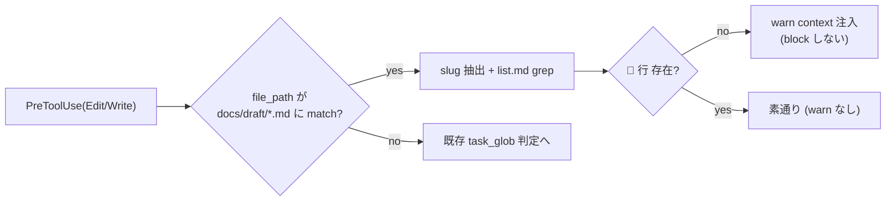

<!--
# 採用 6 条 (Task=Phase=N Step、2026-05-25 採用) metadata
total_steps: 4
-->

# Task #36: `task-rule-guard.sh` PreToolUse(Write `docs/draft/*.md`) で 📝 不在 warn

> Status: **🔲 未着手** (2026-05-25 起案、task #34+#35 完了後着手予定)
> 起案: 2026-05-25 (task #33 分割、旧 Phase 4)
> 関連: #33 (継承元 task)、#34 (兄弟分割 task、依存先)、#35/#37 (兄弟分割 task)
> 設計起源: [`docs/draft/list-md-plan-first-normative.md`](../draft/list-md-plan-first-normative.md) §3 P5 (task-rule-guard 拡張)

## Task ゴール

`Write(docs/draft/<slug>.md)` 発生時、list.md に対応 slug の 📝 行が不在なら warn context が注入されることが smoke で検証される (観察可能: `task-rule-guard-smoke.sh` Case 12 で 📝 不在 → warn、Case 13 で 📝 存在 → 素通り、計 13 cases PASS)。

## Task 作業概要

- `task-rule-guard.sh` の既存 PreToolUse(Edit/Write) hook を拡張 (subagent staging)
- tool_input.file_path が `docs/draft/*.md` pattern に match する場合に slug 抽出 + list.md grep
- slug 抽出: file_path から `docs/draft/<slug>.md` の `<slug>` を basename + .md strip で取得
- list.md grep: `grep -E "^\| [0-9]+ \| 📝 .* ${slug}" docs/tasks/list.md`
- 不在なら warn context 注入 (block しない、honor system)
- smoke 拡充 11→13 cases (2 new case: 📝 不在で warn / 📝 存在で素通り)

## Task 完了条件 (DoD)

- [ ] hook 拡張完了 (`.claude/hooks/task-rule-guard.sh` PreToolUse 拡張)
- [ ] フィルタ順序 (H-02 HIGH) 反映: 既存 `task_glob` early-exit 前に draft path 判定挿入 (or 分岐追加)
- [ ] slug 抽出 + list.md grep 動作確認
- [ ] warn context 注入 (block しない、honor system)
- [ ] 5+ reviewer 全 approve / no objection (iter cycle 5 回以内収束、Step 2)
- [ ] smoke 拡充 11→13 cases PASS + 既存 smoke regression 0 (Step 3)
- [ ] リファクタリング 3 観点判定済 (Step 4)
- [ ] commit 完了 (push は user manual)

## Task 概要欄 (list.md 用、3 要素規範)

draft 起案時の plan-first 不在検出のため、`task-rule-guard.sh` を拡張し Write(`docs/draft/*.md`) 時に list.md に対応 slug の 📝 行が不在なら warn context を注入する。完成すれば AI が draft 起案時に list.md plan-first 先置きを忘れた際に Write tool 経由でリアルタイム警告を受けられるようになる。

## 背景・目的

task #35 で SessionStart hook により plan-first 不在を検出するが、SessionStart は session 開始 1 回のみ。session 中に draft 起案を進めるタイミングでの追加注意が必要。

本 task では `task-rule-guard.sh` の PreToolUse(Write `docs/draft/*.md`) で list.md grep を行い、対応 slug の 📝 行が不在なら warn context を注入する (block しない、honor system)。SessionStart hook + PreToolUse hook の 2 段構えで plan-first 不在を構造的に補完する。

Bash slash command (`/new-draft <slug>`) は task-rule-guard.sh の現アーキ (Edit/Write tool のみ処理) で intercept 不可、Write tool 経由で代替 (R-03 finding 反映、本 task scope に明記)。

## 仕様（決定済）

draft §3 P5 採用。task-rule-guard.sh PreToolUse(Edit/Write) hook を拡張。

### slug 抽出 + 検出ロジック

- tool_input.file_path が `docs/draft/*.md` pattern に match する場合のみ処理
- slug 抽出: `basename "$file_path" .md` で `<slug>` 取得
- list.md grep: `grep -E "^\| [0-9]+ \| 📝 .* ${slug}" docs/tasks/list.md`
- 不在なら warn context 注入: `hookSpecificOutput.additionalContext` に「先に list.md に 📝 行を先置きするか、master roadmap で計画段階を明示」keyword 含む
- 複数マッチ時は最初の 1 件のみ参照
- 厳密一致 (kebab-case slug substring match で False positive 回避: word boundary 適用)

### フィルタ順序 (H-02 HIGH 反映)

既存 `task-rule-guard.sh` L106-111 で `task_glob="*/${HC_TASK_DIR}/*"` ( = `*/docs/tasks/*`) に match しない path は `echo '{}'; exit 0` で early-exit。`docs/draft/*.md` はこのフィルタを通過せず到達不能になる。

**対処** (採用):
- 案 A: L106 以前に draft path 判定を挿入 (新 logic を先に処理)
- 案 B: 既存フィルタ後の early-exit を draft path の場合 skip する分岐追加

**採用: 案 A** (新 logic を early-exit 前に配置、既存挙動 100% 保護)。L111 以降に追記しても warn 一切発火しない無音障害になるため必須。

## 設計

draft §3 P5 + R-03 (Bash slash command intercept 不可) + H-02 (フィルタ順序) 反映。

## TDD 戦略

### RED
新 case 2 件 (Case 12: 📝 不在 → warn / Case 13: 📝 存在 → 素通り) を `task-rule-guard-smoke.sh` に追加、Step 3 で実装。

### GREEN
- Step 1: hook 拡張 (subagent staging で `.claude/hooks/task-rule-guard.sh`)

### REFACTOR
- Step 4 で 3 観点判定 (skip 想定: 2 case 追加 + 約 20 LOC、既存関数の汎用抽出余地なし)

## Step 計画

> **採用 6 条 (Task=Phase=N Step、2026-05-25 採用)** 準拠。Phase 中間階層なし、Task 直下 4 Step。

### Step 計画前の事前確認

- `git log --all --grep "task-rule-guard" --grep "draft-warn" --oneline` で既存 commit 確認 (新規実装のため既存解消 commit なし)
- 既存 `task-rule-guard.sh` を Read し L106-111 フィルタ位置確認

### Step 一覧 (サマリ表)

| Step | Status | 作業概要 | 工数 | 依存 |
|:---:|:---:|:---|---:|:---|
| 1 | 🔲 | task-rule-guard.sh 拡張 (subagent staging、フィルタ順序 L106 以前に draft path 判定挿入) | 0.2h | — |
| 2 | 🔲 | (テスト設計レビュー) 5+ reviewer 動的選定、iter cycle 5 回以内収束 | 0.5h | Step 1 |
| 3 | 🔲 | (テスト合格) smoke 拡充 11→13 cases PASS + 既存 smoke regression 0 | 0.2h | Step 2 |
| 4 | 🔲 | (リファクタリング) 3 観点判定 (skip 想定: 2 case 追加 + 約 20 LOC、helper 抽出余地なし) | 0.1h | Step 3 |

合計工数: **1.0h** (元 Phase 4 工数 0.4 から iter cycle 込み実工数)

### Step 1: task-rule-guard.sh 拡張 (subagent staging)

**Step status**: 🔲 未着手

**作業概要**: `.claude/hooks/task-rule-guard.sh` の既存 PreToolUse(Edit/Write) hook を拡張。tool_input.file_path が `docs/draft/*.md` pattern match する場合に slug 抽出 + list.md grep + 📝 不在 warn 注入。フィルタ順序は L106 以前に draft path 判定挿入 (新 logic 先処理)。

**完了条件**:
- hook 拡張済、新 logic grep 検証可能
- **⚠️ フィルタ順序 (H-02 HIGH 反映)**: L106 以前に draft path 判定を挿入 (L111 以降追記は到達不能で無音障害)
- subagent staging 戦略遵守 (`/tmp` Write → mv `.claude/hooks/`)

### Step 2: (テスト設計レビュー)

**Step status**: 🔲 未着手

**作業概要**: 5+ reviewer 動的選定 (tdd-guide / test-automator / qa-expert / pr-test-analyzer + harness-optimizer)、並列起動、収束まで反復 (上限 5 回、超過時 user escalation、bypass: `ECC_TEST_DESIGN_REVIEW_OFF=1`)。

**完了条件**:
- 全 reviewer approve / no objection
- iter cycle 5 回以内収束

### Step 3: (テスト合格) smoke 拡充 11→13 cases PASS

**Step status**: 🔲 未着手

**作業概要**: `task-rule-guard-smoke.sh` に新 case 2 件追加。fixture (list.md + draft file) を準備し hook stdin で Write tool_input を流し output JSON の `hookSpecificOutput.additionalContext` を jq で抽出 + grep 検証。

**完了条件**:
- smoke 拡充 11→13 cases PASS:
  - **Case 12 (📝 不在 → warn)**: fixture で list.md に対応 slug の 📝 行が **無い**状態 + Write(`docs/draft/<slug>.md`) tool_input を hook stdin → output JSON の `hookSpecificOutput.additionalContext` に「先に list.md に 📝 行を先置きするか、master roadmap で計画段階を明示」keyword 含まれることを `jq -r '.hookSpecificOutput.additionalContext' | grep -q "plan-first"` で検証
    - **jq path 注意**: トップレベル `additionalContext` 参照は常時 null で偽陰性化するため禁止、必ず `.hookSpecificOutput.additionalContext` で参照 (task-rule-guard.sh の実出力構造 `{"hookSpecificOutput":{"hookEventName":"PreToolUse","additionalContext":"..."}}` と整合)
  - **Case 13 (📝 存在 → 素通り)**: fixture で list.md に対応 slug の 📝 行が **既存**状態 + 同 Write tool_input → output JSON の `hookSpecificOutput.additionalContext` が **無い** or warn keyword **含まれない**ことを `jq -r '.hookSpecificOutput.additionalContext // ""' | grep -qv "plan-first"` で検証
- 既存 11 cases regression 0 (`bash .claude/tests/task-rule-guard-smoke.sh` exit 0)

### Step 4: (リファクタリング) 3 観点判定 (skip 想定)

**Step status**: 🔲 未着手

**完了条件**: `skip: task-rule-guard.sh への 2 case 追加 (約 20 LOC) のみ、既存関数の汎用抽出余地なし、refactor 対象パターンなし` 明示記録 (or 実施なら 3 観点指標明示)

## 工数見積

合計 **1.0h** (Step 1: 0.2 + Step 2: 0.5 iter cycle + Step 3: 0.2 + Step 4: 0.1)。

## 影響範囲

| 範囲 | 詳細 |
|---|---|
| ファイル | `.claude/hooks/task-rule-guard.sh` (既存拡張) / `.claude/tests/task-rule-guard-smoke.sh` (11→13 cases 拡充) |
| migration | なし |
| 環境変数 | 既存 `HC_TASK_DIR` / `HC_DRAFT_DIR` 参照 (config-loader 経由) |
| 互換性 | 既存 11 cases 不変、新 case 2 件追加で backward 互換 |

## 再発防止

- PreToolUse(Write `docs/draft/*.md`) で plan-first 不在をリアルタイム警告 → AI 判断ミス の構造的補完
- SessionStart hook (task #35) + PreToolUse hook (本 task) の 2 段構えで plan-first 不在を多重検出
- フィルタ順序 (H-02 HIGH) の教訓: 新 logic を early-exit 前に配置しないと無音障害、本 task で実証 + 規範化

## ステータスログ

| 日付 | 状態 | 備考 |
|---|---|---|
| 2026-05-25 | 起案 | task #33 着手後、採用 6 条 supersede で旧 Phase 4 を本 task に分割 |
| TBD | 着手 | branch `feat/list-md-plan-first-normative` (task #33 から継承) or 新 branch |
| TBD | Step 1 完了 | commit `<sha>` |
| TBD | Step 2-3 完了 | commit `<sha>` |
| TBD | Step 4 完了 | リファクタリング 3 観点判定 (skip 想定) |
| TBD | Task 完了 | 全 Step ✅、commit (push は user manual) |

## 派生 task / 次アクション候補

### 暫定候補 (実装着手時に発見次第追記)

- [ ] (🟢) Bash slash command (`/new-draft`) intercept 機構 (現アーキ Edit/Write tool のみ処理の制約解消): 本 task scope 外、parking-lot 検討
- [ ] (🟢) フィルタ順序教訓を CLAUDE.md Critical Operational Lessons に追加: task #37 (統合) で実装検討

### 関連

- [`next-actions.md`](next-actions.md) — entry #21 (継承元 task #33 と共有)
- [`.claude/rules/development-process.md`](../../.claude/rules/development-process.md) §「サブエージェント `.claude/` 編集の staging 戦略」

## 関連

- Draft: [`docs/draft/list-md-plan-first-normative.md`](../draft/list-md-plan-first-normative.md) §3 P5
- 継承元: #33 (task-management.md §plan-first 規範化)
- 兄弟分割: #34 (`/new-task` update or append) / #35 (SessionStart hook) / #37 (統合)
- 既存実装: `.claude/hooks/task-rule-guard.sh` (Step 1 拡張対象、L106-111 フィルタ順序要確認)
- 関連 smoke: `.claude/tests/task-rule-guard-smoke.sh` (11→13 cases 拡充対象)
- 起源: task #33 着手時の採用 6 条 supersede による分割 (2026-05-25)
